= Path Tracing with ADRT
:doctype: article
:toc:
:toclevels: 3

ADRT (the _Advanced Distributed Ray Tracer_) is BRL-CAD's triangle-based
rendering engine.  Alongside the usual scanline shaders it carries a
Monte-Carlo *path tracer* that computes global illumination -- soft ambient
light, contact shadows, and diffuse color bleeding -- by tracing many random
light paths per pixel.  This article explains how ADRT is put together and
walks through producing path-traced images with the standalone `adrt`
command, comparing the result to `rt`'s ambient-occlusion lighting.

.Path-traced global illumination: the Cornell box rendered with `adrt -m path`
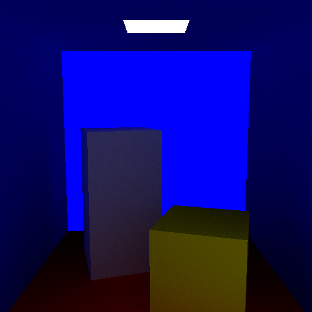

== How ADRT works

ADRT is layered on top of BRL-CAD's *TIE* (Triangle Intersection Engine), the
same SIMD-friendly kd-tree ray tracer used by `rtwizard`, `nirt`'s mesh mode,
and the geometry viewers.  Because TIE only intersects triangles, ADRT first
*tessellates* geometry:

* Bags-of-triangles (BoT) are handed to TIE directly.
* Every other solid (CSG primitives, NMG, etc.) is tessellated to triangles as
  the database tree is walked.  Region colors are carried onto the resulting
  meshes, and regions whose material shader is a light source (the classic
  `light` shader or an OSL `emitter`) are marked *emissive*.

Rendering itself lives in *librender* (`src/adrt/librender`), a small library of
interchangeable shaders selected by name:

[cols="1,4"]
|===
|`path`   |Monte-Carlo path tracer (global illumination)
|`phong`  |Direct Phong lighting from the eye
|`normal` |Surface normals encoded as RGB
|`depth`  |Camera-space depth
|`flat`   |Flat region color
|`component`, `cut`, `flos`, `grid`, `spall`, `surfel` |Analysis shaders
|===

Several front ends drive that library:

* *`adrt`* -- a single-process, headless renderer that writes an image file.
  This is the tool used throughout this article.
* *`isst`* -- an interactive Tcl/Tk + OpenGL viewer for real-time fly-throughs.
* *`adrt_master`* / *`adrt_slave`* -- a networked master/worker pair (the
  "distributed" in ADRT) that farms tiles out to compute nodes for an external
  observer.

== Rendering a path-traced image

The `adrt` command loads a `.g` database, frames the requested objects, renders
one frame, and writes the image (the extension selects the format):

----
adrt [options] model.g object [object ...]
----

[cols="1,4"]
|===
|`-o file`   |Output image; extension picks the format (default `adrt.png`)
|`-s N`      |Square image size in pixels (default 512); or `-w`/`-n` for width/height
|`-m mode`   |Shader: `path`, `phong`, `normal`, `depth`, `flat` (default `path`)
|`-H N`      |Path-tracer samples per pixel (default 32) -- more samples, less noise
|`-a` / `-e` |View azimuth / elevation in degrees (default 35 / 25)
|`-E x,y,z`  |Explicit eye point in model units (overrides `-a`/`-e`)
|`-L x,y,z`  |Explicit look-at point (default: model center)
|`-p fov`    |Perspective half-angle in degrees (default 25)
|`-C r/g/b`  |Environment/sky color, 0-255 (default `230/237/255`)
|`-P N`      |Render threads (default: all CPUs)
|===

A first render of the sample toy jeep:

----
adrt -s 512 -H 256 -a 35 -e 25 -o toyjeep.png toyjeep.g all
----

`adrt` reports the triangle count, load time, and render time, then writes the
PNG.  The camera is a perspective camera aimed at the model center; `-a`/`-e`
orbit it and `-p` sets the field of view.  For scenes that are not simply
oriented -- an enclosed, Y-up Cornell box, for instance -- give an explicit eye
and look-at point instead:

----
adrt -s 512 -H 512 -E 278,370.9,-454 -L 278,274,279 -p 25 \
     -o cornell.png cornell-kunigami.g all.g
----

=== The environment and ambient light

Rays that leave the scene without hitting anything pick up light from a built-in
environment: a vertical gradient of the sky color, full strength overhead and
dimming toward the ground.  This "overcast sky" is what illuminates open
scenes.  With diffuse surfaces it produces physically-based *ambient occlusion*
for free -- up-facing faces catch the bright sky while crevices and undersides
fall into shadow -- and it also paints the graduated background.  `-C` tunes the
sky color and brightness (a brighter sky lifts flat, light-colored surfaces).

Enclosed scenes such as the Cornell box see no sky; there, the emissive light
region is the only source, and the interior is lit entirely by bounced,
indirect light.

== Path tracing versus `rt` ambient occlusion

`rt`, BRL-CAD's production CSG ray tracer, approximates indirect shading with an
*ambient occlusion* pass, enabled with a nonzero ambient factor and a sample
count:

----
rt -A1.1 -c "set ambSamples=128" -s512 -a35 -e25 -o out.png model.g object
----

The panels below compare, for the same view, ADRT's path tracer against `rt`
with full lighting only and `rt` with ambient occlusion added.  ADRT's path
tracer resolves the sky illumination and soft inter-surface shadowing in a
single physically-based pass; `rt`'s ambient occlusion darkens cavities on top
of its direct lighting model.

.Toy jeep -- `adrt -m path` / `rt` full lighting / `rt` ambient occlusion
[cols="1,1,1",frame=none,grid=none]
|===
|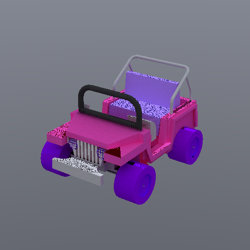
|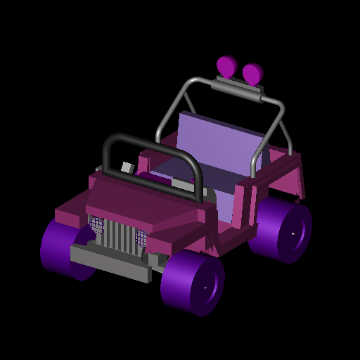
|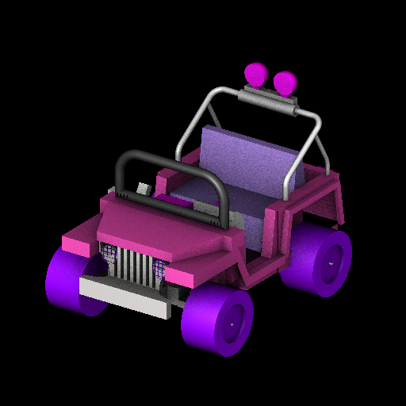
|*adrt path traced*
|*rt full lighting*
|*rt ambient occlusion*
|===

.Chessboard -- `adrt -m path` / `rt` full lighting / `rt` ambient occlusion
[cols="1,1,1",frame=none,grid=none]
|===
|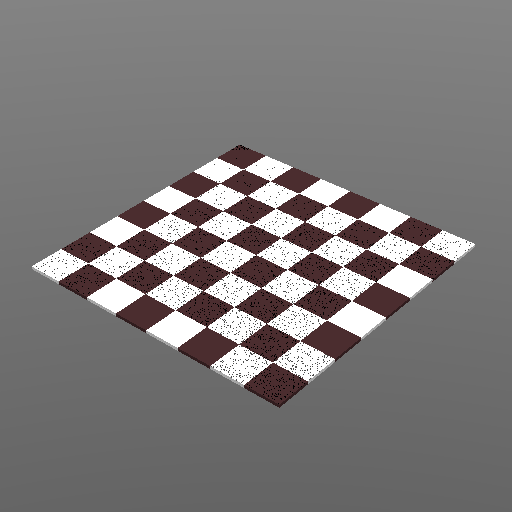
|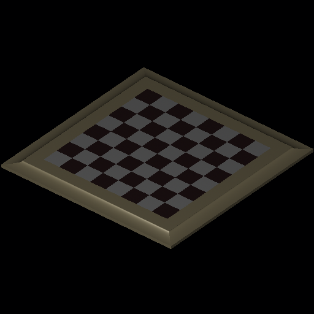
|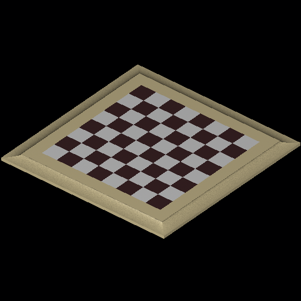
|*adrt path traced*
|*rt full lighting*
|*rt ambient occlusion*
|===

== Global illumination: the Cornell box

The Cornell box is the classic test of indirect lighting: a closed room lit only
by a small ceiling panel.  ADRT detects the emissive light region and lets the
path tracer bounce that light around the room.  Compared with the direct-only
`phong` shader, the path-traced image adds the glowing light source, soft
shadows beneath the blocks, and *color bleeding* -- the red floor and blue walls
tint the neighboring surfaces.

.Cornell box -- `adrt -m path` (global illumination) versus `adrt -m phong` (direct only)
[cols="1,1",frame=none,grid=none]
|===
|
|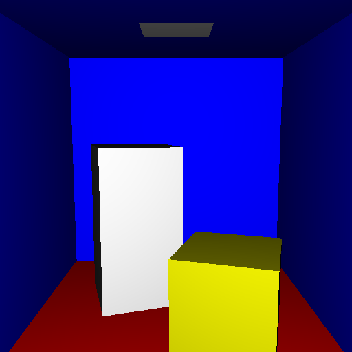
|*Path traced:* area light, soft shadows, color bleeding
|*Phong:* direct lighting only, no indirect light
|===

== Complex CSG: facetize first

ADRT tessellates as it loads, but a few heavily-booleaned models do not survive
on-the-fly NMG evaluation -- the sample `castle`, whose whole structure is one
region unioning dozens of instanced solids, is one.  `rt` traces it natively as
CSG, but for ADRT the robust path is to convert it to a triangle mesh once with
the Manifold-based facetizer, then render the mesh:

----
# in mged, on a working copy of the database
facetize -o castle_bot all.g/castle

adrt -s 512 -H 256 -a 135 -e 30 -o castle.png castle.g castle_bot
----

.Castle -- facetized then `adrt -m path` / `rt` full lighting / `rt` ambient occlusion
[cols="1,1,1",frame=none,grid=none]
|===
|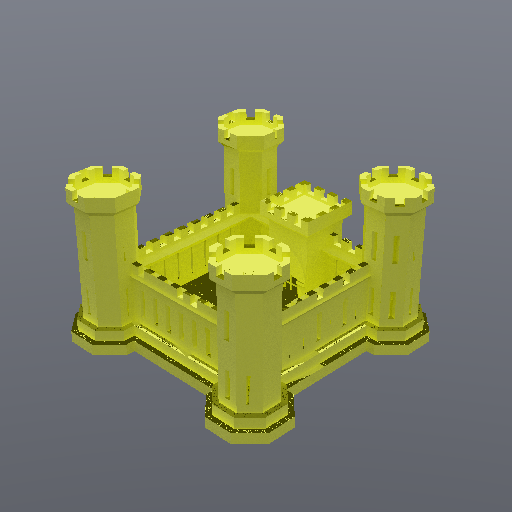
|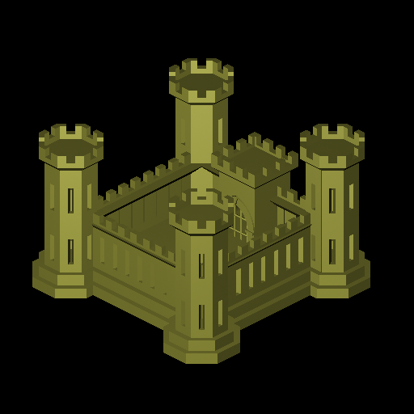
|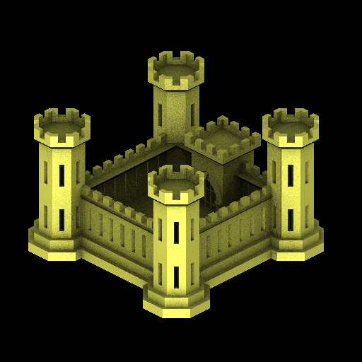
|*adrt path traced*
|*rt full lighting*
|*rt ambient occlusion*
|===

== Other shading modes

The same `adrt` invocation reaches librender's analysis shaders through `-m`,
useful for inspecting form and orientation without lighting:

[cols="1,1,1",frame=none,grid=none]
|===
|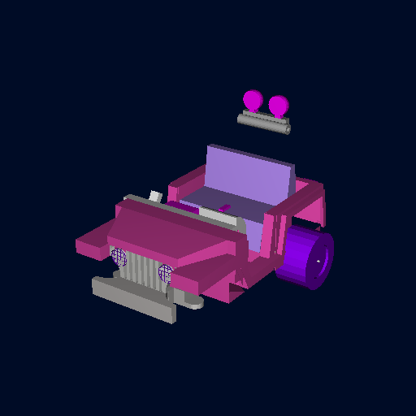
|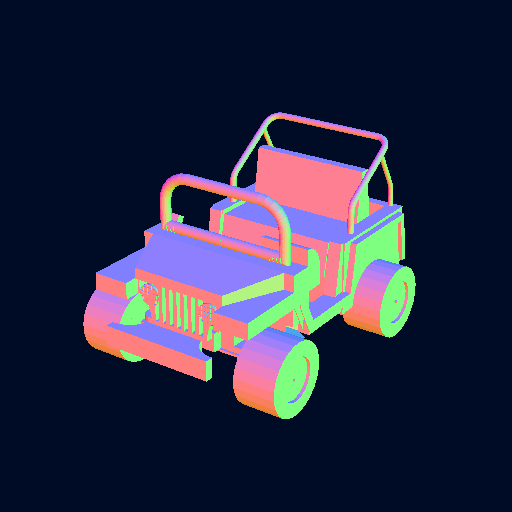
|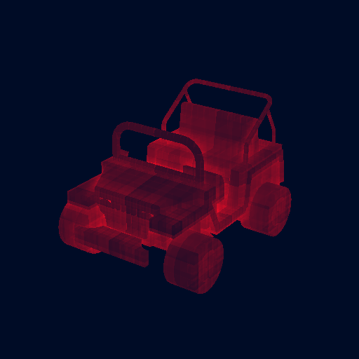
|*`-m phong`* direct lighting
|*`-m normal`* surface normals
|*`-m depth`* camera depth
|===

== Notes and limitations

* The path tracer is a straightforward forward tracer with no next-event
  estimation or denoising.  Raise `-H` to reduce Monte-Carlo noise; large
  perfectly-diffuse, high-albedo surfaces are the noisiest.
* Materials are approximated: regions render as opaque diffuse surfaces using
  their region color, `light`/`emitter` regions become area lights, and
  specular/refractive shaders are not yet modeled.
* Only triangle-representable geometry contributes.  Non-tessellatable solids
  (for example infinite half-spaces) are skipped outright.
* More subtly, a CSG region whose on-the-fly NMG boolean evaluation *fails* is
  silently omitted -- it contributes no triangles and simply disappears, while
  the rest of the model still renders.  The load log flags these as `FAILED in
  boolean evaluation: <path>`.  Because the failure is per region, the result
  can look complete while quietly missing parts (a wheel, a roll bar).  When
  fidelity matters, facetize the model first with the far more robust
  Manifold facetizer (see <<Complex CSG: facetize first>>) and render the mesh.

[NOTE]
====
The images in this article are a committed snapshot.  Developers can regenerate
them from the built tools by configuring with
`-DBRLCAD_GENERATE_ADRT_GALLERY=ON` and building the `adrt-pathtrace-snapshot`
target.
====
