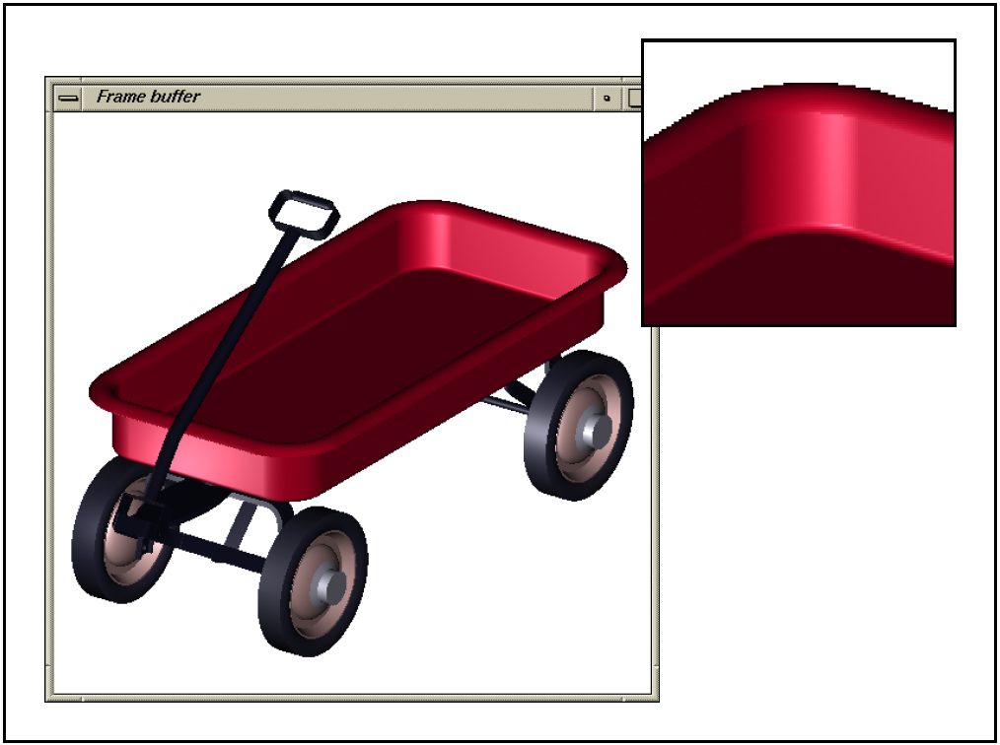
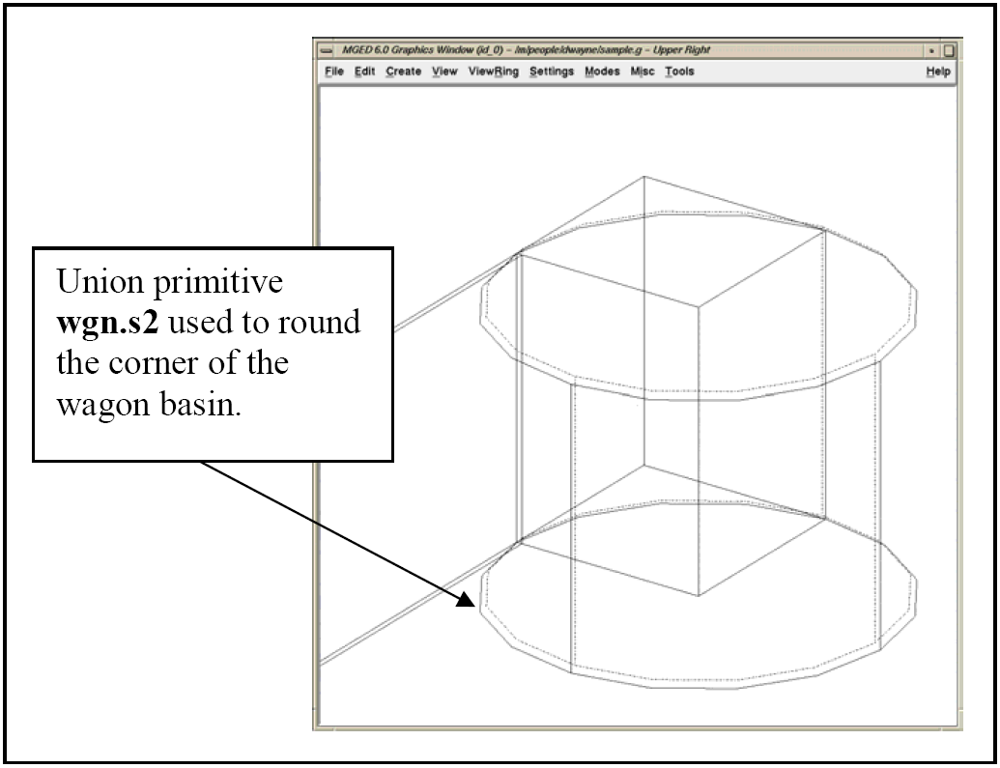
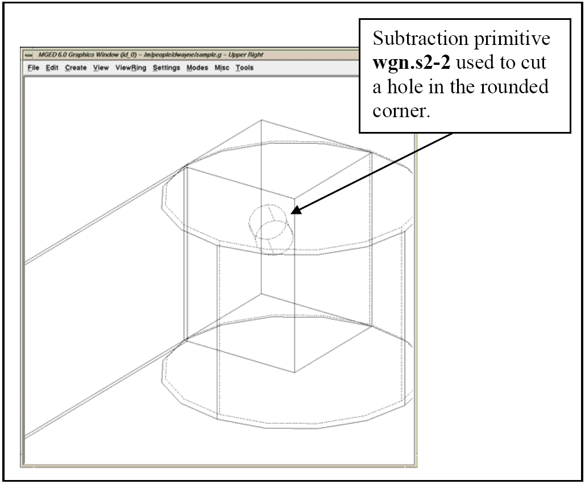
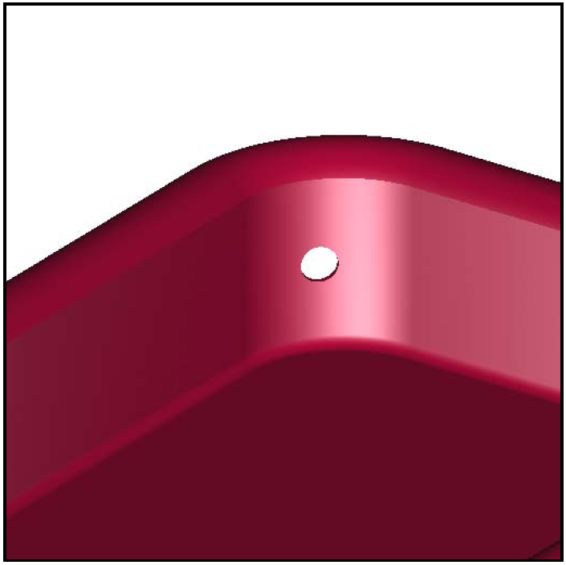

= Using the build_region Command
Lee A Butler; Eric W Edwards; Dwayne L Kregel
:doctype: article
:toc:
:toclevels: 3

Just as the Build Pattern tool can help automate the process of building multiple occurrences of objects, the build_region command can help automate the process of creating regions. The command (which currently has no graphical user interface equivalent) uses meaning assigned by the user in the primitive name based on the intended use of the primitive.

The user includes the Boolean operation and relational information in the name of the primitive using a simple naming convention. The naming convention is designed around the following two assumptions:

* The same text "tag" is used for all primitives in a region.
* A sequential numbering pattern is used.

For example, let's say we want to build the four rounded corners of a "tub" region for a toy metal wagon assembly (see Figure F-1). We could choose something such as "wgn"--an abbreviated form of "wagon"--as the tag. This tag is short, easy to type, and representative of the final assembly name. Our primitives would therefore be of the form wgn.s#.

[[build_region5]]
.The rounded corners of a toy wagon.

Next, we create an arb8 for one long side of the wagon tub. It is named wgn.s1. After that, we create an rcc for one corner of the tub. It is named wgn.s2. To get a hollow quarter cylinder, we need to subtract a cylinder and intersect a bounding box (see Figure F-2). In order to relate the subtraction and intersecting primitives with wgn.s2, they will each share the same root name, wgn.s2. The subtraction primitive will be named wgn.s2-1, and the intersecting primitive will be named wgn.s2+1.

[[build_region7]]
.Arb8, cylinder, and two Boolean primitives.

Now we have created the following four primitives:

....

wgn.s1 wgn.s2 wgn.s2+1 wgn.s2-1
    
....

If we separate the primitives sequentially as follows,

....

wgn.s1

wgn.s2 wgn.s2+1 wgn.s2-1,
    
....

we can begin to see the Boolean structure falling out of the naming convention

....

u wgn.s1

u wgn.s2 + wgn.s2+1 - wgn.s2-1
    
....

If we wanted to make a second subtraction from wgn.s2--say, for a drain hole in the corner of the wagon--we would name that primitive wgn.s2-2 (see Figure F-3). We can break this name down as follows: *****NEED IMAGE HERE*****

[[build_region9]]
.The region and the subtraction primitives.

Note that the root name stays the same so we can maintain the relationship, and the second number (associated with the Boolean operation) is incremented sequentially.

[[build_region11]]
.Raytraced image with hole.

Obviously, the overall success or failure of the build_region command depends on primitives being named properly. But if they are, the command can organize them in one automated step, creating complex regions in just a few keystrokes.

Another modeling benefit of the build_region tool is that it allows the user to quickly organize primitives. Assume, for example, that we have used the aforementioned naming convention to construct a complicated region. If there was a subsection of the region that we needed to, say, keep out for another assembly, delete from our database, move slightly, or copy, it would be a simple matter to create a new region with just those primitives that we needed.

