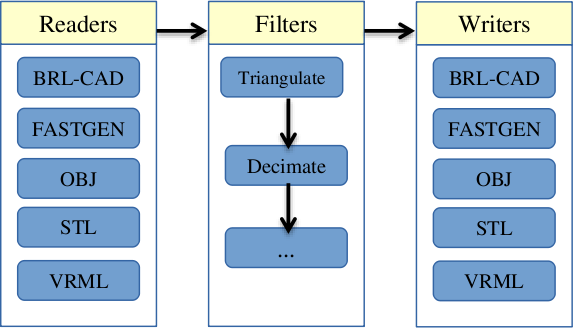
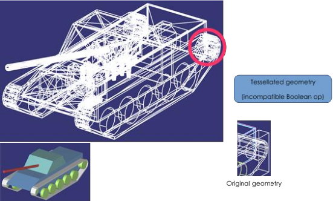
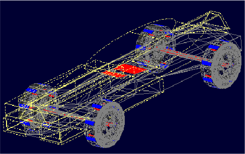

= The Geometry Conversion Library
Jon Engbert
:doctype: article
:toc:
:toclevels: 3

== Introduction

The Geometry Conversion Library (GCV or libgcv) provides a unified API for geometry conversion capabilities under a plugin-based architecture.

The GCV public API is declared in C headers located within `include/gcv/`. The single `include/gcv.h` header includes the entire GCV public API.

== Architecture

The Geometry Conversion Library consists of a stream-based API for geometry conversion and associated operations. Input and output are provided by "reader" and "writer" converters (provided by plugins). Intermediate operations are provided by "filters". Readers and writers are types of filters that provide input and output support for model formats, while basic filters apply transformations to models and geometry.

Geometry is stored in an in-memory BRL-CAD database (`struct db_i` in `include/rt/db_instance.h`) during the intermediate steps of conversion. For writer filters, this database is marked read-only and its geometry should not be modified. All names within a BRL-CAD database must be unique.

.GCV architecture

== Building GCV

GCV can be built in a similar manner as other BRL-CAD libraries. After configuring with CMake, building the `libgcv` target will produce a dynamic library. For Unix-based systems, the procedure should be similar to the following:

....

$ cd brlcad
$ mkdir build
$ cd build
$ cmake ..
$ make libgcv
....

Plugins can be built under `gcv_ _plugin_name_` targets, or collectively under the `gcv_plugins` target.

The command-line utility can be built under the `gcv` target. At this time, the `gcv` program is not installed automatically; the binary will be placed into `build/src/conv/gcv/`.

== Example: Using GCV in an application

The following code illustrates a basic use of GCV from within an application. Note that there may be multiple filters providing import/export capabilities for a given format; the below code simply selects the first matching filter encountered.

.gcv_app.c
[example]
====

[source,c]
----
#include "common.h"

#include "bu/log.h"
#include "bu/mime.h"
#include "gcv.h"

/* Convert the file at 'in_path' to the file at 'out_path', selecting the
 * first registered reader and writer filter that match the file types
 * inferred from the two path extensions.  Returns 0 on success. */
int
convert(const char *in_path, const char *out_path)
{
    struct gcv_context context;
    const struct gcv_filter *in_filter, *out_filter;
    bu_mime_model_t in_type, out_type;

    /* Infer the model file types from the filename extensions. */
    in_type = (bu_mime_model_t)bu_file_mime(in_path, BU_MIME_MODEL);
    out_type = (bu_mime_model_t)bu_file_mime(out_path, BU_MIME_MODEL);

    /* A context holds the conversion state, including an in-memory
     * database used for the intermediate representation. */
    gcv_context_init(&context);

    /* Look up a reader for the input type and a writer for the output
     * type.  find_filter() returns the first matching registered filter,
     * or NULL if none is available. */
    in_filter = find_filter(GCV_FILTER_READ, in_type, in_path, &context);
    out_filter = find_filter(GCV_FILTER_WRITE, out_type, NULL, &context);

    if (!in_filter || !out_filter) {
	bu_log("No filter available for the requested conversion\n");
	gcv_context_destroy(&context);
	return 1;
    }

    /* Read the input into the context's in-memory database.  Passing NULL
     * for the options selects the defaults from gcv_opts_default().  The
     * argc/argv pair would carry any filter-specific option strings.
     * gcv_execute() returns 1 on success and 0 on failure. */
    if (!gcv_execute(&context, in_filter, NULL, 0, NULL, in_path)) {
	bu_log("Read filter '%s' failed for '%s'\n", in_filter->name, in_path);
	gcv_context_destroy(&context);
	return 1;
    }

    /* Write the in-memory database out through the selected writer. */
    if (!gcv_execute(&context, out_filter, NULL, 0, NULL, out_path)) {
	bu_log("Write filter '%s' failed for '%s'\n", out_filter->name, out_path);
	gcv_context_destroy(&context);
	return 1;
    }

    gcv_context_destroy(&context);
    return 0;
}
----

====

== GCV Public API

The public API for interacting with GCV filter plugins is summarized below.

.GCV public filter API
[cols="2*"]
[%noheader]
|===
|`struct gcv_context`
|Stores the conversion state. Plugins may store messages in the `bu_avs_t` member `messages`.
|`gcv_context_init()`
|Initialize a `struct gcv_context`. Creates an in-memory `struct db_i` for conversion data.
|`gcv_context_destroy()`
|Frees memory associated with a `struct gcv_context`.
|`struct gcv_filter`
|Stores characteristics of a filter.
|`struct gcv_opts`
|Store generic options applying to all filters.
|`gcv_opts_default()`
|Initialize a `struct gcv_opts` with default values.
|`gcv_list_filters()`
|Returns a pointer to a `const struct bu_ptbl` containing all registered filters as `const struct gcv_filter` pointers.
|`gcv_execute()`
|Perform a filter operation on a `struct gcv_context`. Returns `1` on success and `0` on failure. If `gcv_options` is `NULL`, the defaults will be used as set by `gcv_opts_default()`. The parameters `argc` and `argv` are used for option parsing as specified by the struct gcv_filter.
|===

== The Internal Plugin API

The GCV plugin API is declared in `include/gcv/api.h`. Plugins provide an externally-visible `const struct gcv_plugin` defining their filters, which are described by `struct gcv_filter`.

.The gcv_filter struct
[cols="2*"]
[%noheader]
|===
|`name`
|Specifies a unique name for the filter, allowing it to be identified by application code.
|`filter_type`
|Specifies the type of filter.
|`create_opts_fn`
|Optional pointer to a function that allocates and initializes `struct bu_opt_desc` data and an opaque pointer for storing the option data. If non-`NULL`, `free_opts_fn` must also be specified. This member is private for use by libgcv and the associated plugin.
|`free_opts_fn`
|Optional pointer to a function that frees any opaque pointer allocated by `create_opts_fn`. This member is private for use by libgcv and the associated plugin.
|`filter_fn`
|Pointer to a function which performs the filter operation. The `db_i` passed to a writer function within a `gcv_context` is marked read-only (the pointer is to a non-`const` struct due to in-memory data that may be modified). Filters of type `GCV_FILTER_FILTER` receive a `NULL` value for `target`. Must return `1` on success and `0` on failure. This member is private for use by libgcv and the associated plugin.
|===

As shown in the above table, filters may initialize data structures for processing command-line style option strings via `bu_opt`. Please refer to `include/bu/opt.h` for full documentation on the `bu_opt` API.

=== Utility Functions

In addition to availability of the rest of the BRL-CAD API, the Geometry Conversion Library provides a number of utility functions that may be useful during plugin development.

.GCV utility functions
[cols="2*"]
[%noheader]
|===
|`gcv_bot_is_solid()`, `gcv_bot_is_closed()`, `gcv_bot_is_orientable()`
|Performs topological tests for determining whether a given triangular mesh is a manifold, orientable, closed fan satisfying requisite conditions for object solidity. `gcv_bot_is_solid()` is equivalent to `gcv_bot_is_closed && gcv_bot_is_orientable()`
|`gcv_facetize()`
|Produces a triangular mesh tessellation of the object at the given database path using the specified tolerances. Note that if the object at the given path is a combination, a single mesh will be produced from all objects within its tree, and so calling gcv_facetize() on a tree unnecessarily high in the hierarchy and containing many objects is more likely to fail during Boolean evaluation.
|===

There are also many relevant functions provided by the BRL-CAD API, including a new mesh decimation function.

.BRL-CAD mesh decimation API
[cols="2*"]
[%noheader]
|===
|`rt_bot_decimate_gct()`
|Fast implementation of an iterative mesh decimation algorithm.
|===

== Developing a Minimal Plugin

=== Basic Code

The following steps will implement a minimal plugin providing a reader filter.

. Add the following line to `misc/mime_cad.types`. This file is used to generate `include/bu/mime.h`:
+

----

model/foo               bar
----

+
This will associate the file extension `.bar` with a new `BU_MIME_MODEL_FOO` value of `bu_mime_model_t`.

. Create the following file at `src/libgcv/plugins/foo/CMakeLists.txt`:
+
.CMakeLists.txt
[example]
====

----

LIBGCV_ADD_PLUGIN(foo "foo_read.c" "librt;libbu")
----

====

. Create the following file at `src/libgcv/plugins/foo/foo_read.c`:
+
.foo_read.c
[example]
====

[source,c]
----
#include "common.h"

#include "bu/log.h"
#include "bu/mime.h"
#include "gcv/api.h"
#include "wdb.h"

/* The reader callback.  For a GCV_FILTER_READ filter, 'target' is the
 * path of the input file, and geometry should be written into the
 * in-memory database reachable through context->dbip.  Return 1 on
 * success and 0 on failure. */
static int
foo_read(struct gcv_context *context, const struct gcv_opts *gcv_options,
	 const void *UNUSED(options_data), const char *target)
{
    struct rt_wdb *wdbp;

    if (gcv_options->verbosity_level)
	bu_log("Reading foo file: %s\n", target);

    /* Open the context's in-memory database for writing. */
    wdbp = wdb_dbopen(context->dbip, RT_WDB_TYPE_DB_INMEM);
    mk_id_units(wdbp, "Converted from foo format", "mm");

    /* ... parse 'target' and create objects with the wdb (mk_*) API,
     * e.g. mk_sph(), mk_bot(), mk_lcomb() ... */

    return 1;
}

/* Describe the filter: a unique name, its type, the model type it
 * handles, and the callbacks.  This reader defines no filter-specific
 * options, so the create/free option hooks and data_supported are NULL. */
static const struct gcv_filter gcv_conv_foo_read = {
    "FOO Reader", GCV_FILTER_READ, BU_MIME_MODEL_FOO, NULL,
    NULL, NULL, foo_read
};

/* A plugin exports a NULL-terminated array of its filters ... */
static const struct gcv_filter * const filters[] = {&gcv_conv_foo_read, NULL};

/* ... referenced by a struct gcv_plugin ... */
static const struct gcv_plugin gcv_plugin_info_s = { filters };

/* ... which libgcv discovers by dlsym()-ing this exported entry point. */
COMPILER_DLLEXPORT const struct gcv_plugin *
gcv_plugin_info(void) { return &gcv_plugin_info_s; }
----

====

=== Traversing the Database

BRL-CAD provides the `db_walk_tree()` function for traversing the database in hierarchical order. You can specify your own visitor callbacks as documented in `include/rt/tree.h`, or use the region-end functions provided by GCV (`include/gcv/util.h`) to tessellate geometry at the region level.

.GCV region-end tessellation callbacks
[cols="2*"]
[%noheader]
|===
|`gcv_region_end()`
|Apply Boolean evaluation to region-level tessellated meshes using the default NMG Boolean evaluator, replacing each region-level node and its subtree of tessellated leaf meshes with a single BoT structure that is then passed to the specified callback. The `client_data` pointer should point to a `struct gcv_region_end_data`. The individual leaf nodes must already be tessellated into BoTs. This can be done by specifying a `leaf_func` such as `rt_booltree_leaf_tess()`. In the case of failure, an error message is emitted via `bu_log()` and the callback is not invoked. Any use of `bu_bomb()` produced by the callback is trapped and an error message is displayed while continuing the tree walk.
|`gcv_bottess_region_end()`
|Boolean evaluator roughly based on UnBBoolean's j3dbool (and associated papers). Does not take a callback.
|`gcv_region_end_mc()`
|Experimental variant of `gcv_region_end()` based on the marching-cubes algorithm. Tessellates leaves internally and does not require a `leaf_func`.
|===

The following example implements a filter that tessellates all geometry into BoT mesh objects and counts the total number of faces.

.tessellation_statistics.c
[example]
====

[source,c]
----
#include "common.h"

#include "bu/log.h"
#include "bu/mime.h"
#include "nmg.h"
#include "rt/geom.h"
#include "raytrace.h"
#include "gcv/api.h"
#include "gcv/util.h"

/* State shared with the region-end callback. */
struct tess_stats {
    size_t face_count;
};

/* Invoked once per region by gcv_region_end() after the region's leaf
 * meshes have been Boolean-evaluated into a single NMG region 'r'.  Here
 * we simply tally the outward-facing (OT_SAME) faces.  This routine must
 * be prepared to run in parallel. */
static void
count_region_faces(struct nmgregion *r, const struct db_full_path *UNUSED(pathp),
		   struct db_tree_state *UNUSED(tsp), void *client_data)
{
    struct tess_stats *stats = (struct tess_stats *)client_data;
    struct shell *s;

    NMG_CK_REGION(r);

    for (BU_LIST_FOR(s, shell, &r->s_hd)) {
	struct faceuse *fu;
	for (BU_LIST_FOR(fu, faceuse, &s->fu_hd)) {
	    if (fu->orientation != OT_SAME)
		continue;
	    bu_semaphore_acquire(BU_SEM_GENERAL);
	    stats->face_count++;
	    bu_semaphore_release(BU_SEM_GENERAL);
	}
    }
}

/* A GCV_FILTER_FILTER receives a NULL target and operates on the geometry
 * already present in context->dbip.  Return 1 on success, 0 on failure. */
static int
tessellation_statistics(struct gcv_context *context, const struct gcv_opts *gcv_options,
			const void *UNUSED(options_data), const char *UNUSED(target))
{
    struct tess_stats stats = {0};
    struct gcv_region_end_data end_data;
    struct db_tree_state tree_state;
    struct model *the_model = nmg_mm();

    /* Configure the tree-walk state: tolerances come from the conversion
     * options, and ts_m provides the NMG model used during tessellation. */
    RT_DBTS_INIT(&tree_state);
    tree_state.ts_tol = &gcv_options->calculational_tolerance;
    tree_state.ts_ttol = &gcv_options->tessellation_tolerance;
    tree_state.ts_m = &the_model;

    /* gcv_region_end() expects its client_data to point at this struct. */
    end_data.write_region = count_region_faces;
    end_data.vlfree = &rt_vlfree;
    end_data.client_data = &stats;

    /* Walk every top-level object.  Leaves are tessellated to BoTs by
     * rt_booltree_leaf_tess(); gcv_region_end() then Boolean-evaluates
     * each region and invokes our callback with the result. */
    (void)db_walk_tree(context->dbip, (int)gcv_options->num_objects,
		       (const char **)gcv_options->object_names, 1, &tree_state,
		       NULL, gcv_region_end, rt_booltree_leaf_tess, &end_data);

    bu_log("Total faces after tessellation: %zu\n", stats.face_count);

    return 1;
}

static const struct gcv_filter gcv_conv_tess_stats = {
    "Tessellation Statistics", GCV_FILTER_FILTER, BU_MIME_MODEL_AUTO, NULL,
    NULL, NULL, tessellation_statistics
};
----

====

=== Converting Unsupported Entities

Although BRL-CAD supports a wide array of common geometric primitives, you may encounter objects that can't be directly imported or exported into an analogous entity. In these cases, conversion filters usually tessellate the incompatible geometry (typically during export) or convert it into an approximation or a composite of several other primitives (often during import).

.Tessellation of incompatible entities

=== Comparing Geometry

When developing a filter, it is often useful to be able to compare different models during testing. This capability is provided by the `gdiff` tool. There are two versions of `gdiff`: the standalone command-line version and the `gdiff` provided within the MGED interface.

The command-line `gdiff` quickly produces a textual summary for a two- or three- way diff of several BRL-CAD databases. Documentation for this utility is available under `brlman gdiff`.

The `gdiff` command available within the MGED interface provides a different capability. It uses BRL-CAD's ray tracer to produce a visual display of the differences between two objects within the same database. To compare geometry from separate databases, you can first merge the databases using the `dbconcat` command from within MGED. See `brlman dbconcat` for full documentation.

.Usage of MGED's gdiff utility
[cols="2*"]
|===
|Usage:
|`gdiff [OPTION]... obj1 obj2`

|`--tol=#`, `-t#`
|Tolerance in millimeters.
|`--ray-diff`, `-R`
|Test for differences with raytracing.
|`--view-left`, `-l`
|Visualize volumes added only by left object.
|`--view-both`, `-b`
|Visualize volumes common to both objects.
|`--view-right`, `-r`
|Visualize volumes added only by right object.
|`--grazing`, `-G`
|Report differences in grazing hits (raytracing mode).
|===

.Using MGED's gdiff utility

=== Creating Unit Tests

BRL-CAD provides a library of standard models that may be used for unit tests, located under `$BRLCAD_ROOT/share/db/` (note that these files are generated during the build process). Unit tests can be integrated into the build system using the `add_test` CMake command.

== Example: Extending an Application

The following example will leverage the filter in the above plugin example, `tessellation_statistics.c`, to implement a function that counts the number of faces in a model after tessellation.

.gcv_embedded.c
[example]
====

[source,c]
----
#include "common.h"

#include "bu/log.h"
#include "bu/mime.h"
#include "gcv.h"

/* Defined in tessellation_statistics.c, above. */
extern const struct gcv_filter gcv_conv_tess_stats;

/* Load the geometry file at 'in_path' into a fresh context, then run the
 * tessellation-statistics filter over it.  A GCV_FILTER_FILTER operates
 * on the geometry already in the context, so its target is NULL.
 * Returns 0 on success. */
int
report_tessellation_stats(const char *in_path)
{
    struct gcv_context context;
    const struct gcv_filter *in_filter;
    bu_mime_model_t in_type;

    gcv_context_init(&context);

    /* Import the input model into the context's in-memory database. */
    in_type = (bu_mime_model_t)bu_file_mime(in_path, BU_MIME_MODEL);
    in_filter = find_filter(GCV_FILTER_READ, in_type, in_path, &context);
    if (!in_filter || !gcv_execute(&context, in_filter, NULL, 0, NULL, in_path)) {
	bu_log("Failed to read '%s'\n", in_path);
	gcv_context_destroy(&context);
	return 1;
    }

    /* Run the filter; it tallies the faces and reports via bu_log(). */
    if (!gcv_execute(&context, &gcv_conv_tess_stats, NULL, 0, NULL, NULL)) {
	bu_log("Tessellation-statistics filter failed\n");
	gcv_context_destroy(&context);
	return 1;
    }

    gcv_context_destroy(&context);
    return 0;
}
----

====

== The GCV Frontend

GCV includes a command-line front-end utility, `gcv`, implemented in `src/conv/gcv/gcv.c`. Full documentation is available under `brlman gcv` and `gcv --help`.

.Basic usage of the gcv utility
[example]
====

....

$ gcv --input=a.stl --output=b.fg4
Input file format: BU_MIME_MODEL_STL
Output file format: BU_MIME_MODEL_VND_FASTGEN
Input file path: a.stl
Output file path: b.fg4
    Converting Part: all_cpu_cpw6_cw_cpubox_cpubox.a
    Using solid name: s.all_cpu_cpw6_cw_cpubox_cpubox.a
    Making region (all_cpu_cpw6_cw_cpubox_cpubox.a)
...
....

====

.Generic options
[example]
====

....

$ gcv --input=a.fg4 --output=b.vrml --input-and-output-opts --verbosity=1 --output-only-opts --objects=comp_0001.r
....

====

.Filter-specific options
[example]
====

....

$ gcv --input=a.fg4 --output=b.obj --input-only-opts --colors=a.fg4.colors --output-only-opts --vertex-normals
....

====

.Specifying conversion formats
[example]
====

....

$ gcv --input=infile.txt --output=outfile.obj --input-format=stl
....

====

== Conversion Filters

GCV currently contains support for import and export into five model formats, detailed below.

.Conversion formats supported by GCV
[cols="2*"]
|===
|Format
|File Extension

|BRL-CAD
|`.g`
|FASTGEN4
|`.fg4`
|WaveFront Object
|`.obj`
|StereoLithography
|`.stl`
|Virtual Reality Modeling Language
|`.vrml`
|===

=== Common Conversion Options

The `gcv_opts` struct stores generic options applying to many filters, detailed below. Not all options may be applicable to or respected by every filter.

.Conversion formats supported by GCV
[cols="2*"]
[%noheader]
|===
|`debug_mode`
|Print debugging info if set to `1`. Default is `0`.
|`verbosity_level`
|Verbosity level. The default, level `0`, is "quiet" (only error messages are produced).
|`scale_factor`
|Specify the scale factor to be applied during import or export, as units per mm. Default is `1.0`.
|`calculational_tolerance`
|Calculational tolerance. Defaults to the RT defaults. If you use a non-default value, you should set the ray tracer tolerance to match it when using the resulting model.
|`tessellation_tolerance`
|Tessellation tolerance. The default value is: `abs = 0.0` `rel = 1.0e-2` `norm = 0.0` 
|`tessellation_algorithm`
|Specify use of either the default, marching-cubes, or bottess-based tessellation algorithm.
|`max_cpus`
|Maximum number of processors to utilize where possible. Default is `0`, specifying the maximum available during execution.
|`num_objects`
|Number of objects to convert. If `0` (the default), all top-level objects will be converted.
|`object_names`
|Names of objects to convert (must have `num_objects` elements). Default is `NULL`.
|`default_name`
|Name assigned to objects without names. Defaults to "`unnamed`".
|`bu_debug_flag`
|Debug flag for libbu (see `include/bu/debug.h`), applied via bitwise-OR with the original value. The original debug flag will be restored after conversion. Defaults to `0`.
|`rt_debug_flag`
|Debug flag for librt (see `include/rt/debug.h`), applied via bitwise-OR with the original value. The original debug flag will be restored after conversion. Defaults to `0`.
|`nmg_debug_flag`
|Debug flag for libnmg (see `include/nmg.h`), applied via bitwise-OR with the original value. The original debug flag will be restored after conversion. Defaults to `0`.
|===

.Using struct gcv_opts
[example]
====

----

static int
apply_filter_with_options(struct gcv_context *context, const struct gcv_filter *filter, const char *target)
{
    struct gcv_opts options;
    const char *argv[] = { "--colors=colors.dat", "--continue" };
    const size_t argc = sizeof(argv) / sizeof(argv[0]);

    gcv_opts_default(&options);
    options->debug_mode = 1;

    return gcv_execute(context, filter, &options, argc, argv, target);
}
----

====

=== FASTGEN4 Reader

.FASTGEN4 reader options
[cols="2*"]
[%noheader]
|===
|`--colors=_path_`
|Path to a file specifying component colors.
|`--muves=_path_`
|Create a MUVES input file containing any CHGCOMP and CBACKING components.
|`--plot=_path_`
|Create a libplot3 plot file of all CTRI and CQUAD elements processed.
|`--sections=_list_`
|Process only a list ("`3001, 4082, 5347`") or a range ("`2315 - 3527`") of section IDs.
|===

=== FASTGEN4 Writer

At this time, the FASTGEN4 writer plugin does not make use of any filter-specific options.

=== OBJ Reader

.OBJ reader options
[cols="2*"]
[%noheader]
|===
|`--continue`
|Continue processing on nmg-bomb. Conversion will fall back to native BoT mode if a fatal error occurs when using the nmg or BoT-via-nmg modes.
|`--fuse-vertices`
|Fuse vertices that are near enough to be considered identical. Can make the solidity detection more reliable, but may significantly increase processing time during the conversion.
|`--grouping=_mode_`
|Select which OBJ face grouping is used to create BRL-CAD primitives. `group` = group (default) `material` = material `none` = none `object` = object `texture` = texture 
|`--conversion-mode=_mode_`
|Select the conversion mode. `bot` = native BoT (default) `nmg` = NMG `nmgbot` = BoT via NMG 
|`--bot-plate-thickness=_thickness_`
|Thickness (mm) used when a BoT is not a closed volume and it's converted as a plate or plate-nocos BoT.
|`--bot-ignore-normals`
|Ignore the normals defined in the input file when using native BoT conversion mode.
|`--bot-open-type=_type_`
|Select the type used for BoTs that aren't closed volumes. `surface` = surface (default) `plate` = plate `nocos` = plate-nocos 
|`--bot-plot`
|Creates a plot/overlay (`.plot3`) file of open edges for BoTs that aren't closed volumes. `_bot_name_.plot3` will be created in the current directory and will overwrite any existing file with the same name.
|`--bot-orientation=_mode_`
|Select the BoT orientation mode. `unoriented` = unoriented (default) `ccw` = counterclockwise `cw` = clockwise 
|===

=== OBJ Writer

.OBJ writer options
[cols="2*"]
[%noheader]
|===
|`--vertex-normals`
|Output vertex normals.
|`--usemtl`
|Place `usemtl` statements in the output file. These statements are fictional (they do not refer to any material database). The materials named provide information about the material codes assigned to the objects in the BRL-CAD database. The material names will be of the form "`_aircode___los___material_`", where _aircode_ is the code number for the air represented by that region, if it does represent air; otherwise, this will be `0`. The _los_ is the Line Of Sight thickness (`0` to `100`) assigned to the region, and _material_ is the material code number assigned.
|===

=== STL Reader

.STL reader options
[cols="2*"]
[%noheader]
|===
|`--binary`
|Specify that the input file is in binary STL format (the default assumes ASCII).
|`--starting-ident=_number_`
|Specify the starting ident for the regions created. The default is `1000`. This number will be incremented for each region, unless `--constant-ident` is specified.
|`--constant-ident`
|Specify that the starting ident should remain constant.
|`--material=_code_`
|Specify the material code that will be assigned to all created regions (the default is `1`).
|===

=== STL Writer

.STL writer options
[cols="2*"]
[%noheader]
|===
|`--binary`
|Write output as a binary STL file. The default is ASCII. In the case of ASCII output, the region name is specified on the "solid" line of the STL file. In the case of binary output, all the regions are output as a single STL part.
|`--output-dir`
|Specify that the output path should be a directory. Each region converted is written to a separate file. File names are constructed from the full path names of each region (the path from the specified object to the region). Any "`/`" characters in the path name are replaced by "`@`" characters and "`.`" and white space are replaced by "`_`" characters.
|===

=== VRML Reader

At this time, the VRML reader plugin does not make use of any filter-specific options.

=== VRML Writer

.VRML writer options
[cols="2*"]
[%noheader]
|===
|`--bot-dump`
|BoT dump. Mutually exclusive with `--evaluate-all`.
|`--evaluate-all`
|Evaluate all, CSG and BoTs. Mutually exclusive with `--bot-dump`.
|===

=== Open Asset Import Library Reader

The Open Asset Import Library (assimp) is an open source library integrated into GCV, capable of loading and converting geometry from 45 3D file-formats.

.Conversion extensions supported by Asset Import Library reader
[cols="3*"]
[%noheader]
|===
|.3d
|.gltf / .glb (1.0)
|.obj
|.3ds
|.gltf (2.0)
|.off
|.3mf
|.hmp
|.ogex
|.ac
|.ifc
|.ply
|.ac3d
|.lwo
|.pmx
|.acc
|.lws
|.q3o
|.ase
|.lxo
|.q3s
|.b3d
|.md2
|.raw
|.blend
|.md3
|.sib
|.bvh
|.md5
|.smd
|.cms
|.mdc
|.stl
|.cob
|.mdl
|.x
|.dae
|.mesh / .mesh.xml
|.x3d
|.dxf
|.ms3d
|.xgl
|.fbx
|.nff
|.zgl
|===

.Asset Import Library reader options
[cols="2*"]
[%noheader]
|===
|`--starting-ident=_number_`
|Specify the starting ident for the regions created. The default is `1000`. This number will be incremented for each region, unless `--constant-ident` is specified.
|`--constant-ident`
|Specify that the starting ident should remain constant.
|`--material=_code_`
|Specify the material code that will be assigned to all created regions (the default is `1`).
|`--format=_file_fmt_`
|Specify the file format for conversion. By default, this is inferred from the file extension.
|===

.Specifying the Asset Import reader
[example]
====
NOTE: As the Asset Import library handles many formats, some of which are also handled by other conversion methods, it currently must be explicitly called to invoke. The format itself is then inferred from the files extension.

....

$ gcv --input-format=assetimport input_file.ext output_file.ext
....

====

=== Open Asset Import Library Writer

The Open Asset Import Library (assimp) is an open source library integrated into GCV, capable of exporting to 15 different 3D file-formats.

.Conversion extensions supported by Asset Import Library writer
[cols="3*"]
[%noheader]
|===
|.3ds
|.fbx
|.pbrt
|.3mf
|.glb
|.ply
|.assbin (assetimport binary)
|.gltf
|.stl
|.assxml (assetimport xml)
|.json
|.stp
|.dae
|.obj
|.x3d
|===

.Asset Import Library writer options
[cols="2*"]
[%noheader]
|===
|`--format=_file_fmt_`
|Specify the file format for conversion. By default, this is inferred from the file extension.
|===

.Specifying the Asset Import writer
[example]
====
NOTE: As the Asset Import library handles many formats, some of which are also handled by other conversion methods, it currently must be explicitly called to invoke. The format itself is then inferred from the files extension.

....

$ gcv --output-format=assetimport input_file.ext output_file.ext
....

====
