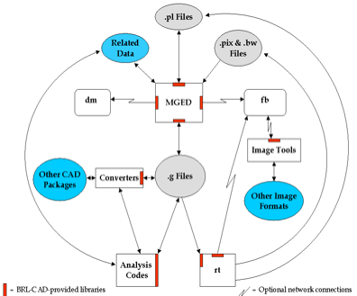
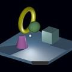
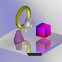
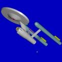
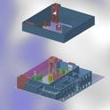
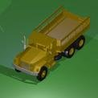
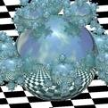

= Sommario
:doctype: article
:toc:
:toclevels: 3

SommarioDal 1979, l�Army Research Laboratory degli Stati Uniti sviluppa e distribuisce il pacchetto di modellizzazione solida geometrica costruttiva BRL-CAD, per un vasto campo di applicazioni militari e industriali. Il programma include un grande numero strumenti ed utilit� tra le quali un editor geometrico interattivo, librerie per il il raytracing ed il framebuffer, capacit� di rete per il trattamento di immagini e segnali, un linguaggio di scripting integrato.

[discrete]
=== Cosa � il BRL-CAD?

E� dai tardi anni 50 che i computer vengono usati nell�ausilio alla progettazione e allo studio di sistemi di veicoli da combattimento. La loro introduzione ha prodotto sia una riduzione del tempo e della spesa richiesti per portare un sistema dal tecnigrafo alla produzione full-scale, che un incremento dell�efficienza nelle prove di test e valutazione.

Nel 1979, il Ballistic Research Laboratory dell�Esercito degli Stati Uniti (BRL) (ora U.S. Army Research Laboratory [ARL]) espresse il bisogno di avere degli strumenti che potessero essere utilizzati nella simulazione computerizzata e l�analisi ingegneristica di sistemi di veicoli da combattimento e ambientali. Non essendo allora disponibili dei programmi CAD adeguati alle specifiche richieste, gli sviluppatori di software del BRL iniziarono ad assemblare una suite di utilities in grado di mostrare interattivamente, editare ed interrogare dei modelli geometrici. Tale suite divenne nota come BRL-CAD.

Oggi, con circa un milione di linee in codice C, BRL-CAD � diventato un potente programma di modellizzazione solida geometrica costruttiva (CGS) che � stato distribuito in licenza ad oltre 2000 siti in tutto il mondo. Esso include un grande numero strumenti ed utilit� tra le quali un editor geometrico interattivo, librerie per il il raytracing ed il framebuffer, capacit� di rete per il trattamento di immagini e segnali, un linguaggio di scripting integrato. Inoltre, BRL-CAD supporta l'interazione contemporanea attraverso due metodi, uno che si avvale della riga di comando ed uno che sfrutta l'interfaccia grafica utente (GUI).

Un particolare punto di forza del pacchetto risiede nella sua capacit� di costruire ed analizzare modelli realistici di oggetti complessi utilizzando un insieme relativamente piccolo di "forme primitive". A tale fine, queste forme sono manipolate impiegando le operazioni logiche booleiane di base quali l'unione, la sottrazione e l'intersezione. Un altro punto di forza � la velocit� di raytracing che � una delle pi� elevate esistenti. Per finire, gli utilizzatori di BRL-CAD possono modellizzare gli oggetti con precisione a partire da scale che vanno dalla subatomica alla galattica mantenendo in ogni caso il livello di dettaglio richiesto.

[discrete]
=== Perch� la modellizzazione CGS?

Sebbene BRL-CAD sia stato utilizzato in un grande numero di svariate applicazioni ingegneristiche e grafiche, lo scopo principale del pacchetto continua ad essere quello della (1) analisi balistica e (2) dell'analisi elettromagnetica. Di conseguenza, gli sviluppatori hanno ritenuto che l'approccio CGS fosse il migliore in termini di accuratezza del modello , efficienza di memoria occupata, precisione e velocit� di calcolo.

Cos�, mentre la rappresentazione poligonale e dei contorni (B-rep) spesso si focalizza sulle superfici degli oggetti, la modellizzazione CGS si focalizza sul volume e sul contenuto degli oggetti. Questo approccio d� a BRL-CAD una capacit� di analisi che non si ferma alla superficie degli oggetti, ma li costruisce con materiali reali caratterizzati da densit� e spessore in modo che l'analista possa studiare fenomeni fisici come la penetrazione balistica e termica, di radiazioni, di neutroni, ed altri tipi di mezzo.

[discrete]
=== Contenuto del pacchetto

Coerentemente alla filosofia UNIX consistente nello sviluppare strumenti indipendenti, ciascuno adatto allo scopo di effettuare una singola operazione specifica e di metterli insieme collegandoli in un pacchetto, BRL-CAD � una raccolta di librerie, stumenti e utilities che funzionano insieme per creare, effettuare il raytracing e interrogare geometrie, manipolare file e dati. Il flusso di base dei dati nel pacchetto � rappresentato in Figura 1.

[discrete]
=== Le librerie

Le librerie BRL-CAD (caratterizzate dal prefisso "lib") sono state sviluppate principalmente per l'utilizzatore che volesse cimentarsi col software e, forse, scrivere il codice per i suoi strumenti. Ciascuna libreria ricade in una delle tre categorie: (1) creazione e/o editing di geometrie, (2) raytracing delle geometrie, (3) manipolazione di immagini. La seguente � una lista delle principali librerie BRL-CAD con la descrizione delle loro funzioni.

- *libbu* � � una libreria di utility di base (bu) contenente i tipi principali di routines informatiche, incluse quelle per la manipolazione di dati (per esempio, la conversione di dati dal formato host a network), elaborazione parallela, parsing dei parametri, gestione di stringhe a lunghezza variabile, effettuazione di controllo degli errori, conversione di grandezze da un'unit� di misura ad un'altra, manipolazione di vettori di bit, esecuzione in modalit� sicura di routines I/O (input/output) parallelo e manutenzione delle tabelle dei simboli.

- *libbn* � � una libreria di routines per la gestione del calcolo numerico di base (bn), comprendenti la manipolazione di vettori 2-D/3-D, matrici e quaternioni; supporto per il plotting 3-D; deduzione automatica delle dimensioni di una immagine (le immagini BRL-CAD non hanno un header interno con tale informazione; le dimensioni dell'immagine sono "intuite" dalla dimensione del file); scomposizione e ricostruzione di ondulazioni, eccetera.

- *libdm* � � la principale libreria BRL-CAD che gestisce il display grafico (dm). Gestisce l'apertura delle finestre dul display, la rappresentazione delle geometrie nella finestra grafica eccetera.

- *libfb* � � la libreria per il framebuffer (fb), che gestisce l'apertura di una finestra di framebuffer sulla quale effettuare il raytracing.

- *libpkg* � � una libreria che inplementa il meccanismo per il richiamo di una procedura remota (rpc). Questa libreria � un predecessore del sistema attuale rpc. Al contrario del tipico servizio rpc UNIX, le applicazioni possono definire dei servizi e gestire le richieste senza la necessit� ricorrere alla configurazione da parte dell'amministratore di sistema.

- *librt*� � la libreria di supporto alla geometria, compresa la rappresentazione numerica delle primitive, il supporto al raytracing (rt) e il supporto all'I/O binario per la descrizione geometrica CGS.

- *libz* � � una libreria per la compressione di file di pubblico dominio.

- *libtcl*, *libtk*, and *libitcl* � sono le librerie necessarie per il linguaggio di script Tcl/Tk.

- *libpng* � � una libreria che fornisce il "portable network graphics" (png).

[discrete]
=== Strumenti e Utilities

Anche dal lato applicazione BRL-CAD offre parecchi di strumenti ed utilities. Essi riguardano principalmente (1) la conversione geometrica, (2) l'interrogazione delle geometrie, (3) la conversione di formati immagine, e (4) la manipolazione di immagine dalla linea di comando. La seguente � una lista dei principali strumenti ed utilit� di BRL-CAD.

- *MGED* (Multiple-Device Geometry Editor) � � l'editor grafico di BRL-CAD. (Per una guida dettagliata sia sull'uso di MGED che per una lista di tutti i comandi dispodibili, vedi Butler et al. [2001].)

- Strumenti per il raytracing e l'interrogazione di oggetti geometrici sottoposti a raytracing.

- *rt* � � il programma principale per il raytracing e il rendering in BRL-CAD.

- *nirt* � � un pacchetto per sparare raggi interattivamente e ottenere informazioni sulle entit� colpite.

- *remrt* � � un pacchetto network-distributed per il raytracing.

- Una variet� di convertitori tra formati geometrici differenti tra i quali Euclid, ACAD, AutoCAD DXF, TANKILL, Wavefront OBJ, Pro/ENGINEER, JACK (il modellizzatore di risorse umane per eseguire studi sul carico di lavore/usabilit�), Viewpoint Data Lab, NASTRAN, Digital Equipment's Object File Format (OFF), Virtual Reality Mark-up Language (VRML), Stereo Lithography (STL), dati Cyberware Digitizer, e FASTGEN4.

- *bwish* � � un interprete Tcl/Tk che funziona in una window shell con caratteristiche specifiche precompilate che gli permettono l'accesso alle librerie BRL-CAD. Include inoltre altre diverse estensioni del linguaggio Tcl.

- *irprep* � produce l'input al codice PRISM (Physically Realistic Infrared Simulation Model).

- *JOVE* (Jonathan's Own Version of Emacs) � � una implementazione leggera e veloce di Emacs.

- Applicazioni per la visualizzazione di immagini di vari tipi sul framebuffer che permettono di recuperare dati da quel framebuffer verso diversi tipi di immagine.

- Strumenti per la generazione della geometria di oggetti comuni come recinzioni, muri e stranezze geometrico matematiche (es. la sphereflake mostrata nella Figura 2 della Sezione 4).

- Programmi per la manipolazione di dati per (1) convertire interi (integer) in reali (float), reali in reali doppi (double) ecc. (es cv); (2) per eseguire operazioni matematiche su elementi di file (es. *imod*, *umod*, e *dmod*); (3) calcolare dati statistici relativamente ad elementi di file (es. *istat*, *ustat*, e *dstat*); ecc.

- Utilities per creare script di animazione � tenendo conto dei dati e interpolandoli, permette di produrre l'input del programma rt al fine di renderizzare item multipli per l'animazione.

- *Utah**Raster Tool Kit* � per la manipolazione di tutte le immagini basate RLE.

- Programmi per la manipolazione delle immagini e la conversione tra differenti formati. I due tipi principali in BRL-CAD sono il *pix*(immagini a colori a 24-bit rosso, verde, e blu [RGB]) e il *bw* (immagini in scala di grigi a 8-bit). Esistono convertitori per diversi formati di immagine tra cui alias, png, ppm, ecc.

- Programmi per il filtraggio di immagini, che producono istogrammi basati sui dati delle immagini ed estraendo rettangoli dalle immagini stesse.

- Strumenti per combinare due immagini fondendole insieme. Questi strumenti furono creati prima che fossero disponibili dei buoni programmi per l'editing delle immagini. Oggi l'utente utilizza direttamente dei pacchetti di video editing.

[discrete]
=== Valutazione delle prestazioni

Via via che vengono apportati dei cambiamenti in BRL-CAD, gli sviluppatori ARL processano un set standard di immagini pesanti dal punto di vista computazionale (mostrate in Figura 2) su un calcolatore comune al fine di testare e fare un confronto tra le prestazioni ottenute. Tra l'altro, queste immagini sono fornite con ciascuna distribuzione del pacchetto sorgente in modo che anche gli utenti, se lo desiderano, possano testare le performance delle loro macchine.

Per eseguire il test di prova tramite queste immagini, bisogna lanciare lo script _run.sh_ nella sottocartella "bench", presente nell'albero delle cartelle del sorgente.

.Immagini di prova
[cols="3*"]
[%noheader]
|===
|
|
|
|Moss
|World
|Star
|
|
|
|Bldg 391
|M35
|Sphflake
|===

[discrete]
=== Ringraziamenti

Gli autori intendono ringraziare i membri dell'Advanced Computer Systems Team, i quali hanno provvidenzialmente revisionato il peresente documento dando molti utili suggerimenti per migliorarne l'accuratezza e la presentazione. Al tempo della sua creazione, questo documento fu preparato dai membri del team tra cui John Anderson, TraNese Christy, Bob Parker, Ron Bowers, e Sean Morrison.

Gli autori vogliono inoltre esprimere un ringraziamento speciale a Mike Muuss, membro del team e autore originale di BRL-CAD, passato a migliore vita nell'autunno del 2000. Senza di lui questo lavoro non sarebbe satto possibile. La BRL-CAD Tutorial Series � dedicata alla sua memoria.

