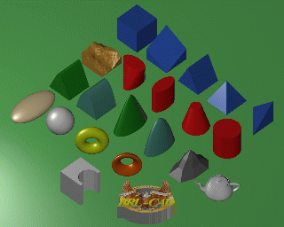
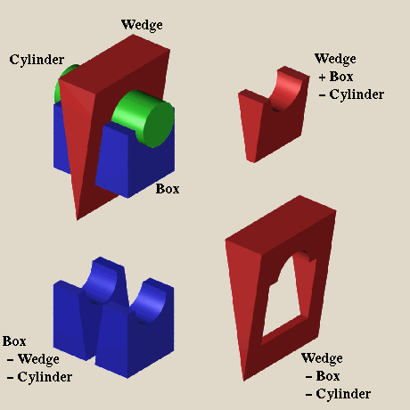
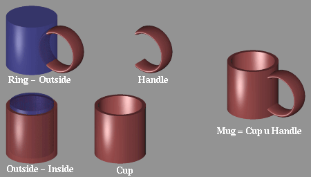
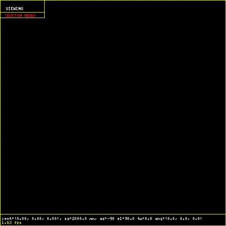
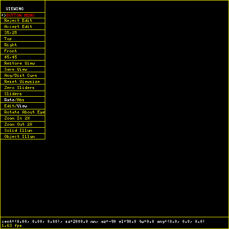
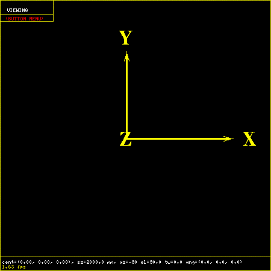

= MGED Tutorial
:doctype: article
:toc:
:toclevels: 3

[[Preface]]
== Preface

This manual is designed to get the user familiar with BRL-CAD and the facilities available for creating and using geometry. To accomplish this, we start with an introduction to the geometry editor, _MGED_.

[[Modeling_With_CSG]]
== Modeling With CSG

[[Modeling_With_CSG1]]
=== Modeling With CSG

In BRL-CAD objects are constructed using a technique known as ``Combinatorial Solid Geometry'' or ``Constructive Solid Geometry'' or simply ``CSG'' In the CSG approach to modeling This technique involves creating objects by combining primitive shapes together to form complex objects. The primitive shapes are called ``solids''. Each one occupies a volume of three dimensional space. BRL-CAD currently has many primitive solid types. These include:

.Modeling with CSG
[cols="2*"]
|===
|Primitive Shape
|BRL-CAD Name

|Arbitrary Convex Polyhedron 
|arbn 
|Arbitrary Convex Polyhedron 
|arbn 
|Arbitrary Convex Polyhedron (8pt or less) 
|arb 
|Extruded Bitmap * 
|ebm * 
|Elliptical Hyperboloid 
|ehy 
|Ellipsoid 
|ell 
|Elliptical Paraboloid 
|epa 
|Elliptical Torus 
|eto 
|Halfspace 
|half 
|Height-Field * 
|hf * 
|N-Manifold Geometry * 
|nmg * 
|Non-Uniform Rational B-spline * 
|nurb * 
|particle * 
|part * 
|polygonal object 
|polygon 
|pipe * 
|pipe * 
|Right Elliptical Cylinder 
|rec 
|Right Hyperbolic Cylinder 
|rhc 
|Right Parabolic Cylinder 
|rpc 
|Sphere 
|sph 
|Truncated General Cone 
|tgc 
|Torus 
|tor 
|Volume/Voxel * 
|vol * 
|===

* = Implementation known to be incomplete as of this writing

These primitives can be combined using boolean operators to create complex shapes. The three boolean operations supported are union, difference (or subtraction), and intersection. Any number of primitives may be combined to produce a shape. The union (u) of two solids is defined as the volume in either of the solids. The difference (-) of two solids is the volume of the first solid which is not in the volume of the second solid. The intersection (+) of two solids is the volume that is contained in both solids.

The result of performing a set of boolean operations is a new shape. In BRL-CAD this new shape is known as a ``combination''. This is frequently abbreviated as ``comb''. A ``comb'' can be further combined with other shapes to create still more complex shapes. For example, the shape of a simple cup might be created by subtracting a cylinder from a slightly larger cylinder. From this ``comb'' shape, the shape of a mug could be created by adding a handle. The handle might be composed of an elliptical torus with the part of the torus that would be inside the cup removed. Logically this is:

----

Cup = Outside - Inside

Handle = Ring - Outside

Mug = Cup union Handle
----

In this way the shape of objects are built up from components.

When the desired shape of an object is attained, a special combination called a ``region'' is created. A ``region'' represents an actual material component of the model. It represents an item which is made from a homogeneous type of material. In the example above two combinations are created: Cup and Handle. These two are brought together to form an object (Mug) which is made of a single material (such as ceramic or bone china). Material properties such as color, texture, transparency, reflectivity, etc. are assigned to regions.

The model is built up as a tree-like structure known as a Directed Acyclic Graph or DAG. It is permissible for a node to be referenced by different parts of the model. In the mug example, the solid "Outside" is a part of two different combinations: Cup and Handle. In this example the graph of the mug object looks like this:

----

			  Torus
			 /
		Handle (-)
	       /	 \
	Mug (u)		  Cylinder
	       \	 /
		Cup -- (-)
			 \
			  Insides
----

It is possible to refer to combinations and regions multiple times as well. For example, if a modeler were trying to create a cupboard containing three separate identical mugs, he might create a structure as follows:

----

	 Mug 1			    Ring
        /     \			   /
       /       \	 Handle (-)
     (u)        \       /	   \
Mugs (u)- Mug 2--Mug (u)	    Outside
     (u)        /       \	   /
       \       /	 Cup -- (-)
        \     /			   \
	 Mug 3			    Inside
----

Users familiar with other CAD software may prefer to think of the ``region'' as a ``part''. Combinations containing of ``regions'' may be thought of as ``assemblies''.

[[Starting_MGED]]
=== Starting MGED

The program for editing BRL-CAD geometry is called ``mged''.

All the geometry for a particular model or application is generally stored in a single file called a database. Each database may contain many different objects. By convention, the files containing BRL-CAD geometry have an extension of ``.g''.

Before starting mged the user should assure that the X-Windows DISPLAY environment variable has been properly set. This indicates where applications should display the windows they create.

We use the following conventions for denoting text:

----

	Text typed by the user
	Text output by the program
----

To edit or create a geometry file, the user starts the mged program from the shell by giving the command:

----

   % mged -c cup.g
----

The filename is required. Unlike many programs which allow the user to create a new document or database in memory, mged always keeps everything on disk. After each user command, the contents of the disk file are brought up to date. By doing this, the amount of work lost in the event of a system crash is minimized.

When mged is started, it prints out the release number and date of compilation. When multiple versions of mged are installed on a machine, this allows the user to verify that the proper version is being started.

If the file specified does not exist when mged is started, it will stop and ask if the user wishes to create a new database:

----

   % mged -c cup.g
   BRL-CAD Release 4.5   Graphics Editor (MGED)
       Mon May 19 16:31:32 EDT 1997, Compilation 5377
       bparker@vapor.arl.mil:/m/cad/.mged.6d

   cup.g: No such file or directory
   Create new database (y|n)[n]?
At this point pressing the ``y'' key followed by a return will create the new database.  Any other (non-y) keys (followed by a return) will cause mged to quit without creating the database.
   % mged -c cup.g
   BRL-CAD Release 4.5   Graphics Editor (MGED)
       Mon May 19 16:31:32 EDT 1997, Compilation 5377
       bparker@vapor.arl.mil:/m/cad/.mged.6d

   cup.g: No such file or directory
   Create new database (y|n)[n]? y
   Creating new database "cup.g"
   Untitled MGED Database (units=mm)
   attach (nu|X|ogl|glx)[nu]?
----

At this point, mged is asking what type of geometry display window you would like. The default is always ``nu'' for Null or ``no geometry display''. If you are creating geometry, it is desirable to be able to see it. The common choices are:

.Common Choices
[cols="2*"]
|===
|Name 
|Display Type 

|X 
|X Windows 
|glx 
|Iris gl under X Windows 
|ogl 
|OpenGL under X Windows 
|===

Enter one of the names listed followed by a return.

----

   % mged -c cup.g
   BRL-CAD Release 4.5   Graphics Editor (MGED)
       Mon May 19 16:31:32 EDT 1997, Compilation 5377
       bparker@vapor.arl.mil:/m/cad/.mged.6d

   cup.g: No such file or directory
   Create new database (y|n)[n]? y
   Creating new database "cup.g"
   Untitled MGED Database (units=mm)
   attach (nu|X|ogl|glx)[nu]? ogl
   mged>
----

At this point you should have a window that looks something like this:

When the MGED program has a display window or device attached, it displays a border around the region of the screen being used along with some ancillary status information. Together, this information is termed the editor ``faceplate''.

In the upper left corner of the window is a small enclosed area which is used to display the current editor state. The current editor state indicates whether objects are selected for editing and what modeling operations are allowed.

Underneath the state display is a zone in which three ``pop-up'' menus may appear. The top menu is termed the ``button menu,'' as it contains menu items which duplicate many functions which were originally available via an external button box peripheral. Having these frequently used functions available on a pop-up menu can greatly decrease the number of times that the user needs to remove his hand from the pointing device (either mouse or tablet puck) to reach for the buttons.

Below is an example of the faceplate and first level menu.

The second menu is used primarily for the various editing states, at which time it contains all the editing operations which are generic across all objects (scaling, rotation, and translation). The third menu contains selections for object-specific editing operations. The choices on these menus are detailed below.

Running across the entire bottom of the faceplate is a thin rectangular display area which holds two lines of text. The first line always contains a numeric display of the model-space coordinates of the center of the view and the current size of the viewing cube, both of which are displayed in the currently selected editing units. The first line also contains the current rotation rates.

The second line has several uses, depending on editor mode. In various editing states this second line will contain certain path selection information. When the angle/distance cursor function is activated, the second line will be used to display the current settings of the cursor.

All numeric interaction between the user and the editor are in terms of user-selected display units. The user may select from millimeters, centimeters, meters, inches, and feet, and the currently active display units are noted in the first display line. One important implementation detail is that all numeric values are stored in the database in millimeters. When MGED interacts with the user, it converts values from the database into the units selected by the user before displaying them. Likewise, values that the user enters are converted to millimeters before being written to the database.

[[The_Screen_Coordinate_System]]
=== The Screen Coordinate System

Objects drawn on the screen are clipped in X, Y, and Z, to the size indicated on the first status line. This creates a conceptual ``viewing cube''. Only objects inside this cube are visible. This feature allows objects within the cube to be seen, without cluttering the display with objects which are within view in X and Y, but quite far away in the Z direction. This is especially useful when the display is zoomed in on a small portion of the geometry. On some displays Z axis clipping can be selectively enabled and disabled as a viewing aid.

The MGED editor uses the standard right-handed screen coordinate system shown in the figure below.

The Z axis is perpendicular to the screen and the positive Z direction is out of the screen towards the viewer. The directions of positive (+) and negative (-) axis rotations are also indicated. For these rotations, the ``Right Hand Rule'' applies: Point the thumb of the right hand along the direction of +X axis and the other fingers will describe the sense of positive rotation.

[[Creating_Geometry]]
=== Creating Geometry: The Cup

Let's look at the commands needed to build the cup geometry described in the first section. The following MGED editing session contains all the commands needed to create the mug. Each command will be explained below.

----

   % newmged Mug.g
   BRL-CAD Release 4.5   Graphics Editor (MGED)
       Tue May 20 10:33:44 EDT 1997, Compilation 5378
       jra@vapor.arl.mil:/m/cad/.mged.6d

   Mug.g: No such file or directory
   Create new database (y|n)[n]? y
   Creating new database "Mug.g"
   Untitled MGED Database (units=mm)
   attach (nu|X|ogl|glx)[nu]? ogl
   mged> title MGED Tutorial Geometry
   mged> units in
   New editing units = 'in'
   mged> in outside.s rcc
   Enter X, Y, Z of vertex: 0 0 0
   Enter X, Y, Z of height (H) vector: 0 0 3.5
   Enter radius: 1.75
   42 vectors in 0.006435 sec
   mged> in inside.s rcc 0 0 0.25 0 0 3.5 1.5
   42 vectors in 0.006435 sec
   mged> in ring.s eto 0 2.5 1.75 1 0 0
   Enter X, Y, Z, of vector C: .6 0 0
   Enter radius of revolution, r: 1.45
   Enter elliptical semi-minor axis, d: 0.2
   2479 vectors in 0.087375 sec
   mged> comb cup.c u outside.s - inside.s
   mged> comb handle.c u ring.s - outside.s
   mged> r mug.r u cup.c u handle.c
   Defaulting item number to 1002
   Creating region id=1001, air=0, los=100, GIFTmaterial=1
----

The first step in preparing a new database is to provide a title which describes the contents of the database. This is an important opportunity to describe the contents and purpose of the database. Setting the title is done with the title command in MGED.

----

   mged> Title MGED Tutorial Geometry
----

When the database is first created, the default editing units are set to millimeters. For this example, we want to specify the dimensions of the object in inches. To arrange this, the units command

----

   mged> units in
----

Now we can create our first solid. There are two techniques for creating geometry in MGED. The commands for these two techniques are make and in (for ``insert''). For precision modeling the in command offers the greatest control over the definition of the solid. This is the approach we will use.

The ``in'' command can take all of its arguments on the command line, or it will prompt you for any missing portions. Remembering what parameters need to be specified for each solid can be difficult at best. All that you really need to enter is the command name. Mged will prompt you for the rest of the parameters.

In the first example above we specify the name of the solid we are creating (``outside.s'') and the type of solid to create (``rcc''). Then mged prompts for the remaining arguments (vertex, height vector, and radius):

----

   mged> in outside.s rcc
   Enter X, Y, Z of vertex: 0 0 0
   Enter X, Y, Z of height (H) vector: 0 0 3.5
   Enter radius: 1.75
----

For the solid ``inside.s'' we specify all the parameters on the command line, so mged does not prompt us for additional arguments. In the case of the solid ``ring.s'' we specify some, but not all of the parameters, and mged prompts us for the missing ones:

----

   mged> in inside.s rcc 0 0 0.25 0 0 3.5 1.5
   42 vectors in 0.006435 sec
   mged> in ring.s eto 0 2.5 1.75 1 0 0
   Enter X, Y, Z, of vector C: .6 0 0
   Enter radius of revolution, r: 1.45
   Enter elliptical semi-minor axis, d: 0.2
   2479 vectors in 0.087375 sec
----

As a minimal example, if we wanted to create a sphere called ``ball.s'' we could simply type the ``in'' command and let mged prompt us for everything else:

----

   mged> in
   Enter name of solid: ball.s
   Enter solid type:  sph
   Enter X, Y, Z of vertex:  0 0 0
   Enter radius:  3
   51 vectors in 0.117187 sec
----

The three boolean operators supported are union, subtraction and intersection. These operations are denoted by the operators u, - and + respectively. Mged uses these in a sort of prefix notation. In this notation the union operator has higher precedence than either subtraction or intersection. Hence the following boolean sequence

----

	(A union B) subtract C

is written as

	u A - C u B - C
----

The comb command creates a boolean combination. In our example we use this to create the shape of the outside of the cup called ``cup.s'' Reading the command above that creates cup.c, we note that cup.c is formed from the union of the volume defined by the solid ``outside.s'' and the subtraction of the volume defined by the solid ``inside.s''.

The r command creates a ``region''. It is just like creating a combination, but the results are a volume of one logical material type.

Assigning material properties is done with the mater or shader command. Here we define which shader should be used when rendering the object, and the parameters for the shader. The simplest shader is the ``plastic'' shader which uses a Phong lighting model. For our mug this will be fine. We specify the plastic shader and set the color to a shade of green.

----

   mged> mater mug.r
   Shader =
   Shader?  ('del' to delete, CR to skip) plastic
   Color = (No color specified)
   Color R G B (0..255)? ('del' to delete, CR to skip) 32 128 32
   Inherit = 0:  lower nodes (towards leaves) override
   Inheritance (0|1)? (CR to skip) 0
----

The Inheritance option should be left 0. This option will be discussed later. Once we have created our geometry, it would be nice to look at the wireframe from a variety of angles. By clicking on the button menu box a set of options is displayed. The buttons labeled "35,25", "Top", "Right", "Front", and "45,45" offer a set of standard views.

It is possible to raytrace the current view from within mged. But to do so we need a place to display the image. We start up a framebuffer server (number 1) to accommodate this:

----

   mged> exec fbserv 1 /dev/sgip &
----

This runs the ``fbserv'' program which will maintain a framebuffer window for us. Now we are ready to raytrace an image. First we'll clear the geometry window of all the primitives and combinations and regions we've created. Then we display the region we want to raytrace with the ``draw'' command. Finally, we'll select a nice viewing angle of azimuth 35 elevation 25 with the ``ae'' command.

----

   mged> Z
   mged> draw mug.r
   mged> ae 35 25
----

Now we are ready to raytrace an image. The ``rt'' command starts the raytracer on the geometry. We must tell it where we want the pixels displayed with the ``-F'' option, and the size of the image with the -s option:

----

   mged> rt -F:1 -s 512
----

The rt program prints a variety of information when it runs:

----

rt -F:0 -s 512
rt -s50 -M -F:0 -s 512 cup.g mug.r
mged> BRL-CAD Release 4.4   Ray-Tracer
    Thu Jan  5 10:08:14 EST 1995, Compilation 1
    mike@wilson.arl.mil:/vld/src/brlcad/rt

db title:  MGED Tutorial Geometry
initial dynamic memory use=131072.
GETTREE: cpu = 0.001619 sec, elapsed = 0.004842 sec
    parent: 0.0user 0.0sys 0:00real 0% 0i+0d 2100maxrss 0+27pf 0+1csw
  children: 0.0user 0.0sys 0:00real 0% 0i+0d 0maxrss 0+0pf 0+0csw
Additional dynamic memory used=0. bytes

...................Frame     0...................
PREP: cpu = 0.001296 sec, elapsed = 0.003973 sec
    parent: 0.0user 0.0sys 0:00real 0% 0i+0d 2100maxrss 0+7pf 1+0csw
  children: 0.0user 0.0sys 0:00real 0% 0i+0d 0maxrss 0+0pf 0+0csw
Additional dynamic memory used=0. bytes
Tree: 3 solids in 1 regions
Model: X(-45,45), Y(-45,116), Z(-8,97)
View: 35 azimuth, 25 elevation off of front view
Orientation: 0.248097, 0.476591, 0.748097, 0.389435
Eye_pos: 87.6646, 90.5654, 97.5286
Size: 236.164mm
Grid: (0.461258, 0.461258) mm, (512, 512) pixels
Beam: radius=0.230629 mm, divergence=0 mm/1mm
Dynamic scanline buffering
Lighting: Ambient = 40%
  Implicit light 0: (155.394, -35.3438, 49.9036), aimed at (0, 0, -1)
  Implicit light 0: invisible, no shadows, 1000 lumens (83%), halfang=180

SHOT: cpu = 6.66068 sec, elapsed = 7.33342 sec
    parent: 6.6user 0.0sys 0:07real 91% 0i+0d 2100maxrss 0+20pf 0+251csw
  children: 0.0user 0.0sys 0:07real 0% 0i+0d 0maxrss 0+0pf 0+0csw
Additional dynamic memory used=0. bytes
154520 solid/ray intersections: 94456 hits + 60064 miss
pruned 61.1%:  151248 model RPP, 0 dups skipped, 50361 solid RPP
Frame     0:   262144 pixels in       6.66 sec =   39356.94 pixels/sec
Frame     0:   262144 rays   in       6.66 sec =   39356.94 rays/sec (RTFM)
Frame     0:   262144 rays   in       6.66 sec =   39356.94 rays/CPU_sec
Frame     0:   262144 rays   in       7.33 sec =   35746.50 rays/sec (wallclock)
----

If all goes well, you will get an image of a green mug on a black background.

Now let's improve on our basic cup. The lip of this cup looks a little too squared off. To fix this, we'll add a rounded top to the lip. To do this we create a circular torus solid positioned at exactly the top of the cup. Then we can add it to the combination ``cup.c''.

----

   mged> in rim.s tor 0 0 3.5 0 0 1 1.625 0.125
   214 vectors in 0.001814 sec
   mged> comb cup.c u rim.s
----

Now we have a unique condition. The solid rim.s was added to the list of objects being displayed when it was created. However, now it is also a part of mug.r (via cup.c). If we raytrace the current view we will have 2 copies of this solid. The raytracer will complain that they overlap. The best way to fix this is to clear the display, redisplay the new, complete object, and then raytrace. The ``Z'' command clears all objects from the display. Then we can redisplay the objects we want to raytrace with the ``draw'' command.

----

   mged> Z
   mged> draw mug.r
----

Since this is a frequent operation (clear the display list and draw something new) there is a shortcut:

----

   mged> B mug.r
----

The ``B'' is not very easy to remember (one suggested mnemonic is "blast"), but it is quite useful. Now we are ready to raytrace again.

----

   mged> rt -F:1 -s 512
   rt -s50 -M -F:1 -s 512 mug.g mug.r
   BRL-CAD Release 4.4   Ray-Tracer
       Thu Jan  5 10:08:14 EST 1995, Compilation 1
       mike@wilson.arl.mil:/vld/src/brlcad/rt

   db title:  MGED Tutorial Geometry
   initial dynamic memory use=131072.
   GETTREE: cpu = 0.001785 sec, elapsed = 0.005385 sec
       parent: 0.0user 0.0sys 0:00real 0% 0i+0d 2152maxrss 0+31pf 0+1csw
     children: 0.0user 0.0sys 0:00real 0% 0i+0d 0maxrss 0+0pf 0+0csw
   Additional dynamic memory used=0. bytes

   ...................Frame     0...................
   PREP: cpu = 0.001468 sec, elapsed = 0.004084 sec
       parent: 0.0user 0.0sys 0:00real 0% 0i+0d 2152maxrss 0+7pf 1+0csw
     children: 0.0user 0.0sys 0:00real 0% 0i+0d 0maxrss 0+0pf 0+0csw
   Additional dynamic memory used=0. bytes
   Tree: 4 solids in 1 regions
   Model: X(-45,45), Y(-45,116), Z(-8,97)
   View: 35 azimuth, 25 elevation off of front view
   Orientation: 0.248097, 0.476591, 0.748097, 0.389435
   Eye_pos: 87.6646, 90.5654, 116.579
   Size: 236.164mm
   Grid: (0.461258, 0.461258) mm, (512, 512) pixels
   Beam: radius=0.230629 mm, divergence=0 mm/1mm
   Dynamic scanline buffering
   Lighting: Ambient = 40%
     Implicit light 0: (155.394, -35.3438, 49.9036), aimed at (0, 0, -1)
     Implicit light 0: invisible, no shadows, 1000 lumens (83%), halfang=180

   SHOT: cpu = 7.26825 sec, elapsed = 7.94901 sec
       parent: 7.2user 0.0sys 0:07real 92% 0i+0d 2152maxrss 0+22pf 1+270csw
     children: 0.0user 0.0sys 0:07real 0% 0i+0d 0maxrss 0+0pf 0+0csw
   Additional dynamic memory used=0. bytes
   170747 solid/ray intersections: 99501 hits + 71246 miss
   pruned 58.3%:  151252 model RPP, 0 dups skipped, 64892 solid RPP
   Frame     0:   262144 pixels in       7.27 sec =   36067.02 pixels/sec
   Frame     0:   262144 rays   in       7.27 sec =   36067.02 rays/sec (RTFM)
   Frame     0:   262144 rays   in       7.27 sec =   36067.02 rays/CPU_sec
   Frame     0:   262144 rays   in       7.95 sec =   32978.18 rays/sec (wallclock)
----

[[Editing_Solids]]
=== Editing Solids

So far we've focused on creating primitive solids and combinations. Now let's look at ways of altering and deleting things that already exist. We'll continue with our example mug geometry. There are a number of changes that need to be made to make it more realistic.

The handle for the mug is a little awkward. It sticks out too far from the side of the mug, and it is too wide.

The bottom is perfectly flat. Any imperfection in the table top would cause it to wobble. The inside bottom corner is too sharp. We need to create a "fillet" at the seam between side and bottom.

----

Fixing the Handle

 kill handle.c
kill ring.s
in handle_01.s eto 0 2.25 1.25 1 0 0 .75 0.3 0 0 .15
in handle_02.s rpp -.5 .5 1 3.5 1.25 2.5
in handle_03.s rec 0 3 1.25 0 0 1.25 0.3 0 0 0 .15 0
in handle_04.s eto 0 2.25 2.5 1 0 0 .75 0.3 0 0 .15
----

comb handle.c u handle_01.s - handle_02.s - outside.s u handle_04.s - handle_02.s - outside.s u handle_03.s

[[Adding_a_Base]]
=== Adding a Base

----

 mvall outside.s outside_01.s
in outside_02.s tor 0 0 0 0 0 1 1.6875 .0625
comb cup.c u outside_02.s
in outside_03.s rcc 0 0 0 0 0 -.2 1.6875
comb cup.c u outside_03.s
in outside_04.s tor 0 0 -.2 0 0 1 1.6875 .1375
comb cup.c - outside_04.s
in outside_05.s ellg 0 0 -.2 1.5 0 0 0 1.5 0 0 0 .15
comb cup.c - outside_05.s
center 0 0 0
size 4
ae 170 -52 120
rt -s 512 -F :1
----

[[Adding_a_fillet]]
=== Adding a fillet

----

 mvall inside.s inside.c
mv inside.c inside_01.s
solid edit bottom of inside_01.s up to 0 0 0.3125
in inside_02.s tor 0 0 .3125 0 0 1 1.4375 0.0625
in inside_03.s rcc 0 0 0.25 0 0 0.125 1.4375
comb inside.c u inside_01.s u inside_02.s u inside_03.s
B mug.r
ae 35 85
size 5
rt -s 512 -F :1
----

[[New_Graphical_User_Interface]]
== MGED’s New Graphical User Interface

=== MGED’s New Graphical User Interface

* <<GettingStarted,Getting Started>>
* <<CommandWindow,Command Window>>
* <<Panes,Panes (Display Manager Windows)>>

** <<ShiftGrips,Shift Grips (Default Mouse Bindings)>>
** <<DefaultKeyBindings,Default Key Bindings>>
* <<ControlPanels,Control Panels>>

** <<ADCControlPanel,ADC Control Panel>>
** <<GridControlPanel,Grid Control Panel>>
** <<QueryRayControlPanel,Query Ray Control Panel>>
** <<RaytraceControlPanel,Raytrace Control Panel>>
** <<AnimMateControlPanel,AnimMate Control Panel>>
** <<SolidEditor,Solid Editor>>
** <<SolidEditorInternal,Solid Editor (Internal)>>
** <<CombinationEditor,Combination Editor>>
** <<ColorEditor,Color Editor>>
* <<StatusBar,Status Bar>>
* <<MenuBar,Menu bar>>

** <<File,File>>

*** <<New,New>>
*** <<Open,Open>>
*** <<Insert,Insert>>
*** <<Extract,Extract>>
*** <<g2asc,g2asc>>
*** <<raytrace,Raytrace>>
*** <<SaveViewAs,Save View As>>

**** <<RTscript,RT script>>
**** <<Plot,Plot>>
**** <<PostScript,PostScript>>
*** <<Preferences,Preferences>>

**** <<Units,units>>

***** <<micrometers,micrometers>>
***** <<millimeters,millimeters>>
***** <<centimeters,centimeters>>
***** <<meters,meters>>
***** <<kilometers,kilometers>>
***** <<inches,inches>>
***** <<feet,feet>>
***** <<yards,yards>>
***** <<miles,miles>>
**** <<cmd_line_ed,Command Line Edit>>

***** <<emacs,emacs>>
***** <<vi,vi>>
**** <<SpecialCharacters,Special Characters>>

***** <<TclEvaluation,Tcl Evaluation>>
***** <<ObjectNameMatching,Object Name Matching>>
**** <<ColorSchemes,Color Schemes>>
*** <<Close,Close>>
*** <<Exit,Exit>>
** <<Edit,Edit>>

*** <<SolidSelection,Solid Selection>>
*** <<MatrixSelection,Matrix Selection>>
*** <<SolidEditor,Solid Editor>>
*** <<CombinationEditor,Combination Editor>>
** <<Create,Create>>

*** <<MakeSolid,Make Solid>> arb8, arb7, arb6, arb5, arb4, sph, grip, ell, ellg, tor, tgc, tec, rec, trc, rcc, half, rpc, rhc, epa, ehy, eto, part, nmg, pipe
*** <<SolidEditor,Solid Editor>>
*** <<CombinationEditor,Combination Editor>>-
** <<view,View>>

*** <<Top,Top>>
*** <<Bottom,Bottom>>
*** <<Right,Right>>
*** <<Left,Left>>
*** <<Front,Front>>
*** <<Rear,Rear>>
*** <<az35el25,az35,el25>>
*** <<az45el45,az45,el45>>
*** <<ZoomIn,Zoom In>>
*** <<ZoomOut,Zoom Out>>
*** <<Default,Default>>
*** <<MultipaneDefaults,Multipane Defaults>>
*** <<Zero,Zero>>
** <<ViewRing,ViewRing>>

*** <<AddView,Add View>>
*** <<SelectView,Select View>>
*** <<DeleteView,Delete View>>
*** <<NextView,Next View>>
*** <<PrevView,Prev View>>
*** <<LastView,Last View>>
** <<Settings,Settings>>

*** <<MouseBehavior,Mouse Behavior>>

**** <<Default,Default>>
**** <<Pickeditsolid,Pick edit-solid>>
**** <<Pickeditmatrix,Pick edit-matrix>>
**** <<Pickeditcombination,Pick edit-combination>>
**** <<Sweepraytracerectangle,Sweep raytrace-rectangle>>
**** <<Pickraytraceobject,Pick raytrace-object(s)>>
**** <<queryray,Query ray>>
**** <<Sweeppaintrectangle,Sweep paint-rectangle>>
**** <<Sweepzoomrectangle,Sweep zoom-rectangle>>
*** <<Transform,Transform>>

**** <<View2,View>>
**** <<ADC,ADC>>
**** <<ModelParams,Model Params>>
*** <<ConstraintCoords,Constraint Coords>>

**** <<model,Model>>
**** <<View3,View>>
**** <<object,Object>>
*** <<RotateAbout,Rotate About>>

**** <<ViewCenter,View Center>>
**** <<Eye,Eye>>
**** <<ModelOrigin,Model Origin>>
**** <<KeyPoint,Key Point>>
*** <<ActivePane,Active Pane>>

**** <<UpperLeft,Upper Left>>
**** <<UpperRight,Upper Right>>
**** <<LowerLeft,Lower Left>>
**** <<LowerRight,Lower Right>>
*** <<ApplyTo,Apply To>>

**** <<ApplyActivePane,Active Pane>>
**** <<LocalPanes,Local Panes>>
**** <<ListedPanes,Listed Panes>>
**** <<AllPanes,All Panes>>
*** <<QueryRayEffects,Query Ray Effects>>

**** <<Text,Text>>
**** <<Graphics,Graphics>>
**** <<both,both>>
*** <<Grid,Grid>>

**** <<Anchor,Anchor>>
**** <<Spacing,Spacing>>
**** <<DrawGrid,Draw Grid>>
**** <<SnapToGrid,Snap To Grid>>
*** <<GridSpacing,Grid Spacing>>

**** <<Autosize,Autosize>>
**** <<Arbitrary,Arbitrary>>
**** <<micrometer,micrometer>>
**** <<millimeter,millimeter>>
**** <<centimeter,centimeter>>
**** <<decimeter,decimeter>>
**** <<meter,meter>>
**** <<kilometer,kilometer>>
**** <<inch10,1/10 inch>>
**** <<inch14,1/4 inch>>
**** <<inch10,1/2 inch>>
**** <<inch,inch>>
**** <<foot,foot>>
**** <<yard,yard>>
**** <<mile,mile>>
*** <<Framebuffer,Framebuffer>>

**** <<All,All>>
**** <<RectangleArea,Rectangle Area>>
**** <<Overlay,Overlay>>
**** <<Underlay,Underlay>>
**** <<FramebufferActive,Framebuffer Active>>
**** <<ListenForClients,Listen For Clients>>
*** <<ViewAxesPosition,View Axes Position>>

**** <<Center,Center>>
**** <<LowerLeft,Lower Left>>
**** <<UpperLeft,Upper Left>>
**** <<UpperRight,Upper Right>>
**** <<LowerRight,Lower Right>>
** <<Modes,Modes>>

*** <<DrawGrid,Draw Grid>>
*** <<SnapToGrid,Snap To Grid>>
*** <<FramebufferActive,Framebuffer Active>>
*** <<ListenForClients,Listen For Clients>>
*** <<Persistentsweeprectangle2,Persistent sweep rectangle>>
*** <<AngleDistCursor2,Angle/Dist Cursor>>
*** <<Faceplate,Faceplate>>
*** <<Axes,Axes>>

**** <<View3,View>>
**** <<model,Model>>
**** <<Edit,Edit>>
*** <<Multipane2,Multipane>>
*** <<EditInfo2,Edit Info>>
*** <<StatusBar2,Status Bar>>
*** <<Collaborate2,Collaborate>>
*** <<Rateknobs2,Rateknobs>>
*** <<DisplayLists2,Display Lists>>
** <<Misc,Misc>>

*** <<zclipping,Z Clipping>>
*** <<Perspective,Perspective>>
*** <<Faceplate,Faceplate>>
*** <<FaceplateGUI,Faceplate GUI>>
*** <<KeystrokeForwarding,Keystroke Forwarding>>
*** <<DepthCueing,Depth Cueing>>
*** <<ZBuffer,Z Buffer>>
*** <<Lighting,Lighting>>
** <<Tools,Tools>>

*** <<ADCControlPanel,ADC Control Panel>>
*** <<GridControlPanel,Grid Control Panel>>
*** <<QueryRayControlPanel,Query Ray Control Panel>>
*** <<RaytraceControlPanel,Raytrace Control Panel>>
*** <<AnimMateControlPanel,Animmate Control Panel>>
*** <<SolidEditor,Solid Editor>>
*** <<CombinationEditor,Combination Editor>>
*** <<ColorEditor,Color Editor>>
*** <<CommandWindow,Command Window>>
*** <<GeometryWindow3,Geometry Window>>
** <<Help,Help>>

*** <<AboutMGED,About MGED>>
*** <<Helponcontext,Help on context>>
*** <<GettingStarted,Getting Started>>
*** <<ShiftGrips,Shift Grips>>
*** <<Commands,Commands>>
*** <<Apropos,Apropos>>
*** <<Manual,Manual>>

[[GettingStarted]]
==== Getting Started

*mged* _[-c] [-d display] [-h] [-r] [-x#] [-X#] [database [command]]_

The -c (Classic MGED) option causes MGED to start in the style of previous versions of MGED, that is, by prompting the user to select a display manager to attach and by remaining attached to the tty. Without this option MGED will detach itself from the tty and bring up the new GUI. The -d option provides a way to specify a display string. This string is expected to be in the same format as the X DISPLAY environment variable. The -h option causes the help message to print out. The -r option causes the database to be read-only (i.e. no editing allowed). The -x and -X options provide a way for the user to specify the debug level of librt and libbu, respectively. Note that if MGED is started by redirecting stdin or stdout, MGED will not enter interactive mode. Similarly, if MGED is started with a command, that command will be executed and MGED will exit. If the user starts MGED in “’Classic”’ mode, the new GUI is still available via the <<gui,gui>> command. There can be many instances of the GUI running at the same time. Each instance of the GUI owns four display manager windows (panes) and by default each of these panes has its view initialized as follows:

.MGED GUI COMMANDS
[cols="2*"]
|===
|Pane
|Azimuth and Elevation

|upper left
|0 90
|upper right
|35 25
|lower left
|0 0
|lower right
|90 0
|===

All four panes can be displayed simultaneously, or a single large pane containing the active pane can be displayed (look in the “’Modes”“menu). The active pane is the pane that is controlled by the GUI. The active pane can be changed from the”“Settings”“menu, or by certain key or mouse button actions. Essentially, any key sequence or mouse button action that will pop up an MGED menu in the pane will cause the active pane to move to the pane wherein this action occurred. For example, alt-f will pop up the file menu and make this pane the active pane. Similarly, alt-Button1 will pop up the”“Settings”“menu and alt-Button2 will pop up the”“Modes”’ menu.

The new GUI also provides “’Help on Context”“. This is always available via the right mouse button (i.e. button 3). The user can right mouse click on some feature of the GUI and a message window pops up with information about the feature. This behavior works everywhere except in the drawing panes (i.e. display manager windows) where a right mouse button is bound to”“zoom 2.0”’.

There are many new features and improvements in MGED providing greater access to its underlying power. The single greatest improvement to MGED is the incorporation of Tcl/Tk. Tcl (tool command language) is an interpreted command language that can be embedded into an application providing the application with an interpreter as well as a built-in command language. Tk is an extension to Tcl for building GUI’s. Incorporating Tcl/Tk into MGED gives the user the ability to develop their own commands and GUI’s. Other new features are: command line editing similar to tcsh, multiple display managers opened simultaneously, shareable resources among display managers, view axes, model axes, edit axes, rubber banding for zoom or raytracing, support for color schemes, frame buffer support for display managers, snap to grid for accuracy with the mouse, query rays for interrogating the geometry, and improved solid/object/combination selection from among displayed geometry.

[[CommandWindow]]
==== Command Window

The main function of the command window is to allow the user to enter commands. The command window supports <<cmd_line_ed,command line editing>> and command history. The two supported command line edit modes are emacs and vi. Look under File/ Preferences/Command_Line_Edit to change the edit mode.

There are also two command interpretation modes. One is where MGED performs object name matching (i.e. globbing against the database) before passing the command line to MGED’s built-in Tcl interpreter. This is the same behavior seen in previous releases. The other command interpretation mode (Tcl Evaluation) passes the command line directly to the Tcl interpreter. Look under File/Preferences/ Special_Characters to change the interpretation mode.

The command window also supports cut and paste as well as text scrolling. The default bindings for these operations are similar to those found in typical X Window applications such as xterm. For example:

.Commands
[cols="2*"]
|===
|Key-Button Sequence
|Action

|ButtonPress-1
|begin text selection
|ButtonRelease-1
|end text selection
|Button1-Motion
|add to text selection
|Shift-Button1
|modify text selection
|Double-Button-1
|select word
|Triple-Button-1
|select line
|ButtonPress-2
|begin text operation
|ButtonRelease-2
|paste text
|Button2-Motion
|scroll text
|===

Note - If motion was detected while Button2 was being pressed, no text will be pasted. In this case, it is assumed that scrolling was the intended operation. Of course, the user can also scroll the window using the scrollbar.

[[Panes]]
==== Panes (Display Manager Windows)

A pane is a place wherein solids/objects are drawn. Here the user can interact, via the mouse and/or keyboard, with the panes view or with solids/objects that are being edited. The user can also <<AccessMenuBar,access menus>> from the menu bar from within the pane.

[[ShiftGrips]]
===== Shift Grips

MGED offers the user a unified mouse-based interface for “grabbing” things and manipulating them. Since it was built for compatibility on top of the older interface:

Mouse Button

View Operation

Mouse button

View operation

Button-1

Zoom out

Button-2

Recenter view at the specified point

Button-3

Zoom in

it uses the modifier keys: Shift, Control, and Alt. This use of modified mouse clicks to grab things is called the “shift-grip” interface. The Shift and Control keys are assigned in combinations to the three basic transformation operations as follows:

Modifier Key

Transformation Operation

Shift

Translate

Ctrl

Rotate

Shift & Ctrl

Scale

and the Alt key is assigned the meaning “constrained transformation,” which is described below. Thus, in general, holding the Shift key and a mouse button down and moving the mouse drags things around on the screen. The Control key and a mouse button allow one to rotate things, and the combination of Shift, Control, and a mouse button allow one to expand and contract things. These general functionalities are consistent throughout MGED, providing a unified interface. The precise meanings of “drag things around,” “rotate things,” and “expand and contract things” depends on the operating context.

When one is merely viewing geometry the shift grips apply by default to the view itself. Thus they amount to panning, rotating, and zooming the eye relative to the geometry being displayed. When one is in solid-edit or matrix-edit mode (what used to be called object-edit mode), the shift grips apply by default to the model parameters. In this case, they modify the location, orientation, or size of object features or entire objects in the database.

The default behaviors in the viewing and editing modes may be overridden by the “Transform” item in the “Settings” menu. This allows the user to specify that the shift grips should transform the view, the model parameters (if one is currently editing a solid or matrix) or the angle-distance cursor (in which case the mouse may be used to position the ADC, to change its angles, and to expand and contract its distance ticks). The behavior of the shift grips may be further changed by the “Rotate About” item in the “Settings” menu, which allows the user to specify the point about which shift-grip rotations should be performed. The choices include the view center, the eye, the model origin, and an object’s key point.

[[CONSTRAINEDTRANSFORMATIONS]]
====== CONSTRAINED TRANSFORMATIONS

When the Alt key is held down along with either of the Shift and Control keys the transformations are constrained to a particular axis. For such constrained transformations the mouse buttons have the following meanings:

.CONSTRAINED TRANSFORMATIONS
[cols="2*"]
|===
|Mouse Button
|Axis

|Button-1
|x
|Button-2
|y
|Button-3
|z
|===

Thus, if the view is being transformed, Alt-Shift-Button-1 allows one to drag the objects being viewed left to right along the view-x axis. Similarly, if the model parameters are being transformed, Alt-Ctrl-Button-2 allows one to rotate the object about a line passing through the rotate-about point (as described above) and parallel to a y-axis. The coordinate system to which these transformations are constrained may be specified by the “Constraint Coords” item in the “Settings” menu, which allows the selection of any one of the model, view, and object coordinate systems.

Besides the default mouse button bindings described above, the user can access the “’Settings”“menu with alt-Button1 and the”“Modes”’ menu with alt-Button2.

[[DefaultKeyBindings]]
===== Default Key Bindings

MGED offers the user “’short cuts”’ to much of the functionality available via the menus as well as the command line interface. The table below lists the default key bindings:

.Short cut
[cols="2*"]
|===
|Key Sequence
|Behavior

|a
|toggle angle distance cursor (ADC)
|e
|toggle edit axes
|m
|toggle model axes
|v
|toggle view axes
|i
|advance illumination pointer forward
|I
|advance illumination pointer backward
|p
|simulate mouse press (i.e. to pick a solid)
|3
|view - ae 35 25
|4
|view - ae 45 45
|f
|front view
|t
|top view
|b
|bottom view
|l
|left view
|r
|right view
|R
|rear view
|s
|enter solid illumination state
|o
|enter object illumination state
|q
|reject edit
|u
|zero knobs and sliders
|N
|shoot a ray with nirt
|< F1 >
|toggle depthcue
|< F2 >
|toggle <<zclipping,zclipping>>
|< F3 >
|toggle perspective
|< F4 >
|toggle zbuffer
|< F5 >
|toggle lighting
|< F6 >
|toggle perspective angle
|< F7 >
|toggle <<Faceplate,faceplate>>
|< F8 >
|toggle <<FaceplateGUI,Faceplate GUI>>
|< F9 >
|toggle <<KeystrokeForwarding,keystroke forwarding>>
|< F12 >
|zero knobs
|< Left >
|rotate about y axis
|< Right >
|rotate about y axis
|< Down >
|rotate about x axis
|< Up >
|rotate about x axis
|< Shift-Left >
|translate in X direction
|< Shift-Right >
|translate in X direction
|< Shift-Down >
|translate in Z direction
|< Shift-Up >
|translate in Z direction
|< Control-Shift-Left >
|rotate about z axis
|< Control-Shift-Right >
|rotate about z axis
|< Control-Shift-Down >
|translate in Y direction
|< Control-Shift-Up >
|translate in Y direction
|< Control-n >
|goto next view
|< Control-p >
|goto previous view
|< Control-t >
|toggle between the current view and the last view
|< Escape >
|stop interactive rotation, reject edits, reset mouse behavior
|===

Besides the default key bindings listed above, the user can access menu items with “’alt-key”“sequences. For example, the”“File”“menu can be popped up with alt-f. The raytrace control panel can then be popped up by typing”“r”“(i.e.”“R”“is underlined in the”’Raytrace…" menu item).

[[ControlPanels]]
==== Control Panels

*ADC Control Panel*

The _ADC Control Panel_ is a tool for setting ADC parameters.

*Grid Control Panel*

The _Grid Control Panel_ is a tool for setting grid parameters.

*Query Ray Control Panel*

The _Query Ray Control Panel_ is a tool for setting query ray parameters.

*Raytrace Control Panel*

The _Raytrace Control Panel_ is a tool for setting raytrace parameters.

*AnimMate Control Panel*

*Solid Editor*

The _Solid Editor_ is a tool for editing solids.

*Solid Editor (Internal)*

The _Solid Editor_ is a tool for editing MGED’s internal solid (i.e. held in es_int while in solid edit state). The internal solid is the in-memory copy of a solid that is being edited.

*Combination Editor*

*Color Editor*

The _Color Editor_ is a tool for specifying colors in either RGB or HSV.

[[StatusBar]]
==== Status Bar

The _status bar_ contains two lines for displaying information about the state of the active pane. The first line contains information about the view center, view size, local units, azimuth, elevation, twist, and rate of rotation about the x, y and z axes. The second line can contain several different things depending on the state. If the angle distance cursor is being drawn, information about its parameters are displayed. Specifically, angle 1, angle 2, tick distance, center and delta are displayed. Otherwise, if in the _VIEWING_ state, the frames per second is displayed. If in _SOL PICK_ or _OBJ PICK_ state, the full path of the illuminated solid is displayed. If in _OBJ PATH_ state, the full path of the previously selected solid is displayed along with an indication of which matrix along the path will be edited. And finally, if in either _SOL EDIT_ or _OBJ EDIT_ state the keypoint is displayed.

[[AccessMenuBar]]
==== Menu Bar

* *File*

** *New*- open a new database. Note - the database must not already exist.
** *Open*- open an existing database.
** *Insert*- insert another database into the current database.
** *Extract*- a tool for extracting objects out of the current database. This tool consists of an entry for specifying the destination file and an entry for specifying the objects to be extracted.
** *g2asc*- converts the current database into an ascii file.
** *Raytrace*- pops up the raytrace control panel.
** *Save View As*

*** RT script - saves the current view as an RT script file.
*** *Plot*- saves the current view as a plot file.
*** *PostScript*- saves the current view a postscript file.
** *Preferences*

*** Units

**** micrometers - set the unit of measure to micrometers. 1 micrometer = 1/1,000,000 meters
**** *millimeters*- set the unit of measure to millimeters. 1 millimeter = 1/1000 meters
**** *centimeters*- set the unit of measure to centimeters. 1 centimeter = 1/100 meters
**** *meters*- set the unit of measure to meters.
**** *kilometers*- set the unit of measure to kilometers. 1 kilometer = 1000 meters
**** *inches*- set the unit of measure to inches. 1 inch = 25.4 mm
**** *feet*- set the unit of measure to feet. 1 foot = 12 inches.
**** *yards*- set the unit of measure to yards. 1 yard = 36 inches.
**** *miles*- set the unit of measure to miles. 1 mile = 5280 feet.
*** <<cmd_line_ed,Command Line Edit>>

**** <<emacs,emacs>>
**** <<vi,vi>>
*** *Special Characters*

**** *Tcl Evaluation* - set the command interpretation mode to Tcl mode. In this mode, globbing is *not* performed against MGED database objects. Rather, the command string is passed, unmodified, to the Tcl interpreter.
**** *Object Name Matching* - set the command interpretation mode to MGED object name matching. In this mode, globbing is performed against MGED database objects.
*** *Color Schemes* - pops up a tool for setting colors used by drawing panes (display managers).
** *Close* - close this instance of the MGED GUI.
** *Exit* - exits MGED.
* *Edit*

** *Solid Selection* - pops up a tool for selecting a solid to edit.
** *Matrix Selection* - pops up a tool for selecting a matrix to edit. <<SolidEditor,Solid Editor>> - pops up a tool for creating and editing solids. <<CombinationEditor,Combination Editor>> - pops up a tool for creating and editing combinations.
* *Create*

** *Make Solid* - gives the user a pulldown menu from which to select a solid to create. The following is a list of the available solid types that the <<make,make>> command can create: arb8, arb7, arb6, arb5, arb4, sph, grip, ell, ellg, tor, tgc, tec, rec, trc, rcc, half, rpc, rhc, epa, ehy, eto, part, nmg, pipe.
** <<SolidEditor,Solid Editor>> - pops up a tool for creating and editing solids.
** <<CombinationEditor,Combination Editor>> - pops up a tool for creating and editing combinations.
* *View*

** *Top* - view of the top (i.e. azimuth = 270, elevation = 90)
** *Bottom* - view of the bottom (i.e. azimuth = 270, elevation = -90)
** *Right* - view of the right (i.e. azimuth = 270, elevation = 0)
** *Left* - view of the left (i.e. azimuth = 90, elevation = 0)
** *Front* - view of the front (i.e. azimuth = 0, elevation = 0)
** *Rear* - view of the rear (i.e. azimuth = 180, elevation = 0)
** *az35,el25* - an oblique view (i.e. azimuth = 35, elevation = 25)
** *az45,el45* - an oblique view (i.e. azimuth = 45, elevation = 45)
** *Zoom In* - zoom in by a factor of 2.
** *Zoom Out* - zoom out by a factor of 2.
** *Default* - same view as top (i.e. azimuth = 270, elevation = 90)
** *Multipane Defaults* - sets the view of all four panes to their defaults.
+
.Multipane Defaults
[cols="3*"]
|===
|Pane
|Azimuth
|Elevation

|upper left
|90
|0
|upper right
|35
|25
|lower left
|0
|0
|lower right
|90
|0
|===

** *Zero* - stops all rate transformations.
* *ViewRing* A view ring is simply a dynamic list of views owned by a pane (display manager). This mechanism supports multiple views within a single pane. A view consists of a position in model space, a view size and an orientation.

** *Add View* - Adds a view to the view ring.
** *Select View* - a pulldown menu that lists the views in the view ring that can be selected.
** *Delete View* - a pulldown menu that lists the views in the view ring that can be deleted.
** *Next View* - go to the next view on the view ring.
** *Prev View* - go to the previous view on the view ring.
** *Last View* - go to the last view. This can be used to toggle between two arbitrary views.
* *Settings*

** *Mouse Behavior* - a menu for selecting among the available mouse behaviors.

*** *Default* - enter the default MGED mouse behavior mode. In this mode, the user gets mouse behavior that is the same as MGED 4.5 and earlier.
+
.Default
[cols="2*"]
|===
|Mouse Button
|Behavior

|1
|zoom out by a factor of 2
|2
|center view, or some edit action if in an edit state
|3
|zoom in by a factor of 2
|===

*** *Pick edit-solid* - enter pick edit-solid mode. In this mode, the mouse is used to fire rays for selecting a solid to edit. If more than one solid is hit, a listbox of the hit solids is presented. The user then selects a solid to edit from this listbox. If a single solid is hit, it is selected for editing. If no solids were hit, a dialog is popped up saying that nothing was hit. The user must then fire another ray to continue selecting a solid. When a solid is finally selected, solid edit mode is entered. When this happens, the mouse behavior mode is set to default mode. Note - When selecting items from a listbox, a left buttonpress highlights the solid in question until the button is released. To select a solid, double click with the left mouse button.
+
.Commands
[cols="2*"]
|===
|Mouse Button
|Behavior

|1
|Zoom out by a factor of 2
|2
|Fire edit-solid ray
|3
|Zoom in by a factor of 2
|===

*** *Pick edit-matrix* - enter pick edit-matrix mode. In this mode, the mouse is used to fire rays for selecting a matrix to edit. If more than one solid is hit, a listbox of the hit solids is presented. The user then selects a solid from this listbox. If a single solid is hit, that solid is selected. If no solids were hit, a dialog is popped up saying that nothing was hit. The user must then fire another ray to continue selecting a matrix to edit. When a solid is finally selected, the user is presented with a listbox consisting of the path components of the selected solid. From this listbox, the user selects a path component. This component determines which matrix will be edited. After selecting the path component, object/matrix edit mode is entered. When this happens, the mouse behavior mode is set to default mode. Note - When selecting items from a listbox, a left buttonpress highlights the solid/matrix in question until the button is released. To select a solid/matrix, double click with the left mouse button.
+
.Commands
[cols="2*"]
|===
|Mouse Button
|Behavior

|1
|Zoom out by a factor of 2
|2
|Fire edit-matrix ray
|3
|Zoom in by a factor of 2
|===

*** *Pick edit-combination* - enter pick edit-combination mode. In this mode, the mouse is used to fire rays for selecting a combination to edit. If more than one combination is hit, a listbox of the hit combinations is presented. The user then selects a combination from this menu. If a single combination is hit, that combination is selected. If no combinations were hit, a dialog is popped up saying that nothing was hit. The user must then fire another ray to continue selecting a combination to edit. When a combination is finally selected, the combination edit tool is presented and initialized with the values of the selected combination. When this happens, the mouse behavior mode is set to default mode. Note - When selecting items from a menu, a left buttonpress highlights the combination in question until the button is released. To select a combination, double click with the left mouse button.
+
.Commands
[cols="2*"]
|===
|Mouse Button
|Behavior

|1
|Zoom out by a factor of 2
|2
|Fire edit-combination ray
|3
|Zoom in by a factor of 2
|===

*** *Sweep raytrace-rectangle* - enter sweep raytrace-rectangle mode. If the framebuffer is active, the rectangular area as specified by the user is raytraced. The rectangular area is also painted with the current contents of the framebuffer. Otherwise, only the rectangle is drawn.
+
.Command
[cols="2*"]
|===
|Mouse Button
|Behavior

|1
|Zoom out by a factor of 2
|2
|Draw raytrace-rectangle
|3
|Zoom in by a factor of 2
|===

*** *Pick raytrace-object(s)* - enter pick raytrace-object mode. In this mode, the user can pick an object for raytracing or for adding to the list of objects to be raytraced.
*** *Query ray* - enter query ray mode. In this mode, the mouse is used to fire rays. The data from the fired rays can be viewed textually, graphically or both.
+
.Commands
[cols="2*"]
|===
|Mouse Button
|Behavior

|1
|Zoom out by a factor of 2
|2
|Fire query ray
|3
|Zoom in by a factor of 2
|===

*** *Sweep paint-rectangle* - enter sweep paint-rectangle mode. If the framebuffer is active, the rectangular area as specified by the user is painted with the current contents of the framebuffer. Otherwise, only the rectangle is drawn.
+
.commands
[cols="2*"]
|===
|Mouse Button
|Behavior

|1
|Zoom out by a factor of 2
|2
|Draw paint rectangle
|3
|Zoom in by a factor of 2
|===

*** *Sweep zoom-rectangle* - enter sweep zoom-rectangle mode. The rectangular area as specified by the user is used to zoom the view. Note - as the user stretches out the zoom rectangle, the rectangle is constrained to be the same shape as the window. This insures that the user gets what he or she sees.
+
.Commands
[cols="2*"]
|===
|Mouse Button
|Behavior

|1
|Zoom out by a factor of 2
|2
|Draw zoom-rectangle
|3
|Zoom in by a factor of 2
|===

** *Transform* - a menu for selecting a transform mode. The transform mode determines what will be transformed when using the mouse.

*** *View* - set the transform mode to VIEW. When in VIEW mode, the mouse can be used to transform the view. This is the default.
*** *ADC* - set the transform mode to ADC. When in ADC mode, the mouse can be used to transform the angle distance cursor while the angle distance cursor is being displayed. If the angle distance cursor is not being displayed, the behavior is the same as VIEW mode.
*** *Model Params* - set the transform mode to Model Params. When in Model Params mode, the mouse can be used to transform the model parameters.
** *Constraint Coords* - a menu for selecting a coordinate system to use while performing constrained transformations with the mouse.

*** *Model* - constrained transformations will use model coordinates.
*** *View* - constrained transformations will use view coordinates.
*** *Object* - constrained transformations will use object coordinates.
** *Rotate About* - a menu for selecting the point about which to rotate.

*** *View Center* - set the center of rotation to be about the view center.
*** *Eye* - set the center of rotation to be about the eye.
*** *Model Origin* - set the center of rotation to be about the model origin.
*** *Key Point* - set the center of rotation to be about the key point.
** *Active Pane* - a menu for selecting the active pane. The active pane is the pane (display manager) that is tied to the GUI, effectively becoming the target of GUI interactions that affect panes. In other words, if the user types the command, “’ae 35 25”“in the command window, and the active pane is the upper left pane, then its” view orientation will become azimuth=35 and elevation=25. Similarly, if the user selects Settings/Grid/Draw_Grid from the pulldown menus the drawing of the grid will be toggled in the active pane.

*** *Upper Left* - set the active pane to be the upper left pane. Any interaction with the GUI that affects a pane will be directed at the upper left pane.
*** *Upper Right* - set the active pane to be the upper right pane. Any interaction with the GUI that affects a pane will be directed at the upper right pane.
*** *Lower Left* - set the active pane to be the lower left pane. Any interaction with the GUI that affects a pane will be directed at the lower left pane.
*** *Lower Right* - set the active pane to be the lower right pane. Any interaction with the GUI that affects a pane will be directed at the lower right pane.
** *Apply To* - a menu for selecting the “’Apply To”’ mode. This further specifies what pane(s) will be affected by actions that affect panes.

*** *Active Pane* - set the “’Apply To”’ mode such that the user’s interaction with the GUI is applied to the active pane.
*** *Local Panes* - set the “’Apply To”’ mode such that the user’s interaction with the GUI is applied to all panes local to this instance of the GUI.
*** *Listed Panes* - set the “’Apply To”’ mode such that the user’s interaction with the GUI is applied to all panes listed in the Tcl variable mged_gui(id,apply_list) (Note - id refers to the GUI’s id).
*** *All Panes* - set the “’Apply To”’ mode such that the user’s interaction with the GUI is applied to all panes.
** *Query Ray Effects* - a menu for selecting the effects the user will see as a result of firing a query ray.

*** *Text* - set qray effects mode to “’text”’. In this mode, only textual output is used to represent the results of firing a query ray.
*** *Graphics* - set qray effects mode to “’graphics”’. In this mode, only graphical output is used to represent the results of firing a query ray.
*** *both* - set qray effects mode to “’both”’. In this mode, both textual and graphical output is used to represent the results of firing a query ray.
** *Grid* - a menu of grid related settings. A grid is a lattice of points over the pane. The regular spacing between the points gives the user accurate visual cues regarding dimension. After setting the anchor point and grid spacing, the user can use snapping to gain a high degree of accuracy while using the mouse.

*** *Anchor* - this pops up an entry dialog for specifying the grid anchor point. The grid anchor point is a point such that when the grid is drawn one of its points must be located exactly at the anchor point. The anchor point is specified using model coordinates and local units.
*** <<GridSpacing,Spacing>>
*** *Draw Grid* - toggles drawing the grid.
*** *Snap To Grid* - toggles snapping to grid points. When snapping to grid points is active, the user’s mouse actions are “’snapped”’ to the nearest grid point before being further processed. This gives the user a high degree of accuracy while using the mouse.
** *Grid Spacing* - a menu for selecting “’canned”’ grid spacings. Note - all of these selections will result in a square grid.
** *Autosize* - set the grid spacing according to the current view size. The number of ticks will be between 20 and 200 in user units. The major spacing will be set to 10 ticks per major. ole="par
** *Arbitrary* - pops up the grid spacing entry dialog. The user can use this to set both the horizontal and vertical tick spacing.
** *micrometer* - set the horizontal and vertical tick spacing to 1 micrometer.
** *millimeter* - set the horizontal and vertical tick spacing
** *centimeter* - set the horizontal and vertical tick spacing to 1 millimeter.
** *decimeter* - set the horizontal and vertical tick spacing to 1 decimeter.
** 12 *meter* - set the horizontal and vertical tick spacing to 1 meter.
** *kilometer* - set the horizontal and vertical tick spacing to 1 kilometer.
** *1/10 inch* - set the horizontal and vertical tick spacing to 1/10 inches.
** *1/4 inch* - set the horizontal and vertical tick spacing to 1/4 inches.
** *1/2 inch* - set the horizontal and vertical tick spacing to 1/2 inches.
** *inch* - set the horizontal and vertical tick spacing to 1 inch.
** *foot* - set the horizontal and vertical tick spacing to 1 foot.
** *yard* - set the horizontal and vertical tick spacing to 1 yard.
** *mile* - set the horizontal and vertical tick spacing to 1 mile.
* *Framebuffer* - a menu of framebuffer related settings.

** *All* - use the entire pane for the framebuffer.
** *Rectangle Area* - use only the specified rectangular area of the framebuffer.
** *Overlay* - put the framebuffer in overlay mode. In this mode, the framebuffer data is placed in the pane after the geometry is drawn (i.e. the framebuffer data is is drawn on top of the geometry).
** *Underlay* - put the framebuffer in underlay mode. In this mode, the framebuffer data is placed in the pane before the geometry is drawn (i.e. the geometry is drawn on top of the framebuffer data).
** *Framebuffer Active* - this toggles the framebuffer.
** *Listen For Clients* - this toggles listening for clients. If the framebuffer is listening for clients, new data can be passed into the framebuffer. Otherwise, the framebuffer is write protected. Actually, it is also read protected. In other words, in order for programs outside of MGED to communicate with any of MGED’s framebuffers, the intended framebuffers must be listening.
* *View Axes Position* - a menu of “’canned”’ view axes positions.

** *Center* - locate the view axes in the center of the active pane.
** *Lower Left* - locate the view axes in the lower left corner of the active pane.
** *Upper Left* - locate the view axes in the upper left corner of the active pane.
** *Upper Right* - locate the view axes in the upper right corner of the active pane.
** *Lower Right* - locate the view axes in the lower right corner of the active pane.
** *Modes*

*** *Draw Grid* - toggle drawing the grid. The grid is a lattice of points over the pane (display manager). The regular spacing between the points gives the user accurate visual cues regarding dimension. This spacing can be set by the user.
*** *Snap To Grid* - toggles snapping to grid points. When snapping to grid points is active, the user’s mouse actions are “’snapped”’ to the nearest grid point before being further processed. This gives the user a high degree of accuracy while using the mouse.
*** *Framebuffer Active* - this toggles the framebuffer.
*** *Listen For Clients* this toggles listening for clients. If the framebuffer is listening for clients, new data can be passed into the framebuffer. Otherwise, the framebuffer is write protected. Actually, it is also read protected. In other words, in order for programs outside of MGED to communicate with any of MGED’s framebuffers, the intended framebuffers must be listening.
*** *Persistent sweep rectangle* - this toggles drawing the rectangle while idle. For example, if the sweep rectangle is not persistent, the rectangle will not be drawn unless the user is actively sweeping out a rectangle (i.e. for raytracing, zoom etc.). And if the sweep rectangle is persistent, the rectangle will always be drawn.
*** *Angle/Dist Cursor* - toggles drawing the angle distance cursor.
*** *Faceplate* - toggles drawing the “’Classic MGED”’ faceplate.
*** *Axes* - a menu of axes

**** *View* - toggle display of the view axes. The view axes are used to give the user visual cues indicating the current view of model space. These axes are drawn the same as the model axes, except that the view axes’ position is fixed in view space. This position as well as other characteristics can be set by the user using <<rset,rset>>.
**** *Model* - toggle display of the model axes. The model axes are used to give the user visual cues indicating the current view of model space. The model axes are by default located at the model origin and are fixed in model space. So, if the user transforms the view, the model axes will move with respect to the view. The model axes position as well as other characteristics can be set by the user using <<rset,rset>>.
**** *Edit* - toggle display of the edit axes. The edit axes are used to give the user visual cues indicating how the edit is progressing. They consist of a pair of axes. One remains unmoved, while the other moves to indicate how things have changed. Characteristics of the edit axes can be changed using <<rset,rset>>.
*** *Multipane* - toggle between multipane and single pane mode. In multipane mode there are four panes, each with its own state.
*** *Edit Info* - Toggle display of edit information. If in solid edit state, the edit information is displayed in the internal solid editor. This editor, as its name implies, can be used to edit the solid as well as to view its contents. If in object edit state, the object information is displayed in a dialog box.
*** <<StatusBar,Status Bar>> - toggle display of the command window’s status bar.
*** *Collaborate* - toggle collaborate mode. When in collaborate mode, the upper right pane’s view can be shared with other instances of MGED’s new GUI that are also collaborating.
*** *Rateknobs* - toggle rate knob mode. When in rate knob mode, transformation with the mouse becomes rate based. For example, if the user rotates the view about the X axis, the view continues to rotate about the X axis until the rate rotation is stopped.
*** *Display Lists* - toggle the use of display lists. This currently affects only Ogl display managers. When using display lists the screen update time is significantly faster. This is especially noticeable when running MGED remotely. Use of display lists is encouraged unless the geometry being viewed is bigger than the Ogl server can handle (i.e. the server runs out of available memory for storing display lists). When this happens the machine will begin to swap (and little else). If huge pieces of geometry need to be viewed, consider toggling off display lists. Note that using display lists while viewing geometry of any significant size will incur noticeable compute time up front to create the display lists.
** _Misc_

*** _Z Clipping_ - toggles zclipping. When zclipping is active, the Z value of each point is checked against the min and max Z values of the viewing cube. If the Z value of the point is found to be outside this range, it is clipped (i.e. not drawn). Zclipping can be used to remove geometric detail that may be occluding geometry of greater interest.
*** *Perspective* - toggles perspective_mode.
*** *Faceplate* - toggles drawing the “’Classic MGED”’ faceplate.
*** *Faceplate GUI* - toggles drawing the “’Classic MGED”’ user interface (i.e. faceplate menu and scrollbars)
*** *Keystroke Forwarding* - toggles keystroke forwarding. When keystroke forwarding is active, any key events get forwarded to the command window for processing as if the user was typing directly into the command window. This behavior can often save the user time by not having to move the mouse out of the geometry window in order to type commands. The effects of any commands apply to the pane wherein the command was entered, regardless of whether or not this pane is the active pane.
*** *Depth Cueing* - toggles depth cueing. When depth cueing is active, lines that are farther away appear more faint.
*** *Z Buffer* - toggles Z buffer.
*** *Lighting* - toggles lighting.
** *Tools*

*** <<ADCControlPanel,ADC Control Panel>> - pops up a tool for controlling the angle distance cursor.
*** <<GridControlPanel,Grid Control Panel>> - pops up a tool for setting grid parameters.
*** <<QueryRayControlPanel,Query Ray Control Panel>> - pops up a tool for setting query ray parameters.
*** <<RaytraceControlPanel,Raytrace Control Panel>> - pops up a tool for raytracing.
*** <<SolidEditor,Solid Editor>> - pops up a tool for creating and editing solids.
*** <<CombinationEditor,Combination Editor>> - pops up a tool for creating and editing combinations.
*** <<ColorEditor,Color Editor>> - pops up a tool for defining a color
*** *Command Window* - this is a convenience button that raises the command window.
*** *Geometry Window* - this is a convenience button that raises the geometry window.
** *Help*

*** *About MGED*
*** *Help on context* - The new GUI provides “’Help on Context”“. This is always available via the right mouse button (i.e. button 3). The user can right mouse click on some feature of the GUI and a message window pops up with information about the feature. This behavior works everywhere except in the drawing panes (i.e. display manager windows) where a right mouse button is bound to”“zoom 2.0”’.
*** <<GettingStarted,Getting Started>>
*** <<ShiftGrips,Shift Grips>>
*** *Commands* - pops up a tool for getting information on MGED’s commands.
*** *Apropos* - pops up a tool for searching for information about MGED’s commands.
*** *Manual* - start a tool for browsing the online MGED manual. The web browser that gets started is dependent, first, on the WEB_BROWSER environment variable. If this variable exists and the browser identified by this variable exists, then that browser is used. Failing that the browser specified by the mged_default(web_browser) Tcl variable is tried. As a last resort, the existence of /usr/bin/netscape, /usr/local/bin/netscape and /usr/X11/bin/netscape is checked. If a browser has still not been located, the built-in Tcl browser is used.

[[cmd_line_ed]]
== Command Line Editing

[[Emacs_Bindings]]
=== Emacs Bindings

----

Key Sequence			Function
BackSpace				backward delete character
Delete					backward delete character
Left					backward character
Right					forward character
Up						previous command
Down					next command
Home					beginning of line
End						end of line
C-a						move to beginning of line
C-b						move back one character
C-c						interrupt
C-d						delete character at cursor
C-e						move to end of line
C-f						move forward one character
C-h						backward delete character
C-k						delete to end of line
C-n						next history command
C-p						previous history command
C-t						transpose characters
C-u						delete whole line
C-w						backward delete word
----

[[VI_Bindings]]
=== VI Bindings

*Insert and Command Mode*

----

Key Sequence   	Function
Delete			backward delete character
Up				previous command
Down			next command
Home			beginning of line
End				end of 	line
Control-a		beginning of line
Control-b		backward character
Control-c		interrupt command
Control-e		end of line
Control-f		forward character
Control-h		backward delete character
Control-k		delete end of line
Control-n		next command
Control-p		previous command
Control-t		transpose
Control-u		delete to beginning of line
Control-w		backward delete word
----

[[Insert_Mode]]
=== Insert Mode

----

Key Sequence 		Function
Escape			command
Left			backward character, command
Right			forward character, command
BackSpace		backward delete character
----

[[Command_Mode]]
=== Command Mode

----

Key Sequence			Function
Left				backward character
Right				forward character
BackSpace			backward character
Space				forward character
A					end of line, insert (i.e. append to end of line)
C					delete to end of line, insert
D					delete to end of line
F					search backward character
I					beginning of line, insert
R					overwrite
X					backward delete character
0					beginning of line
$					end of line
;					continue search in same direction
,					continue search in opposite direction
a					forward character, insert (i.e. append)
b					backward word
c					change
d					delete
e					end of word
f					search forward character
h					backward character
i					insert
j 					next command
k	 				previous command
l					forward character
r 					replace character
s					delete character, insert
w					forward word
x 					delete character
----

[[MGED_User_Commands]]
== MGED User Commands

[[MGEDUserCommands]]
=== MGED User Commands

.MGED User Commands
[cols="5*"]
[%noheader]
|===
|<<percent,%>>
|<<ptarb,3ptarb>>
|<<questionmark,?>>
|<<questionmarkdevel,?devel>>
|<<questionmarklib,?lib>>
|<<B,B>>
|<<E,E>>
|<<M,M>>
|<<z,Z>>
|<<adc,adc>>
|<<ae,ae>>
|<<analyze,analyze>>
|<<animmate,animmate>>
|<<apropos,apropos>>
|<<aproposdevel,aproposdevel>>
|<<aproposlib,aproposlib>>
|<<ARB,arb>>
|<<arced,arced>>
|<<area,area>>
|<<arot,arot>>
|<<attach,attach>>
|<<attr,attr>>
|<<autoview,autoview>>
|<<bev,bev>>
|<<bo,bo>>
|<<bot_condense,bot_condense>>
|<<bot_decimate,bot_decimate>>
|<<bot_face_fuse,bot_face_fuse>>
|<<bot_face_sort,bot_face_sort>>
|<<bot_face_fuse,bot_face_fuse>>
|<<bot_vertex_fuse,bot_vertex_fuse>>
|<<build_region,build_region>>
|<<c,c>>
|<<cat,cat>>
|<<center,center>>
|<<check,check>>
|<<color,color>>
|<<comb,comb>>
|<<comb_color,comb_color>>
|<<copyeval,copyeval>>
|<<copymat,copymat>>
|<<cp,cp>>
|<<cpi,cpi>>
|<<d,d>>
|<<db,db>>
|<<db_glob,db_glob>>
|<<dbconcat,dbconcat>>
|<<debugbu,debugbu>>
|<<debugdir,debugdir>>
|<<debuglib,debuglib>>
|<<debugnmg,debugnmg>>
|<<decompose,decompose>>
|<<delay,delay>>
|<<dm,dm>>
|<<draw,draw>>
|<<dup,dup>>
|<<e,e>>
|<<eac,eac>>
|<<echo,echo>>
|<<edcodes,edcodes>>
|<<edcolor,edcolor>>
|<<edcomb,edcomb>>
|<<edgedir,edgedir>>
|<<edmater,edmater>>
|<<eqn,eqn>>
|<<erase,erase>>
|<<ev,ev>>
|<<exit,exit>>
|<<expand,expand>>
|<<expand_comb,expand_comb>>
|<<extrude,extrude>>
|<<eye_pt,eye_pt>>
|<<facedef,facedef>>
|<<facetize,facetize>>
|<<find,find>>
|<<fracture,fracture>>
|<<g,g>>
|<<garbage_collect,garbage_collect>>
|<<gui,gui>>
|<<help,help>>
|<<helpdevel,helpdevel>>
|<<helplib,helplib>>
|<<hide,hide>>
|<<history,history>>
|<<i,i>>
|<<idents,idents>>
|<<ill,ill>>
|<<in,in>>
|<<inside,inside>>
|<<item,item>>
|<<joint,joint>>
|<<journal,journal>>
|<<keep,keep>>
|<<keypoint,keypoint>>
|<<kill,kill>>
|<<killall,killall>>
|<<killtree,killtree>>
|<<knob,knob>>
|<<l,l>>
|<<labelvert,labelvert>>
|<<listeval,listeval>>
|<<loadtk,loadtk>>
|<<lookat,lookat>>
|<<ls,ls>>
|<<make,make>>
|<<mater,mater>>
|<<matpick,matpick>>
|<<mirface,mirface>>
|<<mirror,mirror>>
|<<mrot,mrot>>
|<<mv,mv>>
|<<mvall,mvall>>
|<<nirt,nirt>>
|<<nmg_collapse,nmg_collapse>>
|<<nmg_simplify,nmg_simplify>>
|<<oed,oed>>
|<<opendb,opendb>>
|<<orientation,orientation>>
|<<orot,orot>>
|<<oscale,oscale>>
|<<overlay,overlay>>
|<<p,p>>
|<<pathlist,pathlist>>
|<<paths,paths>>
|<<permute,permute>>
|<<plot,plot>>
|<<prcolor,prcolor>>
|<<prefix,prefix>>
|<<press,press>>
|<<preview,preview>>
|<<prj_add,prj_add>>
|<<ps,ps>>
|<<pull,pull>>
|<<push,push>>
|<<putmat,putmat>>
|q
|<<qorot,qorot>>
|<<qray,qray>>
|<<query_ray,query_ray>>
|<<quit,quit>>
|<<qvrot,qvrot>>
|<<r,r>>
|<<rcodes,rcodes>>
|<<rccblend,rcc-blend>>
|<<rcccap,rcc-cap>>
|<<rcctgc,rcc-tgc>>
|<<rcctor,rcc-tor>>
|<<red,red>>
|<<refresh,refresh>>
|<<regdebug,regdebug>>
|<<regdef,regdef>>
|<<regions,regions>>
|<<release,release>>
|<<rfarb,rfarb>>
|<<rm,rm>>
|<<rmater,rmater>>
|<<rot,rot>>
|<<rotobj,rotobj>>
|<<rpparch,rpp-arch>>
|<<rppcap,rpp-cap>>
|<<rrt,rrt>>
|<<rt,rt>>
|<<rtcheck,rtcheck>>
|<<saveview,saveview>>
|<<sca,sca>>
|<<sed,sed>>
|<<setview,setview>>
|<<shader,shader>>
|<<shells,shells>>
|<<showmats,showmats>>
|<<size,size>>
|<<solids,solids>>
|<<sphpart,sph-part>>
|<<status,status>>
|<<summary,summary>>
|<<sv,sv>>
|<<sync,sync>>
|<<t,t>>
|<<ted,ted>>
|<<title,title>>
|<<tol,tol>>
|<<tops,tops>>
|<<torrcc,tor-rcc>>
|<<tra,tra>>
|<<track,track>>
|<<translate,translate>>
|<<tree,tree>>
|<<units,units>>
|<<vars,vars>>
|<<vdraw,vdraw>>
|<<view,view>>
|<<viewsize,viewsize>>
|<<vnirt,vnirt>>
|<<vquery_ray,vquery_ray>>
|<<vrot,vrot>>
|<<wcodes,wcodes>>
|<<whatid,whatid>>
|<<which_shader,which_shader>>
|<<whichair,whichair>>
|<<whichid,whichid>>
|<<who,who>>
|<<wmater,wmater>>
|<<x,x>>
|<<xpush,xpush>>
|<<zoom,zoom>>
|**
|===

%::
Start a “/bin/sh” shell process for the user. The _mged_ prompt will be replaced by a system prompt for the shell, and the user may perform any legal shell commands. The _mged_ process waits for the shell process to finish, which occurs when the user exits the shell. This only works in a command window associated with a tty (i.e., the window used to start _mged_ in classic mode).

Examples:::
mged> %

– Start a new shell process.

`$` *ls -al* – Issue any shell commands.

``

$ *exit* – Exit the shell.

mged> – Continue editing in _mged_.

**

3ptarb [__arb_name x1 y1 z1 x2 y2 z2 x3 y3 z3 x|y|z coord1 coord2 thickness__]::
Build an <<ARB,ARB8>> shape by extruding a quadrilateral through a given _thickness_. The arguments may be provided on the command line; if they are not, they will be prompted for. The _x1, y1,_ and _z1_ are the coordinates of one corner of the quadrilateral. _x2, y2, z2,_ and _x3, y3, z3_ are the coordinates of two other corners. Only two coordinates of the fourth point are specified, and the code calculates the third coordinate to ensure all four points are coplanar. The _x|y|z_ parameter indicates which coordinate of the fourth point will be calculated by the code. The _coord1_ and _coord2_ parameters supply the other two coordinates. The direction of extrusion for the quadrilateral is determined from the order of the four resulting points by the right-hand rule; the quadrilateral is extruded toward a viewer for whom the points appear in counter-clockwise order.

Examples:::
mged> 3ptarb

– Start the _3ptarb_ command.

Enter name for this arb: *thing* – The new <<ARB,ARB8>> will be named _thing_.

Enter X, Y, Z for point 1: *0 0 0* – Point one is at the origin.

Enter X, Y, Z for point 2: *1 0 0* – Point two is at (1, 0, 0).

Enter X, Y, Z for point 3: *1 1 0* – Point three is at (1, 1, 0).

Enter coordinate to solve for (x, y, or z): *z* – The code will calculate the _z_ coordinate of the fourth point.

Enter the X, Y coordinate values: *0 1* – The _x_ and _y_ coordinates of the fourth point are 0 and 1.

Enter thickness for this arb: *3* – The new <<ARB,ARB8>> will be 3 <<units,units>> thick.

mged> *3ptarb thing 0 0 0 1 0 0 1 1 0 z 0 1 3* – Same as above example, but with all arguments supplied on the command line.

**

?::
Provide a list of available _mged_ commands. The <<questionmarkdevel,?devel>>, <<questionmarklib,?lib>>, <<help,help>>, <<helpdevel,helpdevel>>, and <<helplib,helplib>> commands provide additional information on available commands.

Examples:::
mged> ?

– Get a list of available commands.

**

?devel::
Provide a list of available _mged developer_ commands. The <<questionmark,?>>, <<questionmarklib,?lib>>, <<help,help>>, <<helpdevel,helpdevel>>, and <<helplib,helplib>> commands provide additional information on available commands.

Examples:::
mged> ?devel

– Get a list of available _developer_ commands.

**

?lib::
Provide a list of available _BRL-CAD_ library interface commands. The <<questionmark,?>>, <<questionmarkdevel,?devel>>, <<help,help>>, <<helpdevel,helpdevel>>, and <<helplib,helplib>> commands provide additional information on available commands.

Examples:::
mged> ?lib

– Get a list of available _BRL-CAD_ library interface commands.

**

B [_-R -A -o -s C#/#/#_] <_objects | attribute name/value pairs_>::
Clear the _mged_ display of any currently displayed objects, then display the list of objects provided in the parameter list. Equivalent to the <<z,Z>> command followed by the command <<draw,draw>> <_objects_>. The _-C_ option provides the user a way to specify a color that overrides all other color specifications including combination colors and region id-based colors. The _-A_ and _-o_ options allow the user to select objects by attribute. The -s option specifies that subtracted and intersected objects should be drawn with solid lines rather than dot-dash lines. The -_R_ option means do not automatically resize the view if no other objects are displayed. See the draw command for a detailed description of the options.

Examples:::
mged> B some_object

– Clear the display, then display the object named __some_object__.

mged> B -A -o Comment {First comment} Comment {Second comment}

– Clear the display, then draw objects that have a “Comment” attribute with a value of either “First comment” or “Second comment.”

**

E [_-s_] <_objects_>::
Display _objects_ in an evaluated form. All the Boolean operations indicated in each object in _objects_ will be performed, and a resulting faceted approximation of the actual objects will be displayed. Note that this is usually much slower than using the usual <<draw,_draw_>> command. The _-s_ option provides a more accurate, but slower, approximation.

Examples:::
mged> E some_object

– Display a faceted approximation of __some_object__.

**

M 1|0 xpos ypos::
Send an _mged_ mouse (i.e., defaults to a middle mouse button) event. The first argument indicates whether the event should be a button press (_1_) or release (_0_). The _xpos_ and _ypos_ arguments specify the mouse position in _mged_ screen coordinates between -2047 and +2047. With the default bindings, an _mged_ mouse event while in the viewing mode moves the view so that the point currently at screen position (_xpos_, _ypos_) is repositioned to the center of the _mged_ display (compare to the <<center,center>> command). The _M_ command may also be used in other editing modes to simulate an _mged_ mouse event.

Examples:::
mged> M 1 100 100

– Translate the point at screen coordinates (100, 100) to the center of the _mged_ display.

**

Z::
Zap (i.e., clear) the _mged_ display.

Examples:::
mged> Z

– Clear the _mged_ display.

**

adc [_-i_] [_subcommand_]::
This command controls the angle/distance cursor. The _adc_ command with no arguments toggles the display of the angle/distance cursor (ADC). The _-i_ option, if specified, causes the given value(s) to be treated as increments. Note that the _-i_ option is ignored when getting values or when used with subcommands where this option makes no sense. You can also control the position, angles, and radius of the ADC using a knob or the <<knob,knob>> command. This command accepts the following subcommands:

vars::
Returns a list of all ADC variables and their values (i.e., var = val).

draw [_0|1_]::
Set or get the draw parameter.

a1 [_angle_]::
Set or get angle1 in degrees.

a2 [_angle_]::
Set or get angle2 in degrees.

dst [_distance_]::
Set or get radius (distance) of tick in local units.

odst [_distance_]::
Set or get radius (distance) of tick (+-2047).

hv [_position_]::
Set or get position (grid coordinates and local units).

xyz [_position_]::
Set or get position (model coordinates and local units).

x [_xpos_]::
Set or get horizontal position (+-2047).

y [_ypos_]::
Set or get vertical position (+-2047).

dh distance::
Add to horizontal position (grid coordinates and local units).

dv distance::
Add to vertical position (grid coordinates and local units).

dx distance::
Add to _x_ position (model coordinates and local units).

dy distance::
Add to _y_ position (model coordinates and local units).

dz distance::
Add to _z_ position (model coordinates and local units).

anchor_pos [_0|1_]::
Anchor ADC to current position in model coordinates.

anchor_a1 [_0|1_]::
Anchor angle1 to go through anchorpoint_a1.

anchor_a2 [_0|1_]::
Anchor angle2 to go through anchorpoint_a2.

anchor_dst [_0|1_]::
Anchor tick distance to go through anchorpoint_dst.

anchorpoint_a1 [_x y z_]::
Set or get anchor point for angle1 (model coordinates and local units).

anchorpoint_a2 [_x y z_]::
Set or get anchor point for angle2 (model coordinates and local units).

anchorpoint_dst [_x y z_]::
Set or get anchor point for tick distance (model coordinates and local units).

reset::
Reset all values to their defaults.

help::
Print the help message.

Examples:::
mged> adc

– Toggle display of the angle/distance cursor

``

mged> *adc a1 37.5* – Set angle1 to 37.5˚.

``

mged> *adc a1* 37.5 – Get angle1.

``

mged> *adc xyz 100 0 0* – Move ADC position to (100, 0, 0), model coordinates and local units.

**

ae [_-i_] _azimuth elevation_ [_twist_]::
Set the view orientation for the _mged_ display by rotating the eye position about the <<center,center>> of the viewing cube. The eye position is determined by the supplied <<azimuth,azimuth>> and <<ELEVATION,elevation>> angles (degrees). The _azimuth_ angle is measured in the _xy_ plane with the positive _x_ direction corresponding to an azimuth of 0˚. Positive azimuth angles are measured counter-clockwise about the positive _z_ axis. Elevation angles are measured from the _xy_ plane with +90˚ corresponding to the positive _z_ direction and -90 corresponding to the negative _z_ direction. If an optional _twist_ angle is included, the view will be rotated about the viewing direction by the specified _twist_ angle. The _-i_ option results in the angles supplied being interpreted as increments.

Examples:::
mged> ae -90 90

– View from top direction.

`mged>` *ae 270 0* – View from right hand side.

`mged>` *ae 35 25 10* – View from azimuth 35, elevation 25, with view rotated by 10˚.

`mged>` *ae -i 0 0 5* – Rotate the current view through 5˚ about the viewing direction.

**

analyze [__arb_name__]::
The “analyze” command displays the rotation and fallback angles, surface area, and plane equation for each face of the <<ARB,ARB>> specified on the command line. The total surface area and volume and the length of each edge are also displayed. If executed while editing an _ARB,_ the __arb_name__ may be omitted, and the _ARB_ being edited will be analyzed.

Examples:::
mged> analyze arb_name

– Analyze the _ARB_ named __arb_name.__

**

animmate::
The “animmate” command starts the Tcl/Tk-based animation tool. The capabilities and correct use of this command are too extensive to be described here, but there is a tutorial available.

**

apropos keyword::
The “apropos” command searches through the one-line usage messages for each _mged_ command and displays the name of each command where a match is found.

Examples:::
mged> apropos region

– List all commands that contain the word “region” in their one-line usage messages.

**

aproposdevel keyword::
The “aproposdevel” command searches through the one-line usage messages for each _mged developer_ command and displays the name of each command where a match is found.

Examples:::
mged> aproposdevel region

– List all _developer_ commands that contain the word “region” in their one-line usage messages.

**

aproposlib keyword::
The “aproposlib” command searches through the one-line usage messages for each _BRL-CAD_ library interface command and displays the name of each command where a match is found.

Examples:::
mged> aproposlib mat

– List all commands that contain the word “mat” in their one-line usage messages.

**

arb arb_name rotation fallback::
The “arb” command creates a new <<ARB,ARB>> shape with the specified __arb_name__. The new _ARB_ will be 20 inches by 20 inches and 2 inches thick. The square faces will be perpendicular to the direction defined by the rotation and fallback angles. This direction can be determined by interpreting the rotation angle as an <<azimuth,azimuth>> and the fallback angle as an <<ELEVATION,elevation>> as in the <<ae,ae>> command.

Examples:::
mged> arb new_arb 35 25

– Create __new_arb__ with a rotation angle of 35˚ and a fallback angle of 25˚.

`mged>` <<ae,*ae*>>*35 25* – Rotate view to look straight on at square face of __new_arb__

**

arced comb/memb anim_command::
The objects in a _BRL-CAD_ model are stored as Boolean combinations of primitive shapes and/or other combinations. These combinations are stored as Boolean trees, with each leaf of the tree including a corresponding transformation matrix. The “arced” command provides a means for directly editing these matrices. The first argument to the “arced” command must identify the combination and which member s matrix is to be edited. The _comb/memb_ argument indicates that member _memb_ of combination _comb_ has the matrix to be edited. The remainder of the “arced” command line consists of an _animation_ command to be applied to that matrix. The available animation commands are:

* matrix rarc <xlate|rot>_matrix elements_ – Replace the members matrix with the given matrix.
* matrix lmul <xlate|ro>_matrix elements_ – Left multiply the members matrix with the given matrix.
* matrix rmul <xlate|rot>_matrix elements._ – Right multiply the members matrix with the given matrix.

Examples:::
mged> arced body/head matrix rot 0 0 45

– Rotate member _head_ (in combination _body_) about the _z_ axis through a 45˚ angle. By default, the _matrix_ commands expect a list of 16 matrix elements to define a matrix. The _xlate_ option may be used along with three translation distances in the _x_, _y_, and _z_ directions (in mm) as a shorthand notation for a matrix that is pure translation. Similarly, the _rot_ option along with rotation angles (degrees) about the _x_, _y_, and _z_ axes may be used as shorthand for a matrix that is pure rotation.

**

area [_tolerance_]::
The “area” command calculates an approximate presented area of one region in the _mged_ display. For this command to work properly, a single _BRL-CAD_ <<r,region>> must be displayed using the <<E,E>> command. The _tolerance_ is the distance required between two vertices in order for them to be recognized as distinct vertices. This calculation considers only the minimum bounding polygon of the region and ignores holes.

Examples:::
mged> <<z,*Z*>>

– Clear the _mged_ display(s).

`mged>` <<E,*E*>>*region_1* – _E_ a single region.

`mged>` *area* – Calculate the presented area of the enclosing polygon of the region.

**

arot x y z angle::
The “arot” command performs a rotation about the specified axis (_x y z_) using screen units (-2048 to +2048). The amount of rotation is determined by _angle,_ which is in degrees. Exactly what is rotated and how it is rotated are dependent on MGED s state as well as the state of the display manager. For example, in normal viewing mode, this command simply rotates the view. However, in primitive edit mode, it rotates the shape being edited.

Examples:::
mged> arot 0 0 1 10

– Rotate 10 degrees about z axis.

**

attach [__-d display_string__] [__-i init_script__] [_-n name_] [__-t is_toplevel__] [_-W width_] [_-N height_] [__-S square_size__] win_type::
The “attach” command is used to open a display window. The set of supported window types includes X and ogl. It should be noted that _attach_ no longer releases previously attached display windows (i.e., multiple attaches are supported). To destroy a display window, use the <<release,release>> command.

Examples:::
mged> attach ogl

– Open an ogl display window named .dm_ogl0 (assuming this is the first ogl display window opened using the default naming scheme).

``

mged> *attach ogl* – Open a ogl display window named .dm_ogl1.

``

mged> *attach -n myOgl -W 720 -N 486 ogl* – Open a 720x486 OpenGL display window named myOgl.

``

mged> *attach -n myX -d remote_host:0 -i myInit X* – Open an X display window named myX on remote_host that is initialized by myInit. – myInit might contain user specified bindings like those found in the default bindings.

`mged>` *toplevel .t* – Create a toplevel window named .t.

`mged>` *attach -t 0 -S 800 -n .t.ogl ogl* – Open a 800x800 OpenGL display window named .t.ogl that is not a top-level window.

`mged>` *button .t.dismiss -text Dismiss -command “release .t.ogl; destroy .t”* – Create a button to dismiss the display manager etc.

`mged>` *pack .t.ogl -expand 1 -fill both* – Pack the display manager inside .t.

`mged>` *pack .t.dismiss* – Pack the Dismiss button inside .t.

`mged>` *attach* – List the help message that includes the valid display types.

**

attr get|set|rm|append|show object_name [arguments]::
The “attr” command is used to create, change, retrieve, or view attributes of database
+
objects. The arguments for “set” and “append” subcommands are attribute name/value pairs. The arguments for “get,” “rm,” and “show” subcommands are attribute names. The “set” subcommand sets the specified attributes for the object. The “append” subcommand appends the provided value to an existing attribute, or creates a new attribute if it does not already exist. The “get” subcommand retrieves and displays the specified attributes. The “rm” subcommand deletes the specified attributes. The “show” subcommand does a “get” and displays the results in a user readable format. Note that the attribute names may not contain embedded white space, and if attribute values contain embedded white space, they must be surrounded by “{}” or double quotes.
+
Examples:

region_1 comment::
mged> attr set region_1 comment {This is a comment for region_1}
+
– Assign an attribute named “comment” to __region_1__, its value is "This is a
+
comment for region_1"
+
mged> attr show region_1 comment
+
– List all the attributes for region_1

autoview::
The “autoview” command resets the view_size and the view center such that all displayed objects are within the view.
+
Examples:

Autoview::
mged> autoview
+
– Adjust the view to see everything displayed.

bev [_-t_] [_-P#_] new_obj Boolean_formula::
The “bev” command performs the operations indicated in the __Boolean_formula__ and stores the result in __new_obj__. The __new_obj__ will be stored as an NMG shape (it may be converted to a <<polysolid,polysolid>> by using the <<nmg_simplify,nmg_simplify>> command). If the _-t_ option is specified, then the resulting object will consist entirely of triangular facets. The default is to allow facets of any complexity, including holes. The _-P_ option specifies the number of CPUs to use for the calculation (however, this is currently ignored). Only simple __Boolean_formulas__ are allowed. No parentheses are allowed and the operations are performed from left to right with no precedence. More complex expressions must be expressed as _BRL-CAD_ objects using the <<r,r>>, <<g,g>>, or <<c,c>> commands and evaluated using the <<facetize,facetize>> or <<ev,ev>> commands.

Examples:::
mged> bev -t triangulated_lens sphere1 + sphere2

– Create a triangulated object by intersecting objects _sphere1_ and _sphere2._

*bo*_[-o|-i pattern type] dest source_

The “bo” command is used to create or retrieve binary opaque objects. One of _-i_ or _-o_ must be specified.

The _-o_ option “outputs” or extracts a binary object from the database object _source_ to a file called _dest_.

The _-i_ option “inputs” or imports a file called _source_ into a binary object called _dest_ in the database. There are two additional arguments that must be specified with the _-i_ option: pattern and type. Currently, only uniform binary objects (arrays of values) are supported. As a result, the _pattern_ is always _u_ for “uniform” pattern. The _type_ can be one of the following:

_f_-> float

_d_-> double

_c_-> char (8 bit)

_s_-> short (16 bit)

_i_-> int (32 bit)

_l_-> long (64 bit)

_C_-> unsigned char (8 bit)

_S_-> unsigned short (16 bit)

_I_-> unsigned int (32 bit)

_L_-> unsigned long (64 bit)

Examples:

`mged>` *bo -i -u c cmds /usr/brlcad/html/manuals/mged/mged_cmds.html*

– Create an opaque uniform binary object of characters with the name _cmds_ that contains the contents of the file __/usr/brlcad/html/manuals/mged/mged_cmds.html.__

`mged>` *bo -o /home/jim/cmds.html cmds*

– Copy the contents of the binary object named _cmds_ into the file named _/home/jim/cmds.html._

**

bot_condense new_bot_primitive old_bot_primitive

The “bot_condense” command is used to eliminate unused vertices from a BOT primitive. It returns the number of vertices eliminated.

**

Examples:

``

mged> bot_condense bot1_condensed bot1_original

– Eliminate any unused vertices from the primitive named __bot1_original__ and store the result in the new BOT primitive named bot1_condensed.

**

bot_decimate c maximum_chord_error n maximum_normal_error e minimum_edge_length new_bot_primitive old_bot_primitive

The “bot_decimate” command reduces the number of triangles in the __old_bot_primitive__ and saves the results to the __new_bot_primitive__. The reduction is accomplished through an edge decimation algorithm. Only changes that do not violate the specified constraints are performed. The __maximum_chord_error__ parameter specifies the maximum distance allowed between the original surface and the surface of the new BOT primitive in the current editing units. The __maximum_normal_error__ specifies the maximum change in surface normal (degrees) between the old and new surfaces. The __minimum_edge_length__ specifies the length of the longest edge that will be decimated. At least one constraint must be supplied. If more than one constraint is specified, then only operations that satisfy all the constraints are performed.

Examples:

mged> bot_decimate -c 0.5 -n 10.0 bot.new abot

– Create a new BOT primitive named _bot.new_ by reducing the number of triangles

in _abot_ while keeping the resulting surface within 0.5 units of the surface of _abot_ and

keeping the surface normals within 10 degrees.

Note that the constraints specified only relate the output BOT primitive to the input

BOT primitive for a single invocation of the command. Repeated application of this

command on its own BOT output will result in a final BOT primitive that has

unknown relationships to the original BOT primitive. For example:

mged> bot_decimate -c 10.0 bot_b bot_a

mged> bot_decimate -c 10.0 bot_c bot_b

– This sequence of commands will produce primitive “bot_c” with up to 20.0 units

of chord error between “bot_a” and “bot_c”.

mged> bot_decimate -c 10.0 bot_b bot_a

mged> bot_decimate -n 5.0 bot_c bot_b

– This sequence of commands will produce primitive “bot_c” with no guaranteed

relationships to “bot_a”.

**

bot_face_fuse new_bot_primitive old_bot_primitive

The “bot_face_fuse” command is used to eliminate duplicate faces from a BOT solid. It returns the number of faces eliminated.

Examples:

``

mged> bot_face_fuse bot1_fused bot1_original

– Eliminate any duplicate faces from the primitive named __bot1_original__ and store the result in the new BOT primitive named bot1_fused.

**

bot_face_sort triangles_per_piece bot_primitive1 [bot_primitive2 bot_primitive3 …]

The “bot_face_sort” command is used to sort the list of triangles that constitutes the BOT primitive to optimize it for raytracing with the specified number of triangles per piece. Most BRL-CAD primitives are treated as a single object when a model is being prepared for raytracing, but BOT primitives are normally broken into “pieces” to improve performance. The raytracer normally uses four triangles per piece.

Examples:

``

mged> bot_face_sort 4 bot1 bot2

– Sort the faces of _bot1_ and _bot2_ to optimize them for raytracing with four triangles per piece.

**

bot_vertex_fuse __new_bot_solid old_bot_primitive__

The “bot_vertex_fuse” command is used to eliminate duplicate vertices from a BOT solid. It returns the number of vertices eliminated. No tolerance is used, so the vertices must match exactly to be considered duplicates.

Examples:

``

mged> bot_vertex_fuse bot1_fused bot1_original

– Eliminate any duplicate vertices from the primitive named __bot1_original__ and store the result in the new BOT primitive named bot1_fused.

**

build_region [-a region_num] tag start_num end_num

The “build_region” command builds a region from existing solids that have specifically formatted names based on the provided tags and numbers. The created region will be named “tag.rx”, where “x” is the first number (starting from 1) that produces an unused region name. If the _-a_ option is used, then the specified “region_num” will be used for “x.” If that region already exists, this operation will append to it. If that region does not exist, a new one will be created. The solids that will be involved in this operation are those with names of the form “tag.s#” or “tag.s#o@”, where “#” is a number between __start_num__ and __end_num__ inclusive, “o” is either “u”, “-”, or “+”, and “@” is any number. The operators and numbers coded into the solid names are used to build the region.

Examples:

``

mged> build_region abc 1 2

– Creates a region named “abc.r1” consisting of:

u abc.s1

u abc.s2

+ abc.s2+1

- abc.s2-1

provided that the above shapes already exist in the database.

**

c [_-c|r_] __combination_name__ [__Boolean_expression__]

The “c” command creates a _BRL-CAD_ combination with the name __combination_name__. The _-r_ option indicates that the combination is a _BRL-CAD_ region. The _-c_ option is the default and indicates that the combination is not a region. The __Boolean_expression__ allows parentheses. Where no order is specified, intersections are performed before subtractions or unions; then subtractions and unions are performed, left to right. Where there is no __Boolean_expression__ and __combination_name__, a new empty combination will be created. If no __Boolean_expression__ is provided, and __combination_name__ does already exist and one of _-c_ or _-r_ is specified, then __combination_name__ is flagged to agree with the indicated option. If a new _region_ is created or an existing combination is flagged as a region with this command, its region-specific attributes will be set according to the current defaults (see <<regdef,regdef>>). The <<comb,comb>> and <<r,r>> commands may also be used to create combinations.

Examples:

``

mged> c -c abc (a u b) - (a + d)

– Create a combination named _abc_ according to the formula _(a u b) - (a + d)._

**

cat _<objects_>::
The “cat” command displays a brief description of each item in the list of _objects_. If the item is a primitive shape, the type of shape and its vertex are displayed. If the item is a combination, the Boolean formula for that combination including operands, operators, and parentheses is displayed. If the combination is flagged as a region, then that fact is also displayed along with the region s ident code, air code, los, and GIFT material code.

Examples:::
mged> cat region_1 region_2

– Display the Boolean formulas for some regions.

**

center [x y z]::
The “center” command positions the center of the _mged_ viewing cube at the specified model coordinates. This is accomplished by moving the eye position while not changing the viewing direction. (The <<lookat,lookat>> command performs a related function by changing the viewing direction, but not moving the eye location.) The coordinates are expected in the current editing units. In case the coordinates are the result of evaluating a formula, they are echoed back. If no coordinates are provided, the current center coordinates (in current editing units, not mm) are printed and can be used in subsequent calculations.

It is often convenient to use the center of the view when visually selecting key locations in the model for construction or animation because of (1) the visible centering dot on the screen, (2) the fact that zoom and rotation are performed with respect to the view center, (3) the default center-mouse behavior is to move the indicated point to the view center, and (4) the angle/distance cursors are centered by default. This command provides the means to set and retrieve those values numerically.

Examples:::
mged> center

– Print out the coordinates of the center of the _mged_ display.

``

mged> center 12.5 5.6 8.7

– Move the center of the _mged_ display to the point (12.5, 5.6, 8.7).

``

mged> *set oldcent [center]* – Set the Tcl variable $oldcent to the display center coordinates.

mged> set glob_compat_mode 0

``

mged> *units mm*

``

mged> *eval center [vadd2 [center] {2 0 0}]* – Move the center point two mm in the model +_x_ direction.

``

mged> units mm

`mged>` *db adjust sphere.s V [center]*

**

check {_subcommand_} [_options_][_objects..._]::
The _check_ command computes and reports a variety of characteristics of the objects specified from the opened database. The characteristics which can be computed include _mass, centroid, moments of inertia, volume, overlaps, surface area, exposed air, gaps/voids, adjacent air and unconfined air._ Only the objects from the database specified on the command line are analyzed.
+
The following are the sub-commands offered:

__adj_air__::
Detects air volumes which are next to each other but have different air_code values applied to the region.

_centroid_::
Computes the centroid of the objects specified.

__exp_air__::
Check if the ray encounters air regions before (or after all) solid objects.

_gap_::
This reports when there is more than overlap tolerance distance between objects on the ray path.

_mass_::
Computes the mass of the objects specified.

_moments_::
Computes the moments and products of inertia of the objects specified.

_overlaps_::
This reports overlaps, when two regions occupy the same space.

__surf_area__::
Computes the surface area of the objects specified.

__unconf_air__::
This reports when there are unconfined air regions.

_volume_::
Computes the volume of the objects specified.

The following are the options offered:::

* a#[deg|rad] – Select azimuth in degrees with an implicit _"deg"_ suffix and in radians with an explicit _"rad"_ suffix. Used with *-e*. Default value is 35 degrees.
* e#[deg|rad] – Select elevation in degrees with an implicit _"deg"_ suffix and in radians with an explicit _"rad"_ suffix. Used with *-a*. Default value is 25 degrees.
* d - Set debug flag.
* f filename - Specifies that density values should be taken from an external file instead of from the _DENSITIES object in the database.
* g [initial_grid_spacing-]grid_spacing_limit or [initial_grid_spacing,]grid_spacing_limit - Specifies a limit on how far the grid can be refined and optionally the initial spacing between rays in the grids.
* G [grid_width,]grid_height - sets the grid size, if only grid width is mentioned then a square grid size is set.
* i - gets 'view information' from the view to setup eye position.
* M # - Specifies a mass tolerance value.
* n # - Specifies that the grid be refined until each region has at least num_hits ray intersections.
* N # - Specifies that only the first num_views should be computed.
* o - Specifies to display the overlaps as overlays.
* p - Specifies to produce plot files for each of the analyses it performs.
* P # - Specifies that ncpu CPUs should be used for performing the calculation. By default, all local CPUs are utilized.
* q - Quiets (suppresses) the 'was not hit' reporting.
* r - Indicates to print per-region statistics for mass/volume/surf_area as well as the values for the objects specified.
* R - Disable reporting of overlaps.
* s # - Specifies surface area tolerance value.
* S # - Specifies that the grid spacing will be initially refined so that at least samples_per_axis_min will be shot along each axis of the bounding box of the model.
* t # - Sets the tolerance for computing overlaps.
* u distance_units,volume_units,mass_units - Specify the units used when reporting values.
* U # - Specifies the Boolean value (0 or 1) for use_air which indicates whether regions which are marked as 'air' should be retained and included in the raytrace.
* v - Set verbose flag.
* V # - Specifies a volumetric tolerance value.

Examples:::
mged> check overlaps -g10,10 box

– Run the _check_ command with rays fired from a uniform grid with the rays spaced every 10 mm, and reports any overlaps seen while raytracing.

**

color low high r g b str::
The “color” command creates an entry in the database that functions as part of a color lookup table for displayed regions. The ident number for the region is used to find the appropriate color from the lookup table. The _low_ and _high_ values are the limits of region ident numbers to have the indicated _rgb_ color (0-255) applied. The _str_ parameter is intended to be an identifying character string, but is currently ignored. The current list of color table entries may be displayed with the <<prcolor,prcolor>> command, and the entire color table may be edited using the <<edcolor,edcolor>> command. If a color lookup table exists, its entries will override any color assigned using the <<mater,mater>> command.

Examples:::
mged> color 1100 1200 255 0 0 fake_string

– Make an entry in the color lookup table for regions with idents from 1100 to 1200 using the color red.

**

comb __combination_name <operation object__>::
The “comb” command creates a new combination or extends an existing one. If __combination_name__ does not already exist, then it will be created using the indicated list of _operations_ and _objects_. If it does exist, the list of _operations_ and _objects_ will be appended to the end of the existing combination. The _<operation object_> list is expected to be in the same form as used in the <<r,r>> command. The <<c,c>> command may also be used to create a _combination_.

Examples:::
mged> comb abc u a - b + c

– Create combination abc as ((a - b) + c).

**

comb_color combination_name r g b::
The “comb_color” command assigns the color _rgb_ (0-255) to the existing combination named __combination_name__.

Examples:::
mged> comb_color region1 0 255 0

– Assign the color green to _region1._

**

copyeval new_primitive path_to_old_ primitive::
Objects in a _BRL-CAD_ model are stored as Boolean trees (combinations), with the members being primitive shapes or other Boolean trees. Each member has a transformation matrix associated with it. This arrangement allows a primitive to be a member of a combination, and that combination may be a member of another combination, and so on. When a combination is displayed, the transformation matrices are applied to its members and passed down through the combinations to the leaf (primitive shape) level. The accumulated transformation matrix is then applied to the primitive before it is drawn on the screen. The “copyeval” command creates a new primitive object called __new_ primitive__ by applying the transformation matrices accumulated along the __path_to_old_primitive__ to the leaf primitive shape object at the end of the path and saving the result under the name __new_ primitive__. The __path_to_old_ primitive__ must be a legitimate path ending with a primitive shape.

Examples:::
mged> copyeval shapeb comb1/comb2/comb3/shapea

– Create _shapeb_ from _shapea_ by applying the accumulated transformation matrices from the path comb1/comb2/comb3.

**

copymat comb1/memb1 comb2/memb2::
The “copymat” command copies the transformation matrix from a member of one combination to the member of another.

Examples:::
mged> copymat comb1/memb1 comb2/memb2

– Set the matrix for member _memb2_ in combination _comb2_ equal to the matrix for member _memb1_ in combination _comb1._

**

cp from_object to_object::
The “cp” command makes a duplicate of an object (shape or combination). If __from_object__ is a shape, then it is simply copied to a new shape named __to_object__. If __from_object__ is a combination, then a new combination is created that contains exactly the same members, transformation matrices, etc., and it is named __to_object__.

Examples:::
mged> cp comb1 comb2

– Make a duplicate of combination _comb1_ and call it _comb2._

**

cpi old_tgc new_tgc::
The “cpi” command copies __old_tgc__ (an existing <<TGC,TGC>> shape) to a new TGC shape (__new_tgc__), positions the new TGC such that its base vertex is coincident with the center of the top of __old_tgc__, and puts _mged_ into the primitive edit state with __new_tgc__ selected for editing. This command was typically used in creating models of wiring or piping runs; however, a <<pipe,pipe>> primitive has since been added to _BRL-CAD_ to handle such requirements.

Examples:::
mged> cpi tgc_a tgc_b

– Copy __tgc_a__ to __tgc_b__ and translate __tgc_b__ to the end of __tgc_a.__

**

d _<objects_>::
The “d” command deletes the specified list of objects from the _mged_ display. This is a synonym for the <<erase,erase>> command. Only objects that have been explicitly displayed may be deleted with the “d” command (use the <<who,who>> command to see a list of explicitly displayed objects). Objects that are displayed as members of explicitly displayed combinations cannot be deleted from the display with this command (see <<erase,erase -r>>). Note that this has no effect on the _BRL-CAD_ database itself. To actually remove objects from the database, use the <<kill,kill>> command.

Examples:::
mged> d region1 shapea

– Delete _region1_ and _shapea_ from the _mged_ display.

**

– Delete _region1_ and _shapea_ from the _mged_ display.

**

db _command_ [_args…_]::
The “db” command provides an interface to a number of database manipulation routines. Note that this command always operates in units of millimeters. The _command_ must be one of the following with appropriate arguments:

* match <regular_exp> – Return a list of all objects in that database that match the list of regular expressions.
* get shape_or_path [attribute] – Return information about the primitive shape at the end of the __shape_or_path__. If a path is specified, the transformation matrices encountered along that path will be accumulated and applied to the leaf shape before displaying the information. If no _attribute_ is specified, all the details about the shape are returned. If a specific _attribute_ is listed, then only that information is returned.
* put shape_name shape_type attributes – Create shape named __shape_name__ of type __shape_type__ with attributes as listed in _attributes_. The arguments to the _put_ command are the same as those returned by the _get_ command.
* adjust shape_name attribute new_value1 [new_value2 new_value3…] – Modify the shape named __shape_name__ by adjusting the value of its _attribute_ to the __new_values__.
* form object_type – Display the format used to display objects of type __object_type__.
* tops – Return all top-level objects.
* close – Close the previously opened database and delete the associated command.

Examples:::
mged> db match *.s

– Get a list of all objects in the database that end with “.s”.

`mged>` *db get cone.s* – Get a list of all the attributes and their values for shape _cone.s_.

`mged>` *db get cone.s V* – Get the value of the _V_ (vertex) attribute of shape _cone.s_.

`mged>` *db put new_cone.s tgc V {0 0 0} H {0 0 1} A {1 0 0} B {0 1 0} C {5 0 0} D {0 5 0}* – Create a new <<TGC,TGC>> shape named __new_cone.s__ with the specified attributes.

`mged>` *db adjust new_cone.s V {0 0 10}* – Adjust the _V_ (vertex) attribute of __new_cone.s__ to the value {0 0 10}.

mged *db form tgc* – Display the format used by the _get_ and _put_ commands for the <<TGC,TGC>> shape type.

**

*db_glob cmd_string*::
Globs __cmd_string__ against the MGED database resulting in an expanded command string.

Examples:::
mged> db_glob “l r23\[0-9\]”

l r230 r231 r232 r233 r234 r235 r236 r237 r238 r239 – Returns a command string to list objects r230 through r239.

**

dbconcat [-s/-p] [-t] [-u] [-c] __database_file__ [_affix_]::
The “dbconcat” command concatenates an existing _BRL-CAD_ database to the database currently being edited. If an _affix_ is supplied, then all objects from the __database_file__ will have that _affix_ added to their names. The _-s_ option indicates that the _affix_ is a suffix, while the _-p_ option (default) indicates that the _affix_ is a prefix. Note that each _BRL-CAD_ object must have a unique name, so care must be taken not to “dbconcat” a database that has objects with names the same as objects in the current database. The <<dup,dup>> command may be used to check for duplicate names. If the _dup_ command finds duplicate names, use the _prefix_ option to both the _dup_ and _dbconcat_ commands to find a _prefix_ that produces no duplicates. If duplicate names are encountered during the “dbconcat” process, and no _affix_ is supplied, computer-generated prefixes will be added to the object names coming from the __database_file__ (but member names appearing in combinations will not be modified, so this is a dangerous practice and should be avoided). If the _-t_ option is specified, then the title of the __database_file__ will become the new title of the current _BRL-CAD_ database. If the _-u_ option is specified, the units of the current database will be set to that of the __database_file__ being concatted. The _-c_ option specifies that the region color table in the concatted __database_file__ should replace any region color table in the current _BRL-CAD_ database.

Examples:::
`mged>` *dbconcat model_two.g two_*
+
`mged>` *dbconcat -s model_two.g*
+
`mged>` *dbconcat -c -p model_two.g two_*

**

debugbu [__hex_code__]::
The “debugbu” command allows the user to set or check the debug flags used by _libbu_. With no arguments, the _debugbu_ command displays all the possible settings for the __bu_debug__ flag and the current value. When a __hex_code__ is supplied, that value is used as the new value for __bu_debug__. Similar debug commands for other _BRL-CAD_ libraries are <<debuglib,debuglib>> for _librt_ and <<debugnmg,debugnmg>> for the NMG portion of _librt_.

Examples:::
`mged>` debugbu

`mged>` *debugbu 2*

– Set __bu_debug__ to <MEM_CHECK>.

debugdir

The “debugdir” command displays a dump of the in-memory directory for the current database file. The information listed for each directory entry includes:

* memory address of the directory structure.
* name of the object.
* “d_addr” for objects on disk, or “ptr” for objects in memory.
* “SOL,” “REG,” or “COM” if the object is a shape, region, or combination, respectively.
* file offset (for objects on disk) or memory pointer (for objects in memory).
* number of instances referencing this object (not normally filled in).
* number of database granules used by this object.
* number of times this object is used as a member in combinations (not normally filled in).

Examples:::
mged> debugdir

– Get a dump of the in-memory directory.

**

debuglib [__hex_code__]::
The “debuglib” command allows the user to set or check the debug flags used by _librt_. With no arguments, the _debuglib_ command displays all the possible settings for the _librt_ debug flag and the current value. When a __hex_code__ is supplied, that value is used as the new value for the flag. Similar debug commands for other _BRL-CAD_ libraries are <<debugbu,debugbu>> for _libbu_ and <<debugnmg,debugnmg>> for the NMG portion of _librt_.

Examples:::
mged> debuglib

– Get a list of available debug values for _librt_ and the current value.

`mged>` *debuglib 1* – Set the _librt_ debug flag to <DEBUG_ALLRAYS> (print info about rays).

**

debugnmg [__hex_code__]::
The “debugnmg” command with no options displays a list of all possible debug flags available for NMG processing. If the command is invoked with a hex number argument, that value is used as the new value for the _NMG_ debug flag. Similar debug commands for other _BRL-CAD_ libraries are <<debuglib,debuglib>> for _librt_ and <<debugbu,debugbu>> for _libbu_.

Examples:::
mged> debugnmg 100

– Set the _NMG_ debug flag to get details on the classification process.

**

decompose __NMG_shape__ [_prefix_]::
The “decompose” command processes an NMG shape and produces a series of new _NMG_ shapes consisting of each maximally connected shell in the original _NMG_ shape. If an optional prefix is supplied, the resulting _NMG_ shapes will be named by using the prefix and adding an underscore character and a number to make the name unique. If no prefix is supplied, the default prefix “sh” will be used.

Examples:::
mged> decompose shape.nmg part

– Decompose the _NMG_ shape named _shape.nmg_ into maximally connected shells and put each resulting shell into a separate _NMG_ shape named __part_1__, __part_2__, ….

**

delay seconds microseconds::
The “delay” command provides a delay of the specified time before the next command will be processed.

Examples:::
mged> delay 5 0

– Delay for 5 seconds.

**

dm _subcommand_ [_args_]::
The “dm” command provides a means to interact with the display manager at a lower level. The _dm_ command accepts the following subcommands:

set [_var_ [_val_]]::
The “set” subcommand provides a means to set or query display manager-specific variables. Invoked without any arguments, the _set_ subcommand will return a list of all available internal display manager variables. If only the _var_ argument is specified, the value of that variable is returned. If both _var_ and _val_ are given, then _var_ will be set to _val_.

size [_width height_]::
The “size” subcommand provides a means to set or query the window size. If no arguments are given, the display manager s window size is returned. If _width_ and _height_ are specified, the display manager makes a request to have its window resized. Note that a size request is just that, a request, so it may be ignored, especially if the user has resized the window using the mouse.

m _button_ x y::
The “m” subcommand is used to simulate an <<M,M>> command. The _button_ argument determines which mouse button is being used to trigger a call to this command. This value is used in the event handler to effect dragging the faceplate scrollbars. The _x_ and _y_ arguments are in X screen coordinates, which are converted to MGED screen coordinates before being passed to the <<M,M>> command.

am <_r_ | _t_ | _s_> x y::
The “am” subcommand effects _mged_ s alternate mouse mode. The alternate mouse mode gives the user a different way of manipulating the view or an object. For example, the user can drag an object or perhaps rotate the view while using the mouse. The first argument indicates the type of operation to perform (i.e., _r_ for rotation, _t_ for translation, and _s_ for scale). The _x_ and _y_ arguments are in X screen coordinates and are transformed appropriately before being passed to the <<knob,knob>> command.

adc <_1_ | _2_ | _t_ | _d_> x y::
The “adc” subcommand provides a way of manipulating the angle distance cursor while using the mouse. The first argument indicates the type of operation to perform (i.e., _1_ for angle 1, _2_ for angle 2, _t_ for translate, and _d_ for tick distance). The _x_ and _y_ arguments are in X screen coordinates and are transformed appropriately before being passed to the <<adc,adc>> command (i.e., not “dm adc”).

con <_r_ | _t_ | _s_ <_x_ | _y_ | _z_> xpos ypos::
This form of the “con” subcommand provides a way to effect constrained manipulation of the view or an object while using the mouse. This simulates the behavior of sliders without taking up screen real estate. The first argument indicates the type of operation to perform (i.e., _r_ for rotation, _t_ for translation, and _s_ for scale). The <_x_ | _y_ | _z_> argument is the axis of rotation, translation, or scale. The _xpos_ and _ypos_ arguments are in X screen coordinates and are transformed appropriately before being passed to the <<knob,knob>> command.

con _a_ <_x_ | _y_ | _1_ | _2_ | _d_> xpos ypos::
This form of the “con” subcommand provides a way to effect constrained manipulation of the angle distance cursor while using the mouse. This simulates the behavior of sliders without taking up screen real estate. The first argument indicates that this is to be applied to the angle distance cursor. The next argument indicates the type of operation to perform (i.e., _x_ for translate in the _x_ direction, _y_ for translate in the _y_ direction, _1_ for angle 1, _2_ for angle 2, and _d_ for tick distance). The _xpos_ and _ypos_ arguments are in _x_ screen coordinates and are transformed appropriately before being passed to the <<knob,knob>> command.

Examples:::
mged> dm set

– Get a list of the available display manager internal variables.

`mged>` *dm set perspective 1* – Turn on perspective projection in the display.

`mged>` *dm size* – Return the size to the display manager.

mged> *dm size 900 900* – Request that the display manager window be resized to 900x900.

`mged>` *dm m 2 100 200* – Simulate a button2 press at (100, 200) in X screen coordinates.

`mged>` *dm am r 400 100* – Start an alternate mouse mode rotation.

`mged>` *dm adc d 300 200* – Start a tick distance manipulation.

`mged>` *dm con t z 200 200* – Start a constrained translation down the Z axis.

`mged>` *dm con a d 200 100* – Start a constrained tick distance manipulation.

`mged>` *dm idle* – End drag.

**

draw [_-R -A -s -o -C#/#/#_] <_objects | attribute name/value pairs_>::
Add <_objects_> to the display list so that they will appear on the _MGED_ display. The <<e,e>> command is a synonym for _draw_.

* The _-C_ option provides the user a way to specify a color that overrides all other color specifications including combination colors and region-id-based colors.
* The _-s_ option specifies that subtracted and intersected objects should be drawn with shape lines rather than dot-dash lines.
* The _-A_ option specifies that the arguments provided to this command are attribute name/value pairs, and only objects having the specified attributes and values are to be displayed. The default (without _-o_) is that only objects having all the specified attribute name/value pairs will be displayed.

Examples:::
mged> draw object1 object2

– Draw _object1_ and _object2_ in the _MGED_ display.

mged> draw -C 255/255/255 object2

– Draw _object2_ in white.

mged> draw -A -o Comment {First comment} Comment {Second comment}

– Draw objects that have a “Comment” attribute with a value of either “First comment” or “Second comment.”

**

dup _file_ [_prefix_]::
The “dup” command checks the specified _file_ (which is expected to contain a _BRL-CAD_ model) for names that are the same as those in the current model. If a _prefix_ is included on the command line, all names in the specified _file_ will have that _prefix_ added to their names before comparison with the current model. This command is often used prior to invoking the <<dbconcat,dbconcat>> command to ensure that there are no name clashes.

Examples:::
mged> dup other_model.g

– Check __other_model.g__ for names duplicating those in the current model.

``

mged> *dup other_model.g abc* – Do the same check as above, but prefix all the names in __other_model.g__ with _abc_ before comparing with the names in the current model.

**

e [_-R -A -o -s -C#/#/#_] <_objects| attribute name/value pairs_>::
The “e” command adds the objects in the argument list to the display list so that they will appear on the _MGED_ display. This is a synonym for the <<draw,draw>> command; see that entry for a full list of options. The _-C_ option provides the user a way to specify a color that overrides all other color specifications including combination colors and region-id-based colors. The -_A_ and _-o_ options allow the user to select objects by attribute. The -s specifies that subtracted and intersected objects should be drawn with solid lines rather than dot-dash lines. The -_R_ option means do not automatically resize the view if no other objects are displayed.

Examples:::
mged> e object1 object2

– Draw _object1_ and _object2_ in the _MGED_ display.

mged> e-A -o Comment {First comment} Comment {Second comment}

– Draw objects that have a “Comment” attribute with a value of either “First comment” or “Second comment”.

**

eac <_aircodes_>::
The “eac” command adds all the regions in the current model that have one of the <<aircodes,aircodes>> in the argument list to the display list so that they will appear on the _MGED_ display. Regions that have nonzero <<IDENT,ident numbers>> will not be listed by this command. The <<whichair,whichair>> command will perform the same search, but just lists the results.

Examples:::
mged> eac 1 2 3

– Draw all regions with _aircodes_ 1, 2, or 3 in the _MGED_ display.

**

echo text::
The “echo” command merely echos whatever text is provided as an argument on the command line. This is intended for use in _MGED_ scripts.

Examples:::
mged> echo some text goes here

– Display the text, “some text goes here.”

**

edcodes <_objects_>::
The “edcodes” command puts the user into an editor to edit a file that has been filled with the <<IDENT,ident>>, <<aircodes,air code>>, <<material_code,material code>>, <<LOS,LOS>>, and name of all the <<REGION,regions>> in the specified objects. The user may then modify the entries (except for the names). The editor used is whatever the user has set in the environment variable _EDITOR_. If _EDITOR_ is not set, then _/bin/ed_ is used.

Examples:::
mged> edcodes object1 object2

– Edit the region codes for all regions below object1 and object2.

**

edcolor::
The “edcolor” command puts the user into an editor to edit a file that has been filled with the <<IDENT,ident>> based color lookup table. The entire table may be seen with the <<prcolor,prcolor>> command, and entries may be added using the <<color,color>> command. The editor used is whatever the user has set in the environment variable _EDITOR_. If _EDITOR_ is not set, then _/bin/ed_ is used.

Examples:::
mged> edcolor

– Edit the color table.

**

edcomb __combname R|G regionid air_code los__ [__material_code__]::
The “edcomb” command allows the user to modify the attributes of a combination. The _combname_ is the name of the combination to be modified. An _R_ flag indicates that the <<REGION,region>> flag should be set; otherwise, the region flag is unset. If the region flag is not being set, then the remainder of the attributes are ignored. If the region flag is being set, then the <<IDENT,region_id>>, <<aircode,aircode>>, <<LOS,los>>, and <<material_code,material_code>> are set according to the arguments supplied.

Examples:::
mged> edcomb comb1 R 1001 0 50 8

– Make _comb1_ a _region_ and set its _ident_ to 1001, its _air code_ to 0, its _LOS_ to 50, and its _material code_ to 8.

`mged>` *edcomb comb1 0 0 0 0* – Unset the _region_ flag for combination _comb1._

**

edgedir [_x y z_]|[_rot fb_]::
The “edgedir” command allows the user to set the direction of an edge by specifying a direction vector in the form of _x, y,_ and _z_ components or via rotation and fallback angles. This can only be done while moving an edge of an <<ARB,ARB>>.

Examples:::
mged> edgedir 0 1 0

– Rotate the edge being edited to be parallel to the _y_ axis.

**

edmater <_combinations_>::
The “edmater” command places the user in an editor ready to edit a file filled with <<SHADER,shader>> arguments for the <<COMBINATION,combinations>> listed on the command line. The arguments placed in the file for editing are the _shader_ name and its own arguments, <<RGB,RGB>> color, __RGB_valid__ flag, and the <<inheritance,inheritance>> flag. The editor used is whatever the user has set in the environment variable _EDITOR_. If _EDITOR_ is not set, then _/bin/ed_ is used.

Examples:::
mged> edmater comb1 comb2

– Edit the _shader_ parameters for combinations named _comb1_ and _comb2_.

**

eqn A B C::
The “eqn” command allows the user to rotate the face of an <<ARB,ARB>> shape by providing the coefficients of an equation of the desired plane for the face. The coefficients _A, B_, and _C_ are from the plane equation:

----

        Ax + By + Cz = D
----

The user must be editing an _ARB_ shape and be rotating a face of the _ARB_ for this command to have any effect. When entering such a state, the user will be asked which of the face vertices should be held constant, and from this information the _D_ coefficient of the equation is determined.

Examples:::
mged> eqn 0 0 1

– Rotate the face of the _ARB_ being edited to be parallel to the _xy_ plane.

**

erase _<objects_>::
The “erase” command deletes the specified list of objects from the MGEDdisplay. This is a synonym for the <<d,d>> command. Only objects that have been explicitly displayed may be deleted with the “erase” command (use the <<who,who>> command to see a list of explicitly displayed objects). Objects that are displayed as members of explicitly displayed combinations cannot be deleted from the display with this command (see <<erase,erase -r>>). Note that this has no effect on the _BRL-CAD_ database itself. To actually remove objects from the database, use the <<kill,kill>> command.

Examples:::
mged> erase region1 shapea

– Delete _region1_ and _shapea_ from the MGED display.

**

– Delete _region1_ and _shapea_ from the MGED display.

**

ev [_-dfnrstuvwST_] [_-P#_] [-C#/#/#] <_objects_>::
The “ev” command evaluates the _objects_ specified by tessellating all <<primitive,primitive shapes>> in the objects and then performing any <<BOOLEAN,Boolean operations>> specified in the _objects_. The result is then displayed in the MGED display according to the specified options:

* d – Do not perform Boolean operations or any checking; simply convert shapes to polygons and draw them. Useful for visualizing BOT and polysolid primitives.
* f – Fast path for quickly visualizing polysolid primitives.
* w – Draw wireframes (rather than polygons).
* n – Draw surface normals as little “hairs.”
* s – Draw shape lines only (no dot-dash for subtract and intersect).
* t – Perform CSG-to-tNURBS conversion (still under development).
* v – Shade using per-vertex normals, when present.
* u – Draw NMG edgeuses (for debugging).
* S – Draw tNURBS with trimming curves only, no surfaces.
* T – Do not triangulate after evaluating the Boolean (may produce unexpected results if not used with the _w_ option).
* P# – Use # processors in parallel. Default=1.
* r – Draw all objects in red. Useful for examining objects colored black.
* C#/#/# – Draw all objects in in the specified rgb color.

Examples:::
mged> ev region1 shapea

– Display evaluated _region1_ and _shapea_ as shaded polygons.

`mged>` *ev -wT region1* – Display evaluated _region1_ as wireframe without triangulating.

**

exit::
The “exit” command ends the MGED process. This is a synonym for the <<quit,quit>> command.

Examples:::
mged> exit

– Stop MGED.

 

*expand* regular_expression

The “expand” command performs matching of the __regular_expression__ with the names of all the objects in the database. It returns all those that successfully match.

Examples:

``

mged> expand *.r

– Display a list of all database object names that end in “.r”.

**

expand_comb _prefix comb …_

The __expand_comb__ will create a new combination object _prefix_. For each Boolean node in the original tree of the combination a new combination will be created. Each combination constructed will contain a single Boolean operation of two leaf nodes. The leaf nodes will be named _prefix_ l and _prefix_ r for the left and right nodes of the tree respectively. Sub-nodes will have “l” and “r” suffixes added based upon whether they are left or right children of the node.

Note that regions, combinations and objects created with the “g” command (sometimes colloquially referred to as groups) are all combinations, and can be expanded with this command.

*Example:*

----

mged> r foo.r u a - b + c u d + e
Defaulting item number to 1003
Creating region id=1003, air=0, GIFTmaterial=1, los=100
mged> l foo.r
foo.r:  REGION id=1003  (air=0, los=100, GIFTmater=1) --
   u a
   - b
   + c
   u d
   + e
mged> tree foo.r
foo.r/R
        u a
        - b
        + c
        u d
        + e

mged> expand_comb_tree -c foo.r
mged> l foo.r_xpand
foo.r_xpand:  REGION id=1003  (air=0, los=100, GIFTmater=1) --
   u foo.r_xpand_l
   u foo.r_xpand_r
mged> tree foo.r_xpand
foo.r_xpand/R
        u foo.r_xpand_l/R
                u foo.r_xpand_ll/R
                        u a
                        - b
                + c
        u foo.r_xpand_r/R
                u d
                + e
----

**

extrude #### distance

The “extrude” command modifies an <<ARB,ARB>> shape by extruding the specified face through the specified _distance_ to determine the position of the opposing face. The face to be extruded is identified by listing its vertex numbers as they are labeled in the MGED display when the _ARB_ is edited. Note that the face identified is not moved, but the opposite face is adjusted so that it is the specified _distance_ from the specified face. The order that the vertex numbers are listed determines the direction of the extrusion using the right-hand rule.

Examples:

mged> extrude 1234 5

– Move face 5678 so that it is 5 <<units,units>> from face 1234.

**

eye_pt x y z::
The “eye_pt” command positions the _eye point_ to the given _x, y_, and _z_ coordinates (specified in mm).

Examples:::
mged> eye_pt 100 0 0

– Position the eye at 100 mm along the _x_ axis.

**

facedef _####_ [_a|b|c|d parameters_]::
The “facedef” command allows the user to redefine any face of an <<ARB,ARB8>> shape. The user must be in Primitive Edit Mode with an _ARB_ selected for editing. The optional parameters may be omitted, and MGED will prompt for the missing values. The options are:

* a – Specify the new location of this face by providing coefficients for its plane equation:

----

        Ax + By + Cz = D.
----

* b – Specify the new location of this face using three points.
* c – Specify the new location of this face using rotation and fallback angles.
* d – Specify the new location of this face by changing the _D_ value in the plane equation.
* q – Return to MGED prompt.

Examples:::
mged> facedef 1234 a 1 0 0 20

– Move face 1234 such that it is in the _yz_ plane at _x_=20.

`mged>` *facedef 5678 b 0 0 10 10 0 10 10 10 10* – Move face 5678 such that it is in the plane formed by the three points (0 0 10), (10 0 10), and (10 10 10).

**

facetize [_-ntT_] [_-P#_] new_object old_object::
The “facetize” command creates __new_object__ as a <<BOT,BOT>> shape by tessellating all the <<primitive,primitive shapes>> in __old_object__ and then performing any <<BOOLEAN,Boolean operations>> specified in __old_object__. The _-T_ option indicates that all faces in the __new_object__ should be triangulated. The _-n_ option specifies that the resulting shape should be saved as an NMG shape. The _-t_ option is to create TNURB faces rather than planar approximations (this option is still under development). The _-P_ option is intended to allow the user to specify the number of CPUs to use for this command, but it is currently ignored.

Examples:::
mged> facetize region1.nmg region1.r

– Create a facetized _BOT_ version of existing object _region1.r._

**

find <_objects_>::
The “find” command displays all <<COMBINATION,combinations>> that have any of the _objects_ specified as a <<member,member>>.

Examples:::
mged> find shapea

– List all _combinations_ that refer to _shapea._

**

fracture __NMG_shape__ [_prefix_]::
The “fracture” command creates a new NMG shape for every “face” in the specified __NMG_shape__. The new shapes will be named by adding an underscore and a number to the _prefix_. If no _prefix_ is specified, then the __NMG_shape__ name provided is used in place of the _prefix_.

Examples:::
mged> fracture shape1.nmg f

– Create a series of _NMG_ shapes named “f_#”, one for each face in _shape1.nmg._

**

g _groupname_ <_objects_>::
The “g” command creates a special type of combination often referred to as a <<group,group>>. This builds a _combination_ by unioning together all the listed _objects_. If _groupname_ already exists, then the list of _objects_ will be unioned to the end of it. (Note that an existing _groupname_ is not restricted to being a _group_; any _combination_ is legal.) Other commands to build _combinations_ are <<c,c>>, <<r,r>>, or <<comb,comb>>.

Examples:::
mged> g shape1.nmg f

– Create or extend shape1.nmg by unioning in _f._

**

garbage_collect::
The “garbage_collect” command eliminates unused space in a BRL-CAD database file.

Examples:::
mged> garbage_collect

– Clean out unused space in the database.

**

gui [_-config b|c|g_] [__-d display_string__] [__-gd graphics_display_string__] [__-dt graphics_type__] [_-id name_] [_-c -h -j -s_]::
This command is used to create an instance of MGED s default Tcl/Tk graphical user interface (GUI). The following options are allowed:

----

        -config b|c|g          Configure the GUI to display the command window, the
                               graphics window, or both. This option is useful only when
                               the GUI is combining the text and graphics windows. See the
                               -c option.

       -d display_string       Display/draw the GUI on the screen indicated by the
                               display_string. Note that this string format is the same as
                               the X DISPLAY environment variable.

       -gd display_string      Display/draw the graphics window on the screen indicated by
                               the display_string. Note that this string format is the same
                               as the X DISPLAY environment variable.

       -dt graphics_type       Indicates the type of graphics windows to use. The possible
                               choices are X and ogl (for machines that support OpenGL).
                               Defaults to ogl, if supported; otherwise X.

       -id name                Specify the id to use when referring to this instance of the
                               GUI.

       -c                      Combine text window and display manager windows.

       -s                      Use separate text window and display manager windows. This
                               is the default behavior.

       -j                      Join the collaborative session.

       -h                      Print the help message.
     
----

**

help [_command_]::
The “help” command returns a list of available MGED commands along with a one-line usage message for each. If a command is supplied as an argument, the one-line usage message for that command is returned. The <<helpdevel,helpdevel>>, <<helplib,helplib>>, <<questionmark,?>>, <<questionmarkdevel,?devel>>, and <<questionmarklib,?lib>> commands provide additional information on available commands.

Examples:::
mged> help ae

– Display a one-line usage message for the _ae_ command.

**

helpdevel [_command_]::
The “helpdevel” command returns a list of available _developer_ commands along with a one-line usage message for each. If a command is supplied as an argument, the one-line usage message for that command is returned. The <<help,help>>, <<helplib,helplib>>, <<questionmark,?>>, <<questionmarkdevel,?devel>>,and <<questionmarklib,?lib>> commands provide additional information on available commands.

Examples:::
mged> helpdevel winset

– Display a one-line usage message for the _winset_ command.

**

helplib [_command_]::
The “helplib” command returns a list of available _library_ commands along with a one-line usage message for each. If a command is supplied as an argument, the one-line usage message for that command is returned. The <<help,help>>, <<helpdevel,helpdevel>>, <<questionmark,?>>, <<questionmarkdevel,?devel>>, and <<questionmarklib,?lib>> commands provide additional information on available commands.

Examples:::
mged> helplib mat_trn

– Display a one-line usage message for the __mat_trn__ command.

**

hide <objects>

The “hide” command sets the “hidden” flag for the specified objects. When this flag is set, the objects do not appear in <<hist_add,t>> or <<hist_add,ls>> command outputs. The _-a_ option on the _ls_ or _t_ command will force hidden objects to appear in its output.

Examples:

``

mged> hide sol_a

– Mark __sol_a__ as hidden.

**

history [_-delays_]

The “history” command displays the list of commands executed during the current MGED session. The one exception is the <<hist_add,hist_add>> command, which can add a command to the history list without executing it. If the _-delays_ option is used, then the delays between commands will also be displayed.

Examples:

``

mged> history

– Display the command history list.

**

i __obj_name comb_name__ [_operation_]::
The “i” command adds __obj_name__ to the end of the combination named __comb_name__. The _operation_ may be “+,” “-,” or “u.” If no _operation_ is specified, “u” is assumed. If __comb_name__ does not exist, it is created.

Examples:::
mged> i region3 group5

– Add _region3_ to the combination _group5._

**

idents __file_name__ <_objects_>::
The “idents” command places a summary of the <<REGION,regions>> in the list of _objects_ specified in the file specified. If any regions include other regions, then only the first encountered region in that tree will be listed. The resulting file will contain two lists of regions, one in the order encountered in the list of _objects_, and the other ordered by <<IDENT,ident>> number. The data written for each region includes (in this order) a sequential region count, the _ident_ number, the <<air_code,air code>>, the <<material_code,material code>>, the <<LOS,LOS>>, and the <<path,path>> to the region.

Examples:::
mged> idents regions_file group1 group2 region3

– Create a file named __regions_file__ and list all the regions in _group1, group2,_ and _region3_ in the file.

**

ill obj_name::
The “ill” command performs the function of selecting an object after entering _solid_(i.e., primitive)_illuminate_ or _object illuminate_ mode. In _solid illuminate_ mode, this command selects the specific shape for editing. In _object illuminate_ mode, this command selects the leaf object for the object path, then the user may use the mouse to select where along the object path the editing should be applied. In both modes, the _ill_ command will only succeed if the specified __obj_name__ is only referenced once in the displayed objects; otherwise a _multiply referenced_ message will be displayed. If the _ill_ command fails, the user must resort to either using the mouse to make the selection, or using <<aip,aip>> and <<M,M 1 0 0>>.

Examples:::
mged> ill shapea

– Select _shapea_ for editing.

**

in [_-f_] [_-s_] __new_shape_name shape_type__ <_parameters_>::
The “in” command allows the user to type in the arguments needed to create a shape with the name __new_shape_name__ of the type __shape_type__. The command may be invoked with no arguments, and it will prompt the user for all needed information. The _-s_ option will invoke the primitive edit mode on the new shape immediately after creation. The _-f_ option does not draw the new shape, and therefore the _-s_ option may not be used in conjunction with _-f_. The possible values for __shape_type__ are:

* arb8 – <<ARB,ARB>> (eight vertices).
* arb7 – <<ARB,ARB>> (seven vertices).
* arb6 – <<ARB,ARB>> (six vertices).
* arb5 – <<ARB,ARB>> (five vertices).
* arb4 – <<ARB,ARB>> (four vertices).
* arbn Arbitrary polyhedron with arbitrary number of vertices (plane equations).
* bot Bag of Triangles.
* dsp Displacement Map.
* pipe Pipe (run of connected pipe or wire).
* ebm –<<EBM,Extruded Bit Map>>.
* vol –<<vol,Voxels>>.
* hf – <<height_field,Height Field>> deprecated, see dsp.
* ars – <<arbitrary_faceted_solid,Arbitrary Faceted Solid>>.
* half – <<half_space,Half Space>>.
* sph – <<ellipsoid,Ellipsoid>> (center and radius).
* ell – <<ellipsoid,Ellipsoid>> (center and three semi-axes).
* ellg – <<ellipsoid,Ellipsoid>> (foci and chord length).
* ell1 – <<ellipsoid,Ellipsoid>> (center, one semi-axis, and a radius of revolution).
* tor – <<torus,Torus>>.
* tgc – <<TGC,Truncated General Cone>> (most general TGC).
* tec – <<TGC,Truncated General Cone>> (top radii are scaled from base radii).
* rec – <<TGC,Truncated General Cone>> (right elliptical cylinder).
* trc – <<TGC,Truncated General Cone>> (truncated right circular cone).
* rcc – <<TGC,Truncated General Cone>> (right circular cylinder).
* box – <<ARB,ARB>> (vertex and three vectors).
* raw – <<ARB,ARB>> (right angle wedge).
* rpp – <<ARB,ARB>> (axis aligned rectangular parallelepiped).
* rpc – <<right_parabolic_cylinder,Right Parabolic Cylinder>>.
* rhc – <<right_hyperbolic_cylinder,Right Hyperbolic Cylinder>>.
* epa – <<elliptical_paraboloid,Elliptical Paraboloid>>.
* ehy – <<elliptical_hyperboloid,Elliptical Hyperboloid>>.
* eto – <<elliptical_torus,Elliptical Torus>>.
* part – <<particle,Particle>>.

Examples:::
mged> in new1 raw 0 0 0 0 0 1 1 0 0 0 1 0

– Create an _ARB_ named _new1_ in the form of a right angle wedge.

**

inside [__outside_shape_name new_inside_shape_name__ <_parameters_>]::
The “inside” command creates a new shape that is _inside_ an existing shape. This command is typically used to create an _inside_ shape that can be subtracted from the original shape to produce a hollow shell. The command is typically used with no arguments, and it prompts the user for all needed information; however, all the parameters may be supplied on the command line. If MGED is in _primitive edit mode_ when the “inside” command is issued, then the shape currently being edited will be used as the “outside_shape.” Similarly, if MGED is in _matrix edit mode_ when the “inside” command is executed, then the current key shape will be used as the outside shape.

Examples:::
mged> inside out_arb in_arb 1 1 1 1 1 1

– Create a shape named __in_arb__ such that each face is 1 <<units,unit>> from the corresponding face in __out_arb.__

`mged>` *inside in_arb 1 1 1 1 1 1* – Create a shape named __in_arb__ such that each face is 1 <<units,unit>> from the corresponding face in the current key shape or the shape currently being edited.

**

item __region_name ident_number__ [__air_code__ [__material_code__ [_LOS_]]]::
The “item” command sets the values of <<IDENT,ident_number>>, <<air_code,aircode>>, <<material_code,material_code>>, and <<LOS,LOS>> for the specified <<REGION,region>>.

Examples:::
mged> item region_1 1137 0 8 100

– Set _ident number_ to 1137, _air code_ to 0, _material code_ to 8, and _los_ to 100 for __region_1.__

**

joint _command_ [_options_]

articulation/animation commands (experimental)

**

?

This command returns a list of available joint commands.

**

accept [_-m_] [__joint_names__]

**

debug [_hex code_]

**

help [_commands_]

This command returns a usage message for each joint command.

**

holds [_names_]

**

list [_names_]

**

load file_name

**

mesh

move __joint_name p1__ [_p2…p6_]

**

reject [__joint_names__]

**

save file_name

**

solve constraint

**

test file_name

**

unload

**

journal [_-d_] [__journal_file_name__]::
The “journal” command starts or stops the journaling of MGED commands to a file. If executed with no arguments, the command stops journaling. If __journal_file_name__ is provided, that file will become the recipient of the journaling. If a _-d_ option is also provided, the journaling will include the delays between commands. Journaling is off by default.

Examples:::
mged> journal journal_file

– Start journaling to __journal_file.__

**

keep __keep_file__ <_objects_>::
The “keep” command copies the _objects_ specified to the __keep_file__. If __keep_file__ does not exist, it is created. If __keep_file__ does exist, the _objects_ are appended to it. The __keep_file__ is a _BRL-CAD_ database file. The _objects_ in the list must exist in the current database.

Examples:::
mged> keep sample.g sample1 sample2

– Create _sample.g_ file with objects _sample1_ and _sample2_ in it.

**

keypoint [_x y z | reset_]::
The “keypoint” command without any options displays the current keypoint setting. If a point is specified, then that point becomes the _keypoint_. If _reset_ is specified, then the default _keypoint_ is restored. The _keypoint_ is used as the center of rotation and scaling in primitive edit or matrix edit (formerly known as object edit) modes. This command has no effect when used in nonediting modes.

Examples:::
mged> keypoint 10 20 30

– Set the _keypoint_ to the point (10 20 30) in model units.

**

kill [_-f_] <_objects_>::
The “kill” command deletes the specified _objects_ from the current database. This command affects only the _objects_ actually listed on the command line. If a combination is killed, its members are not affected. If the _-f_ option is specified, then kill will not complain if some, or all, of the _objects_ specified do not actually exist in the database. Note that the _objects_ are killed immediately. There is no need for a “write file” command in MGED, and there is no “undo” command. Use this command with caution. Other commands that remove objects from the database are <<killall,killall>> and <<killtree,killtree>>.

Examples:::
mged> kill group1 region2 shapeb

– Destroy _group1_, _region2_, and _shapeb._

**

killall <_objects_>::
The “killall” command deletes the specified _objects_ from the current database and removes all references to them from all <<COMBINATION,combinations>> in the database. Note that the _objects_ are killed immediately. There is no need for a “write file” command in MGED, and there is no “undo” command. *Use this command with caution.* Other commands that remove objects from the database are <<kill,kill>> and <<killtree,killtree>>.

Examples:::
mged> killall group1 region2 shapeb

– Destroy _group1_, _region2_, and _shapeb_ and remove all references to these objects from the database.

**

killtree <_objects_>::
The “killtree” command deletes the specified _objects_ from the current database and recursively deletes all objects referenced by any of those objects. If one of the _objects_ listed is a combination, then that _combination_ as well as any objects that are members of that _combination_ will be deleted. If a member of that _combination_ is itself a _combination_, then all of its members will also be destroyed. This continues recursively until the primitive shapes are reached and destroyed. Note that the _objects_ are killed immediately. There is no need for a “write file” command in MGED, and there is no “undo” command. Use this command with extreme caution. Other commands that remove objects from the database are <<kill,kill>> and <<killall,killall>>.

Examples:::
mged> killtree group1 region2 shapeb

– Destroy _group1_, _region2_, and _shapeb_ and remove all references to these objects from the database.

**

knob [_-e -i -m -v_] [_-o v|m|e|k_] [_zap|zero|(id_ [_val_])]::
The “knob” command is used internally by MGED in the processing of knob input devices and is not recommended for users. The _knob_ command provides a method for simulating knob input. With no options, it will display the current values for the knobs. With the _zap_ or _zero_ command provided, all the knob values will be reset to zero. If an _id_ and _value_ are provided, the specified knob setting will be simulated. If the _-i_ option is specified, then the value provided will be used as an increment to be applied to the indicated knob. The knobs have different functions depending on the current mode. For example, if in primitive or matrix edit mode and a rotation or translation function is selected, the knob effects are applied to the edited object by default. However, the _-v_ (view coordinates) and _-m_ (model coordinates) options may be used to adjust the view without modifying primitives or matrices. The _-e_ option allows the knob effects to be applied to the edited object when they would normally be applied to the view. The _-o_ option allows the origin of rotation to be specified with _v_, _m_, _e_, and _k_, indicating view, model, and eye and keypoint, respectively. The units for _value_ are degrees for rotation and local units for translation. The available _knob ids_ are:

* x – rate-based rotation about horizontal axis.
* y – rate-based rotation about vertical axis.
* z – rate-based rotation about axis normal to screen.
* X – rate-based translation in horizontal direction.
* Y – rate-based translation in vertical direction.
* Z – rate-based translation in direction normal to screen.
* S – rate-based Scale or Zoom.
* ax – absolute rotation about horizontal axis.
* ay – absolute rotation about vertical axis.
* az – absolute rotation about axis normal to screen.
* aX – absolute translation in horizontal direction.
* aY – absolute translation in vertical direction.
* aZ – absolute translation in direction normal to screen.
* aS – absolute Scale or Zoom.
* xadc – absolute translation of <<adc,adc>> in horizontal direction (screen coordinates -2048 to +2048).
* yadc – absolute translation of <<adc,adc>> in vertical direction (screen coordinates -2048 to +2048).
* ang1 – absolute rotation of <<adc,adc>> angle1 (degrees).
* ang2 – absolute rotation of <<adc,adc>> angle2 (degrees).
* distadc – distance setting of the <<adc,adc>> (screen coordinates -2048 to +2048).

Examples:::
mged> knob y 1

– Start the view rotating about the vertical axis.

**

l [-_r_] <_objects_>::
The “l” command displays a verbose description about the specified list of objects. If a specified _object_ is a <<path,path>>, then any transformation matrices along that _path_ are applied. If the final _path_ component is a combination, the command will list the <<BOOLEAN,Boolean>> formula for the _combination_ and will indicate any accumulated transformations (including any in that _combination_). If a <<SHADER,shader>> and/or color has been assigned to the _combination_, the details will be listed. For a <<REGION,region>>, its <<IDENT,ident>>, <<air_code,air code>>, <<material_code,material code>>, and <<LOS,LOS>> will also be listed. For primitive shapes, detailed _shape_ parameters will be displayed with the accumulated transformation applied. If the _-r_ (recursive) option is used, then each _object_ on the command line will be treated as a _path_. If the _path_ does not end at a primitive _shape_, then all possible _paths_ from that point down to individual _shapes_ will be considered. The _shape_ at the end of each possible _path_ will be listed with its parameters adjusted by the accumulated transformation.

Examples:::
mged> l region1

– Display details about region1.

`mged>` *l group1/group2/region1/shape3* – Display shape parameters for _shape3_ with matrices applied from the _path._

`mged>` *l -r a/b* – Display all possible paths that start with _a/b_ and end in a primitive _shape_ – The shape parameters with the accumulated transformation applied will be displayed.

**

labelvert <_objects_>::
The “labelvert” command labels the vertices of the indicated _objects_ with their coordinate values in the MGED display window. The _objects_ must have already been displayed using <<e,e>>, <<E,E>>, <<ev,ev>>, <<B,B>>, or any other command that results in the display of an object.

Examples:::
mged> labelvert shapeb

– Place coordinate values in display near the vertices of _shapeb._

**

listeval [_path_]::
<<COMBINATION,Combinations>> may include transformation matrices to be applied to their members. A _path_ through a series of _combinations_ and ending with a primitive shape represents that _primitive shape_ with the transformations accumulated through the path applied to it. The “listeval” command displays primitive shape parameters after applying the accumulated transformations from the indicated _path_. If the specified _path_ does not end at a _primitive shape_, then all possible paths from the indicated _path_ to any _primitive shape_ will be evaluated and displayed.

Examples:::
mged> listeval group1/region1/shapeb

– Display the parameters for _shapeb_ after applying the transformation matrix from _group1_ for _region1_ and the transformation matrix from _region1_ for _shapeb._

**

loadtk::
The “loadtk” command loads the initialization for the Tk window library. This is normally done automatically when the user <<attach,attaches>> any display manager for MGED. If no display manager is attached, then the user must execute _loadtk_ prior to using any Tk facilities.

Examples:::
mged> loadtk

– Initialize the Tk window library.

**

lookat x y z::
The “lookat” command adjusts the current view in MGED such that the eye is looking in the direction of the given coordinates, but does not move the eye point nor change the view_size. This is similar to just rotating the viewers head to look at the specified point, putting that point in the center of the MGED display. The <<center,center>> command performs a similar function, but moves the eye_pt without changing the viewing direction.

Examples:::
mged> lookat 10 20 30

– Rotate the view to place the point (10 20 30) (model coordinates) in the center of the display.

**

ls [_-A -o -a -c -r -s -p -l_] [_objects_]::
The “ls” command with no _object_ argument lists the name of every object in the database (in alphabetical order) except for those marked as hidden with the <<center,hide>> command. If the _object_ argument is supplied, only those _objects_ are listed. The _object_ argument may include regular expressions. If the _-A_ option is used, then the arguments are expected to be a list of attribute name/value pairs, and objects having attributes that match the provided list are listed. By default, an object must match all the specified attributes in order to be listed; however, the -_o_ flag indicates that an object matching at least one attribute name/value pair should be listed. See the <<center,attr>> command for information on how to set or get attributes. Regular expressions are not supported for attributes. The following options are also allowed:

* a - List all objects in the database.
* c - List all non-hidden combinations in the database.
* r - List all non-hidden regions in the database.
* s - List all non-hidden primitives in the database.
* p - List all non-hidden primitives in the database.
* l - Use long format showing object name, object type, major type, minor type, and length.

The _ls_ command is a synonym for the <<t,t>> command. Note that when any of the above options are used, the output is not formatted.

Examples:::
mged> ls shape*

– List all objects with names beginning with “shape” (output is formatted).

`mged>` *ls -a shape** – List all objects with names beginning with “shape.”

`mged>` *ls -p wheel** – List all primitives with names beginning with “wheel.”

`mged>` *ls -r wheel** – List all regions with names beginning with “wheel.”

`mged>` *ls -c suspension** – List all combinations with names beginning with “suspension.”

mged> ls -A -o -r Comment {First comment} Comment {Second comment}

– List all regions that have a “Comment” attribute that is set to either “First comment” or “Second comment.”

**

make -t | new_shape type::
The “make” command creates a __new_shape__ of the indicated type. The __new_shape__ is sized according to the current view_size and is dependent on the _type_. The possible values for _type_ are:

* arb8 – <<ARB,ARB>> (eight vertices).
* arb7 – <<ARB,ARB>> (seven vertices).
* arb6 – <<ARB,ARB>> (six vertices).
* arb5 – <<ARB,ARB>> (five vertices).
* arb4 – <<ARB,ARB>> (four vertices).
* bot – <<ls,BOT>> (Bag Of Triangles).
* sph – <<ellipsoid,Ellipsoid>> (sphere).
* ell – <<ellipsoid,Ellipsoid>> (ellipsoid of revolution).
* ellg – <<ellipsoid,Ellipsoid>> (general ellipsoid).
* tor – <<torus,Torus>>.
* tgc – <<TGC,Truncated General Cone>> (most general TGC).
* tec – <<TGC,Truncated General Cone>> (truncated elliptical cone).
* rec – <<TGC,Truncated General Cone>> (right elliptical cylinder).
* trc – <<TGC,Truncated General Cone>> (truncated right circular cone).
* rcc – <<TGC,Truncated General Cone>> (right circular cylinder).
* half – <<half_space,Half Space>>.
* rpc – <<right_parabolic_cylinder,Right Parabolic Cylinder>>.
* rhc – <<right_hyperbolic_cylinder,Right Hyperbolic Cylinder>>.
* epa – <<elliptical_paraboloid,Elliptical Paraboloid>>.
* ehy – <<elliptical_hyperboloid,Elliptical Hyperboloid>>.
* eto – <<elliptical_torus,Elliptical Torus>>.
* part – <<particle,Particle>>.
* nmg – Non-Manifold Geometry (an NMG consisting of a single vertex is built).
* pipe – <<pipe,Pipe>>.
* grip – support for joints.
* extrude
* sketch

 

Examples:::
mged> make shapea sph

– Create a sphere named _shapea._

`mged>` *make -t* – Return a list of shape types handled by _make._

**

mater _combination_ [__shader_parameters__[_RGB_ [_inheritance_]]]::
The “mater” command assigns <<SHADER,shader>> parameters, <<RGB,RGB>> color, and <<inheritance,inheritance>> to an existing combination. The information may be included on the command line; otherwise the user will be prompted for it. Some available shaders are:

* bump – bump maps.
* bwtexture – black and white texture maps.
* camo – camouflage.
* checker – checkerboard design.
* cloud – 2D Geoffrey Gardner style cloud texture map.
* envmap – environment mapping.
* fakestar – a fake star pattern.
* fbmbump – fbm noise applied to surface normal.
* fbmcolor – fbm noise applied to color.
* fire – flames simulated with turbulence noise.
* glass – Phong shader with values set to simulate glass.
* gravel – turbulence noise applied to color and surface normal.
* light – light source.
* marble – marble texture.
* mirror – Phong shader with values set to simulate mirror.
* plastic – Phong shader with values set to simulate plastic.
* rtrans – random transparency.
* scloud – 3D cloud shader.
* spm – spherical texture maps.
* stack – allows stacking of shaders.
* stxt – shape texture mapping.
* texture – full color texture mapping.
* turbump – turbulence noise applied to surface normals.
* turcolor – turbulence noise applied to color.
* wood – wood texture.

Examples:::
mged> mater region1 “plastic {tr 0.5 re 0.2}” 210 100 100 0

– Set _region1_ to use the plastic shader with 50% transparency, 20% reflectivity, a base color of (210 100 100), and inheritance set to 0.

**

matpick _#_|combination/member::
The “matpick” command selects which matrix in the illuminated path should be edited. A number may be specified with 0 being the topmost selection. A _combination/member_ may be specified to indicate that the matrix in _combination_ that corresponds to _member_ is to be edited. This command is only useful in matrix edit mode at the point where the user is selecting which matrix in the illuminated path should be edited. It is used internally by MGED; the user should generally use the mouse to make this selection.

Examples:::
mged> matpick group1/region3

– Select the matrix for _region3_ in _group1_ for editing.

**

mirface _#### x_|_y_|z::
The “mirface” command modifies an <<ARB,ARB>> shape by mirroring the indicated face along the selected _x_, _y_, or _z_ axis. An _ARB_ shape must be selected for editing. Not all faces of all _ARB_ types may be edited using this command.

Examples:::
mged> mirface 1234 x

– Modify currently edited _ARB_ by moving the face opposite face 1234 such that it is the mirror image of face 1234 across the _yz_ plane.

**

mirror __old_object new_object x__|_y_|z::
The “mirror” command creates __new_object__ by duplicating __old_object__ and reflecting it along the indicated axis. If __old_object__ is a primitive shape, then a new shape is created, with parameters adjusted to accomplish the _mirror_ operation. If __old_object__ is a combination, then __new_object__ will simply be a copy of __old_object__ with all of its members matrices set to perform the appropriate reflection.

Examples:::
mged> mirror shape1 shape1_mirror x

– Make a copy of _shape1_, name it __shape1_mirror__, and adjust its parameters so that it is a mirror image of _shape1_ across the _yz_ plane.

**

mrot x y z::
Rotate the view using model _x y z_.

Examples:::
mged> mrot 0 0 10

– Rotate the view about the model _z_ axis by 10˚.

**

mv old_name new_name::
The “mv” command changes the name of __old_name__ to __new_name__. Note that this does not change any references to __old_name__ that may appear in other <<COMBINATION,combinations>> in the database. The <<mvall,mvall>> command will change an object s name everywhere.

Examples:::
mged> mv shapea shapeb

– Change the name of _shapea_ to _shapeb._

**

mvall old_name new_name::
The “mvall” command changes the name of __old_name__ to __new_name__. This will also change any references to __old_name__ that may appear in other <<COMBINATION,combinations>> in the database. The <<mv,mv>> command will change an object s name without changing references to it. The <<prefix,prefix>> command will also change the names and references of objects.

Examples:::
mged> mvall shapea shapeb

– Change the name of _shapea_ to _shapeb_ everywhere it occurs in the database.

**

nirt [__nirt_args__]::
The “nirt” command runs the _nirt_ program that is distributed with _BRL-CAD_ to intersect a single ray with the displayed objects. By default, _nirt_ is run using the current database and the currently displayed objects, and it uses the current eye point as the ray start point and the current viewing direction as the ray direction. This effectively fires a ray at the center of the MGED display. The resulting collection of intersections between the ray and the objects is listed. Additional arguments may be supplied on the _nirt_ command line. See the _man_ page of _nirt_ for more details.

Examples:::
mged> nirt

– Fire a single ray through the center of the MGED display.

**

nmg_collapse old_nmg_shape new_nmg_shape maximum_error_dist [minimum_angle]::
The “nmg_collapse” command simplifies an existing <<nmg_shape,nmg_shape>> by a process of edge decimation. Each edge in the __old_nmg_shape__ is considered; if it can be deleted without creating an error greater than the specified __maximum_error_dist__, then that edge is deleted. If a __minimum_angle__ is specified (degrees), then the edge will not be deleted if it would create a triangle with an angle less than __minimum_angle__. The resulting shape is saved in __new_nmg_shape__. The __old_nmg_shape__ must have been triangulated previous to using the __nmg_collapse__ command. The resulting shape consists of all triangular faces.

Examples:::
mged> nmg_collapse nmg_old nmg_new 1.0 10.0

– Decimate edges in __nmg_old__ to produce an NMG with an error no greater than 1.0 <<units,units>>. The process will not create any triangles with an angle less than 10˚. The new NMG shape will be named __nmg_new__.

**

nmg_simplify [_arb_|_tgc_|_poly_] new_shape nmg_shape::
The “nmg_simplify” command attempts to convert an existing <<nmg_shape,nmg_shape>> to a simpler <<primitive,primitive shape>> type. The user may specify which type to attempt by including _arb, tgc,_ or _poly_ on the command line. If no shape type is specified, all will be attempted in the above order. If _tgc_ is specified, the code will attempt to determine if the __nmg_shape__ is an approximation of a <<TGC,TGC>> shape.

Examples:::
mged> nmg_simplify poly shapea.poly shapea.nmg

– Convert the _NMG_ shape named _shapea.nmg_ to a <<polysolid,polysolid>> named _shapea.poly._

**

oed path_lhs path_rhs::
The “oed” command places MGED directly into the matrix edit mode. The __path_rhs__ must be a path to a primitive shape, and __path_lhs__ must be a path to a combination that includes the first component of __path_rhs__ as one of its members. Also, path_rhs/path_lhs must be a path that is currently displayed in mged. The edited matrix will be the matrix in the final component of __path_lhs__ that corresponds to the first component of __path_rhs__. The last component in __path_rhs__ is used as the reference shape during object editing.

Examples:::
mged> oed group1/group2 region1/shapea

– Place MGED into matrix edit mode, editing the matrix in _group2_ that corresponds to _region1_, using _shapea_ as the reference shape.

**

opendb [_database.g_]::
The “opendb” command closes the current database file and opens _database.g_. If _database.g_ is not found, the current database is left open. If _database.g_ is not specified on the command line, the name of the current database file is returned.

Examples:::
mged> opendb model.g

– Close the current database file and open _model.g._

`mged>` *opendb* – Return the name of the current database file.

**

orientation x y z w::
The “orientation” command sets the view direction for MGED from the quaternion specified on the command line.

Examples:::
mged> orientation 1 0 0 0

– Set viewing direction to bottom.

**

orot [_-i_] xdeg ydeg zdeg::
The “orot” command performs a rotation of an object during matrix edit. The rotation is performed, in order: _xdeg_ about the _x_ axis, then _ydeg_ about the _y_ axis, and finally _zdeg_ about the _z_ axis. If the _-i_ flag is given, then the angles are interpreted as increments to the last object rotation. The <<rotobj,rotobj>> command is a synonym for _orot_.

Examples:::
mged> orot 0 0 35

– Rotate currently edited object by 35˚ about the Z-axis from the original orientation.

**

oscale scale_factor::
The “oscale” command of matrix edit mode modifies the matrix to perform a uniform scale operation. A __scale_factor__ of 2 doubles the size of the associated object, and a __scale_factor__ of 0.5 reduces it by half.

Examples:::
mged> oscale 3

– Increase the size of the currently edited object by a factor of 3.

**

overlay __plot_file__ [_name_]::
The “overlay” command plots the specified UNIX __plot_file__ in the MGED display. Phony object names are created for each part of the plot file that is in a unique color. The names are created by adding a color to the specified _name_, or to “_PLOT_OVER” if no name is provided. The color suffix is built by converting the <<RGB,RGB>> color to a six digit hex number. Each color corresponds to 2 hex digits, so that white becomes “ffffff,” red becomes “ff0000,” green is “00ff00,” etc.

Examples:::
mged> overlay plot.upl tmp

– Plot the Unix plot file _plot.upl_ in the MGED display, using _tmp_ as the base for the phony object names.

**

p _value1_ [_value2 value3_]::
The “p” command provides precise control over primitive editing operations that would normally be done using the mouse or knobs. For example, a shape rotate may be performed by selecting _rotate_ from the primitive edit menu, then providing the rotation angles with the _p_ command. A command of “p 0 30 0” would rotate the edited shape through 30˚ about the _y_ axis. Similarly, many of the individual parameters of the edited shape may be set exactly using the _p_ command. If the _scale H_ menu item is selected while editing a <<TGC,TGC>>, then the _value1_ supplied with a _p_ command specifies the actual length of the height vector for that _TGC_. This method is the recommended technique to set precise values for shape parameters. The <<translate,translate>> and <<rotobj,rotobj>> commands provide a similar capability for object editing.

Examples:::
mged> p 30

– Set the currently selected shape parameter of the currently edited shape to 30 <<units,units>>.

**

**

pathlist <_combinations_>

The “pathlist” command lists all existing paths that start from the specified <<COMBINATION,combinations>> and end at a primitive shape.

Examples:

``

mged> pathlist group1 region2

– List all existing paths that start from the _combinations_ _group1_ and _region2_ and end at _primitive shapes._

**

paths path_start::
The “paths” command lists all existing paths that start from the specified __path_start__ and end at a primitive shape. The __path_start__ may be specified by “/” separated components, or they may be separated by spaces (but not both).

Examples:::
mged> paths group1 region2

– List all existing paths that start from _group1/region2_ and end at a _primitive shape._

**

permute tuple::
The “permute” command permutes the vertex labels for the face of an <<ARB,ARB>> shape that is currently being edited. The _tuple_ indicates which face is affected and also indicates the desired result. The tuple is formed by concatting the list of vertex numbers for the face in the order desired such that the first vertex listed will become vertex number one (and therefore the default <<keypoint,keypoint>>). Only a sufficient number of vertices to disambiguate need be included in the tuple. Note that this has no effect on the geometry of the _ARB_, but may affect any texture mapping involving this shape.

Examples:::
mged> permute 321

– Rearrange the vertices of the currently edited _ARB_ such that vertex #3 becomes vertex #1, vertex #2 remains #2, and vertex #1 becomes #3.

**

plot [_-float_] [_-zclip_] [_-2d_] [_-grid_] __out_file__ | “|” filter::
The “plot” command creates a UNIX plot of the current MGED display. If an __output_file__ is specified, the plot is stored in that file. If a _filter_ is specified, the output is sent to that _filter_. The _-float_ option requests a plot file with real numbers rather than integers. The _-zclip_ option requests that the plot be clipped to the viewing cube in the Z-direction. The _-2d_ option requests a two-dimensional plot (the default is 3D). The _-grid_ option is intended to include a grid in the plot, but is currently not implemented.

Examples:::
mged> plot -float | pldebug

– Create a UNIX plot of the current MGED display and pipe the results to the _pldebug_ command.

**

prcolor::
The “prcolor” command lists the entries in the <<IDENT,ident>>-based color table. The ident number for a displayed <<REGION,region>> is used to find the appropriate color from the lookup table. The _low_ and _high_ values are the limits of region ident numbers to have the indicated _r g b_ color (0-255) applied. The color table entries may be modified using the <<color,color>> command, and the entire color table may be edited using the <<edcolor,edcolor>> command. If a color lookup table exists, its entries will override any color assigned using the <<mater,mater>> command.

**

prefix __new_prefix__ <_objects_>::
The “prefix” command changes the name of all the _objects_ listed by adding the specified __new_ prefix__. All references to the _objects_ will also be changed. The <<mvall,mvall>> command performs a similar function.

Examples:::
mged> prefix test_ group1 regiona shapeb

– Change the names of objects _group1, regiona_, and _shapeb_ to “test_group1,” “test_regiona,” and “test_shapeb.” All references to these objects will reflect the new names.

**

prj_add [-t] [-b] [-n] shaderfile [image_file] [image_width] [image_height]

The “prj_add” command appends information to the specified _shaderfile_. The information appended is in the form required by the “projection” shader (_prj_) and includes the __image_file__ (typically a “pix” file), the image_width and image_height, and current view parameters from the MGED display. The resulting _shaderfile_ may then be used as the parameter to the _prj_ shader. Before executing this command, the region wireframe display in MGED should be aligned with the __image_file__ (underlaid in MGED s framebuffer) and the __image_file__ should have the same height and width as the mged display. The _-t_ option indicates that the image should be projected through the object. The _-n_ option requests that antialiasing not be done.

**

press button_label

The “press” command simulates the pressing of a button. All of these button actions can be run directly as a command. The __button_label__ indicates which button to simulate. The available buttons are:

* help – Provide a list of the available __button_labels.__
* 35,25 – Switch to a view from an <<azimuth,azimuth>> of 35˚ and an <<ELEVATION,elevation>> of 25˚.
* 45,45 – Switch to a view from an <<azimuth,azimuth>> of 45˚ and an <<ELEVATION,elevation>> of 45˚.
* accept – Simulate the _accept_ button (accepts edits and writes the edited object to the database).
* reject – Simulate the _reject_ button (discards edits).
* reset – Resets view to _top_ and resizes such that all displayed objects are within the view.
* save – Remember the current view aspect and size.
* restore – Restore the most recently saved view.
* adc – Toggle display of the <<adc,adc>>.
* front – Switch to view from the front (synonym for <<ae,ae>> 0 0).
* left – Switch to view from the left (synonym for <<ae,ae>> 90 0).
* rear – Switch to view from the rear (synonym for <<ae,ae>> 180 0).
* right – Switch to view from the right (synonym for <<ae,ae>> 270 0).
* bottom – Switch to view from the bottom (synonym for <<ae,ae>> -90 -90).
* top – Switch to view from the top (synonym for <<ae,ae>> -90 90).
* oill – Enter object illuminate mode.
* orot – Enter object rotate mode (must already be in matrix edit mode).
* oscale – Enter object scale mode (must already be in matrix edit mode).
* oxscale – Enter object scale (x-direction only) mode (must already be in matrix edit mode).
* oyscale – Enter object scale (y-direction only) mode (must already be in matrix edit mode).
* ozscale – Enter object scale (z-direction only) mode (must already be in matrix edit mode).
* oxy – Enter object translate mode (must already be in matrix edit mode).
* ox – Enter object translate (horizontal only) mode (must already be in matrix edit mode).
* oy – Enter object translate (vertical only) mode (must already be in matrix edit mode).
* sill – Enter solid (i.e., primitive) illuminate mode.
* sedit – (deprecated) Enter primitive edit mode.
* srot – Enter solid (i.e., primitive) rotate mode (must be in primitive edit mode).
* sscale – Enter solid (i.e., primitive) scale mode (must be in primitive edit mode).
* sxy – Enter solid (i.e., primitive) translate mode (must be in primitive edit mode).
* zoomin – Zoom in, synonym for zoom 2.
* zoomout – Zoom out, synonym for zoom 0.5.
* rate – Toggle between rate and absolute mode for knobs and sliders.
* edit (deprecated) Toggle between edit and view modes for knobs and sliders (useful during editing to allow the knobs and sliders to be used for either editing operations (in edit mode) or to adjust the view without affecting the edited object (in view mode).

Examples:::
mged> press top

– Switch to view from the top direction.

**

preview [_-v_] [_-d delay_] [__-D start_frame_number__] [__-K end_frame_number__] rt_script_file::
The “preview” command allows the user to _preview_ animation scripts in MGED. The _-d_ option provides a delay in seconds to be applied between each frame (the default is no delay). The _-D_ option allows the user to specify a starting frame number, and the _-K_ option allows the specification of an ending frame number. The _-v_ flag indicates that the objects displayed in the MGED graphics window should be displayed in “evaluated” mode, as would be the result of the <<ev,ev>> command. Note that this may significantly slow the _preview_.

Examples:::
mged> preview -D 101 -K 237 script.rt
+
– _Preview_ the animation script stored in the file named _script.rt_ from frame number 101 through frame number 237.

**

prj_add _shaderfile_ [__image_file__] [__image_width__] [__image_height__]::
The “prj_add” command appends information to the specified _shaderfile_. The information appended is in the form required by the “projection” shader (_prj_) and includes the __image_file__ (typically a “pix” file), the __image_width__ and __image_height__, and current view parameters from the MGED display. The resulting _shaderfile_ may then be used as the parameter to the _prj_ shader. Before executing this command, the region wireframe display in MGED should be aligned with the __image_file__ (underlaid in MGED s framebuffer), and the __image_file__ should have the same height and width as the MGED display.

**

ps [_-f font_] [_-t title_] [_-c creator_] [__-s size_in_inches__] [__-l line_width__] output_file::
The “ps” command temporarily attaches the _Postscript_ display manager and outputs the current MGED display to the specified __output_file__ in _PostScript_ format. The _-f_ option allows the _font_ to be user-specified. The _-t_ option allows the user to provide a title (the default is “No Title”). The _-c_ option allows the user to specify the creator of the file (the default is “LIBDM dm-ps”). The _s_ specifies the size of the drawing in inches. The _l_ specifies the width of the lines drawn.

Examples:::
mged> ps -t “Test Title” test.ps

– Place a _PostScript_ version of the current MGED display in a file named _test.ps_ and give it the title “Test Title.”

`mged>` *ps -l 10 -t “Test Fat Lines” fat_lines.ps* – This time use fat lines.

**

pull <_objects_>::
The “pull” command pulls the effects of all transformation matrices that appear in any primitive shapes or <<COMBINATION,combinations>> in the trees up to the specified _objects_ heading the tree. This will restore the original the parameters of the _primitive shapes_ if any of the transformation matrices are not identity matrices. All the transformation matrices visited up the tree will be set to the current transformation matrix. This command will fail, and no changes will be made, if the head is referenced by a _primitive shape_.

Examples:::
mged> pull group1 regiona

– Pull the effects of any transformation matrices from the _primitive shapes._ in the trees up to the heads indicated by _group1_ and _regiona_

**

push <_objects_>::
The “push” command forces the effects of all transformation matrices that appear in any <<COMBINATION,combinations>> in the trees from the specified _objects_ down to the primitive shapes. This will change the parameters of the _primitive shapes_ if any of the transformation matrices are not identity matrices. All the transformation matrices visited will be set to identity matrices. This command will fail, and no changes will be made, if any _primitive shape_ referenced by the list of _objects_ is positioned differently in two or more _combinations_. The <<xpush,xpush>> command will perform a similar function, even if some shapes are multiply referenced.

Examples:::
mged> push group1 regiona

– Push the effects of any transformation matrices in the trees headed by _group1_ and _regiona_ down to the _primitive shapes._

**

putmat __comb_name/member_name__ {_I_ | _m0 m1 m2 m3 … m16_}::
The “putmat” command replaces the existing transformation matrix in the combination specified that corresponds to the <<member,member>> specified. The transformation matrix may be specified with an “I” to indicate the identity matrix, or it may be specified as 16 elements listed row-by-row. The <<copymat,copymat>> command allows the user to copy an existing transformation matrix.

Examples:::
mged> putmat group1/regiona I

– Set the transformation matrix for _regiona_ in _group1_ to the identity matrix.

**

q::
The “q” command ends the MGED process. Note that there is no write database command in MGED. All changes are made to the database as the user performs them. Therefore, a _q_ command will not restore the database to its pre-edited state. This is a synonym for the <<quit,quit>> command.

Examples:::
mged> q

– Quit the current MGED session.

**

qorot x y z dx dy dz angle::
The “qorot” command rotates an object through the specified _angle_ (in degrees). This command requires that MGED already be in _matrix edit_ mode. The edited object is rotated about the axis defined by the start point (_x y z_) and the direction vector (_dx dy dz_).

Examples:::
mged> qorot 1 2 3 0 0 1 25

– Rotate the currently edited object through 25 degrees about the axis through the point (1, 2, 3) and in the Z-direction.

**

qray [_subcommand_]::
Get/set __query_ray__ characteristics. Without a subcommand, the usage message is printed. The _qray_ command accepts the following subcommands:

vars::
Print a list of all query_ray variables.

basename [_str_]::
If _str_ is specified, then set basename to _str_. Otherwise, return the basename. Note that the basename is the name used to create the fake shape names corresponding to the query_ray. There will be one fake shape for every color used along the ray.

effects [_t|g|b_]::
Set or get the type of _effects_ that will occur when firing a query_ray. The effects of firing a ray can be either _t_ for textual output, _g_ for graphical output or _b_ for both textual and graphical.

echo [_0|1_]::
Set or get the value of _echo_. If set to 1, the actual nirt command used will be echoed to the screen.

oddcolor [_r g b_]::
Set or get the color of odd partitions.

evencolor [_r g b_]::
Set or get the color of even partitions.

voidcolor [_r g b_]::
Set or get the color of areas where the ray passes through nothing.

overlapcolor [_r g b_]::
Set or get the color of areas that overlap.

fmt [_r|h|p|f|m|o_ [_str_]]::
Set or get the format string(s). See the _man_ page of _nirt_ for more details.

script [_str_]::
Set or get the nirt script string.

help::
Print the usage message.

Examples:::
mged> qray

– Print usage message.

`mged>` *qray fmt o* – Returns the overlap format string.

`mged>` *qray oddcolor* – Returns the rgb color used to color odd partitions.

`mged>` *qray oddcolor 255 0 0* – Sets the odd partition color to red.

**

query_ray [__nirt_args__]::
The “query_ray” command runs the _nirt_ program that is distributed with _BRL-CAD_ to intersect a single ray with the displayed objects. By default, _nirt_ is run using the current database and the currently displayed objects and uses the current eye point as the ray start point and the current viewing direction as the ray direction. This effectively fires a ray at the center of the MGED display. The resulting list of intersections between the ray and the objects is given. Additional arguments may be supplied on the _nirt_ command line. See the _man_ page of _nirt_ for more details.

Examples:::
mged> query_ray

– Fire a single ray through the center of the MGED display.

**

quit::
The “quit” command ends the MGED process. Note that there is no write database command in MGED. All changes are made to the database as the user performs them. Therefore, a _quit_ command will not restore the database to its pre-edited state. This is a synonym for the q command.

Examples:::
mged> quit

– Quit the current MGED session.

**

qvrot dx dy dz angle::
The “qvrot” command adjusts the current MGED viewing direction such that the eye is positioned along the direction vector (_dx dy dz_) from the view center and is looking towards the view center. The _angle_ (in degrees) allows for a twist about the viewing direction. The <<ae,ae>> command provides a similar capability.

Examples:::
mged> qvrot 0 0 1 90

– Set the current view to the same as achieved by the <<press,press top>> command.

**

r __region_name__ <_operation object_>::
The “r” command creates a <<REGION,region>> with the specified __region_name__. The _region_ is constructed using the list of <<BOOLEAN,Boolean operations>> and _object_ pairs. The operators are represented by the single characters “+,” “-,” and “u” for intersection, subtraction, and union, respectively. The _object_ associated with each operator may be a combination or a primitive shape. No parentheses or any grouping indication is allowed in the _r_ command. The operator hierarchy for the _r_ command has been established through the ancestry of _BRL-CAD_ and does not conform to accepted standards (see the <<c,c>> command for a more standard implementation). Intersection and subtraction operations are performed first, proceeding left to right; then union operations are performed. _BRL-CAD_ regions are special cases of _BRL-CAD_ _combinations_ and include special attributes. Default values for these attributes may be set using the <<regdef,regdef>> command. As new _regions_ are built, the default <<IDENT,ident>> number gets incremented. If __region_name__ already exists, then the _operation_/_object_ pairs get appended to its end.

Examples:::
mged> r new_region u shape1 - shape2 u shape3 + group4

– Create a region named __new_region__ that consists of two parts unioned together. The first part is _shape1_ with _shape2_ subtracted. The second part is the intersection of _shape3_ and the combination _group4._

**

rcc-blend rccname newname thickness [b|t]

The “rcc-blend” command generates a blend at an end (base [_b_] or top [_t_]) of the specified <<IDENT,RCC>> shape. The thickness is the radius of the <<IDENT,TOR>> curvature. The blend is saved as a region made up of an RCC and a TOR. The default end is the base.

**

Examples:

``

mged> rcc-blend rcc.s blend.s 10

– Create a region named _blend.s_ that extends 10 units from the base of _rcc.s_.

``

mged> rcc-blend rcc.s blend.s 10 t

– Create a region named _blend.s_ that extends 10 units from the top of _rcc.s_.

**

rcc-*cap* rccname newname [height] [b|t]

The “rcc-cap” command is used to round the end of a cylinder with an ellipsoid. It creates an <<IDENT,ELL>> shape with the given height at one end (base [_b_] or top [_t_]) of the specified <<IDENT,RCC>>. If the height option is not specified, a spherical cap will be generated. The default end is the base.

Examples:

``

mged> rcc-cap rcc.s cap.s 20

– Create an ELL shape named _cap.s_ with a radius of 20 units at the base of rcc.s.

 

``

mged> rcc-cap rcc.s cap.s 20 t

– Create an ELL shape named _cap.s_ with a radius of 20 units at the top of rcc.s.

**

rcc-tgc rccname newname x y z [b|t]

The “rcc-tgc” command creates a <<IDENT,TGC>> shape with the specified apex (x y z) at one end (base [_b_] or top [_t_]) of the specified <<IDENT,RCC>>. The default end is the base.

**

Examples:

``

mged> rcc-tgc rcc.s tgc.s 0 2 4

– Create a TGC shape named _tgc.s_ with an apex at (0 2 4) from the base of _rcc.s_.

 

**

rcc-tor_rccname newname

The “rcc-tor” command is used to round the edges of the specified <<IDENT,RCC>> by creating a torus based on the parameters of that <<IDENT,RCC>>. The radius values of the <<IDENT,RCC>> must be greater than half its height.

**

 

Examples:

``

mged> rcc-tor_rcc.s tor.s

– Create a TOR shape named _tor.s_ using the parameters of _rcc.s_.

 

**

rcodes file_name

The “rcodes” command reads the specified file and assigns the region attributes to the <<REGION,regions>> listed. The file is expected to be in the format produced by the <<wcodes,wcodes>> command.

Examples:

``

mged> rcodes region_codes

– Read the file named __region_codes__ and set the region specific attributes according to the values found in the file.

**

red combination::
The “red” command creates a file describing the specified combination and starts an editor for the user to modify the combination. The environment _EDITOR_ variable will be used to select the editor. If _EDITOR_ is not set, then _/bin/ed_ will be used. All the attributes of _BRL-CAD_ <<REGION,regions>> and _combinations_ may be edited in this way. The _region_ specific attributes will be ignored if the _combination_ is not a _region_ and is not set to be a _region_ during editing. It is not necessary to be in an editing mode to run this command. The <<rm,rm>>, <<r,r>>, <<comb,comb>>, <<c,c>>, and <<g,g>> commands provide some basic _combination_ editing capabilities.

Examples:::
mged> red group2

– Edit the combination _group2_ with the user s editor of choice.

**

refresh::
The “refresh” command updates the MGED display.

Examples:::
mged> refresh

– Update the MGED display.

**

regdebug [__debug_level__]::
The “regdebug” command with no options toggles the display manager debug flag. If a __debug_level__ is supplied, then the display manager debug flag is set to that value.

Examples:::
mged> regdebug

– Toggle the display manager debug flag.

**

regdef _item_ [_air_ [_los_ [__material_code__]]]::
The “regdef” command sets the default <<REGION,region>> attributes used by the <<r,r>> and <<c,c>> commands when building a _BRL-CAD_ _region_. The default _ident_ number is incremented each time a new _region_ is created with the _r_ or _c_ commands.

Examples:::
mged> regdef 1003 0 100 8

– Set the _region_ default attributes to an <<IDENT,ident>> of 1003, an <<air_code,air code>> of 0, an <<LOS,los>> of 100%, and a <<material_code,material code>> of 8.

**

regions __output_file__ <_objects_>::
The “regions” command creates a summary of all the <<REGION,regions>> in the specified list of _objects_. The summary is written in the specified __output_file__. The summary includes, for each _region_, a sequential region number, its <<IDENT,ident>>, <<air_code,air code>>, <<material_code,material code>>, <<LOS,los>>, the path from one of the _objects_ to the _region_, and the <<BOOLEAN,Boolean>> formula for the _region_.

Examples:::
mged> regions regions_file group1 group2

– Place a summary of all the _regions_ from _group1_ and _group2_ in the file named __regions_file.__

**

release [_name_]::
The “release” command is used to close a display manager. If invoked with no arguments, the current display manager is closed. Otherwise, _name_ (i.e., the Tcl/Tk path name of the display manager window) is closed.

Examples:::
managerged> release

– Close the current display manager.

`mged>` *release .dm_X0* – Close __.dm_X0.__

**

rfarb::
The “rfarb” command creates a new <<ARB,ARB8>> shape based on rotation and fallback angles. The command prompts the user for all the required information. In addition to the name for the new shape and the rotation and fallback angles, the user is prompted for the coordinates of one corner of the _ARB8_ and for two of the three coordinates of the other three vertices of one face of the _ARB8_. The other coordinate of each of these vertices is calculated in order to ensure that the face is planar. The user is then prompted for a thickness, and the first face is extruded normally by the specified thickness to complete the _ARB8_.

Examples:::
mged> rfarb

– Create a new _ARB8_ shape according to arguments supplied in answer to prompts.

**

rm _combination_ <_members_>::
The “rm” command deletes all occurrences of the listed <<members,members>> from the specified combination. The <<red,red>>, <<r,r>>, <<comb,comb>>, <<c,c>>, and <<g,g>> commands provide other _combination_ editing capabilities.

Examples:::
mged> rm group1 regiona

– Delete _regiona_ from _group1._

**

rmater file::
The “rmater” command reads the specified _file_ and sets the combination<<SHADER,shader>>, <<RGB,color>>, and <<inheritance,inheritance>> values according to those listed in the _file_. The format of the _file_ is expected to be as produced by the <<wmater,wmater>> command.

Examples:::
mged> rmater mater_file

– Read the file named __mater_file__ and set the _combination_ attributes according to those listed in the file.

**

rot x y z::
The “rot” command rotates the view or an object by _xyz_ degrees. Exactly what is rotated and how it is rotated are dependent on MGED s state as well as the state of the display manager. See <<arot,arot>> for a similar capability.

Examples:::
mged> rot 0 0 45

– Rotate 45 degrees about the Z axis.

`mged>` *rot 45 45 0* – Rotate 45˚ about the _y_ axis, then rotate 45 degrees about the _x_ axis.

**

rotobj [_-i_] x-angle y-angle z-angle::
The “rotobj” command rotates the currently edited object by _z_ angle degrees about the _z_ direction, _y_ angle about the _y_ direction, and _x_ angle degrees about the _x_ direction in that order. If an _-i_ option is included, then the rotations are treated as increments to the previous rotations. MGED must be in the matrix edit mode for this command to be useful. The <<p,p>> command provides a similar capability for primitive editing.

Examples:::
mged> rotobj 0 0 25

– Rotate the currently edited object by 25 degrees about the _z_ direction from the original orientation.

**

rpp-*arch* rppname newname face

The “rpp-arch” command is used to round a specified face of an <<IDENT,RPP>> by creating an <<IDENT,RCC>> based on the parameters of the RPP.

Examples:

``

mged> rpp-arch rpp.s arch.s 1234

– Create an RCC shape named _arch.s_ at the 1234 face of the RPP.

**

rpp-*cap* rppname newname face height [0|1]

The “rpp-cap” command creates an <<IDENT,ARB6>> with the specified height at a particular face of the given <<IDENT,RPP>>. The optional “0” and “1” refer to the orientation of the ARB6. If “0” is chosen, the peaks of the ARB6 are positioned at the midpoint between the first and second points and at the midpoint between the third and fourth points of the specified face. If “1” is chosen, the peaks of the ARB6 are positioned at the midpoint between the first and fourth points and at the midpoint between the second and third points of the specified face. The default is 0.

Examples:

``

mged> rpp-cap rpp.s cap.s 1234 20

– Create an ARB6 shape named _cap.s_ that extends 20 units from the 1234 face of the RPP _._ The peaks of the ARB6 will be at the midpoint between point 1 and 2 and at the midpoint between 3 and 4.

``

mged> rcc-cap rcc.s cap.s 1234 20 1

– Create an ARB6 shape named _cap.s_ that extends 20 units from the 1234 face of the RPP. The peaks of the ARB6 will be at the midpoint between point 1 and 4 and at the midpoint between 2 and 3.

**

rrt _program_ [_options_]

The “rrt” command executes the specified _program_ with the provided _options_ and includes the current database name and the list of currently displayed objects on the command line. This command effectively executes:

----

        program options database_name objects.
----

The _rrt_ command also provides the current MGED viewing parameters to the _program_ on standard input. Many _BRL-CAD_ programs use the _-M_ option to indicate that viewing parameters will be provided on standard input. The <<rt,rt>> command can be simulated with _rrt_ as:

----

        rrt /usr/brlcad/bin/rt -M -s50
----

provided that perspective is not currently being used. Any executable routine may be run using _rrt_; however, it will always be run with the provided _options_ followed by the current database name and the list of currently displayed objects.

Examples:::
mged> rrt echo

– Will list the current database name and the list of currently displayed objects.

**

rt [_options_] [– _objects_]::
The “rt” command executes the _BRL-CAD_ _rt_ program with the default options of “-s50 M.” If perspective is turned on, then the _-p_ option will be included with the value of the perspective angle. The current database name is added to the end of the _rt_ command line along with either the specified _objects_ or, if none is specified, the list of currently displayed objects. The _rt_ program is written such that options may be repeated, and the last occurrence of an option will override any earlier occurrences. This allows the user to specify other _size_ (_-s_) options. The <<rrt,rrt>> command performs a similar function, but may be used to execute other programs as well. The _-M_ option tells _rt_ to read the viewing parameters from standard input. See the _man_ page on _rt_ for details. A related command is <<saveview,saveview>>, which can be used to create a shell script (batch job) to raytrace this view in the background.

Examples:::
mged> rt -s1024 -F/dev/Xl

– Run the _rt_ program to produce a color-shaded image of the current view in the MGED display. The image will be 1024 pixels square and will be displayed on a lingering _X_ framebuffer.

`mged>` *rt -C 200/200/255 – roof* – Run the _rt_ program to produce a color-shaded image of the object _roof_ using MGED s current viewing parameters. The image will have a sky-blue background and will be displayed on the framebuffer specified by the FB_FILE shell variable.

**

rtcheck [_options_]::
The “rtcheck” command executes the _BRL-CAD_ _rtcheck_ program with the default options of “-s50 M.” The _-M_ option tells _rtcheck_ to read the viewing parameters from standard input so that rays are only fired from the current view. The current database name and the list of currently displayed objects are added to the end of the _rtcheck_ command line. The _rtcheck_ program is written such that options may be repeated, and the last occurrence of an option will override any earlier occurrences. This allows the user to specify other _size_ (_-s_) options. The <<rrt,rrt>> command performs a similar function, but may be used to execute other programs as well. The _rtcheck_ program uses raytracing to check for overlapping regions in the list of objects passed on the command line. When invoked from within MGED, any discovered overlaps along a ray are represented as yellow lines that extend only in the areas of overlap. Details and a count of overlaps are also reported. Note that overlaps of less than 0.1 mm are currently ignored by _rtcheck_. The default option of _-s50_ indicates that the checking rays should be fired from a uniform square grid with 50 rays on a side. This is very coarse and may miss significant overlaps. It is recommended that the user select appropriate options for the _rtcheck_ program and execute it for a variety viewing aspects to perform a thorough check. The granularity of the grid may be controlled with the _-s_, _-w_, _-n_, _-g_, and _-G_ options. See the _man_ page on _rtcheck_ for details.

Examples:::
mged> rtcheck -g10 -G10

– Run the _rtcheck_ program with rays fired from a uniform grid with the rays spaced every 10 mm.

**

saveview _file_ [_args_]::
The “saveview” command saves the current viewing parameters in the specified _file_ in the form of a shell script that will run the _BRL-CAD rt_ program as if it had been executed from within MGED using the <<rt,rt -s512>> command. Any _args_ included on the _saveview_ command line will be copied to the _file_ as options to the _rt_ program. If the _file_ already exists, the script will be appended to it. This is useful in setting up images to be raytraced later. The default script produced by “saveview test.rt” looks like:

----

#!/bin/sh
rt -M \
 -o test.rt.pix\
 $*\
 model.g\
 'object1' 'object2' \
 2>> test.rt.log\
 <<EOF
viewsize 2.780320739746094e+02;
orientation 2.480973490458727e-01 4.765905732660483e-01 7.480973490458729e-01 3.894348305183902e-01;
eye_pt 1.234152656421214e+02 7.220202900588745e+01 3.845765464924686e+01;
start 0; clean;
end;
EOF
----

When this script is executed, the image will be stored in _test.rt.pix_, and all messages and errors generated by the _rt_ program will be stored in _test.rt.log_. The above script will produce an image of _object1_ and _object2_ from the _BRL-CAD_ database named _model.g_. The _viewsize, orientation_, and __eye_pt__ parameters reproduce the view displayed by MGED when the _saveview_ command was executed. The presence of “$*” in the script causes any additional command-line options given when the script is invoked to be interpreted as additional _rt_ options. Typically, a “-s” option might be used to set the image size (the default is 512 pixels square). See the _man_ page on _rt_ for details on available options.

If you have a _saveview_ script and wish to change MGED to that view, merely cut-and-paste, or _source_, the <<viewsize,viewsize>>, <<orientation,orientation>>, and <<eye_pt,eye_pt>> lines from the _saveview_ file into MGED.

Examples:::
mged> saveview rt_script -s1024

– Create (or append to) a file named __rt_script__ that will contain a script to run the _rt_ program and create a color shaded image of the current MGED display. The image produced will be 1024 pixels square.

**

sca sfactor

The “sca” command is used to apply a scaling factor. The effect is determined by the Transform option in the Settings menu. This is normally affected by the current mode of operation in MGED (e.g., matrix edit, primitive edit, or viewing).

Examples:

``

mged> sca 2

– In matrix edit mode, the object being affected will get twice as big.

– In view mode, the size of the view will be doubled (showing twice the volume of space, hence making objects appear half their previous size on the display).

**

sed path::
The “sed” command places MGED directly into the primitive edit mode. The <<path,path>> must uniquely identify a primitive shape. If the _shape_ is only referenced once in the objects being displayed, then _path_ may simply be the shape name. If the _shape_ is multiply referenced, then the _path_ should be the full _path_ from a top level displayed object to the _primitive shape_ to be edited. The <<who,who>> command will return a list of the top-level objects currently being displayed.

Examples:::
mged> sed shape1

– Enter primitive edit state for shape1.

**

setview x-angle y-angle z-angle::
The “setview” command sets the current view in MGED by specifying rotation angles (in degrees) about the _x_, _y_, and _z_ axes. The rotations are performed about the _z_ axis first, then the _y_ axis, then the _x_ axis. The “setview 0 0 0” command is a synonym for <<press,press top>>.

Examples:::
mged> setview 90 180 90

– Set the current view to that set by <<ae,ae 0 0>>.

**

shader __combination shader_name__ [__“{shader_args}”__]::
The “shader” command assigns <<SHADER,shader>> parameters to the specified combination. The __shader_name__ indicates which _shader_ should be assigned. If __shader_args__ are supplied, they will be assigned to parameters of the indicated shader. This performs a similar function as the <<mater,mater>> command.

Examples:::
mged> shader group1 checker “{a 0,255,0 b 0,0,255}”

– Assign the checkerboard shader to _group1_ using green and blue colors for the squares.

**

shells NMG_shape::
The “shells” command separates the specified NMG shape into its constituent shells. Each shell is written to the database as a separate _NMG_ object with a name of the form “shell” with a number appended to make the name unique. If the _NMG_ has only one shell, then only one new object will be created. This differs from the <<decompose,decompose>> command in that _decompose_ will actually break the object into a number of separate shells if possible.

Examples:::
mged> shells object.nmg

– Break the _NMG_ shape named _object.nmg_ into its constituent shells.

**

showmats path::
The “showmats” command lists the transformation matrices encountered along the specified <<path,path>> and also lists the accumulated matrix at the end of the _path_. If any <<member,member>> occurs more than once in a combination along the path, then a matrix will be listed for each occurrence of that _member_, and the accumulated matrix will only use the first occurrence. Related commands are <<putmat,putmat>>, <<copymat,copymat>>, and <<listeval,listeval>>.

Examples:::
mged> showmats head/skull/jaw

– List the transformation matrices along the _path_ “head/skull/jaw” and the accumulated matrix for the entire _path._

**

size view_size::
The “size” command sets the size of the current viewing cube to the specified __view_size__ (in local units). This size is the length of any side of the square MGED display.

Examples:::
mged> size 250

– Set the MGED display to be 250 <<units,units>> across.

**

solids _file_ <_objects_>::
The “solids” command lists a summary of all the primitive shapes used in regions referenced by the list of _objects_. The summary is written to the specified _file_. The summary is similar to that produced by the <<regions,regions>> command, but with the addition of _primitive shape_ parameters. The _shape_ parameters listed will have the accumulated transformation matrices along the <<path,path>> from the listed _objects_ to the _primitive shape_ applied (as would be listed by the <<listeval,listeval>> command). The <<showmats,showmats>> command may be used to see the actual transformation matrices.

Examples:::
mged> solids shapes_summary group1 regiona

– Write a summary of all the regions in _group1_ and include the region named _regiona_. The summary will include detailed _shape_ parameters for the shapes used in the regions.

**

sph-*part* sph1name sph2name newname

The “sph-part” command creates a <<listeval,PART>> shape that encompasses two specified <<listeval,SPH>> shapes based on their parameters.

Examples:

``

mged> sph-part sph1.s sph2.s part.s

– Create a PART shape named _part.s_ that surrounds the spheres _sph1.s_ and sph2.s.

**

status [_subcommands_]

Without a subcommand, the _status_ command returns the following information: current state, view_size of the current display manager, the conversion factor from local model units to the base units (mm) stored in the database, and the view matrices of the current display manager. _Status_ accepts the following subcommands:

**

state

Get the current state of MGED (i.e., “VIEWING,” “SOL PICK,” “SOL EDIT,” “OBJ PICK,” “OBJ PATH,” “OBJ EDIT,” or “VERTPICK”).

**

Viewscale

Get the view scale.

**

base2local

Get the conversion factor from base units (mm) to local units.

**

local2base

Get the conversion factor from local units to base units (mm).

**

toViewcenter

Get the matrix that describes the location of the view center.

**

Viewrot

Get the matrix that describes the view orientation.

**

model2view

Get the model to view conversion matrix.

**

view2model

Get the view to model conversion matrix.

**

model2objview

Get the model to view conversion matrix. This matrix also includes changes made during editing.

**

objview2model

Get the view to model conversion matrix. This matrix also includes changes made during editing.

**

help

Print the usage message.

Examples:

``

mged> status

– Get default information (i.e., state, view_size, local2base, toViewcenter, Viewrot, model2view and view2model).

`mged>` *status Viewrot* – Get the view rotation matrix.

`mged>` *status state* – Get the edit state.

**

summary [_s r g_]::
The “summary” command with no arguments lists the number of primitive shapes, <<REGION,regions>>, and non-region <<COMBINATION,combinations>> in the current database. If the _s_ argument is supplied, then the name of each _primitive shape_ is also listed. Similarly, the _r_ flag asks for the _region_ names, and _g_ asks for the names of all the <<COMBINATION,combinations>> (including _region_). The flags may be concatenated to get combined output.

Examples:::
mged> summary sr

– List a summary of primitive shapes and regions for the current database.

**

sv _x y_ [_z_]::
The “sv” command moves the view center to (_x, y, z_). If _z_ is not provided, then _z_=0 is used. The parameters _x, y, z_ are integer values relative to the screen. For example, the center of the screen is (0, 0, 0) and the upper left corner is (-2048, 2047, 0).

Examples:::
mged> sv 0 0 0

– The view is unchanged.

`mged>` *sv 1024 0 0* – The view center is moved half way between the current view center and the right side of the view screen.

**

sync::
The “sync” command causes all information in memory that should be on disk to be written out.

Examples:::
mged> sync

– Make sure disk files are up to date.

**

t [_-a -c -r -s_] [_objects_]::
The “t” command with no _object_ argument lists the name of every object in the database (in alphabetical order) except those marked as hidden with the <<ls,hide>>command. If the _object_ argument is supplied, only those _objects_ are listed. The _object_ argument may include regular expressions for matching. The following options are also allowed:

* a - list all objects in the database.
* c - list all non-hidden combinations in the database.
* r - list all non-hidden regions in the database.
* s - list all non-hidden shapes in the database.

The _t_ command is a synonym for the <<ls,ls>> command. Note that when any of the above options is used, the output is not formatted.

Examples:::
mged> t shape*

– List all objects with names beginning with “shape.” (output is formatted)

`mged>` *t -a shape** – List all objects with names beginning with “shape.”

`mged>` *t -s wheel** – List all shapes with names beginning with “wheel.”

`mged>` *t -r wheel** – List all regions with names beginning with “wheel.”

`mged>` *t -c suspension** – List all combinations with names beginning with “suspension.”

**

ted::
The “ted” command places the parameters of the currently edited primitive shape into a file, then starts a text editor for the user to modify the parameters. The editor used is whatever the user has set in the environment variable _EDITOR_. If _EDITOR_ is not set, then _/bin/ed_ is used. MGED must be in the primitive edit mode prior to using this command. The <<red,red>> command performs a similar function for <<COMBINATION,combinations>>.

Examples:::
mged> ted

– Use a text editor to modify the currently edited shape.

**

title [_string_]::
The “title” command, with no arguments, returns the title string for the current database. If command line arguments are supplied, they will become the new title string for the current database. Quotation marks must be doubly escaped.

Examples:::
mged> title This is my \\“database\\”

– Set the title of the current database to _This is my “database.”_

**

tol [_abs #_] [_rel #_] [_norm #_] [_dist #_] [_perp #_]::
The “tol” command, with no arguments, lists the current tolerance settings. If the command line includes any of the keywords followed by a number, then that tolerance setting will be modified. The keywords are:

Tessellation tolerances: The tessellation tolerances are used to control the facetization of primitive shapes. If more than one tolerance value is specified, the tessellation is performed to meet the most stringent.

* abs – This _absolute_ tolerance is specified in model units and represents the maximum allowable error in the distance from the actual shape surface to the tessellated surface. An _absolute_ tolerance of 0 means that the _absolute_ tolerance should be ignored.
* rel – This _relative_ tolerance is specified in terms of a fraction of the shape size. The value is multiplied by the size of the shape to determine another bound on the maximum allowable error in the distance from the actual shape surface to the tessellated surface. A _relative_ tolerance of 0 means that the _relative_ tolerance should be ignored.
* norm – This _normal_ tolerance is specified in degrees and represents the maximum angle between the actual shape surface normal and the tessellated surface normal. A _normal_ tolerance of 0 means that the _normal_ tolerance should be ignored.

Calculational tolerances: The calculational tolerances are used in evaluating the <<BOOLEAN,Boolean operations>> specified in a <<COMBINATION,combination>>. This is used, for example, in the <<ev,ev>>, <<facetize,facetize>>, and <<bev,bev>> commands.

* dist – The _distance_ tolerance is specified in model units and represents the minimum distance required between two vertices to consider them distinct.
* perp – The _perpendicularity_ tolerance is specified as the cosine of an angle. Two objects will be considered perpendicular if the cosine of the angle between them is less than the _perpendicularity_ tolerance. Similarly, two objects will be considered parallel if the cosine of the angle between them is greater than 1.0, the _perpendicularity_ tolerance.

Examples:::
mged> tol rel .05 perp 1e-6

– Set the _relative_ tolerance to 5% and the _perpendicularity_ tolerance to 1e-06 (cosine of 89.9999˚).

**

tops [_-g -n -u_]::
The “tops” command displays a list of all the _top-level_ objects in the current database. The top-level objects are all those objects that are not referenced by some other combination. The hierarchical structure of _BRL-CAD_ databases usually means that there will be a top-level object that includes all (or at least most) of the objects in the database. The _-g_ option shows only geometry objects. The _-n_ option specifies that no “decoration” (e.g., “/” and “/R”) be shown at the end of each object name. The _-u_ option will not show hidden objects. See also the hide command.

Examples:::
mged> tops

– List all the top-level objects in the current database.

**

tor-*rcc* torname newname The “tor-rcc” command creates an <<listeval,RCC>> shape that fills in the hole of a specified <<listeval,TOR>>. Examples:::
mged> tor-rcc tor.s rcc.s

– Create an RCC named _rcc.s_ to fill in the hole in the middle of _tor_.s.::
-

tra dx dy dz::
The “tra” command translates the view or an object. Exactly what is done is determined by MGED s state as well as the state of the current display manager. The parameters _dx_, _dy_, and _dz_ are in local units.

Examples:::
mged> tra 10 0 0

– Translate by 10 units along the _x_ axis.

**

track [_parameters_]::
The “track” command builds a simple representation of the linked track of a vehicle such as a tank. With no command line arguments, the _track_ command will prompt for all the required input. The vehicle is assumed to be axis-aligned with the front in the +_x_ direction. A combination name for the track is built by appending a unique number to the string “track.” The information about the track may be included on the command line, and is order-dependent. The parameters are (in order):

* x coordinate of center of frontmost roadwheel.
* x coordinate of center of rearmost roadwheel.
* z coordinate of center of all roadwheels.
* radius of all roadwheels.
* x coordinate of center of drive wheel (rear).
* z coordinate of center of drive wheel (rear).
* radius of drive wheel.
* x coordinate of center of idler wheel (front).
* z coordinate of center of idler wheel (front).
* radius of idler wheel.
* y coordinate of right side of track.
* y coordinate of left side of track.
* track thickness.

Examples:::
mged> track 500 0 10 10 -50 50 10 550 50 10 -50 -20 2

– Build a simple track using the provided arguments.

**

translate x y z::
The “translate” command is used to precisely control the translation of an object in both primitive edit and matrix edit modes. The keypoint of the edited object or shape is translated to the specified coordinates.

Examples:::
mged> translate 10 20 30

– Move the currently edited object to the model coordinates (10 20 30).

**

tree [_-c_] [_-i #_] [_-o outfile_] object(s)::
The “tree”command will list the contents of the specified _objects_ in a tree-like format that displays the hierarchical structure of the _objects_, and all objects referenced by them, down to the primitive shape level. If _-c_ is given, the shapes are not printed. The _-o outfile_ option prints the results to _outfile_. The _-i #_ option allows the user to set the number of spaces to indent.

Examples:::
mged> tree group1

– Show the structure of the tree rooted at _group1_ down to the primitive shape level.

`mged>` *tree -i 2 group1* – This time use two spaces for each level of indentation.

`mged>` *tree -c group1* – No shapes are printed.

**

units [__units_type__]::
The “units” command, with no arguments, will return the current type of units that MGED is using. If a __units_type__ is specified, MGED will switch to editing in the indicated units. The actual database is always stored in millimeters, and the display is adjusted to the users choice of units. If the __units_type__ specified on the command line is one of the types allowed, it will be written to the database file as the preferred units and succeeding invocations will use those units. The __units_type__ strings that will be remembered as the preferred editing unit are:

* mm – millimeters.
* millimeter – millimeters.
* cm – centimeters.
* centimeter – centimeters.
* m – meters.
* meter – meters.
* in – inches.
* inch – inches.
* ft – feet.
* foot – feet.
* feet – feet.
* um – micrometers.

Units_type strings that may be used, but will not be remembered as the preferred editing units, are:

* angstrom.
* decinanometer.
* nanometer.
* nm.
* micron.
* micrometer.
* km.
* kilometer.
* cubit.
* yd.
* yard.
* rd.
* rod.
* mi.
* mile.
* nmile.
* nautical mile.
* au.
* astronomical unit.
* lightyear.
* pc.
* parsec.

Examples:::
mged> units in

– Switch to editing in “inches” and remember this as the preferred editing units for this database.

**

vars [_variable_=_value_]::
The “vars” command, with no arguments, will list all the MGED variables and their values. If a _variable_=_value_ string is included on the command line, then that _value_ is assigned to the specified _variable_. Note that no spaces are allowed around the “=”. The available _variables_ are:

autosize – if nonzero, then MGED will set the view_size whenever it draws to an empty display.

rateknobs – if nonzero, then the knobs and sliders act as rate adjustments; otherwise, they act as absolute adjustments.

sliders – if nonzero, the sliders are displayed.

faceplate – if nonzero, the MGED faceplate is displayed.

orig_gui – if nonzero, the “viewing” menu is displayed.

linewidth – indicates how wide to draw lines.

linestyle – set line style of wireframe shapes. Currently not being used.

hot_key – the X11 keysym definition for the key to toggle the __send_key__ value. The default is “0xFFC6” (65478 decimal), which is the F9 key. The keysym values are defined in the X11 file named _keysymdef.h_.

context – if nonzero (the default), then primitive editing parameters entered via the <<p,p>> command will be applied to the edited shape in the context of the <<COMBINATION,combination>> tree above it in the displayed hierarchy. This means, for example, a translation applied to a shape will translate the shape to some point such that when the transformation matrices for that <<path,path>> are applied, the edited shape will appear at the specified location. If _context_ is set to zero, then the primitive edit operations will be applied directly to the edited shape. This means that a translation to a specific point may result in the edited shape being drawn at a point different from that specified (due to transformations in the _combination_ tree above it). Note that this only affects primitive edit operations that use the _p_ command.

dlist – if nonzero, use display lists.

use_air – if nonzero, use air while raytracing.

listen – if nonzero, listen for connections to MGED s built-in fbserv.

port – port for the built-in fbserv to use.

fb – if nonzero, then framebuffer is active.

fb_all – if nonzero, use entire geometry window for the framebuffer; otherwise, use only the rectangular area.

fb_overlay – if nonzero, overlay framebuffer image over geometry; otherwise, draw geometry over the framebuffer image.

mouse_behavior – see the following list of mouse behaviors:

* c – fire ray for combination edit selection.
* d – default behavior (i.e., as found in classic MGED).
* m – fire ray for matrix edit selection.
* p – paint rectangular area.
* q – fire query_rays.
* r – raytrace rectangular area.
* s – fire ray for primitive edit selection.
* z – zoom rectangular area.

coords – see the following list of coordinate systems to use for transformations:

* m – model coordinates.
* v – view coordinates.
* o – object coordinates.

rotate_about – see the following list of centers of rotation:

* v – view center.
* e – eye.
* m – model origin.
* k – keypoint.

transform – see the following list of things to transform:

* a – transform the angle distance cursor if active; otherwise same as v.
* e – apply transformations to the edit.
* v – apply transformations to the view.

predictor – if nonzero, the predictor frame will be displayed.

predictor_advance – the number of seconds into the future to advance the predictor frame.

predictor_length – not currently used.

perspective – if greater than zero, this is the perspective angle in degrees; otherwise, perspective is turned off.

perspective_mode – if nonzero, turn perspective on; otherwise, turn it off.

toggle_perspective – used to toggle among the four canned perspective angles (i.e., 30, 45, 60, and 90).

nmg_eu_dist – when the _-u_ option to the <<ev,ev>> command is used, the NMG edgeuses are drawn this distance (mm) away from the actual edge.

eye_sep_dist – if greater than zero, this is the eye separation distance (mm) for stereo viewing; otherwise, stereo is off.

union_op – not currently used.

intersection_op – not currently used.

difference_op – not currently used.

Examples:::
mged> vars sliders=1

– Turn on the _sliders._

**

vdraw _command_ [_args_]::
The “vdraw” command allows drawing of lines and polygons (optionally with per vertex normals) in the MGED graphics display. It is used to build a named list of drawing commands for MGED, send the list to the MGED display, modify the list, or delete all or part of the list. All vertices in the _vdraw_ command are in millimeters. The MGED drawing commands are represented by integers in the _vdraw_ command. The MGED drawing commands and the integers that _vdraw_ uses for them are:

.MGED Drawing Commands
[cols="3*"]
[%noheader]
|===
|*MGED Drawing Command*
|** Vdraw integer
|** MGED Action
|RT_VLIST_LINE_MOVE
|0
|begin a new line at this point
|RT_VLIST_LINE_DRAW
|1
|draw line from previous point to this point
|RT_VLIST_POLY_START
|2
|start polygon (argument is surface normal)
|RT_VLIST_POLY_MOVE
|3
|move to first polygon vertex
|RT_VLIST_POLY_DRAW
|4
|subsequent polygon vertices
|RT_VLIST_POLY_END
|5
|last polygon vertex (should be same as first)
|RT_VLIST_POLY_VERTNORM
|6
|vertex normal (for shading interpolation)
|===

The _vdraw_ commands are:

* open – with no arguments, this returns “1” if there is a open list; “0” otherwise. If an argument is supplied, a command list is opened with the provided name.
* write – with arguments of _i c x y z_, the MGED drawing command #_c_ is placed in the i ^th^ position of the command list with the vertex as (_x y z_). – with arguments of _next c x y z_, the command is placed at the end of the list.
* insert – with arguments of _i c x y z_, the MGED drawing command #_c_ is inserted just before the i ^th^ position of the command list.
* delete – with an integer argument of _i_, the i ^th^ command is deleted. – with an argument of “last,” the last command on the list is deleted. – with an argument of “all,” all the commands on the list are deleted.
* params – with an argument of _color rrggbb_, the color of all objects on this list is set. The _rrggbb_ is a hex number representing the color, “ffffff” is white, “ff0000” is red, “00ff00” is green, etc. – with a single string argument, the name of the current list is changed.
* read – with an integer argument of _i_, the i ^th^ command is returned. – with an argument of “color,” the current color is returned. – with an argument of “length,” the number of commands in the current list is returned. – with an argument of “name,” the name of the current command list is returned.
* send – send the current command list to the MGED display manager.
* vlist – with an argument of “list,” return a list of the names of all existing command lists. – with an argument of __delete list_name__, delete the specified command list.

All textual arguments may be abbreviated by their first letter.

 

Examples:::
mged> vdraw open square

– Open a list named _square._

`mged>` *vdraw params color ff00* – Set color to green.

`mged>` *vdraw write next 0 0 0 0* – Start a line at the origin.

`mged>` *vdraw write next 1 100 0 0* – Draw line to (100 0 0).

`mged>` *vdraw write next 1 100 100 0* – Draw line to (100 100 0).

`mged>` *vdraw write next 1 0 100 0* – Draw line to (0 100 0).

`mged>` *vdraw write next 1 0 0 0* – Draw line to (0 0 0).

`mged>` *vdraw send* – Draw the square in the MGED display.

**

view subcommand::
Get/set view parameters (local units). The v _iew_ command accepts the following subcommands:

*center* [_x y z_]–get/set the view center of the current view.

**

size [_val_]–get/set the view_size of the current view. eye [_x y z_]–get/set the eye point of the current view. ypr [_y p r_]–get/set the yaw, pitch, and roll of the current view. quat [_v1 v2 v3 v4_]–get/set the view in the form of a quaternion. aet [_a e t_]–get/set the azimuth, elevation, and twist of the current view.::
-

Examples:::
mged> view center

– Get the view center.

`mged>` *view center 0 0 0* – Set the view center at the origin of model space.

**

viewsize view_size

The “viewsize” command sets the size of the current viewing cube to the specified

view_size (in local units). This size is the length of any side of the square mged display. This command is a synonym for the <<nirt,size>> command.

Examples:

``

mged> viewsize 250

– Set the mged display to be 250 <<nirt,units>> across.

**

vnirt [_nirt args_] x y

This command interprets _x_ and _y_ as view coordinates (i.e., +-2047) and converts them to model coordinates (local units) using a value of 2047 for view _z_ before passing them to <<nirt,nirt>>. All other arguments are passed to nirt without modification.

**

vquery_ray x y::
Same as <<vnirt,vnirt>>.

**

vrot xrot yrot zrot::
The “vrot” command rotates the view on the current geometry display window. The parameters _xrot, yrot_, and _zrot_ are rotations (specified in degrees) about the _viewing coordinate axes_.

If the display is in rotate-about-center mode, then the rotation will occur about the center of the viewing volume. In rotate-about-eye mode, the view on the display will be rotated about the eye. The <<vars,vars>> command (or a menu button) allows the user to toggle between the two modes.

Examples:::
mged> vrot 90 0 0

– Rotate 90 degrees about view _x_ axis.

`mged>` *vrot 0 180 0* – Rotate 180 degrees about view _y_ axis.

**

wcodes _file_ <_objects_>::
The “wcodes” command writes <<IDENT,ident>>, <<air_code,air code>>, <<material_code,material code>>, <<LOS,LOS>>, and name of all the <<REGION,regions>> in the list of _objects_ to the specified _file_. The format used is compatible with the <<rcodes,rcodes>> command.

Examples:::
mged> wcodes code_file group1 group2

– Write region data for all the regions in _group1_ and _group2_ to __code_file.__

**

whatid region_name::
The “whatid” command lists the <<IDENT,ident>> number of the specified _region_.

Examples:::
mged> whatid regiona

– Get the _ident_ number for _regiona._

**

which_shader <_shaders_>::
The “which_shader” command lists all the <<REGION,regions>> that use one of the _shaders_ specified.

Examples:::
mged> which_shader plastic light

– List all _regions_ in the current database that use the _plastic_ or _light_ shaders.

**

whichair <__air_codes__>::
The “whichair” command lists all the <<REGION,regions>> that use one of the <<air_code,air codes>> specified. The <<eac,eac>> command will perform a similar search, but will draw the qualifying regions in the MGED display rather than listing them. Regions that have nonzero <<IDENT,ident numbers>> will not be listed by this command.

Examples:::
mged> whichair 2 3

– List all _regions_ in the current database that have _air codes_ of 2 or 3.

**

whichid <_idents_>::
The “whichid” command lists all the <<REGION,regions>> that use one of the <<IDENT,idents>> specified.

Examples:::
mged> whichid 1002 1003

– List all _regions_ in the current database that have _idents_ of 1002 or 1003.

**

who [_real_ | _phony_ | _both_]::
The “who” command lists the top-level objects that are currently displayed. The _phony_ flag asks for just _phony_ objects. _Phony_ objects are typically objects that are drawn in the MGED display, but are not actual database objects. Some _phony_ objects are drawings from the <<vdraw,vdraw>> command and the edgeuses drawn by the <<ev,ev -u>> command. The _real_ flag asks for just _real_ objects, and the _both_ flag asks for both _real_ and _phony_ objects. The default is just _real_ objects. Any of the flags may be abbreviated by its first letter. The <<x,x>> command also lists displayed shapes, but in more detail.

Examples:::
mged> who p

– List all top-level _phony_ objects currently displayed.

**

wmater _file_ <_objects_>::
The “wmater” command lists the <<SHADER,shader>> name and parameters, <<RGB,RGB>> color, __RGB_valid__ flag, and the <<inheritance,inheritance>> flag to the specified _file_ for the listed _objects_. The format used is compatible with the <<rmater,rmater>> command. If _file_ already exists, the new data is appended to it.

Examples:::
mged> wmater mater_file group1 regiona

– List the shader parameters of _group1_ and _regiona_ to __mater_file.__

**

x [_level_]::
The “x”command lists all the primitive shapes currently drawn in the MGED display. The _level_ determines how much detail should be included in the list. For _level_ zero (the default), only a list of paths to shapes in the display list is produced. Each shape is prefixed by “VIEW” or “-no-,” indicating that the shape is actually being drawn or that it is being skipped, respectively. If _level_ is greater than zero, the center, size, <<IDENT,ident number>>, <<RGB,RGB>> color assigned to the region, and the actual color used to draw the shape are also listed. If _level_ is greater than one, the number of vlist structures and the number of points in each vlist structure are also listed for each shape. If _level_ is greater than two, then the actual lines drawn for each shape are also listed. The <<who,who>> command performs a similar function, but lists only the top-level objects that are displayed.

Examples:::
mged> x

– List the paths to the displayed shapes.

**

xpush object::
The “xpush” command “pushes” the effects of transformation matrices in the <<paths,paths>>, from the specified _object_ to the primitive shapes, into the shapes and replaces all the transformation matrices with identity matrices. The <<push,push>> command performs a similar function, but will refuse to make any changes if any shape needs to be transformed into more than one location/orientation/scale. The _xpush_ command will recognize such situations and create extra copies of such shapes to accept the different transformation effects. New shapes created by this command will have a suffix appended to the original name to make the new name unique. <<COMBINATION,Combinations>> referring to the new shape will also be modified to reflect the name change. The <<push,push>> command performs the same function but will refuse to make any changes if it cannot accomplish the “push” without creating any new shapes.

Examples:::
mged> xpush group1

– Move all the effects of the transformation matrices in the tree rooted at _group1_ down to the shape level (creating new shapes if needed).

**

zoom scale_factor::
The “zoom” command changes the size of the viewing cube for the MGED display, resulting in a “zoom in” or “zoom out” effect. A __scale_factor__ greater than one reduces the size of the viewing cube (“zoom in”). A __scale_factor__ of less than one increases the size of the viewing cube (“zoom out”).

Examples:::
mged> zoom 2

– Reduces the size of the current viewing cube by half (effectively doubling the size of objects in the display).

[[MGEDDeveloperCommands]]
=== MGED Developer Commands

.MGED Developer Commands
[cols="5*"]
[%noheader]
|===
|<<aip,aip>>
|<<cmd_win,cmd_win>>
|<<Collaborate2,collaborate>>
|<<get_comb,get_comb>>
|<<get_dm_list,get_dm_list>>
|get_edit_solid
|<<get_more_default,get_more_default>>
|<<grid2model_lu,grid2model_lu>>
|<<grid2view_lu,grid2view_lu>>
|<<gui_destroy,gui_destroy>>
|<<hist,hist>>
|<<make_name,make_name>>
|<<mged_update,mged_update>>
|<<mmenu_get,mmenu_get>>
|<<mmenu_set,mmenu_set>>
|<<model2grid_lu,model2grid_lu>>
|<<model2view,model2view>>
|<<model2view_lu,model2view_lu>>
|<<output_hook,output_hook>>
|<<put_comb,put_comb>>
|put_edit_solid
|<<reset_edit_solid,reset_edit_solid>>
|<<rset,rset>>
|<<set_more_default,set_more_default>>
|<<share,share>>
|<<solids_on_ray,solids_on_ray>>
|<<stuff_str,stuff_str>>
|<<svb,svb>>
|<<tie,tie>>
|<<view2grid_lu,view2grid_lu>>
|<<view2model,view2model>>
|<<view2model_lu,view2model_lu>>
|<<view2model_vec,view2model_vec>>
|<<view_ring,view_ring>>
|<<viewget,viewget>>
|<<viewset,viewset>>
|<<winset,winset>>
| 
| 
| 
|===

**

aip [_f|b_]

The “aip” command advances the <<ill,illumination>> pointer when MGED is in the <<ill,solid illuminate>> state or the <<ill,object illuminate>> state. In either of the _illuminate_ states, a single primitive shape is highlighted at one time, and the path to that shape is displayed. Moving the mouse vertically in the MGED display causes different shapes to be highlighted and their paths to be displayed. The _aip_ command causes the next shape in the list to be highlighted (if used with no arguments or the _f_ argument), or it causes the previous shape in the list to be highlighted (if used with the _b_ argument). When the desired shape is highlighted, it is selected by clicking the middle mouse button or by using the <<M,M>> command. If MGED is in the <<ill,object path>> state, the place along the path where the edit is to take place will advance. Once the desired path position is displayed, it is selected by clicking the middle mouse button or by using the <<M,M>> command.

Examples:

mged> <<press,*press*>> sill

– Enter solid (i.e., primitive) illuminate mode.

mged *aip* – Highlight the next shape.

mged *aip b* – Highlight the previous shape.

mged <<M,*M*>>*1 0 0* – Select the highlighted shape.

**

cmd_win subcommand::
This command is used to maintain internal command window structures. The __cmd_win__ command accepts the following subcommands:

**

open _id –_ This subcommand is used to create the internal data structures for a new command window. If _id_ is already in use, nothing is changed.

**

close _id –_ This subcommand releases _id_ s internal data structures. If the referenced command window is tied to a display manager, then that association is also removed. et _id –_ This subcommand sets the current command window to _id_. If this command window is tied to a display manager, that display manager becomes the current display manager. get –**This subcommand returns the id of the current command window. Examples:::
mged> cmd_win open my_id

– Create a command window named __my_id__.

mged *cmd_win close my_id* – Closes the command window __my_id.__

mged *cmd_win set my_id* – __my_id__ becomes the current command window.

mged *cmd_win get* – Gets the current command window.

**

collaborate subcommand::
This command is used to maintain the “collaborative session.” The collaborative session is a list whose members share a view and view ring among the upper right display manager panes. The _collaborate_ command accepts the following subcommands:

*join* _id –_ This causes the GUI associated with _id_ to join the collaborative session.

**

quit _id –_ This causes the GUI associated with _id_ to quit the collaborative session. show –**This returns the list of participants (ids) in the collaborative session. Examples:::
mged> collaborate join bill

– _bill_ is added to the collaborative session.

mged *collaborate quit bill* – _bill_ is removed from the collaborative session.

mged *collaborate show* – Show list of collaborative participants.

**

get_comb comb_name

The “get_comb” command returns a Tcl list of information about __comb_name__. If __comb_name__ is a region, the following information is returned:

__NAME REGION REGION_ID AIRCODE GIFT_MATERIAL__ LOS COLOR SHADER INHERIT BOOLEAN_FORMULA

Otherwise, the following shorter list is returned:

NAME REGION COLOR SHADER INHERIT BOOLEAN_FORMULA

Examples:::
mged> get_comb some_region

some_region Yes 1000 0 1 100 {0 220 220} plastic No { u box - ball }

mged *get_comb some_non_region* some_non_region No {0 220 220} plastic No { u box2 - ball2 }

**

get_dm_list::
The “get_dm_list” command returns a list of all open display managers. The members of this list are the actual Tcl/Tk window names of the open display managers.

**

get_more_default::
Returns the current default input value.

**

grid2model_lu gx gy::
Given a point in grid coordinates (local units), convert it to model coordinates (local units).

**

grid2view_lu gx gy::
Given a point in grid coordinates (local units), convert it to view coordinates (local units).

**

gui_destroy id::
Destroy the GUI (Graphical User Interface) represented by _id_. Note that this GUI must have been created with the <<gui,gui>> command.

**

hist subcommand::
This command is used to maintain command history. _Hist_ accepts the following subcommands:

add command::
This adds _command_ to the <<history,history>> list of commands executed during the current MGED session. If _command_ is more than one word, it must be surrounded by braces (i.e., {make box arb8}).

next::
This returns the next command in the command history list.

prev::
This returns the previous command in the command history list.

Examples:::
mged> hist add {ae 35 25}

– Add the command “ae 35 25” to the history list.

mged *ae 0 90*

mged *hist prev* – Return the previous command (i.e., *ae 0 90*).

**

make_name template make_name -s [num]::
This command generates an object name that does not occur in the database. The name, which is generated in the format specified by _template_, contains an integer count. By default, this count appears at the end of the generated name, but if _template_ contains the @ character, then the count appears at that position in the name.

Examples:::
mged> make_name wheel

– Returns, say “wheel5.”

mged *make_name tree@trunk* – Returns “tree@trunk.” The two-character string @@ is interpreted as the literal @ , and thus is ignored for the purposes of positioning the name count. The integer counter starts at 0, and, by default, it is incremented each time __make_name__ is executed. The _-s_ option resets this counter. If the argument _num_ is specified, the counter is set to this value. Otherwise, it is set to 0.

**

mged_update non_blocking::
This command is used to handle outstanding events and to refresh the MGED display(s). This may be useful in certain Tcl scripts to maintain interactivity while waiting for user input. Note that if __non_blocking__ is negative, outstanding events will not be processed. That is, only the MGED display(s) will be refreshed.

Examples:::
mged> mged_update 0

– Update the MGED display, blocking (i.e., handle all outstanding events; if none, wait for one).

mged *mged_update 1* – Update the MGED display, nonblocking (i.e., handle all outstanding events; if none, return immediately).

**

mmenu_get [_i_]::
This command is used to get MGED s internal menus. If _i_ is not specified, return all three internal menus. Otherwise, return the _i ^th^_ menu. Note - valid values for _i_ are 0, 1, or 2.

Examples:::
mged> mmenu_get

– Return all internal menus.

mged *mmenu_get 2* – Return the internal menu number 2.

**

mmenu_set id i::
This Tcl proc is used to set/install MGED s _i_ ^th^ internal menu in the Tcl/Tk button menu owned by _id_.
+
mged> mmenu_set bill 0

– Install MGED s 0 ^th^ internal menu into _id_ s button menu.

**

model2grid_lu mx my mz::
Convert a point in model coords (local units) to a point in grid coords (local units).

**

model2view x y z::
The “model2view” command converts the supplied point (in model coordinates) to view coordinates. View coordinates are the coordinates in the viewing cube with values between -1.0 and +1.0 being inside the viewing cube.

Examples:::
mged> model2view 10 20 30

– Display the view coordinates that correspond to the point (10 20 30) in model space.

**

model2view_lu mx my mz::
Convert a point in model coordinates (local units) to a point in view coordinates (local units).

**

output_hook [__hook_cmd__]::
Set up to have output from bu_log sent to __hook_cmd__. If __hook_cmd__ is not specified, the output hook is deleted.

**

put_comb __comb_name is_Region__ [_id air gift los_] color shader inherit Boolean_expr::
The “put_comb” command defines the combination __comb_name__. If __is_Region__ is _Yes_, then _id, air, gift_ and _los_ must be specified. If __is_Region__ is _No_, then _id, air, gift,_ and _los_ must not be specified.

Examples:::
mged> put_comb not_region No \“0 220 220\” plastic No \“u box\\n- ball\”

– Defines a combination called __not_region.__

mged *put_comb my_region Yes 1000 0 1 100 \“0 220 220\” plastic No \“u box\\n- ball\”* – Defines a region called __my_region.__

**

reset_edit_solid

Reset the parameters for the currently edited shape (i.e. es_int) to the database values.

**

*rset* [__res_type__ [_res_ [_vals_]]]

Provides a mechanism to get/set resource values for the given resource types. The supported resource types are: ax (Axes), c (Color Schemes), g (Grid), r (Rubber Band), and var (MGED Variables). Basically, _rset_ always gets a value unless enough information is given to set a value. For example, with no parameters, _rset_ returns a list of all resource values for the supported resource types. If _rset_ is executed with only the __res_type__ given, a list of all resource values for the given __res_type__ is returned.

Examples:

mged> rset g

Grid

draw=0 snap=0 anchor=0,0,0 rh=1 rv=1 mrh=5 mrv=5

mged *rset g snap* – Get value for grid snapping 0.

mged *rset g snap 1* – Enable snapping.

mged *rset r* Rubber Band draw=0 linewidth=0 linestyle= s pos=0,0 dim=0,0

mged *rset r draw* – Get value for “Rubber Band s” draw variable 0.

mged *rset r draw 1* – Draw rubber band.

mged *rset ax*

Axes model_draw=0 model_size=500 model_linewidth=1 model_pos=0,0,0 view_draw=0 view_size=500 view_linewidth=1 view_pos=0,0 edit_draw=0 edit_size1=500 edit_size2=500 edit_linewidth1=1 edit_linewidth2=1.

–Prints the values of the axes

mged *rset ax model_size* – Get size of model axes 500.

**

set_more_default more_default::
Set the current default input value.

**

share [-u] resource dm1 [dm2]::
The “share” command provides a mechanism to share (or unshare with the *u* option) resources among display managers. When a resource is shared between two or more display managers, any change to that resource is seen only in the sharing display managers. The supported resource types are: ad (ADC), ax (Axes), c (Color Schemes), d (Display Lists), g (Grid), m (Menu), r (Rubber Band), vi (View), and var (MGED Variables).

Examples:::
mged> share g .dm_ogl0 .dm_ogl1

– .dm_ogl0 shares its grid resource with .dm_ogl1.

mged *share -u g .dm_ogl1* – .dm_ogl1 acquires a private copy of the grid resource.

**

solids_on_ray h v::
List all displayed shapes along a ray.

**

stuff_str string::
Sends a string to MGED s tty, while leaving the current command line alone. This is used to relay the activity of Tcl/Tk command windows to MGED s tty. If MGED is no longer attached to a tty, nothing happens.

**

svb::
The “svb” command sets the view reference base variables, which are used internally by the <<knob,knob>> command to implement absolute rotation, translation, and scale.

Examples:::
mged> svb

– Set the view reference base variables with respect to the current view.

**

tie [[_-u_] __command_window__ [__display_window__]]::
The “tie” command is used to create (or untie/destroy with the *-u* option) an association between a command window and a display window. When there exists such an association, all commands entered from the command window will be directed at the associated display window. The __command_window__ can be specified with MGED to refer to the tty from which MGED was started or an id associated with a Tcl/Tk interface window <<gui,created with _gui_>>. The __display_window__ is specified with its Tcl/Tk pathname. If no parameters are given, a listing of the current __command_window__/__display_window__ pairs is returned. If only the __command_window__ is given, the __display_window__ associated with __command_window__ is returned. If both parameters are given, the __command_window__/__display_window__ association is created.

Examples:::
mged> tie my_id .my_display_window

– Create the association between my_id and .my_display_window.

mged *tie my_id* .my_display_window – Returns the display window associated with my_id.

mged *tie* {my_id .my_window} {mged {}} – List all of the command_window/display_window pairs.

**

view2grid_lu vx vy vz::
Given a point in view coordinates (local units), converts to grid coordinates (local units).

**

view2model x y z::
The “view2model” command converts the specified point (_x y z_) in view coordinates to model coordinates (mm). The part of view space displayed by MGED is the cube -1.0 <= x,y,z <= +1.0.

Examples:::
mged> view2model 1 1 0

– List the model coordinates of the upper right corner of the MGED display (in a plane at the center of the viewing cube).

**

view2model_lu vx vy vz::
Given a point in view coordinates (local units), converts to model coordinates (local units).

**

view2model_vec vx vy vz::
Given a vector in view coordinates, convert it to model coordinates.

**

view_ring subcommand::
This manipulates the view ring for the current display manager. The view ring is a list of views owned by a display manager. Views can be added or removed and can also be traversed or queried. __View_ring__ accepts the following subcommands:

**

add

This subcommand adds the current view to the view ring.

**

next

This subcommand makes the next view on the view ring the current view.

**

prev

This subcommand makes the previous view on the view ring the current view.

**

toggle

This subcommand toggles between the current view and the last view.

**

delete vid

This subcommand removes/deletes the view with a view id of _vid_ from the view ring. The last view cannot be removed (i.e., there is always one view on the view ring).

**

goto vid

This subcommand makes the view with a view id of _vid_ the current view.

**

get [_-a_]

Returns the id of the current view. If _-a_ is specified, all view ids on the view ring are returned.

Examples:

mged> view_ring add

– Add the current view to the view ring.

mged *view_ring goto 1* – Go to view 1.

mged *view_ring delete 1* – Delete view 1 from the view ring.

**

viewget parameter::
The “viewget” command displays various _mged_ view parameters. The possible parameters are:

* aet – list the <<azimuth,azimuth>>, <<ELEVATION,elevation>>, and <<twist,twist>> for the current viewing aspect.
* center – list the model coordinates (mm) of the center of the viewing cube.
* size – list the size (mm) of a side the current MGED display.
* eye – list the model coordinates (mm) of the current eye point.
* ypr – list the yaw, pitch, and roll angles (degrees) of the current viewing aspect.
* quat – list the quaternion for the current viewing aspect.

Examples:

mged> viewget center

– List the model coordinates of the center of the MGED viewing cube.

**

viewset <_parameter value_>::
The “viewset” command sets various MGED view parameters. More than one parameter may be set with one command. The possible parameters are:

* aet – set the <<azimuth,azimuth>>, <<ELEVATION,elevation>>, and <<twist,twist>> for the current viewing aspect.
* center – set the model coordinates (mm) of the center of the viewing cube.
* size – set the size (mm) of a side of the current MGED display.
* eye – set the model coordinates (mm) of the current eye point.
* ypr – set the yaw, pitch, and roll angles (degrees) of the current viewing aspect.
* quat – set the quaternion for the current viewing aspect.

Examples:::
mged> viewset center 1 2 3 size 100

– Set the model coordinates of the center of the MGED viewing cube to the point (1 2 3) and set the size of the viewing cube to 100 mm.

**

winset [_pathName_]::
The “winset” command sets the current display manager to _pathName_. If _pathName_ is not given, the current display manager is returned.

Examples:::
mged> winset .my_window

– .my_window is now the current display manager.

mged *winset* – Returns the current display manager (i.e., .my_window).

.Mged
[cols="2*"]
[%noheader]
|===
|<<MGEDUserCommands,MGED User Commands>>
|<<MGEDDeveloperCommands,MGED Developer Commands>>
|===

[[MGED_Tcl_Variables]]
== MGED Tcl Variables

=== MGED Tcl Variables

The use of _pathName_ in this document refers to the Tcl/Tk pathname of a display manager window.

*local2base*

_local2base_ specifies the conversion factor that converts local units to base units (i.e. millimeters).

*base2local*

_base2local_ specifies the conversion factor that converts base units (i.e. millimeters) to local units.

*localunit*

_localunit_ indicates the local units.

*edit_class*

__edit_class__ specifies the class of edit that is in effect. For example, 0 signifies none, 1 signifies translation, 2 signifies rotation and 3 signifies scale.

*edit_solid_flag*

__edit_solid_flag__ specifies the type of edit to perform on the solid being edited. __edit_solid_flag__ is linked to MGED’s internal variable es_edflag.

*edit_object_flag*

__edit_object_flag__ specifies the type of edit to perform on the object being edited. __edit_object_flag__ is linked to MGED’s internal variable edobj.

*edit_info*

__edit_info__ contains detailed information about the current solid/object being edited.

*glob_compat_mode*

__glob_compat_mode__ indicates whether or not to perform globbing against the database.

*mged_display(state)*

__mged_display(state)__ specifies the state of MGED. The state string will be one of the six values listed below.

* VIEWING
* SOL PICK
* SOL EDIT
* OBJ PICK
* OBJ PATH
* OBJ EDIT

*mged_display(pathName,fps)*

__mged_display(pathName,fps)__ specifies the frames per second that MGED is able to display.

*mged_display(pathName,aet)*

__mged_display(pathName,aet)__ specifies the current azimuth, elevation and twist for _pathName_.

*mged_display(pathName,ang)*

__mged_display(pathName,ang)__ indicates the rates of view rotation.

*mged_display(pathName,center)*

__mged_display(pathName,center)__ indicates the view center.

*mged_display(pathName,size)*

__mged_display(pathName,size)__ indicates the view size.

*mged_display(pathName,adc)*

__mged_display(pathName,adc)__ specifies information about the angle distance cursor.

*mged_display(path_lhs)*

__mged_display(path_lhs)__ indicates the left hand side path.

*mged_display(path_rhs)*

__mged_display(path_rhs)__ indicates the right hand side path.

*mged_display(units)*

__mged_display(units)__ indicates the local units.

*mged_display(keypoint)*

__mged_display(keypoint)__ indicates the point from which edits will take place.

*mged_default(geom)*

__mged_default(geom)__ is used to specify the size and position of the command window.

*mged_default(ggeom)*

__mged_default(ggeom)__ is used to specify the size and position of the geometry window.

*mged_default(id)*

__mged_default(id)__ indicates the base id to use if the user didn’t provide an id to the <<gui,gui>> command. For example, if mged_default(id) is set to myId, then the following id’s will be created as needed: myId_0, myId_1, myId_2 etc.

*mged_default(pane)*

__mged_default(pane)__ indicates the initial active pane. The keywords, ul, ur, ll, and lr are the only acceptable values. The keywords refer to “’upper left”“,”“upper right”“,”“lower left”“and”“lower right”’ respectively.

*mged_default(multi_pane)*

__mged_default(multi_pane)__ indicates whether to show four smaller geometry windows at the same time or to show one larger geometry window.

*mged_default(config)*

__mged_default(config)__ indicates the initial configuration of the MGED GUI. A value of “’g”“indicates that only the geometry window is shown,”“c”“indicates that only the command window is shown, and”“b”’ indicates that both the geometry and command windows are shown. Note - this initial configuration specification only has affect when the command window and geometry windows are combined together in a single top level window. See the <<mged_default,mged_default(comb)>> variable.

*mged_default(display)*

__mged_default(display)__ indicates where to display the command window and other tools.

*mged_default(gdisplay)*

__mged_default(gdisplay)__ indicates where to display the geometry window if not combined with the command window. See the <<mged_default,mged_default(comb)>> variable.

*mged_default(dm_type)*

__mged_default(dm_type)__ indicates the default display manager type.

*mged_default(comb)*

__mged_default(comb)__ indicates whether or not to combine the command window with the geometry window in a single top level window.

*mged_default(edit_style)*

__mged_default(edit_style)__ indicates the initial edit style. The edit style determines the behavior of command line editing. The two possible values are “’emacs”“and”“vi”’.

*mged_default(num_lines)*

__mged_default(num_lines)__ indicates the number of lines to use in the command window.

*mged_default(tearoff_menus)*

__mged_default(tearoff_menus)__ indicates whether or not to use tearoff menus. A tearoff menu is one that has the ability to become a top level window. That is, it can remain active and be placed anywhere on the screen.

*mged_default(html_dir)*

__mged_default(html_dir)__ indicates the directory wherein to look for the MGED manual.

*mged_default(web_browser)*

__mged_default(web_browser)__ indicates the web browser to use for viewing documentation.

[[MGED_Environment_Variable]]
== MGED Environment Variable

=== MGED Environment Variables

*DISPLAY*

_DISPLAY_ specifies where to draw the windows.

*BRLCAD_ROOT*

__BRLCAD_ROOT__ specifies where to find the root directory of the installed BRL-CAD package.

*EDITOR*

_EDITOR_ specifies which external editor to use when one is required.

*FB_FILE*

__FB_FILE__ specifies the framebuffer to use when using applications that require a framebuffer.

*TCL_LIBRARY*

__TCL_LIBRARY__ specifies where to look for Tcl files.

*TK_LIBRARY*

__TK_LIBRARY__ specifies where to look for Tk files.

[[MGED_Callback]]
== MGED Callback

=== MGED Callbacks

MGED has several callbacks that get called at strategic times in order to give the GUI a chance to update itself after something important has happened.

* opendb_callback - this is called after opening a database to update the command windows’ title bar and to update the raytrace control panel.
* begin_edit_callback - this is called at the start of an edit to reconfigure the GUI’s edit menus and to initialize other parts of the GUI with information about the solid/object being edited.
* active_edit_callback - this is called during an active edit, after MGED perceives a change to the solid/object being edited, to continuously update GUI components during an edit.
* end_edit_callback - this is called at the end of an edit to reconfigure the GUI to a non-edit configuration.
* output_callback - this is called when things need to be printed to the command window(s) (i.e. after issuing a command).
* solid_list_callback - this is called whenever MGED’s internal solid list changes. Note - the solid list changes whenever solids/objects are <<e,e’d>> up or when they are <<d,deleted>> from the display.

[[Glossary]]
== Glossary

=== BRL­CAD Glossary

*acyclic directed graph*

In an _acyclic directed graph_, usually called a _DAG_, each node may have arcs pointing to multiple <<objects,objects>>, and each <<object,object>> may be pointed to by multiple <<object,objects>>. However, no node is permitted to refer to any of its ancestors.

*air code*

See <<space,_space code_>>.

*azimuth*

Viewing aspects in <<mged,_mged_>> may be specified in terms of _azimuth_, <<ELEVATION,elevation>>, and <<twist,twist>>.

image:images/az_el_sm.gif[width=250]

_Azimuth_ is the angle (in degrees) around the _z_-axis through which the viewing direction is rotated from the positive _xz_-quarterplane towards the positive _y_-axis. When _azimuth = <<ELEVATION,elevation>>_ = 0, for instance, viewing is parallel to the _x_-axis in the direction of decreasing _x_. When _azimuth_ = 90 degrees, viewing is parallel to the _yz_-plane along some direction of decreasing _y_: the precise direction within the _yz_-plane being specified by the <<ELEVATION,elevation>>. _Azimuth_ can take on any real value.

*Boolean*

The _Boolean_ (i.e., set-theoretic) operations of _union_, _intersection_, and _subtraction_ are used in constructive solid geometry to build complex objects from simpler ones. 

*boundary representation*

_Boundary representation_ (_BREP_) is one of the two major types of solid modeling, the other being constructive solid geometry. _BREP_ objects are built by describing the entire enclosing surface of an object. This will typically involve a variety of surface types including, for example, planar, cylindrical, NURB, and spherical surfaces. While objects in a _BREP_ system may be built using <<BOOLEAN,Boolean>> operations, the resulting object is typically stored as a set of enclosing surfaces.

*combination*

A _combination_ is a formula for combining primitive solids and/or other <<objects,objects>> into a more complex shape. Each <<solid,solid>> or other _combination_ directly in this formula is referred to as a <<member,member>> of this _combination_. The formula may involve _intersection_, _subtraction_, and _union_ operations, and the _combination_ may be assigned a <<SHADER,shader>> and a color. _Combinations_ are typically built in <<mged,_mged_>> using the <<c,c>>, <<comb,comb>>, <<r,r>>, or <<g,g>> commands.<<REGION,Regions>> and <<groups,groups>> are special types of _combinations_.

*constructive solid geometry*

_Constructive solid geometry_ (_CSG_), sometimes referred to as _combinatorial solid geometry_, is one of the two major types of solid modeling (The other being boundary representation). In a _CSG_ system, complex objects are built by combining simpler objects, with primitive solids as the basic building blocks. The combinations make use of <<BOOLEAN,Boolean>> operations, and the resulting objects are stored as <<trees,trees>>. _BRL­CAD_ is actually a hybrid of _CSG_ and <<BREP,BREP>>, but its main emphasis is on the _CSG_ capabilities.

*DAG*

See <<DAG,_acyclic directed graph_>>.

*elevation*

Viewing aspects in <<mged,_mged_>> may be specified in terms of <<azimuth,azimuth>>, _elevation_, and <<twist,twist>>. _Elevation_ is the angle (in degrees) through which the viewing direction is rotated out of the _xy_-plane towards the positive _z_-axis (see the illustration in the _azimuth_ entry). When _elevation_ = 90 degrees, for instance, viewing is parallel to the _z_-axis in the direction of decreasing _z_. _Elevation_ can take on any real value between -90 and +90 degrees.

*group*

A _group_ is a <<COMBINATION,combination>> with all _union_ operators. Typically a _group_ is used to combine components into a subsystem, subsystems into a system, or systems into top-level collections.

*ident*

An _ident_ (also referred to as _component ID_, _region ID_, _item_, or _ID code_) is an integer assigned to a <<REGION,region>> or <<REGION,regions>> to encode information used by application programs that process _BRL­CAD_ models. _Idents_ are assigned by the user and are not directly used by _BRL­CAD_, but are reported to applications that need them.

*inheritance*

_Inheritance_ is an attribute of <<COMBINATION,combinations>> that determines how <<SHADER,shader>> attributes are handled when a <<member,member>> of a <<COMBINATION,combination>> is itself a <<COMBINATION,combination>>. If the _inheritance_ flag is set to 1, then all the <<SHADER,shader>> attributes of <<COMBINATION,combinations>> lower in the <<tree,tree>> are overridden by this <<COMBINATION,combination>>.

*key solid*

The _key solid_ is the solid used to provide a reference during matrix editing operation. Rotations, translations, and scaling in this mode are performed about a point on the ``key solid’’.

*LOS*

An _LOS_ is a percentage (0 to 100) assigned to a <<REGION,region>> representing the percentage of the <<REGION,region>> that consists of material substance. It might be thought of as the <<REGION,region>>’s _solidity_, and is somewhat analogous to the alpha channel of a computer graphics display. _LOS_ is assigned by the user and is not directly used by _BRL­CAD_, but is reported to applications that need it.

*material code*

A <<REGION,region>> may be assigned an integer _material code_ by the user. This is intended to identify the material used to build the part. _Material codes_ are assigned by the user and are not directly used by _BRL­CAD_, but are reported to applications that need them.

*matrix edit mode*

This is the mode that <<mged,_mged_>> is in while editing a transformation matrix in a <<COMBINATION,combination>>. It is characterized by the illumination of one object in the graphics window, and the appearance of matrix editing selections in the _Edit_ menu. This mode may be entered through the _Matrix Selection.._ entry of the _Edit_ menu, or via the <<oed,_oed_>> command. Editing operations such as rotation, translation, and scale may be performed in this mode and will affect all objects below the edited matrix in the <<tree,tree>>. These operations will be applied in reference to a key solid that is a leaf of that tree.

*member*

An <<object,object>> is referred to as a _member_ of a <<COMBINATION,combination>> if it is directly referenced by the <<COMBINATION,combination>>.

*MGED*

_Mged_ is the interactive graphical editor for _BRL­CAD_. It may be used to view, modify, and create models. Normally, the user views the model in a wireframe display in _mged_.

*model coordinates*

In a _BRL­CAD_ model, the _model coordinates_ are the actual coordinates of points on the model in _real_ units. The user may position a model at any desired location in _model coordinates_. By convention in _BRL­CAD_, a model is oriented so that the positive _x_-axis points from the model’s back to its front, the positive _y_-axis points from the model’s right to its left, and, since the coordinate system is right handed, the positive _z_-axis points from the model’s bottom to its top. All _BRL­CAD_ models are stored in millimeters, however the user may operate in nearly any units by using the <<mged,_mged_>> <<units,units>> command. See also <<view,view coordinates>>.

*object*

_Objects_ are the fundamental entities constituting a _BRL­CAD_ model. They are the nodes of the <<DAG,DAG>> into which the database is organized. The terminal nodes, or leaves, of the <<DAG,DAG>> are the <<solid,solids>> and the internal nodes are the <<COMBINATION,combinations>>, of which two types are <<REGION,regions>> and <<groups,groups>>.

*path*

A _path_ to an <<object,object>> in _BRL­CAD_ is a list of <<COMBINATION,combinations>> that ends at the desired <<object,object>>. _Paths_ are specified with a syntax similar to the one used in UNIX file systems (with ``/’’ characters as separators). Each element of the _path_ must be a <<member,member>> of the previous element. For example, ``left_arm/arm/hand/thumb’’ might be a _path_ from ``left_arm’“to ``thumb”’ in some _BRL­CAD_ database indicating that ``arm’’ is a <<member,member>> of ``left_arm’“, ``hand”’ is a <<member,member>> of ``arm’“, and ``thumb”’ is a <<member,member>> of ``hand’’. The _path_ information implies a set of transformation matrices (each <<member,member>> of a <<COMBINATION,combination>> has a transformation matrix associated with it). As a _path_ is traversed, the effects of encountered transformation matrices are accumulated, and typically applied to the <<object,object>> at the end of the _path_. This means that the ``thumb’’ referred to by the _path_ ``left_arm/arm/hand/thumb’“is likely to be in a different location and orientation (and possibly scaled) from the ``thumb”“referred to by ``right_arm/arm/hand/thumb”’.

*primitive solid*

_Primitive solids_ are the basic building blocks of <<CSG,CSG>>solid modeling systems. The _primitive solids_ available in _BRL­CAD_ include:

* <<ARB,ARB>>
* <<ARBN,ARBN>>
* <<arbitrary_faceted_solid,arbitrary faceted solid>>
* <<extruded_bitmap,extruded bitmap>>
* <<right_hyperbolic_cylinder,Right Hyperbolic Cylinder>>
* <<elliptical_hyperboloid,Elliptical Hyperboloid>>
* <<elliptical_paraboloid,Elliptical Paraboloid>>
* <<right_parabolic_cylinder,Right Parabolic Cylinder>>
* <<elliptical_torus,Elliptical Torus>>
* <<ellipsoid,Ellipsoid>>
* <<half_space,Half Space>>
* <<height_field,Height Field>>
* Non­Manifold Geometry
* <<particle,Particle>>
* <<polysolid,Polysolid>>
* <<spline,Spline>>
* <<TGC,Truncated General Cone>>
* <<torus,Torus>>
* <<vol,VOL>>

*solid edit mode*

This is the mode that <<mged,_mged_>> is in while editing an individual solid. It is characterized by the illumination of one solid in the graphics window, and the appearance of solid editing selections in the _Edit_ menu. This mode may be entered through the _Solid Selection.._ entry of the _Edit_ menu, or via the <<sed,_sed_>> command. Solid specific editing may be performed in this mode, as well as rotations, translations, and scaling.

*quaternion*

Internal to <<mged,_mged_>>, the viewing orientation is handled in terms of _quaternions_. A _quaternion_ is a method for representing an arbitrary rotation without the ambiguity at the poles that accompanies some methods. A _quaternion_ may be thought of as a vector (defining an axis of rotation), and a rotation about that axis.

*ray trace*

_Ray tracing_ is the main method for interrogating _BRL­CAD_ models. It is performed by selecting a start point and a ray direction, then calculating the intersections of the resulting ray with all the primitive solids it encounters. The segments of the ray that intersect each primitive solid are then combined according to the <<BOOLEAN,Boolean>> expressions for each <<REGION,region>> that refers to those <<solid,solids>>. The result is a series of intervals on the ray, called _partitions_, that intersect each <<REGION,region>> along the ray. If the objective of the _ray tracing_ effort is to produce an image, the calculations will typically be stopped after the first <<REGION,region>> is encountered. The _BRL­CAD_ <<rt,rt>> program performs such _ray tracing_.

Note: For users working with sensitive information (proprietary, copyrighted, classified, etc.) remember you will will need to apply any appropriate notices and markings yourself as a post-processing step when generating images. BRL-CAD has no inherent awareness of the type of data it is working with, just as a word processor or image editor does not know the nature of the document being edited.

*region*

A _region_ is a <<COMBINATION,combination>> with special significance for application programs that process _BRL­CAD_ models. It corresponds to a physical entity of uniform material properties. In addition to all the attributes of any <<COMBINATION,combination>>, a _region_ also has an <<IDENT,ident>> number, a <<material_code,material code>> number, an <<LOS,LOS>> number, and a <<space,space code>> number. No two _regions_ in a model should share any points in space. Such _overlaps_ are reported, for instance, by the _BRL­CAD_ ray tracer, <<rt,_rt_>>.

*region ID*

See <<IDENT,_ident_>>.

*RGB*

_RGB_ is an abbreviation for _Red_, _Green_, and _Blue_. When a color is specified in _BRL­CAD_, it is in terms of its primary color components. Each component may be from 0 to 255. An _RGB_ of ``0 0 0’“is black, ``255 255 255”“is white, and ``0 255 0”’ is green.

*rt*

_Rt_ is one of the programs in the _BRL­CAD_ package. It is used to <<raytrace,ray trace>> a model and produce a color shaded image. _rt_ supports transparency, reflection, refraction, shadows, texture mapping, light sources, and animation.

*shader*

A _shader_ is a _BRL­CAD_ module that performs calculations to determine the actual pixel color to be displayed when a ray intersects an <<object,object>> during rendering by <<rt,rt>>. _Shaders_ are assigned to <<COMBINATION,combinations>> by the user, and some allow additional parameters to adjust their appearance. Available _shaders_ include _mirror_, _glass_, _plastic_, and _texture_ (for texture mapping). Source code modules in the _rt_ directory with names of the form __sh_*.c__ correspond to the available shaders.

*solid model*

A _solid model_ is a description of an object or objects produced in such a way that any point can be classified without ambiguity as lying inside, outside, or on the surface of a modeled object. This means that a true solid model cannot have surfaces that do not completely enclose space, and solid objects that are defined in the model must not be defined based on irrelevant variables such as viewing direction.

*space code*

A _space code_ (or _air code_) is assigned to <<REGION,regions>> that are intended to represent ``empty air’’ rather than solid parts of the model. The code number may be used to distinguish different air spaces from one another. Regions representing solid parts must have a space code of 0. _Space codes_ are assigned by the user and are not directly used by _BRL­CAD_, but are reported to applications that need them.

*tree*

A tree is a <<BOOLEAN,Boolean>> expression representing some aggregation of <<objects,objects>>. Strictly speaking, this is an abuse of the term _tree_: such <<BOOLEAN,Boolean>> expressions are not trees in either the computer-science or the graph-theoretic sense, but are more correctly referred to as <<DAG,acyclic directed graphs>>, also known as <<DAG,DAG>>s.

*twist*

Viewing aspects in <<mged,_mged_>> may be specified in terms of <<azimuth,azimuth>>, <<ELEVATION,elevation>>, and _twist_. _Twist_ is the angle (in degrees) around the screen-_z_-axis through which the (model-) _z_-axis is rotated from the positive screen-_y_-axis towards the positive screen-_x_-axis. (see the illustration in the _azimuth_ entry). When _twist_ = 0, for instance, the positive _z_-axis is some nonnegative scalar multiple of the positive screen-_y_-axis.

*view coordinates*

When an <<object,object>> is displayed in the <<mged,_mged_>> graphics window, it is converted from <<model,model>> to _view_ coordinates. The _view coordinate_ system has its origin at the center of the viewing cube (the center of the <<mged,_mged_>> display). The _view_ _x_-axis always points to the right, the _view_ _y_-axis always points toward the top of the display, and the _view_ _z_-axis always points out of the screen towards the viewer. The visible portion of view space (known as the ``viewing cube’’) extends from -1.0 to +1.0 along each of the _view_ axes.

[[BRL-CAD_Solid]]
== BRL-CAD Solid

*ARB*

The ARB is a planar-faced convex solid with between four and eight unique vertices. The specific type of ARB is often referred to by adding the number of unique vertices to the word ARB. For example, an ARB8 is the usual solid block, an ARB4 is a tetrahedron, and an ARB6 may be a wedge shape.

*arbitrary faceted solid*

The arbitrary faceted solid (Also referred to as ARS) is a planar-faced solid defined by any number of curves (more precisely closed polylines). These curves are typically planar waterline or station curves, but they are not restricted to being planar. Each curve in a particular ARS must have the same number of points. The first and last curves are normally degenerate, each consisting of repetitions of a single point to make up the correct number of points for a curve. Faces are built by connecting corresponding points on adjacent curves. Since the curves are assumed to be closed, the last point on any curve is implicitly connected to the first point on the same curve

*ARBN*

The ARBN is a planar faced convex solid defined by any number of bounding planes.

*BOT*

The BOT solid is a collection of triangular facets. It may represent a zero thickness surface, a finite thickness plate, or a solid volume bounded by the triangles. The surface normal for each triangle may be unoriented, oriented according to the right-hand rule, or oriented according to the left-hand rule.

*ellipsoid*

The ellipsoid is a solid defined by three mutually perpendicular semi­axes. When the axes are of unequal length, an ellipsoid is generated. When the axes are all the same length, a sphere is generated.

*elliptical hyperboloid*

The elliptical hyperboloid (also referred to as EHY) is a solid with an elliptical base the remainder of the surface of which is defined by hyperbolas that run from any point on the ellipse through a common vertex at a specified distance from the ellipse and back to the ellipse at the point diametrically opposite the starting point. Further control of the surface may be obtained by specifying the distance from the hyperbolas to the vertex of the asymptotes.

*elliptical paraboloid*

The elliptical paraboloid (also referred to as EPA) is a solid with an elliptical base the remainder of the surface of which is defined by parabolas that run from any point on the ellipse through a common vertex at a specified distance from the ellipse and back to the ellipse at a point diametrically opposite the starting point.

*elliptical torus*

The Elliptical Torus (Also referred to as ETO) is defined by sweeping an ellipse through a circular path. The plane of the ellipse and the plane of the circular path are mutually perpendicular.

*extruded bitmap*

The extruded bitmap (also referred to as EBM) is a solid based on a greyscale bitmap. The bitmap is an array of unsigned char values, see bw(5), and is extruded by some distance. The EBM solid requires the dimensions of the bitmap file (height and width in bytes), an extrusion length, and a transformation matrix to position the EBM. Each byte in the bitmap file is treated as the base of a cell that is extruded by the specified extrusion length. If the value of the byte is non­zero, then that cell is considered solid.

*half space*

A half space is the portion of space on one side of a plane. It is represented by its boundary (the plane) and its outward-pointing normal vector.

*height field*

The height field is a solid defined by a series of height measurements on a regular grid. In addition to a file of height measurements, this solid also requires a location vector, width and height direction vectors, and some scale factors.

*n­manifold geometry*

(also referred to as NMG) The n­manifold geometry solid, sometimes known as a non­manifold geometry, is based on the description by Kevin Weiler in ``The Radial Edge Structure: A Topological Representation for Non­Manifold Geometric Modeling'' from Geometric Modeling for CAD Applications (Springer Verlag, 1987). A useful reference for the NMG solid is Combinatorial Solid Geometry, Boundary Representations, and Non_Manifold Geometry.

*particle*

The particle solid is a lozenge-shaped object defined by a vertex, a height vector and radii at both ends. The body of the particle is either a cylinder or a truncated cone, depending on the values of the radii. Each end of the particle is a hemisphere of the specified radius.

*pipe*

The pipe solid is defined by a sequence of control points, each with values for inner radius, outer radius, and bend radius. The actual pipe starts at the first control point and ends at the last control point. The intervening control points are replaced by circular bends with the specified bend radius, so the pipe is not likely to actually pass through these points. An inner radius of zero indicates a solid pipe or wire.

*polysolid*

The polysolid is defined by a set of planar polygons. Each polygon may have up to 5 unique vertices. The vertices of each polygon must be in counter­clockwise order when viewed from outside the solid. The set of polygons must completely enclose the interior of the polysolid.

*right hyperbolic cylinder*

The right hyperbolic cylinder (also referred to as RHC) is a solid built by extruding a truncated hyperbola through a height vector.

*right parabolic cylinder*

The right parabolic cylinder (also referred to as RPC) is a solid built by extruding a truncated parabola through a height vector.

*spline*

The spline solid is defined by a set of non­uniform rational B­spline surfaces (NURBS). There are no trimming curves in the spline solid, so each NURB surface must exactly adjoin its neighbor so that the interior of the spline solid is completely enclosed and no parts of any NURB surface are dangling outside the solid.

*torus*

The torus is defined by sweeping one circle through a larger circular path. The planes of the circles are mutually perpendicular.

*truncated general cone (also referred to as TGC)*

The TGC solid is a truncated cone with elliptical (or circular) base and top. The base and top must be parallel, but the height vector connecting the center of the base with the center of the top does not need to be perpendicular to them.

*vol*

The vol solid is defined by a 3-dimensional array of unsigned char values. The solid requires a file of these values, the extent of the file (in bytes) in each dimension, the size of each cell, and high and low thresholds. Any value in the file that is between the thresholds (inclusive) represents a solid cell.
