= Using the Pipe Primitive
Lee A Butler; Eric W Edwards; Dwayne L Kregel
:doctype: article
:toc:
:toclevels: 3

[[pipe_general_use]]
== General Use

* *Fewer primitives and Booleans.* One pipe primitive can effectively represent hundreds of cylinders and tori with their associated subtraction and bounding primitives. This means fewer parameter values to define and simpler regions.
* *Easier editing.* Because the pipe is just one primitive, extending it, hollowing it out, or otherwise changing its parameters can be easily and efficiently performed without having to edit many primitives. Unfortunately, seemingly simple edits to combined geometry can often require not-so-simple changes/calculations associated with the underlying primitives.

Although a pipe is a single primitive (regardless of how long it is and how many bends it has), geometrically, it is effectively a series of cylinders connected by torus sections. As illustrated in Figure A-1, the pipe must have a minimum of two end points (shown in blue). Between the end points can be any number of other points (shown in red) to designate bends in the pipe or changes in pipe diameter. All points (including end points) contain information to define the bend radius, outer diameter, and inner diameter.

To build a pipe, points can be appended after a given point, prepended before a given point, moved, or deleted; and the parameters at each point can be independently edited at any time.

One potentially confusing aspect of the pipe is that bend points do not always lie along the pipe's path. This is because the bend radius dictates the path of the pipe between points. As shown in Figure A-2, which depicts the same pipe with three different bend radii, a small bend radius means the bend point will be closer to the path of the pipe, and a large bend radius means the point will be farther away. Also, because a bend is computationally equivalent to a section of torus, each point is constrained to accept only those bends that are consistent with the parameters of a torus (e.g., the user cannot specify a bend radius that is so small that it violates the defined characteristics of a torus).

In addition, because they are defining turns, points in a pipe are often nonlinear. However, as shown in Figure A-3, collinear points can also be used when a modeler simply wants to achieve a tapered or "stepped" inside or outer diameter on a straight-running tube. Examples of other potential uses include a notched axle on a vehicle, a pressed gear fitting, and a tapered end on a garden hose.

.Basic pipe with parameters.
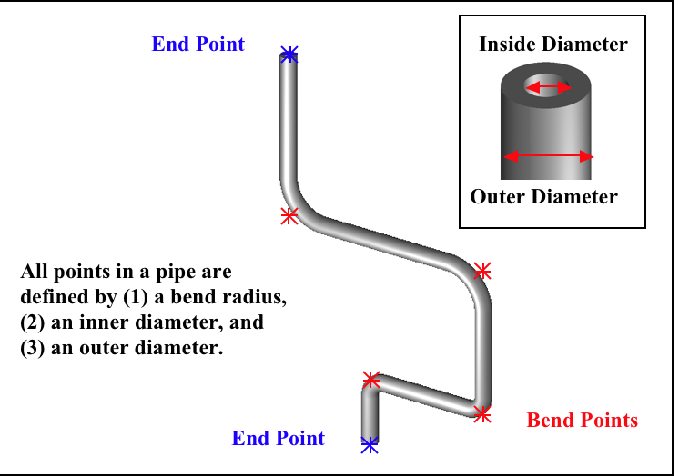

.Various bend radii.
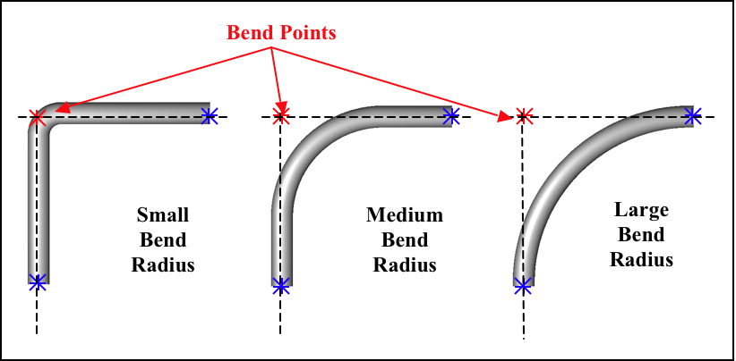

.Example of special uses of the pipe.
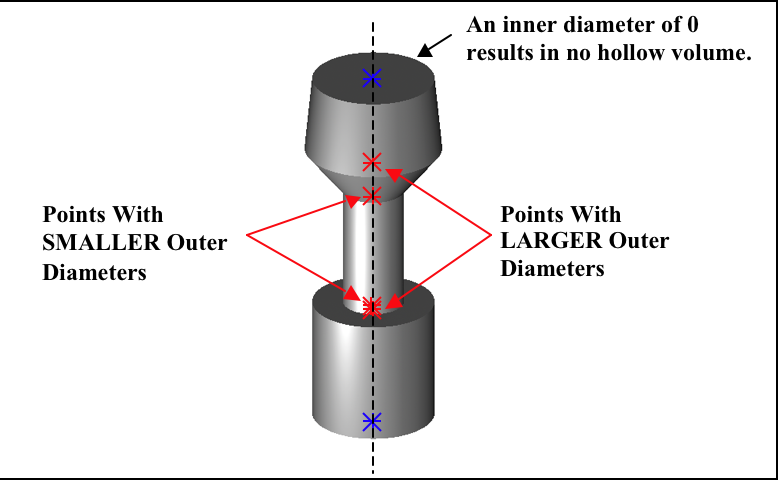

Nonetheless, it is good modeling practice to build your pipe with only those points needed to define its shape. It is not necessary to add extra collinear points along a long straight section of pipe. Note too that pipes are not required to have hollow volume in them at all. The modeler can set the inner diameter to 0 and achieve a solid shape.

Modelers should remember that when a pipe is made with the *make* or *create* command, the default values for the previously listed parameters are based upon the size of the view in the graphics window when the pipe is first created. This is important because modelers can sometimes find themselves unable to move or delete certain points due to relatively large bend radii (e.g., that might have been established when the pipe was first created in a relatively large graphics window). These large radii constrain the shape and prevent it from accepting mathematically invalid commands (e.g., a larger inner diameter than outer diameter or an unacceptably tight bend radius).

[[pipe_make_coil]]
== Making a Coil

In addition to using the pipe primitive to make tubular objects such as electrical and hydraulic lines, it can be used to make other types of objects.

Consider, for example, the building of a wire coil. The pipe primitive can reduce the complexity of the process by avoiding some of the difficulties associated with combining geometry.

The main challenge of using the pipe to build a coil is to locate where the points should be in order to achieve the properly dimensioned geometry. We can start with the following measured dimensions:

* *Diameter of the coil* - The critical measurement here is the center-to-center measurement. It is difficult to measure this directly, but it can be easily derived from an outside-to-outside measurement by subtracting the wire diameter.
* *Diameter of the wire* - This will define the outer diameter (or gauge) of the pipe.
* *Height per coiled section* - The best way to derive this measurement is to take a total measurement of the coil sections and divide by the number of turns. This will ensure the total height and number of turns are correct and will allow one to measure to the tolerance of his tool with minimal error.

In the example shown in Figure A-4, the coil diameter is 1/4 (0.25) in, the wire diameter is 1/32 (0.03125) in, and the height of each of the 10 coil sections is 7/32 (0.21875) in.

.Determining the point positions for the copper coil.
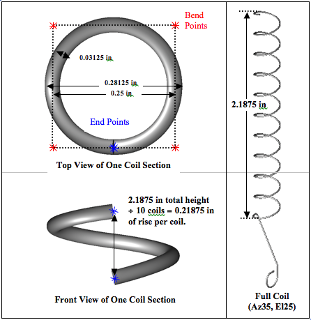

The key to properly and precisely positioning points to build a coil section is to use half of the coil diameter as an offset. The first and the last points in the coil must lie on the pipe's path. These points are easily determined at 90°intervals from the center of the pipe (or, with a bit of trigonometry, at any interval). The rest of the points for the pipe are located at ±offsets in whichever plane is perpendicular to the pipe height vector from the center of the pipe with the proper height delta (which will generally be 1/4 of the height per coil section).

Obviously, the construction of this type of object is a little more advanced than the construction of many of the other types of objects discussed. Thus, the following text provides the user with step-by-step instructions that can also serve as a kind of template when using the pipe primitive to build a coil or similar object.

To build two turns of a coil at the origin with a coil diameter of 1000 mm, a wire diameter of 200 mm, and a coil height of 400 mm (running along the +Z axis), the user would perform the following steps (or ones similar to them):

* Set the units to millimeters using the *units* command on the command line (`mged>units mm`) or the Units option in the graphical user interface (GUI) (File -> Preferences -> Units).
* Set the screen size to 2000 using the *size* command (mged>size 2000) and center the screen at 0 0 400 using the *center* command (mged>center 0 0 400).
* Create a pipe named spring.s1 using the *make* command (mged>make spring.s1 pipe) from the command line or the Create option from the GUI. Select the pipe for editing using either the *sed* command (mged>sed spring.s1) or the Enter Primitive Name dialog box.
* With the default pipe in edit mode, set the diameter of the wire. To do this, first set the inner diameter of the wire to 0 by using the Edit menu's Set Pipe ID option and the *p* command on the command line (mged>p 0). Next, set the outer diameter to 200 using the Set Pipe OD option and the p command (mged>p 200). (Be sure to set the Pipe inner diameter [ID] and outer diameter [OD], not the Point ID and OD.)
* Set the pipe bend to 500 mm using the Edit menu's Set Pipe Bend option and the *p* command (mged>p 500).
* Translate the pipe to coordinate 0 500 0 by selecting the Edit menu's Translate option and the *p* command (mged>p 0 500 0).
* Choose the Edit menu's Select Point option and use the center mouse button to click on (or near) the top of the pipe segment.
* Move the top end point to 500 500 50 using the Edit menu's Move Point option and the *p* command (mged>p 500 500 50).
* Add points at the following coordinates using the Edit menu's Append Point option and the *p* command (the visual effect for each of the commands is shown to the right of each command):

[cols="2*"]
[%noheader]
|===
|- mged>p 500 -500 150
|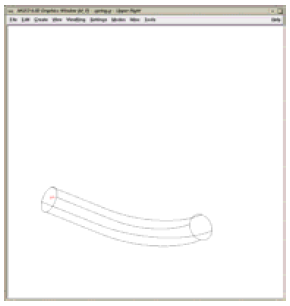
|- mged>p -500 -500 250
|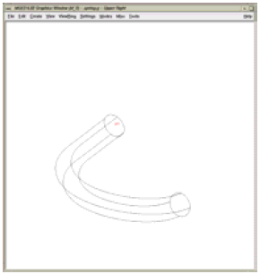
|- mged>p -500 500 350
|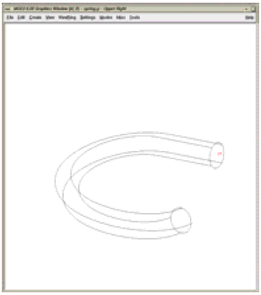
|- mged>p 500 500 450
|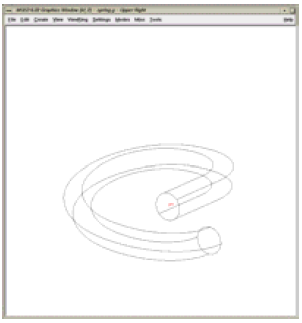
|- mged>p 500 -500 550
|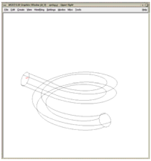
|- mged>p -500 -500 650
|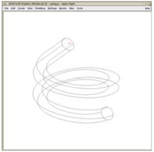
|- mged>p -500 500 750
|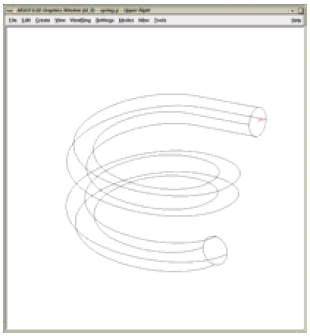
|- mged>p 0 500 800
|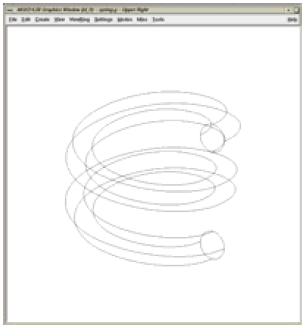
|===

The raytraced image of the coil segment is shown in Figure A-5.

.Raytraced coil segment.
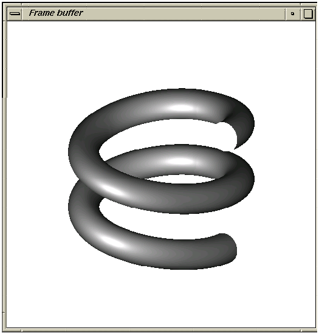

[NOTE]
====
Important Points to Remember About the Pipe
* Even the end points of a pipe have a bend radius (although it is not used unless the point is changed to an interior point).
* Each bend radius value must be greater than half the value of its corresponding outer diameter.
* The pipe primitive does not have to be used for hollow tubes. The inner diameter can be 0, making the object solid.
* The bend radius at each point constrains the pipe in such a way that the path of the pipe often touches only end points, not those in between.
* BRL-CAD will not allow points to be added, deleted, or moved if the result of such actions would create pipes with mathematically invalid characteristics.
* Points may not be coincident; they must be offset by at least 0.0001 mm.
* When modeling a tube with fluid inside of it, model both the tube and fluid as solid pipes and subtract the fluid from the tube.

====
