= BRL-CAD Procedural Geometry Gallery
:doctype: article
:toc:
:toclevels: 2

This gallery shows the procedural-geometry demonstration programs in BRL-CAD's
`src/proc-db` and `src/shapes` directories. Each model is built from source by its
generator program and then ray traced with `rt` -- no hand modeling. The renders are
auto-framed and auto-lit by the ray tracer using ambient occlusion:

----
rt -s512 -c "set ambSamples=64" [-c "autoview <objs>"] -A1 -o <name>.png <db>.g <objects>
----

Some renders use the `rt -c "autoview <objs>"` command to frame a sub-scene (for
example, to exclude a distant light source from the view).

NOTE: This article and its images are a committed snapshot. Developers can regenerate
them from the built tools by configuring with `-DBRLCAD_GENERATE_GALLERY=ON` and
building the `procedural-gallery-snapshot` target.

== New demonstrations

[cols="1,3"]
[%noheader]
|===
|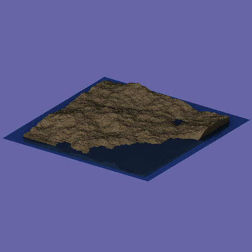
|*terragen*: Fractal DSP terrain island with reflective water and a cloud environment-map sky; rendered with the new rt autoview command framing terrain+water.
|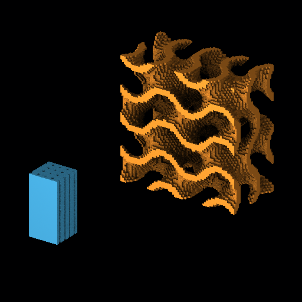
|*voxelize*: Demonstrates BRL-CAD's "vol" (3-D volume) and "ebm" (extruded bitmap) primitives by sampling a procedural 3-D scalar field (a triply-periodic gyroid by default) over a regular grid. It writes sidecar .vol/.ebm data files and builds an orange voxel isosurface (with a cutaway box) plus a blue extruded height-field companion.
|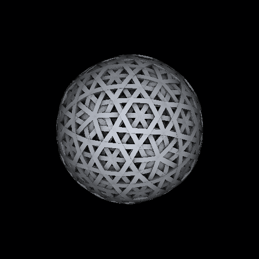
|*lattice*: A full geodesic-sphere space-frame built by instancing one unit strut prototype across every de-duplicated geodesic edge, with joint spheres.
|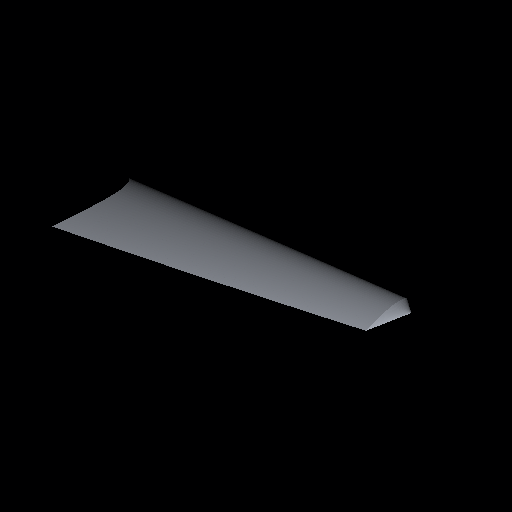
|*loftwing*: A lofted NACA 4-digit airfoil wing (ARS) with taper, twist, sweep, and dihedral and a full root section.
|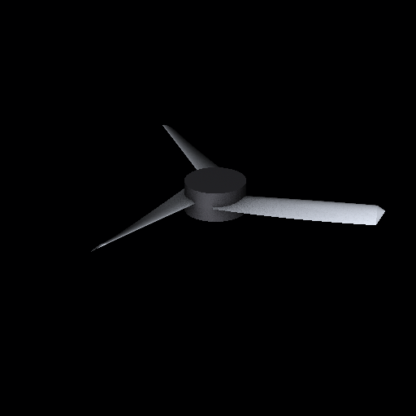
|*loftwing_prop*: Propeller mode of loftwing: one strongly twisted NACA blade instanced around a central hub to form a 3-blade propeller.
|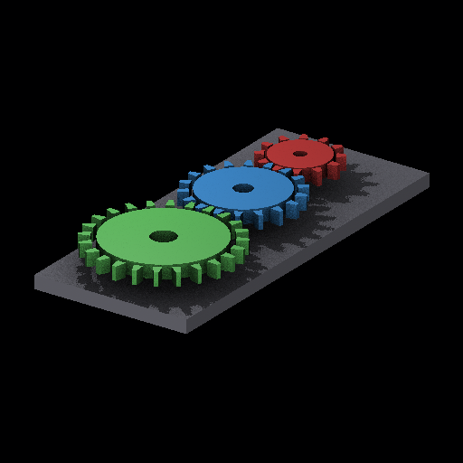
|*gears*: Builds a meshing involute spur-gear train, demonstrating the sketch->extrude procedural-modeling workflow in libwdb: each gear is one extruded involute tooth profile unioned in rotated copies around a hub with a central bore, laid left-to-right so the teeth interlock, plus a ground plane and a light under a top group "all".
|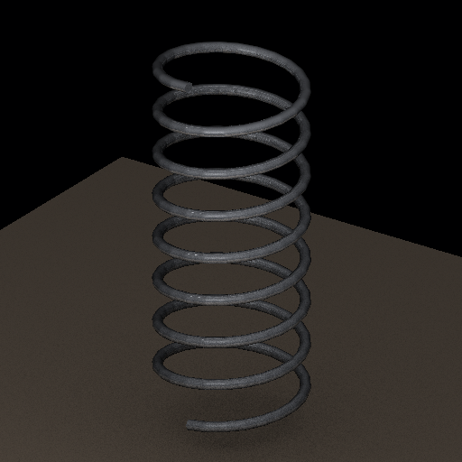
|*helicoil*: Procedurally builds helical pipe solids (spring, screw, or DNA double helix) swept along a helix centerline via mk_pipe(); the default "spring" mode renders a chrome coil spring on a ground plane with a light, assembled into a top-level group "all".
|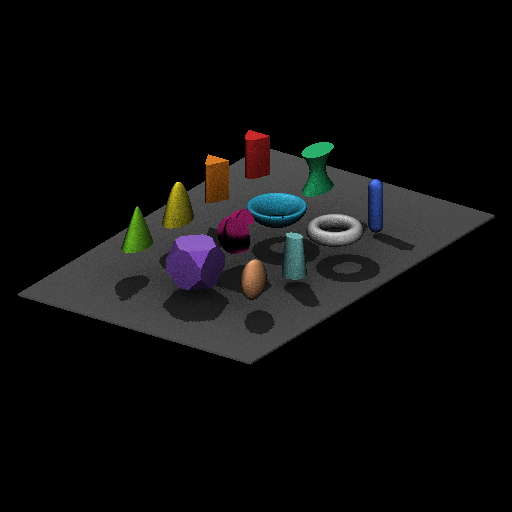
|*specimen*: Analytic-primitive specimen shelf (rpc, rhc, epa, ehy, hyp, eto, hrt, arbn, particle, tor, tgc, ell); rt autoview frames the shelf.
|===

== Fractals & recursion

[cols="1,3"]
[%noheader]
|===
|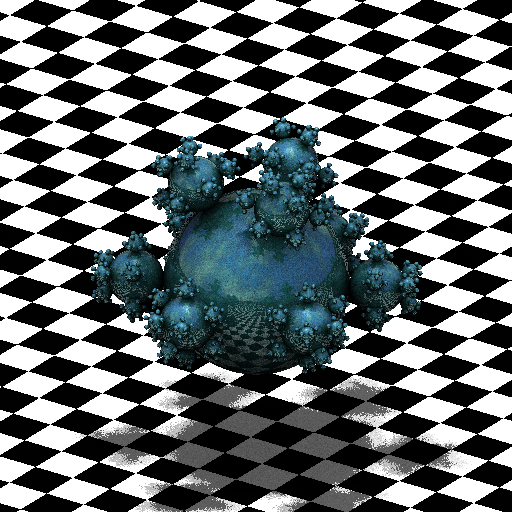
|*sphflake*: Recursive mirror-sphere flake fractal; rendered with rt autoview framing the flake (depth0-3.r) over a checkered plane.
|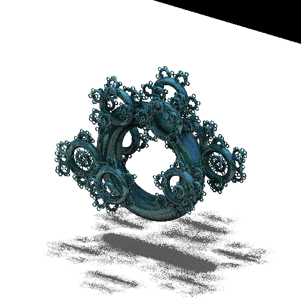
|*donuts*: Recursive torus "donut flake" fractal; rendered with rt autoview framing the flake regions.
|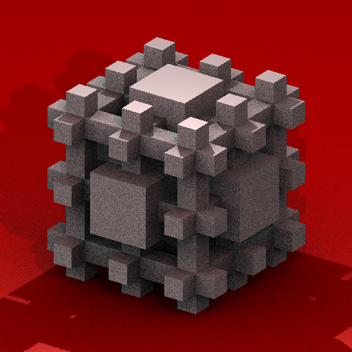
|*menger*: A Menger sponge fractal carved from a cube with the recursive exterior (subtractive) pattern, on a ground plane with two lights.
|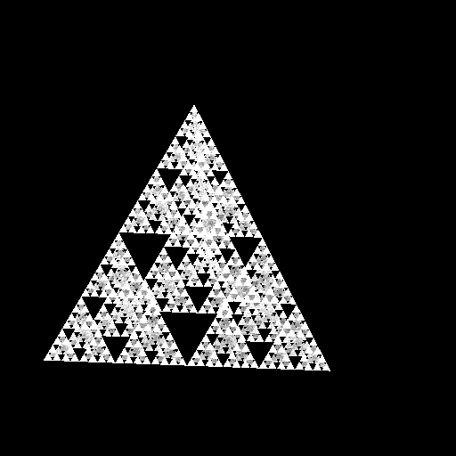
|*pyramid*: Generates a recursive 3-D Sierpinski-style pyramid built from ARB4 tetrahedra, subdividing each pyramid into 4 smaller ones per level (inspired by Glassner's SigGraph paper).
|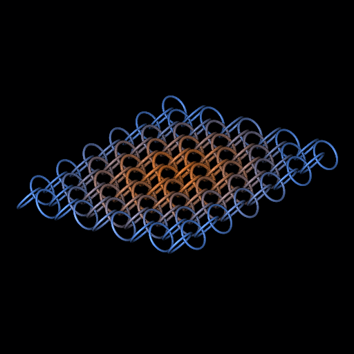
|*torii*: An interwoven chain-mail weave of interlocking torii with a radial gradient of tube thickness (and color). Adjacent rings thread each other's holes without the solid tubes ever intersecting (verified 0 overlaps), so the whole sheet is a single, articulating, fully 3D-printable piece of mail.
|===

== Architecture & structural

[cols="1,3"]
[%noheader]
|===
|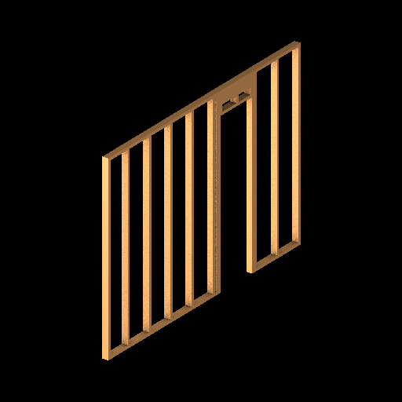
|*masonry_frame*: masonry wall generator, wood-frame wall type: studs, plates, and framing around a window opening.
|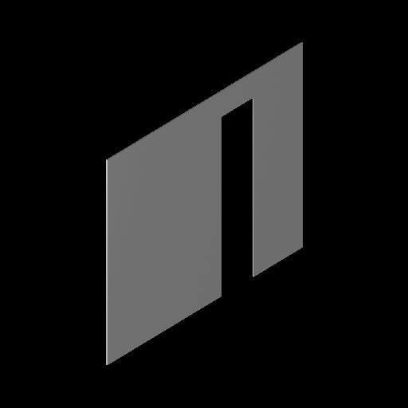
|*masonry_sheetrock*: masonry wall generator, sheetrock wall type.
|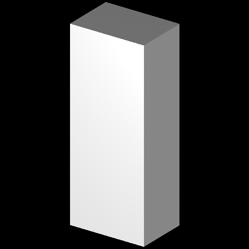
|*masonry_brick*: masonry wall generator, brick wall type (prototype brick).
|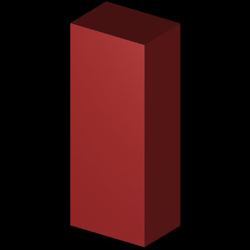
|*masonry_bm*: masonry wall generator, mortar-brick wall type: brick with horizontal and vertical mortar joints.
|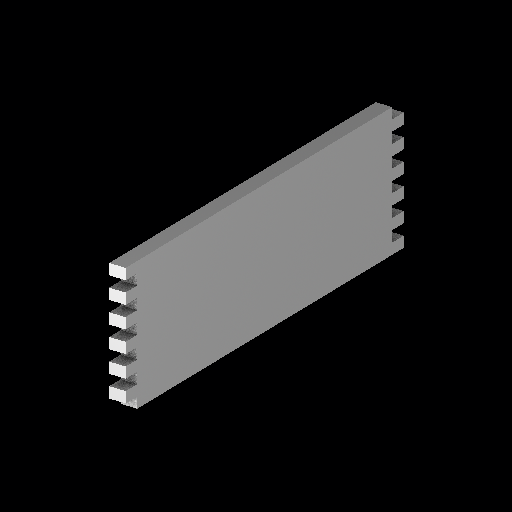
|*brickwall*: Builds a brick wall: emits mged commands that create RPP brick solids arranged in rows (with optional mortar slabs between them) to fill a specified wall width and height. Output is a stream of mged commands on stdout, not a .g directly.
|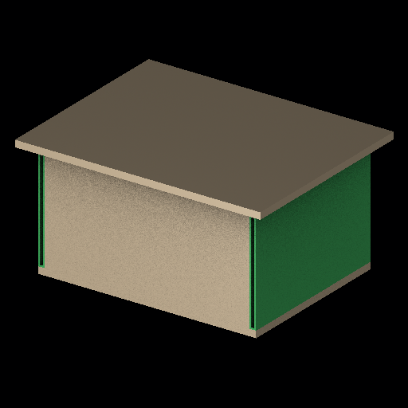
|*mkbuilding*: Procedurally builds a small building: a floor slab, four framed walls with openings, and an overhanging roof.
|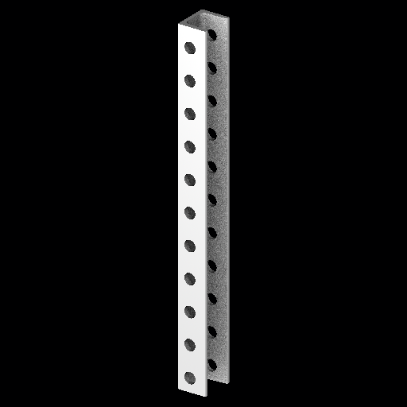
|*cchannel*: Creates a section of fully configurable C-channel (structural metal beam). Default is a 1" diameter by 12" long section of American standard C-channel, here generated with a row of drilled holes.
|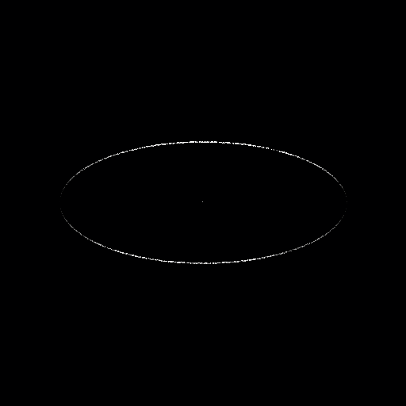
|*ringworld*: Generates a "ringworld" as imagined by Larry Niven: a central sun sphere and a large CSG ring (built from three RCCs) orbiting it, combined into a top-level group all.g.
|===

== Organic, molecular & scenery

[cols="1,3"]
[%noheader]
|===
|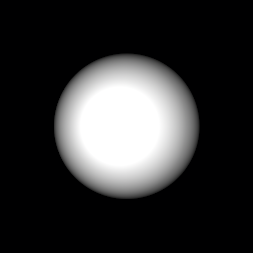
|*vegetation*: Procedurally generates plant-like geometry (trees/shrubbery) from particle primitives built recursively with random branching and growth parameters, including an optional repeatability seed.
|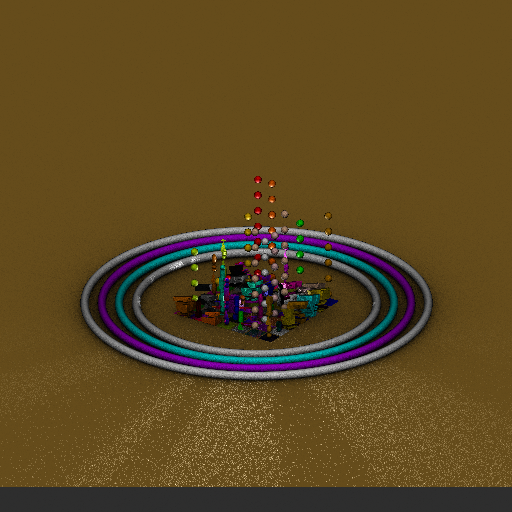
|*clutter*: Generates procedural "clutter" made of primitive geometric objects: a grid of detail cells on a ground plane, each holding a random stack of spheres, crystals, or mixed primitives (boxes, cylinders, cones, ellipsoids), all enclosed by concentric torus rings and lit by four corner lights.
|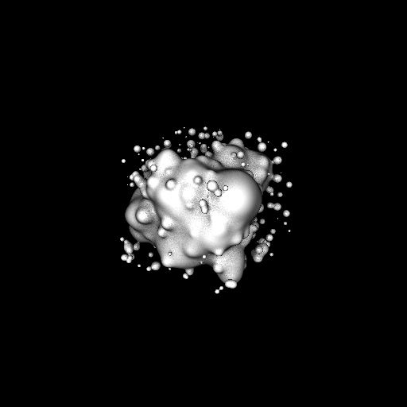
|*metaball*: Programmatically creates and combines metaball ("blobby") primitives: it generates three sets of randomly-placed iso-method metaballs via libwdb, then reads them back and merges all their points into one combined "mega metaball" via librt.
|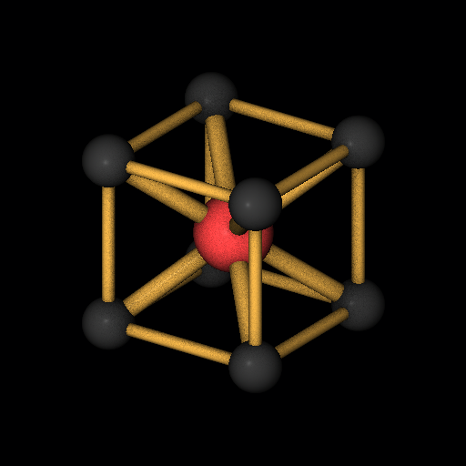
|*molecule*: Ball-and-stick molecule (spheres for atoms, cylinders for bonds) read from a G. Adams .dat file -- here a bonded cube of atoms with a central hub.
|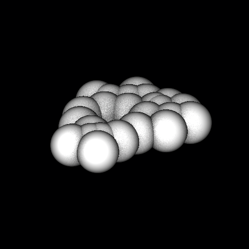
|*pdb-g*: Reads a Protein Data Bank (PDB) text file and converts each atom into a 1mm-radius sphere, grouping them into a single combination to produce a BRL-CAD geometry database of the molecule (caffeine).
|===

== Mechanical & engineering

[cols="1,3"]
[%noheader]
|===
|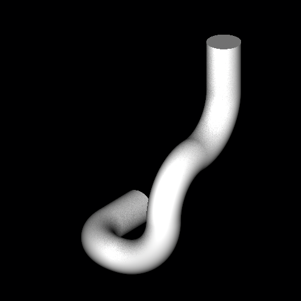
|*pipe*: Generates piping (fuel/hydraulic lines, etc.) in MGED format from a routed sequence of 3D points, building both tubing regions and inner fluid regions, with automatically generated elbow regions wherever the pipe changes direction.
|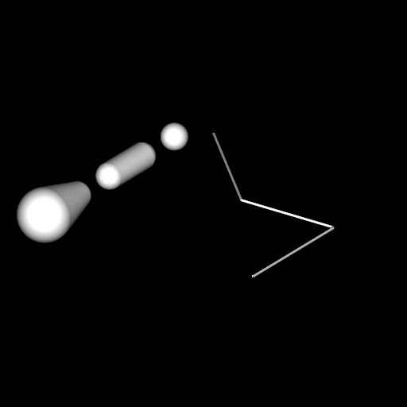
|*pipetest*: Generates a test database of pipe and particle primitives: three particle solids (spherical, cylindrical, and conical) plus a multi-segment straight pipe and a bent pipe traced around a cube's faces.
|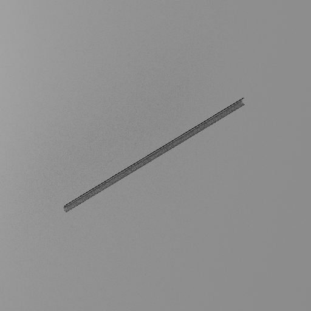
|*tube*: Generates a gun-tube (cannon barrel) as a procedural spline/cylinder whose core lies on the X axis, optionally deformed per-frame from projectile firing data. With no stdin data it emits the static frame-0 geometry from a built-in center-of-mass table.
|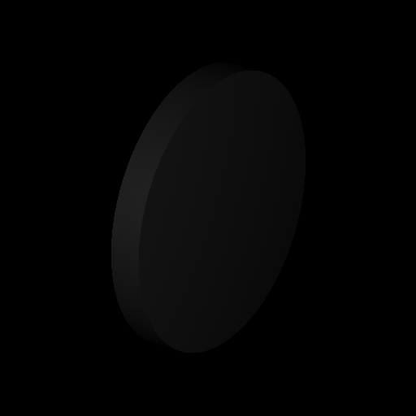
|*lens*: Generates basic optical lenses (plano/double convex or concave) by using the lensmaker's equation to derive the geometry from inputs like type, diameter, focal length, refractive index, and thickness.
|===

== NURBS, B-rep, splines & surfaces

[cols="1,3"]
[%noheader]
|===
|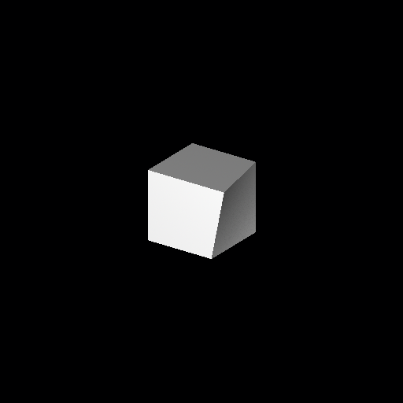
|*brep_simple*: Creates a single twisted-cube B-Rep solid directly via the openNURBS API (8 vertices, 12 edges, 6 faces) and writes it to a BRL-CAD database, demonstrating NURBS B-Rep construction.
|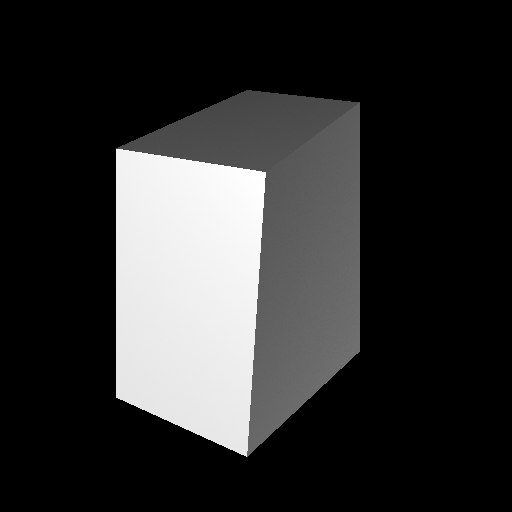
|*brep_cube*: Creates a twisted-cube B-Rep solid (8 vertices, 12 edges, 6 faces) by directly using the openNURBS API, then writes it to a BRL-CAD database. Copied almost verbatim from the openNURBS example_brep.cpp to explore B-Rep creation.
|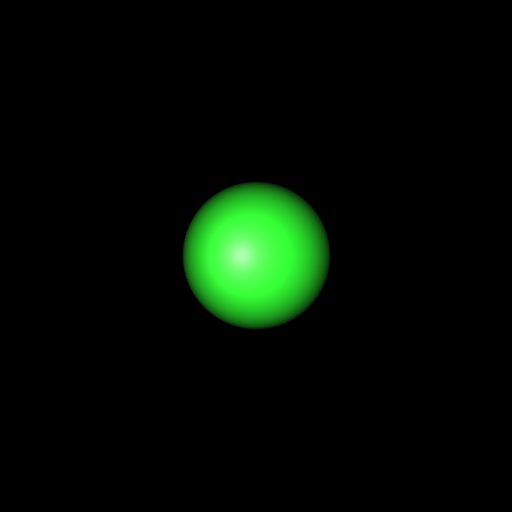
|*brep_cobb*: A Cobb NURBS unit sphere tiled with six rational Bezier patches.
|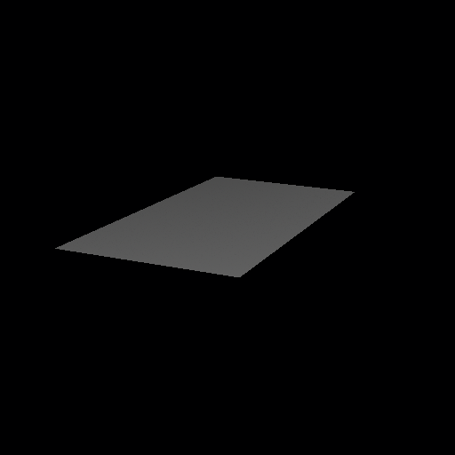
|*brep_surface*: Creates a single plate-mode NURBS (B-Rep) surface with a given thickness, defined by four control points, and writes it as a region to a .g database.
|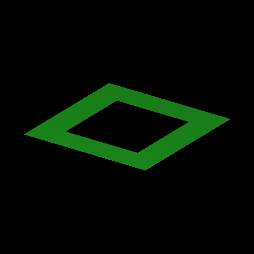
|*brep_trimmed*: Generates a single B-rep NURBS surface (a flat 10x10 square patch) with both an outer trimming loop and an interior rectangular trim/hole, demonstrating ON_Brep construction of trimmed surfaces.
|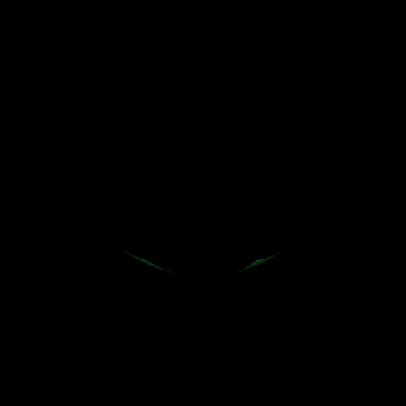
|*brep_invalid*: Creates a single trimmed NURBS B-rep surface (one face of a Cobb sphere) with a deliberately invalid inner trim loop, to test/demonstrate handling of invalid trim geometry.
|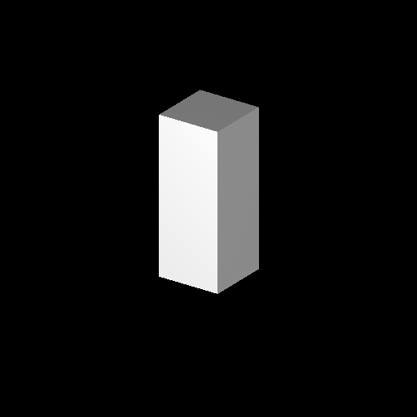
|*breplicator*: breplicator is a test tool for the BREP (boundary representation) primitive in librt; it builds a single closed 6-faced NURBS solid (an arb8-shaped box) via mk_brep() and writes it to a database.
|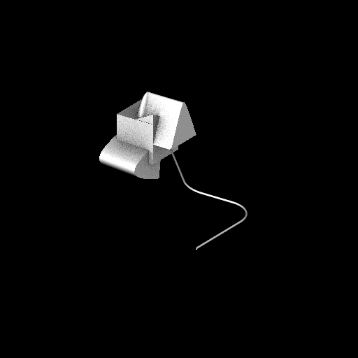
|*csgbrep*: A reference gallery of CSG/implicit primitives, each also converted to a brep, grouped under a single top object.
|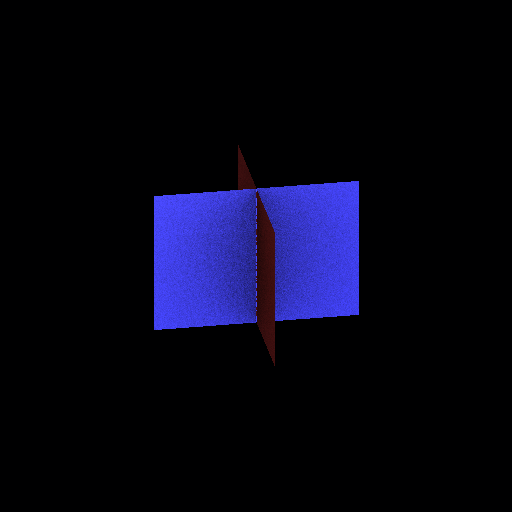
|*surfaceintersect*: Writes the two twisted-cube NURBS B-rep surfaces (red and blue). The experimental surface-surface intersection is behind a -x flag (off by default, as it currently crashes).
|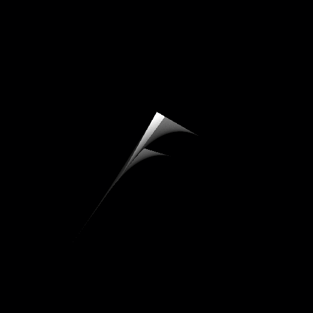
|*spltest*: A NURBS spline test: a valid order-2 B-spline surface built from a 3x3 control mesh with a gently lifted center.
|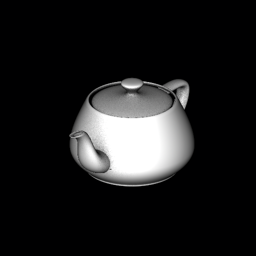
|*tea*: Converts the Utah Teapot description from the IEEE CG&A database into BRL-CAD spline (NURBS) format, producing the classic closed-bottom teapot as a B-spline solid.
|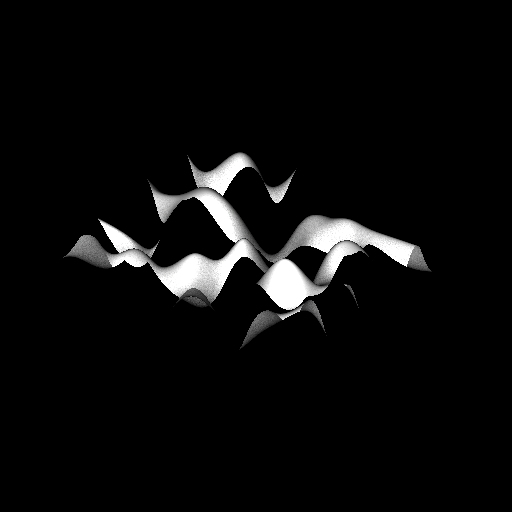
|*wavy*: Creates a random wavy surface modeled as a B-spline (NURBS) surface, generating a 10x10 grid of points with randomized height and interpolating them into a spline solid.
|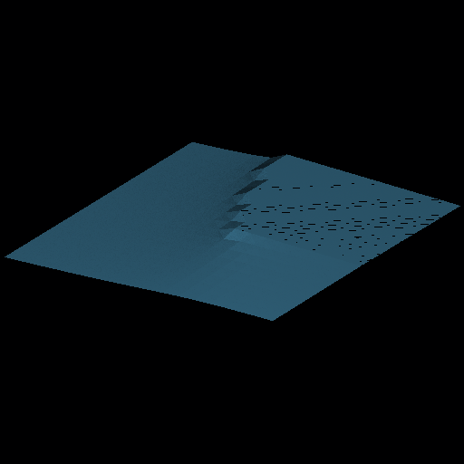
|*kurt*: Builds a surface from a multi-valued cubic function sampled over an 18x18 grid, triangulated into a BoT height-field sheet.
|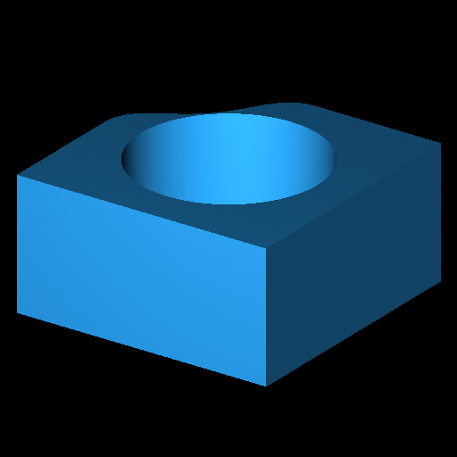
|*sketch*: Builds a 2D sketch (line/arc/bezier segments) and extrudes it into a renderable solid via mk_extrusion.
|===

== Primitives, BoT & API basics

[cols="1,3"]
[%noheader]
|===
|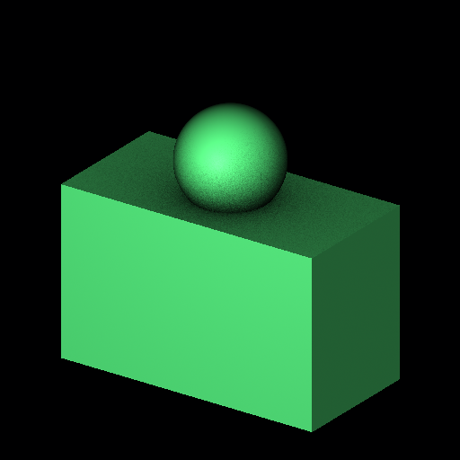
|*wdb_example*: Demonstrates creating a BRL-CAD geometry database from C code using the libwdb API: it writes a sphere (ball.s) and an rpp/box (box.s), then unions them into a green plastic region named box_n_ball.r.
|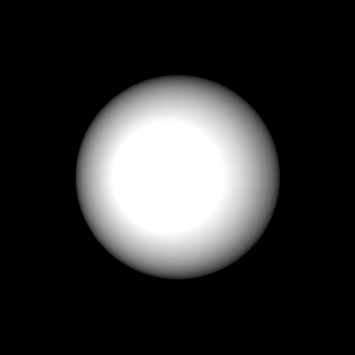
|*globe*: Creates a set of concentric spherical "shells" (like an onion) that together form a unified solid sphere: a green solid land core surrounded by progressively transparent blue air layers.
|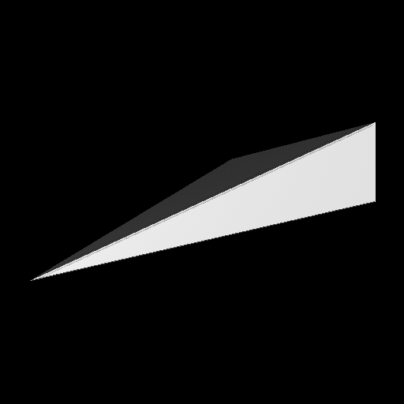
|*bottest*: Generates a set of test BOT (Bag of Triangles) solids in a .g database, covering every BOT mode/orientation combination: surface, solid, and plate types in unoriented/CCW/CW orientations, plus BOTs with duplicate vertices and faces for fuse/condense testing.
|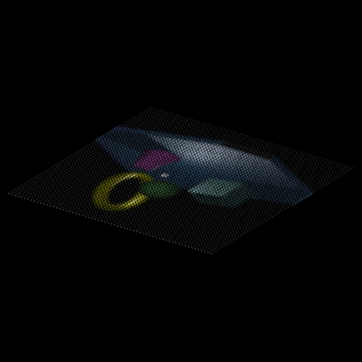
|*pix2g*: pix2g generates geometry from a pixmap (.pix) image: it creates one colored sphere per pixel arranged on a grid, where each sphere's color matches the corresponding pixel's RGB value, producing a 3D point-cloud rendition of the image.
|===

== src/shapes -- parametric shape generators

[cols="1,3"]
[%noheader]
|===
|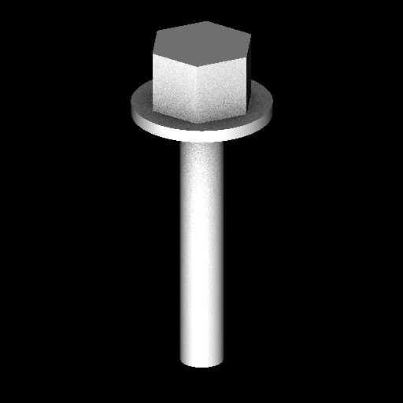
|*bolt*: bolt is a BRL-CAD libwdb program that creates a bolt (in mm). It can build four types: a bolt head, head + washer, head + washer + stem, or head + stem. The head is a hex (two arb8 solids), the washer and stem are RCCs.
|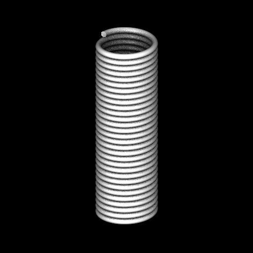
|*coil*: Coil Generator -- a program to create coils (helical springs) using the BRL-CAD pipe primitive.
|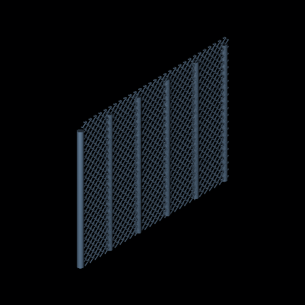
|*fence*: A chain-link fence generator. Every parameter (height, length, pole radius/spacing, wire radius, mesh twist angle, materials/colors) can be adjusted; it builds vertical RCC poles plus a woven zig-zag wire mesh between them.
|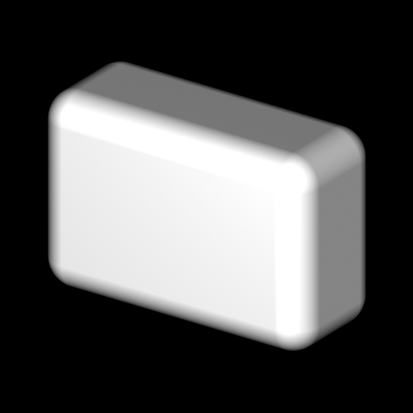
|*gastank*: A solid gas tank with all edges and corners rounded, composed of 3 arb8s, 8 spheres, and 12 cylinders, centered at the origin (dimensions in mm). Introduced in BRL-CAD release 4.4.
|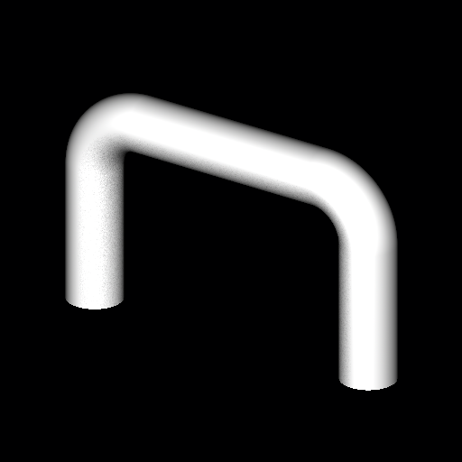
|*handle*: handle is a BRL-CAD libwdb sample program that constructs a handle (in millimeters) from three cylinders, two tori, and two arb8s, with its base centered at (0,0,0) and its height extending in the +Z direction. Introduced in BRL-CAD release 4.4.
|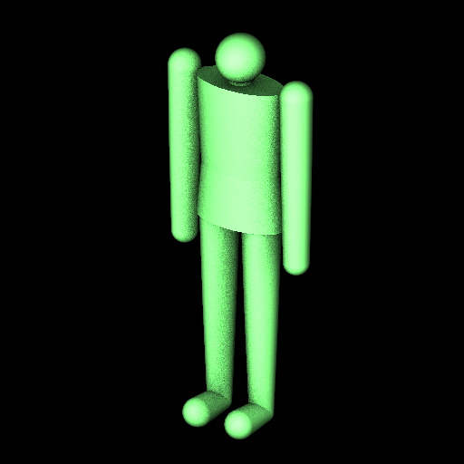
|*human*: Generator for human models based on height (and other anthropometric parameters). It procedurally builds an articulated humanoid body assembled from primitives (head, neck, torso, arms with shoulder/elbow/wrist joints, hands, thighs/calves with knee joints, and feet), defaulting to a standing 50th-percentile man.
|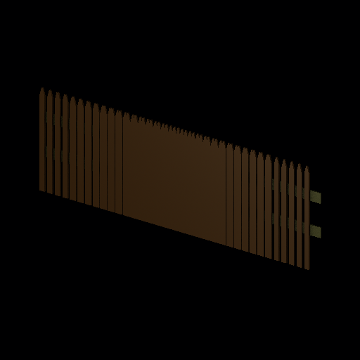
|*picket_fence*: picket_fence builds a wooden picket fence: vertical pointed-top pickets (arb8 posts with wedge-cut tops) joined by two horizontal stringer rails, laid out along a sequence of x/y/z waypoints so the fence can follow a multi-segment path. Rendered as brown plastic pickets with two rails across two fence sections.
|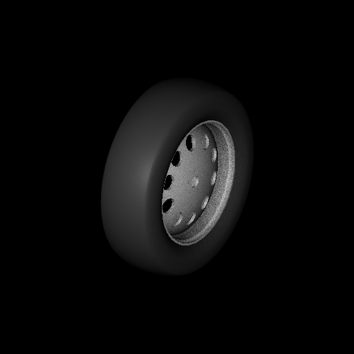
|*tire*: tire is BRL-CAD's Tire Generator, a program to create basic tire shapes (with an optional wheel). The rendered model is a default ISO 215/55R17 passenger tire mounted on a wheel hub.
|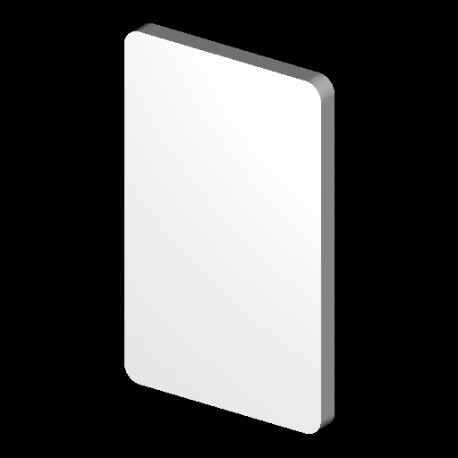
|*window*: window constructs a window with all edges and corners rounded, composed of two arb8s and four cylinders, built using libwdb in millimeters. The front of the window is centered at the origin and extends in the negative X-direction by the window depth.
|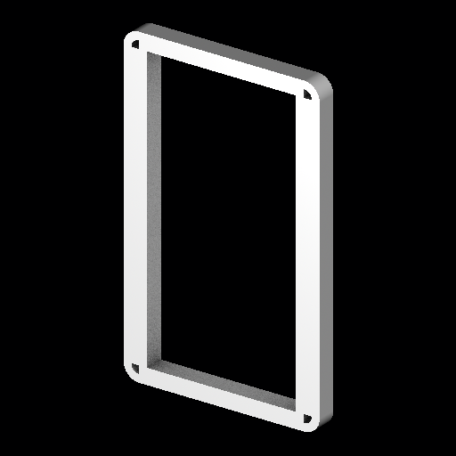
|*window_frame*: window_frame constructs a window frame with all edges and corners rounded, composed of 4 arb8s and 8 cylinders (in millimeters). The front of the frame is centered at the origin and extends in the negative x-direction by its depth.
|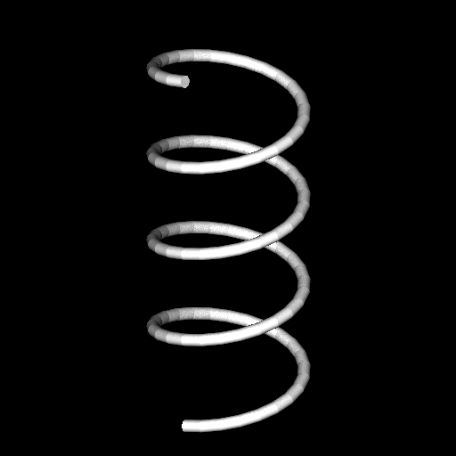
|*wire*: wire creates wiring or fuel lines from user-supplied endpoint coordinates and line radii. It builds a continuous tube as a chain of truncated cones (segments) joined by spheres at the vertices, grouped under a "wires" combination -- here a four-turn helix.
|===

== Known limitations

A few programs are part of the source tree but are not shown above, because the
geometry they produce cannot be ray traced in the current tree:

* *nmgmodel* -- Intentionally non-manifold NMG exercising 3-, 2-, 1-, and 0-manifold features (a holed/voided block plus dangling faces, wires, and a lone vertex). It generates valid geometry, but the libnmg raytracer aborts on it (BU_ASSERT in isect.c), so it cannot be raytraced.
* *tea_nmg* -- Utah teapot as a t-NURBS NMG (closed bottom). The vertex-fuse fix lets it write geometry, but rt aborts importing the t-NURBS NMG (NMG_CK_DISKMAGIC) -- a librt limitation with t-NURBS NMG, not a usage issue.
* *gtimes* -- A ray-trace/database timing benchmark: it opens an existing .g repeatedly and prints timings for db_open, db_dirbuild, db_update_nref, tops, and db_close. It produces no geometry.
