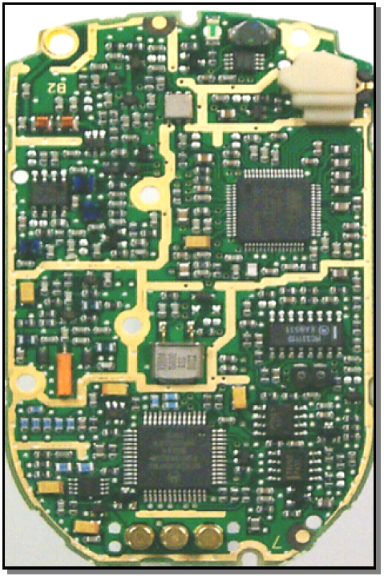
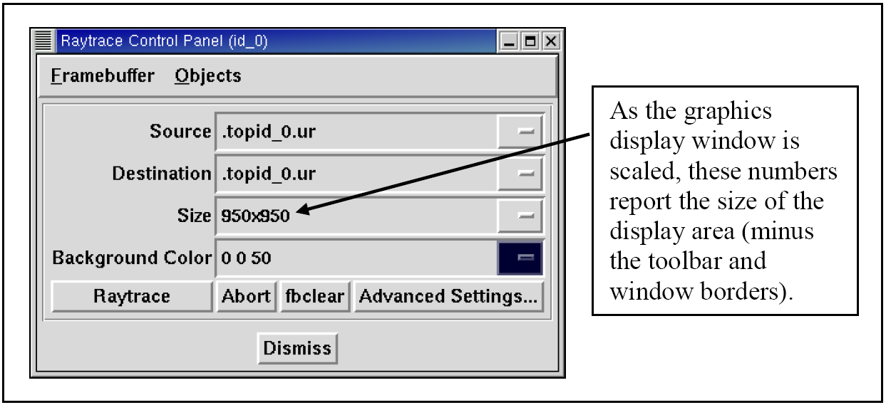
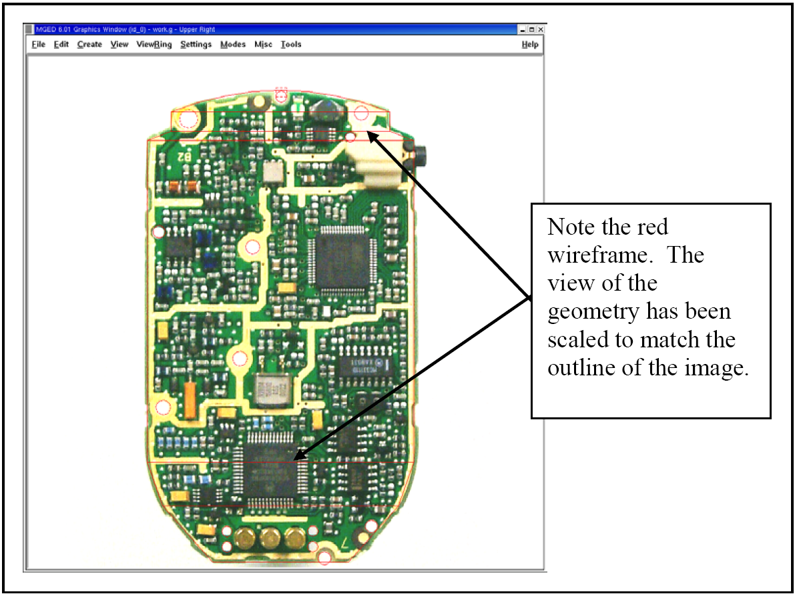
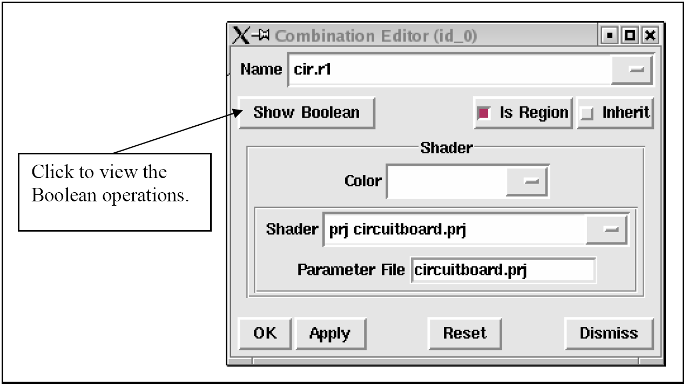
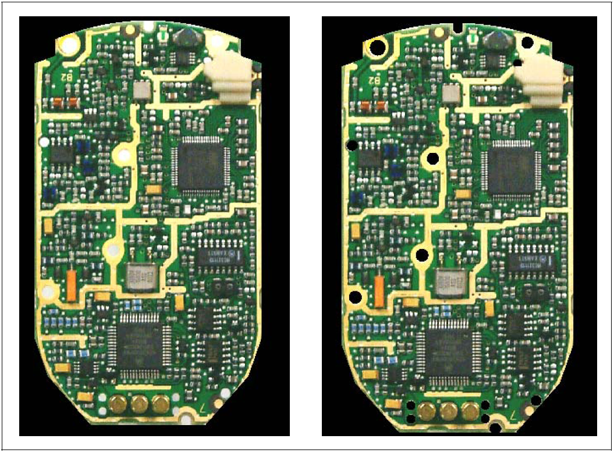
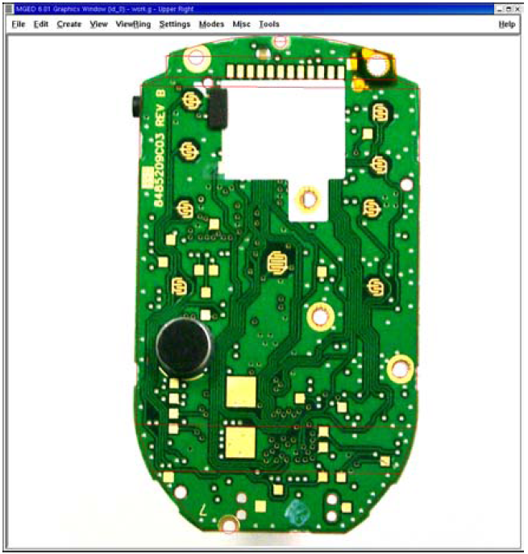
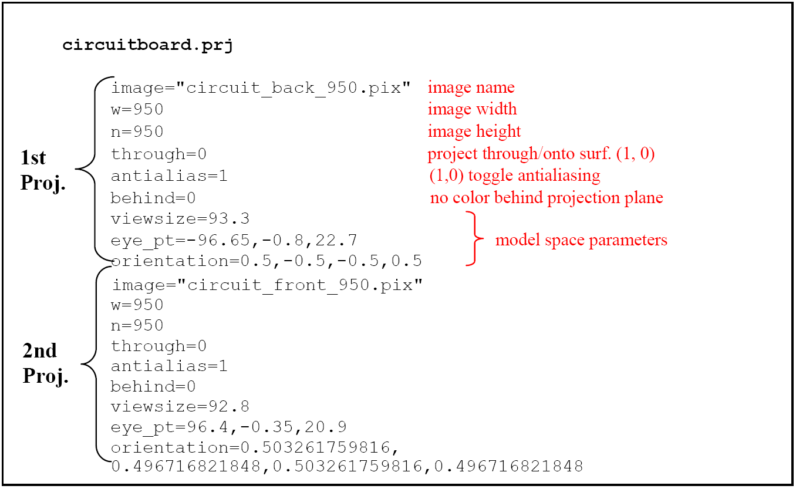

= Using the Projection Shader
Lee A Butler; Eric W Edwards; Dwayne L Kregel
:doctype: article
:toc:
:toclevels: 3

[[projshader_general]]
== General

Though the U.S. Army Ballistic Research Laboratory - Computer-Aided Design (BRL-CAD) package has the capability to model highly detailed and complex surfaces of objects, such as the multitude of small chips, connectors, and other electrical components on a circuit board (see Figure B-1), individually building each piece of a complex surface is often labor intensive, time consuming, and unnecessary for the model's intended purpose. Thus, the package offers an alternative, the projection shader, to create realistic-looking "skin" for objects.

.The many components of a circuit board.

As its name implies, the projection shader projects an image onto a surface. Unlike the texture shader, however, which fits an image to all available surfaces (stretching/shrinking as necessary), the projection shader projects the image with user-defined dimensions and orientations.

There are several ways that advanced users can implement and customize the projection shader in BRL-CAD. The average user can reduce the complexity of the process, however, by complying with the following three basic rules of thumb:

* the image to be projected should be square,
* the geometry window (minus the toolbar and borders) should be square, and
* the projected image should exactly fill the framebuffer.

The following list identifies the basic tasks needed to use the projection shader:

* create/obtain an image to project,
* resize the graphics display window or image so that their dimensions match each other,
* ensure the framebuffer is active,
* display the image in the framebuffer of the graphics display window,
* align the image on the geometry by modifying the view parameters,
* save the projection shader settings file,
* apply the shader settings file to the object in the combination editor, and
* render the image.

Each of these steps is discussed in the following paragraphs using the example of the previously mentioned circuit board.

[[projshader_getimage]]
== Create/Obtain an Image to Project

The first step in using the projection shader is to create or obtain the image to be projected. The image can be a pre-existing picture file, or it can be created specifically for the projection. In this case, we took a photograph of the circuit board with a digital camera and used a commercially available PC image editor to make the image square. When finished, we saved the image as a .jpg file, with the name circuit_back_950.jpg. (Note that it is wise to include the image dimensions [i.e., 950 pixels wide ×950 pixels high] in the file name because many projection shader tasks rely on them.) To get the image into a BRL-CAD-accepted format (see tutorial box that follows), we converted the .jpg file to a .png file using an image editor and then the .png file to a .pix file using the BRL-CAD png-pix utility. For more information on this utility, consult the man page.

[NOTE]
====
BRL-CAD recognizes several image file formats, including .pix, .png., and .ppm. Because the package relies on precise color values to perform certain calculations, it does not support lossy file formats (e.g., .jpg), which are based on algorithms that can alter or lose image/color data.

====

[[projshader_resize]]
== Resize the Graphics Display Window to Match Image Dimensions

The next step is to "prepare" the area on which the image will be displayed so that it is ready for the image. For the circuit board, the size of the photograph was 950 pixels ×950 pixels high. To make the graphics display window match, we opened the Raytrace Control Panel and used the numbers in the Size window box as a reference to determine how much to enlarge/shrink the graphics display window (by using the mouse to drag the window borders in or out) (see Figure B-2).

.Using the Raytrace Control Panel to size the graphics window.

[NOTE]
====
Note that the Raytrace Control Panel (specifically, the Size field) is used here simply to report the result of the user scaling the dimensions of the graphics display area. It is not used to set the desired dimensions (in this case, 950 ×950) of the graphics area by inputting them into the Size field. Any numbers input into this field will only determine the size of the display area in the next raytrace.

Also note that some window managers have information boxes that automatically report the size of the graphics display window as it is being enlarged/reduced; however, the dimensions reported in these boxes often represent the size of the entire window (including toolbars, borders, etc.) and not the size of the framebuffer.

====

[[projshader_actframe]]
== Ensure the Framebuffer is Active

A small but sometimes overlooked step before displaying any image onto the graphics display window is to make sure the framebuffer is active. If it is not active, it may appear that nothing happens when a display command is given. There are several ways to check the status of the framebuffer. We went to the Settings pull-down menu in the graphical user interface, selected Framebuffer, and made sure the box next to the Framebuffer Active option was toggled on.

[[projshader_dispimage]]
== Display the Image in the Graphics Display Window

After the graphics display window has been prepared and the framebuffer checked/set, the image can be displayed in the graphics window. To do this, we entered the following command:

....

pix-fb -F0 -s 950 circuit_back_950.pix
      
....

Diagrammed, the command breaks down as follows:

[cols="5*"]
[%noheader]
|===
|pix-fb
|-F0
|-s
|950
|circuit_back_950.pix
|Send a .pix file to a framebuffer.
|Use framebuffer number 0.
|Make it a square image.
|950 pixels wide and high.
|Use the image file named circuit_back_950.pix
|===

For more information on the pix-fb command (including a list of other options the command takes), type pix-fb on the command line or consult the man page.

[NOTE]
====
Note that framebuffers use transmission control protocol (TCP) ports for applications. The framebuffer number that follows the -F option specifies an offset from the TCP port number. Framebuffer 0 is on port 5558. If 0 is already in use, the Multi-Device Geometry Editor (MGED) will use the next available framebuffer number (e.g., 1, 2, 3, etc.). To determine which port MGED is actually using, type "set port" from the MGED command prompt.

====

[[projshader_overlayimage]]
== Overlay the Image on the Geometry by Modifying the View Parameters

With the image and the target geometry displayed, edit the view parameters so that the image is aligned with the geometry on which it is to be projected. In our case, we used the Shift-Grips to scale and translate and the ae command to adjust the azimuth, elevation, and twist of the circuit board wireframe so that its outside edges lined up with the outside edges of the projected image (see Figure B-3). (For a refresher on the functionality of the Shift-Grips, consult chapter 2, Volume II, of the BRL-CAD Tutorial Series.)

[[projshader_savesettingsfile]]
== Save the Projection Shader Settings File

After the geometry and image have been aligned, the projection settings (i.e., image file name, image width, image height, and current view parameters) can then be saved to a file using the prj_add command. The prj_add command appends the image file name and the current view parameters to the shader file. In our case, the command was:

....

prj_add circuitboard.prj circuit_back_950.pix 950 950
      
....

Diagrammed, this command breaks down as follows:

[cols="5*"]
[%noheader]
|===
|prj_add
|circuitboard.prj
|circuit_back_950.pix
|950
|950
|Add the projection file name and parameters to the shader.
|Name the shader circuitboard.prj
|Use image file circuit_back_950.pix
|Make the image 950 pixels wide.
|Make the image 950 pixels high.
|===

.Fitting the geometry view to the image dimensions.

[[projshader_applysettingsfile]]
== Apply the Shader Settings File to the Object in the Combination Editor

The projection now needs to be applied to the object. We did this by opening the combination editor, typing in the region name cir.r1 in the Name field, and selecting Projection from the pull-down menu to the right of the Shader field. We then typed circuitboard.prj in the Parameter File field and pressed Apply (see Figure B-4). Note that when the name of the shader file is typed into the Parameter File field, the same information is echoed into the Shader field.

[[projshader_render]]
== Render the Image

The final step in using the projection shader is to raytrace the object to determine if all the other steps have been performed correctly. In our case, rendering the image identified several problems that we wanted to correct. First of all, as shown in Figure B-5, the holes in the board failed to convey the three-dimensional look we desired. So, we went back and modeled circular cutouts (using cylinder primitives) to improve the appearance. In addition, the rendered image revealed that the image we were using was too dark. So, we ended up adjusting the gamma setting on the original image (a .jpg file) in an external photo editor.

.Applying the shader settings with the combination editor.

.Original image (left) and image with circular cutouts (right).

[[projshader_projectfront]]
== Repeating the Steps to Project the Image on the Front

After one side of the circuit board was finished, we proceeded to repeat the steps to add more projection parameters to the .prj file and thus project a different image onto the front side of the geometry (see Figure B-6). To do this, we once again had to acquire an image, properly size the geometry window, display the image and the geometry to the geometry window, and set up view parameters. After this was done, these parameters could be added to the existing .prj file by typing the following:

....

prj_add circuitboard.prj circuit_front_950.pix 950 950
      
....

.The projection shader applied to the front of the circuit board.

Figure B-7 shows the resulting prj file. (Note that the first projection is on top and the second projection is on the bottom.)

.The circuit board .prj file.

