= BRL-CAD Renderer Showcase
:doctype: article
:toc:
:toclevels: 2

This gallery shows BRL-CAD's image-producing ray-tracing front ends and
selected `rt` output styles rendered against the sample Cornell box model.
Each snapshot uses the same database, object, perspective, and saved view
matrix from `db/cornell.rt`:

----
rt -B -M -p55 -s512 -P1 [style options] -o <name>.png cornell.g all.g < cornell.view
----

The scalar and plot outputs are converted with BRL-CAD image tools.  In
particular, `rthide` is rendered as plot3 and rasterized with `plot3-fb` and
`fb-png`.

NOTE: This article and its images are a committed snapshot. Developers can
regenerate them from the built tools by configuring with
`-DBRLCAD_GENERATE_RENDERER_GALLERY=ON` and building the
`renderer-gallery-snapshot` target.

== RT lighting models

[cols="1,3"]
[%noheader]
|===
|image:images/renderer_gallery_rt_l0.png[rt_l0,512]
|*rt -l0 full lighting*: Full lighting model with explicit Cornell-box light, material color, shadows, and reflection.
|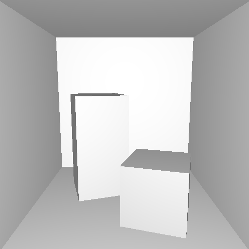
|*rt -l1 eye diffuse*: Simple diffuse lighting from the eye, useful for debugging object form without scene-light complexity.
|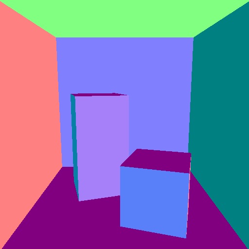
|*rt -l2 normals*: Surface normals encoded as RGB colors, useful for checking orientation and curvature continuity.
|image:images/renderer_gallery_rt_l3.png[rt_l3,512]
|*rt -l3 three-light*: Three-light diffuse debug model. On the Cornell box this currently matches the full-lighting snapshot closely.
|
|*rt -l4 curvature*: Inverse-curvature debug display. The Cornell box is mostly planar, so the committed image is intentionally flat.
|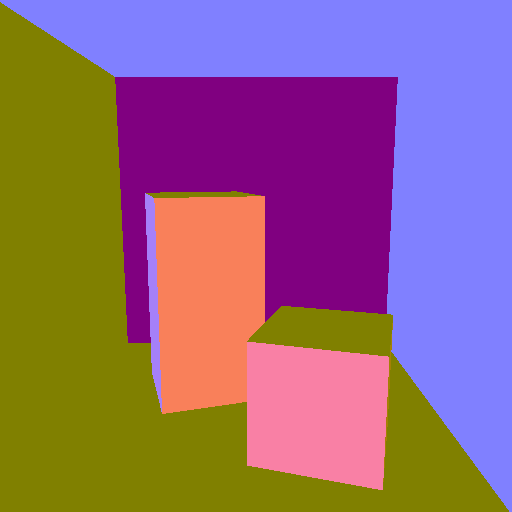
|*rt -l5 principal direction*: Principal curvature direction debug display.
|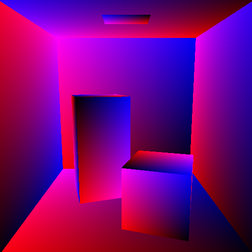
|*rt -l6 UV*: UV coordinate test-map style; U appears in red and V in blue.
|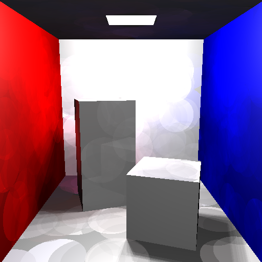
|*rt -l7 photon map*: Photon-mapping global illumination using a small deterministic photon count so regeneration remains quick enough for documentation snapshots.
|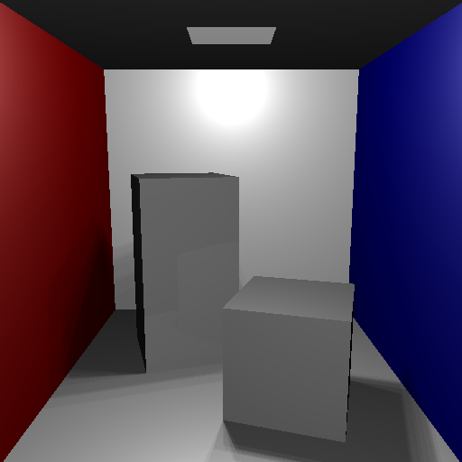
|*rt -l8 heat graph*: Heat-graph diagnostic mode maps the high-resolution current-thread CPU time needed to render each fully shaded pixel to grayscale; brighter pixels took longer to render.
|===

== RT output options

[cols="1,3"]
[%noheader]
|===
|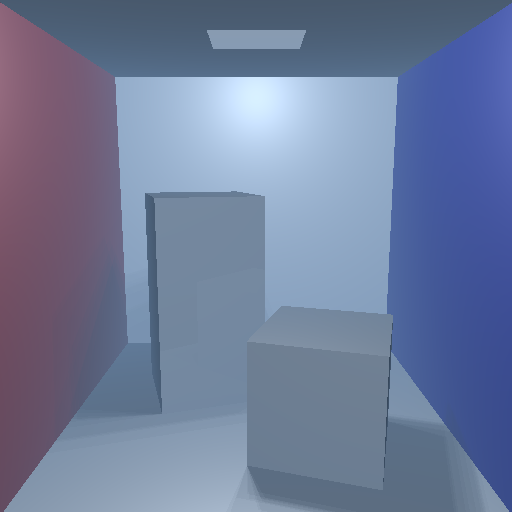
|*rt haze*: Full lighting with atmospheric haze enabled.
|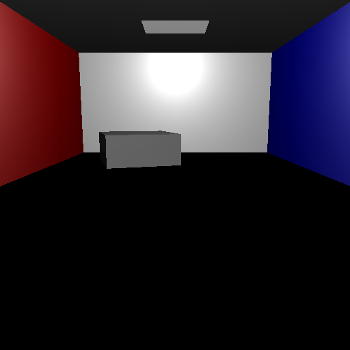
|*rt cut plane*: Full lighting with a view-wide cutting plane applied at render time.
|===

== Edges and line renderers

[cols="1,3"]
[%noheader]
|===
|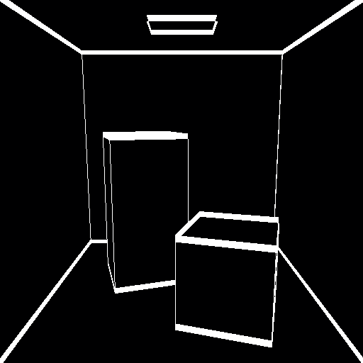
|*rtedge default*: Default edge rendering on a dark background.
|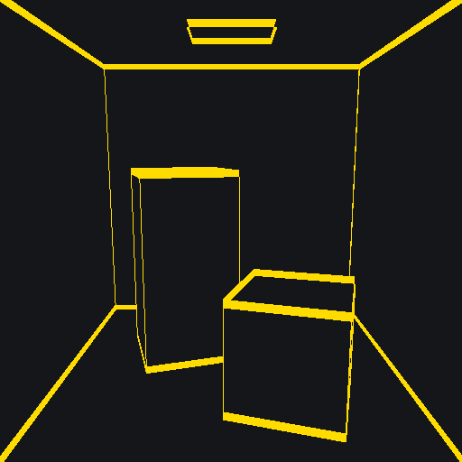
|*rtedge colored*: Custom foreground and background colors.
|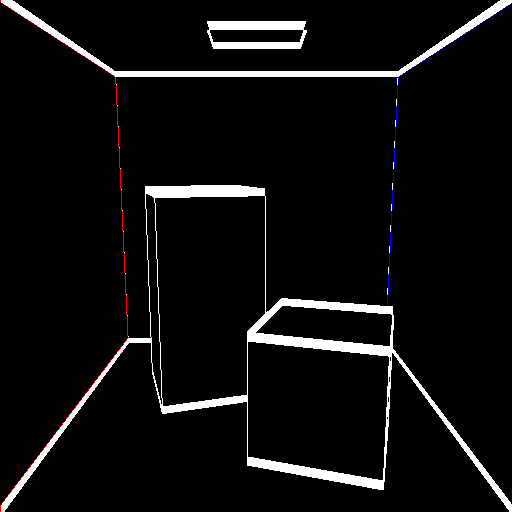
|*rtedge region colors*: Region-aware edge rendering using region colors.
|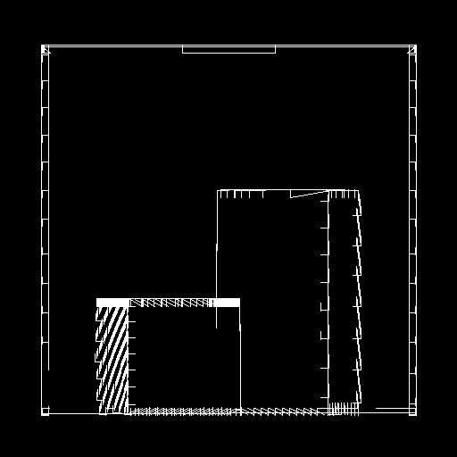
|*rthide hidden line*: Hidden-line plot3 output rasterized with BRL-CAD's plot3-fb and fb-png tools.
|===

== Scalar image renderers

[cols="1,3"]
[%noheader]
|===
|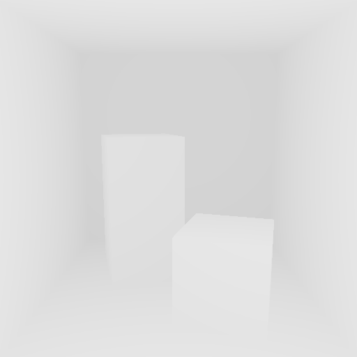
|*rtdepth*: Depth map rendered as grayscale.
|
|*rtxray*: Pseudo X-ray thickness image rendered as grayscale.
|===
