= Vehicle Tire and Wheel Creation in BRL-CAD
Clifford Yapp
:doctype: article
:toc:
:toclevels: 3

[[Overview]]
== Overview

Traditionally, http://brlcad.org[BRL-CAD] tire models have been created using a single cylinder, a torus intersected with a cylinder, or in some cases additional combinations of these primitives. While these approximations are often sufficient for analytical purposes the resulting model is typically a poor visual match to the real tire when raytracing. Creating more complex models to better approximate the tire's shape almost always requires more resources than can be justified.

The *tire* tool offers a method to generate a model that is dimensionally close to a "real" tire using primitives and CSG operations. The primitives used are the elliptical torus (eto), right circular cylinder (rcc), ellipsoid (ell), and truncated general cone (tgc). When tread is added, the sketch and extrude primitives are also used.

By default, a basic steel wheel (a.k.a. "rim") is included in the model. If this wheel does not work for a given modeling purpose, it is quite simple to remove it and substitute in a user-defined wheel so long as the dimensions of the user supplied wheel match the standard wheel at the key points (radius and width).

While the *tire* tool _can_ supply tread, it does not do so by default. Complex tread patterns can SIGNIFICANTLY increase the time for analysis and visualization, so the modeler needs to bear this cost in mind.

The tire generated is always centered at the global origin.

[[Specifying_a_Tire]]
== Specifying a Tire with Standard Dimensional Conventions

The default behavior for the tire procedure with no arguments given is to produce a tire of dimensions 215/55R17 without tread in a file named tire.g.

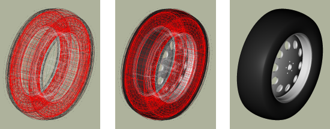

Since this default is unlikely to meet the needs of most specific modeling tasks, almost all uses of *tire* will need the "-d" flag to customize the dimensions:

....
tire -d 255/40R18
....

There are actually a wide variety of standards used in practice to specify tire dimensions. Generally the majority of them have the same "core" information plus additional performance and rim compatibility notations. At this time, BRL-CAD supports the following input format:

[cols="5*"]
[%noheader]
|===
|Width(mm)
|separator
|Ratio (#/100)
|separator
|Inner Diameter(in)
|===

Separators can be any non-numeric character, but normally are either "/", "-", or in the case of the latter separator a letter denoting tire structure. Only single character separators are allowed. footnote:[As yet BRL-CAD does not use the structural information (e.g. R = radial construction) in the tire building procedure when a valid structure character is supplied, but as it may do so in the future the "best practice" is to use the letter if available.] The ratio specifies the sidewall height in terms of the overall tire width - for example, if a tire is 100mm wide and the Ratio is 40, the sidewall height is 40mm. Examples of valid input strings for tire dimensions include:

[cols="2*"]
[%noheader]
|===
|255/40R18
|Width=255mm, Ratio=40, Wheel Diameter=18in
|250-50R17
|Width=250mm, Ratio=50, Wheel Diameter=17in
|180/100/15
|Width=180mm, Ratio=100, Wheel Diameter=15in
|===

All three values must be present to have a valid input string. Also note that at the moment this procedure takes ONLY integer arguments and single non-numeric character separators, so the above formatting restrictions need to be observed. Examples of INVALID inputs include:

[cols="2*"]
[%noheader]
|===
|255.0/40R18
|First number is floating point rather than integer.
|250-50RD17
|Multiple characters in second separator.
|185.65/15
|"." has significance numerically and will not read correctly.
|===

If more precision is needed on any of these inputs, the *tire* tool offers other command-line options to use instead of (or even in combination with) the _d_ flag which accept floating point input. When used _with_ the _d_ flag, they override the value for their particular parameter supplied to the _d_ flag. They are the _W_ flag for maximum width, _R_ for the ratio, and _D_ for the diameter of the wheel. For example, if a width of 255.5mm was needed, the command could be:

....
tire -d 255/40R18 -W 255.5
....

There are limits to the dimensional configurations that can be modeled by *tire* (for example, hub width can not be wider than the maximum tire width), but it should cover most real-world dimensions. Some examples:

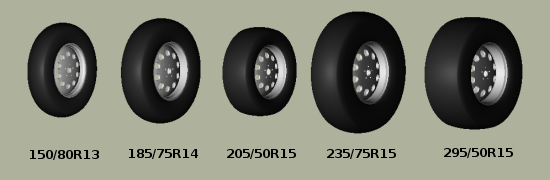

The model that is created by this routine results in a hollow tire with a thickness (by default) related to its radius - the greater the tire radius, the thicker the tire "walls". The structure created is a fairly good geometric tire shape, but does not contain any internal structure _within_ the tire material itself. Modern radial tires in reality are composed of several different layers of varying materials designed to enhance structural strength and performance, but (as of April 2008) the *tire* tool approximates tire surfaces and walls as being a single region.

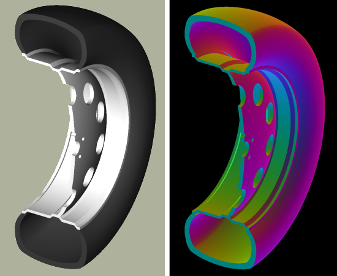

[[Options_for_Tire]]
== Options for Tire Tread Modeling

Tread is the most difficult part of a tire to define in terms of the amount of input data required. At present it is not possible for a user to define tread on the command line - only built-in tread options are available.footnote:[Note that in most cases, BRL-CAD will not have pre-defined knowledge of specific real world tread patterns.]

Tread profile and tread pattern are the two factors to consider when specifying tread. Tread profile is the "shape" of the tread on the edges of the tread pattern. Many truck tires have a "squared off" tread, while automobile tires tend to have more rounded tread. Different patterns can be combined with different profiles.

The _t_ flag controls the tread profile, and the _p_ flag controls the tread pattern. Currently, the following profiles and patterns are available:

[cols="4*"]
[%noheader]
|===
|Profile #
|Profile (t)
|Pattern #
|Pattern (p)
|1
|Curved
|1
|All-Weather
|2
|Squared Off
|2
|Off-Road
|===

Using either the _t_ or _p_ flags to the tire command will trigger tread generation. For each flag, a default on the other flag is assumed - if ONLY the _p_ flag is specified, the t value is assumed to be the same and vice versa. To override the assumption, both flags may be specified. Here is the default output for style one:

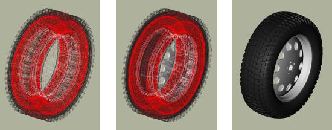

Style two is intended more for trucks and other rugged vehicles:

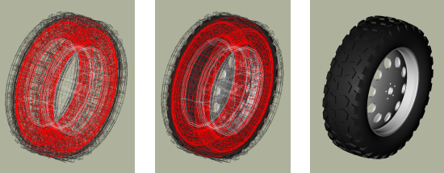

Using _t_ in place of _p_ would also have produced the same model. Internally the *tire* command must use some pattern and profile for every tread it creates, and for ease of use it will select a default if a pattern or profile is specified by itself. Using the flags together can produce different results - for example, profile 2 with pattern 1:

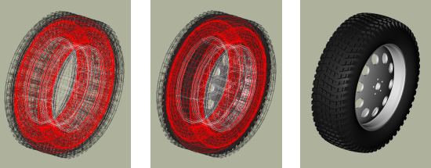

There exist two additional user level flags that can change the behavior of the tread routine. The first is the _g_ flag, which can be used to specify different tread depths in integer numbers of 32nds of an inch. For example, the default number two style previously can be rendered with a deeper tread:

....
tire -p 2 -g 25
....

to produce a different look:

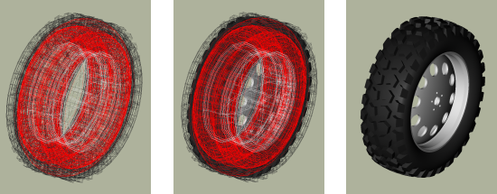

The other flag is the _c_ flag, which allows user control over how many copies of the master tread pattern are used to encircle the tread surface of the tire. This can be used to create courser or finer tread with the same geometric pattern. For example, if the first profile, second pattern and count of 100 are used:

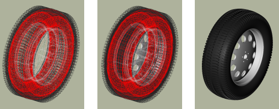

Adjusting the count of patterns can be a way to get a different visual tread style without defining a new tread pattern, although it is unlikely to result in a "real" pattern in the sense of representing an in-use tire tread.

[NOTE]
====
It is important when using the count flag to remember that tread patterns are actual geometry and a high count of patterns can slow down a raytrace considerably. A strategy for models that will see a variety of uses is to include both treaded and slick (non-treaded) tire models in the database under different names, make a tire-model.c combination that is referenced by the vehicle model, and include either the treaded or non-treaded model in the tire-model.c combination based on the analysis.

====

[[Setting_Tire_Thickness]]
== Setting Tire Thickness

Tire thickness is manipulated via the _u_ flag. By default, the tire procedure will adjust the thickness of the tire according to the size of the tire, but there may be cases where it is desirable to change this thickness.

Let's say, for the sake of argument, a model of a large vehicle tire is needed and it is known that a very thick wall is being used. To start, input the dimensional information:

....
tire -d 395/85R20 -p 2 -g 30
....

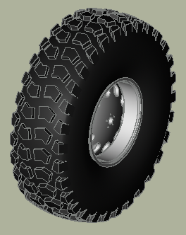

Now, examine the cross section in normal and surface normal views (the tread pattern and depth are added so the cross section WITH tread is shown - it will change with and without tread):

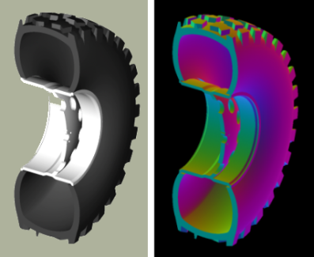

This is a visual check - other tools are available for actual dimensional testing. Let's say the desired thickness is 70mm. The tire is re-generated thus:

....
tire -d 395/85R20 -p 2 -g 30 -u 70
....

Examining the cross sections again, the thickness increase is clearly seen:

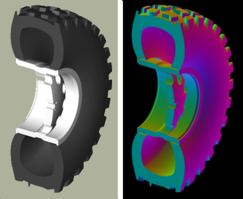

[[Changing_the_Rim_width]]
== Changing the Rim Width

The default behavior of *tire* is to make the rim width (the width of the tire at the point where the outer wall connects with the steel wheel) equal to the width of the tread, which is in turn defined internally as a fraction of the total width. This normally produces reasonable tires, but *tire* does provide the _j_ flag to allow custom values for rim width. The input units are inches.

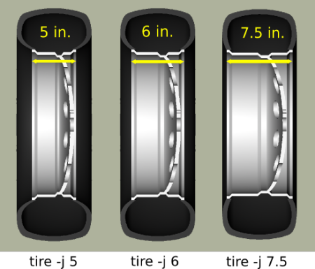

[[Changing_the_Redial]]
== Changing the Radial Location of the Maximum Tire Width

When *tire* accepts a maximum width specification, it internally decides on a default distance from the tire center where that maximum will occur. This parameter can be adjusted by the modeler with the _s_ flag. Some examples using the narrow rim width model settings from the previous section:

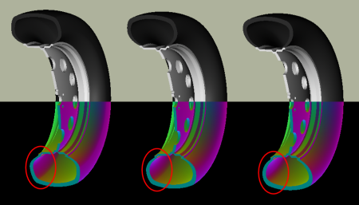

[[Other_Options]]
== Other Options

The other flags available in *tire* relate to naming of the top-level tire object. The _a_ flag automatically appends the dimensional information to the name, making it simple to import multiple tires of different dimensions into a single .g file with the MGED *dbconcat* command. The _n_ option allows the modeler to specify a string other than "tire" for the root name of the top level object. These options can work individually or in concert. So, for example, to generate a top-level name of "car-255-55R17" instead of "tire" for the top level object the following will work:

....
tire -a -n "car"
....

By default, the procedure creates a file called "tire.g" to contain the model. If some other name is desired, a different file name can be supplied as the final argument to the tire procedure. For example,

....
tire mytire.g
....

will create the "mytire.g" file and insert the default tire model.

[[Structure_of_a_Tire]]
== Structure of a Tire Model

Although it is not visible to the eye in normal raytracing, the tire models do include knowledge in the model of the presence of air inside the tire as well as the tire and wheel structures themselves. For illustration purposes, the following image displays the air region inside the tire:

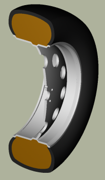

The three material regions are defined immediately below the top-level object:

....

mged> l tire
tire:  --
   u tire-215-55R17.r
   u air-215-55R17.r
   u wheel-215-55R17.r
      
....

The names of these regions will change with the dimensions of the tire requested, but the basic form will remain consistent. The tire-215-55R17.r region holds the tire and tread (if tread was requested), wheel-215-55R17.r holds the rim and internal hub of the wheel, and air-215-55R17.r defines a volume inside the tire and wheel not occupied by the other regions.

....

mged> tree -d 2 tire
tire/
	u tire-215-55R17.r/R
		u tire-solid-215-55R17.c/
		- tire-cut-215-55R17.c/
	u air-215-55R17.r/R
		u wheel-air-215-55R17.c/
		u tire-cut-215-55R17.c/
	u wheel-215-55R17.r/R
		u Inner-Hub-215-55R17.c/
		u Wheel-Rim-215-55R17.c/
      
....

Below this level, the structure describes the details of cuts and combination interactions needed to specify the tire shape.

[NOTE]
====
Due to the nature of the primitives used to define these shapes, operations such as scaling along one axis may produce unexpected results. Generally speaking, it is almost always easier and less error-prone to re-generate a tire model with different parameters than it is to edit the tire structure directly. The wheel region is fairly simple to remove and work with but the tire/tread geometries are _much_ more involved.

====

[[Summary]]
== Summary

* *tire* is a procedural geometry database tool to create sophisticated tire models using standard dimensional specifications.
* The model consists of three regions which define air, tire, and wheel structures.
* The wheel is generated in response to the tire dimensions and there is currently only one wheel type available in this procedure (users may model and substitute their own wheel designs).
* Tread is not modeled by default due to performance considerations but can be added using options.
* Fine grained control of parameters such as tire thickness is available with optional user flags.
