= BRL-CAD Tutorial Series: Volume II - Introduction to MGED
Lee A Butler; Eric W Edwards; Betty J Schueler; Robert G Parker; John R Anderson
:doctype: book
:toc:
:toclevels: 3

[[Preface]]
[preface]
== Preface

Since 1979, the U.S. Army Research Laboratory (formerly the Ballistic Research Laboratory) has been developing the _BRL-CAD_ constructive solid geometry (CSG) modeling package for a wide range of military and industrial applications. The strength of the package lies in its ability to build realistic models of complex objects from a relatively small set of "primitive shapes" by employing the basic Boolean operations of union, subtraction, and intersection and by assigning real-world material attributes.

The package comprises a large collection of tools, utilities, and libraries including an interactive geometry editor, ray-tracing and generic framebuffer libraries, a network-distributed image-processing and signal-processing capability, and an embedded scripting language.

Although _BRL-CAD_ has continued to mature in performance and utility, developers have strived to keep the package approachable and easy to use, as evidenced by the package's dual command formats, its newly renovated graphical user interface (GUI), and its customization potential through user scripting.

In addition, a multivolume tutorial series is being developed to assist users in a variety of _BRL-CAD_ areas and applications. The "Introduction to _MGED_," which is the second volume in the series, is intended to provide new users with a basic understanding of the _Multi-Device Geometry Editor_ (_MGED_), which is the heart of the _BRL-CAD_ package. Other volumes focus on installation procedures, advanced features, and programming.

[[Acknowledgments]]
[preface]
== Acknowledgments

The authors would like to thank Paul Tanenbaum, TraNese Christy, Sean Morrison, and the other members of the Advanced Computer Systems Team who reviewed this document in a timely manner and made many helpful suggestions to improve its accuracy and presentation.

In addition, the authors would like to acknowledge team member Mike Muuss, who passed away while this volume was in preparation. Mike was the original architect of the _BRL-CAD_ package and guided its development for 20 years until his death on 20 November 2000. He embodied a unique blend of unparalleled intellect, unquenchable curiosity, and unending energy to advance the capabilities of everything and everyone he touched. A natural-born troubleshooter, Mike approached every job, big or small, with a passion for excellence and a child-like enthusiasm, which helped drive _BRL-CAD_ far beyond expectations.

Although he never got a chance to review this document, much of this work is a result of his vision and attention to detail. Therefore, the _BRL-CAD_ Tutorial Series is dedicated to his memory. His sharp mind, his warm spirit, and his loyal friendship will be greatly missed.

[[Lesson-1]]
== Creating Primitive Shapes

In this lesson, you will:

* Launch the _MGED_ program.
* Enter commands at the _MGED_ prompt in the Command Window.
* Use the _MGED_ Graphical User Interface (GUI).
* Open or create a new database when launching _MGED_.
* Use the GUI to open or create a new database.
* Title a database.
* Select a unit of length for your design.
* Select a primitive shape.
* Create a primitive shape using the make command.
* Use the Z command to clear the Graphics Window.
* Draw a previously created shape using the draw command.
* Use the erase command to delete an item in the Graphics Window display.
* Create a sphere using the GUI menu.
* Use the l command to list a shape's attributes or parameters.
* Use the ls command to list the contents of the database.
* Eliminate a shape or object from the database using the kill command.
* Edit a command.
* Use the q or exit commands to quit the program.

[[launching_mged]]
=== Launching the MGED Program

To launch the _MGED_ program, type mged at the Terminal (tty) prompt and then press the ENTER key. This brings up two main windows: the _MGED_ Command Window and the _MGED_ Graphics Window (sometimes called the Geometry Window). Both windows will initially be blank, awaiting input from you. To leave the program at any time, at the Command Line type either the letter q or the word quit and then press the ENTER key.

[[entering_commands]]
=== Entering Commands in the Command Window

You can type in commands at the mged>prompt. Many experienced UNIX users prefer this method because it allows them to quickly create a model (which we sometimes refer to as a "design") without having to point and click on a lot of options. The complete listing of editing commands and what they do can be found in Appendix A.

[CAUTION]
====
Check all typed entries before you press the ENTER key. If you find you made a mistake, simply press the BACKSPACE key until you have erased over the mistake and then re-type the information. Later you will get more experience editing text using _vi_ and _emacs_ command emulation.

====

[[using_gui]]
=== Using the GUI

Users who are more familiar with Microsoft Windows may prefer to use the GUI pull-down menus at the top of the Command or Graphics Window (they are the same in either window). The menus are divided into logical groupings to help you navigate through the _MGED_ program.

Before you can create a model, you need to open a new database either through the Terminal Window when starting _MGED_ or through the GUI after starting _MGED_.

[[open_new_database]]
=== Opening or Creating a New Database when Launching MGED

When launching _MGED_, you can open or create a database at the same time. At the shell prompt (usually a $ or %), in the Terminal Window, type mged followed by a new or existing database name with a .g extension. For example: *mged sphere.g[ENTER]*

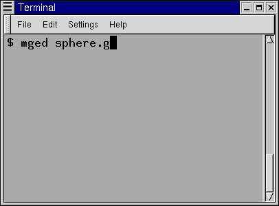

If you are creating a new database, a small dialog box asking if you want to create a new database named sphere.g will appear. Click on Yes, and a new database will be created. If sphere.g already exists, _MGED_ will open the sphere.g database as the program is launched.

[[create_new_database]]
=== Using the GUI to Open or Create a Database

Alternatively, once you have launched _MGED_, you can open an existing database or create a new database using the GUI menus (at the top of the Command or Graphics Window) by clicking on File and then either Open or New. Both options bring up a small dialog box. The Open dialog box will ask you to type in the name of an existing database. The New dialog box will ask you to type in the name of a new database. Click on OK to accept the database.

For this lesson, create a new database called sphere.g. To do this, type sphere.g at the end of the path name, as shown in the following illustration. Click on OK to accept the database name.

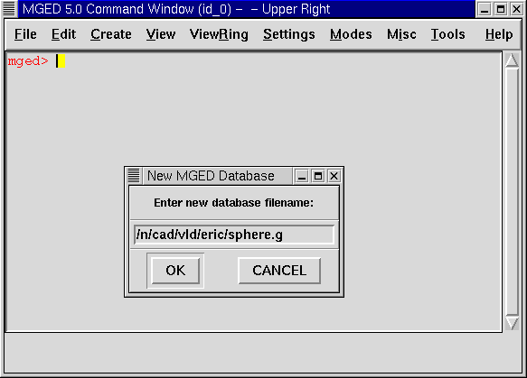

image::../lessons/images/mged01_graphicswindow.png[]

One advantage to using the GUI, if you aren't familiar with UNIX file management, is that this will show you your current path name, so you will know exactly where your database is going to be located. This can be especially helpful if you have a lot of directories or files to manage.

[[assign_title]]
=== Assigning a Title to Your Database

You can title your new database to provide an audit trail for you or others who might use your database. After the prompt, in the Command Window, type title followed by a space and a name that reflects the database you are going to make. When you are done, press the ENTER key. For example: mged>title MySphere[ENTER] Note that in _BRL-CAD_ versions prior to release 6.0, the title is limited to 72 characters.

[[set_units]]
=== Selecting a Unit of Length

_MGED_ uses millimeters for all internal mathematical processes; however, you can create your design using some other unit, such as feet. For this lesson, inches is used. To select inches, move your mouse pointer to the File menu at the top of the Command Window. Click on File and then Preferences. A new menu will appear. Select Units and then Inches. If you are not a "point-and-click" type of person and prefer a Command Line, then just type units in after the _MGED_ prompt in the Command Window, followed by the ENTER key. The Command Line looks like: mged>units in[ENTER]

[[select_primitive]]
=== Selecting a Primitive Shape

_MGED_ provides a variety of primitive shapes (sometimes referred to as simply shapes or primitives) that you can use to build models. Each type of shape has parameters that define its position, orientation, and size. A listing of these shapes and their respective parameters is given in Appendix C.

[NOTE]
====
Historically, the word solid was used for what we now refer to as a primitive shape. This older terminology was sometimes difficult for new users to understand. If you see the word solid used in any _BRL-CAD_ programs, documentation, or commands (e.g., in Appendix A), think primitive shape.

====

[[create_sphere_cmd_line]]
=== Creating a Sphere from the Command Line

For this lesson, you are going to create a single sphere. There are two ways you can create a primitive shape. You can create all shapes through the Command Window and most shapes through the GUI.

You can easily create a sphere from the prompt in the Command Window by typing just a few commands. At the _MGED_ prompt, type: *make sph1.s sph[ENTER] [Note: Use the digit 1, not the letter l]*

This command tells the _MGED_ program to:

[cols="3*"]
[%noheader]
|===
|make
|sph1.s
|sph
|Make a primitive shape
|Name it sph1.s
|Make the shape a sphere
|===

A default sphere will be created, and a wireframe representation of the primitive shape will appear in the Graphics Window. In Lesson 4, you will give your sphere a solid, three-dimensional look.

This command will draw the primitive shape in the Graphics Window.

[[clear_window]]
=== Clearing the Graphics Window

To build another object or work on another primitive shape, you can easily clear the Graphics Window through the Command Window. At the Command Line prompt, type an uppercase Z (for zap) followed by ENTER.

[NOTE]
====
Before using the zap option, make sure you "activate" (i.e., set the focus on) the Command Window. If you type a z and your cursor is still in the Graphics Window, you will send your design spinning. Typing a zero (0) will stop the spin.

====

[[draw_object]]
=== Drawing a Previously Created Object

To recall the sphere, type the command on the Command Line as follows: *draw sph1.s[ENTER]* This command tells the _MGED_ program to:

[cols="2*"]
[%noheader]
|===
|draw
|sph1.s
|Draw a previously created primitive shape
|named sph1.s
|===

[[erase_from_window]]
=== Erasing an Item from the Graphics Window

You may occasionally want to erase a particular item from the display in the Graphics Window. You can use the erase command to remove the item without any file operation being performed; the item remains in the database. To delete the sph1.s object from the display, at the Command Window prompt, type: *erase sph1.s[ENTER]*

[[create_sphere_gui]]
=== Creating a Sphere Using the GUI

Another way to create a sphere is to use the GUI menu system duplicated at the top of the Command and Graphics windows. Clear your Graphics Window by using the previously described Z command. Then, in the Graphics Window, select Create, and a drop-down menu will appear with the various primitive shape types available. Select sph (for sphere) under the Ellipsoids category. This will bring up a dialog box. Click in the empty text box and type sph2.s. Click on Apply or press ENTER. A new sphere will be created and drawn in the Graphics Window. When you create a shape through the GUI, the shape will automatically be in edit mode so that you can change it as needed, and the shape's parameters-which define its position, orientation, and size-will be in view.

[[view_params]]
=== Viewing a Shape's Parameters

Sometimes when you are making a model, you might want to view a shape's parameters, such as height, width, or radius, in the Command Window. You can easily list the attributes of a shape by typing the l (for "list") command at the Command Window prompt as follows: *l shape_name[ENTER]* footnote:[Note: The command is the lowercase letter l, NOT the number one.]

[NOTE]
====
Note: If you attempt to type in the Command Window and you see no words appearing there, chances are the focus has not been set on that window (i.e., keyboard input is still directed to another window). Depending on your system's configurations, the focus is set to a window either by moving the cursor into the window or clicking on the window.

====

An example of the dialog that might occur in the Command Window for the parameters or attributes of the first sphere you created is as follows:

....

mged> l sph1.s

sph1.s: ellipsoid (ELL)

     V (1, 1, 1)

     A (1, 0, 0) mag=1

     B (0, 1, 0) mag=1

     C (0, 0, 1) mag=1

     A direction cosines=(0, 90, 90)

     A rotation angle=0, fallback angle=0

     B direction cosines=(90, 0, 90)

     B rotation angle=90 fallback angle=0

     C direction cosines=(90, 90, 0)

     C rotation angle=0, fallback angle=90

	
....

Don't be concerned if you notice in the preceding output that _MGED_ stores your sphere as an ellipsoid. In actuality, the sphere is just a special case of the ellipsoid (see Appendix C). Also, note that it is not important if the numbers in your output do not match what is shown in this example.

Use the l command to list both sph1.s and sph2.s before continuing with this lesson.

[[list_db_contents]]
=== Listing the Contents of a Database

In addition to viewing a shape's contents, you might also want to list the contents of the database to see what items have been created. To view the database contents, type at the Command Window prompt: *ls[ENTER]*

[[kill_object]]
=== Killing a Shape or Object

Sometimes when creating a model, you may need to eliminate a shape or object from the database. The kill command is used to do this. For example, if you wanted to kill the sph1.s shape, you would type at the Command Window prompt: *kill sph1.s[ENTER]* Make another sphere through either the Command Window or the GUI and name it sph3.s. Once the sphere is made, use the kill command to eliminate it from the database by typing at the Command Window prompt: *kill sph3.s[ENTER]* You can tell the shape has been eliminated by using the ls command in the Command Window to list the contents of the database. At the Command Window prompt, type: *ls[ENTER]* You should see two shapes listed: sph1.s and sph2.s.

[NOTE]
====
Note: All changes are immediately applied to the database, so there is no "save" or "save as" command. Likewise, there is presently no "undo" command to bring back what you have deleted, so be sure you really want to permanently delete data before using the kill command.

====

[[editing_commands]]
=== Editing Commands in the Command Window

Occasionally, when you enter commands in the Command Window, you will make a mistake in typing. _MGED_ can emulate either the _emacs_ or _vi_ syntax for Command Line editing. By default, the _emacs_ syntax is used. See Appendix B for a list of keystrokes, effects, and ways to select between the two command sets.

You can also use the arrow keys to edit commands. The left and right arrow keys move the cursor in the current Command Line. Typing ENTER at any location on the Command Line executes the command. Note that both the BACKSPACE and DELETE keys will delete one character to the left of the cursor.

_MGED_ keeps a history of commands that have been entered. The up and down arrow keys allow you to select a previously executed command for editing and re-execution.

[[quitting]]
=== Quitting MGED

Remember, to leave the program at any time, type from the Command Line either the letter q or the word quit and then press the ENTER key. You may also quit the program by selecting Exit from the File menu.

[[creating_primitive_shapes_review]]
=== Review

In this lesson, you:

* Started the _MGED_ program.
* Entered commands in the Command Window.
* Used the _MGED_ GUI.
* Created or opened a database using _MGED_ naming conventions.
* Used the GUI to create or open a database.
* Titled a database.
* Selected a unit of measure for a design.
* Selected a primitive shape.
* Created a primitive shape using the make command in the Command Window.
* Cleared the screen of a design using the Z command.
* Drew a previously created shape using the draw command.
* Used the erase command to delete a shape from the Graphics Window display.
* Used the GUI to create a primitive shape.
* Used the l command to view a shape's parameters.
* Used the ls command to list the contents of the database.
* Used the kill command to eliminate a shape from the database.
* Edited commands in the Command Window.
* Used the q or Exit commands to quit the program.

[[Lesson-2]]
== Learning the Viewing Options

In this lesson, you will:

* Create a model radio.
* Locate viewing information in the Command Window.
* Identify elements of the _MGED_ viewing system.
* View your radio from different angles.
* Work with Shift Grips.

Models in _BRL-CAD_ are constructed in a single xyz coordinate system, which we sometimes refer to as model space. The Graphics Window of _MGED_ displays a portion of this space. The xyz coordinate system is used for specifying both the geometry and the view of the geometry that is presented in the Graphics Window.

_MGED_ offers a default view and a variety of optional views. You can switch back and forth between these views during and after model creation. This lesson is designed to help you understand the viewing process and options.

[[creating_radio]]
=== Creating a Radio

To gain practice viewing actual geometry, let's build a simple geometric object-a "walkie-talkie" radio. Note that the commands we use to do this are not discussed here because our current concern is on applying the principles of viewing. Later lessons on creating geometry address these commands in detail. Begin by launching _MGED_ and creating a new database named radio.g. Remember that one way to do this is to type the following command in a Terminal Window: *$ mged radio.g*

Type the following in the Command Window, carefully checking each line before pressing ENTER. If you make a mistake, use BACKSPACE or the left/ right arrow keys to make corrections before pressing ENTER (see Appendix B for the editing command list).

[NOTE]
====
Be especially careful to note the difference between the numeral one [1] and the letter l [l] in ell1 on the third line.

====

....

       in body.s rpp 0 16 0 32 0 48[ENTER]

       in btn.s rec 8 30 36 0 3 0 4 0 0 0 0 2[ENTER]

       in btn2.s ell1 8 33 36 4 0 0 2[ENTER]

       in spkr.s tor 16 16 16 1 0 0 12 1[ENTER]

       in ant.s rcc 2 2 46 0 0 48 1[ENTER]

       in knob.s rcc 4 4 40 8 0 0 5[ENTER]
      
....

[NOTE]
====
Note that in the preceding Command Line expressions, btn is an abbreviation for button, ant is an abbreviation for antenna, and spkr is an abbreviation for speaker. Also note that the numbers could have been separated by single spaces. The extra spaces were inserted simply to improve readability. For some usages (e.g., the r and comb commands, which are discussed later), the number of spaces has to be exact.

====

An image similar to the following should now appear in the Graphics Window.

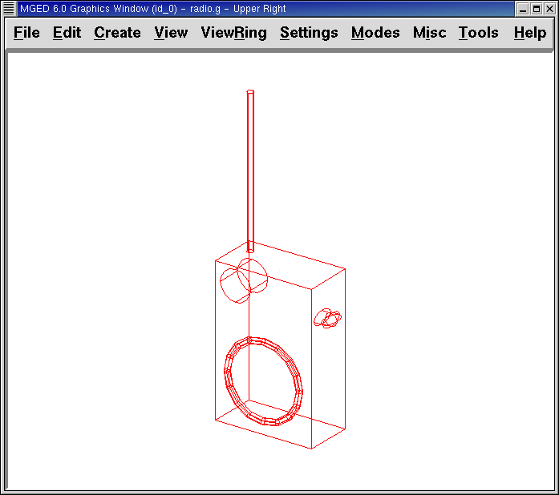

[[locating_viewing_info_cmd_window]]
=== Locating Viewing Information in the Command Window

Now take a minute to look at the Command Window. Even if nothing is in the window, enclosed in the bottom border is a string of information about the Graphics Window. An example string might read: `cent=(8.000 16.000 24.000) sz=96.000 mm az=35.00 el=25.00 tw=-0.00 ang=(0.00 0.00 0.00)`

As detailed in the following table, this information contains four groups of viewing data about the Graphics Window.

.Viewing Data at the Bottom of the Command Window
[cols="5*"]
|===
|Screen Designation
|Viewing Information
|Location of Variables
|Default Units
|Default Values

|cent=
|Center of View
|First 3 numbers
|Millimeters
|0.000 0.000 0.000
|sz=
|Size of View
|4th number
|Millimeters
|Dependent upon size selected
|az=
.2+|Viewing Angle
.2+|5th and 6th numbers
.2+|Degrees
|35.00
|el=
|25.00
|tw=
|Twist
.2+|7th-10th numbers
.2+|Degrees
|0.00
|ang=
|Angle of View
|0.00 0.00 0.00
|===

[[viewing_system_elements]]
=== Identifying Elements of the MGED Viewing System

[[Center_of_view]]
==== Center of View

The first set of information tells you the center of what you are viewing. You can change the center of where you are looking through both the GUI and the Command Window.

To change the center of your view of the radio using the GUI, press the SHIFT key and any mouse button while dragging the mouse. (This is an example of a Shift Grip, which is described later in this chapter.) You can also change the center of view by placing the mouse pointer where you want the center to be and clicking the middle mouse button.

To change the center of view using the Command Window, simply type at the prompt the word center followed by three values for x, y, and z (which is the 3-D coordinate system mentioned previously). For example: *center 0 15 325.735[Enter]* As you change your view of the geometry, notice that the numbers in the brackets after the cent= title will change to reflect the new center of the view.

[[Size_of_view]]
==== Size of View

The size of the view is the amount of model space that is shown in the Graphics Window. For example, consider using a camera with a zoom lens to photograph a rose. As shown in the following figures, if you zoom in on the rose, it will appear large in relation to your viewing field. If you zoom out, it will appear smaller. In actuality, the view size for the rose image on the left might represent only 15 mm across while the view size for the image on the right might represent 100 mm across. In both cases, however, the actual size of the rose is the same.

[cols="2*"]
[%noheader]
|===
|
|
|Zoom In to View Details (small size of view)
|Zoom Out to View Object in Relation to Environment (large size of view)
|===

To change the view size of your radio through the GUI, click the right mouse button to zoom in and the left mouse button to zoom out. Each time you click the left or right mouse button, the view of the design will increase or decrease in size by a factor of 2 (i.e., two times larger or two times smaller than the previous size).

You can also zoom in or out on your design by going to the View menu and selecting Zoom In or Zoom Out. A drawback to this method is that you can only zoom in or out one time because the drop-down menu closes once you make a selection.

If you get lost at any point while creating a model, you can use the zap (Z) command to clear the geometry from the Graphics Window and then recall the shape with the draw command. When drawing in an empty Graphics Window, _MGED_ automatically sizes the view to fit what you draw into the window.

You can control the view size of your radio more accurately with the Command Window. To set the size to 100 (of whichever units you have selected), type at the prompt: *size 100[Enter]*

You can also zoom in or out on a design by typing zoom on the Command Line. To make your radio appear 50% smaller, you would type: *zoom 0.5[Enter]*

To make your radio appear twice as large, you would type: *zoom 2[Enter]*

[NOTE]
====
Remember that changing the view size does NOT affect the size of the object. You will change the size of an object in Lesson 6.

====

[[Angle_of_view]]
==== Angle of View

Azimuth, elevation, and twist (all measured in degrees) determine where you are in relation to the object you are viewing. Azimuth determines where you are around the sides of it (i.e., to the front, left, right, behind, or somewhere in between), elevation determines where you are above or below it, and twist determines the angle you are rotated about the viewing direction.

To better understand azimuth, imagine walking around a truck with a camera to photograph it. As shown in the following illustrations, you would be at 0'0 azimuth if you stood directly in front of the truck to take its picture. If you circled around slightly to your right, you would be at 35'0 azimuth. If you moved further around until you were looking directly at the driver's side (in U.S. trucks), you would be at 90'0 azimuth. Standing behind it would put you at 180'0 azimuth. If you were facing the passenger's side, you would be at 270'0 azimuth.

[NOTE]
====
The terms azimuth, elevation, and twist are similar to the terms yaw, pitch, and roll, respectively, which are common terms in the aerospace industry.

====

[cols="2*"]
[%noheader]
|===
|image:../lessons/images/mged02_truck_front.png[]
|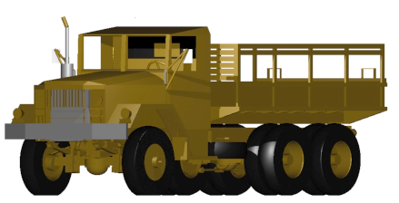
|Front (az=0, el=0)
|az=35, el=0
|===

[cols="2*"]
[%noheader]
|===
|image:../lessons/images/mged02_truck_left.png[]
|image:../lessons/images/mged02_truck_rear.png[]
|Left (az=90, el=0)
|Rear (az=180, el=0)
|===

[cols="1*"]
[%noheader]
|===
|image:../lessons/images/mged02_truck_right.png[]
|Right (az=270, el=0)
|===

Elevation, on the other hand, involves the viewer's position above or below an object. In the preceding example, you circled around a truck without changing your relative height. You had an elevation of 0'0, which means you were level with it. As the following figures illustrate, however, imagine stopping at the 35'0 azimuth position and then climbing a ladder to photograph the truck from 25'0 elevation. Climbing higher, you would be at 60'0 elevation. If you were directly above it with the camera facing down, you would be at 90'0 elevation. If you crawled under the truck and looked directly up at it, you would be at -90'0 elevation.

[cols="2*"]
[%noheader]
|===
|
|image:../lessons/images/mged02_truck_35_25.png[]
|az=35, el=0
|az=35, el=25
|image:../lessons/images/mged02_truck_35_60.png[]
|image:../lessons/images/mged02_truck_35_90.png[]
|az=35, el=60
|az=35, el=90
|image:../lessons/images/mged02_truck_270_90.png[]
|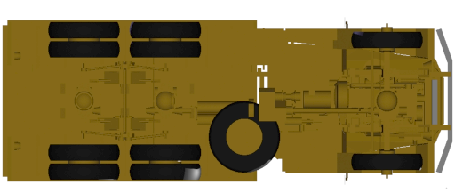
|Top (az=270, el=90)
|Bottom (az=270, el=-90)
|===

Finally, twist (which is an optional setting in _MGED_) specifies a rotation about the viewing direction. This rotation is applied to the view after azimuth and elevation have been designated. So, returning to our truck example, imagine standing in front of the vehicle (az=0, el=0) and then tilting your camera counterclockwise 14'0. This would give your view a 14'0 twist angle, as shown in the following figure (on the left). Note again that it is not the truck that is tipped up, but simply your view of it. For more information on specifying twist, see the *ae* command in Appendix A.

[cols="1*"]
[%noheader]
|===
|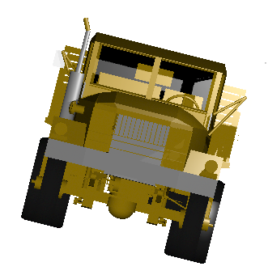
|Front (az=0, el=0, tw=14)
|===

[[coord_sys_summary]]
=== Summing up on Azimuth and Elevation and the xyz Coordinate System

As mentioned at the start of this lesson, _MGED_ operates in a three-dimensional coordinate system (determined by the x, y, and z axes). Azimuth is measured in the xy plane with the positive x direction corresponding to an azimuth of 0'0. Positive azimuth angles are measured from the positive x axis toward and past the positive y axis. Negative azimuth angles are measured in the other direction.

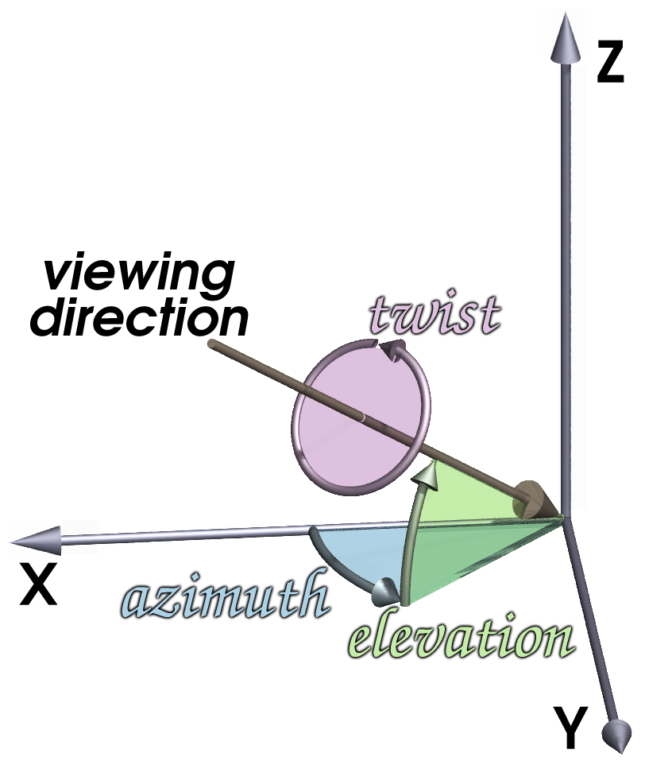

If the azimuth angle is 0, then elevation is measured in the xz plane with +90'0 corresponding to the positive z direction and -90'0 corresponding to the negative z direction. However, if azimuth is not 0, these angles are in a plane aligned with the azimuth direction.

[[view_radio_angles]]
=== Viewing Your Radio from Different Angles

Let's now experiment with different views of your radio. _MGED_ has several standard default views, which you've already seen in the preceding truck example. They include Top (az270, el90); Bottom (az270, el-90); Right (az270, el0); Left (az90, el0); Front (az0, el0); Rear (az180, el0); az35, el25; and az45, el45.

Go to the View menu and try viewing your radio from different angles.

[cols="2*"]
[%noheader]
|===
|image:../lessons/images/mged02_radio_top.png[]
|
|Top
|az35,el25
|image:../lessons/images/mged02_radio_right.png[]
|image:../lessons/images/mged02_radio_front.png[]
|Right
|Front
|===

You can also select any azimuth-elevation combination from the Command Line. For example, at the prompt type *ae 128 17[Enter]* As with many of the Command Line options, this method of selecting views provides a finer degree of control/precision when you need it.

_MGED_ can also display multiple views simultaneously. Go to the Modes menu and select Multipane. Four small panes with different views should appear in your Graphics Window, as shown in the following illustration.

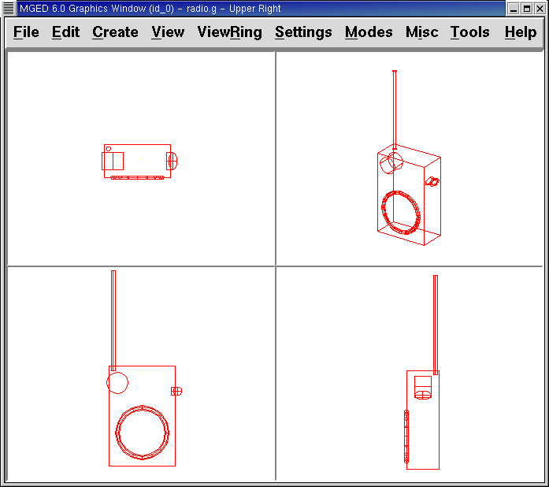

[[shift_grips]]
=== Working with Shift Grips

The Shift Grip options of _MGED_ are handy hot-key and mouse button combinations that can be used in two different ways. With regard to our present discussion on viewing, the Shift Grips can, in effect, "drag" the world around in front of the viewer (but without actually changing the coordinates of the viewed objects). The same Shift Grips can also be used in Edit mode to actually move or alter the geometry of your objects. In both cases, the Shift Grips appear to do the same thing, so it is important always to know the mode in which you are operating.

In general, the SHIFT key translates (moves), the CTRL key rotates, and the ALT key constrains (or limits) translation or rotation to a particular axis (x, y, or z). These axes correspond to the three mouse buttons as follows: the left button represents the x axis, the middle button represents the y axis, and the right button represents the z axis. In addition, the SHIFT and CTRL keys can be used in conjunction with any mouse button to scale an object (although the ALT key will not constrain this action). The following table lists all of the key bindings and their functions.

.Shift Grip Keys and Effects
[cols="5*"]
|===
|Function
|Key Combination
|Effect in Normal Viewing
|Effect in Edit Mode

|Translate (Move)
|SHIFT + any mouse button + mouse drag
|Moves view in any direction
|Translates object in any direction
|Rotate
|CTRL + any mouse button + mouse drag
|Rotates view in any direction
|Rotates object in any direction
.3+|Constrain Translation
|SHIFT + ALT + left mouse button + mouse drag
|Moves view in the x direction
|Translates object in the x direction
|SHIFT + ALT + middle mouse button + mouse drag
|Moves view in the y direction
|Translates object in the y direction
|SHIFT + ALT + right mouse button + mouse drag
|Moves view in the z direction
|Translates object in the z direction
.3+|Constrain Rotation
|CTRL + ALT + left mouse button + mouse drag
|Rotates view about the x axis
|Rotates object about the x axis
|CTRL + ALT + middle mouse button + mouse drag
|Rotates view about the y axis
|Rotates object only about the y axis
|CTRL + ALT + right mouse button + mouse drag
|Rotates view about the z axis
|Rotates object about the z axis
|Scale
|SHIFT + CTRL + any mouse button + mouse drag
|Scales view larger or smaller
|Scales object larger or smaller
|===

[CAUTION]
====
Depending on your window manager or desktop environment settings, some key combinations may already be designated to perform other tasks (e.g., resizing or moving a window). If so, you may need to adjust settings to allow the Shift Grip options to function. Furthermore, left-handed users may have switched the behavior of the left and right mouse buttons in their system configurations. In such instances, the terms left mouse button and right mouse button should be switched throughout this document.

====

Probably the easiest way to familiarize yourself with the Shift Grip options is to try them out on your radio. Using the preceding table as a guide, experiment with translating, rotating, constraining translation and rotation to particular axes, and sizing your radio view.

[NOTE]
====
Remember, although the Shift Grip options may appear to be manipulating objects, unless you are in Edit mode they are only manipulating your view of the objects.

====

[[learning_viewing_options_review]]
=== Review

In this lesson, you:

* Created a model radio.
* Located viewing information in the Command Window.
* Identified elements of the _MGED_ viewing system.
* Viewed your radio from different angles.
* Worked with Shift Grips.

[[Lesson-3]]
== Using the Insert Command to Size and Place Shapes

In this lesson, you will:

* Create a sphere and a right circular cylinder using the make command.
* Create the same two shapes using the in (insert) command.
* Combine arguments on the Command Line to streamline the entry of variables.
* Develop a combined-command form to help manage Command Line variables.
* Consider conventions for choosing names for your objects.
* View your shapes from different perspectives using options of the View menu.
* Quit the _MGED_ program.

This lesson focuses on creating shapes from the Command Window using the make and in commands. You will create a sphere (sph) and a right circular cylinder (rcc) using both commands so that you can see how each command works. Later in the lesson, you will practice viewing your model from different angles.

[[new_db_myShapes]]
=== Creating a New Database from the Command Window

Create a new database and name it shapes.g. Title your database myShapes.

[[sphere_make]]
=== Creating a Sphere Using the Make Command

Begin by making the Command Window active (usually by clicking anywhere in the window). Then, at the _MGED_ prompt, type in the command: *make sph1.s sph [Enter]*

As noted in Lesson 1, this command tells _MGED_ to:

[cols="3*"]
[%noheader]
|===
|make
|sph1.s
|sph
|Create a shape
|Name it sph1.s
|Make it a sphere
|===

image::../lessons/images/mged03_wireframe_sph.png[]

A sphere shape has now been created, and a wireframe drawing should appear in your Graphics Window.

To make the rcc from the Command Window prompt, type: *make rcc1.s rcc[Enter]*

Your Graphics Window should now display a large rcc that, from the default view of az35, el25, looks as if it intersects the sphere you previously created.

image::../lessons/images/mged03_wireframe_sph_rcc.png[]

Using the make command is a fast and easy way to create a shape; however, most models are going to require shapes that have specific parameters, such as height and radius. So, a more precise way to create these shapes is to use the in (insert) command.

[[using_in]]
=== Using the In Command to Create Shapes

Begin by making the Command Window active (usually done by clicking anywhere in the window). Then, use the Z (zap) command to clear the Graphics Window. You are now ready to create a sphere using the in command. At the _MGED_ prompt type: *in sph2.s sph[Enter]*

_MGED_ will respond with: `Enter X, Y, Z of vertex:`

You must tell _MGED_ where to position the vertex (center) of your sphere in space. Type at the _MGED_ prompt: *4 4 4[Enter]*

[NOTE]
====
As you work in _MGED_, you will often be asked to enter a value for a vector or a vertex. In _MGED_, a vector represents the distance and direction from one point in space to another, and a vertex is one single point in space. The values entered for a vector are typically used to create an object with specific dimensions. The values entered for a vertex place the object in space.

====

Your sphere will now be placed at (x,y,z)=(4,4,4), as measured in millimeters. Notice that the numbers are separated by spaces followed by the ENTER key. _MGED_ will now ask you to:

....

      Enter radius:

      Type in:

      3[Enter]
      
....

The radius of your sphere will be 3 mm. The following is the dialog that should appear in your Command Window (including the appropriate responses). mged>in sph2.s sph `Enter X, Y, Z of vertex: 4 4 4` `Enter radius: 3` `51 vectors in 0.000543 sec` The last line of this dialog is simply a record of the computer's speed in drawing the shape. It has no real usefulness to the user at this point.

A sphere has now been created, and a wireframe drawing similar to the one created using the make command should appear in your Graphics Window.

To make the right circular cylinder, type at the Command Window prompt: *in rcc2.s rcc[Enter]* _MGED_ will ask you to enter values for x, y, and z of the vertex (where you want the center of one end of the rcc placed in space). Type: *4 4 0[Enter]* Be sure to leave spaces between each of these numbers.

_MGED_ will now ask you to enter the x, y, and z values of the height (H) vector (i.e., how long you want the rcc to be). Type: *0 0 4[Enter]* The last value you will need to enter is the radius of the rcc. Type: *3[Enter]* The dialog in the Command Window for the creation of the rcc should look like this:

....

      mged> in rcc2.s rcc

      Enter X, Y, Z of vertex: 4 4 0

      Enter X, Y, Z of height (H) vector: 0 0 4

      Enter radius: 3

      42 vectors in 0.000214 sec
      
....

You should now have new versions of the sphere and rcc shapes. Notice how these two shapes compare in size to the first two you created. The rcc is now in proportion to the sphere and is placed in space off to the left in your Graphics Window. By specifying the dimensions of the shapes and their locations in space, you were able to create the model more precisely.

[cols="2*"]
[%noheader]
|===
|image:../lessons/images/mged03_shapes_make_command.png[]
|image:../lessons/images/mged03_shapes_in_command.png[]
|Shapes Created with Make Command
|Shapes Created with In Command
|===

[[args_on_one_line]]
=== Combining Arguments on One Line

Another way to use the in command is to combine all of the required information on one line. Once you become familiar with using the in command, you will probably prefer to use this method as it allows you to input all the parameter values more quickly.

Clear the Graphics Window by using the Z command. Now make another sphere by typing after the _MGED_ prompt: *in sph3.s sph 4 4 4 3[Enter]*

The meaning of this longer form of the command is:

[cols="7*"]
[%noheader]
|===
|in
|sph3.s
|sph
|4
|4
|4
|3
|Insert a primitive shape
|Name it sph3.s
|Make the primitive shape a sphere
|Make the x of the vertex a value of 4
|Make the y of the vertex a value of 4
|Make the z of the vertex a value of 4
|Make the radius a value of 3
|===

To make the right circular cylinder using this method, type after the _MGED_ prompt: *in rcc3.s rcc 4 4 0 0 0 4 3[Enter]*

The meaning of this command is:

[cols="10*"]
[%noheader]
|===
|in
|rcc3.s
|rcc
|4
|4
|0
|0
|0
|4
|3
.2+|Insert a primitive shape
.2+|Name it rcc3.s
.2+|Make the primitive shape a right circular cylinder
.2+|Make the x of the vertex a value of 4
.2+|Make the y of the vertex a value of 4
.2+|Make the z of the vertex a value of 0
|Make the x of the height vector a value of 0
|Make the y of the height vector a value of 0
|Make the z of the height vector a value of 4
.2+|Make the radius a value of 3
3+|Make the shape four units long, pointing straight toward positive z
|===

[[command_combined_in]]
=== Making a Combined-Command Form for the In Command

When you are first starting to use _MGED_, if you want to use the Command Window rather than the GUI, you may want to make yourself some blank, combined-command forms for each type of primitive shape you will be creating. This can speed up the design process and help remind you of which values must be entered for each shape. A form for the sphere might be:

[cols="10*"]
[%noheader]
|===
|in
|?
|sph
|?
|?
|?
|?
.2+|Insert a shape
.2+|Name of primitive shape
.2+|Type of shape is a sphere
|Value of x
|Value of y
|Value of z
.2+|Radius of sph
3+|Center
|===

A Combined-Command Form for the rcc might be:

[cols="10*"]
[%noheader]
|===
|in
|?
|rcc
3+|?
3+|?
|?
.2+|Insert a primitive shape
.2+|Name of shape
.2+|Type of shape is a right circular cylinder
|Value of x
|Value of y
|Value of z
|Value of x
|Value of y
|Value of z
.2+|Radius of rcc
3+|Vertex
3+|Height vector
|===

[[mged_naming_conventions]]
=== Considering MGED Naming Conventions

You may have noticed that each time you have created a sphere, or rcc, you have given it a different name. _MGED_ doesn't care what name you give a shape, but you will find as you develop models that it helps to have some formula, or conventions, when naming shapes. Note also that each name must be unique in the database, and for _BRL-CAD_ releases prior to 6.0, names are limited to 16 characters in length.

In this lesson, we sometimes assigned names to the shapes based on their shape type and the order in which we created them. We did this because the shapes had no real function, except to be examples.

When you create real-life models, however, you will probably want to assign names as we did for the radio component names, which were based on their functions (e.g., btn for button, ant for antenna, etc.).

If you work with more experienced modelers, check with them to see what set of conventions they use. If you work alone, develop a set of naming conventions that works for you and then use it consistently.

[[view_shapes]]
=== Viewing the Shapes

Practice viewing your new shapes using the View menu. Manipulate your view using the various mouse-key combinations identified in the previous lesson.

[[using_insert_command_quit]]
=== Quitting MGED

If you wish to quit _MGED_, at this point, type either the letter q or the word quit after the Command Window prompt and then press ENTER. You may also quit the program by selecting Exit from the File menu.

[[using_insert_command_review]]
=== Review

In this lesson, you:

* Created a sphere and a right circular cylinder using the make command.
* Created the same two shapes using the in (insert) command.
* Combined commands to streamline the entry of variables.
* Developed a combined-command form to help manage Command-Line variables.
* Considered _MGED_ naming conventions.
* Viewed your shapes from different perspectives using options of the View menu.
* Quit the _MGED_ program.

[[Lesson-4]]
== Assigning Material Properties and Raytracing

In this lesson, you will:

* Recall primitive shapes made previously.
* Make a region of two primitive shapes.
* Assign material properties to your primitive shapes from the Command Window.
* Clear the Graphics Window and draw the new region.
* Raytrace your design from the GUI.
* Use the GUI to change layers of the Graphics Window.
* Clear the Graphics Window after raytracing a model.

[[assigning_material_properties_and_raytracing_opendb]]
=== Opening the Database

To recall the primitive shapes made in the previous lesson, start _MGED_ and go to the File menu and select Open. A control panel will appear with a list of folders and files. Select shapes.g and Open. A new box will appear, and you should select OK.

You should now have two windows prominently displayed on your screen. At the _MGED_ prompt in the Command Window, type: *draw sph2.s rcc2.s[Enter]*

[[create_region]]
=== Creating a Region

Before you can raytrace your design, you have to make a region of the two shapes. A region is an object that has uniform material properties. Most applications that use _BRL-CAD_ models consider regions as the basic components of the model. Regions are constructed using the basic Boolean operations of union, intersection, and subtraction, which are discussed in the next chapter.

At the _MGED_ prompt, type: *r shapes2.r u sph2.s u rcc2.s[Enter]*

[NOTE]
====
Make sure you key in the information correctly before you press ENTER. Spaces, or the lack thereof, are important.

====

This command tells _MGED_ to:

[cols="6*"]
[%noheader]
|===
|r
|shapes2.r
|u
|sph2.s
|u
|rcc2.s
|Make a region
|Name it shapes2.r
|Add the volume of the shape
|sph2.s
|Add the volume of the shape
|rcc2.s
|===

[[assign_material_prop]]
=== Assigning Material Properties to a Region

Now type in: *mater shapes2.r[Enter]* _MGED_ will respond with:

....

   shader=

   Shader? ('del' to delete, CR to skip)
      
....

Type in: *plastic[Enter]* _MGED_ will ask:

....

   Color = (no color specified)

   Color R G B (0..255)? ('del' to delete, CR to skip)
      
....

Type in: *0 255 0[Enter]* This will assign a light green color to the region. _MGED_ will now ask:

....

   Inherit = 0 lower nodes (towards leaves) override

   Inheritance (0/1)? (CR to skip)
      
....

Type: *0[Enter]* When you have completed this set of commands, your Command Window should look like the following example:

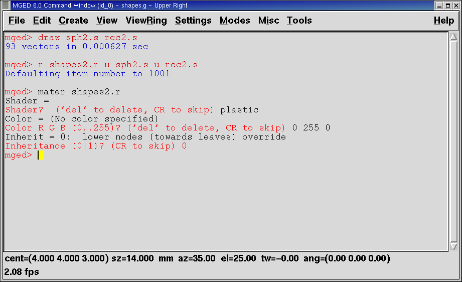

The one-line version of this set of commands would be: *mater shapes2.r plastic 0 255 0 0[Enter]* Diagrammed, this command says to:

[cols="5*"]
[%noheader]
|===
|mater
|shapes2.r
|plastic
|0 255 0
|0
|Assign material properties to:
|the region called shapes2.r
|Make the region of plastic
|Give it a color of light green
|Do not inherit colors or material type
|===

[[clear_window_new_region]]
=== Clearing the Graphics Window and Drawing the New Region

An easy way to clear the Graphics Window of the old design and draw the new region is to type at the _MGED_ prompt: *B shapes2.r[Enter]* This command tells _MGED_ to:

[cols="2*"]
[%noheader]
|===
|B
|shapes2.r
|Blast (clear) the Graphics Window and draw
|The region named shapes2.r
|===

The Blast command is shorthand for the combination of the Z and draw commands.

[[raytrace_model]]
=== Raytracing Your Model

Now go to the File menu and select Raytrace. A dialog box called the Raytrace Control Panel will appear. At the top are menus for Framebuffer and Objects. Select Framebuffer. A drop-down menu will appear with six choices: Active, All, Rectangle Area, Overlay, Interlay, and Underlay. Make sure the Active, All, and Underlay options are activated (as shown by the presence of a red indicator to the left of each choice). Select OK.

[NOTE]
====
Note: When you select Raytrace from this dialog window, you start an auxiliary program (rt) of the _BRL-CAD_ package. The program only raytraces objects that have been drawn in the Graphics Window. You may have many shapes, regions, or combinations in a database, but if they aren't currently drawn in the Graphics Window, the raytracer will ignore them.

====

Change the background color produced by the raytracer by selecting Background Color in the Raytrace Control Panel. A drop-down menu will appear with some predefined color choices plus a color tool. Select the white option. The select button should now appear white, in accordance with your selection.

Next select Raytrace from the four options along the bottom of the box. The Graphics Window should start changing, and you will soon see your design in shades of green with the wireframe superimposed on the design, as shown in the following example:

image::../lessons/images/mged04_raytracedshapes.png[]

As we have seen, you can specify the background color for the raytraced image.

You can also fill the entire framebuffer with the background color. To do this, select the desired color and then click the fbclear (framebuffer clear) button at the bottom of the Raytrace Control Panel.

[[layers_graphics_window]]
=== Changing Layers of the Graphics Window

The Graphics Window of _MGED_ is used to display different types of graphical information: 3D wireframes and 2D pixels (or images). Conceptually, each type of data occupies a separate layer in the display. The 3D wireframes occupy the wireframe layer, while the 2D pixels (images) occupy the framebuffer layer. These layers can be thought of as transparencies, and the order in which they are stacked and displayed can be changed.

As mentioned previously, there is a Framebuffer menu within the Raytrace Control Panel. At the top of this menu is a toggle button labeled Active. This turns the display of the framebuffer layer on and off. Near the bottom of the same menu are three radio buttons: Overlay, Interlay, and Underlay. When the underlay mode is selected, the pixel data are displayed under or behind the vector data. Conversely, when the overlay mode is selected, the pixel data are in front of the vector data. The interlay option is similar to the overlay mode. The subtle difference is an advanced topic not covered here.

[cols="2*"]
[%noheader]
|===
|image:../lessons/images/mged04_raytracedshapes.png[]
|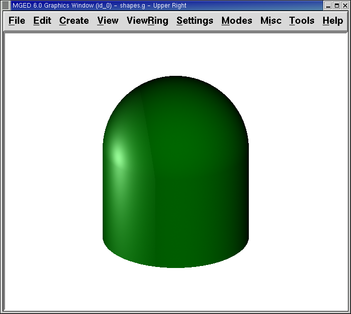
|Framebuffer in Underlay Mode
|Framebuffer in Overlay Mode
|===

To see how this works, go to the framebuffer menu and select Overlay. Notice that the wireframe representation disappears. Where does it go? If you answered "behind the framebuffer," you would be correct. To view the model's geometry, you would have to make the framebuffer inactive or select underlay mode.

The wireframe layer has a yellow dot in the center that marks the center of the view talked about in Lesson 2. This allows you to determine whether the framebuffer is in overlay or underlay mode. If you can see the yellow dot, the framebuffer is in underlay mode. If you've told _MGED_ to draw some geometry and the Graphics Window seems to remain blank, you are probably seeing a blank framebuffer masking the wireframe layer.

Note that you can change the view in the wireframe, but the view in the framebuffer does not automatically update to match. It is not possible to directly manipulate the view in the framebuffer. You must raytrace again in order to update the framebuffer image.

[[clear_graphics_window]]
=== Clearing the Graphics Window

To completely clear the Graphics Window, you have to handle both the wireframe and framebuffer layers. Recall that you can clear the wireframe layer with the Z command. For the framebuffer layer, there is the fbclear button on the Raytrace Control Panel.

In some instances, you may prefer to turn off the framebuffer instead of clearing it. When the framebuffer is turned off, _MGED_ runs faster because it doesn't have to redraw the framebuffer each time it updates the display. You can turn the framebuffer on and off by toggling the Active item in the Raytrace Control Panel's framebuffer menu.

[NOTE]
====
Note that in _BRL-CAD_ versions 5.1 and later, turning off the framebuffer does not destroy the image it contains. Turning it back on displays the same image. However, in earlier versions of the package, the contents of the framebuffer are lost when it is turned off.

====

[[assigning_material_properties_and_raytracing_review]]
=== Review

In this lesson you:

* Recalled primitive shapes made previously.
* Made a region of two primitive shapes.
* Assigned material properties to your primitive shapes from the Command Window.
* Cleared the Graphics Window and draw the new region.
* Raytraced your design from the GUI.
* Used the GUI to change layers of the Graphics Window.
* Cleared the Graphics Window after raytracing a model.

[[Lesson-5]]
== Lesson 5: Learning About Boolean Expressions

In this lesson, you will:

* Learn about combinations and regions.
* Learn about Boolean operations.
* Make regions with Boolean operations.

[CAUTION]
====
This is an important lesson because Boolean operations are critical to the modeling process. The order in which shapes are combined and the operators used to combine the shapes will determine how the _MGED_ program interprets your model.

The correct use of Boolean expressions to modify geometric shapes is a key skill in constructive solid modeling. It important to review these concepts as many times as necessary. If it is difficult to absorb them all now, come back to them later.

====

[[boolean_tools]]
=== Combinations and Regions: Boolean Tools

There are conceptually two objects in _MGED_ that support Boolean operations. One is called a combination, the other is called a region.

As mentioned earlier, a typical geometric shape in _MGED_ is called a primitive. However, single primitives are often insufficient to fully describe the complex shape of the object being modeled. So, combining two or more primitive shapes into other shapes (called combinations) using Boolean operators allows you to artfully imitate the shape and form of most complicated objects.

The previous chapter noted that material properties are associated with regions. Like combinations, regions use Boolean operations to create complex shapes. The difference is that regions are shapes that have material properties. They occupy three-dimensional space, rather than simply defining a shape in space.

You can think of primitives and combinations as a blueprint for an object. The actual object is created when a region is made. For example, you might make a blueprint of an object such as a coffee mug, but then create that mug from different types of material (e.g., ceramic or glass). Regardless of the material, the blueprint is the same.

When Boolean operations are used to build up complex shapes from simpler shapes, we can call the result a shape combination. When they are used to define other logical or hierarchical structure within the database, the result may be referred to as a group or an assembly combination.

[[boolean_operations]]
=== Boolean Operations

The three Boolean operators employed by the _MGED_ program are union, subtraction, and intersection. You can use Boolean operations to combine shapes to produce more complex shapes.

* Union Shapes: Merge two shapes.
* Subtract Shapes: Remove the volume of one shape from another.
* Intersect Shapes: Use only the parts of the two shapes that overlap.

[[Union]]
==== Union

The union operator, u, joins shapes so that any point in at least one of them will be part of the result. Union is a powerful and frequently used operator.

image::../lessons/images/mged05_unionspheres.png[]

[[Subtraction]]
==== Subtraction

When a primitive shape has a second, overlapping shape subtracted from it, the result is that the second shape disappears, together with any common volume it had with the first shape. The - (minus sign) operator signifies subtraction or difference. This operation is especially useful in hollowing a body, removing an oddly shaped piece of a primitive shape, or accounting for edge intersections of walls, plates, piping, or other connected shapes.

In the following example, a dotted red line indicates that the sphere being subtracted extends inside the sphere on the right. This overlapping portion is partially out of view in the raytraced image.

image::../lessons/images/mged05_subtractionspheres.png[]

[[Intersection]]
==== Intersection

The Boolean intersection operation, signified by a + (plus sign) operator, combines two primitive shapes that overlap each other, saving only their common volume (the nonoverlapped areas will not be present). An easy way to understand intersections is to think of shapes as roads. The intersection is the place where two roads overlap.

Although many people find intersection operations harder to understand than unions and subtractions, unusual/complex shapes can be expressed using the intersection operator. For example, you can model a magnifying lens as the intersection of two spheres.

The intersection operation is rarely useful unless, as shown in the following figure, at least two shapes overlap. The intersection of two shapes having no common points (i.e., no overlap) is the null set, so it includes no points of space at all.

image::../lessons/images/mged05_intersectionspheres.png[]

There is one important restriction when using the Boolean subtraction and intersection operators. There must be a first shape from which a second shape can be subtracted or intersected. If you have only one shape within a region or combination, the operator will be ignored and the union operator will always be used.

[[making_regions_bool_ops]]
=== Making Regions with Boolean Operations

Begin by opening the database shapes.g that you created in Lesson 3. At the Command Window prompt, type: *draw sph2.s rcc2.s[Enter]* This lets us see the shapes we will be using to create our regions. As seen earlier, the two shapes should look something like the following:

image::../lessons/images/mged05_twoprimitivespheres.png[]

In this lesson, we will create different shapes to demonstrate the function of Boolean operations. In the Command Window, type the following: *r part1.r u rcc2.s - sph2.s[Enter]* This command tells _MGED_ to:

[cols="6*"]
[%noheader]
|===
|r
|part1.r
|u
|rcc2.s
|-
|sph2.s
|Make a region
|Call it part1.r
|Merge...
|The shape named rcc2.s
|Subtract...
|The shape named sph2.s
|===

[NOTE]
====
Note: The first member always has a lowercase u for an operator. The second and subsequent members can use -, +, or u as needed. The process of determining which operators to use, and in what order, is discussed in a more advanced tutorial.

====

In the previous lesson, we applied material properties to objects from the Command Line. Now we are going to use the graphical interface to do the same thing. From the Edit menu, choose Combination Editor. This will pop up a dialog box. Select the button to the right of the Name entry box and then Select from All. A drop-down menu will appear with the regions you have created. Select part1.r. The result should look like the following:

image::../lessons/images/mged05_combinationeditor.png[]

Click on the button next to Color and select red from the pull-down menu.

Now click the OK button at the bottom left of the dialog window. This will apply your changes and close the panel.

At the moment, we have only the primitive shapes displayed, not the region. Before we can raytrace, we must remove the primitive shapes from the display, and draw the region. Otherwise, we will not be able to see the region with the color properties we applied. We can do this by typing: *B part1.r*

We are now ready to raytrace this object. From the File menu, bring up the Raytrace Control Panel and click the Raytrace button. The image you get should look similar to the left-hand image that follows. Note that it may take several minutes to raytrace the window, depending on the speed of your particular system.

[cols="2*"]
[%noheader]
|===
|image:../lessons/images/mged05_raytracedpart1.png[]
|image:../lessons/images/mged05_raytracedpart2.png[]
|Raytraced part1.r
|Raytraced part2.r
|===

You should see that a spherical "bite" has been taken out of the top of the cylinder.

Next we will make a blue region using the intersection operator instead of subtraction. Once again, we start by creating a region: *r part2.r u rcc2.s + sph2.s[Enter]*

For comparison to the GUI approach used to make part1.r, let's use the Command Line to assign the color to part2.r: *mater part2.r plastic 0 0 255 0[Enter]*

Finally, Blast this new region onto the display as follows: *B part2.r[Enter]*

Now raytrace the object. It should look similar to the preceding right-hand image.

[NOTE]
====
Note: Remember to clear the Graphics Window and draw your new region or combination before trying to raytrace the model. The raytracer ignores a region or combination that is not drawn in the Graphics Window. The color of the wireframe is your clue. If it doesn't reflect the colors you've assigned (e.g., everything is drawn in red even though you've assigned other colors), then you haven't cleared the screen of the primitive shapes and drawn the new region or combination since the time you made it.

====

When you use the intersection operator, the order in which you specify the shapes doesn't matter. We would have gotten the same results if we had specified the Boolean operation as *r part2.r u sph2.s + rcc2.s*

However, when using the subtraction operator, the order of the two shapes is very important. Let's make a region with the order of the shapes reversed from that used for part1.r: *r part3.r u sph2.s - rcc2.s*

This time we won't bother to set a color. (When no color is set for objects, the raytracer (rt) will use a color of white. However, these objects may appear gray because of the amount of light in the scene.) Blast this design to the display and raytrace it:

image::../lessons/images/mged05_raytracedpart3.png[]

Now let's raytrace all three objects we have created together. To draw the three regions at once, we could type: *B part1.r part2.r part3.r*

Doing this once is no problem. However, if these were three parts that made up some complex object, we might like to be able to draw all of them more conveniently. To make drawing a collection of objects together easier, we create an assembly combination to gather them all together. We will create one called dome.c for our three regions. This is accomplished by the following command: *comb dome.c u part1.r u part2.r u part3.r*

Notice the similarity between this command and the r command we used to create the regions.

Remember from the discussion at the beginning of this lesson, the difference between a region and a combination is that combinations are not necessarily composed of only one kind of material. Several objects of different materials can make up an assembly combination such as the one we have just created.

[NOTE]
====
Because creating assembly combinations is a very common task, there is a shortcut command-the g (for group) command-to help make the task easier. Creating dome.c using this command would look as follows: *g dome.c part1.r part2.r part3.r* Notice that you don't have to type the u Boolean operators. The g command unions all of its arguments.

====

All that is necessary to draw all three objects is the much simpler command: *B dome.c*

Now we can raytrace the collected set and get the following image:

image::../lessons/images/mged05_raytraceddome.png[]

[[operator_precedence]]
=== Operator Precedence

The shapes we have created here are fairly simple. In each case, a single primitive shape is unioned, and subtraction or intersection operations are performed on that single primitive shape. You should know that it is possible to use much more complex Boolean equations to create the shape of objects. When you want to make such objects, keep in mind the precedence of the Boolean operations. In the Boolean notation we are using, the subtraction and intersection operators both have higher precedence than the union operator has. So, for example: *comb demo.c u shape1 - shape2 u shape3 - shape4 + shape5*

This would result in the following Boolean expression: `(shape1 - shape2) u ( (shape3 - shape4) + shape5)`

[[learning_boolean_operations_review]]
=== Review

In this lesson, you:

* Learned about combinations and regions.
* Learned about Boolean operations.
* Made regions with Boolean operations.

[[Lesson-6]]
== Creating a Goblet

In this lesson, you will:

* Create a new database.
* Create, edit, and copy primitive shapes to make the parts of the goblet.
* Make regions of the parts.
* Make a combination of the regions.
* View a data tree.
* Raytrace your completed goblet.

In this lesson, you will create a goblet similar to the one in the following example.

image::../lessons/images/mged06_rtgoblet.png[]

[[goblet_new_database]]
=== Creating a New Database

First, start _MGED_ from the shell prompt. Select File from the menu bar and then New. A dialog box will appear, and it will ask you for a new database name. Type in goblet.g at the end of the path name and select OK to create the new database. The program should tell you that the database was successfully created and it is using millimeters for its unit of measure.

[[create_edit_copy_goblet]]
=== Creating, Editing, and Copying the Parts of the Goblet

[[Creating_the_Goblet_Base]]
==== Creating the Goblet Base

Go to the menu bar, select the Cones and Cylinders category, and then select rcc for right circular cylinder. A dialog box will appear asking you to name the rcc. Type in base1.s and then select Apply (or press ENTER). A tall cylinder will appear in the Graphics Window that is ready for you to edit.

[[Editing_the_Base]]
==== Editing the Base

Go to the menu bar and select Edit and then Set H. Place the mouse pointer in the lower half of the Graphics Window and click on the middle mouse button several times. The cylinder will become shorter as you click. (Note that the closer your pointer is to the midpoint of the Graphics Window, the smaller the change will be. As you click farther away from the middle, the changes will be greater.) Continue clicking until the cylinder looks like a flat disk, as shown in the following figure. Click on Accept on the Edit menu when done.

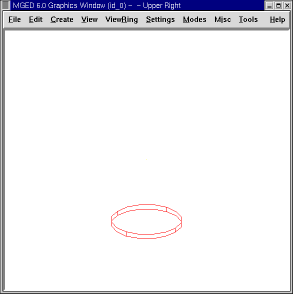

[[Creating_the_Goblet_Stem]]
==== Creating the Goblet Stem

Go to the menu bar, select Create, select Ellipsoids, and then select sph to create a sphere. You will be asked to provide a name for the sphere. Type ball1.s in the name box and then select Apply. A large sphere will appear in your Graphics Window.

Go to the Edit menu and select Scale. Place the mouse cursor/pointer in the lower half of the Graphics Window and click the middle mouse button until your sphere is about one-quarter the diameter of the base, as shown in the illustration that follows.

image::../lessons/images/mged06_goblet1stsphere.png[]

To move the ball on top of the goblet base, press the SHIFT key and left mouse button to drag the sphere into place. You can check your placement by going to the View option of the menu bar and selecting a Front view. In this view, you can align the center line of the sphere with the center line of the rcc. Repeat this process from a Left view. When you believe the sphere is correctly aligned with the rcc, go back to the Edit menu and select Accept.

[[Adding_Additional_Balls]]
==== Adding Additional Balls to the Goblet Stem

The next step is to add more spheres to your goblet stem. An easy way to do this is to go to the Edit menu and select Primitive Editor. A dialog box will appear. Enter the name for the first sphere you created, ball1.s. Next, select Reset (to reset the values of the dialog box to those of ball1.s) or hit return in the Name box. Again in the Name box, change ball1.s to ball2.s by using the BACKSPACE key to erase the 1. Type in a 2 and then select Apply.

Repeat this process with an sph named ball3.s. When you are done, select OK to close the Primitive Editor box. You now have three balls for your stem, but you won't be able to see them until you edit them because they are in the same place.

An even easier way to make the copies is to use the cp (copy) command as follows: *cp ball1.s ball2.s[Enter]* *cp ball1.s ball3.s[Enter]*

[[Editing_the_base_Goblet]]
==== Editing the Balls of the Goblet Stem

To edit the new balls you have created, go to the Edit menu and select Primitive Selection. A box will appear with the names of your base and balls. Double click on ball2.s to select it. You will see the first ball change color to white. Use the SHIFT key and any mouse button to drag this ball (which is really ball2.s) so that it rests on top of (and slightly overlaps) ball1.s . Check your views to align the ball as you did with the first ball. (Note that this alignment is even easier if you drag using the SHIFT and ALT keys and the right mouse button, which will constrain the movement of the ball to the Z direction.) Click on Accept under the Edit menu when finished.

If you were modeling a real goblet, you would want the balls of the stem to overlap slightly. If they barely touch, the stem would be very weak. If they do not touch, then the stem would be made of separate pieces of material suspended in space.

Repeat these steps to move ball3.s into position. When you are finished, your goblet should look as follows from a front view:

image::../lessons/images/mged06_gobletstem.png[]

[[making_goblet_Basin]]
==== Making the Goblet Basin

The next step is to make the goblet's basin. Go to the Create menu and select eto to create an elliptical torus. Name the torus basin1.s. Click on Apply. A large eto will appear in your Graphics Window.

Go to the Edit menu and select Set C. Place the mouse arrow in the upper half of the Graphics Window and click on the middle mouse button until your eto is approximately the size of the one in the following figure. If you need to, use Scale to make the basin more proportional to the rest object and use the Shift Grips and multiple views to position the basin.

image::../lessons/images/mged06_gobletbasestembasin.png[]

[[making_goblet_regions]]
=== Making Regions of the Goblet's Base, Stem, and Basin

In order for _MGED_ to know what primitives to raytrace, you must first designate these areas through Boolean operations. In this example, the two Boolean operations used will be the union (u) and the subtraction (-).

To make the stem a region, type at the Command Window prompt: *r stem1.r u ball1.s u ball2.s u ball3.s[Enter]*

To make the base a region, type at the prompt: *r base1.r u base1.s - ball1.s[Enter]*

To make the basin a region, type at the prompt: *r basin1.r u basin1.s - stem1.r[Enter]*

Note that when creating base1.r, we subtracted a primitive shape from another primitive shape. When creating basin1.r, we subtracted an entire region from a primitive shape.

[[making_goblet_region_comb]]
=== Making a Combination of the Regions

To combine all the regions into one object, you will need to perform one last Boolean operation. At the prompt in the Command Window, type: *comb goblet1.c u basin1.r u stem1.r u base1.r[Enter]*

This operation tells the _MGED_ program to:

[cols="8*"]
[%noheader]
|===
|comb
|goblet1.c
|u
|basin1.r
|u
|stem1.r
|u
|base1.r
|Make a combination
|Name it goblet1.c
|The combination will be made of a union of
|the region basin1.r
|and
|the region stem1.r
|and
|the region base1.r
|===

[[goblet_view_data_tree]]
=== Viewing a Data Tree

_MGED_ requires a certain logical order to the model data tree so it knows how to raytrace the various elements. In the goblet, the base and basin consist of regions composed of only one primitive shape each. The stem, in contrast, consists of a region composed of the union of three spheres. The three regions were combined to form a complex object.

To view the data tree for this combination, type at the Command Window prompt: *tree goblet1.c[Enter]*

_MGED_ will respond with:

....

   goblet1.c/

   u basin1.r/R

   u basin1.s

   - stem1.r/R

   u ball1.s

   u ball2.s

   u ball3.s

   u stem1.r/R

   u ball1.s

   u ball2.s

   u ball3.s

   u base1.r/R

   u base1.s

   - ball1.s
	
....

The name of the overall combination of this design is goblet1.c. It is composed of the three regions: base1.r, stem1.r, and basin1.r. The region base1.r is composed of the primitive shape named base1.s minus ball1.s. The region stem1.r is composed of three primitive shapes named ball1.s, ball2.s, and ball3.s. The region basin1.r is composed of the primitive shape named basin1.s minus the region stem1.r.

Remember that regions define volumes of uniform material. In the real world (and in _BRL-CAD_), no two objects can occupy the same space. If two regions occupy the same space, they are said to overlap. To avoid having the base and stem overlap, we subtract ball1.s from base1.s when we create base1.r. We also subtract the stem1.r from basin1.s when we create basin1.r. This removes material from one region that would otherwise create an overlap with another. The following figure shows the overlap between ball1.s and base1.s in blue. This is the volume that is removed from base1.r.

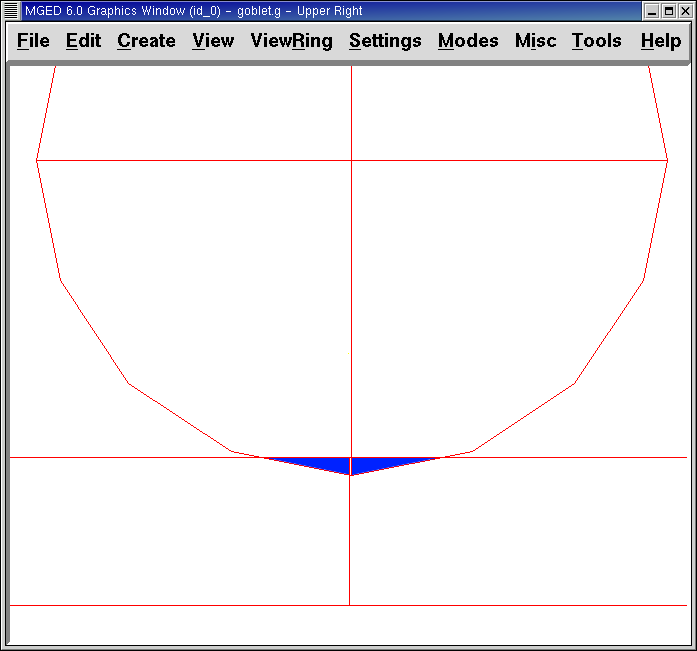

[[raytracing_goblet]]
=== Raytracing the Goblet

To raytrace the goblet using the default material properties of gray plastic, go to the File menu and select Raytrace. When the Raytrace Control Panel appears, change the color of the background by clicking on the button to the right of the Background Color box and then clicking on the white option in the drop-down menu. Next, select Raytrace.

When you have finished viewing the goblet from the front view, go to the View option of the menu bar and select az35, el25 and then raytrace. If you want to view the goblet without the wireframe, go to the Framebuffer option of the Raytrace Control Panel and select Overlay. The goblet should look similar to the following illustration:

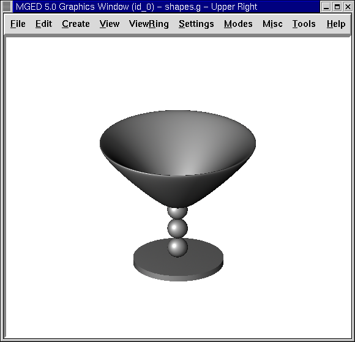

[[creating_goblet_review]]
=== Review

In this lesson, you:

* Created a new database.
* Created, edited, and copied primitive shapes to make the parts of the goblet.
* Made regions of the parts.
* Made a combination of the regions.
* Viewed a data tree.
* Raytraced your completed goblet.

[[Lesson-7]]
== Assigning Material Properties to Your Goblet

In this lesson, you will:

* Review how to open an existing database.
* Assign colors and the plastic shader to regions of the goblet.
* Use the transparency and mirror reflectance options of the shader.
* Raytrace various forms of your goblet.

In this lesson, you will add material properties to the goblet you created in the previous lesson. The finished goblet should appear similar to the one in the following example.

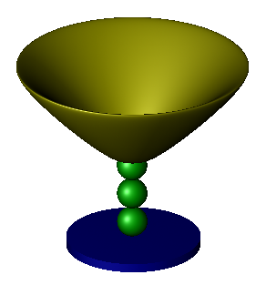

[[goblet_review_opening_db]]
=== Review of Opening an Existing Database

If you exited after the last lesson, open your goblet database (goblet.g) again. The easiest way to do this is to open the database from the Terminal Window when first starting _MGED_. To do this, type at the prompt: *mged goblet.g[Enter]*

Alternatively, you could start the _MGED_ program, and select File from the menu bar and then Open. A dialog box will appear and ask you to enter an existing database name. Type in goblet.g (or select it in the directory listing) and then select Open. The program should tell you that the database was successfully opened and it is using millimeters for its unit of measure. Click on OK.

[[Drawing_Goblet_Graphics]]
==== Drawing the Goblet in the Graphics Window

To draw the goblet you made in the previous lesson, move the mouse pointer to the Command Window and type at the prompt: *draw goblet1.c[Enter]*

A wireframe representation of the goblet should appear in the Graphics Window.

[[goblet_assign_colors]]
=== Assigning Colors and the Plastic Shader to Regions of the Goblet

Go to the Edit menu and select Combination Editor. To select the various regions of the goblet you made in the last lesson, go back to the Name box and click the button to the right of the entry box. A submenu will appear. Double click on Select From All Regions. A list of regions created for this database will appear, including base1.r, basin1.r, and stem1.r. double click on base1.r to select that region.

Click on the button to the right of Color in the Combination Editor, and a drop-down menu will appear with a list of available colors along with a color tool that will let you create more colors. Click on blue. Next, click the button to the right of the shader box. A list of available shaders will appear. Click on plastic. A new set of options will appear. You will use two of these options in this lesson. Click on Apply to assign the color blue and the plastic shader to the goblet base.

Repeat this process to assign the color green and plastic shader to the stem1.r region and the color yellow and plastic shader to the basin1.r region. When you are finished, select OK to dismiss the Combination Editor box.

Although the changes have been made to the database, the display in the Graphics Window doesn't reflect them yet. So, return the mouse pointer to the Command Window and type at the prompt: *B goblet1.c[Enter]*

This command clears the screen and redraws the goblet with the color selections applied.

[[Raytracing]]
==== Raytracing the Goblet

To raytrace the goblet, go to the File menu and select Raytrace. The Raytrace Control Panel will appear. Move your mouse pointer to the button to the right of Background Color and select the white option. To make the raytracing go faster, you can resize the Graphics Window to make it smaller before you open the raytrace panel. When the window is resized, select Raytrace to start the raytrace process.

[NOTE]
====
Note: As mentioned previously, it is undesirable to have regions that overlap. Although having overlaps may not always affect the raytracing process, if the model were going to be statistically analyzed, overlaps would create problems.

====

While the goblet is raytracing, move your mouse cursor to the Framebuffer option of the Raytrace Control Panel menu bar and select Overlay. When the raytrace process is finished, you should have a goblet similar to the following example:

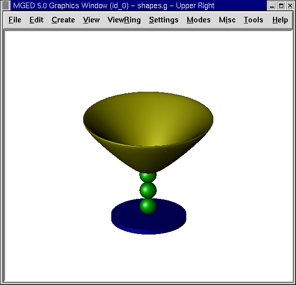

[[goblet_transparency_mirror]]
=== Using the Transparency and Mirror Reflectance Shader Options

The raytraced goblet looks fairly realistic, but it could be enhanced by using other options of the Combination Editor. When you selected the plastic shader, a new set of options appeared, allowing you to choose various properties or attributes of the shader. Among the options was Transparency. You can adjust this property on individual regions by entering any value between 0.0 (opaque) and 1.0 (transparent).

Just as you applied color and a shader to each of the goblet's three regions, you can adjust the transparency of each region by (1) selecting the region in the Combination Editor, (2) left clicking on the box next to Transparency, and (3) entering any value between 0.0 and 1.0.

For this lesson, open the Combination Editor, click the button to the right of the Name box, choose Select From All Regions in the drop-down menu, and then choose the base1.r region. Make sure plastic is the shader selected and type in .5 to make your region semi-transparent. Click on Apply and repeat this process for each of the other two regions. Then Raytrace the goblet, which should look similar to the following:

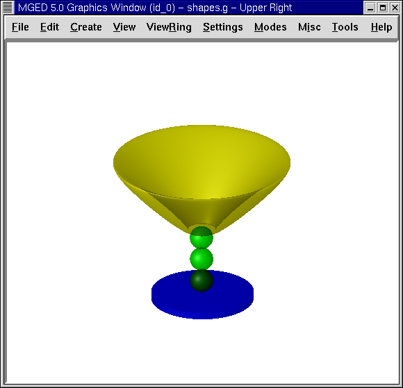

The colors of the semi-transparent goblet are brighter than those of the opaque goblet because more light is allowed to penetrate the plastic material. You could make the goblet more realistic in appearance by returning to the Combination Editor and adding a Mirror Reflectance. For each region, place your mouse cursor in the box next to this option, click the left mouse button, and type in .45. This will cause about half of the available light to be reflected off the surface of the goblet.

[[goblet_newforms_raytrace]]
=== Raytracing the New Forms of the Goblet

Click on Apply and Raytrace the design. The new image should appear similar to the following example:

image::../lessons/images/mged07_goblet_mirror.png[]

The new image is substantially different in appearance from the original image. Continue changing the values of transparency and mirror reflectance to see how they impact the resulting image.

Remember that when using these options, the combined value of both options should be less than 1.0. The following table shows you just some of the many possible combinations you could use:

[cols="2*"]
|===
|Transparency Value
|Mirror Reflectance Value

|.50
|.49
|.35
|.64
|.20
|.57
|.10
|.89
|.89
|.10
|===

[[goblet_material_properties_review]]
=== Review

In this lesson, you:

* Reviewed how to open an existing database.
* Assigned colors and the plastic shader to regions of the goblet.
* Used the transparency and mirror reflectance options of the shader.
* Raytraced various forms of your goblet.

[[Lesson-8]]
== Assigning More Material Properties to Your Goblet

In this lesson, you will:

* Use the specular and diffuse reflectivity options of the plastic shader.
* Assign values to the refractive index of the plastic shader.
* Assign values to the shininess option of the plastic shader.
* Assign values to the extinction option of the plastic shader.
* Experiment with various combinations of plastic shader options.

Open the goblet.g database using whichever method you prefer. Go to the Edit menu and select Combination Editor. Select basin1.r.

In the last lesson, we assigned values for two shader attributes-transparency and mirror reflectance. In this lesson, we will assign values for still other shader properties. When the plastic shader is selected for region basin1.r, eight attribute entry boxes currently appear in the Combination Editor. These boxes contain either the values that the user has previously set (e.g., those we previously set for transparency and mirror reflectance) or the default values that the raytracer will use if no others are specified. When any of these values is modified, the change can be seen in braces in the shader string box and in the appropriate attribute entry boxes, as indicated by the arrows in the following example:

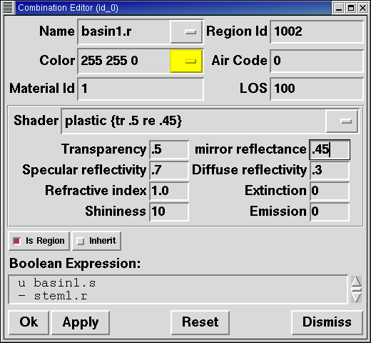

[NOTE]
====
Note that in _BRL-CAD_ versions prior to 5.2, the default values are used, but they are not displayed in the shader attribute boxes.

====

In this example, the shader entry box indicates that the transparency (tr) is set at .5 and the mirror reflectance (re) is set at .45. The eight abbreviations currently used in the shader entry box are as follows:

[cols="4*"]
[%noheader]
|===
|tr - transparency
|sp - specular reflectivity
|ri - refractive index
|ex - extinction
|re - mirror reflectance
|di - diffuse reflectivity
|sh - shininess
|em - emission
|===

[[goblet_specular_diffuse]]
=== Specular and Diffuse Reflectivity

When light reflects off of a shiny surface, it produces two types of reflections. The most noticeable highlights are caused by specular reflectivity. The rest of the surface produces diffuse reflectivity. The shinier (or glossier) the surface is, such as on a crystal vase, the more specular reflectivity that is produced. The duller the surface is, such as with a wall painted with flat paint, the more diffuse reflectivity that is produced. A model of the relationship between these reflectivities is shown in the following illustration:

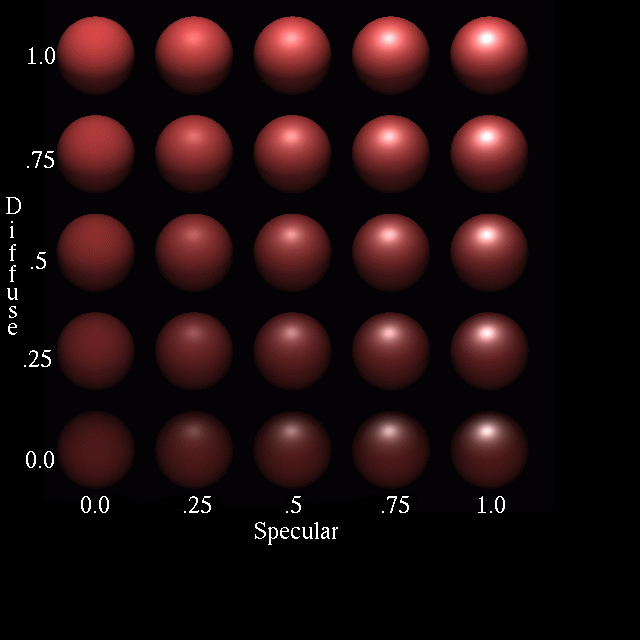

As seen in the illustration, diffuse reflectivity shows an object's color by reflecting ambient light off the object. The upper left ball exhibits the maximum value for diffuse reflectivity (1.0), and as a result, its surface color is uniform.

Specular reflectivity, on the other hand, reflects the color of a light source. The lowest right ball, with the maximum value for specular reflectivity (1.0), shows a white light source being reflected off the surface of the ball.

The range for both specular and diffuse reflectivity is 0.0 through 1.0. However, combined values for these are typically equal to 1.0. Remember, if you are going to set values for one of these attributes, you need to assign a corresponding value to the complementary attribute so that the combination of the values equals 1.0.

[[goblet_refractive_index]]
=== Refractive Index

When light passes through one medium (e.g., air) into another medium (e.g., water), it bends from its original path. The degree to which the light bends is called the refractive index. The more dissimilar the media are, the greater the degree of refraction that will occur. For example, sunlight passing through a diamond will bend more than the same sunlight through optical glass. The diamond would have a higher refractive index (approximately 2.42) whereas optical glass would have a lower refractive index (approximately 1.71).

The range of index of refraction for _MGED_ is 1.0 (the index for air) or greater. This parameter is only useful for materials that have a transparency greater than 0. The following drawing of sunlight passing through water shows how refraction works.

image::../lessons/images/mged08_refractive_index.png[]

[[goblet_shininess]]
=== Shininess

The shininess of an object affects the size of the specular component of the plastic shader. The shinier an object's surface is, the smaller the reflection of the light source on the object's surface will be. The range for shininess is typically an integer value from 1 to 10.

[[goblet_extinction]]
=== Extinction

The term extinction applies to the transmissive component of the plastic shader, and it indicates the amount of light absorbed by the object's material. The default value is 0.0, and the range can be any nonnegative number. Using this attribute can dramatically impact other attributes of the shader, especially the refractive index.

[[goblet_emission]]
=== Emission

Emission is a relatively new feature that has been added to the _BRL-CAD_ package. It concerns the amount of artificial brightness of the object.

[[goblet_shader_attributes]]
=== Applying Attributes of the Plastic Shader to the Goblet

Now that you understand the various attributes of the plastic shader, it is time to experiment with how they affect the final product-the goblet you created in the previous two lessons. You have already assigned values for transparency and mirror reflectance. Now add the attributes of specular reflectivity and diffuse reflectivity to basin1.r. Once you see how these two attributes affect your design, add the refractive index, then shininess and extinction. You might want to capture some of these changes so that you can refer to them later, when you are creating other models using the plastic shader. Remember to click Apply in the Combination Editor to actually incorporate the changes.

As you change the values for the attributes of the plastic shader, you will notice that some changes do not significantly alter the design. This is because there are a variety of ways to produce a particular look on an object. The following are two examples of the goblet with various values of the plastic attributes (which do create a noticeable difference) applied to basin1.r.

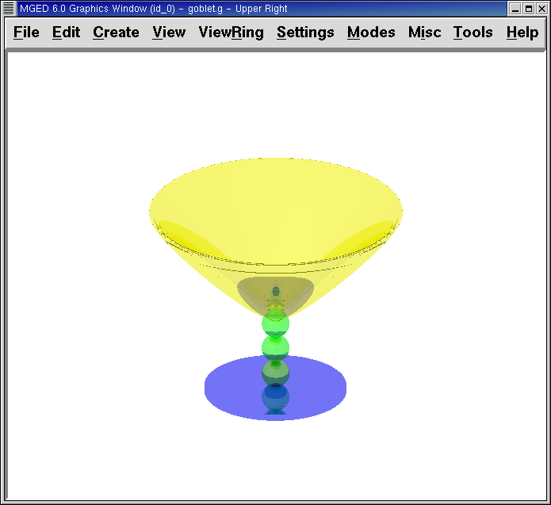

image::../lessons/images/mged08_goblet_reflectivity_2.png[]

By the time you have finished experimenting with changing attributes of the plastic shader, your Combination Editor window might look something like this:

image::../lessons/images/mged08_comb_editor_window_mater_prop.png[]

Notice that while the shader string entry box reflects the values set by the user in the attribute entry boxes (e.g., the Transparency of .5), it does not reflect the default values (e.g., the Shininess of 10).

[[goblet_material_properties2_review]]
=== Review

In this lesson, you:

* Used the specular reflectivity and diffuse reflectivity options of the plastic shader.
* Assigned values to the refractive index of the plastic shader.
* Assigned values to the shininess option of the plastic shader.
* Assigned values to the extinction option of the plastic shader.
* Experimented with various combinations of plastic shader options.

[[Lesson-9]]
== Creating a Globe in a Display Box

In previous lessons, you combined various shapes into new objects. These new objects have been created using solid building blocks, much like those used in a wooden toy truck. However, in real life, most of the objects that you will design will consist of an outside shell and various inside parts.

In this lesson you will:

* Use the GUI to create a display box using arb8 shapes.
* Create a globe inside the display box.
* Assign material properties to make the objects appear more realistic.
* Rotate an object 180'0 using the rotate option of the Edit menu
* Use the color option of the Combination Editor to produce customized colors.

[[globe_in_display_newdb]]
=== Create a New Database

Begin by creating a new database. Name your new file cube.g.

[[globe_create_display_box]]
=== Creating the Display Box

Go to the Create menu, select the Arbs category, and then select an arb8 (arbitrary convex polyhedron with eight vertices). When asked to provide a name for the arb8, name it cube1.s. Click on Apply. Go to the Edit menu and select Accept. You now have a cube for the outside of the display box, as in the following:

image::../lessons/images/mged09_globe_outside_display_box.png[]

Repeat the first part of this process to produce another arb8, this time calling this shape cube2.s. Go to the Edit menu and select Scale. Place the mouse pointer in the lower half of the Graphics Window screen and click the middle mouse button until the second cube is slightly smaller than the first cube, as follows:

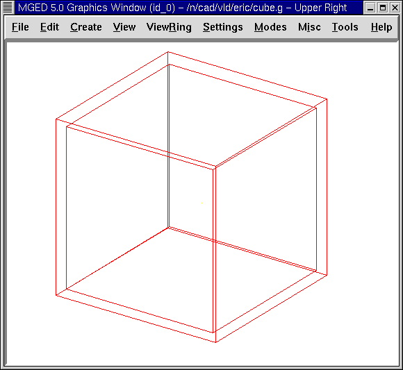

Go to the View menu and change view to Front. Go to the Edit menu and select Translate (move). Hold down the SHIFT key and drag the inside cube into position in the center of the outside cube. Repeat this process from the Top view and Left view until the smaller cube is placed in the center of the outside cube when viewed from all perspectives. When you are finished, go back to the Edit menu and select Accept.

[[create_globe_in_box]]
=== Create a Globe Inside the Display Box

Go to the Create menu and select sph from the list of Ellipsoids. Name the shape globe1.s and select Apply.

A sphere should appear inside the cube in the Graphics Window. Change View to Front.

Go to the Edit menu and select Scale. Reduce the size of the sphere until it will fit inside of the cube and then drag it into the center of the cube. Go to Edit and Accept your changes. Your globe and box should appear similar to the following in the az35, el25 view:

image::../lessons/images/mged09_globe_wireframe.png[]

To view contents of the database, type at the Command Window prompt: *ls[Enter]*

You should see cube1.s, cube2.s, and globe1.s listed as shapes you have created. To make regions of these shapes, type at the prompt: *r cube1.r u cube1.s - cube2.s[Enter]* *r globe1.r u globe1.s[Enter]*

[[globe_assign_mater_prop]]
=== Using the Combination Editor to Assign Material Properties that Make the Objects Appear More Realistic

Go to Edit and select Combination Editor. In the dialog box, click the button next to the Name entry box. Select globe1.r from Select From All or Select From All Regions. Double click on the globe1.r name. Assign this region a Shader of cloud. Check the Boolean Expression box to make sure the region is made up of u globe1.s. Click on Apply to accept your choices. Go to View and select az35, el25.

Go back to Name and select cube1.r from the Select From All menu. Assign this region a Shader of glass. The glass shader is a shortcut to individually changing the attributes of the plastic shader to make it appear like glass.

Go to the Color option and enter the values 244 255 255. This will give your glass box a light cyan color. Click on Apply to accept your changes.

Before you can raytrace your design, you need to clear the Graphics Window by typing Z at the Command Window prompt because both shapes and regions are being displayed at this point. Next, type in the Command Window: *draw cube1.r globe1.r[Enter]*

The display box and globe should reappear in the Graphics Window. Go to the File menu and select Raytrace. Next, select the white option for Background Color. Click on Raytrace.

Your design should show a light cyan-colored glass cube with a blue globe inside. To eliminate the wireframing, go to Framebuffer (in the Raytrace Panel) and select Overlay. The display should appear similar to the following illustration:

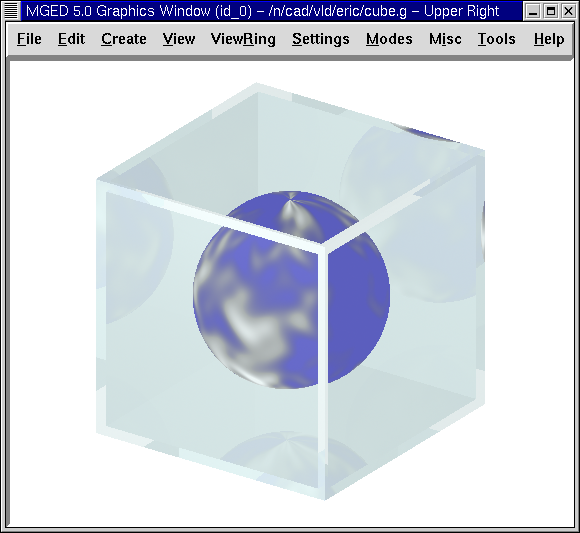

To make this design more interesting, you can place the globe on a base. Do this by going back to Framebuffer and clicking on Active to deactivate the framebuffer. Next, go to the Create menu and select the trc (truncated right cone) under the Cones and Cylinders category. Name the shape base1.s. Working from a Front view, go to the Edit menu and select Scale. Click the middle mouse button to reduce the trc in size until the bottom of it appears to be an appropriate size for the globe base. (You may need to increase the size of your Graphics Window or decrease your geometry view size to see the bottom of the trc.) Next, reduce the height of the shape by selecting Set H from the Edit menu and clicking with the middle mouse button. You may need to switch back and forth between these two options a few times to get an acceptable size. When finished, however, do not select Accept yet, as we have more changes to make.

[[globe_move_rotate]]
=== Moving and Rotating an Object

As with other features in _MGED_, moving and rotating objects can be accomplished in several ways, according to the amount of precision desired. As previously described, the Shift Grip functions can be used as a quick way to change an object when its exact angle and location do not necessarily matter. Alternatively, to achieve greater precision, the Translate (move) and Rotate commands under Edit can be selected and specific parameter numbers can be entered in the Command Window. In this lesson, we will experiment with both methods.

With your trc still in edit mode and still in a Front view, use the SHIFT key and the left mouse button to drag your shape (the bottom of the base) and sit it on the floor of the cube (just touching the inside box). Note that you could have selected Translate under Edit and entered parameters on the Command Line to move the trc to an exact location; however, in this case, aligning the shape with the drag-and-drop "eyeballing" method was appropriate. At this point, you may notice that your trc needs to be resized a little to better fit the globe. Use Scale and Set H as needed and then Accept your changes.

Now we need to make a second trc named base2.s, which we will use for the top of the base. On the Command Line, type: *cp base1.s base2.s*

The second trc will appear directly on top of the first trc, so we will have to use Primitive Selection under the edit menu to put base2.s in edit mode so that we can flip it upside down and then drag it to the top of the first trc.

To do this, we could use the CTRL and ALT (constrained rotation) keys and left mouse button and then move the mouse up or down until the trc is upside down. (If this method is used, note that you can release the mouse button and regrab the object if you need to.) However, because we know we want to rotate the shape an exact amount (180'0) about the x axis, let's use a more precise method to flip the shape. Select Rotate under Edit and then type in the following parameters (abbreviated as p) on the Command Line: *p 180 0 0[Enter]*

Our shape should have flipped upside down and jumped to the bottom of the first trc. (The two zeros you input indicate no rotation along the y and z axes.) Now use the SHIFT key and the left mouse button to drag base2.s upward and sit it on top of base1.s. The two shapes should form a base in which to hold your globe. Check your alignment using multiple views and then Accept your changes.

Go to Edit and Primitive Selection and select globe1.r/globe1.s. As you did with the trc shapes, use the Shift Grips to drag the globe down until it is in place on the base. Go back to the Edit menu and select Accept. Your design should look as follows:

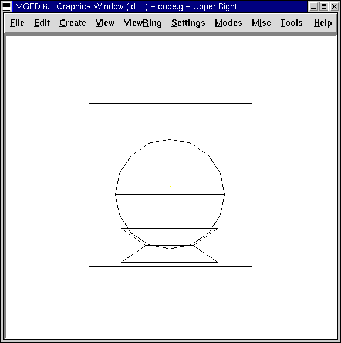

To make a region of the base, type in the Command Window: *r base1.r u base1.s u base2.s[Enter]*

[[globe_use_color_tool]]
=== Use the Color Tool of the Combination Editor to Produce Customized Colors.

In the Combination Editor window, click the button to the right of the Name entry box and then Select From All. Choose base1.r. Assign the base a Shader of plastic. In the Color box, enter the numbers: *217 217 217*

Apply your changes. Before you can raytrace your completed design, you must first clear the Graphics Window and rebuild your design by typing at the Command Window prompt: *Z[Enter]* *draw cube1.r globe1.r base1.r[Enter]*

Change your view to az35, el25 and then raytrace your design, which should appear similar to the following:

image::../lessons/images/mged09_globe_base_box_raytraced.png[]

[[globe_in_display_box_review]]
=== Review

In this lesson, you:

* Used the GUI to create a display box using arb8 shapes.
* Created a globe inside the display box.
* Used the Combination Editor to assign material properties that make the objects appear more realistic.
* Rotated an object 180'0 using the rotate option of the Edit menu.
* Used the color option of the Combination Editor to produce customized colors.

[[Lesson-10]]
== Creating a Mug

In this lesson, you will:

* Create an outside cylinder using the in command.
* Create an inside cylinder for hollowing out the larger shape cylinder.
* Create a handle for your mug.
* Create a combination to produce the body of your mug.
* Create a combination to join the handle to the body.
* Create a region of combined shapes with the same material and color.

In this lesson, you will be continuing your work creating real-life objects-in this case, the basic body shape of a coffee mug. In the next lesson, you will refine the body so that it is more realistic.

[[mug_new_db]]
=== Creating a New Database

Create a new database and call it mug.g. Go back to the File menu and select Preferences, then Units, and then inches. This will create your body using inches. (Note: You could also do this by typing units in at the Command Window prompt.)

[[mug_outside_cyl]]
=== Creating the Outside Cylinder Using the In Command

To begin making the body, you will need to create an outside right circular cylinder. At the _MGED_ prompt, type: *in bodyout.s rcc*

The diagram of this command is as follows:

[cols="3*"]
[%noheader]
|===
|in
|bodyout.s
|rcc
|Make a shape
|Call it bodyout.s
|The shape type is right circular cylinder
|===

_MGED_ will ask you the following questions about the cylinder you want to make. Type in the values given in bold. Make sure you leave spaces between variable values. *Enter X, Y, Z of vertex: 0 0 0[Enter]* *Enter X, Y, Z of height (H) vector: 0 0 3.5[Enter]* *Enter radius: 1.75[Enter]*

Note that the streamlined way to do this would be to type: *in bodyout.s rcc 0 0 0 0 0 3.5 1.75[Enter]*

The diagram of this command is as follows:

[cols="6*"]
[%noheader]
|===
|in
|bodyout.s
|rcc
|0 0 0
|0 0 3.5
|1.75
|Make a shape
|Call it bodyout.s
|The shape type is right circular cylinder
|The x, y, and z of vertex is 0 0 0
|The x, y, and z of the height vector is 0 0 3.5
|The radius is 1.75
|===

A shape of a cylinder, in wireframe form, will appear in the Graphics Window.

[[mug_inside_cyl]]
=== Creating the Inside Cylinder

Using this same method, type in the information for the inside right circular cylinder. This cylinder will be used to hollow out the outside cylinder. Whenever you are creating a hole in the surface of an object, make sure the shape creating the hole protrudes through the surface. This will ensure that you don't inadvertently leave a thin film of material where the two surfaces meet. *in bodyin.s rcc 0 0 0.25 0 0 3.5 1.5[Enter]*

The diagram of this command is:

[cols="6*"]
[%noheader]
|===
|in
|bodyin.s
|rcc
|0 0 0.25
|0 0 3.5
|1.5
|Make a shape
|Call it bodyin.s
|The shape type is right circular cylinder
|The x, y, and z of vertex is 0, 0, and 0.25
|The x, y, and z of the height vector is 0, 0, and 3.5
|The radius is 1.5
|===

A second cylinder, inside the first cylinder, should now appear in the Graphics Window.

[[mug_handle]]
=== Creating the Handle

Now you will want to enter some information about the body's handle. The shape type for the handle is an elliptical torus. At the Command Window prompt, type: *in handle.s eto 0 2.5 1.75 1 0 0[Enter]*

The diagram of this command is:

[cols="5*"]
[%noheader]
|===
|in
|handle.s
|eto
|0 2.5 1.75
|1 0 0
|Make a shape
|Name it handle.s
|The shape type is elliptical torus
|The x, y, and z of the vertex is 0, 2.5, and 1.75
|The x, y, and z of the normal vector is 1, 0, and 0
|===

The program will ask you to enter more values for the elliptical torus you are creating. Type in the values shown in bold. *Enter radius of revolution, r: 1.45[Enter]* *Enter X, Y, Z, of vector C: 0.6 0 0[Enter]* *Enter elliptical semi-minor axis, d: 0.2[Enter]*

A doughnut shape should appear on the right-hand side of the body. If you look carefully, you can see that about one-third of the elliptical torus intersects the body.

[[mug_comb1]]
=== Creating the Bodyout.s-Bodyin.s Combination

The next step is to combine the two cylinders into the body of the mug. To do this, type: *comb body.c u bodyout.s - bodyin.s[Enter]*

You have told the program to make the combination body.c out of the union of bodyout.s minus bodyin.s.

[cols="6*"]
[%noheader]
|===
|comb
|body.c
|u
|bodyout.s
|-
|bodyin.s
|Make a combination
|Call it body.c
|Create a union of
|bodyout.s cylinder
|and subtract
|bodyin.s cylinder
|===

[[mug_comb2]]
=== Creating the Handle.s - Bodyout.s Combination

To combine the handle with the outside cylinder, type: *comb handle.c u handle.s - bodyout.s[Enter]*

[cols="6*"]
[%noheader]
|===
|comb
|handle.c
|u
|handle.s
|-
|bodyout.s
|Make a combination
|Call it handle.c
|Create a union of
|the handle.s torus
|and subtract
|the bodyout.s cylinder
|===

[[mug_region]]
=== Creating the Region Mug.r

The last step, of this part of making the mug is to make a region out of your combinations. Type: *r mug.r u body.c u handle.c[Enter]*

[cols="6*"]
[%noheader]
|===
|r
|mug.r
|u
|body.c
|u
|handle.c
|Make a region of shapes of the same material and color
|Call it mug.r
|Create a union of
|the body.c combination
|and merge it with
|the handle.c combination
|===

If you did this correctly, the program should say something similar to:

....

   Defaulting item number to 1002

   Creating region id=1001, air=0, GIFTmaterial=1, los=100
      
....

image::../lessons/images/mged10_mug_wireframe.png[]

You should now have the region mug.r that is a combination of shapes containing the same material and color. You could assign color and material at this point, but you will want to do some more work on this design to make it more realistic. So, for now, review the lessons of this chapter. When you are ready to work again, you can continue refining your design in the next lesson.

[[mug_review]]
=== Review

In this lesson you:

* Created an outside cylinder using the in command.
* Created an inside cylinder for hollowing out the larger shape cylinder.
* Created a handle for your mug.
* Created a combination to produce the body of your mug.
* Created a combination to join the handle to the body.
* Created a region of combined shapes with the same material and color.

[[Lesson-11]]
== Refining the Mug

In this lesson, you will:

* Assign material properties to the mug using the mater command.
* Refine the mug.
* Combine the shapes.

In this lesson, you will refine the mug you made in the previous lesson. If you stopped at the end of that lesson, open the database mug.g before continuing.

[[mug_mater_prop_mater_cmd]]
=== Assigning Material Properties to the Mug Using the mater Command

Assigning material properties to a region can be done with either the mater or shader command. The program will respond with a series of questions. These concern the various parameters of the shader you select to use in rendering the object.

The most commonly used shader is the plastic shader, which uses a Phong lighting model. Select the plastic shader and set the color to a medium shade of green. The dialog in the Command Window should appear as follows: mged>mater mug.r[Enter]

....

   Current shader string =
   Specify shader.  Enclose spaces within quotes.  E.g., "light invisible=1"
   Shader? ('del' to delete, '.' to skip) plastic[Enter]
   Current color = (No color specified)
   R, G, B color values (0 to 255)? ('del' to delete, '.' to skip) 32 128 32[Enter]
   Current inheritance = 0: lower nodes (towards leaves) override
   Should this object's shader override lower nodes? ('.' to skip) 0[Enter]
      
....

Enter the appropriate information that is shown in bold font. If you want to use the streamlined version, type: *mater mug.r plastic 32 128 32 0[Enter]*

Diagrammed, this command says:

[cols="5*"]
[%noheader]
|===
|mater
|mug.r
|plastic
|32 128 32
|0
|Assign material properties to a region
|Called mug.r
|Make the material plastic
|Color the mug green
|Turn inheritance off*
|===

[NOTE]
====
Inheritance is an advanced topic beyond the scope of the present discussion.

====

[[mug_raytrace1]]
=== Raytracing the Mug

Open the Raytrace Control Panel and select Raytrace. You should get an image of a green mug on a dark background (we use a white background here to save printing ink). If your mug is not green, you probably need to redraw your wireframe before raytracing.

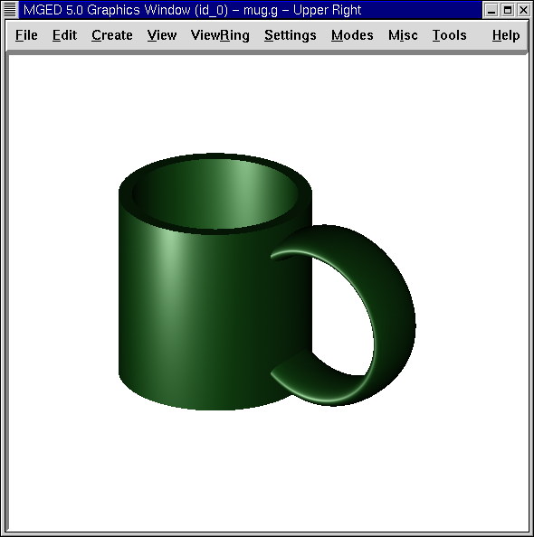

[[mug_refining]]
=== Refining the Mug

Now let's improve the cup. Notice that the lip of the cup looks a little too squared off. To fix this, you will need to add a rounded top to the lip. You can do this by positioning a circular torus shape exactly at the top of the cup. Then you can add it to the combination body.c.

At the _MGED_ prompt, type: *in rim.s tor 0 0 3.5 0 0 1 1.625 0.125[Enter]*

[cols="7*"]
[%noheader]
|===
|in
|rim.s
|tor
|0 0 3.5
|0 0 1
|1.625
|0.125
|Make a shape
|Call it rim.s
|Make the shape a torus
|With x, y, and z vertices of 0, 0, and 3.5
|With x, y, and z of normal vector being 0, 0, and 1
|Radius 1 is 1.625 inches and
|Radius 2 is 0.125 inches
|===

[[mug_torus_cup_combine]]
=== Combining the Shapes

To combine the torus with the cup, you will need to type at the prompt: *comb body.c u rim.s[Enter]*

Now you are faced with a unique situation. The shape rim.s was added to the list of objects being displayed when it was created. However, now it is also a part of mug.r (via body.c). If you raytrace the current view, you will have two copies of this shape. The raytracer will complain that they overlap.

One way to fix this is to clear the display, redisplay the new, complete object, and then raytrace. As discussed previously, the fbclear command in the Raytrace Control Panel clears the framebuffer display, and the Z command in the Command Window clears all wireframed objects. You can redisplay the objects you want to raytrace with the draw command. Type at the prompt: *Z[Enter]* *draw mug.r[Enter]*

Raytrace your mug. It should now look similar to the following.

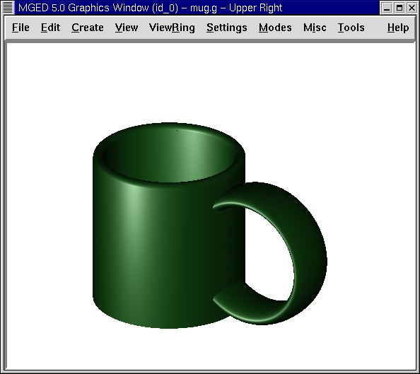

[[refining_mug_review]]
=== Review

In this chapter, you:

* Assigned material properties to the mug using the mater command.
* Refined the mug by smoothing the lip.
* Combined the shapes.

[[Lesson-12]]
== Creating the Mug Through the GUI

In this lesson, you will:

* Create the shapes of the mug through the GUI.
* Use new shapes to create the handle and rim of the mug.
* Combine the shapes.
* Make a region of the combinations.
* Check the data tree and make corrections.
* Assign material properties using the Combination Editor.

In the previous two lessons, you created a mug by entering commands at the Command Window prompt. Now, you will create the same type of mug using the GUI and different shapes.

Begin by opening a new database. Call it mug2.g.

[[mug_gui_create_body]]
=== Creating the Body of the Mug

Go to the Create menu and select rcc (right circular cylinder) under the Cones and Cylinders category. Enter the name for the rcc. Call it outside.s.

Go to the Edit menu, where you will be offered the following options:

[cols="4*"]
[%noheader]
|===
|`Set H Set H (Move V) Set A Set B Set c Set d Set A,B Set C,D Set A,B,C,D Rotate H Rotate AxB Move End H(rt) Move End H`
|`Rotate Translate Scale None of the Above`
|`Reject Accept Apply Reset`
|`Primitive Editor Combination Editor`
|===

[NOTE]
====
The first column includes shape-specific functions. The other columns are functions common to all shapes.

====

Select Set H. From a Front view, move your mouse cursor to the lower half of the screen and click the middle mouse button to reduce the scale of the cylinder's height. Next select Set A,B,C,D. Move your mouse cursor to the upper half of the screen and click the middle mouse button to increase the diameter of the cylinder. Accept your changes when your object appears similar to the one shown in the following figure.

[NOTE]
====
If at any time when you are editing through the GUI you don't like your changes, you can click on Reject to refuse the changes or Reset to return the shape to its original form. However, if you select Reject, you will have to re-enter the Primitive Edit state, as described in previous lessons.

====

Next, create an inside right circular cylinder and name it inside.s. Edit the cylinder the same way you edited the outside cylinder. Before you accept your changes, change View to Top and make sure your cylinders are in alignment. If the cylinders are out of alignment, use the SHIFT key and left mouse button to drag the inside cylinder into position. Return your View to Front and Accept your changes when the cylinders are lined up. Your cylinders should look like those in the following example:

image::../lessons/images/mged12_cyls_frontview.png[]

[NOTE]
====
Remember that when you scale a shape, the position of the mouse pointer in the Graphics Window will determine how large or small the change will be. The closer the mouse pointer is to the center horizontal line of the window, the smaller the change will be, and vice versa.

====

[[mug_gui_create_handle]]
=== Creating the Handle of the Mug

Previously, we made the handle of the mug using an elliptical torus. In this lesson, we make the handle by selecting a torus (which is a doughnut shape) from the menu of shapes. Name the torus handle.s. The Edit menu will now offer a different set of parameters than those of the right circular cylinders, as shown in the following list:

[cols="4*"]
[%noheader]
|===
|`Set Radius 1 Set Radius 2`
|`Rotate Translate Scale None of the Above`
|`Reject Accept Apply Reset`
|`Primitive Editor Combination Editor`
|===

In this instance, Set Radius 1 changes the distance from the center of the doughnut hole to the middle of the dough. Set Radius 2 changes the radius of the dough ring. With the same technique used in editing the rcc shapes, edit the size of the torus until it looks similar to the following examples:

[cols="2*"]
[%noheader]
|===
|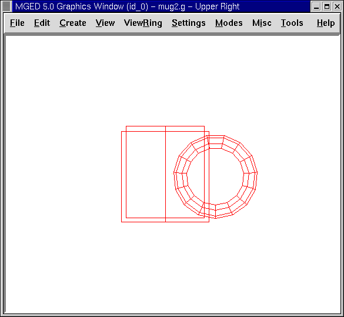
|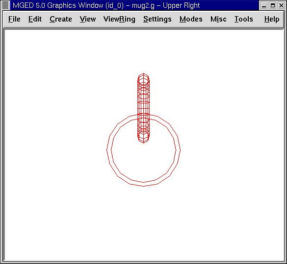
|Mug and Handle from a Front View
|Mug and Handle from a Top View
|===

Check your mug from the top to make sure the handle is aligned. Accept your changes when you are finished.

[[mug_gui_create_rim]]
=== Creating the Rim of the Mug

To make the rim of the mug, go to the Create, select tor, and name it rim.s. Select the Rotate command and type on the Command Line: *p 0 90 0[Enter]* to rotate the torus on its side (90'0 about the y axis). Then, Scale and edit the various parameters of the torus using the front and top views until the mug looks similar to the following example. Make sure you Accept your changes when you are finished.

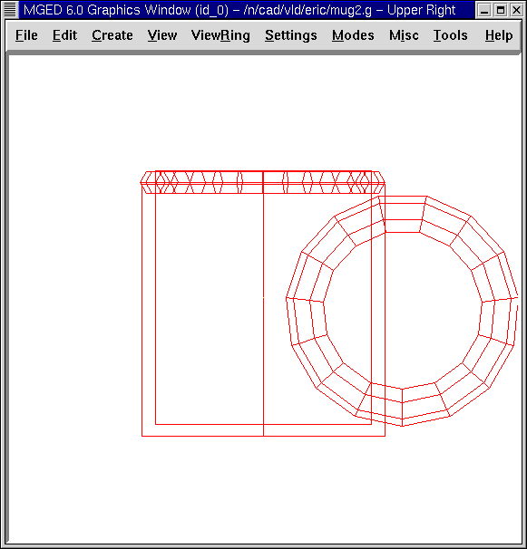

[[mug_gui_create_combinations]]
=== Creating Combinations of the Various Shapes

To combine the various shapes of the mug, type the following commands at the Command Window prompt: *comb mug.c u outside.s - inside.s[Enter]* *comb handle.c u handle.s - outside.s[Enter]* *comb mug.c u rim.s[Enter]* Note: Refer to the previous two lessons to recall how each of these commands works.

[[mug_gui_make_region]]
=== Making a Region of the Combinations

To make a region out of the combinations you just created, type at the Command Window prompt: *r mug.r u mug.c u handle.c[Enter]*

[[mug_gui_check_tree]]
=== Checking the Data Tree

Before continuing, it would be wise to check your data tree and make sure it agrees with the following tree:

....

   mug.r/R

   u mug.c/

   u outside.s

   - inside.s

   u rim.s

   u handle.c/

   u handle.s

   - outside.s
	
....

If your data tree doesn't look like this example, you will need to go back and figure out where you went wrong. If necessary, you can kill off a shape, combination, or region by typing at the Command Window prompt: *kill [name of shape, combination, or region][Enter]*

For example, in this lesson you may have created an extra shape, named rim2.s, which you no longer want. To kill this shape, you would type: *kill rim2.s[Enter]*

[[mug_gui_comb_edit_props]]
=== Assigning Material Properties Using the Combination Editor

Go to the Edit menu and select Combination Editor. Type mug.r in the Name entry box. Press ENTER. Type 0 148 0 in the Color entry box. Select a plastic shader. Check the Boolean Expression box to make sure it says:

....

   u mug.c

   u handle.c
	
....

When you are finished, click on Apply and then Dismiss. In the Command Window then, type at the prompt: *B mug.r[Enter]*

[[mug_gui_raytracing]]
=== Raytracing the Design

Go to the View option of the menu bar and select az35, el25. Go to File and then Raytrace. Select a white background color and Raytrace your design. Click on Overlay. When the raytracing is finished, it should look like the following example:

image::../lessons/images/mged12_mug_gui_finished_raytraced.png[]

[[mug_through_gui_review]]
=== Review

In this lesson, you:

* Created the shapes of the mug through the GUI.
* Used new shapes to create the handle and rim of the mug.
* Combined the shapes.
* Made a region of the combinations.
* Checked the data tree and made corrections.
* Assigned material properties using the Combination Editor.

[[lesson-13]]
== Placing Shapes in 3-D Space

In this lesson, you will:

* Create, edit, and place shapes in 3-D space.
* Create custom colors using the Combination Editor.
* Identify the attributes of the checker shader.
* Identify how RGB colors are created.

In previous lessons, you created and edited shapes. You also placed objects in three-dimensional space. This lesson will provide more advanced practice on creating and editing shapes and placing them in 3-D space.

The design you will make in this lesson is a simple candle in a candle holder sitting on a table (as shown in the following figure). In the next lesson, you will add decorations and lighting to make the design more realistic.

image::../lessons/images/mged13_candle_design.png[]

Begin by creating a new database called candle.g. Title your database Candle Tutorial.

[[candle_create_tabletop]]
=== Creating the Tabletop

Create an arb8 from the GUI. Name the shape arb8.s. Go to View and select Front.

Go to the Edit option of the menu bar. The arb8 needs to be made larger, so, under the Edit menu, select Scale. Put the mouse pointer in the upper half of the screen to make the arb8 larger and click the middle mouse button until the sides of the arb8 touch each side of the screen. Use the SHIFT key and left mouse button to drag the arb into position, if necessary.

Under the Edit menu, select Move Faces and then Move Face 4378. Place the mouse pointer in the lower half of the screen and click the middle mouse button until the arb8 is about the thickness of a tabletop. Go back to the Edit menu and Accept the changes, and then use the SHIFT and any mouse key to position the tabletop so that it appears similar to the following:

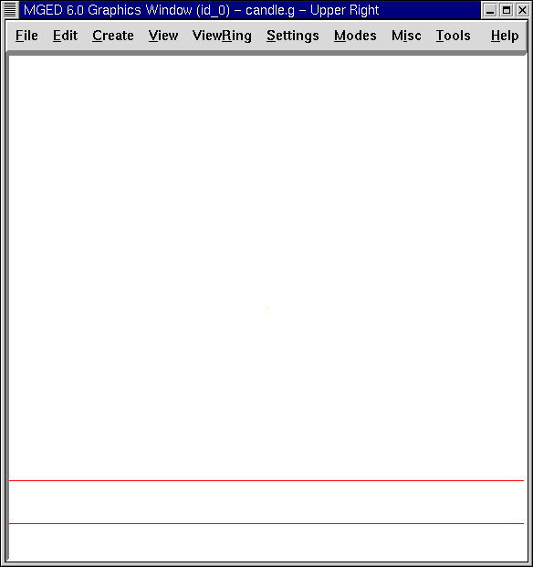

Make a region of the tabletop by typing at the Command Window prompt: *r table1.r u arb8.s[Enter]*

[[candle_create_base]]
=== Creating the Candle Base

Create an eto and name it eto1.s. To create the bottom of the candle base, you will need to flip the eto 180'0. Type at the Command Window prompt: *rot 0 180 0[Enter]* This tells _MGED_ to rotate the shape 180'0 along the y axis. Next, select Scale and make the eto a little smaller than its default size. Place the eto on the tabletop by using the SHIFT key and left mouse button to drag the base into position.

View your design from different angles to make sure the eto sits flush on the center of the tabletop. Select Accept when you are satisfied with its size and placement. Your base should be similar to the one shown as follows:

image::../lessons/images/mged13_candle_tabletop_eto1_wireframe_front.png[]

The next step in creating a candle base is to make a right circular cylinder (rcc). Name the shape rcc1.s.

Go to Edit. In addition to the standard commands, you will be presented with a menu of thirteen shape-specific ways to edit this shape.

[cols="2*"]
[%noheader]
|===
|`Set H Set H (Move V) Set A Set B Set c Set d`
|`Set A,B Set C,D Set A,B,C,D Rotate H Rotate AxB Move End H(rt) Move End H`
|===

Scale the shape until it is slightly larger in diameter than the top of the eto1.s (you can check this by switching to a top view). Go back to Edit and select Set H. Reduce the height of the shape until the rcc is about two times the height of eto1.s. Position the cylinder on the candle-holder base. Check the placement of the rcc from the top, left, and front to ensure that it is centered in the eto. Make sure the bottom of the rcc is not quite touching the tabletop. Accept your changes. When done, your design should look like the following:

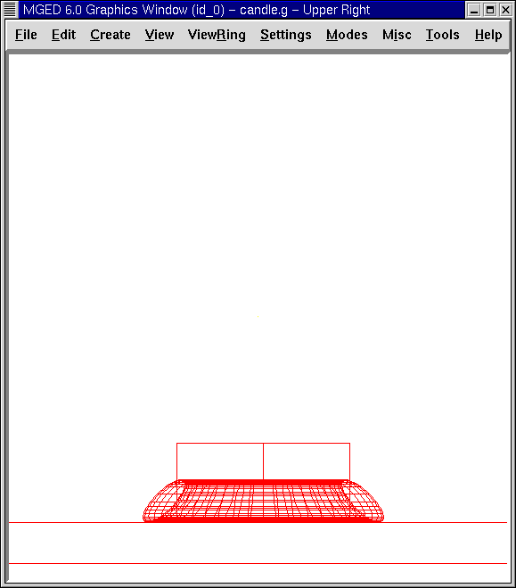

The last step in making the candle base is to create another eto. Name it eto2.s. Edit this shape as you did the previous eto and place it on top of the rcc, as shown in the following figure. Accept your changes when finished. Your candle base should now look like this:

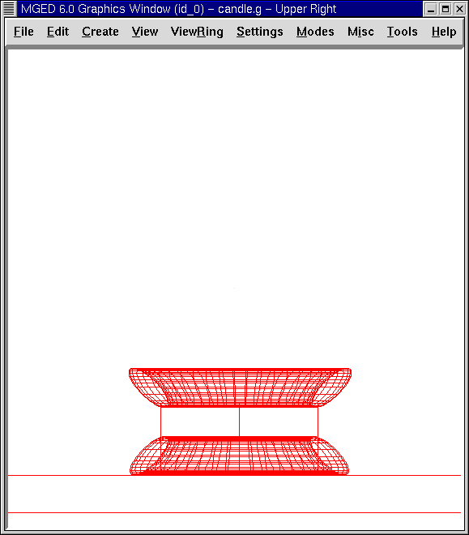

Make a region of the three shapes of the base. Name it base1.r. Your Boolean expression should read: *r base1.r u eto1.s u rcc1.s u eto2.s* Note that we could have written it *r base1.r u eto1.s u eto2.s u rcc1.s* but the first expression is preferred to be consistent with the order of a later example. In a moment, we will want to remove some material that eto2.s gives us. By placing eto2.s last in the list, we can perform this removal easily.

[[candle_create_candle]]
=== Creating the Candle

Create an rcc and name it rcc2.s. Edit the shape as you did the previous rcc. When you are done, it should look similar to the one in the following illustration. (Note: After you have accepted the changes, you can get all of your tabletop and candle in the Graphics Window by using the SHIFT key and left mouse button to move your view of the design.)

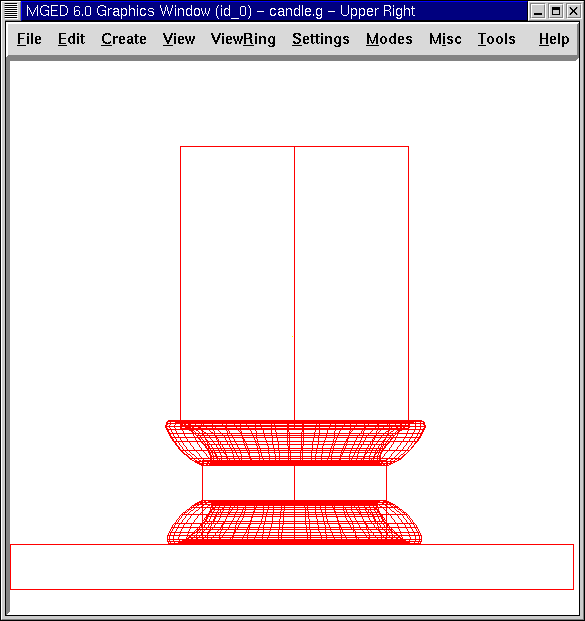

Make a region of the candle. Your Boolean statement should read: *r candle1.r u rcc2.s* Now we create a cylindrical cutout in the base for the candle to sit in. To do this we can use the shape of the candle, as follows: *r base1.r - rcc2.s* Earlier we had mentioned that we would want to remove some material that we got from eto2.s. Now we have done it.

[[candle_create_flame]]
=== Creating the Candle Flame

Create a particle (part) and name it part1.s. Edit and position the shape until your design looks like the following one:

image::../lessons/images/mged13_candle_complete_front.png[]

Make a region of the flame by typing at the Command Window prompt: *r flame1.r u part1.s[Enter]*

[[candle_create_combination]]
=== Making a Combination of the Base, Candle, and Flame

To make a combination of the parts of the candle, type at the Command Window prompt: *comb candle1.c u base1.r u candle1.r u flame1.r[Enter]*

[[candle_check_data_tree]]
=== Checking the Data Tree

Now that you have made a number of regions and a combination, it would be a good time to check your data tree and make sure it agrees with the following tree. If you find that you have made a mistake in any of the parts of the tree, you can change them in the Boolean Expression box of the Combination Editor (refer to Lesson 5). At the Command Line prompt, type: *tree candle1.c[Enter]* Your Boolean expression should read:

....

   candle1.c/

   u base1.r/R

     u eto1.s

     u rcc1.s

     u eto2.s

     - rcc2.s

   u candle1.r/R

     u rcc2.s

   u flame1.r/R

     u part1.s
	
....

[[candle_assign_mater_prop]]
=== Assigning Material Properties to the Elements of the Design

To assign material properties to your design, go to the Edit menu and select the Combination Editor. Assign the following material properties to each of the elements:

[cols="4*"]
|===
|Element
|Shader
|Color(s)
|Other

|Tabletop
|Checker
|Red (255 0 0); White (255 255 255)
|Scale (10)
|Candle Base
|Plastic
|Medium Gray (128 130 144)
|
|Candle
|Plastic
|Light Blue (0 166 255)
|
|Flame
|Plastic
|Light Yellow (255 255 190)
|
|===

Notice that the checker shader for the tabletop includes two color values and a scale value. Type the values for red, white, and a scale of 10 in the boxes, as follows:

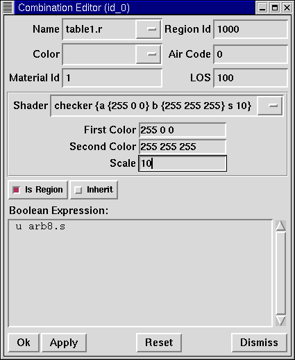

For the rest of the elements of the design, use the Color Tool to make the colors shown or simply type them in the Color text box, remembering to leave a space between each set of numbers.

[NOTE]
====
As discussed previously, a color is made up of three numbers, ranging from 0 to 255. The first number represents the amount of red, the second represents the amount of green, and the third represents the amount of blue used to make the color. A color of 0 0 0 is black, and 255 255 255 is white. This method of creating colors is different from mixing pigment colors used in painting because you are dealing with light. While it may seem strange at first, most _MGED_ users quickly become adept at creating RGB colors.

====

[[candle_raytrace]]
=== Raytracing Your Design

Before raytracing, change the View to az35, el25 to give a better view of the completed design and then Blast the old design by typing at the Command Window prompt: *B table1.r candle1.c[Enter]* This command tells the _MGED_ program to:

[cols="3*"]
[%noheader]
|===
|B
|table1.r
|candle1.c
|Clear the Graphics Window
|Draw the region named table1.r
|Draw the combination named candle1.c
|===

To provide the most light on your design, use a white background color. Your raytraced candle should look similar to the following:

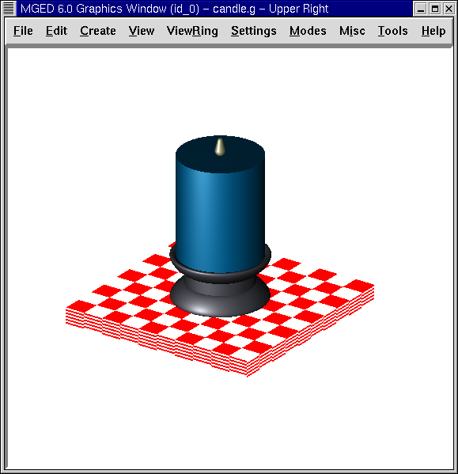

[[placing_shapes_in_3d_review]]
=== Review

In this lesson, you:

* Created, edited, and placed shapes in 3-D space.
* Created custom colors using the Combination Editor.
* Identified the attributes of the checker shader.
* Identified how RGB colors are created.

[[lesson-14]]
== Gaining More Practice Placing Shapes in Space

In this lesson, you will:

* Create copies of a shape using the Primitive Editor.
* Draw a grid to help position objects.
* Check the data tree and make corrections (if needed).
* Assign material properties using the Combination Editor.

In previous lessons, we created and edited shapes and placed objects in 3-D space. This lesson provides more advanced practice in these areas using the candle design you created in the last lesson.

Open the candle.g database if it isn't already open and draw candle1.c.

[[candle_base_1st_sphere]]
=== Making the First Sphere

Using the GUI, create a sphere named sph1.s. Go to the View menu and select Top view. Go to the Edit menu, select Scale, and size the sphere until it is proportionally about the same size as the one in the following illustration:

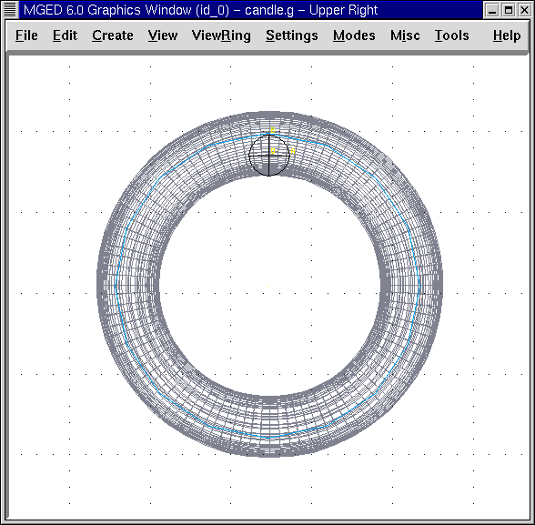

[[draw_grid_feature]]
=== Using the Draw Grid Feature

Drag the sphere into position on the rcc, as shown in the previous illustration. To make this task a little easier, you can go to the Modes menu and select Draw Grid. This will create a grid overlay in the Graphics Window, which can help you position your spheres on the candle base.

[[multipane_feature]]
=== Using the Multipane Feature

As discussed earlier, another feature that is available to help you position each sphere is the Multipane option under the Modes menu. This will allow you to see multiple views of the design you are creating.

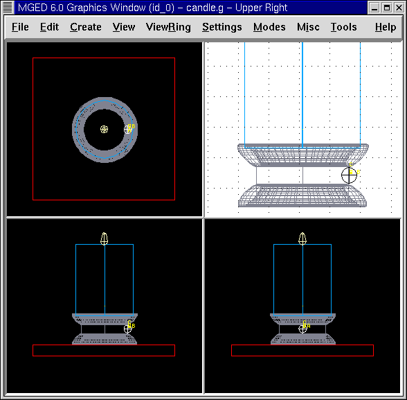

As you move a shape, the change in position will be reflected in each pane. The multipanes help you visualize where the shape is in 3-D space. In the default mode, the top left pane shows the top view, the top right pane shows the current view, the bottom left pane shows the front view, and the bottom right pane shows the left view. To turn off either the grid or the multipane functions, go back to Modes and select the feature you want to disable.

[[copies_of_shapes]]
=== Creating Copies of a Shape

To make more jewels for the base, you could use the copy command on the Command Line (cp sph1.s sph2.s), but another way to do this is to go to the Edit menu and select Primitive Editor. Type sph1.s in the text box to the right of Name. Click on Reset and then change the name to sph2.s and click Apply. Continue doing this until you've made eight jewels. Because each of the new spheres is an exact copy of the first sphere, you won't be able to see them until you select and then move them.

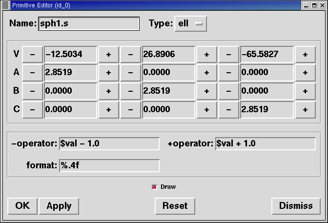

To position your new spheres, go to Primitive Selection. A submenu of shapes you have created will drop down. Use the scrollbar to the right of the list of shapes to access the spheres you have created, as shown in the following illustration.

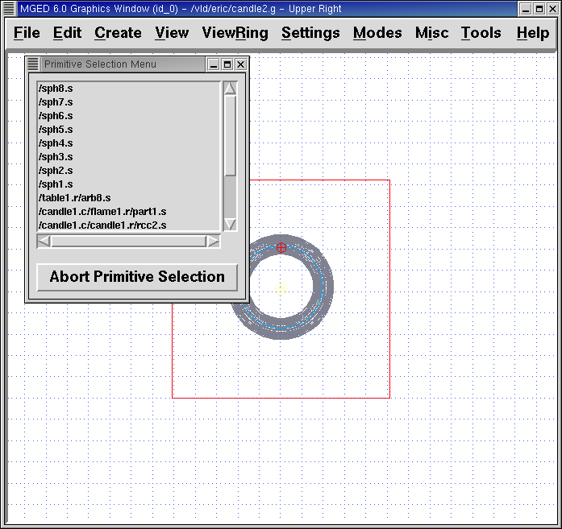

Click on sph2.s and drag it into position. Once you have positioned the eight spheres around the rcc, your design should look similar to the following ones when viewed from the top and front.

[cols="2*"]
[%noheader]
|===
|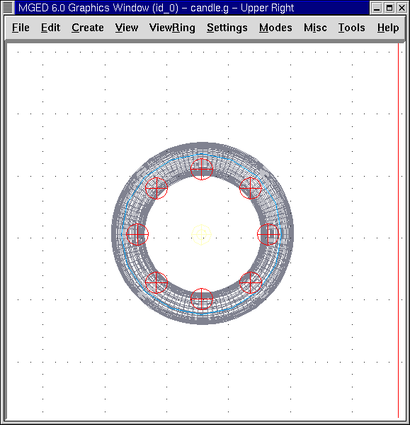
|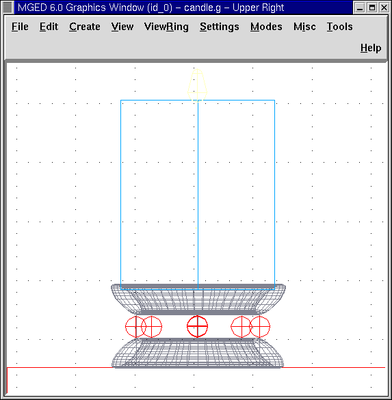
|Candle from Top View
|Candle from Front View
|===

Notice from the front view that there appears to only be five spheres around the base of the candle, but there are eight spheres when you view the design from the top. That is because you are viewing 3-D space on a 2-D screen and the spheres in the back are behind the ones in the front. If you change the view to an az35, el25 view, all of the spheres will appear, as shown in the following figure. This is one reason why it is important to continually check your design from multiple views. A mistake in placement that doesn't appear from one view may be very noticeable from another view.

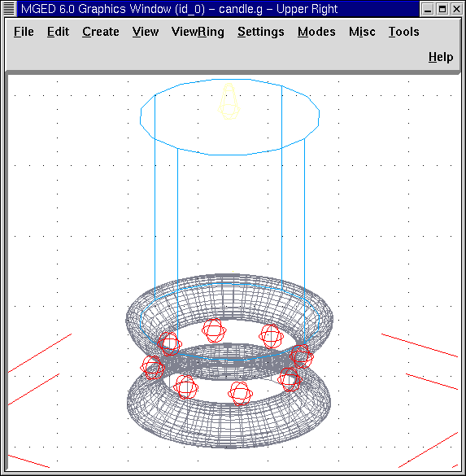

[[practice_make_regions_spheres]]
=== Making Regions of the Spheres

Now that all your spheres are made and in place, it is time to make a region of each sphere. To do this, type the following in the Command Window: *r sph1.r u sph1.s[Enter]* *r sph2.r u sph2.s[Enter]* *r sph3.r u sph3.s[Enter]* *r sph4.r u sph4.s[Enter]* *r sph5.r u sph5.s[Enter]* *r sph6.r u sph6.s[Enter]* *r sph7.r u sph7.s[Enter]* *r sph8.r u sph8.s[Enter]*

[NOTE]
====
There are three easier ways to make all of the regions. The first involves typing the first command: *r sph1.r u sph1.s[Enter]* and then using the up arrow to recall this command. Now use the left arrow to move backward in the Command Line to replace both occurrences of the number "1" with "2" and press ENTER. Repeat this for each of the numbers 3 through 8.

The second approach is based upon the fact that the Command Line interpreter of _MGED_ uses the Tcl/Tk language. This gives us access to some convenient loop commands. The following will make all of the regions for us in a single command: *foreach i { 1 2 3 4 5 6 7 8 } { [Enter]* *r sph$i.r u sph$i.s [Enter]* *}[Enter]*

This is much easier and faster than either of the previous methods. However, if there were many more spheres (say 1000 or more), then it might be easier to use a third approach, which employs a different loop type:

....

    for {set i 1} {i `<= 1000} {incr i} {[Enter]

      r sph$i.r u sph$i.s [Enter]

    }
	  
....

====

Next, go to Edit and then Combination Editor. Select sph1.r from the Select From All choice in the pull-down menu to the right of the Name entry box. Assign properties of plastic and the color red and then press Apply. We then can go back to the Select From All menu listing and repeat this process for the other seven spheres. Alternatively, we could use Apply after selecting the appropriate material properties and then type in the next sphere's name; however, this method requires the user to remember to update the Boolean Expression box (e.g., change u sph1.s to u sph2.s) so that the Booleans for one shape are not applied to another shape.

[NOTE]
====
Once again, we are performing the same operation multiple times. This is another good opportunity to use a loop. *foreach i { 1 2 3 4 5 6 7 8 } {[Enter]* *mater sph$i.r "plastic" 255 0 0 0[Enter]* *}[Enter]*

In general, the graphical interface is good for doing one thing at a time or doing highly visual operations. Repetitive operations are best performed using a Command Line interface.

====

[[candle_base_spheres_combine]]
=== Combining the Spheres with the Candle Base

We are now faced with an important decision. At the moment, the jewels overlap a portion of the candle base (specifically, the rcc1.s portion). Because two objects cannot occupy the same space, we must decide how to resolve this situation. There are two choices:

* We can have perfectly round jewels with dents in the side of the candle base where the jewels are mounted.
* We can have a perfectly round base with a cylindrical bite taken out of the back of each jewel.

For this lesson, we will use the first choice.

Now we are faced with a second decision: how to achieve this result. The key is that the space the jewels occupy must be subtracted from the correct part (rcc1.s) of the base.

On the Command Line, create rcc1.c by typing: *comb rcc1.c u rcc1.s - sph1.r - sph2.r - sph3.r - sph4.r - sph5.r - sph6.r - sph7.r - sph8.r[Enter]* Next, bring up the Combination Editor and select base1.r. Change the union of rcc1.s in the Boolean Expression window to a union of rcc1.c, and click OK. The tree of base1.r should now look like:

....

   u base1.r/R

     u eto1.s

     u rcc1.c

       u rcc1.s

       - sph1.r/R

         u sph1.s

       - sph2.r/R

         u sph2.s

       - sph3.r/R

         u sph3.s

       - sph4.r/R

         u sph4.s

       - sph5.r/R

         u sph5.s

       - sph6.r/R

         u sph6.s

       - sph7.r/R

         u sph7.s

       - sph8.r/R

         u sph8.s

     u eto2.s

     - rcc2.s
	
....

[NOTE]
====
Note that we could have achieved the same results on the Command Line by using the rm (remove) command to remove rcc1.s from base1.r and then adding rcc1.c: *rm base1.r rcc1.s[Enter]* *r base1.r u rcc1.c[Enter]*

This would have resulted in a very similar tree as above:

....

    u base1.r/R

      u eto1.s

      u eto2.s

      - rcc2.s

      u rcc1.c

        u rcc1.s

        - sph1.r/R

          u sph1.s

        - sph2.r/R

          u sph2.s

        - sph3.r/R

          u sph3.s

        - sph4.r/R

          u sph4.s

        - sph5.r/R

          u sph5.s

        - sph6.r/R

          u sph6.s

        - sph7.r/R

          u sph7.s

        - sph8.r/R

          u sph8.s
	  
....

Finally, we could have avoided making an intermediate object in the database by moving rcc1.s to the end of the Boolean equation for base1.r and then subtracting each of the jewels from base1.r (hence, removing material from rcc1.s). This would have resulted in:

....

    u base1.r/R

      u eto1.s

      u eto2.s

      - rcc2.s

      u rcc1.s

      - sph1.r/R

        u sph1.s

      - sph2.r/R

        u sph2.s

      - sph3.r/R

        u sph3.s

      - sph4.r/R

        u sph4.s

      - sph5.r/R

        u sph5.s

      - sph6.r/R

        u sph6.s

      - sph7.r/R

        u sph7.s

      - sph8.r/R

        u sph8.s
	  
....

It would be good practice to consider the relative merits of each of the approaches discussed.

====

Now we need to add the jewels to the whole of candle1.c: *comb candle1.c u sph1.r u sph2.r u sph3.r u sph4.r u sph5.r u sph6.r u sph7.r u sph8.r[Enter]*

There are just a couple of things left to do before you raytrace your design. If you have enabled Multipanes or Draw Grid, go back to the Modes menu and disable them. Then, clear your screen and draw your new design by typing in the Command Window: *B candle1.c table1.r* Your new design should appear in the Graphics Window. Open the Raytrace Control Panel and select a pale blue color (200 236 242) by typing the three values in the Background Color entry box. When you raytrace your design, it should look similar to the following one:

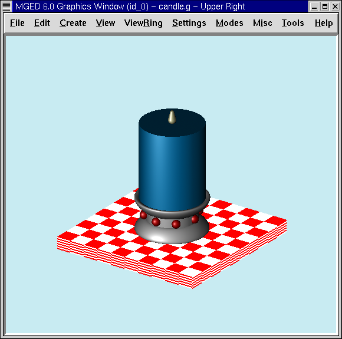

[[placing_shapes_in_3d_2_review]]
=== Review

In this lesson, you:

* Created copies of a shape using the Primitive Editor.
* Drew a grid to help position objects.
* Checked the data tree and made corrections (if needed).
* Assigned material properties using the Combination Editor.

[[lesson-15]]
== Creating a Toy Truck

In this lesson, you will:

* Create a toy truck from three shapes.
* Make copies of shapes using the Primitive Editor.
* Make combinations and regions of a more complex object.
* Check the data tree for accuracy.
* List contents of the database.
* Assign material properties using the Combination Editor.
* Identify the difference between OK, Accept, Apply, Reset, Cancel, and Dismiss.
* Identify the on-screen help option.
* Identify the stacker option.
* Experiment with the attributes of the camo shader.

In previous lessons, you created and edited shapes to produce simple objects. This lesson focuses on creating a slightly more complex object, a toy truck, from the Command Window. Your completed truck should look similar to the following truck:

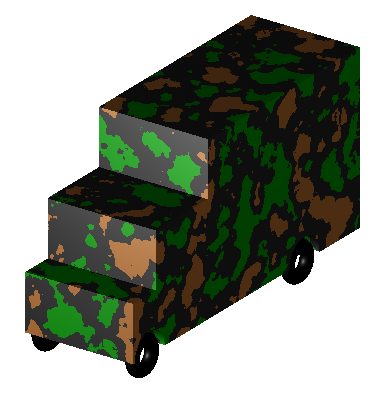

Begin by creating a new database called truck.g.

[[truck_cab_in_cmd]]
=== Creating an rpp for the Cab of the Truck Using the In Command

To make the cab of the truck, you will create a right parallel piped using the in (insert) command. At the Command Window prompt, type: *in cab1.s rpp[Enter]* _MGED_ will ask you to enter values for XMIN, XMAX, YMIN, YMAX, ZMIN, and ZMAX. Type at the prompt: *0 1 0 1 0 1[Enter]* This will tell _MGED_ to:

[cols="6*"]
[%noheader]
|===
|0
|1
|0
|1
|0
|1
|Make the value of the rpp's XMIN 0
|Make the value of the rpp's XMAX 1
|Make the value of the rpp's YMIN 0
|Make the value of the rpp's YMAX 1
|Make the value of the rpp's ZMIN 0
|Make the value of the rpp's ZMAX 1
|===

You could also have used the streamlined version of: *in cab1.s rpp 0 1 0 1 0 1[Enter]* A cube shape should appear in the Graphics Window, as follows:

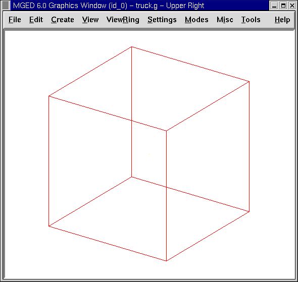

[[truck_hood_in_cmd]]
=== Using the Inside Command to Create an rpp for the Hood of the Cab

To make the hood of the cab, you will need to make another rpp shape, this time using the inside command. This special command was originally created to hollow out objects such as gas tanks and boxes; however, it can be used to create any new shape that has some relationship to a pre-existing shape. In this lesson, it is used to cut away material above the hood and in front of the cab.

If you are using _BRL-CAD_ version 6.0 or later, at the Command Window prompt, type: *inside cab1.s caboff1.s -.1 .7 -.1 -.1 .5 -.1[Enter]* The inside command tells _MGED_ to:

[cols="9*"]
[%noheader]
|===
|inside
|cab1.s
|caboff1.s
|-.1
|.7
|-.1
|-.1
|.5
|-.1
|Inside the shape
|named cab1.s,
|create rpp called caboff1.s
|Make face 1234 (front) -.1 units thick
|Make face 5678 (rear) .7 units thick
|Make face 1485 (right) -.1 units thick
|Make face 2376 (left) -.1 units thick
|Make face 1265 (bottom) .5 units thick
|Make face 3487 (top) -.1 units thick
|===

[NOTE]
====
In this example, each negative thickness number indicates that caboff1.s will protrude through the corresponding face of cab1.s. Running the l (list) command, you can see the vertices for the box it creates:

....

caboff1.s:  ARB8
	  1 (1.1, -0.1, 0.5)
	  2 (1.1, 1.1, 0.5)
	  3 (1.1, 1.1, 1.1)
	  4 (1.1, -0.1, 1.1)
	  5 (0.7, -0.1, 0.5)
	  6 (0.7, 1.1, 0.5)
	  7 (0.7, 1.1, 1.1)
	  8 (0.7, -0.1, 1.1)
	  
....

====

[NOTE]
====
Note that in older versions of _BRL-CAD_, the faces of an rpp were numbered in a different order. So, if your results don't match, kill caboff1.s and run this command instead: *inside cab1.s caboff1.s .5 -.1 .7 -.1 -.1 -.1[Enter]*

====

When in Multipane mode, the design should resemble the following illustration.

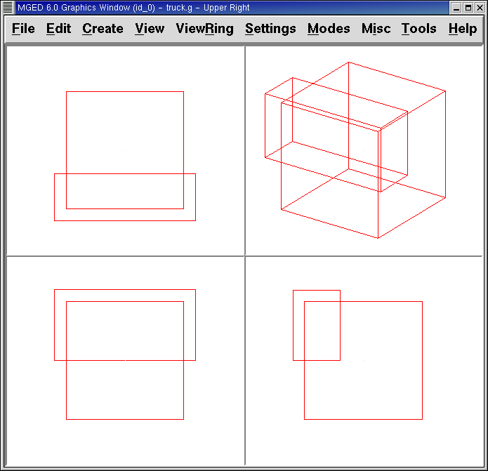

[[truck_cab_wheel_well]]
=== Using an rcc to Create a Wheel Well in the Cab

Make a cylinder (rcc) to use for cutting away a space for the first wheel of the cab. At the Command Window prompt, type: *make well1.s rcc[Enter]* Go to the Edit menu and click on Primitive Selection, then well1.s. After selecting a Left view, go back to Edit and select Scale. Reduce the size of the rcc until its diameter is about the right size for a wheel well. Go back to Edit and select Rotate. As discussed previously, one way to easily rotate the rcc is by using the CTRL key and the left mouse button to drag the top lip of the rcc down (in a straight line) until the A and C edit labels overlap. However, because we know we want to flip the object exactly 90'0 along the x axis, a better choice is to use the Command Line and type: *p 90 0 0[Enter]* After doing so, you may still have to use the Set H and Scale editing options to resize and the SHIFT key and left mouse button to position your wheel well. When satisfied, select Accept on the Edit menu. Your design should look similar to the following in Multipane mode:

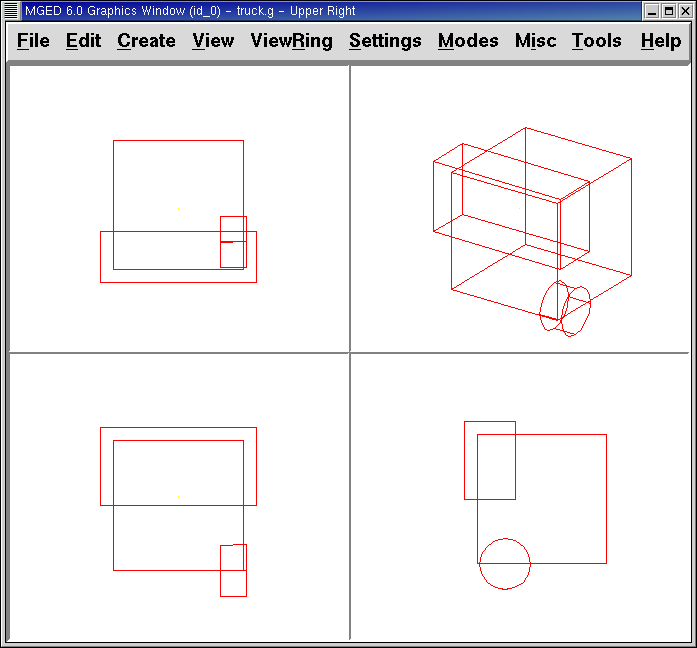

[[ok_accept_apply_reset_cancel_dismiss]]
=== The Difference Between OK, Accept, Apply, Reset, Cancel, and Dismiss

The GUI environment of _MGED_ offers users several options for applying, accepting, or rejecting changes made through buttons at the bottom of dialog pop-up windows. To use any of these options, just place the mouse cursor over the desired button and click the left mouse button.

Selecting the Accept or OK button will tell _MGED_ to record the changes you have made to a shape, region, or combination. _MGED_ uses the Accept and OK buttons interchangeably. When you select Accept or OK, the window you are using will automatically close.

The Apply button tells _MGED_ to apply a change you have made and wait for further instructions. The window does not automatically close. This enables you to make changes to several things without having to reopen the window for each change.

The Reset button tells _MGED_ to reset values you have changed in a dialog box to the last values you applied or accepted. The Reset button does not close the dialog box. The Cancel or Dismiss buttons discard any changes made in the dialog box and leave values unchanged from their last stored settings. These two buttons close the dialog box.

[[truck_wheel_well_prim_edit_cpy]]
=== Using the Primitive Editor to Make a Copy of the Wheel Well

To make a copy of your wheel well, go to the Edit menu and select Primitive Editor, which will contain information about the last shape edited through the dialog box (or myPrimitive if nothing has been edited). Erase the old shape's name in the Name entry box. Type in well1.s and press Reset (or press Enter while the cursor is still in the Name entry box). The parameter values of the old shape will be replaced by those of the new shape. The Primitive Editor will change and look something like the following example:

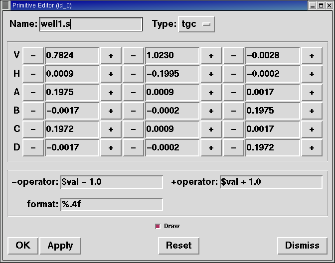

Go back to the Name text box and change the 1 to a 2 and click on OK. Change to Front under the View menu. Go to Edit/Primitive Selection and select well2.s. Use the SHIFT and left mouse button to drag the new wheel well into position, as shown in the following illustration. Check your alignment in Multipane mode and then select Accept when you are finished.

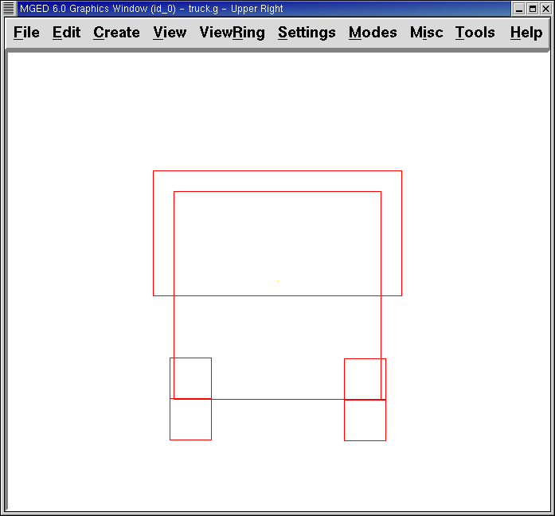

[[truck_cab_shape_comb]]
=== Making a Combination of the Cab Shapes

It is now time to make a combination of the various cab shapes. *comb cab1.c u cab1.s - caboff1.s - well1.s - well2.s[Enter]* This command tells _MGED_ to:

[cols="10*"]
[%noheader]
|===
|comb
|cab1.c
|u
|cab1.s
|-
|caboff1.s
|-
|well1.s
|-
|well2.s
|Make a combination
|Name it cab1.c
|Make a union
|of the shape cab1.s
|minus
|the shape caboff1.s
|minus
|the shape well1.s
|minus
|the shape well2.s
|===

Before you go any further, you should check your data tree by typing tree cab1.c. The data tree should say:

....

   cab1.c/

   u cab1.s

   - caboff1.s

   - well1.s

   - well2.s
	
....

If you type ls (list) at the Command Window prompt, you should find that your database is composed of the combination cab1.c and the shapes cab1.s, caboff1.s, well1.s, and well2.s. You will find as you make more complex objects that you will periodically refer to the list of the database to ensure it is composed of the elements you want.

[[truck_body_in_cmd]]
=== Creating an rpp for the Body of the Truck Using the In Command

To make the body of the truck, type at the Command Window prompt: *in body1.s rpp 0 2 0 1 0 1.5[Enter]* By now, you should know what this command tells _MGED_ to do. If you have forgotten, refer back to making the cab of the truck.

Edit the body of the truck so that its front face slightly overlaps the cab's back face. Check different views to make sure the body lines up correctly with the cab. Accept your changes when you are done, and then Blast your design. Your truck should now look like the following:

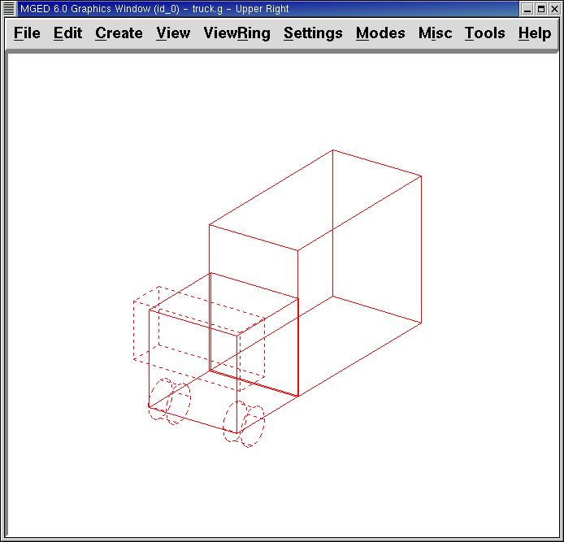

[[prim_ed_wheel_wells]]
=== Using the Primitive Editor to Make Two More Wheel Wells

To make two wheel wells for the body of the truck, repeat the steps used in making the second wheel well. Name your new shapes well3.s and well4.s. Using multiple views, move the new shapes into position so that your truck now looks similar to the following:

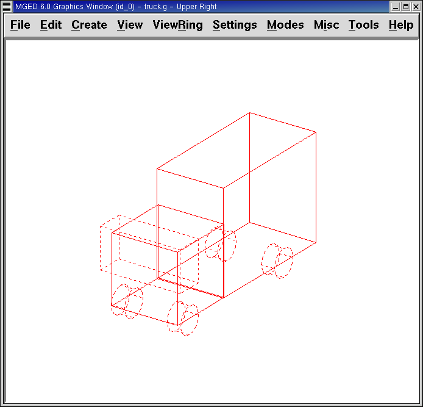

[[truck_body_wheel_wells_comb]]
=== Making a Combination of the Truck Body and Wheel Wells

Make a combination of the truck body and the two new wheel wells. Name it body1.c. The tree for body1.c should say:

....

   body1.c/

   u body1.s

   - well3.s

   - well4.s
	
....

[[truck_cab_body_region]]
=== Making a Region of the Cab and Body

Before adding wheels to the truck, you need to make a region of the cab and body. At the Command Window prompt, type: *r truck1.r u cab1.c u body1.c[Enter]*

[[truck_wheels]]
=== Making Wheels for the Truck

Perhaps the best shape for making wheels is the torus. You can create a shape through the Command Window that has the correct size and placement for your design without further editing. However, this lesson is designed to give you practice rotating and translating shapes.

To make the first wheel, type at the Command Window prompt: *in wheel1.s tor 0 0 0 .5774 .5774 .5774 .18 .08[Enter]* This command tells _MGED_ to:

[cols="7*"]
[%noheader]
|===
|in
|wheel1.s
|tor
|0 0 0
|.5774 .5774 .5774
|.18
|.08
|Create a shape
|Name it wheel1.s
|Make the shape a torus
|Make the values of the vertex 0 0 0
|Make the values for x, y, and z of the normal vector .5774 .5774 .5774
|Make the value of the outer radius .18
|Make the value of radius 2 (the tire thickness) .08
|===

Change View to Left and then Edit the position of the wheel. To correctly align the wheel with the truck, you will have to Rotate the tire using the CTRL key and any mouse button. Scale and Translate the wheel into position as appropriate and check your alignment from several different views. Accept your changes when finished.

Using the Primitive Editor, make the second, third, and fourth wheels. Move each of these wheels into position until your truck looks like the following:

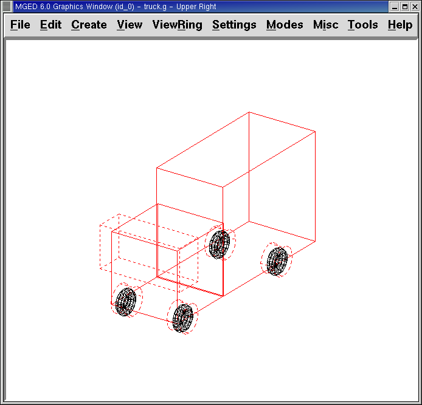

[[truck_wheels_region]]
=== Making a Region of the Wheels

Make a region of the four wheels. When you are finished, your data tree for wheel1.r should say:

....

   wheel1.r/R

   u wheel1.s

   u wheel2.s

   u wheel3.s

   u wheel4.s
	
....

[[truck_regions_mater_props]]
=== Assigning Material Properties to the Truck Regions

Your truck is composed of two regions: truck1.r and wheel1.r. Use the Combination Editor and select truck1.r.

In the Combination Editor, the camouflage (camo) shader creates a pseudo-random tricolor camouflage pattern on the object using a fractal noise pattern. The shader offers lots of attributes from which to choose. For now, select a Background Color of black (0 0 0) and make Color #1 green (0 134 0), and Color #2 rust brown (164 96 38). To make the pattern design proportional to the truck, select a Noise Size of .25 and then Apply the selections. The Combination Editor window for the camo shader should look like this:

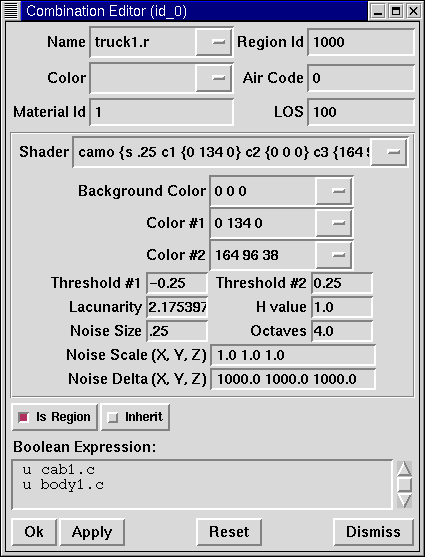

Apply a black color and plastic shader to the wheels (wheel1.r) and click on OK. Then raytrace your design.

[[on_screen_help]]
=== Using the On-Screen Help Option

You have probably noticed that many of the _MGED_ menus offer a wide variety of options from which to choose. With so many choices available, it is easy to forget what a particular selection does. To help users quickly access basic information about the various _MGED_ options, the program offers a context-sensitive, on-screen help feature.

The on-screen help can be accessed from any menu or pop-up window by placing the mouse cursor over the name of any option in the menu or window and clicking the right mouse button. The only place this feature doesn't work is in the geometry portion of the Graphics Window, where the design is drawn.

[[stacker_shading]]
=== The Stacker Option

In previous lessons, you applied color and a shader to an object to make it appear realistic. Sometimes, however, you will need to apply two or three shaders to an object to get the design you want.

_MGED_ offers three categories of shaders: paint, plastic, and light. Any combination of these three types of shaders can be applied to the same object using the stacker option of the shader menu.

There are three plastic shaders: glass, mirror, and plastic. A plastic shader is used to give the perception of space. It does this by making the object's surface shiny so that it reflects light. A plastic shader is normally applied last in the stacker process.

The paint shaders are used to apply pigment and texture to the surface of an object. Color is pigment, and texture is the three-dimensional quality of the surface material (such as stucco paint).

Pigment shaders include camo, texture (color), texture (black/white), fake star, cloud, checker, test map, and projection. Texture shaders include bump map, fbm bump, and tur bump. Paint shaders are normally applied first in the stacking process and are used in combination with the plastic shader.

The light shader is used to produce illumination in the scene. This helps produce realism in the final image. The light shader is technically complex and is not discussed in this tutorial.

The camo shader involves applying pigments, in a random pattern, to the surface of an object. The camo shader doesn't indicate the three-dimensional nature of an object. If you want your design to show depth, you will need to stack the camo shader and the plastic shader.

[[using_stacker_shading]]
=== Using the Stacker Option

To use the stacker option, open the Combination Editor and select truck1.r. Click on the button to the right of the Shader entry box and then select stack from the drop-down menu. A button with the words Add Shader will appear under the text box. Click on the button and then select camouflage. Set the Background Color to black (0 0 0), Color #1 to green (0 134 0), and Color #2 to rust brown (164 96 38). Make the Noise Size .25. Click on Add Shader once again and select plastic.

At this point, your Combination Editor window may have gone off the bottom of the screen. If this happens, reduce the size of the window as much as you can and then drag it up to the top of the screen. The buttons at the bottom of the box should now appear, and you can Apply your selections.

[CAUTION]
====
When using the stacker option, you need to keep track of the number of characters and spaces in the shader text box. _MGED_ versions prior to release 6.0 will only recognize 64 characters/spaces, so be careful stacking shaders with complex attributes.

====

[[truck_combine_regions]]
=== Making a Combination of the Truck Regions

To make a combination of the two truck regions, type at the Command Window prompt: *comb truck1.c u truck1.r u wheel1.r[Enter]* *B truck1.c[Enter]* Your data tree for truck1.c should read:

....

   truck1.c/

   u truck1.r/R

   u cab1.c/

   u cab1.s

   - caboff1.s

   - well1.s

   - well2.s

   u body1.c

   u body1.s

   - well3.s

   - well4.s

   u wheel1.r/R

   u wheel1.s

   u wheel2.s

   u wheel3.s

   u wheel4.s
	
....

[[truck_raytracing]]
=== Raytracing the Truck

The last step in creating your truck is to raytrace your design. When the raytracer has finished, notice that the top and one side of the truck are very dark. This is because there is very little light falling on them. Because we have not specified any light sources for our scene, _MGED_ provides us with a set of default lights. These defaults consist of a dim light at the location of the viewer and a brighter one located to the left and below the viewer. Since the primary light is not really shining on one side of the truck, it is dark.

There is a special adjustment we can make to improve the overall brightness of the scene. We can adjust the amount of ambient light, which is light that does not come from a particular light source but is a measure of the light generally present in the scene. To adjust the amount of ambient light, click on the Advanced Settings button in the Raytrace Control Panel. Next to Other Options, type -A .9 and click Dismiss. Now when you raytrace, you will get a much lighter image.

[cols="2*"]
[%noheader]
|===
|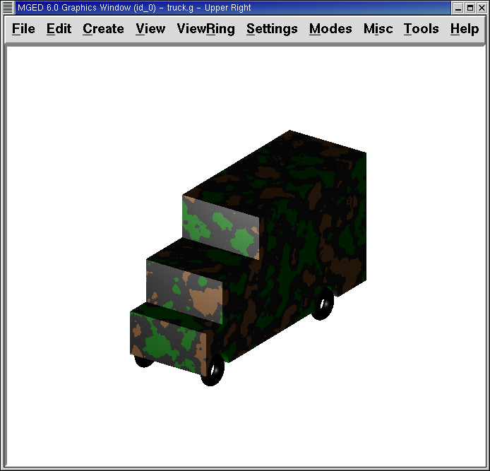
|image:../lessons/images/mged15_truck_ambient_lighting.png[]
|Truck with Default Lighting
|Truck with Added Ambient Light
|===

[[creating_toy_truck_review]]
=== Review

In this lesson, you:

* Created a toy truck from three shapes.
* Made copies of shapes using the Primitive Editor.
* Made combinations and regions of a more complex object.
* Checked the data tree for accuracy.
* Listed contents of the database.
* Assigned material properties using the Combination Editor.
* Identified the difference between OK, Accept, Apply, Reset, Cancel, and Dismiss.
* Identified the on-screen help option.
* Identified the stacker option.
* Experimented with the attributes of the camo shader.

[[lesson-16]]
== Learning Modeling Techniques and Structures

In this lesson, you will be:

* Making the shapes of the walkie-talkie radio into regions.
* Gathering the regions into an assembly combination.
* Assigning material properties to the regions.
* Adding internal components to the radio.
* Creating specialty models of the radio.
* Redefining the structure of the radio.

In Lesson 2, we made the basic shapes of a walkie-talkie radio to gain experience in viewing objects. Now that we have successfully modeled a few simple objects, let's return to the radio to make it more realistic and, in so doing, discuss logical techniques and structures in modeling. When finished, our radio should look as follows:

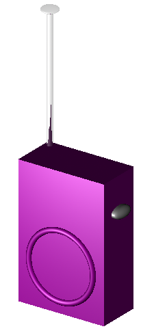

[[radio_shapes_to_regions]]
=== Making the Shapes into Regions

Open the database radio.g that you created in Lesson 2. In the Command Window, use the ls command to list all the contents of your radio. It should read as follows:

....

   ant.s btn.s knob.s

   body.s btn2.s spkr.s
	
....

Now what does this list really contain? Parts to a model radio? Not really. What the list actually comprises is just a collection of shapes (which we have hinted at by using a .s suffix) that (1) do not have material properties, and therefore (2) do not occupy space.

[NOTE]
====
Remember, in _MGED_ no shape truly becomes an object until it is included in a region, which, by definition, is an object or collection of objects that has a common material type.

====

So our first order of business is to identify the major parts of the radio so we can properly define the regions. So far, our choices are fairly simple. The radio basically consists of (1) a body, which houses the speaker and all of the internal parts; (2) an antenna; (3) a volume control knob, and (4) a talk button. These should be our four regions.

Most of these shapes were fairly straightforward to create, with each item consisting of just one or two primitive shapes. However, if we think of the radio as a real-world object, the body of the radio is actually more complex than just a solid box with a few shapes glued to its surface. (Remember that all objects are solid unless constructed to be otherwise.) Therefore, let's start with the main component of the radio-the body.

[[body_of_radio]]
=== The Body of the Radio

If we think about it, the body of a radio is actually a hollow case. So, the first thing we need to do is hollow out the case's interior to make room for internal components. To do this, we can use the inside command to create a shape, which we'll call cavity.s: *inside body.s cavity.s 1 1 1 1 1 1[Enter]* Now, we'll make a region called case.r and define it as what's left of body.s after cavity.s has been subtracted out. The command should look like this: *r case.r u body.s - cavity.s[Enter]*

[NOTE]
====
Remember that the inside command was originally created to hollow out objects such as gas tanks and boxes; however, it can also be used to create any new cutaway shape that has some relationship to a pre-existing shape.

====

With our case now made, we can proceed to cut several holes through this structure to accommodate the antenna, the volume control knob, and the talk button. To do this, we must subtract the three shapes from the case as follows: *r case.r - ant.s - knob.s - btn.s[Enter]* Finally, we need to "glue" the lip around the speaker to the case's front face by typing *r case.r u spkr.s[Enter]*

Our body is now finished. Note that an experienced modeler would probably have combined the preceding three Boolean functions into a single command as follows: *r case.r u body.s - cavity.s - ant.s - knob.s - btn.s u spkr.s[Enter]* If we were to raytrace case.r at this point, we would see the following:

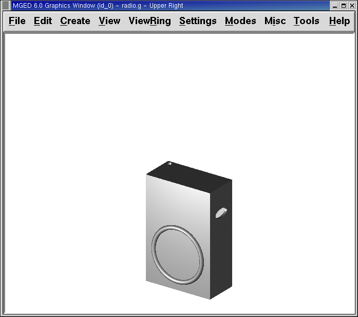

Note the hole for the antenna in the top of the case and the hole for the talk button on the side of the case. We will now fill these holes with their respective components.

[NOTE]
====
Precedence Review

The order in which these primitives were unioned and subtracted is important. We unioned in spkr. s last so that all the subtractions would apply to body.s. The rules of precedence for Boolean operators indicate that subtraction and intersection have a higher priority than union (meaning that they are performed first).

Although the following operation is not in proper _MGED_ syntax, it does illustrate the implied parentheses that precede and follow the union operators in our last command: *r case.r u (body.s - cavity.s - ant.s - knob.s - btn.s) u (spkr.s)[Enter]* Optionally, we could've unioned in spkr.s before body.s as follows: *r case.r u spkr.s u body.s - cavity.s - ant.s - knob.s - btn.s[Enter]*

Let's consider, however, what would have happened if we had done the following: *r case.r u body.s u spkr.s - cavity.s - ant.s - knob.s - btn.s[Enter]* In this last case, operator precedence would have caused the program to subtract cavity.s, ant.s, knob.s, and btn.s from spkr.s. Nothing would have been subtracted from body.s. Therefore, the holes in the case would not have been created.

Subtracting cavity.s, ant.s, knobs, and btn.s from spkr.s would have produced no apparent effect because they do not overlap the volume of spkr.s.

====

[[radio_other_regions]]
=== The Other Regions

Making the talk button is simpler than making the case. The button consists of the union of two primitive shapes. To make them into a region, type *r button.r u btn.s u btn2.s[Enter]*

The volume knob and antenna are even simpler. They are single primitive shapes that can be made into regions by typing *r knob.r u knob.s[Enter]* *r ant.r u ant.s[Enter]*

[[radio_assembly_comb]]
=== Gathering the Regions into an Assembly Combination

Now let's take all of the regions we have made so far and gather them into an assembly (or group) combination called radio.c so that we can keep all of these parts together. There are several ways to do this. One way would be to use a similar method to the one we used to make the regions: *comb radio.c u case.r u button.r u knob.r u ant.r[Enter]*

A shortcut, however, would be to use the g (group) command as follows: *g radio.c case.r button.r knob.r ant.r[Enter]* Unlike the comb command, the g command assumes that all of the items specified will be unioned together, and so no Boolean operators need to be specified.

A final improvement would include using the database name wildcard *.r to quickly and easily specify all of the regions in the database: *g radio.c *.r[Enter]* If we now tree radio.c, we should get the following output in the Command Window.

....

   radio.c/

   u case.r/R

   u body.s

   - cavity.s

   - ant.s

   - knob.s

   - btn.s

   u spkr.s

   u button.r/R

   u btn.s

   u btn2.s

   u knob.r/R

   u knob.s

   u ant.r/R

   u ant.s
	
....

[[radio_assign_mater_props]]
=== Assigning Material Properties to the Regions

Thus far, the objects we have created have no material properties other than the gray plastic that _MGED_ assigns by default to any object without assigned material values. Now let's improve our design by assigning other material properties to the components.

We'll give the antenna a realistic look by opening the Combination Editor, choosing ant.r from the drop-down Name menu, selecting mirror from the drop-down Shader menu, and clicking on Apply.

We'll let the other components remain with the default plastic, but we'll assign them different colors. With the Combination Editor still open, select case.r from the drop-down Name menu, select the magenta option from the drop-down Color menu, and then click Apply. Use the same method to assign the volume control knob (knob.r) a blue color. For the talk button (button.r), let's keep it gray by leaving the default values in place. The design should appear similar to the following when raytraced in Underlay mode:

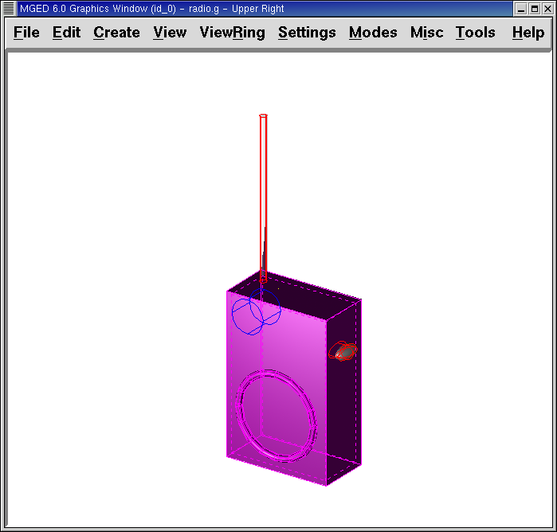

As we look at our radio now, we can see that the antenna looks a little bit like a straw. In reality, it should have a small cap on the end so that we can raise and lower the antenna. We can approximate this shape by creating an ellipsoid (which we'll call ant2.s) and unioning it in with the rest of the antenna as follows: *in ant2.s ell1 2 2 94 0 0 1 3[Enter]* *r ant.r u ant2.s[Enter]*

[[radio_internal_components]]
=== Adding Internal Components

Our radio is looking more and more realistic; however, it is still just a hollow shell. Let's further improve it by making a circuit board to go inside the case. To do this, type: *in board.s rpp 3 4 1 31 1 47[Enter]* *r board.r u board.s[Enter]*

Let's give the board a green semi-shiny color. The easiest way to do this is via the Combination Editor, but this time let's use the Command Line approach. Type: *mater board.r "plastic sh=4" 0 198 0 1[Enter]* Diagrammed, this command says to:

[cols="5*"]
[%noheader]
|===
|mater
|board.r
|"plastic sh=4"
|0 198 0
|1
|Assign material properties to
|the region called board.r.
|Apply the plastic shader with a shininess of 4
|Give it a green color
|Inherit color material type
|===

Finally, we'll include the board with the rest of the components in radio.c as follows: *g radio.c board.r[Enter]* Our radio should now look like the following:

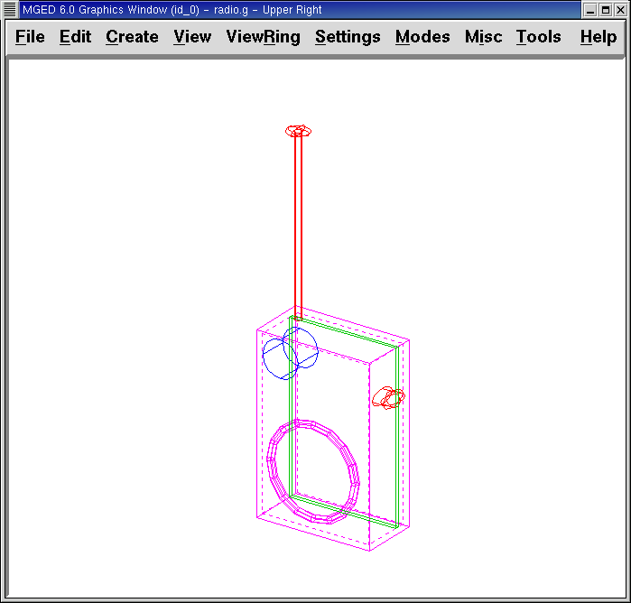

In addition, the tree for radio.c should now look as follows:

....

   radio.c/

   u case.r/R

   u body.s

   - cavity.s

   - ant.s

   - knob.s

   - btn.s

   u spkr.s

   u button.r/R

   u btn.s

   u btn2.s

   u knob.r/R

   u knob.s

   u ant.r/R

   u ant.s

   u ant2.s

   u board.r/R

   u board.s
	
....

[[radio_specialty_models]]
=== Making Specialty Models of the Radio

Now, what would happen to the circuit board if we were to raytrace the radio at this point? It would disappear because it lies within the case. So how can we make the circuit board visible outside of the case?

There are two common ways to do this: a transparent view and a cutaway view. Each method has its advantages and disadvantages. With the transparent view, the Boolean operations remain unchanged, but some of the material properties of the "outside shell" are altered to better view interior parts of the model. With the cutaway view, the material properties remain unchanged, but some of the Boolean operations are altered to remove parts of the model that are obstructing our view of other parts. We will try both ways to view the inside of our radio.

Different Approaches to Creating Specialty Models

An important point to note here is that the transparent and cutaway views are specialty models. They are similar in nature to items a manufacturer might make for special purposes. For example, an automobile manufacturer makes cars for everyday use, but also makes modified versions for display at certain events. The body panels might be replaced with a transparent material or be partially cut away to reveal interior components.

Good modeling practice follows the same pattern. The actual model of an item should not have to be changed in order to create a specialty view of it. Instead, a modified version of the item should be created. Thus, the modeler will not have to worry about remembering to return the model to the original condition after its special-purpose use, and the modeler can also retain the "display model" for future use.

There are two common approaches to making these specialty models: First, the modeler can copy the original and replace components with modified versions. Second, the modeler can create new, unique parts from scratch and construct the modified item. The method chosen is a matter of personal choice and is usually determined by the extent of the modifications being done and the complexity of the original object.

==== Transparent View

Making a specialty radio with a transparent case would probably be the easiest way to view the circuit board inside. All we have to do is make a copy of our present radio case and modify its material properties. We'll call the specialty case case_clear.r. Type *cp case.r case_clear.r[Enter]* We can now use the Combination Editor to set the material properties on this case without affecting the "master" design of the radio. When this has been done, we can combine this modified case with the other unchanged radio components and group them as a new specialty radio named radio_clear.c.

To set the material properties of case_clear.r, choose plastic from the drop-down menu to the right of the Shader entry box in the Combination Editor. (Although this is the shader that is used by default, we want to explicitly select it in order to change one of its values.) Now change the Transparency of the case to a value of .8. Apply the change and close the Combination Editor.

Finally, create the specialty radio combination by typing: *g radio_clear.c case_clear.r button.r knob.r ant.r board.r[Enter]* and then Blast the display with *B radio_clear.c[Enter]*

Now raytrace your design to view the resulting effect. The new transparent case should appear similar to the following:

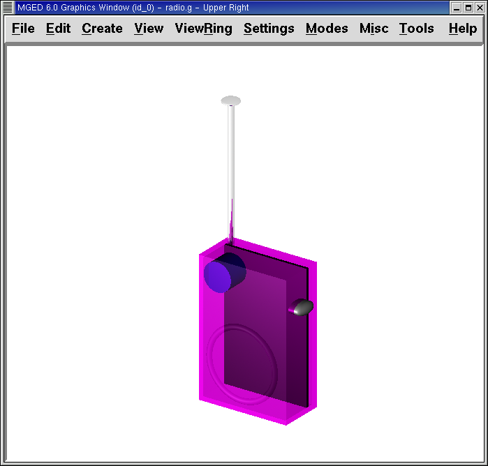

As shown in the following tree diagram, the structure of this specialty radio_clear.c is not much different than that of the regular radio.c. The only difference is that case.c has been replaced with case_clear.c.

....

   radio_clear.c/

   u case_clear.r/R

   u body.s

   - cavity.s

   - ant.s

   - knob.s

   - btn.s

   u spkr.s

   u button.r/R

   u btn.s

   u btn2.s

   u knob.r/R

   u knob.s

   u ant.r/R

   u ant.s

   u ant2.s

   u board.r/R

   u board.s
	  
....

[NOTE]
====
Notice in the preceding figure that the color chosen for the transparent case does influence the appearance of the internal objects. Although we made the circuit board green, the filter effect of the transparent magenta case-which allows no green light to enter or exit the case-causes the board to appear to be dark purple. This is okay in our situation. However, if accuracy in color is important in a model, the modeler should remember to select a neutral color (such as white or light gray) for the transparent object.

====

==== Cutaway View

Another way we can make the interior components of the radio visible is to create a cutaway view. Although it is a little more complex to make than the transparent view was, the cutaway view offers a particularly interesting way to view geometry.

There are several ways to make the cutaway view. Probably the easiest way is to use the "chainsaw" method to cut off part of the radio and reveal what is inside.

To do this, create an arb8 called cutaway.s, which will be used to cut off the front corner of the radio. Because this is a cutting shape (i.e., it is simply used to erase a portion of another shape and will not actually be viewed), the dimensions of the arb8 are not critical. The only concern is that cutaway.s be as tall as the case so that it completely removes a corner from it.

Use the Shift Grips and multiple views (especially the Top view) to align cutaway.s so that it angles diagonally across the top of the radio (as shown in the following wireframe representation). When you've aligned the shape the way you want it, create the following radio_cutaway.c combination that unions in radio.c and subtracts out the shape (cutaway.s) that is covering what you want to see (board.r): *comb radio_cutaway.c u radio.c - cutaway.s[Enter]*

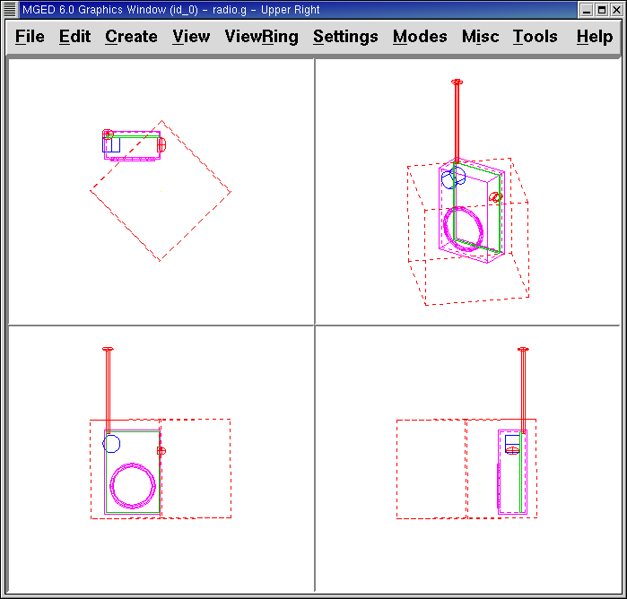

Blast the radio_cutaway.c combination onto the display and raytrace. Depending on how your arb8 intersected the radio, the cutaway should look similar to the following:

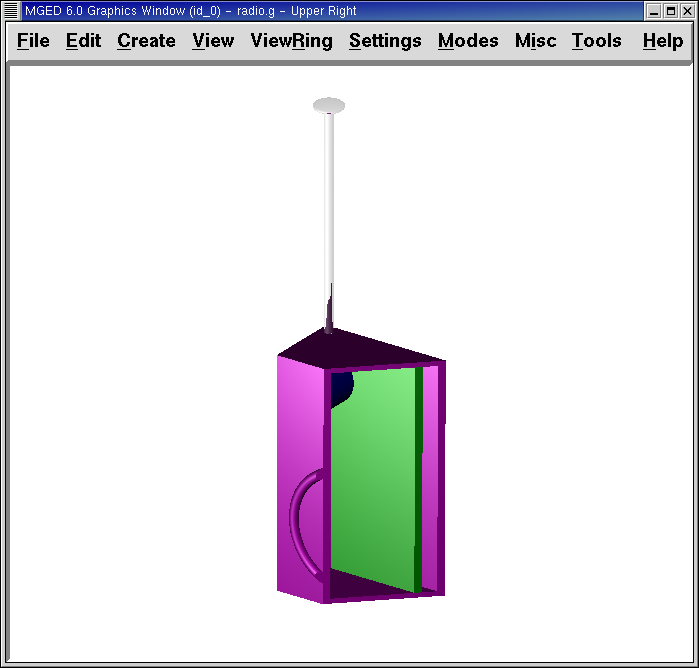

Notice in the preceding figures that cutaway.s removes everything it overlaps (including part of the circuit board). This is okay if we just want to see inside the case. However, if we want to see all of the circuit board and any other component overlapped by cutaway.s (e.g., button.r), we would have to adjust our Boolean operations a little so that the cutaway is subtracted only from our case.

To do this, we basically have two options: (1) we could move cutaway.s in the structure so that it is subtracted from only case.r, or (2) we could move cutaway.s in the structure so that it is subtracted from both body.s and spkr.s, the two components that make up case.r. While both of these options would produce the same effect, the first method requires just one subtraction, whereas the second method potentially provides more control by having the user select the individual components that will subtract out the cutting shape.

Take a minute and compare the following trees for the cutaways we have discussed so far. Especially note the position of cutaway.s in the different structures. Also, note that when cutaway.s was subtracted from a particular region or combination, the name of that region or combination was changed. The reasoning behind this goes back to our original discussion of specialty models. Remember that our purpose is to create a new special-purpose model, not change the existing model. So, we must change the name of any region or combination that contains any modified components or structures. If we don't, the master model will also be changed.

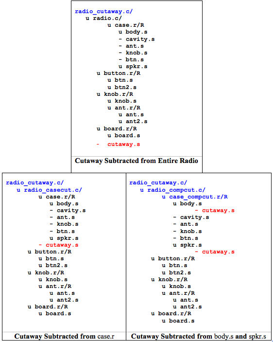

[[radio_structure_redefinition]]
=== Redefining the Structure of the Radio

As shapes are added in a design, the modeler often finds that the structure or association of components needs to change. Thus, we should pause at this point and consider how our radio is structured. While there are many ways to structure a model, two common modeling categories are location and functionality. For our radio, we have so far grouped everything together under the general category of Radio, as shown in the following:

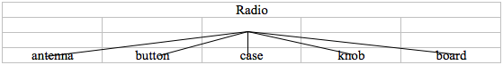

If we wanted to categorize our components according to location, however, we might structure the model as follows:

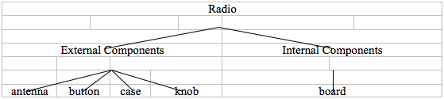

If we wanted to define our components according to functionality, we might structure the model another way. For instance, to repair an actual radio, we would open the case, take out the circuit board, fix it, and put it back in. When taking out the board, however, the knob and button would probably be attached to it in some way, and so they too would need to come out. Accordingly, our structure should be changed as shown in the following diagram to associate the knob and button with the circuit board.

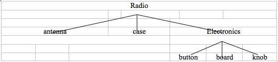

To accomplish this restructuring according to functionality, create an assembly called electronics.c to hold these components together. Type: *g electronics.c board.r knob.r button.r[Enter]* Of course, we now need to remove board.r, knob.r, and button.r from the radio.c assembly so that when electronics.c is added to the radio.c assembly, we won't have the knob and button included twice in the model. To do this, use the rm (remove) command: *rm radio.c board.r knob.r button.r[Enter]* and then union in the electronics assembly: *g radio.c electronics.c[Enter]*

Now the tree for radio.c should appear as follows:

....

   radio.c/

   u case.r/R

   u body.s

   - cavity.s

   - ant.s

   - knob.s

   - btn.s

   u spkr.s

   u ant.r/R

   u ant.s

   u ant2.s

   u electronics.c/

   u board.r/R

   u board.s

   u knob.r/R

   u knob.s

   u button.r/R

   u btn.s

   u btn2.s
	 
....

Now let's remake our cutaway view. This time, let's do what we discussed earlier and make the cutaway remove material from only the case, showing all the other components.

First, we need to get rid of the old radio_cutaway.c, which was based on our previous structure. To do this, type *kill radio_cutaway.c[Enter]* and then remake the combination by typing *comb radio_cutaway.c u case.r - cutaway.s u electronics.c u ant.r[Enter]* Now when we Blast the display and raytrace radio_cutaway.c, we should see the following:

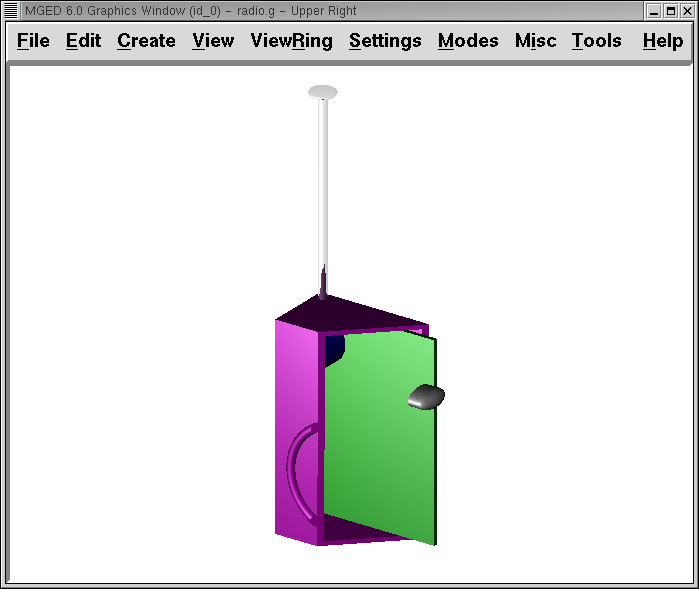

[[modeling_techniques_and_structures_review]]
=== Review

In this lesson, you:

* Made the shapes of the walkie-talkie radio into regions.
* Gathered the regions into an assembly combination.
* Assigned material properties to the regions.
* Added internal components to the radio.
* Created specialty models of the radio.
* Redefined the structure of the radio.

[appendix]
== MGED Commands

Appendix
