= BRL-CAD Tutorial Series: Volume III - Principles of Effective Modeling
:author: Lee A. Butler
:author_2: Eric W. Edwards
:author_3: Dwayne L. Kregel
:affiliation: Army Research Laboratory
:affiliation_2: SURVICE Engineering Company
[.authors]
--
* {author} — {affiliation}
* {author_2} — {affiliation_2}
* {author_3} — {affiliation_2}
--

:doctype: book
:toc:
:toclevels: 3

[preface]
== Acknowledgments

The authors would like to acknowledge Mr. John Anderson, Mr. Sean Morrison, Mr. Keith Applin, Mr. Charles Kennedy, Ms. TraNese Christy, and Ms. Wendy Winner for reviewing this document at various stages in its development and for providing many helpful suggestions for improving its content and presentation.

In addition, the following individuals and organizations are thanked for contributing various tables and figures throughout the report. They include Ms. Wendy Winner, Mr. Michael Gillich, Dr. Paul Tanenbaum, the Aberdeen office of the Science Applications International Corporation (SAIC), and the SURVICE Engineering Company.

Finally, the authors would especially like to acknowledge Mr. Michael Muuss, the original architect of BRL-CAD, who passed away in the fall of 2000. Without his vision, intellect, and diligence, this work would not have been possible. The BRL-CAD Tutorial Series is dedicated to his memory.

[[volIIIintro]]
== Introduction

Since 1979, the U.S. Army Research Laboratory (ARL) has been developing and distributing the U.S. Army Ballistic Research Laboratory - Computer-Aided Design (BRL-CAD) constructive solid geometry (CSG) modeling package for a wide range of military and industrial applications. The package includes a large collection of tools and utilities including an interactive geometry editor, raytracing and generic framebuffer libraries, network-distributed image-processing/signal-processing capabilities, and an embedded scripting language.

As part of this effort, a multivolume tutorial series is under development to assist users with the many features of the BRL-CAD package. Volume I provides an overview of the package contents and installation (Butler and Edwards, 2002). Volume II addresses the basic features and functionality of the package's Multi-Device Geometry Editor (MGED) and offers a comprehensive list of the user commands available (Butler et al., 2001). These documents are available for download at http://ftp.arl.army.mil/brlcad/ (U.S. ARL, 2003).

The purpose of Volume III is to discuss the components of the modeling process and suggest principles for maximizing the effectiveness of BRL-CAD's capabilities. Because of the large diversity in modeling projects, these principles have largely been kept to a general nature so that they have the widest applicability possible. In addition, several appendices have been included to offer detailed discussions on several BRL-CAD tools and features, including the pipe primitive (Appendix A), the projection shader (Appendix B), the extruded bitmap primitive (Appendix C), the .mgedrc file (Appendix D), the Build Pattern tool (Appendix E), and the build_region command (Appendix F).

Future volumes in the tutorial series are planned to discuss geometry format conversion, advanced modeling features, and programming options.

[[volIIImodelprocess]]
== The Model Process

[[The_Importance_of_the_Model_Mission]]
=== The Importance of the Model Mission

The key to knowing how to build successful, effective models in BRL-CAD is to know why you are building them. Thus, before any measurements are taken, before any structures are laid out, and before any geometry is built, the modeler should, if possible, meet with program sponsors, participants, and/or end users to gain a clear understanding of the model's intended purpose--that is, its mission.

Whether a model is intended for ballistic analyses, radar studies, or something else, the model's mission should be the basis for determining how all parts of the modeling process should be conducted. This includes the level of detail that the modeler should achieve, the tree structure the model should have, the amount of modeling time that should be allotted, the types of validation and verification the model should have, and even the way documentation should be created and logged. This point may seem obvious, but failure to acknowledge the mission can result in wasted time and resources and, ultimately, an ineffective model.

For example, if one is creating a geometric target description of a combat vehicle to simulate a ballistic penetration event, accurately modeled material thicknesses and densities of outside armor are crucial in analyzing penetration damage. In addition, it is usually important to include internal components such as fuel and electrical lines, ammunition, and even crew members, which can greatly affect the vehicle's functionality if they are impacted by a projectile (see Figure 1).

Radar signature studies, on the other hand, often call for a different type of model. For the most part, the vehicle's outer shell--or "skin"--is what is important, and the previously mentioned armor thicknesses and internal components are usually unnecessary (see Figure 2).

.Ballistic penetration model with transparent exterior.
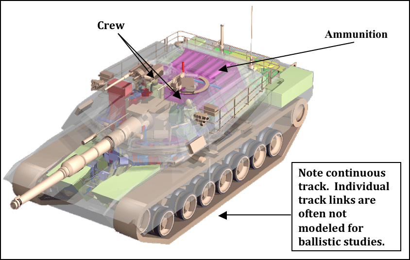

.External detail commonly used in radar signature models.
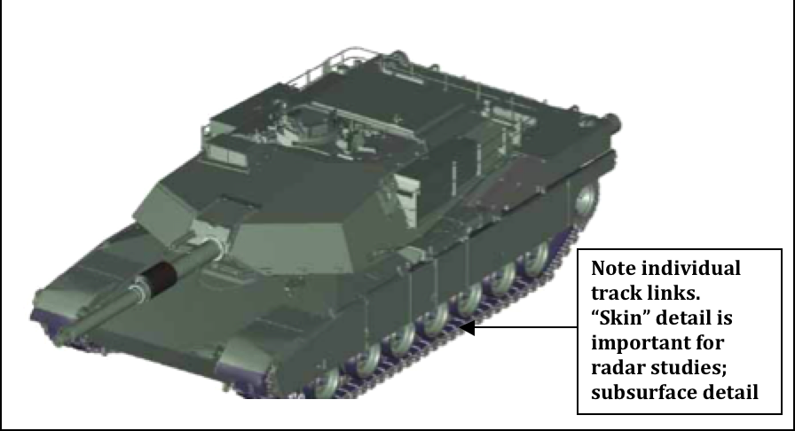

It is also important to note that some models will need to serve multiple missions. If the modeler suspects that this will be the case with a model, it should be built to the highest level of detail that any of the intended users requires (and, of course, that time/resources permit).

[[M_O_D_E_L_A_Five-Step_Approach_to_Creating_Effective_Models]]
=== M-O-D-E-L: A Five-Step Approach to Creating Effective Models

After one has explicitly and unequivocally established the "why" of a model, the "how" of a model can be addressed. Unfortunately, there is no single, universally accepted method to creating models in BRL-CAD. In fact, professional modelers are known to employ many unique techniques to accomplish equivalent results. Nonetheless, there are several basic steps or procedures that are commonly used by most modelers to create accurate, realistic, and useful geometric representations in a timely and efficient manner. These steps could be described in a variety of ways, but for convenience, they can be generalized into the following five categories and represented by the acronym M-O-D-E-L:

* M-easuring (or collecting/converting) data,
* O-rganizing the structure,
* D-eveloping (or building) geometry,
* E-valuating (or checking) geometry for correctness, and
* L-ogging (or creating) documentation.

The remaining sections of this document address each of these steps in turn.

As shown in Figure 3, the modeling process can be thought of as a wagon wheel with five spokes. Each spoke extends out from the inner hub--the model's mission--and is equally important in giving the wheel its strength and functionality. Also, although it is common to consider the steps in the order in which they are listed (i.e., M then O then D then E then L), the modeling process is dynamic, and it is not unusual for a particular phase to occur in a different order, to repeat itself, or to be skipped altogether as a project develops.

.M-O-D-E-L: the five-stage modeling process.
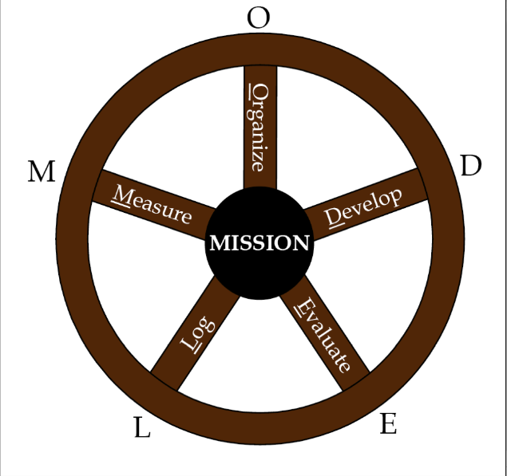

For example, the organization phase is often the first step in large or complex modeling projects because it helps the modeler establish a tree structure that will guide him in collecting/measuring the right (or right amount of) data. Also, the modeler often detects missing or inaccurate data in the geometry development phase, which requires a return to the measurement phase. Finally, in cases involving the conversion of geometry from another source, the measurement and development phases might be nonapplicable, and a modeler might skip directly to the evaluation phase.

[[volIIImeasuringdata]]
== Measuring data

Unless a modeler is creating a conceptually new geometry, he must work from a variety of information sources to build a model. In some cases, blueprints or mechanical drawings exist. In others, a trip to the field is required to physically measure objects and orientations. In still others, geometry exists in another CAD format and needs to be converted to BRL-CAD format. As shown in Table 1, each type of measurement source has its own set of advantages and disadvantages, depending on the modeler's and/or user's point of view.

.Various modeling data sources.
[cols="3*"]
[%noheader]
|===
|Data Sources
|Advantages
|Disadvantages
|Blueprints/schematics/mechanical drawings/photographs 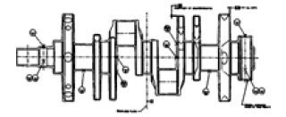 
|Can save time/resources by providing precise measurements with minimal data collection effort. Can also suggest ways to structure the model (e.g., by providing wiring diagrams, subsystem schematics, etc.).
|Can sometimes be difficult to read. Do not always show all needed measurements or views. Are not always consistent with the actual objects they represent (e.g., design changes sometimes occur during development or manufacturing).
|Measurable objects 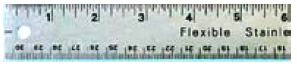 
|Can arguably provide the best source of verifiable information by providing hands-on access to the actual objects being modeled.
|Can be resource and labor intensive and can be limited by the objects’ availability, accessibility, and measurability, resulting in missed measurements.
|Converted geometry 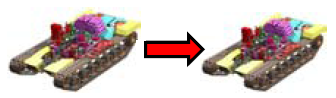 
|Can offer significant savings in data collection and/or measurement efforts.
|Can have missing data, unfamiliar naming schemes, and alternate/dissimilar geometry formats (e.g., feature-based objects, splines, etc.). Can also be unsuitable for a given application because the original model was developed for a different purpose.
|===

Regardless of the type information source used, there are several simple keys to obtaining data. These keys often require a little extra time and effort in the early stages of the modeling process, but they can save significantly more time and effort later on (especially if multiple modelers are involved in the project). Several of these keys are identified as follows:

* _Leverage all sources available:_ Although one of the previously mentioned sources may be the primary one from which a modeler will work, all available photographs, drawings, converted geometry, etc., should be used together to spot-check and verify the information given. Sometimes schematics are mislabeled, mistakes are made while measuring, or geometry from other CAD packages does not convert properly. The only way to catch some of these errors is to compare them against another source.
* _Get information while it is available:_ With the many data points involved in building complex geometry, it is not uncommon to find during geometry development that not all required information was obtained during the data measurement/collection phase. Important components and/or dimensions can be overlooked, and it may be inconvenient or impossible (e.g., with a combat vehicle) to recollect, remeasure, or reconvert what is missing. Thus, a modeler should be as thorough as possible when obtaining data. Even if it is not clear whether a piece of geometry or measurement will be required, it can always be discarded later if not needed. Also, in the spirit of the carpenter's maxim, it is a good idea to "measure twice and cut once" and double-check measured or converted geometry before it is placed in a model.
* _Get total lengths and total views:_ Modelers sometimes take relative measurements of objects across a face without measuring the entire length/width of the face. Unfortunately, at the end, the measurements do not always add up. It is much easier to "back out" missed or inaccurate measurements given total lengths/widths. Likewise, when photographing portions of a bigger object (e.g., a radiator on a truck), it is a good idea to also capture several "bird's eye" views of encompassing objects (e.g., the engine compartment or the entire truck) to help establish overall reference points.
+

[NOTE]
====
For a series of uniformly spaced objects, it is good practice to measure the total length of the series and divide by the number of objects. This helps spread out any inaccuracies along the span and prevents them from accumulating at the last object. For example, in a row of 20 bolts at 50-mm intervals, a measurement error of just 2 mm between bolts could result in the last bolt being nearly 40 mm out of position.

====

* _Record measurements as clearly and consistently as possible:_ It is interesting how a "scribble" that is perfectly understandable to the measurement-taker who is still in front of the object can become indecipherable when it is later viewed back in the office (when the object is no longer accessible). Furthermore, despite the best laid plans, projects and personnel can change in midstream, and the person(s) taking measurements may wind up having little or no connection to the person(s) actually interpreting those measurements and building the model. Therefore, all drawings and notations should be sufficiently clear and consistent so that someone unfamiliar with the object could understand and work with the recorded measurements. A few recommendations are given as follows:
** _Include meaningful titles on drawings:_ Detailed drawings and data can be of little value if it is unclear what the overall geometry/view is and how the designated piece ties into the completed model.
** _In general, orient drawings in orthogonal views:_ This practice eliminates potential problems associated with perspective and makes drawings easier to read and use. If other angles are desired (and it is not a bad idea to include at least one off-angle view with a few measurements to help confirm reference points), be sure to include azimuth/elevation and information about the orientation relative to the eye point and to the actual vehicle coordinate system. In addition, note any atypical configurations and orientations (e.g., a tank turret rotated in an unusual fashion to allow access to certain components).
** _Include offsets from other objects:_ Although these measurements may not actually be primary data (i.e., required inputs for MGED commands), they may help the modeler resolve problems or derive other measurements needed later. For example, when modeling a field of objects on a flat surface (e.g., gauges and buttons on an instrument panel), it is good practice not only to collect the distances of the objects from, say, the edges of the panel but also the distances relative to other objects. This information can be valuable when trying to troubleshoot overlaps or other problems encountered during the evaluation phase.
** _Clearly record small details and symbols:_ When recording measurements, it is important to remember that even small details (such as arrows, edges, centers, thicknesses, numbers, and units) can lead to possible confusion. Arrows too long or too short can be mistaken for pointing to a shape's edge instead of its center, hastily written numbers can be mistaken for other numbers (e.g., "1" vs. "7"), unidentified inner diameters can be confused with outer diameters, unidentified units can be assumed to be other units, etc. The table below lists some standard symbols and abbreviations that are commonly used when recording measurements.
+
.Commonly used measurement symbols and abbreviations.
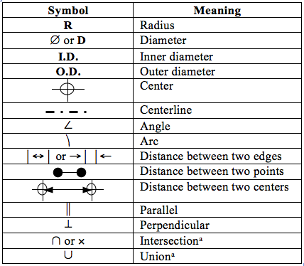

[[volIIIorganizing]]
== Organizing the Structure

Taking the time to map out a tree structure of an object before building it is another important step in the modeling process, especially if the object being constructed is elaborate, if modeling time and resources are limited, if the work is being performed as a team, or if the model will be passed on to someone else later.

If we consider the construction of a house, we know that builders do not actually build houses; they build pieces of a house until the completed structure emerges. Furthermore, these pieces are not usually built in a random order. Rather, a good builder (often as part of a team of carpenters, masons, electricians, plumbers, etc.) follows blueprints or drawings that group the pieces into categories based on their functionality (e.g., framing, wiring, plumbing, etc.) or location (e.g., basement, bedroom no. 1, kitchen, etc.).

The modeling process can be thought of in much the same way. Before anything is built, a modeler should take on the role of an architect and lay out a logical way to break down a potentially complicated object into smaller, more manageable pieces. Also, this step can often reveal a logical building order (e.g., the drywall does not get installed until the wiring inside the walls has been run) as well as identify important interconnections among parts.

The following list provides some tips to achieve good model structuring:

* _Use a top-down approach:_ It is a good idea to design the structure using a top-down approach, beginning with the largest, most encompassing, or most functionally significant parts/systems and working down from there. Once again, the model's mission is all-important here. If an armored tank is being modeled for a ballistic analysis, the model should probably be structured so that all the pieces connected to the turret are grouped together and, therefore, can move together when the turret is rotated.
* _Take advantage of established organizational conventions:_ It is wise to follow any traditional or widely used conventions that might be available in, say, an owner's or operator's manual. If a mechanic or user would normally expect a particular component to be part of a suspension system, then it is wise for the modeler to structure his model accordingly unless there is a good reason to do otherwise.
* _Use good naming practices:_ Closely associated with the idea of using good organizational conventions to structure geometry is the idea of using good naming conventions to name geometry. Although naming may appear to be a trivial matter, the fact is that it is not always easy to establish titles and schemes that are intuitive, robust, and useful in helping the end user know where he is in a potentially complex model.
+
There are few limitations to how files and objects can be named in BRL-CAD (other than that each file/object name must be unique). However, new modelers soon find that random or haphazard naming schemes lead to inefficiency and frustration. Thus, the following general recommendations are provided to help modelers efficiently organize and track what they build.
** Develop logical schemes, stick to them, and document them: If logical or obvious titling schemes (such as a manufacturer's part names or numbers) are already in place, the user should take advantage of them, especially at the highest assembly levels of "complete" or aggregated objects and especially when multiple modelers are involved. This practice helps establish a logical structure (e.g., all engine parts have a prefix of, say, eng), and many users may already know these names.
+
Table 3 provides examples of a number of other logical naming conventions traditionally used in BRL-CAD. These conventions include (1) an initial nametag to designate shape/object type or function (i.e., sph for sphere, ant for antenna, and frf for front face); (2) a suffix (or prefix) to designate MGED object type (i.e., .s for primitive shapes [formerly referred to as "solids"], .r for regions, .c for shape combinations, and .a or .g for assembly combinations); and (3) some sort of sequential numbering scheme (i.e., 1, 2, 3, etc.). For more information on BRL-CAD shapes and modeling levels, see Section 5, as well as Lesson 5 and Appendix C of BRL-CAD Tutorial Volume II (Butler et al., 2001).

+
.Examples of naming conventions.
[cols="2*"]
[%noheader]
|===
|Name
|Rationale
|`sph.s1, sph.r1, sph.c1`
|Associates the name with primitive shape type (sphere), order of creation (1), and MGED object type (shape [.s], region [.r], or combination [.c]). Often used for training or testing BRL-CAD functionality but not recommended for large, complex modelsfootnote:[Sometimes the primitive shape tags are used to name temporary objects that the modeler knows will be replaced or discarded. In this case, a more intuitive, functional name, such as “temp,” is recommended. ]
|`ant.s1, ant.r1, ant.c1`
|Associates the name with type of function (antenna), order of creation (1), and MGED object type (shape [.s], region [.r], or shape combination [.c]).
|`frf.s1-1, frf.s1+1, frf.s1`
|Associates the name with function (front face), MGED object type and order of creation (.s1), and type of Boolean operation performed (subtraction [−] and intersection [+]).footnote:[Note that we have chosen not to associate a suffix for objects that are unioned. In this naming convention, objects without a Boolean operation suffix are understood to be unioned. ] This is the notation currently used with the Build Pattern tool.
|`front_face.a, right_antenna.a, left_roadwheel.a`
|Gives the assembly combination levels (.a) more descriptive titles to better designate overall model composition and/or functionality for the end user.
|`Driver Main_Gun M1A1`
|Gives top-level assemblies human-readable descriptions of overall composition and/or functionality. Uses initial capitalization to show higher tree level and disregards traditional MGED suffix.
|===

+
Note that the suffix at the end of names is particularly useful for searching for similar items in large tree structures and for using MGED automation features such as the Build Pattern tool and the build_region command (see Appendices E and F).

** _Keep names short:_ Prior to BRL-CAD release 6.0, all BRL-CAD names were limited to 16 characters. In some respects, this "limitation" was useful, compelling new modelers to resist the common urge to name primitives with as much detail as possible. Although the length restriction no longer applies, it is still a good idea, especially in large models (and with frequently used objects), to keep names of objects as short as possible so as to reduce the amount of typing the modeler must do and, thus, reduce the possibility for input errors. In addition, some vulnerability analysis codes do not support names longer than 16 characters.
+
As shown in Table 3, an exception to the practice of keeping names short includes the names at the assembly combination level and above, where fewer names are used and more descriptive titles can be helpful in designating overall model composition and structure for the end user.

** _Establish "reserve" names:_ In projects that involve multiple modelers developing different pieces of the same geometry, it is helpful in some cases to reserve particular name designations to avoid possible confusion. For example, a team of modelers developing an armored vehicle might choose to reserve the letter "h" to denote the "nametag" for only those components associated with the hull (e.g., "h.s1," "h.s2," etc.). This would mean that those modelers building, say, headlight assemblies would have to choose another designation (e.g., "hlght.s1," "hlght.s2," etc.). This standardization can also be helpful in establishing common terminology for later projects with the same or similar components.
** _Avoid using certain letters and symbols:_ To avoid potential problems associated with common UNIX notation, searching schemes, and certain survivability, lethality, and vulnerability (SLV) analysis codes, the following recommendations (or, in some cases, requirements) are made regarding the use of keyboard characters in BRL-CAD names:

*** Use lowercase Arabic letters (except for the previously mentioned initial capitalization used for top-level assemblies).
*** Use numerals without internal commas (e.g., "5000" not "5,000").
*** Avoid using numerals to begin a name.
*** Do not use a space between words; use an underline or capitalize the first character of each word (i.e., Hungarian notation).
*** Avoid using special characters. Restrict the use of "+" and """ symbols to the suffix of primitive shape combinations, and do not use the "/".
*** Restrict the use of the period to the suffix of MGED object types. Avoid using other punctuation (e.g., "?," "!," etc.).
*** Avoid using the lowercase letter "l" by itself (to avoid possible confusion with the number "1").

* Include the right amount of detail: The structure should only be as deep as needed for the application. Obviously, every part, no matter how complex, could in theory be reduced down to the atomic or even subatomic level, but how cost efficient and useful would this be? More is not necessarily better. The modeler should use common sense and consult with the end user(s) when deciding how far to break down components and systems. Insufficient detail can diminish the model's usefulness and reduce user confidence, and yet too much detail can unnecessarily drain time and resources, slow down processing time of application codes, and frustrate users who have to wade through many parts that they do not need to get to what they do need.
+

[NOTE]
====
Note that it is not unusual for a modeler to select relatively arbitrary names when shapes and parts are first made and then go back and rename them as the model develops. There are two commands to rename database objects.

To rename only the database object, type the following:

....

mv  oldname newname
	      
....

Note that this command changes only the name of a particular object and not any references to the object that may occur in combinations throughout the database.

To change an object's name and all references to that object, the mvall (move all) command can be used as follows:

....

mvall oldname newname
	      
....

====

* Use location- and function-based groupings: Components should be grouped based on simple, logical categories such as location and/or functionality. For example, the structure of the simple radio that was built in Lesson 16 of Volume II of the BRL-CAD Tutorial Series (Butler et al., 2001) could be set up in several ways. Figure 4 shows a structure based on location, and Figure 5 shows a structure based on functionality.
+
.Location-based structure of the radio in Volume II.
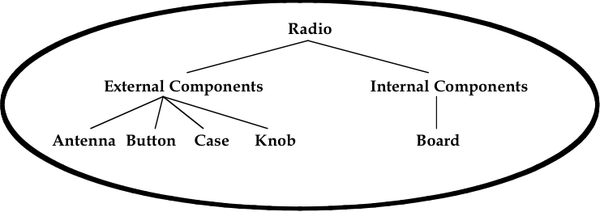

+
.Function-based structure of the radio in Volume II.
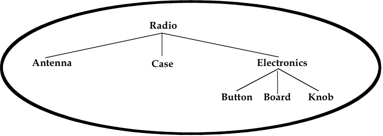

+
The structuring phase, of course, gets trickier and more subjective as the model gets more complex. Regardless of whether the structure is based on location, function, or something else, it is not always clear which parts belong to which structures. In fact, some parts are clearly designed to interface between parts or systems, and so the modeler must choose where he should place them in the tree structure. A consistent treatment of these parts within the model is an important part of the user's ability to understand and use the model.

+
It is also important to remember that the tree structure in MGED is independent of the geometry created. The structure is simply a tool to help the user organize and work with the database. Accordingly, the tree structure can be manipulated to suit whatever needs the user(s) may have. Consider the example of a model of a room containing a table and a cup on top of the table. If one wanted to relocate the table (along with the cup) next to a wall, one could create a temporary combination containing the table and the cup. This combination could then be used to move the two objects together to their new location. After the objects are in position, the temporary combination could be "pushed" (see discussion of the push command in Section 5) and then deleted using the kill command (see Appendix A of Volume II [Butler et al., 2001]).

[[volIIIdevgeometry]]
== Developing Geometry

In the end, the heart of the modeling process is the actual construction of the geometry. All the best measurement, organization, evaluation, and documentation would be ineffective unless the geometric shapes that make up a model are built and built correctly.

Basically, there are two steps to geometry development: (1) _creating geometry_, and (2) _positioning geometry_. Of course, as with all the other phases in the modeling process, there are different schools of thought as to how these steps should be accomplished, and each method has its own set of advantages and disadvantages.

Factors that need to be considered when deciding which methods to use include the convenience of building location and manner (e.g., building geometry at the origin or in an order that leverages previously defined measurements or mathematical calculations); the number of object replications that will be needed in the model; the ease of editing one or more of the replications; storage space; prep/rendering time; etc.

The following are some general tips regarding the efficient development of geometry in BRL-CAD:

* _Build the main structure first:_ As mentioned previously, it is a good idea to start building with the "main" object of a model. This could be the largest piece, the piece most central to the rest of the model, or a piece whose location represents a prominent corner or point. Much like on the assembly line of an automobile manufacturer, building the main frame first provides an overall model coordinate system for the rest of the smaller, secondary parts to reference. Also, for projects in which multiple modelers work on separate pieces simultaneously, starting with the main structure allows other pieces to be built in place or put in position immediately upon completion. This practice is more efficient in that it eliminates having extra parts floating around waiting to be positioned, and it provides a better picture of model completion throughout the project.
* _Know the four modeling levels and their differences:_ As shown in Table 4 (and discussed in Volume II [Butler et al., 2001]), all models built in BRL-CAD are built within the confines of its four modeling levels: (1) the primitive level, (2) the combination level, (3) the region level, and (4) the assembly level. Knowing the characteristics of these modeling levels is one of the first keys to developing effective geometry.
+
.The four modeling levels in BRL-CAD
[cols="2*"]
[%noheader]
|===
|Modeling Level
|Description
|Primitive level (.s)
|This level is where one performs three-dimensional (3-D) CAD “sculpting,” working with the primitive shapes to represent the target geometry in coordinate space. Objects at this level are not recognized as having volume or material properties.
|Combination level (.c)
|This level is an optional intermediate level between primitives and regions or regions and assemblies. It allows Booleaned objects to be subtracted and intersected. All nonprimitive objects are stored as combinations.
|Region level (.r)
|This level is the lowest level at which geometry occupies 3-D space and can have material properties. It is where one assembles primitives and defines positive volume using Boolean logic. A region must be composed of one material, should be interconnected, and should perform the same function.
|Assembly level (.a or .g)
|This is the level at which subparts are organized into parts and parts are organized into assemblies. This is also where meaningful names and appropriate hierarchical structure are applied.
|===

* _Know the major primitives and their constraints:_ Another key to good model building is to understand the required inputs, editing options, geometric characteristics, and relative advantages/disadvantages of the package's basic "building blocks"--the primitive shapes. Although the package currently has more than 20 primary primitives (as well as another dozen developmental/special-use primitives), only a few of these primitives are used on a regular basis (see Table 5). That is not to say, of course, that less common shapes could not be used, but with some experience, users can begin to "see geometry" in a relatively small set of primitives and understand the data needed to produce accurate models.
+
.The major BRL-CAD primitives and parameters.
[cols="2*"]
[%noheader]
|===
|Primitive Shape/BRL-CAD Abbreviation
|Input Parameters/Definitionsfootnote:[To maximize database efficiency, some shape types are stored as other types (e.g., all arbs are stored as arb8's), but this behavior is invisible to the user. ]
|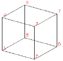 
|8 vertices, 6 faces, and 12 edges ; Each face must be a plane. ; Illegal variations include the following: 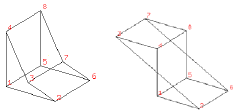 
|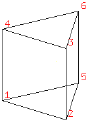 
|6 vertices, 5 faces, and 9 edges. ; Stored as an arb8, where point 8 is coincident with point 5 and point 7 is coincident with point 6 
|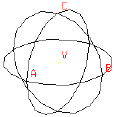 
|Vertex, V. ; Radii, A, B, C. ; Stored as an ellipsoid (ell). ; Vectors A, B, and C are mutually perpendicular. 
|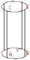 
|Vertex, V. ; Radii, A, B, C, D. ; Height vector, H (base-to-top distance). ; Stored as a truncated general cone (tgc). ; Vectors A and B have equal lengths, C and D have equal lengths, and all vectors are perpendicular to H. 
|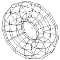 
|Vertex, V (center of hole). ; Normal direction for the plane of the ring. ; Radius 1 (radius from V to center of tube). ; Radius 2 (radius of tube). 
|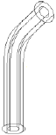 
|Outer diameter (OD). ; Inner diameter (ID). ; Bend radius (equivalent to an r1 value of a torus). ; Each point contains X, Y, Z coordinates, OD, ID, and bend radius data. ; Is effectively a subregion combination of cylinders and bounded tori whose path is defined by a series of coordinates. 
|===

+

[NOTE]
====
For a list of all the primary primitives and their shapes, see Appendix C of BRL-CAD Tutorial Volume II (Butler et al., 2001) or consult http://ftp.arl.army.mil/brlcad/ (U.S. ARL, 2003). For detailed guidance on using the pipe and the extruded bitmap (ebm) primitives, see Appendices A and C of this volume.

====

* _Use the best command to build primitives:_ In addition to understanding the package's basic building blocks and modeling levels, it is important to understand the behavior and advantages/disadvantages of its basic building "tools" (see Table 6). Using the right building command at the right time can maximize modeling efficiency by, in some cases, taking advantage of data from previously built geometry and saving measurement and/or input time.
* Build objects in the most convenient location: Although coordinate systems vary according to the type of situation (e.g., converted geometry or group modeling, where a particular orientation has been established), BRL-CAD models are generally centered at the origin (x y z = 0 0 0), where the +X axis is front, the +Y axis is left, and the +Z axis is up.
+
For objects that are symmetrical in nature, this practice can take advantage of BRL-CAD's mirroring operations and can provide simpler reference numbers for objects that are more complex in composition and/or orientation. In some cases, however, the modeler will find it makes more sense to build objects in place in the model. These include cases in which previously created objects offer convenient reference numbers for the object's location/orientation and cases in which tangencies and other necessary calculations would be more difficult to derive with the object at the origin.

+
Note that there are traditional coordinate system conventions that some organizations use for their target descriptions (Ellis, 1992; Robertson et al., 1996; Winner et al., 2002). For a turreted vehicle, the origin is traditionally located at the intersection of the axis of the turret rotation and the ground surface. The +X axis points to the front of the vehicle, the +Y axis points toward the vehicle's left, and the +Z points up (see Figure 6). For a nonturreted vehicle, the axes are the same, but there is no axis of rotation to provide a definitive reference point. So, the origin is located at the intersection of the ground surface and a convenient point along the left-right, mid-plane of the vehicle (see Figure 7). For fixed-wing and rotary-wing aircraft, the axes are the same, but the origin is located on the front nose of the airframe (see Figures 8 and 9).

+
.Various ways to build primitives.
[cols="4*"]
[%noheader]
|===
|MGED Command
|Behavior
|Advantages/Disadvantages
|Method of Input
|create
|Creates a “generic” primitive shape based on the user’s screen size and center.
|Creates shape without having to input parameter/location values; primitive usually requires further editing; puts user into edit mode.
|Graphical user interface (GUI)
|make
|Creates a “generic” primitive shape based on the user’s screen size and center.
|Creates shape without having to input parameter/location values; primitive requires further editing.
|Command line
|in
|Creates a new primitive shape according to user-input parameter values and location.
|Allows user to create a shape in a specific size and location without having to further edit it.
|Command line
|inside
|Creates a primitive shape by referencing a previously created shape and applying user-defined positive/negative thicknesses to faces (e.g., making an interior wall).
|Allows user to create a shape based on a specified primitive by applying wall thicknesses without having to further edit it.
|Command line
|cp
|Creates a duplicate of a previously defined object.
|Copies the parameters of an object to a new object of the same type. Takes advantage of previously defined measurements and locations.
|Command line
|cpi (copy index)
|Originally created to model wiring or piping runs; creates a duplicate cylinder whose base vertex is coincident with the top of the original cylinder.
|Can only be used with cylinders; takes advantage of previously defined measurements and locations; puts user into edit mode automatically.
|Command line
|mirror
|Creates a duplicate primitive shape, region, or assembly and locates it across the x axis, y axis, z axis, or an arbitrary axis specified by a point and a direction.
|Takes advantage of previously defined measurements and locations; can mirror across only one axis at a time but across any point along that axis.
|Command line
|pattern
|Creates a rectangular, spherical, or cylindrical pattern of primitive shapes, regions, or assemblies by referencing a previously created object and applying user-defined offsets and parameters.
|Takes advantage of previously defined measurements and locations; requires extra positioning measurements.
|GUI or command line
|===

+

[NOTE]
====
Note the in and inside commands are often the best ways to create a primitive in the right size/location if the modeler knows the parameters. Also, using the cp and mirror commands to create primitives can often save time by taking advantage of previously established measurements/positioning.

====

+
.Coordinate axes of a turreted ground vehicle.
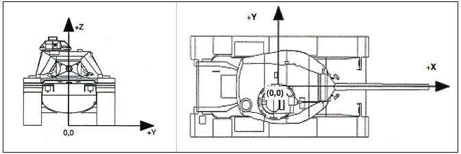

+
.Coordinate axes of a nonturreted ground vehicle.
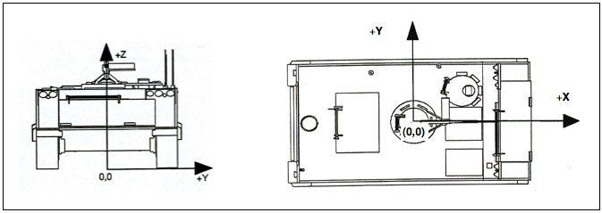

+
.Coordinate axes of a fixed-wing aircraft.
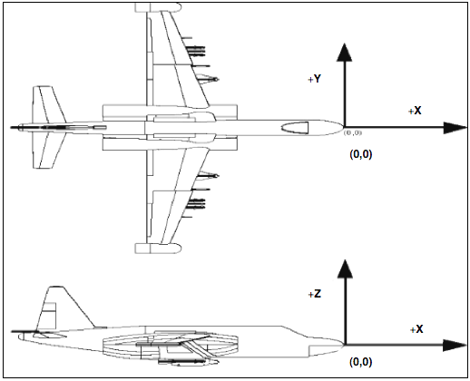

+
.Coordinate axes of a rotary-wing aircraft.
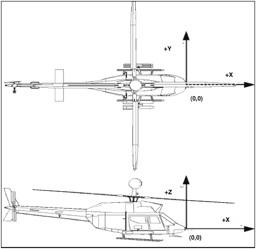

* _Build multiple occurrences of objects in the most advantageous manner:_ Sometimes a modeler will have to make several occurrences of an object. For example, imagine modeling a box of new, identical pencils. Wouldn't it be convenient to take advantage of the similarities involved? There are two basic techniques for constructing such collections. The first involves actually replicating geometry; the second involves referencing shared geometry.
+
Regardless of the technique used, the modeler typically starts by creating a prototype of the object. In the first technique (illustrated in Figure 10), the modeler creates complete copies of the object to be replicated. Each copy is then positioned within the model. In the second technique (illustrated in Figure 11), a "reference" combination that contains only the prototype is created. This combination is then positioned within the model.

+
As shown in Table 7, there are trade-offs to be considered when using each of these approaches. Construction effort is one of them. If the prototype consists of many objects or layers of structure, replication could be a tedious task. In the box of pencils, for example, all of the structure of the pencil would have to be duplicated, including the wood, eraser, barrel, and lead. On the other hand, if the referencing approach is used, then a relatively minor amount of work is needed to create the multiple occurrences.

+
.Building multiple occurrences through replication.
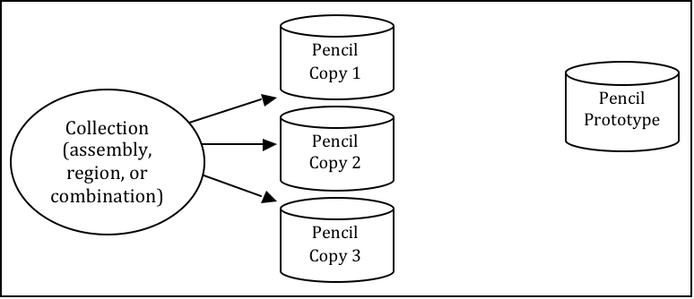

+
.Building multiple occurrences through referencing.
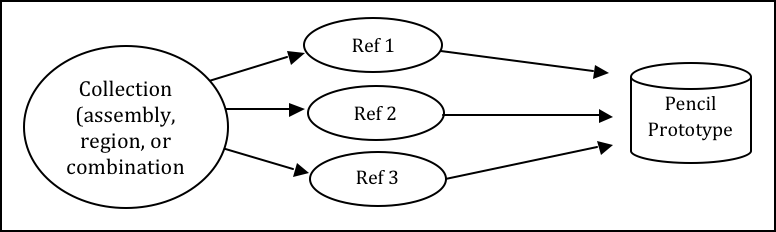

+
.Advantages and disadvantages of replication vs. referencing.
[cols="3*"]
[%noheader]
|===
|Duplication Method
|Advantages
|Disadvantages
|Replication
|No matrices. ; Faster prep time for raytracing. 
|More effort to construct. ; Loss of update relationship between occurrences. 
|Referencing
|Easier to create. ; Changes to prototype propagate to all occurrences. ; Uses less disk space when creating many occurrences of complex objects. 
|Does not provide a unique object, which is required by some analysis codes. ; Prototype parameters do not reflect location and orientation of an individual reference. 
|===

+
Also, if the modeler wants to make a change to all of the objects (e.g., sharpening the point of the pencil), then the referencing approach has definite advantages. The prototype object is edited to incorporate the change, and all occurrences automatically reflect that change. However, if only one object is to be modified, then a copy of the prototype must be made, and the reference for that item must now refer to the copy. Not surprisingly, when this type of operation is to be performed often, the replication approach has definite advantages over the referencing approach.

+
Referencing also has the advantage that it can reduce the amount of disk space needed to store multiple copies of complex objects. The extra space needed to store each new occurrence on disk consists of the transformation matrix and the name of the object and reference combination. This can be significantly smaller than the replication of all the geometry that makes up the prototype.

+
It should be noted, however, that because some analysis codes require a unique identifier for each object in the database, some agencies require that all occurrences be replicated to the primitive level without matrices.

+
There are several other tools that can make the duplication process easier--namely, the Build Pattern tool and the keep and dbconcat commands. The Build Pattern tool, which is discussed in Appendix E, can help the modeler automatically generate multiple copies of geometry in rectangular, spherical, or cylindrical patterns. The keep command can be used to save portions of geometry, and the dbconcat command can be used to concatenate (add) them to other geometries or reinsert them into the existing database as copies.

* _Use the push command to eliminate matrices from replicated geometry:_ When the replication technique has been used to copy a particular piece of geometry, the *push* command is frequently used to walk the geometry tree from a specified top to the primitive level and collect the matrix transformations (i.e., any translations, rotations, or scales applied to the new assembly using matrix edits). The push command applies the matrix transformation to the parameters of the primitives, eliminating the need for storing the matrices. One disadvantage of this operation is that any local coordinate system used in constructing objects is lost.
* _Use the best method for exporting and importing pieces of a database:_ Sometimes a modeler will want to save a portion of a model to be added to another database, to be reinserted into the original database as a copy, to be saved for future use, or to be edited as a new database (e.g., using a crew member or engine from one database in a different database). There are two commonly used methods to export and import geometry in BRL-CAD: (1) using the keep and dbconcat commands from the command line, or (2) using the export and import commands from the GUI.
+
For the first method, the keep command exports data either creating a new database file or appending objects to an existing database. The form of the command is as follows:

....

mged>  keep filename.g object(s)
	    
....

The *dbconcat* command adds the contents of an existing database file to the database currently open. The user may import the database as is or choose to rename each element of the geometry by specifying a prefix. The user may alternatively use the -s or -p option to add a computer-generated suffix (-s) or prefix (-p). The form of the command is as follows:

....

mged>  dbconcat [-s, -p] filename.g [prefix]
	    
....

As mentioned previously, every BRL-CAD object must have a unique name; however, when combining geometry from more than one database, there may be duplicate names (especially if a modeler uses standard naming conventions in all of his models). If there are name collisions, the package will automatically add computer-generated prefixes to the duplicate items in the concatenated geometry. The default prefix names are of the form A_, B_, C_, etc. Note that these prefixes will not be added to the member names in existing combinations in the database. This allows the user to edit or remove this geometry independently of existing data, preventing unintentional overwriting of the existing database items.

+
Another way to move data to and from separate databases is by using the export and import commands in MGED's GUI. Located under the File menu, these commands allow the user to choose either ASCII or binary objects. They perform the same functions as their command-line counterparts. (When exporting, if no objects are selected, the default objects will be any that are currently displayed in the graphics window.)

+
It is good modeling practice to check for duplicate names before inserting new geometry into your database. To check for duplicates, use the dup command from the command line. This command compares external database file object names with current database file object names and reports duplicate names. The form of the dup command is as follows:

....

mged>  dbconcat [-s, -p] filename.g [prefix]
	    
....

Note that there is currently no GUI equivalent to the dup command.

* _Keep bounding primitives as small and compact as possible:_ Although it is possible to use large primitives to achieve intersected or subtracted shapes in BRL-CAD (e.g., using a large sphere to create the relatively flat curve of a radar dish), using bounding or subtraction primitives that extend significantly beyond the outer boundaries of the positive volume of the region is generally not recommended because it slows down raytracing applications and can make wireframe geometry more difficult to view, especially in a complex database.
+
Imagine that a user wants half of a sphere for the target geometry (see Figure 12). In some cases, the user might want to use a large primitive that already exists in the database because it is in the proper location/orientation or because it requires no edits. The user should recognize, however, that whenever this object is rendered, any rays that pass through the large bounding primitive will have to do the extra calculation to determine whether or not the ray is in the positive volume for that region (see Figure 13). Therefore, whenever possible, the use of smaller, more compact bounding primitives is recommended (see Figure 14).

+
.Target geometry.
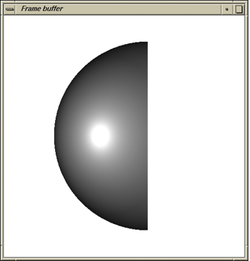

+
.Example of an Overly Large Bounding Primitive.
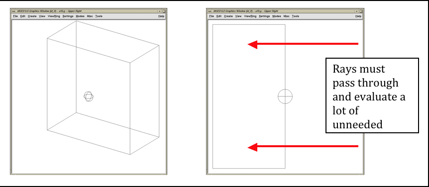

+
.Example of a compact bounding primitive.
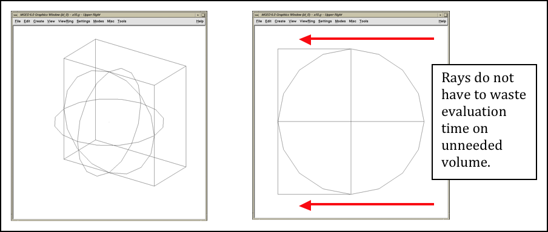

+

[NOTE]
====
The half space is a prime example of an overly large bounding primitive. Because its extent is infinite, it is always larger than needed. Therefore, whenever possible, the modeler should use an arb8 or other primitive that can be dimensioned to meet the modeling needs.

====

* _Consider the possibility of articulations, animations, and presentations:_ Sometimes models need to be able to simulate movement in parts and personnel or to show unique views for presentation purposes. Unfortunately, the modeler (or even the user) cannot always predict all the possible uses at the outset of a project. Therefore, it is wise, especially in organizations that use many different types of model applications, to try to design and build models with the thought that they may need to be articulated, animated, or presented in different configurations at some point.
+
For articulation and animation, this generally means that objects that normally move together (e.g., components on a helicopter rotor, tank turret, etc.) should be grouped together in assembly combinations (as shown in Figure 15).

.Example of grouping objects for articulation.
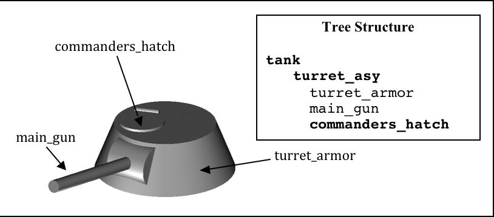

In the example shown in Figure 15, we would want to create a turret_asy assembly with turret_armor, main_gun, and commanders_hatch in it.

+
Also, as discussed in Lesson 16 of Volume II (Butler et al., 2001), specialty models or assemblies can be made to simulate changes in model configuration (e.g., personnel hatches opened/closed, crew compartments occupied/unoccupied, fuel tanks full/half full/empty, etc.) or to show views not normally seen (e.g., transparent skin or cross-sectional cutouts to show internal components, similarly colored components to show subsystem categorization, etc.). Specialty models usually involve copying the original model or assembly, altering the copy to achieve the special effect, and then substituting in the copy as needed.

* _Understand and use Boolean operations properly:_ Because Boolean operations play such a vital role in building geometry, it is important that the modeler possesses a good understanding of them. As shown in Table 4, a combination is the BRL-CAD database record that stores Boolean operations. It can take one of three forms:

** _Primitive shape combination_ - a combination that intersects, subtracts, or unions primitive shapes. This combination does not actually occupy 3-D space.
** _Region_ - the lowest-level combination that assigns material properties to geometry and occupies 3-D space. Because it is impossible for two or more objects to occupy the same physical space, it follows that one region cannot be unioned into or intersected with another region (e.g., a wheel cannot occupy the same space as the axle that connects to it). Conversely, subtraction is valid (e.g., subtracting a wall-mounted radio from the wall on which it hangs). For a reminder of how Boolean combinations work, see Figure 16.
** _Assembly combination_ - a type of combination that associates two or more regions or other combinations together.

+
+
.Sample Boolean operations.
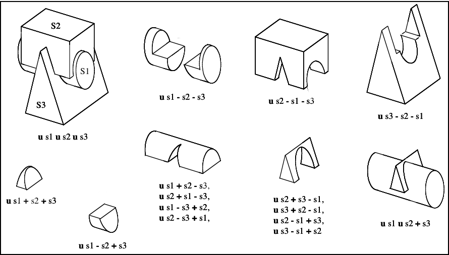

+
Combinations can be created with a variety of commands, depending on the user's requirements. These commands include the following:

** _comb_ - creates a combination using Boolean expressions in GIFT footnote:[Geometric information for targets (GIFT) is the single-level operator hierarchy format that is the traditional (and default) notation used in BRL-CAD.] format. Proceeding left to right, intersections (+) and subtractions (") are performed before unions (u). For example, the command

....

comb comb_name u a - b + c
		
....

is evaluated as

....

((a - b) + c).
		
....

** _c_ - creates a combination using parenthetically ordered Boolean expressions. Where no order is indicated, intersections are performed before subtractions or unions, and then subtractions and unions, which have equal precedence, are performed left to right.
** _r_ - creates a region out of primitive shapes or assembly combinations using Boolean expressions in GIFT format. Unless the user specifies otherwise, default region ID, air code, line-of-sight density, and GIFT material values are assigned.
** _g_ creates a combination by automatically unioning all user-specified elements together. Thus, this command does not accept any sort of Boolean operators from the user.footnote:[The *g* command is derived from “group,” the term sometimes used for _assembly combination_.]

+
+
In addition, there are several general recommended practices when dealing with Boolean operations. They are as follows:

** _Start with a positive volume:_ The modeler must start with a positive volume before any subtraction or intersection operations are performed. If you are using GIFT notation, this means that you must start with a union operator. If you are using fully parenthesized standard notation, this means that you must specify an object before specifying a subtraction or intersection from it.
** _Be mindful of the order of Boolean operations:_ The modeler should make sure unions, intersections, and subtractions are properly ordered in the region structure to achieve the desired effect. For example, imagine that a modeler wants to subtract a hole in a region named bolt.r. As shown in Figure 17, if that region consists of two unioned primitives--head.s and shaft.s--the subtraction in the region must follow the shaft primitive. Alternatively, if the hole is subtracted from the head, the subtraction will have no effect because head.s and hole.s do not share any volume.

+
+
.Properly (top) and improperly (bottom) ordered regions.
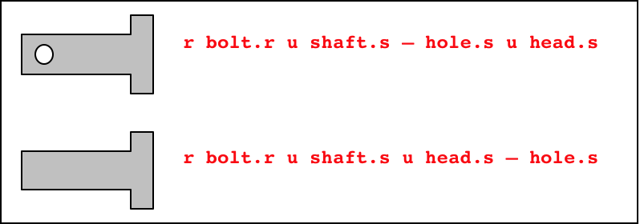

+

[NOTE]
====
Note that in BRL-CAD releases 6.0 and later, fully parenthesized Boolean expressions are available for the c command. This allows the user to designate operator precedence on the command line based on standard parenthetical notation as opposed to the order-of-occurrence and union-last methodology, which is the previously described functionality in BRL-CAD.

====

* _Follow or develop standardized conventions for colorizing objects:_ When displaying a complex model, it is sometimes difficult for the user to visually differentiate one system, subsystem, or component from another. Also, it is not always clear as to which components belong to which systems/subsystems. Therefore, if possible, it is good practice to follow a standardized RGB (red-green-blue) color scheme for commonly modeled/analyzed systems (e.g., engine, suspension, communications, etc.).
+
Table 8 shows some RGB colors traditionally used in MGED (out of a possible 17 million color combinations between black [0 0 0] and white [255 255 255]) (Applin et al., 1988). Table 9 shows some commonly used system-color assignments for various ground and air target descriptions (as drawn in a graphics display window with a black background) (Robertson et al., 1996; Winner et al., 2002).

* _Take advantage of advanced/automation modeling tools:_ BRL-CAD offers many tools that can help users perform advanced functions or automate complex or tedious aspects of the geometry development process. Examples of some these tools, which are discussed in Appendices A-F, include the pipe primitive (which can automate the building of wiring or hydraulic lines), the projection shader (which can paste words or images onto geometry instead of having to build them), the extruded bitmap (which can turn two-dimensional objects [e.g., a building floor plan] into 3-D geometry [e.g., walls]), the .mgedrc file (which can create customized shortcuts for many MGED operations), the Build Pattern tool (which can automatically replicate objects in a specified pattern), and the build_region command (which can automatically build regions by grouping together similarly named objects).

[[mgedcolors]]
.Traditionally used MGED colors.
[cols="2*"]
[%noheader]
|===
|Color
|RGB Value
|Aquamarine
|112 219 147
|Medium aquamarine
|50 204 153
|Black
|0 0 0
|Blue
|0 0 255
|Cadet blue
|95 159 159
|Corn flower blue
|66 66 111
|Dark slate blue
|107 35 142
|Light blue
|191 216 216
|Light steel blue
|143 143 188
|Medium blue
|50 50 204
|Medium slate blue
|127 0 255
|Midnight blue
|47 47 79
|Navy blue
|35 35 142
|Sky blue
|50 153 204
|Slate blue
|0 127 255
|Steel blue
|35 107 142
|Coral
|255 127 0
|Cyan
|0 255 255
|Firebrick
|142 35 35
|Gold
|204 127 50
|Goldenrod
|219 219 112
|Medium goldenrod
|234 234 173
|Green
|0 255 0
|Dark green
|47 79 47
|Dark olive green
|79 79 47
|Forest green
|35 142 35
|Lime green
|50 204 50
|Medium forest green
|107 142 50
|Medium sea green
|66 111 66
|Medium spring green
|127 255 0
|Pale green
|143 188 143
|Sea green
|35 142 107
|Spring green
|0 255 127
|Yellow green
|153 204 50
|Dark slate gray
|47 79 79
|Dim gray
|84 84 84
|Light gray
|168 168 168
|Khaki
|159 159 95
|Magenta
|255 0 255
|Maroon
|142 35 107
|Orange
|204 50 50
|Orchid
|219 112 219
|Dark orchid
|153 50 204
|Medium orchid
|147 112 219
|Pink
|188 143 143
|Plum
|234 173 234
|Red
|255 0 0
|Indian red
|79 47 47
|Medium violet
|219 112 147
|Orange red
|255 0 127
|Violet red
|204 50 153
|Salmon
|111 66 66
|Sienna
|142 107 35
|Tan
|219 147 112
|Thistle
|216 191 216
|Turquoise
|173 234 234
|Dark turquoise
|112 147 219
|Medium turquoise
|112 219 219
|Violet
|79 47 79
|Blue violet
|159 95 159
|Wheat
|216 216 191
|White
|255 255 255
|Yellow
|255 255 0
|Green yellow
|147 219 112
|===

[[system-color-codes]]
.Commonly used system-color codes.
[cols="3*"]
[%noheader]
|===
|System
|Color
|RGB Value
|Crew/passenger
|Tan
|200 150 100
|Exterior armorfootnote:[Army green (RGB 42 98 48) is recommended for white backgrounds (e.g., printouts). ]
|Gray
|80 80 80
|Fuel system
|Yellow
|255 255 0
|Armament (not ammunition)
|Gray
|80 80 80
|Propellant
|Magenta
|255 0 255
|Projectiles
|Red
|255 0 0
|Engine/propulsion
|Blue
|0 0 255
|Oil Lines/hoses
|Light brown
|159 159 95
|Coolant lines/hoses
|Green
|0 255 0
|Air lines/hoses
|Blue
|0 0 255
|Drivetrain
|Cyan
|0 255 255
|Driver/flight controls
|Dark blue
|50 0 175
|Suspension/rotor blades
|Gray
|80 80 80
|Tracks
|Dark brown
|104 56 30
|Tires/roadwheel rubberfootnote:[Black (RGB 0 0 0) is recommended for white backgrounds (e.g., printouts). ]
|Gray
|80 80 80
|Electrical
|Forest green
|50 145 20
|Hydraulics
|Pink
|255 145 145
|Communications/mission equipment package
|Lime green
|50 204 50
|Fire control
|Peach
|234 100 30
|Fire suppression
|Dark red
|79 47 47
|===

[NOTE]
====
A Final Word About Modeling Ease vs. Modeling PrecisionModelers can be tempted to use the "quickest" methods of creating and aligning objects (e.g., using mouse clicks to size objects and the shift/control grips and "eyeballing" to position them).

However, using precision MGED tools (e.g., the analyze and extrude commands, the snap-to-grid feature, etc.), listing primitives, making temporary assemblies, etc., is often more efficient. In addition, as the user becomes more familiar with these tools and features, they become easier to use. For more information on these specific features, see the appropriate on-line help in MGED.

====

== Evaluating Geometry

Evaluating geometry for correctness is an important companion to building real-world models. In fact, without testing the validity of the geometry's positioning and composition, the modeling process has not actually been completed. Evaluation is performed at the following two times in the modeling process: (1) after individual objects are built and organized into regions and combinations, and (2) after the model is completely built. In both cases, the primary evaluation goal is to identify any errors in measurement, logic, or input that would make the model invalid or unrealistic.

One common error that the evaluation process reveals is overlapping geometry. Overlaps are the physical violation that occurs when two or more objects (regions) occupy the same volume in space. While this condition is occasionally acceptable (e.g., when modeling air volumes), it creates inaccuracies when the geometry is later analyzed.

[NOTE]
====
Because all of the volume within a region is considered to be one material, it is acceptable for primitives within a region to "overlap" without error (e.g., spheres rounding cylinder ends). However, it is good modeling practice to minimize this wherever practical to simplify Boolean logic and keep primitives as compact as possible.

====

Shotlining is the principal method of interrogation in BRL-CAD. Rays are fired through geometry to report information about material properties, thickness, orientation, etc., of objects encountered along each ray's path (see Figure 18).

.Shotline through a tank.
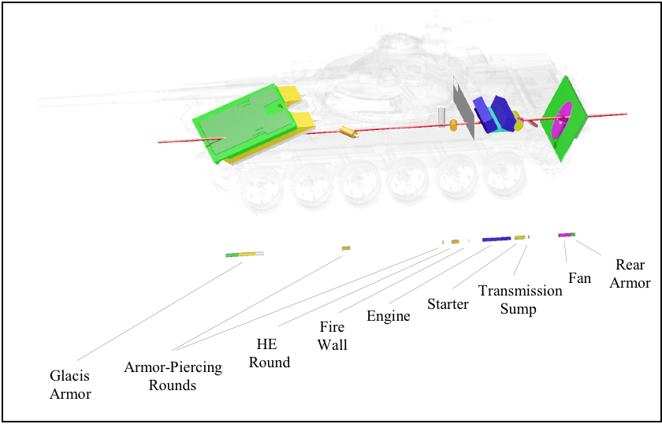

There are several ways to evaluate BRL-CAD geometry. These include (1) rendering the image using rt, (2) checking for overlaps using rtcheck (or the lesser-known/used glint or MGED's overlap tool), and (3) checking for faulty material composition (e.g., densities) using rtweight.

Generally, as soon as a region is completed, it is good practice to raytrace it using rt. This allows the user to visually verify that all Boolean logic is correct and that the geometry has no obvious problems. If there is anything questionable, it can then be examined more closely with a raytrace that highlights that particular area. Note that rendering is also a good way to compare geometry with drawings, sketches, photographs, or images from other CAD systems.

As subcomponents are organized into assemblies and the complexity of the geometry increases, it is then a good practice to use rtcheck (or glint or the overlap tool) to help find any errors in the geometry and isolate any problems.

The rtcheck feature is a program run from the MGED command line or shell command line that fires a grid of rays through a list of objects in order to check for overlapping geometry. It reports a total count of the overlaps and a list of overlap pairs, a listing of the paths to the regions, the number of overlaps between each pair, and the maximum depth in millimeters. This is followed by a summary of the total number of overlaps, the number of unique overlapping region pairs, and a listing of all overlapping regions.

When run from within MGED, overlaps are displayed in the graphics display as yellow lines (see Figure 19). These yellow lines are created as temporary database objects and are stored in a combination called OVERLAPSffff00 ("ffff00" is hexadecimal notation for yellow [255 255 0]). Note that these temporary objects cannot be edited or saved and last only as long as they are not erased from the MGED display or are not overwritten by another set of overlaps.

After these lines have been created in the display, the user may use them as a visual reference to analyze the overlaps. A good practice is to erase geometry (e.g., the top-level item) and draw smaller subcomponents (perhaps just a few of the overlapping regions) to see more clearly where and what the problems are. When doing this, note that the zap (Z) and blast (B) commands should not be used until the evaluator is finished with the yellow lines as a visual reference. The user should also keep in mind that the rays are difficult to see from the azimuth/elevation orientation from which they were shot. To see them clearly, one should change the azimuth/elevation to another orientation.

To get the output shown in Figure 20, the "all" assembly was displayed in the graphics window and "rtcheck" was typed in the command window.

This command could also be run from outside of MGED. The command "rtcheck" is typed at a shell prompt, followed by the file name and the list of objects to be evaluated (in this case, "all"). Note that when running rtcheck from outside MGED, the default parameters include a top view and a grid size of 512 × 512 cells (which is the default size for all rt operations). For more details, see the on-line man page on rt.

.Example of overlaps in the graphics window.
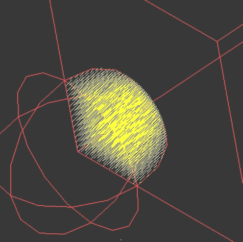

[NOTE]
====
When first checking larger assemblies, it is wise to use a relatively low-resolution rtcheck grid size--say, 128 × 128 pixels. Often, there are simple errors that produce large numbers of overlaps, and reporting them all takes a long time. Starting with low resolution, however, allows the user to quickly find and eliminate gross errors and proceed to the insidious small overlaps using a tighter grid and more specific view parameters.

====

.Example of an overlap report in the command window.
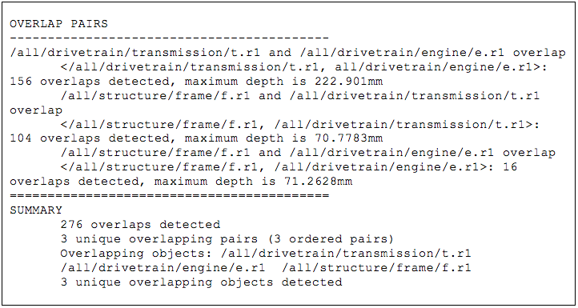

Another tool that can be useful for evaluating geometry, especially target descriptions, is rtweight. During or after model development, material codes and effective percentages can be assigned to the appropriate regions/ combinations based on the known materials and weights of actual components, subsystems, and systems. The rtweight feature can then be used to calculate volume and material densities and provide the overall weight of the model. This information can, in turn, be compared with the weight of the actual object to see if the two match. If they do not, chances are that there is a problem in the model's material property assignments or construction (e.g., a hollow component was modeled as solid). For a list of standard material codes and air codes and their associated densities, see Robertson et al. (1996) and Winner et al. (2002).

In addition, the following are some general tips regarding the evaluation of geometry in BRL-CAD:

* _Evaluate early and often:_ As mentioned previously, evaluations should be performed both on individual objects as they are built and on sections of the model as they are assembled. In general, problems identified early are more easily isolated and fixed than if "buried" in a host of other problems. Early and continuous evaluation also reduces the amount of evaluation that needs to be done at the end. Final evaluation at the end helps ensure that the individual pieces are all working together in the model.
* _Evaluate at low resolution before high resolution:_ Especially in large and complex models, running rtcheck at high resolution can be computation- and time-intensive. Therefore, it is recommended that the modeler initially set a lower number of rays to be fired, fix any significant overlaps, and then increase the number of rays and/or zoom in on particular areas as fewer overlaps are found.
* _Use multiple views:_ Because rtcheck finds overlaps by firing individual rays at geometry, it can miss overlaps that occur between rays (e.g., when viewing a face edge-on or with low obliquity). Therefore, to ensure the highest evaluation accuracy possible, it is a good idea to use several of BRL-CAD's standard views (e.g., top; az 35, el 25; etc.) as well as at least one arbitrary or randomly selected view (e.g., az 72, el 23).
* _Set the proper eye point:_ It is also possible for a user to miss detecting overlaps when the eye point is set in the middle or front of an object (e.g., when Z clipping is turned on). This does not mean that rtcheck is not catching them; it just means that they are not being displayed. So, before an evaluation is run, it is recommended that Z clipping be turned off and the eye point be sufficiently offset from the geometry so that the rays intersect the entire breadth of geometry or portion of geometry the modeler wants to evaluate and display.
* _Chunk big problems into smaller problems:_ Experienced modelers in BRL-CAD know that "killing" overlaps is simply a part of the modeling process. However, dealing with large amounts of overlaps can be overwhelming, especially to a new modeler or a modeler who has carefully built each piece and expects rtcheck to find few, if any, problems. Fortunately, in many cases, what appears to be extensive overlapping might just be one section of geometry (e.g., a wall of buttons and switches) that is slightly out of position, and a simple translation or rotation can simultaneously fix many problems. In other cases, overlaps are the result of simple miscalculations (e.g., a 2-in vs. a 1.5-in radius) that are not likely to be noticed until positioned with surrounding geometry. Whatever the case, the best approach to extensive overlaps is not to try to fix them all at once but to divide the problem into smaller problems, concentrate on individual pieces, and use the display to help identify and fix errors. For example, rather than starting with "all," start with, say, "engine," and then add "chassis." One can then continue this process and work up to evaluating the entire model.

== Logging Documentation

The final step in the modeling process--documentation--is extremely important and can mean the difference between models that are useful for a week and models that are useful for years to come. Thorough, well-planned documentation is key to the user/analyst being able to effectively use what the modeler has spent many hours building. Sloppy or incomplete documentation, on the other hand, is like finishing up an otherwise well-built house with a bad paint job. It can serve to cover up all the good work the modeler has done and give the end user the false impression that bad documentation is an indicator of bad measurement, organization, development, and/or evaluation.

Fortunately, when included in the planning process, good documentation is easy to produce. Once again, the way one sets up and produces documentation is highly dependent upon the purpose of the model. There are several questions the modeler (who now takes on the role of technical writer) must address to assist the end user(s):

* Who will be using the model?
* What are the user(s) going to do with the model and why?
* What information can I give about the model that might save the user some time or frustration?

Documentation can exist in several different forms. It can be a comprehensive chronological or topical summary of the project as a whole. It can be attribute tags (which are available in BRL-CAD 6.0 and later releases) about individual shapes and regions. Or it can be just some notes to help the user work with the model (e.g., to explain how to show articulation).

Regardless of the type of setup, the following recommendations are made to achieve effective model documentation:

* _Tell what it's got and what it's not:_ It is useful to record not only what components have been included in the model but also what components/details have not been included (and why). This will remove doubt as to what the end user does and does not have.
* _Tell the purpose of the model:_ Although the primary end user may know exactly what the intended application of the model may be, the documenter should consider the possibility of other users becoming involved during a model's lifetime. Furthermore, these users may not know the model's original purpose and may try to use the model in a way in which it was not intended. The documentation should explain the choices the modeler made as well as identify, if applicable, ways in which the model has been designed for articulation and/or animation.
* _Tell when it was built:_ This information identifies the time period during which the model was built. This information can be especially important when modeling developmental items with continuously changing design or model specifications. If a model undergoes a radical redesign during any stage of the development process, the period of performance can help identify why the model does or does not reflect given redesigned components as well as identify when changes were implemented.
* _Tell from what sources it was built:_ It is important to note the type of data sources from which the model dimensions were collected (i.e., field measurements, special tools, mechanical drawings, or converted geometry). If a modeler physically measures an object, it is also important to note any specific manufacturing information (e.g., make and model, year of production, factory, etc.), any special designators or insignias, and any damaged or missing items.
* _Tell how it was built:_ This information records the significant techniques and configurations that were used to build the given geometry as well as any irregular or specialized constructions (e.g., for articulation, an intended ballistic impact scenario, etc.). Also included here are basic tree structures and any naming conventions used.
* _Tell the level of detail to which it was built:_ This information documents the specific tolerances and level of accuracy used to construct the model, as well as ways in which accuracy was checked (e.g., rtcheck and rtweight).

Documentation is often written at the end of the modeling project and published as a formal technical or summary report. Another good method is to document significant items as they are encountered throughout the modeling process. This practice records important information while it is fresh in the mind of the modeler as well as reduces the amount of writing required at the end of the project (when energy and/or interest levels may be low).

Finally, it is a good idea to embed the documentation (e.g., as a text file) directly into the database so that it always remains connected to the geometry it addresses. For example, the command

....

dbbinary -i u c documentation /home/fred/doc.txt
       
....

will create a BRL-CAD binary object named documentation, and the object will contain the text from the file named /home/fred/doc.txt .

== Bibliography

References* JohnSmith1988Somebody_Placeholder until xincludes from bibliography file are set up_sometitle000-999
[appendix]
== Using the Pipe Primitive

[[pipe_general_use]]
=== General Use

* *Fewer primitives and Booleans.* One pipe primitive can effectively represent hundreds of cylinders and tori with their associated subtraction and bounding primitives. This means fewer parameter values to define and simpler regions.
* *Easier editing.* Because the pipe is just one primitive, extending it, hollowing it out, or otherwise changing its parameters can be easily and efficiently performed without having to edit many primitives. Unfortunately, seemingly simple edits to combined geometry can often require not-so-simple changes/calculations associated with the underlying primitives.

Although a pipe is a single primitive (regardless of how long it is and how many bends it has), geometrically, it is effectively a series of cylinders connected by torus sections. As illustrated in Figure A-1, the pipe must have a minimum of two end points (shown in blue). Between the end points can be any number of other points (shown in red) to designate bends in the pipe or changes in pipe diameter. All points (including end points) contain information to define the bend radius, outer diameter, and inner diameter.

To build a pipe, points can be appended after a given point, prepended before a given point, moved, or deleted; and the parameters at each point can be independently edited at any time.

One potentially confusing aspect of the pipe is that bend points do not always lie along the pipe's path. This is because the bend radius dictates the path of the pipe between points. As shown in Figure A-2, which depicts the same pipe with three different bend radii, a small bend radius means the bend point will be closer to the path of the pipe, and a large bend radius means the point will be farther away. Also, because a bend is computationally equivalent to a section of torus, each point is constrained to accept only those bends that are consistent with the parameters of a torus (e.g., the user cannot specify a bend radius that is so small that it violates the defined characteristics of a torus).

In addition, because they are defining turns, points in a pipe are often nonlinear. However, as shown in Figure A-3, collinear points can also be used when a modeler simply wants to achieve a tapered or "stepped" inside or outer diameter on a straight-running tube. Examples of other potential uses include a notched axle on a vehicle, a pressed gear fitting, and a tapered end on a garden hose.

.Basic pipe with parameters.
image::../articles/images/pipes_fig01.png[]

.Various bend radii.
image::../articles/images/pipes_fig02.png[]

.Example of special uses of the pipe.
image::../articles/images/pipes_fig03.png[]

Nonetheless, it is good modeling practice to build your pipe with only those points needed to define its shape. It is not necessary to add extra collinear points along a long straight section of pipe. Note too that pipes are not required to have hollow volume in them at all. The modeler can set the inner diameter to 0 and achieve a solid shape.

Modelers should remember that when a pipe is made with the *make* or *create* command, the default values for the previously listed parameters are based upon the size of the view in the graphics window when the pipe is first created. This is important because modelers can sometimes find themselves unable to move or delete certain points due to relatively large bend radii (e.g., that might have been established when the pipe was first created in a relatively large graphics window). These large radii constrain the shape and prevent it from accepting mathematically invalid commands (e.g., a larger inner diameter than outer diameter or an unacceptably tight bend radius).

[[pipe_make_coil]]
=== Making a Coil

In addition to using the pipe primitive to make tubular objects such as electrical and hydraulic lines, it can be used to make other types of objects.

Consider, for example, the building of a wire coil. The pipe primitive can reduce the complexity of the process by avoiding some of the difficulties associated with combining geometry.

The main challenge of using the pipe to build a coil is to locate where the points should be in order to achieve the properly dimensioned geometry. We can start with the following measured dimensions:

* *Diameter of the coil* - The critical measurement here is the center-to-center measurement. It is difficult to measure this directly, but it can be easily derived from an outside-to-outside measurement by subtracting the wire diameter.
* *Diameter of the wire* - This will define the outer diameter (or gauge) of the pipe.
* *Height per coiled section* - The best way to derive this measurement is to take a total measurement of the coil sections and divide by the number of turns. This will ensure the total height and number of turns are correct and will allow one to measure to the tolerance of his tool with minimal error.

In the example shown in Figure A-4, the coil diameter is 1/4 (0.25) in, the wire diameter is 1/32 (0.03125) in, and the height of each of the 10 coil sections is 7/32 (0.21875) in.

.Determining the point positions for the copper coil.
image::../articles/images/pipes_fig04.png[]

The key to properly and precisely positioning points to build a coil section is to use half of the coil diameter as an offset. The first and the last points in the coil must lie on the pipe's path. These points are easily determined at 90°intervals from the center of the pipe (or, with a bit of trigonometry, at any interval). The rest of the points for the pipe are located at ±offsets in whichever plane is perpendicular to the pipe height vector from the center of the pipe with the proper height delta (which will generally be 1/4 of the height per coil section).

Obviously, the construction of this type of object is a little more advanced than the construction of many of the other types of objects discussed. Thus, the following text provides the user with step-by-step instructions that can also serve as a kind of template when using the pipe primitive to build a coil or similar object.

To build two turns of a coil at the origin with a coil diameter of 1000 mm, a wire diameter of 200 mm, and a coil height of 400 mm (running along the +Z axis), the user would perform the following steps (or ones similar to them):

* Set the units to millimeters using the *units* command on the command line (`mged>units mm`) or the Units option in the graphical user interface (GUI) (File -> Preferences -> Units).
* Set the screen size to 2000 using the *size* command (mged>size 2000) and center the screen at 0 0 400 using the *center* command (mged>center 0 0 400).
* Create a pipe named spring.s1 using the *make* command (mged>make spring.s1 pipe) from the command line or the Create option from the GUI. Select the pipe for editing using either the *sed* command (mged>sed spring.s1) or the Enter Primitive Name dialog box.
* With the default pipe in edit mode, set the diameter of the wire. To do this, first set the inner diameter of the wire to 0 by using the Edit menu's Set Pipe ID option and the *p* command on the command line (mged>p 0). Next, set the outer diameter to 200 using the Set Pipe OD option and the p command (mged>p 200). (Be sure to set the Pipe inner diameter [ID] and outer diameter [OD], not the Point ID and OD.)
* Set the pipe bend to 500 mm using the Edit menu's Set Pipe Bend option and the *p* command (mged>p 500).
* Translate the pipe to coordinate 0 500 0 by selecting the Edit menu's Translate option and the *p* command (mged>p 0 500 0).
* Choose the Edit menu's Select Point option and use the center mouse button to click on (or near) the top of the pipe segment.
* Move the top end point to 500 500 50 using the Edit menu's Move Point option and the *p* command (mged>p 500 500 50).
* Add points at the following coordinates using the Edit menu's Append Point option and the *p* command (the visual effect for each of the commands is shown to the right of each command):

[cols="2*"]
[%noheader]
|===
|- mged>p 500 -500 150
|image:../articles/images/pipes_fig05.png[]
|- mged>p -500 -500 250
|image:../articles/images/pipes_fig06.png[]
|- mged>p -500 500 350
|image:../articles/images/pipes_fig07.png[]
|- mged>p 500 500 450
|image:../articles/images/pipes_fig08.png[]
|- mged>p 500 -500 550
|image:../articles/images/pipes_fig09.png[]
|- mged>p -500 -500 650
|image:../articles/images/pipes_fig10.png[]
|- mged>p -500 500 750
|image:../articles/images/pipes_fig11.png[]
|- mged>p 0 500 800
|image:../articles/images/pipes_fig12.png[]
|===

The raytraced image of the coil segment is shown in Figure A-5.

.Raytraced coil segment.
image::../articles/images/pipes_fig13.png[]

[NOTE]
====
Important Points to Remember About the Pipe
* Even the end points of a pipe have a bend radius (although it is not used unless the point is changed to an interior point).
* Each bend radius value must be greater than half the value of its corresponding outer diameter.
* The pipe primitive does not have to be used for hollow tubes. The inner diameter can be 0, making the object solid.
* The bend radius at each point constrains the pipe in such a way that the path of the pipe often touches only end points, not those in between.
* BRL-CAD will not allow points to be added, deleted, or moved if the result of such actions would create pipes with mathematically invalid characteristics.
* Points may not be coincident; they must be offset by at least 0.0001 mm.
* When modeling a tube with fluid inside of it, model both the tube and fluid as solid pipes and subtract the fluid from the tube.

====

[appendix]
== Using the Projection Shader

[[projshader_general]]
=== General

Though the U.S. Army Ballistic Research Laboratory - Computer-Aided Design (BRL-CAD) package has the capability to model highly detailed and complex surfaces of objects, such as the multitude of small chips, connectors, and other electrical components on a circuit board (see Figure B-1), individually building each piece of a complex surface is often labor intensive, time consuming, and unnecessary for the model's intended purpose. Thus, the package offers an alternative, the projection shader, to create realistic-looking "skin" for objects.

.The many components of a circuit board.
image::../articles/images/projection_shader_fig01.png[]

As its name implies, the projection shader projects an image onto a surface. Unlike the texture shader, however, which fits an image to all available surfaces (stretching/shrinking as necessary), the projection shader projects the image with user-defined dimensions and orientations.

There are several ways that advanced users can implement and customize the projection shader in BRL-CAD. The average user can reduce the complexity of the process, however, by complying with the following three basic rules of thumb:

* the image to be projected should be square,
* the geometry window (minus the toolbar and borders) should be square, and
* the projected image should exactly fill the framebuffer.

The following list identifies the basic tasks needed to use the projection shader:

* create/obtain an image to project,
* resize the graphics display window or image so that their dimensions match each other,
* ensure the framebuffer is active,
* display the image in the framebuffer of the graphics display window,
* align the image on the geometry by modifying the view parameters,
* save the projection shader settings file,
* apply the shader settings file to the object in the combination editor, and
* render the image.

Each of these steps is discussed in the following paragraphs using the example of the previously mentioned circuit board.

[[projshader_getimage]]
=== Create/Obtain an Image to Project

The first step in using the projection shader is to create or obtain the image to be projected. The image can be a pre-existing picture file, or it can be created specifically for the projection. In this case, we took a photograph of the circuit board with a digital camera and used a commercially available PC image editor to make the image square. When finished, we saved the image as a .jpg file, with the name circuit_back_950.jpg. (Note that it is wise to include the image dimensions [i.e., 950 pixels wide ×950 pixels high] in the file name because many projection shader tasks rely on them.) To get the image into a BRL-CAD-accepted format (see tutorial box that follows), we converted the .jpg file to a .png file using an image editor and then the .png file to a .pix file using the BRL-CAD png-pix utility. For more information on this utility, consult the man page.

[NOTE]
====
BRL-CAD recognizes several image file formats, including .pix, .png., and .ppm. Because the package relies on precise color values to perform certain calculations, it does not support lossy file formats (e.g., .jpg), which are based on algorithms that can alter or lose image/color data.

====

[[projshader_resize]]
=== Resize the Graphics Display Window to Match Image Dimensions

The next step is to "prepare" the area on which the image will be displayed so that it is ready for the image. For the circuit board, the size of the photograph was 950 pixels ×950 pixels high. To make the graphics display window match, we opened the Raytrace Control Panel and used the numbers in the Size window box as a reference to determine how much to enlarge/shrink the graphics display window (by using the mouse to drag the window borders in or out) (see Figure B-2).

.Using the Raytrace Control Panel to size the graphics window.
image::../articles/images/projection_shader_fig02.png[]

[NOTE]
====
Note that the Raytrace Control Panel (specifically, the Size field) is used here simply to report the result of the user scaling the dimensions of the graphics display area. It is not used to set the desired dimensions (in this case, 950 ×950) of the graphics area by inputting them into the Size field. Any numbers input into this field will only determine the size of the display area in the next raytrace.

Also note that some window managers have information boxes that automatically report the size of the graphics display window as it is being enlarged/reduced; however, the dimensions reported in these boxes often represent the size of the entire window (including toolbars, borders, etc.) and not the size of the framebuffer.

====

[[projshader_actframe]]
=== Ensure the Framebuffer is Active

A small but sometimes overlooked step before displaying any image onto the graphics display window is to make sure the framebuffer is active. If it is not active, it may appear that nothing happens when a display command is given. There are several ways to check the status of the framebuffer. We went to the Settings pull-down menu in the graphical user interface, selected Framebuffer, and made sure the box next to the Framebuffer Active option was toggled on.

[[projshader_dispimage]]
=== Display the Image in the Graphics Display Window

After the graphics display window has been prepared and the framebuffer checked/set, the image can be displayed in the graphics window. To do this, we entered the following command:

....

pix-fb -F0 -s 950 circuit_back_950.pix
      
....

Diagrammed, the command breaks down as follows:

[cols="5*"]
[%noheader]
|===
|pix-fb
|-F0
|-s
|950
|circuit_back_950.pix
|Send a .pix file to a framebuffer.
|Use framebuffer number 0.
|Make it a square image.
|950 pixels wide and high.
|Use the image file named circuit_back_950.pix
|===

For more information on the pix-fb command (including a list of other options the command takes), type pix-fb on the command line or consult the man page.

[NOTE]
====
Note that framebuffers use transmission control protocol (TCP) ports for applications. The framebuffer number that follows the -F option specifies an offset from the TCP port number. Framebuffer 0 is on port 5558. If 0 is already in use, the Multi-Device Geometry Editor (MGED) will use the next available framebuffer number (e.g., 1, 2, 3, etc.). To determine which port MGED is actually using, type "set port" from the MGED command prompt.

====

[[projshader_overlayimage]]
=== Overlay the Image on the Geometry by Modifying the View Parameters

With the image and the target geometry displayed, edit the view parameters so that the image is aligned with the geometry on which it is to be projected. In our case, we used the Shift-Grips to scale and translate and the ae command to adjust the azimuth, elevation, and twist of the circuit board wireframe so that its outside edges lined up with the outside edges of the projected image (see Figure B-3). (For a refresher on the functionality of the Shift-Grips, consult chapter 2, Volume II, of the BRL-CAD Tutorial Series.)

[[projshader_savesettingsfile]]
=== Save the Projection Shader Settings File

After the geometry and image have been aligned, the projection settings (i.e., image file name, image width, image height, and current view parameters) can then be saved to a file using the prj_add command. The prj_add command appends the image file name and the current view parameters to the shader file. In our case, the command was:

....

prj_add circuitboard.prj circuit_back_950.pix 950 950
      
....

Diagrammed, this command breaks down as follows:

[cols="5*"]
[%noheader]
|===
|prj_add
|circuitboard.prj
|circuit_back_950.pix
|950
|950
|Add the projection file name and parameters to the shader.
|Name the shader circuitboard.prj
|Use image file circuit_back_950.pix
|Make the image 950 pixels wide.
|Make the image 950 pixels high.
|===

.Fitting the geometry view to the image dimensions.
image::../articles/images/projection_shader_fig03.png[]

[[projshader_applysettingsfile]]
=== Apply the Shader Settings File to the Object in the Combination Editor

The projection now needs to be applied to the object. We did this by opening the combination editor, typing in the region name cir.r1 in the Name field, and selecting Projection from the pull-down menu to the right of the Shader field. We then typed circuitboard.prj in the Parameter File field and pressed Apply (see Figure B-4). Note that when the name of the shader file is typed into the Parameter File field, the same information is echoed into the Shader field.

[[projshader_render]]
=== Render the Image

The final step in using the projection shader is to raytrace the object to determine if all the other steps have been performed correctly. In our case, rendering the image identified several problems that we wanted to correct. First of all, as shown in Figure B-5, the holes in the board failed to convey the three-dimensional look we desired. So, we went back and modeled circular cutouts (using cylinder primitives) to improve the appearance. In addition, the rendered image revealed that the image we were using was too dark. So, we ended up adjusting the gamma setting on the original image (a .jpg file) in an external photo editor.

.Applying the shader settings with the combination editor.
image::../articles/images/projection_shader_fig04.png[]

.Original image (left) and image with circular cutouts (right).
image::../articles/images/projection_shader_fig05.png[]

[[projshader_projectfront]]
=== Repeating the Steps to Project the Image on the Front

After one side of the circuit board was finished, we proceeded to repeat the steps to add more projection parameters to the .prj file and thus project a different image onto the front side of the geometry (see Figure B-6). To do this, we once again had to acquire an image, properly size the geometry window, display the image and the geometry to the geometry window, and set up view parameters. After this was done, these parameters could be added to the existing .prj file by typing the following:

....

prj_add circuitboard.prj circuit_front_950.pix 950 950
      
....

.The projection shader applied to the front of the circuit board.
image::../articles/images/projection_shader_fig06.png[]

Figure B-7 shows the resulting prj file. (Note that the first projection is on top and the second projection is on the bottom.)

.The circuit board .prj file.
image::../articles/images/projection_shader_fig07.png[]

[appendix]
== Using the Extruded Bitmap Primitive

The extruded bitmap (ebm) primitive allows the user to make a three-dimensional (3-D) shape from a two-dimensional black-and-white image. This feature can be helpful when dealing with complex outlines, text, or other complicated shapes captured as images.

For example, the ebm could be used if one wanted to model 3-D letters, such as in a company name, onto the side of a simulated wall or building. Note also that the same image used for the projection can, with some extra processing, form the basis for the ebm (see Figures C-1-C-3).

[[ebm3]]
.Example of the .bw image used for ebm.
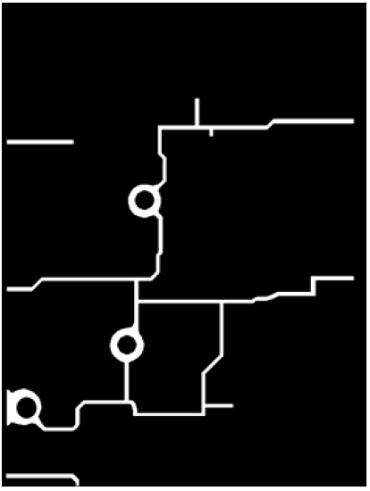

[[ebm4]]
.Example of ebm.
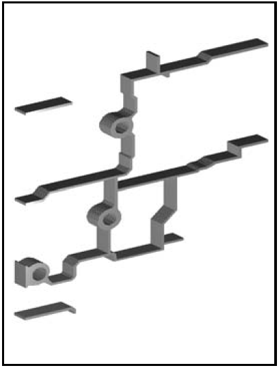

[[ebm5]]
.Example of the ebm with projection shader added.
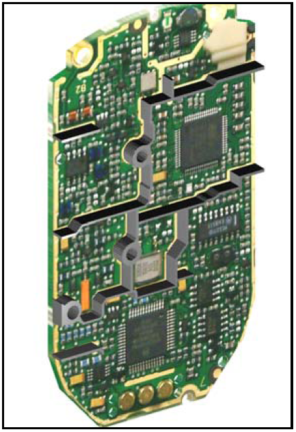

To make an ebm, the image file must be a black and white (.bw) file. A .bw image is a grayscale raw image file with only one channel. Each pixel can be turned on or off, but it has no color data. As shown in Figures C-2 and C-3, the white part of the image may be extruded in a straight line in the +Z direction to whatever length the user specifies. Regardless of the complexity of the geometry, all of the extruded shapes form a single ebm primitive.

To enter an ebm in a database, the in command must be used. The arguments are as shown in the following example:

[[ebm8]]
[cols="7*"]
[%noheader]
|===
|in
|sample.ebm
|ebm
|image.bw
|600
|800
|1
|Make a shape.
|Name it sample.
|Make it an ebm.
|Use the image.bw image file.
|The image is 600 pixels wide.
|The image is 800 pixels high.
|Extrude the shape 1 inch (or whatever working units are in effect at the time) in the +Z direction.
|===

[NOTE]
====
Points to Remember About the ebm
* The ebm cannot be created with the make, create, or inside commands.
* The desired width and height of the ebm are input as pixel values, but the extrusion distance can be expressed in any working units.
* Extrusions are made in the +Z direction, although after an ebm is made, the shape can be rotated, translated, or scaled.
* When extruded, all shapes form a single ebm primitive.

====

[appendix]
== Setting Up a .mgedrc File

Similar to the preferences or settings options in other computer applications, the .mgedrc file is a useful tool to customize the look and functionality of the U.S. Army Ballistic Research Laboratory - Computer-Aided Design (BRL-CAD) package and minimize potentially time-consuming actions. Using Multi-Device Geometry Editor (MGED) commands and the Tcl/Tk scripting language, users can modify default settings, specify features to be toggled on or off whenever MGED is started, establish typing shortcuts for a command or a series of commands, locate and size the command and geometry windows, and perform a host of other customizations.

The command to create/update a .mgedrc file with the graphical user interface (GUI) is found under the File drop-down menu. When the Create/Update .mgedrc command is called, it writes an extensive list (~500 lines) of default settings and comments representing the default state of the command and graphics windows.

As shown in Figure D-1, there are two basic parts to a .mgedrc file: (1) the information before the MGEDRC_HEADER and (2) the information after the MGEDRC_HEADER. The information before the header is any text created by the user. The information after the MGEDRC_HEADER is written by the Create/Update .mgedrc command and is a comprehensive list of the default settings and options for the MGED user interface. If any edits are made to the .mgedrc text after the header, these changes will be overwritten by the default settings if the Create/Update .mgedrc command is called again. The information before the HEADER, however, is not changed.

[NOTE]
====
Remember that when creating/updating .mgedrc files, if any conflicting/repeated commands are found, BRL-CAD "obeys" the last command listed.

====

In Figure D-1, note that lines have been added before the header to show different raytracing options and the commands have been sectioned into functional divisions separated by comment fields (comment fields are denoted by the symbol "#").

[[mgedrc6]]
.The two basic parts of the .mgedrc file: (1) information before header, and (2) information after header.
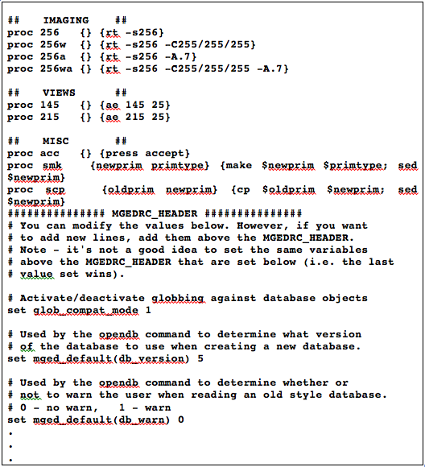

Each command includes the following four basic components:

* the "proc" (procedure) prefix,
* a unique name,
* arguments, and
* the body (i.e., commands that MGED should execute).

The symbol ";" signifies command separation (a return), and the symbol "$" inserts the value of the subsequently named variable.

The following text discusses some specific examples of the type of shortcuts that can be created by users to expedite common operations such as executing raytraces with particular parameters, accepting and rejecting edits, setting azimuth and elevation, etc.

First, the command to execute a specific kind of raytrace can often be long and tedious to type. For example, if a user wanted to render an image in a window 256 pixels high and wide, with a background color of white, and with the ambient light set to 0.7, the following text would have to be typed:

....

rt -s256 -C255/255/255 -A.7
    
....

However, it is a simple matter to add a line to the user's .mgedrc file to automate the calling of this instruction. The user's line might be as follows:

....

proc 256wa {} {rt -s256 -C255/255/255 -A.7}
    
....

Diagrammed, this line breaks down as follows:

[cols="4*"]
[%noheader]
|===
|proc
|256wa
|{}
|{rt -s256 -C255/255/255 -A.7}
|Denotes that a Tcl procedure is being created.
|Names the procedure 256wa.
|Denotes that there are no arguments.
|Denotes the MGED command that will be executed. The rendering will be 256 pixels square size (as signified by -s), will have a background red-greenblue value of 255 255 255 (as signified by the -C option), and will have an ambient light setting of 0.7 (as signified by the -A option).
|===

Now, all the user has to type on the command line to execute a rendering with the previously listed options is the following procedure name:

....

256wa
    
....

Note that this name has been intentionally kept short and function-based. It reduces a 27-character command to a 5-character command and provides the user with an idea of the action it performs. The 256 stands for the rt square size, the w stands for a white background, and the a stands for ambient lighting. But this convention is just a suggestion. The user may choose any name that is unique and does not contain words that are reserved for MGED commands (e.g., create).

The .mgedrc file can also be used to create shortcuts for other types of command line or GUI commands. For example, the syntax for creating a shortcut for accepting and rejecting edits from the command line might be as follows:

....

proc acc {} {press accept}
proc rej {} {press reject}
    
....

In addition, a possible shortcut for calling a standard viewing geometry might be as follows:

....

proc 145 {} {ae 145 25}
    
....

And to save the extra selection step when making or copying a primitive, the respective procedure syntax for combining the make and sed commands and copy and sed commands might be as follows:

....

proc mks {newprim primtype} {make $newprim $primtype; sed $newprim}
    
....

and

....

proc cps {oldprim newprim} {cp $oldprim $newprim; sed $newprim}
    
....

Figure D-2 shows a sample section of a .mgedrc file that allows the user to specify the command line editor, customize the window size and placement, and toggle the function keys.

[[mgedrc13]]
.Sample elements and functionality of a .mgedrc file.
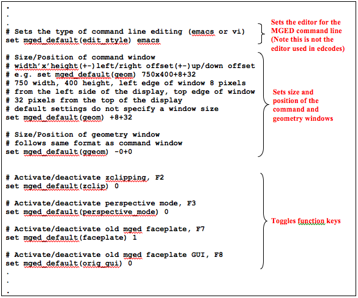

The diagrammed command for sizing and positioning the command window is as follows:

[cols="4*"]
[%noheader]
|===
|set mged_default
|(geom)
|475 ×  250
|+65 +80
|Sets MGED command window defaults.
|Specifies command window.
|Sizes the window width to 475 pixels and the height to 250 pixels.
|Denotes window location will be 65 pixels from the left side of the display and 80 pixels from the top edge of the display.
|===

As illustrated in Figure D-3, to specify the window size, the user inputs width-by-height dimensions for each window (i.e., 475 ×250). To specify the placement of the windows on the display, the user specifies offset distances (i.e., +65 +80) from the edges of the display (as measured in pixels). The first number defines the distance for the left/right placement, and the second number is for the up/down placement. The "+" symbol indicates a distance from the left side of the display to the left side of the window or from the top of the display to the top of the window. Alternatively, if a "-" symbol were present (as shown on the right side of Figure D-3), it would indicate a distance from the right side of the display to the right side of the window or from the bottom of the display to the bottom of the window.

[[mgedrc16]]
.Sample window dimension input and positioning.
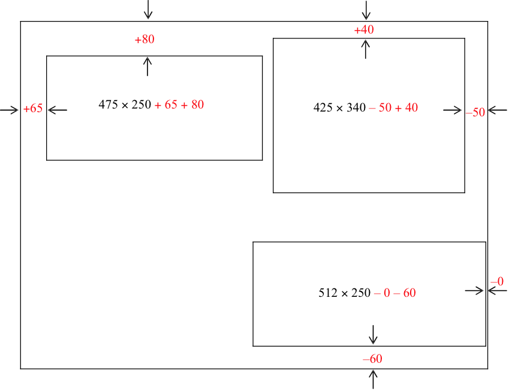

[appendix]
== Using the Build Pattern Tool

[[build_pattern_generalinfo]]
=== General Pattern Information

As mentioned previously, the Build Pattern tool automates the process of making copies of existing geometry in rectangular, spherical, or cylindrical patterns. The user can choose to pattern at any of three depths of duplication: top, regions, and primitives.

The Build Pattern tool is run from the graphical user interface (GUI) (under the Tools menu); it currently has no command-line equivalent. The bottom of the pattern control GUI is a usage dialog box that lists pertinent information about each item on the GUI as the user mouses over the text.

There are many input fields. Some stand alone, and others belong to series that work together to provide the needed information for a specific option. Each series is denoted by a diamond-shaped check box. If the diamond is highlighted red, then all fields in that series are required. All required fields must be filled in for the pattern tool to work properly. It is also important to note that all dimensions must be in millimeters and that no commas should be used in number strings.

The Build Pattern tool is designed to work from a prototype geometry object. That is to say, the object that is patterned is not included in the resultant pattern.

[[build_pattern_names]]
=== Pattern Names

As shown in Figure E-1, the tool appends three numbers to all patterned objects (unless you are using the increment option for primitives, in which case, the numbers for regions and primitives are incremented by the increment amount). For rectangular patterns, the first number is the X axis offset, the second is the Y axis offset, and the third is the Z axis offset. For spherical patterns, the first number references the azimuth, the second references the elevation, and the third references the radii. For cylindrical patterns, the first number references the radii, the second number references the height, and the third number references the azimuth.

[[build_pattern_fields]]
=== Common Fields for all Patterns:

There are several fields in the pattern tool GUI that are common to all types of patterns.

The Group Name field is for the name of the combination to be created (or appended to) by a pattern call.

The Source String and Replacement String fields must be used together. The source string is the set of characters in each element of the patterned object to be changed. The replacement string is the set of characters that will replace the source string.

.Example of pattern-generated assembly names.
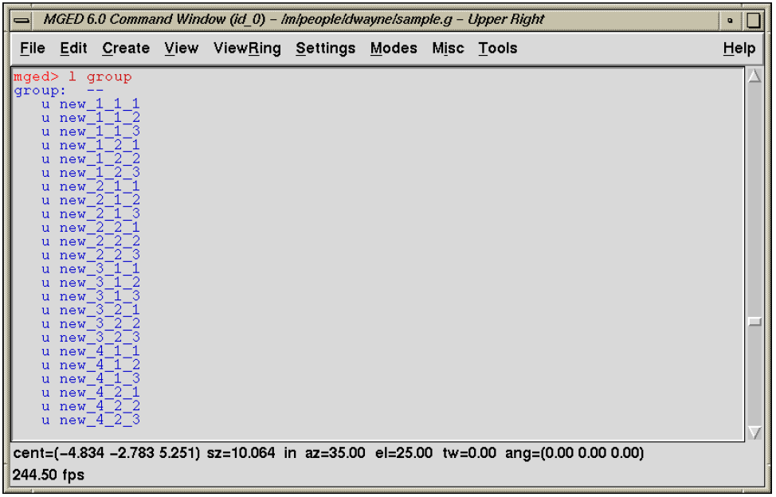

The Increment field is only for use when duplicating to the primitive level. It is added to the leftmost number field of each primitive. To determine the increment, examine the primitives of the object(s) you wish to pattern and find the largest span. For example, to create a pattern to the primitive level with the following primitives (which may or may not be in regions or assemblies):

....

part.s22 part.s22-1 part.s23 part.s24 part.s24+1 part.s24-1 part.s25,
      
....

one needs to determine the span. Note that the leftmost numbers in these primitives range from 22–25.Thus, as shown in the following expression, the span is four (inclusively). *******NEED FIGURE HERE***** If we use an increment of four, we will get the following set of primitives.

....

part.s26 part.s26-1 part.s27 part.s28 part.s28+1 part.s28-1 part.s29
      
....

Although it is acceptable to use a greater increment, gaps in numbers may be troublesome if one is using this capability extensively.

Finally, the Objects field is used for the names of all the items to be patterned.

[[build_pattern_stringsub]]
=== String Substitution

It is also possible to create a pattern in which a string of characters in each element in the object is changed (e.g., "l_" -> "r_"). This is useful for symmetry applications (e.g., left - right) or series (e.g., 1 - n). Each element of the object must have the source string so the user must be thorough and name each primitive, region, and assembly properly. Consider the following example: 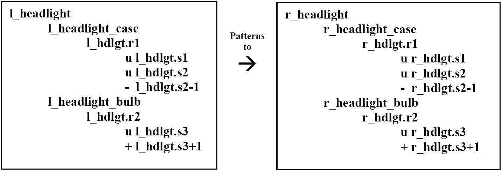

Top-level duplications copy the patterned object and reference its entire structure with matrices, as follows:

....

/pattern group
       /COPIED assemblies [MATRICES]
	    /assemblies
		  /regions
			/primitives
      
....

Region-level duplications copy all assembly and regions and reference from the region level down with matrices.

....

/pattern group
       /COPIED assemblies
	    /COPIED regions [MATRICES]
/primitives
      
....

Primitive-level duplications copy the entire tree structure to the primitive level without matrices using an increment on all primitives.

....

/pattern group
       /COPIED assemblies       NO MATRICES
	    /COPIED regions
		 /COPIED primitives
      
....

[[build_pattern_recpatterns]]
=== Rectangular Patterns

The rectangular pattern GUI (shown in Figure E-2) is designed to facilitate one-, two-, or three-dimensional rectangular patterns. The default X, Y, and Z directions are positive along each axis. In order to create a rectangle that is not axis aligned, these vectors may be changed with the condition that each must remain precisely perpendicular to the other two. If the Use Directions series is checked, the user specifies the number of copies and the Delta between copies for each axis. If the Use Lists series is checked, the user can specify a list of deltas along each axis.

.The user interface for building rectangular patterns.
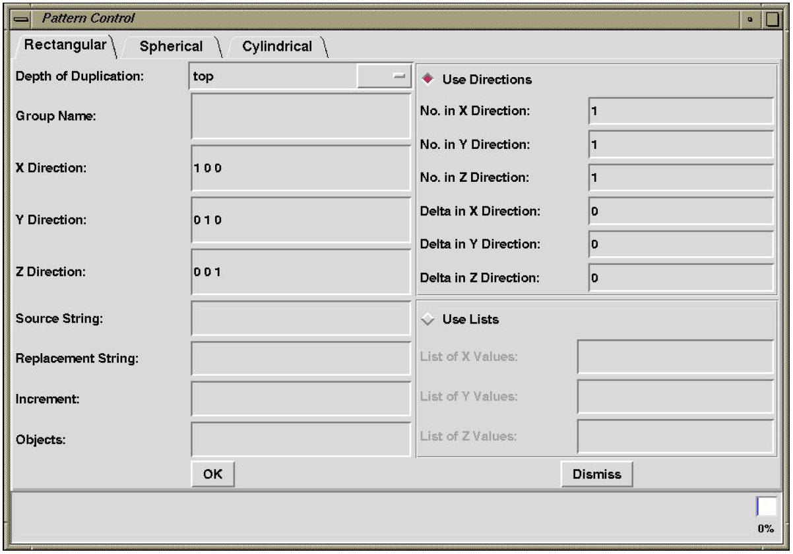

[[build_pattern_spherical]]
=== Spherical Patterns

The spherical pattern GUI (shown in Figure E-3) facilitates sphere-shaped patterns rotated around a center vertex using user-specified radii with azimuth and elevation angles. As shown in Figure E-4, the patterned objects--in this case, a series of arrows--may be oriented as built around the sphere or rotated by azimuth and/or elevation such that they are oriented toward the pattern center using the Rotate Azimuth and Rotate Elevation check boxes.

As shown in Figure E-4, the Pattern Center field is the coordinate at the center of the pattern. The Object Center field is a user-defined coordinate used to locate the object(s) relative to the pattern center. It acts as the key point for any transformations to the pattern object(s).

The Starting Azimuth and Starting Elevation fields follow the same right-hand-rule Cartesian coordinate conventions as Multi-Device Geometry Editor (MGED) viewing. The Starting Radius is the distance from the Pattern Center to the object center at the user-specified azimuths and elevations.

If the Create Az/El series is checked, the user defines the number of azimuths and elevations and the deltas between each. If the Use Lists series is checked, the user must specify a list of azimuths and/or elevations.

The Create Radii and Use Radii List series define offsets from the Starting Radius, allowing the user to create a pattern of concentric spheres. If Create Radii is checked, the user specifies the Number of Radii and the Radius Delta in order to construct a number of equally offset sphere patterns. If the Use Radii List is checked, the user specifies a list of radius offsets.

.The user interface for building spherical patterns.
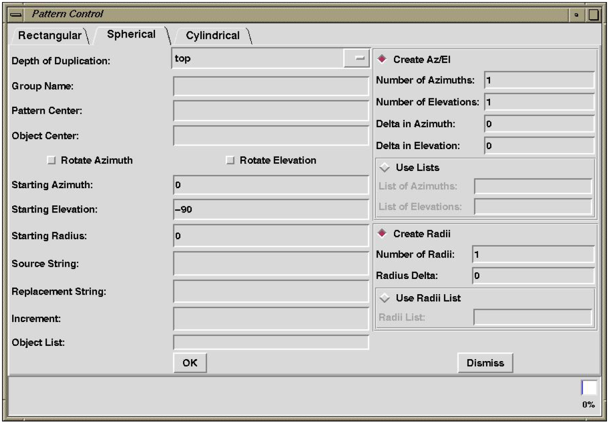

Without the Rotate Azimuth or Rotate Elevation boxes checked, the patterned objects are oriented as built without any rotations. Notice, for example, that every arrow in Figure E-5 points to the left. Notice also that for each patterned arrow, the Object Center (here specified as the tip of the arrow) is located on the circle outline at a distance of one Starting Radius from the Pattern Center. If we set the Object Center to the coordinate at the base of the arrow, the base would then lie on the circular outline. Wherever the Object Center is set is the point at which MGED works with the Object Center coordinate to place and rotate patterned objects.

.Examples of different spherical pattern orientations.
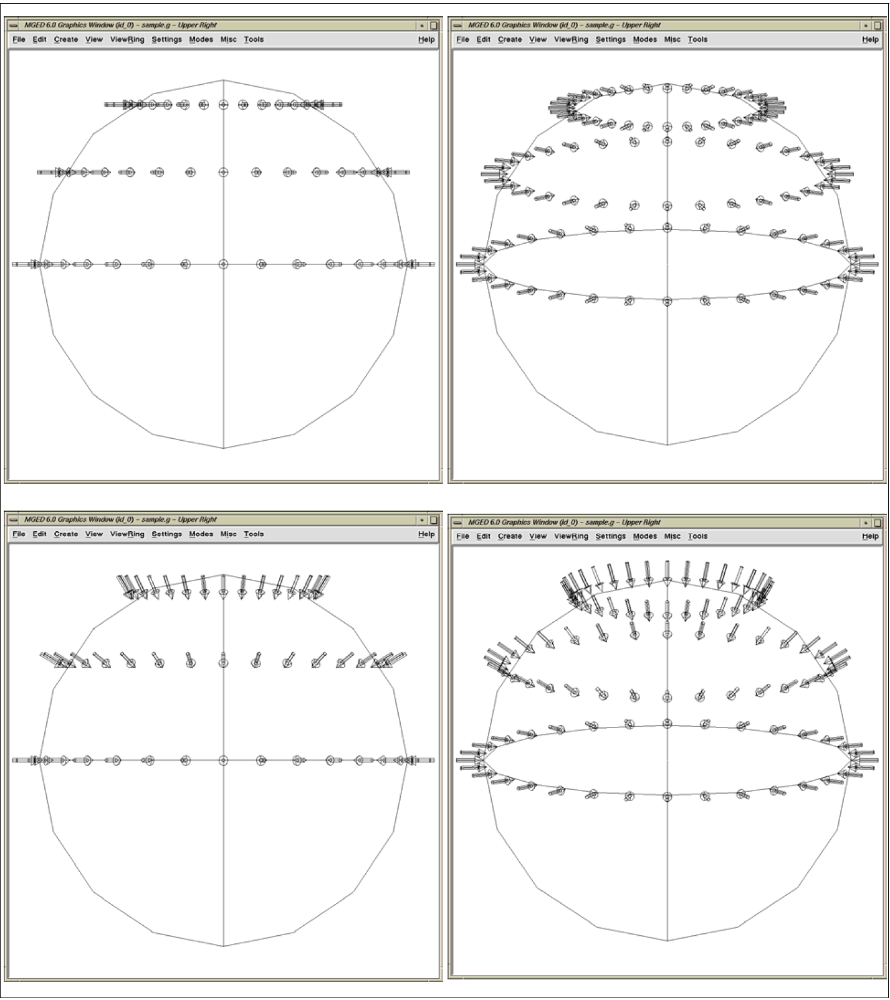

.Implementation of spherical patterns.
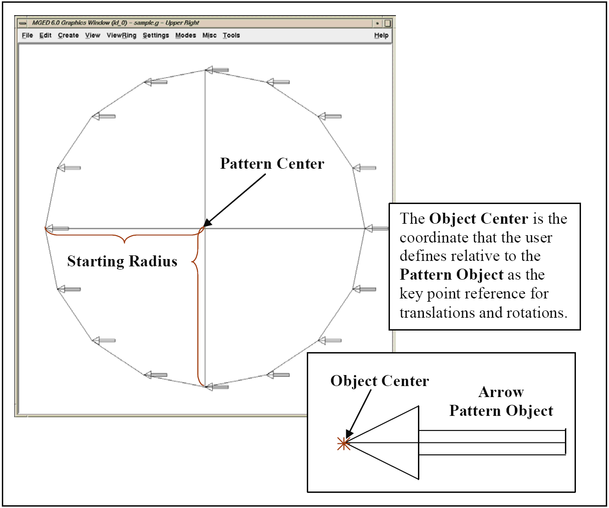

[[build_pattern_cylind]]
=== Cylindrical Patterns

The cylindrical pattern GUI (shown in Figure E-6) facilitates the creation of cylinder-shaped patterns with user-defined center, direction, height, azimuth, and radii inputs. The Base Center is the vertex of the cylinder shape. The Object Center is a user-defined coordinate used to locate the object(s) relative to the Base Center and Height Direction. It acts as the key point for any transformations to the pattern object(s). The Height Direction is the vector along which the cylinder runs. The Starting Height is the offset from the Base Center along the Height Direction that the pattern will place the Object Center.

.The user interface for building cylindrical patterns.
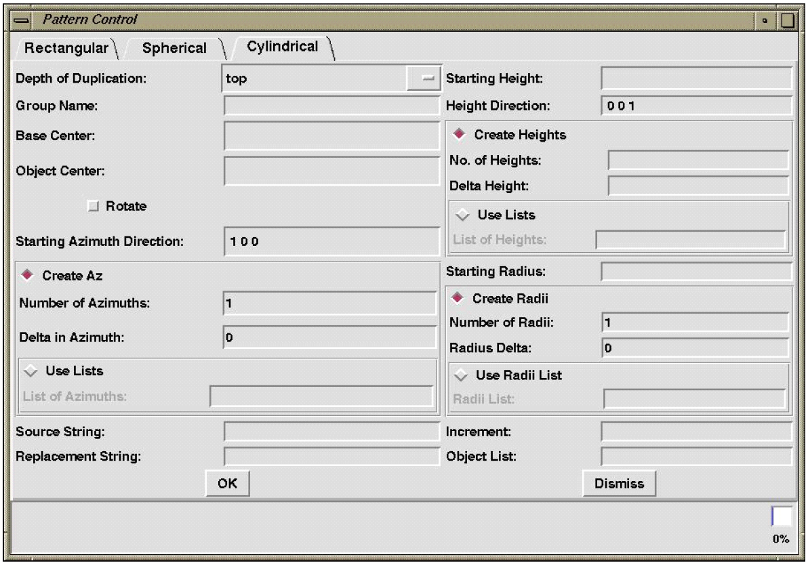

[appendix]
== Using the build_region Command

Just as the Build Pattern tool can help automate the process of building multiple occurrences of objects, the build_region command can help automate the process of creating regions. The command (which currently has no graphical user interface equivalent) uses meaning assigned by the user in the primitive name based on the intended use of the primitive.

The user includes the Boolean operation and relational information in the name of the primitive using a simple naming convention. The naming convention is designed around the following two assumptions:

* The same text "tag" is used for all primitives in a region.
* A sequential numbering pattern is used.

For example, let's say we want to build the four rounded corners of a "tub" region for a toy metal wagon assembly (see Figure F-1). We could choose something such as "wgn"--an abbreviated form of "wagon"--as the tag. This tag is short, easy to type, and representative of the final assembly name. Our primitives would therefore be of the form wgn.s#.

[[build_region5]]
.The rounded corners of a toy wagon.
image::../articles/images/build_region_fig01.png[]

Next, we create an arb8 for one long side of the wagon tub. It is named wgn.s1. After that, we create an rcc for one corner of the tub. It is named wgn.s2. To get a hollow quarter cylinder, we need to subtract a cylinder and intersect a bounding box (see Figure F-2). In order to relate the subtraction and intersecting primitives with wgn.s2, they will each share the same root name, wgn.s2. The subtraction primitive will be named wgn.s2-1, and the intersecting primitive will be named wgn.s2+1.

[[build_region7]]
.Arb8, cylinder, and two Boolean primitives.
image::../articles/images/build_region_fig02.png[]

Now we have created the following four primitives:

....

wgn.s1 wgn.s2 wgn.s2+1 wgn.s2-1
    
....

If we separate the primitives sequentially as follows,

....

wgn.s1

wgn.s2 wgn.s2+1 wgn.s2-1,
    
....

we can begin to see the Boolean structure falling out of the naming convention

....

u wgn.s1

u wgn.s2 + wgn.s2+1 - wgn.s2-1
    
....

If we wanted to make a second subtraction from wgn.s2--say, for a drain hole in the corner of the wagon--we would name that primitive wgn.s2-2 (see Figure F-3). We can break this name down as follows: *****NEED IMAGE HERE*****

[[build_region9]]
.The region and the subtraction primitives.
image::../articles/images/build_region_fig03.png[]

Note that the root name stays the same so we can maintain the relationship, and the second number (associated with the Boolean operation) is incremented sequentially.

[[build_region11]]
.Raytraced image with hole.
image::../articles/images/build_region_fig04.png[]

Obviously, the overall success or failure of the build_region command depends on primitives being named properly. But if they are, the command can organize them in one automated step, creating complex regions in just a few keystrokes.

Another modeling benefit of the build_region tool is that it allows the user to quickly organize primitives. Assume, for example, that we have used the aforementioned naming convention to construct a complicated region. If there was a subsection of the region that we needed to, say, keep out for another assembly, delete from our database, move slightly, or copy, it would be a simple matter to create a new region with just those primitives that we needed.
