= HACKING BRL-CAD
:author: Sean Morrison
:author2: Eric Edwards
:author3: Harmanpreet Singh
:author4: Check Nyah
:author5: Issac Kamga
:author6: Clifford Yapp
:author7: Scott Nesbitt
[.authors]
--
* {author}
* {author_2}
* {author_3}
* {author_4}
* {author_5}
* {author_6}
* {author_7}
--

:doctype: book
:toc:
:toclevels: 3

== Getting Started

=== A Call to Arms (and Contributors)

[quote, Mike Muuss]
____
The future exists first in the imagination, then in the will, then in reality.

____

Welcome to BRL-CAD! Whether you are a developer, documenter, graphic artist, academic, or someone who just wants to be involved in a unique open source project, BRL-CAD has a place for you. Our contributors come from all over the world and use their diverse backgrounds and talents to help maintain and enhance one of the oldest computer-aided design (CAD) packages used in government and industry today.

==== What is BRL-CAD?

BRL-CAD (pronounced be-are-el-cad) is a powerful, cross-platform, open source solid modeling system that includes interactive three-dimensional (3D) solid geometry editing, high-performance ray tracing support for rendering and geometric analysis, network-distributed framebuffer support, image and signal-processing tools, path tracing and photon mapping support for realistic image synthesis, a system performance analysis benchmark suite, an embedded scripting interface, and libraries for robust high-performance geometric representation and analysis.

For more than two decades, BRL-CAD has been the primary solid modeling CAD package used by the U.S. government to help model military systems. The package has also been used in a wide range of military, academic, and industrial applications, including the design and analysis of vehicles, mechanical parts, and architecture. Other uses have included radiation dose planning, medical visualization, terrain modeling, constructive solid geometry (CSG), modeling concepts, computer graphics education and system performance benchmark testing.

BRL-CAD supports a wide variety of geometric representations, including an extensive set of traditional implicit "primitive shapes" (such as boxes, ellipsoids, cones, and tori) as well as explicit primitives made from collections of uniform B-spline surfaces, non-uniform rational B-spline (NURBS) surfaces, n-manifold geometry (NMG), and purely faceted polygonal mesh geometry. All geometric objects may be combined using boolean set-theoretic CSG operations such as union, intersection and difference.

Overall, BRL-CAD contains more than 400 tools, utilities, and applications and has been designed to operate on many common operating system environments, including BSD, Linux, Solaris, Mac OS X, and Windows. The package is distributed in binary and source code form as Free Open Source Software (FOSS), provided under Open Source Initiative (OSI) approved license terms.

==== History and Vision

BRL-CAD was originally conceived and written by the late Michael Muuss, the inventor of the popular PING network program. In 1979, the U.S. Army Ballistic Research Laboratory (BRL) (the agency responsible for creating ENIAC, the world's first general-purpose electronic computer in the 1940s) identified a need for tools that could assist with the computer simulations and analysis of combat vehicle systems and environments. When no existing CAD package was found to be adequate for this specialized purpose, Mike and fellow software developers began developing and assembling a unique suite of utilities capable of interactively displaying, editing, and interrogating geometric models. Those early efforts subsequently became the foundation on which BRL-CAD was built.

Development of BRL-CAD as a unified software package began in 1983, and its first public release came in 1984. Then, in 2004, BRL-CAD was converted from a limited-distribution U.S. government-controlled code to an open source project, with portions licensed under the LGPL and BSD licenses.

Today, the package's source code repository is credited as being the world's oldest, continuously developed open source repository. As a project, pride is taken in preserving all history and contributions.

The ongoing vision for BRL-CAD development is to provide a robust, powerful, flexible, and comprehensive solid modeling system that includes:

* Faithful high-performance geometric representation.
* Efficient and intuitive geometry editing.
* Comprehensive conversion support for all solid geometry formats.
* Effective geometric analysis tools for 3D CAD.

==== Key Strengths

All CAD packages are not alike. Among the many strengths of the BRL-CAD package are the following:

* BRL-CAD is _open source!_ Don't like something? You can make it better.
* You can leverage _decades of invested development_. BRL-CAD is the most feature-filled open source CAD system available, with hundreds of years time invested.
* _Your work will get used_. BRL-CAD is in production use and downloaded thousands of times every month by people all around the world.
* You have the ability to create extensively _detailed realistic models_.
* You can model objects on scales ranging from (potentially) the subatomic through the galactic, while essentially providing _all the details, all the time_.
* You can leverage _one of the fastest_ raytracers in existence (for many types of geometry).
* You can convert to and from a wide range of _geometry file formats_.
* BRL-CAD has a powerful, _customizable scripting interface_ with many advanced editing and processing capabilities.

==== Want to Be a Contributor?

With BRL-CAD being a part of the open source community since 2004, contributors from all over the world are able to enhance the features and functions of the package in many different ways. In return, these contributors have had a unique opportunity to:

* Join a team of passionate and talented contributors who share the common values of open source development. Open source emphasizes free redistribution; openly available source code; full, open participation; and nondiscrimination against individuals, groups, technologies, or fields of interest. (To learn more, see http://opensource.org.)
* Drive needed improvements in the open source software community's support for solid modeling and CAD software capabilities.
* Experiment with new and state-of-the-art algorithms and ideas within the context of a fully open CAD system that is in production use and has an established user community.
* Become a better developer. Whether you're a newbie or a seasoned developer with decades of experience, you can always work on a BRL-CAD project that is catered toward improving your abilities.
* Become part of a legacy. Participate in a robust and historically significant open source project that goes all the way back to the days of the DEC PDP-11/70 and VAX-11/780.
* Gain practical experience working on a real-world, large-scale software project.

If you would like to be a BRL-CAD contributor, the primary areas currently identified for future development and enhancement include the following:

* _Improved graphical user interface and usability_ to accommodate increasingly varied user needs and participation levels. This includes improving the look-and-feel and features of:
** the primary editing graphical interface (MGED)
** the geometric visualization and interaction management system (libdm).

* _Improved hybrid boundary representation geometry support_ to support all 3D CAD models regardless of whether they use implicit or explicit geometric representation. Geometry formats we are particularly focusing on include:
** volumetric models (VOL)
** spline-surface (for example, NURBS) and polygonal (for example, triangle mesh) boundary representations (BREP)
** implicit primitives.

* _Improved geometry services and functionality,_ including the ability to provide: multiuser access controls
** comprehensive revision history
** collaborative enhanced multiuser modeling
** more flexible application development.

* In addition, BRL-CAD's existing geometry kernel functions are continuously being refactored. Help turn them into a comprehensive, scriptable command framework, create an object-oriented geometry kernel application programming interface (API), or build a lightweight network daemon protocol for language agnostic client application development.
* _Improved open source awareness and increased development participation_ via:
** establishing strong open source community ties
** improving software documentation
** openly welcoming new contributors and users.

Let the contributions begin!

=== Feature Overview

BRL-CAD has thousands of distinct features that have been developed over a number of decades. One strength of a solid modeling system with integrated high-performance rendering is the ability to showcase some of those features graphically.

Let's take a quick look at just some of the high-level features provided by BRL-CAD.

==== Solid Geometry

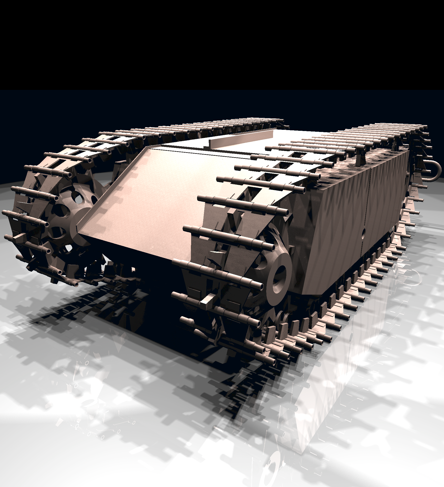

BRL-CAD focuses on solid modeling CAD. Solid modeling is distinguished from other forms of geometric modeling by an emphasis on being physically accurate, fully describing 3D space. Shown is a 3D model of a Goliath tracked mine, a German-engineered remote controlled vehicle used during World War II. This model was created by students new to BRL-CAD in the span of about 2 weeks, starting from actual measurements in a museum.

==== Raytracing

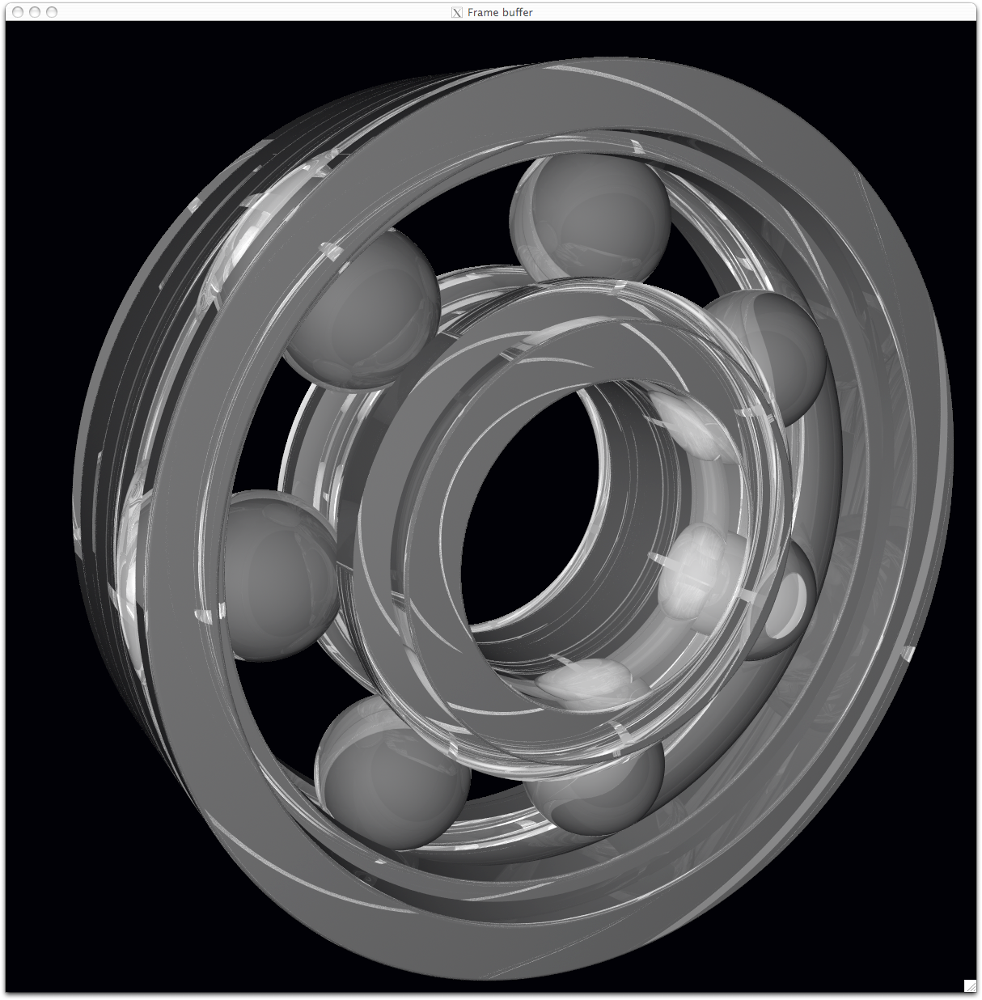

Raytracing is central to BRL-CAD as a means for performing geometric analysis (e.g., calculating weights and moments of inertia) and for rendering images for visualization purposes. The image shown is a BRL-CAD 2D framebuffer screenshot displaying the rendering of a ball bearing. The bearing is modeled with a material appearance resembling acrylic glass, and this raytracing result shows reflection, refraction, shadowing, and some caustic effects.

==== Geometry Conversion

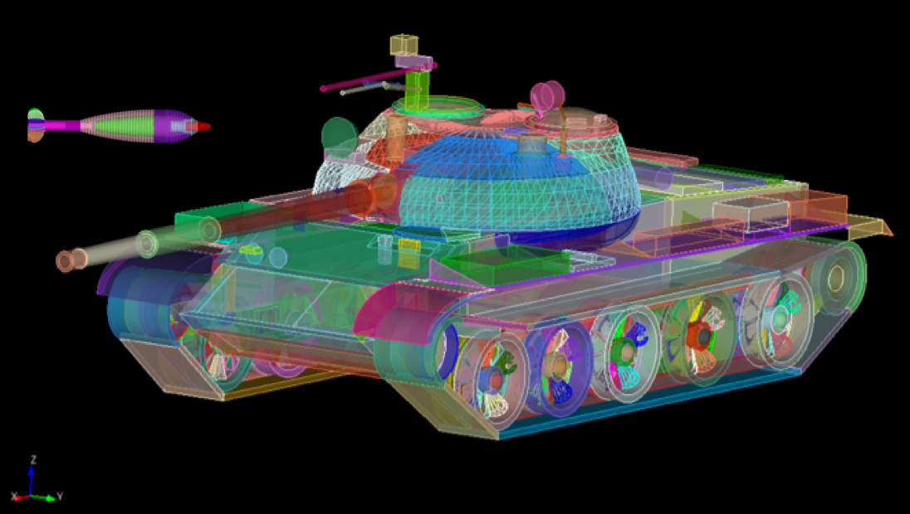

As shown, a BRL-CAD target description can be converted to a finite element mesh (FEM) using the BRL-CAD g-sat exporter and Cubit from Sandia National Laboratories.

This screenshot shows a model imported from the Rhino3D 3DM file format into BRL-CAD as NURBS boundary representation geometry, visualized via OpenGL.

==== Procedural Geometry

image::../books/images/hacking_brlcad_sflake2_cc.png[width=100%]

BRL-CAD provides a comprehensive procedural geometry interface as a means for creating models algorithmically instead of manually. This screenshot shows a classic "Sphere Flake" model with five levels of recursion, specular reflections, multiple light sources, environment mapping, checkered texture synthesis, ambient occlusion, and soft shadows.

==== Boundary Representation

Boundary representation NURBS surface geometry is one of the dominant geometric representation formats in CAD. BRL-CAD is one of the few 3D solid modeling systems that not only support geometry in boundary representation NURBS format but also provide extensive support for robust solid ray tracing of NURBS geometry. The image shown is the classic computer graphics Utah teapot model prepared for 3D printing and rendered via BRL-CAD ray tracing.

==== Path Tracing

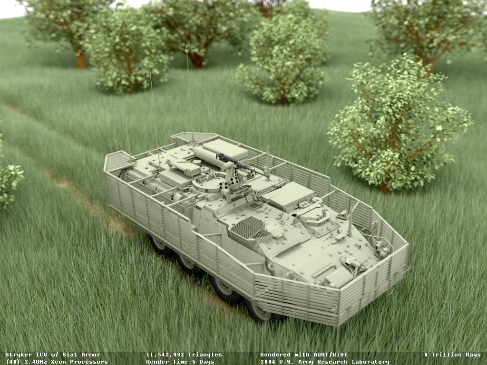

Representing more than 8 trillion rays fired at this 11-million-polygon scene (amounting to more than 20 million rays per second on 2004 hardware), this figure signifies the path tracing capability of BRL-CAD. A full light simulation was computed to generate the image with all exterior and interior vehicle detail, including every nut, bolt, wire, and component inside the vehicle and every leaf and blade of grass modeled as actual geometry (with no textures and no procedural geometry).

==== Constructive Solid Geometry (CSG)

image::../books/images/hacking_brlcad_M1A1_9x10_300dpi_cc.png[width=100%]

While now a fully hybrid modeling system, BRL-CAD has its roots in CSG modeling with implicit primitives. This image, provided courtesy of GSI Solutions, Inc., depicts a detailed M1A1 tank on a pedestal in a mirrored showcase room. The model is entirely constructed from implicit primitives and CSG boolean operations.

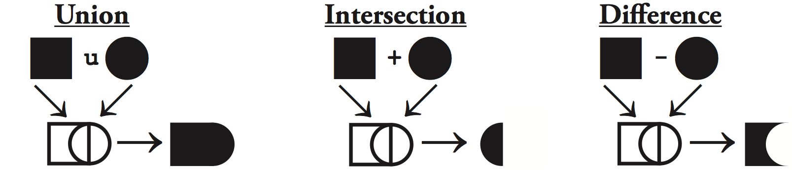

==== Hidden Line Rendering

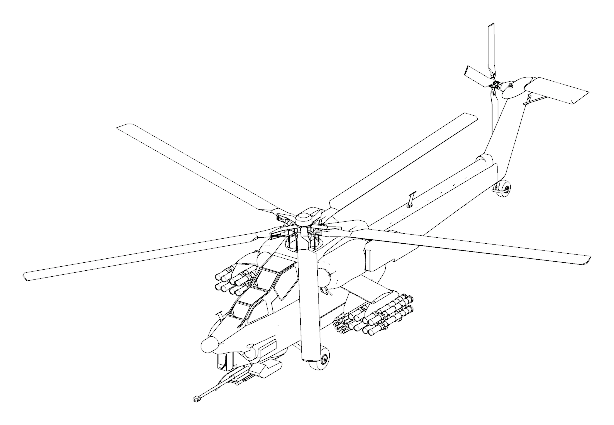

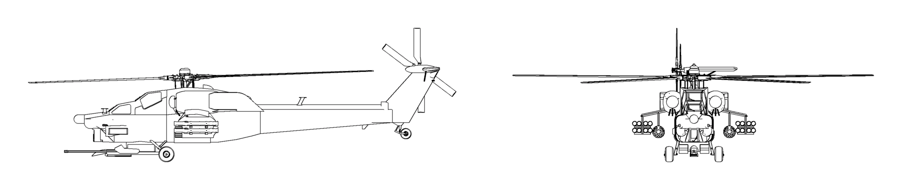

This raytrace image is a multiple-view hidden line rendering of an Mi28 Havoc Russian attack helicopter using BRL-CAD's rtedge utility. The model is entirely composed of implicit primitives combined together with CSG boolean operations.

==== Scripting Interface

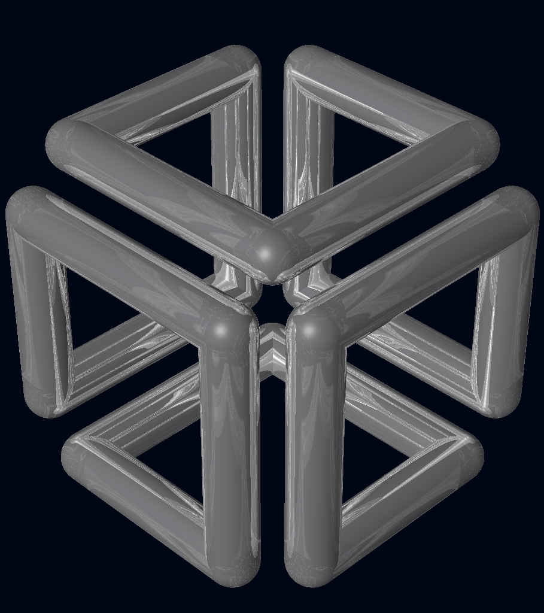

BRL-CAD can run series of commands piped in or redirected to it via standard input, and it is considerably more efficient to batch multiple BRL-CAD commands together via standard input instead of re-invoking BRL-CAD for each command. The image demonstrates the output of a shell script that uses BRL-CAD tools to procedurally create and render the SGI Cube. For more information, go to http://brlcad.org/wiki/SGI_Cube.

==== More Cowbell

Not all of BRL-CAD's capabilities lend themselves well to pretty pictures, but some are definitely worth mentioning. Among the thousands of features in BRL-CAD, here are some additional capabilities that are central to our project ethos.

===== Geometric Analysis

A particular strength of the BRL-CAD software lies in its ability to build and analyze realistic models of complex objects. There are a number of features aimed at inspecting, preparing, verifying, and validating geometry models. Single-ray sampling can be used for measuring thicknesses or distances, and certain 3D analyses are possible (such as calculating volume, centroids, and moments of inertia). BRL-CAD also has numerous facilities for detecting and resolving assembly or part interferences where two objects spatially overlap each other.

===== High-Performance Design

BRL-CAD is designed from the ground up with performance in mind. Considerable attention has been put into in-memory and on-disk data storage efficiency. BRL-CAD is capable of handling complex geometry models that are often impossible to open with other systems without changing hardware requirements. BRL-CAD's ray tracing infrastructure is one of the fastest in the world for implicit geometry representations and is continually seeking performance advancements for other explicit representation types, such as polygonal mesh geometry and NURBS surface models. BRL-CAD's distributed ray tracing support is recognized as the world's first "real-time" ray tracing implementation, achieving several frames per second in the 1980s.

===== Symmetric Multi-Processing

BRL-CAD efficiently leverages symmetric multi-processing (SMP) capabilities of desktop, server, and supercomputing systems, where an arbitrary number of processing cores can be put to work on a computational task. BRL-CAD's ray tracing library is commonly leveraged for performing highly detailed geometric analysis, driving third-party simulations, and producing animations.

===== Modular Architecture

As a large software package developed over a relatively long period of time, BRL-CAD has necessarily been designed and evolved with modularity in mind. Functionality is implemented across hundreds of application modules, commands, and libraries designed to work together. Hundreds of application binaries work together supporting efficient customizable workflows. Core geometry editing capabilities are implemented as commands that can be easily extended, replaced, or improved upon. All functionality and features are built on top of a core set of libraries that encapsulate common capabilities. One of the best ways to get involved is to add a new module or improve an existing one.

===== Cross-Platform Portability

BRL-CAD has an extensive history of investment in and attention toward cross-platform portability. This heritage includes systems such as a DEC VAX-11/780 running 4.3 BSD, DECStations running ULTRIX, Silicon Graphics machines running IRIX, Cray supercomputers running UNICOS, and so much more. Today, BRL-CAD's hardware support includes everything from minimal laptops and desktops to gigantic distributed supercomputers. And it is commonly run on Linux, Windows, Mac OS X, BSD, Haiku, Solaris, and other desktop operating systems. We aim to be "embarrassingly portable."

===== ISO STEP 10303

STandard for the Exchange of Product Model Data (STEP) is an ISO standard describing a product's full life cycle. One small portion of that gigantic standard describes a complex geometry file format that fortunately has been adopted by most commercial CAD systems. BRL-CAD is proud to be one of the few open source software systems that is able to read and write STEP geometry files.

===== Performance Benchmark

The BRL-CAD Benchmark provides a practical metric of real-world performance. Correlated with a longstanding heritage of providing verifiable and repeatable behavior throughout the package, the Benchmark compares a given compilation's ray tracing performance against the results from one of the very first systems to support BRL-CAD: a VAX 11/780 running BSD. The mathematically intensive computations exercise the processing unit, system memory, various levels of data and instruction cache, the operating system, thread concurrency efficiency, data coherency, and compiler optimization capabilities. The performance results let you weigh the relative computational strength of a given platform. With the right controls in place, the Benchmark can tell you whether a given operating system is more efficient than another, whether a particular compiler really makes a difference, or just how much of an improvement a particular piece of hardware provides. We have results tracing back several decades of computing.

== Developers

=== Working with Our Code

BRL-CAD consists of more than 1 million lines of source code spanning more than 20 foundation libraries and 400 application modules.

The majority of BRL-CAD is written in highly portable C and C++, with some GUI and scripting components written in Tcl/Tkfootnote:[http://www.tcl.tk/]. There is also some support for, and bindings to, other languages available. POSIXfootnote:[http://en.wikipedia.org/wiki/POSIX] shell scripts are used for deployment integration testing. BRL-CAD uses the CMakefootnote:[http://www.cmake.org/] build system for compilation and unit testing.

==== The Big Picture

The source code and most project data are stored in a Gitfootnote:[http://git-scm.com/] version control system for change tracking and collaborative development. Primary development in the "main" branch is generally stable, but cross-platform compilation is not guaranteed. A separate branch (named STABLE) provides a higher level of quality assurance. Every released version of BRL-CAD is tested and tagged.

The project aims for an _It Just Works_ approach to compilation whereby a functional build of BRL-CAD is possible without needing to install more than a compiler, CMake, and a build environment--for example, GNU Make or Microsoft Visual Studio. BRL-CAD provides all of the necessary third-party dependencies for download and compilation convenience within source distributions but by default will build using system versions of those dependencies if available.

As with any large system that has been under development for a number of years, there are vast sections of code that may be unfamiliar, uninteresting, or even daunting. Don't panic. BRL-CAD has been intentionally designed with layering and modularity in mind.

You can generally focus in on the enhancement or change that interests you without being too concerned with other portions of the code. You should, however, do some basic research to make sure what you plan to contribute isn't already in the BRL-CAD code base.

===== History of the Code

As mentioned previously, the initial architecture and design of BRL-CAD began in 1979. Development as a unified package began in 1983. The first public release was in 1984. And on December 21, 2004, BRL-CAD became an open source projectfootnote:[http://developers.slashdot.org/story/05/01/08/1823248/us-army-research-lab-opens-brl-cad-source].

BRL-CAD is a mature code base that has remained active over decades due to continual attention on design and maintainability. Since the project's inception, more than 200 people have directly contributed to BRL-CAD. The project has historically received support from numerous organizations within academia, commercial industry, various government agencies, and from various independent contributors. We credit all contributors in BRL-CAD's authorship documentationfootnote:[See the AUTHORS file in a source distribution.].

The following diagram illustrates how the number of lines of code in BRL-CAD has changed over time:

===== System Architecture

BRL-CAD is designed based on a UNIXfootnote:[http://en.wikipedia.org/wiki/UNIX] methodology of the command-line services, providing many tools that work in harmony to complete a specific task. These tools include geometry and image converters, signal and image processing tools, various raytrace applications, geometry manipulators, and much more.

To support what has grown into a relatively large software system, BRL-CAD takes advantage of a variety of support libraries that encapsulate and simplify application development. At the heart of BRL-CAD is a multi-representation ray tracing library named LIBRT. BRL-CAD specifies its own file format (files with the extension .g or .asc) for storing information on disk. The ray tracing library uses a suite of other libraries for other basic application functionality.

===== Tenets of Good Software

BRL-CAD's architecture is designed to be as cross-platform and portable as is realistically and reasonably possible. As such, BRL-CAD maintains support for many legacy systems and devices provided that maintaining such support is not a significant burden on new development.

The code adheres to a published change deprecation and obsolescence policyfootnote:[See CHANGES.adoc in a source distribution.] whereby features that have been made publicly available are not removed without appropriate notification. Generally there should be a compelling motivation to remove any existing functionality, but improvements are encouraged.

BRL-CAD has a longstanding heritage of maintaining verifiable, validated, and repeatable results in critical portions of the package, particularly in the ray tracing library. BRL-CAD includes regression tests that will compare runtime behavior against known results and report any deviations from previous results as failures. Considerable attention is put into verification and validation throughout BRL-CAD. Incorrect behavior does not need to be preserved simply to maintain consistency, but it is rare to find genuine errors in the baseline testing results. So, anyone proposing such a behavior change will have to conclusively demonstrate that the previous result is incorrect.

==== Code Layout

The basic layout of BRL-CAD's source code places public API headers in the top-level include directory and source code for both applications and libraries in the src directory. The following is a partial listing of how the code is organized in a checkout or source distribution. Note that some subdirectories contain a README file with more details on the content in that directory.

`db/`::
Example geometry

`doc/`::
Project documentation

`doc/asciidoc/`::
User and developer documentation in AsciiDoc format
+
See doc/asciidoc/README.adoc for more details

`include/`::
Public API headers

`regress/`::
Scripts and resources for regression testing

`src/`::
Application and library source code
+
See src/README for more details

`src/conv/`::
Geometry converters

`src/fb/`::
Tools for displaying data in windows

`src/mged/`::
Main GUI application: Multi-device Geometry EDitor

`src/proc-db/`::
Examples on creating models programmatically

`src/rt*/`::
Ray tracing applications

`src/util/`::
Image processing utilities

`src/libbn/`::
Numerics library: vector/matrix math, random number generators, polynomial math, root solving, noise functions, and more

`src/libbu`::
Utility library: string handling, logging, threading, memory management, argument processing, container data structures, and more

`src/libgcv/`::
Geometry conversion library for importing or exporting geometry in various formats

`src/libged/`::
Geometry editing library containing the majority of our command API

`src/libicv/`::
Image conversion library for importing, processing, and exporting image data

`src/libpkg/`::
Network "package" library for basic client-server communication

`src/librt/`::
Ray tracing library including routines for reading, processing, and writing geometry

`src/libwdb/`::
Simple (write-only) library for creating geometry

`src/lib*/tests/`::
API Unit tests

==== Code Conventions

BRL-CAD has a STABLE branch in Git that should always compile and run on all supported platforms. The primary development branch, main, unlike STABLE, is generally expected to compile but may occasionally fail to do so during active development.

===== Languages

The majority of BRL-CAD is written in portable C with the intent of strictly conforming with the C11 standard (ISO/IEC 9899:2011). C++ code targets the C++17 standard (ISO/IEC 14882:2017). The core libraries all expose a C API, though several--such as the LIBBU and LIBRT libraries--use C++ for implementation details. Our C libraries can use C++ for implementation detail, but they cannot expose C++ in the public API.

Major components of the system are written in the following languages:

* STEP and NURBS boundary representation support: C++
* The MGED geometry editor: a combination of C, Tcl/Tk, and Incr Tcl/Tk
* The BRL-CAD Benchmark, build system, and utility scripts: POSIX-compliant Bourne Shell Script
* Initial implementation of a BRL-CAD Geometry Server: PHP

Source code files use the following extensions:

* C files: .c
* Header files: .h
* C++ files: .cpp
* PHP files: .php
* Tcl/Tk files: .tcl or .tk
* POSIX Bourne-style shell scripts: .sh
* Perl files: .pl (program) or .pm (module)

BRL-CAD requires that all of the software's C code conform strictly with the ISO C11 standard (ISO/IEC 9899:2011), and that all C++ code conform with the ISO C++17 standard (ISO/IEC 14882:2017). Support for older compilers and older K&R-based system facilities has been migrated to build system declarations or preprocessor defines, or removed outright. You may make modifications that assume compiler conformance with the C11 and C++17 standards.

===== Coding Style

To ensure consistency, the coherence of the project, and the long-term maintainability of BRL-CAD, we use a defined coding style and conventions that contributors are expected to follow. Our coding style is documented in the HACKING file of any source distribution.

Our style may not be your preferred style. While we welcome discussion, we will always prefer consistency over any personal preference. Contributions that do not follow our style will generally be rejected until they do.

Here are some highlights of our style:

* Global variables, structures, classes, and other public data containers are discouraged within application code. Do not add any new global variables to existing libraries. Global variables are often a quick solution to some deeper coding problem. However, they carry significant maintenance costs, introduce complexity to the code, make multi-threading support more costly, pollute the public API (symbol-wise at a minimum), increase security risks, are error-prone to use, and usually complicate future efforts to refactor and restructure the code. Using static variables (whether function- or static/file-scoped) is a viable alternative. Restructuring the logic to not be stateful is even better.
* Exact floating point comparisons are unreliable without requiring IEEE-compliant floating point math, but BRL-CAD does not require such math for portability and for performance reasons. When floating point comparisons are necessary, use the NEAR_EQUAL and NEAR_ZERO macros with a specified tolerance or the EQUAL and ZERO macros where a tolerance is indeterminate. All the macros are available by including bn.h, part of libbn.
* The code should strive to achieve conformance with the GNU coding standard with a few exceptions. One such exception is not using the GNU indentation style, but instead using the BSD KNF indentation style, which is basically the K&R indentation style with character indentation consistent with the file that you're editing. If this is confusing, use spaces to indent and run the sh/ws.sh script to convert spaces to tabs. We value consistency to preserve maintainability.
* Stylistic whitespace
** No space immediately inside parentheses.

----

while (1) { ...                   /* ok */
for (i = 0; i &lt; max; i++) { ...   /* ok */
while ( max ) { ...               /* discouraged */
----

** Commas and semicolons are followed by whitespace.

----

int main(int argc, char *argv[]); /* ok */
for (i = 0; i &lt; max; i++) { ...   /* ok */
----

** No space on arrow operators.

----

structure->member = 5;            /* ok */
structure -> member = 5;          /* bad */
----

** Native language statements (if, while, for, switch, and return) have a separating space; functions do not.

----

int my_function(int i);           /* ok, no space */
while (argc--) ...                /* ok, has space */
if( var == val )                  /* discouraged */
switch(foo) ...                   /* discouraged */
----

** Comments should have an interior space and be without tabs.

----

/** good single-line doxygen */
/* good */
/*bad*/
/*    discouraged */
/*  discouraged  */
/**
* good:
* multiple-line doxygen comment
*/
----

* Naming symbols
** Variable and public API function names should almost always begin with a lowercase letter.

----

double localVariable; /* ok */
double LocalVariable; /* bad (looks like class or    constructor) */
double _localVar;     /* bad (looks like member variable)      */
----

** Do not use Hungarian notation or its variations to show the type of a variable. An exception can be made for pointers on occasion. The name should be concise and meaningful--typing a descriptive name is preferred to someone spending time trying to learn what the name of the variable means.

----

char *name;    /* ok  */
char *pName;   /* discouraged for new code, but okay */
char *fooPtr;  /* bad */
char *lpszFoo; /* bad */
----

** Constants should be all upper-case with word boundaries optionally separated by underscores.

----

static const int MAX_READ = 2;  /* ok  */
static const int arraySize = 8; /* bad */
----

** Public API (global) function names should be in lowercase with underscores to separate words. Most functions within the core libraries are named with the following convention: [library]_[group]_[action]

----

bu_vls_strcat()
bn_mat_transpose()
----

** Naming exceptions are allowed where the API intentionally mirrors some other familiar programming construct--for example, bu_malloc()+bu_free())--but be as consistent as possible within a file and across a library's API.

* BRL-CAD uses The One True Brace Style from BSD KNF and K&Rfootnote:[http://en.wikipedia.org/wiki/Indent_style]. Opening braces should be on the same line as their statement; closing braces should line up with that same statement. Functions, however, are treated specially, and we place their opening braces on separate lines.

----

static int
some_function(char *j)
{
    for (i = 0; i &lt; 100; i++) {
        if (i % 10 == 0) {
            j += 1;
        } else {
            j -= 1;
        }
    }
}
----

=== What Code to Work On

If you would like to fix a bug or work on a major project, then this section is for you. Depending on how long you want to be with us, we have tasks that will take you anywhere from a few hours to a few days to several months to complete. Regardless of your level of participation, make sure you read the How to Contribute section for information about BRL-CAD's developer guidelines.

==== Two-Hour Tasks

These tasks have roughly the same complexity and require no prior experience with BRL-CAD experience to complete. They're a great starting point for anyone interested in getting involved in the development process of BRL-CAD, as they can be completed in just a couple of hours.

Check out our list of available mini tasks that we call http://brlcad.org/wiki/Deuces[deuces] and http://brlcad.org/wiki/Contributor_Quickies[quickies]. Each task has a labelled level of difficulty: easy, medium, and hard. Although the hard ones are math intense, don't let them scare you away.

==== Two-Week Tasks

If you have few hours to spare each day, check the TODO file included in each source distribution. These tasks can help potential developers make modifications and submit pull requests to gain familiarity with our code repository. You should be able to complete the tasks on this list within 14 days. Before starting on a task, however, you should discuss it with other developers on https://brlcad.zulipchat.com[Zulip chat] or in our https://github.com/BRL-CAD/brlcad/discussions[GitHub Discussions].

We also have a https://github.com/BRL-CAD/brlcad/blob/main/BUGS[BUGS] file, included in each binary and source distribution, which lists the application bugs that developers are invited to fix. If you plan to tackle a bug, remember to report it in our https://github.com/BRL-CAD/brlcad/issues[issue tracker].

==== Two-Month Tasks

If you want to become more deeply involved in the BRL-CAD project, then you should take the time to check our http://brlcad.org/~sean/ideas.html[ideas page] (http://brlcad.org/~sean/ideas.html). Students who are participating in Google Summer Of Code should explore our http://brlcad.org/~sean/ideas.html[projects page] (http://brlcad.org/~sean/ideas.html) and the ideas page to get a feel for the tasks that are available. These tasks should take about 60 days to complete.

=== Contributing Code

Developing code for BRL-CAD becomes easier when you understand how to obtain and modify the code.

==== Obtaining the Code

You can get the development code for BRL-CAD from our Git code repository using the following command:

*git clone https://github.com/BRL-CAD/brlcad*

The code will be saved into a `brlcad` directory, and you can compile it by following the instructions in the `HACKING` file located in the top-level source directory. That said, the following are a few useful tips to help get you going.

===== Obtaining the Development Tools

BRL-CAD uses the CMake build system and will compile with most compilers. Download CMake and install it. If necessary, compile it from the source code.

===== Configuring the Environment

Next, set up the build directory and configure the compilation. At compilation time, BRL-CAD considers most warnings to be errors, so it's best if you lower the level of error logging to debug. To do that, run the following command:

*cmake ../brlcad_build -DBRLCAD_BUILD_TYPE=Debug*

===== Compiling BRL-CAD

It will take anywhere from a few minutes to one hour to compile BRL-CAD, depending on your hardware. Run the following command to compile the software:

*make*

If the build fails, run *make* again and capture the output to a log file (so you can report it and/or get help) by running the following command:

*make > build.log 2>&1*

[NOTE]
====
If you have a multiple cores, you can request parallel compilation with the -j option, e.g., *make -j4* on a 4-core system.

====

===== Installing BRL-CAD

Depending on the version of the source code that you started with, BRL-CAD should install into the following folder:

`/usr/brlcad/_SUBDIR_`

Where _SUBDIR_ is either `rel-_VERSION_` or `dev-_VERSION_`.

===== Performing a Quick Test

You don't have to install BRL-CAD. Instead, you can just run the binaries that are found in the brlcad_build/bin directory by running the following commands:

*bin/benchmark; bin/mged;*

That's it! If you have a Release compile, you can submit your benchmark results to benchmark@brlcad.org.

==== Discussing Code

After obtaining the source code, you should join the BRL-CAD community on https://brlcad.zulipchat.com[Zulip chat], our primary discussion venue. For longer-form questions and answers, use https://github.com/BRL-CAD/brlcad/discussions[GitHub Discussions]. A secondary, legacy IRC channel named #brlcad is also available on irc.libera.chat.

Joining the discussion helps introduce yourself to the BRL-CAD community and gives you the opportunity to regularly communicate with other experienced contributors. You can ask questions on Zulip, in GitHub Discussions, or on IRC.

Note that BRL-CAD contributors have a set of rules that they try to respect and follow to enable collaboration and communication. We strongly encourage new contributors to be creative and to be specific when asking questions. We also strongly advise you to use interleaved posting when replying on any communication channel. And _never be afraid to ask questions_.

Finally, when modifying code, it's advisable to regularly consult with experienced developers and to follow these rules of thumb when adding changes:

* Test your code to ensure that the change is correct.
* Document your changes clearly and succinctly to ensure that others understand the change.
* Write tests for your change so others can use them when testing subsequent changes.
* Open a pull request against the https://github.com/BRL-CAD/brlcad[BRL-CAD repository] on GitHub so your changes can be reviewed.
* Obtain commit access.

== Documenters

=== Working with Our Documentation

BRL-CAD provides documentation in the following formats:

* UNIX man pages.
* HyperText Markup Language (HTML) for the web.
* PDF for documents needing a well-defined, consistent appearance.

Our challenge is to maintain BRL-CAD's documentation in multiple formats. It is difficult enough to keep software documentation up to date without needing to update multiple documents using different formats that contain the same information. As well, it is not possible to supply documentation in a single format that works optimally on all platforms. For example, while UNIX man pages are standard across all UNIX and UNIX-like systems, most Windows systems will not understand that format and will require HTML versions of those documents.

Instead of using a mix of formats and tools, BRL-CAD writes its documentation in AsciiDoc and uses a single toolchain to produce documentation in the range of required formats.

==== What is AsciiDoc?

AsciiDoc is a lightweight, human-readable plain-text markup language for writing structured technical documentation. Unlike markup that relies on verbose tags, AsciiDoc source is easy to read and edit directly in any text editor, yet it is expressive enough to describe the content and structure of complex documents such as articles, books, and manual pages. BRL-CAD's AsciiDoc sources use the conventional `.adoc` file extension. For a concise introduction to the syntax, see the https://asciidoc.org[AsciiDoc project site] and the https://docs.asciidoctor.org/asciidoc/latest/[AsciiDoc language documentation].

==== Tools for Working with AsciiDoc

Because AsciiDoc source is plain text, you can author and edit it with any text editor. No specialized editing tool is required, though many editors offer AsciiDoc syntax highlighting and live preview.

The ability to render documentation and report formatting problems is built into the BRL-CAD compilation process. BRL-CAD ships with a self-contained AsciiDoc processor named *asciiquack* (in `misc/tools/asciiquack`), so no external documentation tools need to be installed to build the documentation. Documentation is built only when CMake is configured with `BRLCAD_EXTRADOCS=ON`. When that option is enabled, asciiquack renders each `.adoc` source to HTML (and, for man-page sources, to nroff man pages) as part of the normal build.

The AsciiDoc sources live under `doc/asciidoc/`, organized by document type into the following subdirectories:

* `articles/` - general articles.
* `books/` - long-form books (including this guide).
* `lessons/` - step-by-step tutorial lessons.
* `devguides/` - developer guides.
* `presentations/` - presentation slides.
* `specifications/` - format and protocol specifications.
* `system/` - manual pages, further divided into `man1/`, `man3/`, `man5/`, and `mann/`.

For more information, see the file `doc/asciidoc/README.adoc` in the BRL-CAD source code archive.

==== AsciiDoc Syntax Essentials

A few constructs cover the majority of everyday documentation editing:

* *Section headings* use leading equals signs, one per nesting level. A single `=` is the document title; `==`, `===`, and `====` are progressively deeper section levels.
+
----
== A Top-Level Section
=== A Subsection
----

* *Images* are embedded with the `image::` block macro, optionally with attributes such as a width. Image files are kept alongside the sources (for example, in an `images/` subdirectory) and are listed in the directory's `CMakeLists.txt` so they are copied to the build:
+
----
image::images/example.png[width=100%]
----

* *External links* use the `link:` macro or a bare URL followed by the display text in brackets:
+
----
link:https://brlcad.org[the BRL-CAD website]
https://brlcad.org[the BRL-CAD website]
----

* *Cross-references* within a document use an anchor and a reference to it. Define an anchor with `[[anchor]]` (or the block form `[#anchor]`) and refer to it with `<<anchor,link text>>`:
+
----
[[ray_example]]
=== Code Example: Shooting Rays

See <<ray_example,the ray-shooting example>> for details.
----

* *Verbatim/code blocks* are delimited by lines of four or more hyphens (`----`), and admonitions such as notes use the `[NOTE]` block style.

==== Adding a New Document to BRL-CAD

Adding a new document is straightforward: create the AsciiDoc source, then register it with the build system so BRL-CAD renders it.

For example, if you are writing a new article about the ellipsoid, start by copying the article template to the filename `ellipsoid.adoc` in the articles directory:

~/brlcad$ *cp doc/asciidoc/articles/TEMPLATE.adoc doc/asciidoc/articles/ellipsoid.adoc*

Next, open the file `doc/asciidoc/articles/CMakeLists.txt` in a text editor and add the name of the new document to the list of article sources so the build system knows about it:

----
set(
  articles_EN
  TEMPLATE.adoc
  about.adoc
  ...
  ellipsoid.adoc
)
----

Reconfigure and build with documentation enabled (in this example, the build output directory is called `build`):

~/brlcad/build$ *cmake .. -DBRLCAD_EXTRADOCS=ON*

~/brlcad/build$ *cmake --build . --target doc*

The asciiquack processor renders the article to:

`build/share/doc/html/articles/ellipsoid.html`

Open this file in a web browser to view the HTML output.

Now that all the pieces are in place, you can begin the documentation cycle:

. Modify the AsciiDoc source (`doc/asciidoc/articles/ellipsoid.adoc`).
. Rebuild the documentation so the corresponding HTML under `share/doc/html/` is regenerated.
. Refresh the page in your web browser to view the changes.

==== Working with Translated Documents

Some BRL-CAD documents have been translated into languages other than English. Because AsciiDoc source is Unicode-aware, you are not limited to the ASCII character set; you can write freely in the target language. When maintaining translations, follow the naming and organization conventions already used by the existing translated sources in the relevant subdirectory, and register each translated `.adoc` file in that directory's `CMakeLists.txt` just as you would an English document.

==== Selecting Output Formats

BRL-CAD produces HTML documentation and, for manual-page sources, UNIX man pages. All documentation output is gated on a single CMake option; man pages are additionally skipped on platforms where they are of little use.

You can use the following configuration options to turn documentation compilation on and off:

.BRL-CAD Documentation Configuration Options
[cols="3*"]
|===
|Option
|Description
|Setting

|BRLCAD_EXTRADOCS
|Enable AsciiDoc documentation
|ON for a full build (OFF for reduced target sets)
|BRLCAD_EXTRADOCS_HTML
|Enable HTML output
|ON
|BRLCAD_EXTRADOCS_MAN
|Enable UNIX man page output
|ON (OFF on Windows)
|===

The documentation is only built when `BRLCAD_EXTRADOCS` is enabled, because rendering the full documentation set adds noticeably to configuration and compilation time. It defaults to ON for a standard full build and to OFF when a reduced set of build targets is selected. If your build has documentation disabled, enable it explicitly with `-DBRLCAD_EXTRADOCS=ON` whenever you are editing or verifying documentation.

==== Sharing Content Between Documents

Different documents that serve different needs will often need to share common content. AsciiDoc supports this with the `include::` directive, which pulls the contents of one source file into another at render time:

----
include::../lessons/mged01_creating_primitive_shapes.adoc[]
----

You can include an entire file or, by tagging regions of the source, a specific portion of it. Tag a region in the included file with `// tag::name[]` and `// end::name[]` comment markers, then reference that region from the including document:

----
include::shared_snippet.adoc[tag=overview]
----

The drawbacks to this mechanism are that:

* You can't read the aggregating source document as a single, coherent whole without also consulting the included files. Keep shared fragments small unless the specific purpose of the document is to aggregate other documents.
* Content changed in one document introduces changes in every document that includes it, even ones the author is not currently editing. Only share content this way when it is not expected to change based on context.

Now that you have an idea about how documentation is written and built for the BRL-CAD project, let's take a look at the types of documentation that the project maintains.

=== Types of Documentation We Maintain

BRL-CAD provides developers, users, and others with a range of documentation covering the basics of the software, its usage, and development APIs. This chapter briefly introduces the types of documentation that the BRL-CAD project maintains, as well as the purpose of each document.

==== BRL-CAD Wiki

The easiest way to contribute as a documenter is through BRL-CAD's wiki (a website that users can edit) at http://brlcad.org/wiki/Main_Page. The wiki is not currently integrated with any of the other documentation systems in BRL-CAD, although this remains one of BRL-CAD's project goals.

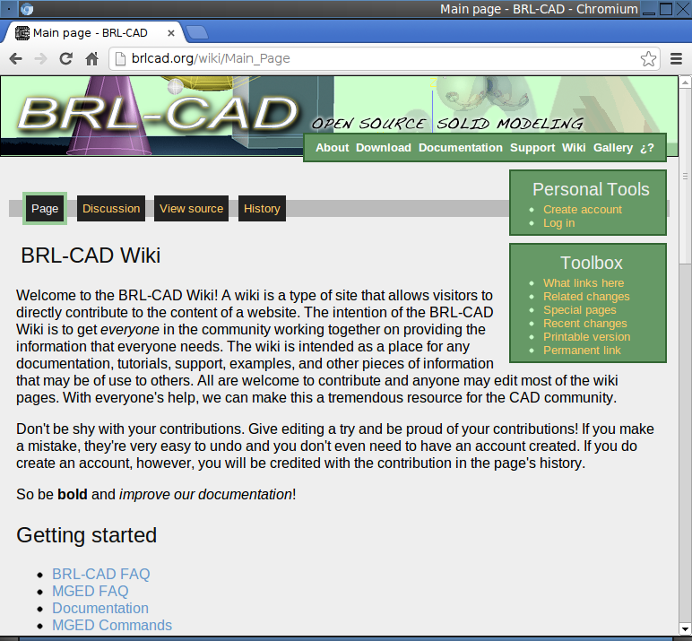

==== Man Pages

Man pages are command-specific or program-specific documentation which thoroughly document and demonstrate the use of that command or program. Man pages may reference other man pages, but they are intended to be the primary source of documentation for a specific tool and should be written with a very tight focus.

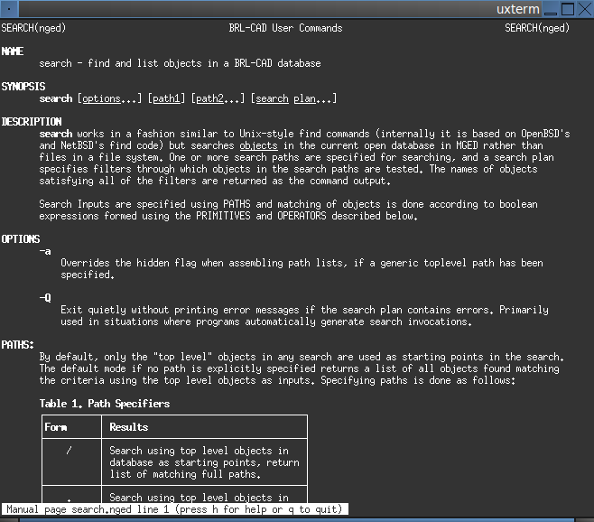

==== API Documentation

Most of the project's documentation is maintained in the BRL-CAD source code repository as AsciiDoc files (see the chapter Working with Our Documentation for more information about AsciiDoc). API documentation, on the other hand, is automatically generated from the headers in the application's source code. Specially formatted source code comments in the headers are converted to HTML documentation by http://www.doxygen.org/[Doxygen] (http://www.doxygen.org), a tool for generating source code documentation.

API documentation is the lowest level, most authoritative documentation of BRL-CAD's programming interfaces. However, it does not address user-level programs or commands.

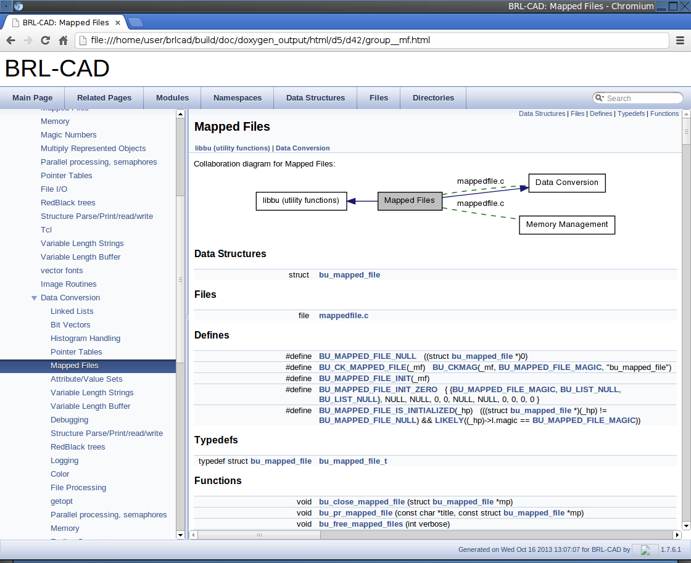

==== Lessons

Lessons are documents that are used to train a user to master a particular aspect of BRL-CAD. Unlike other documents, lessons focus on step-by-step teaching.

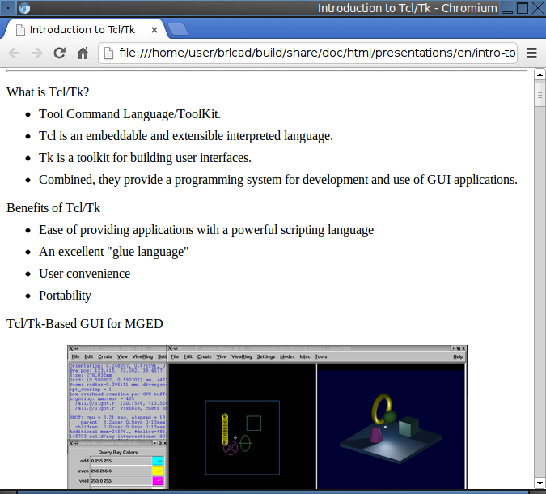

==== Reports and Articles

These can be technical reports, journal articles, conference papers, and/or similar focused descriptions of specific aspects of the package. Unlike lessons, reports and articles are primarily designed to inform rather than train. They are generally less comprehensive in scope and/or detail than a full-blown book.

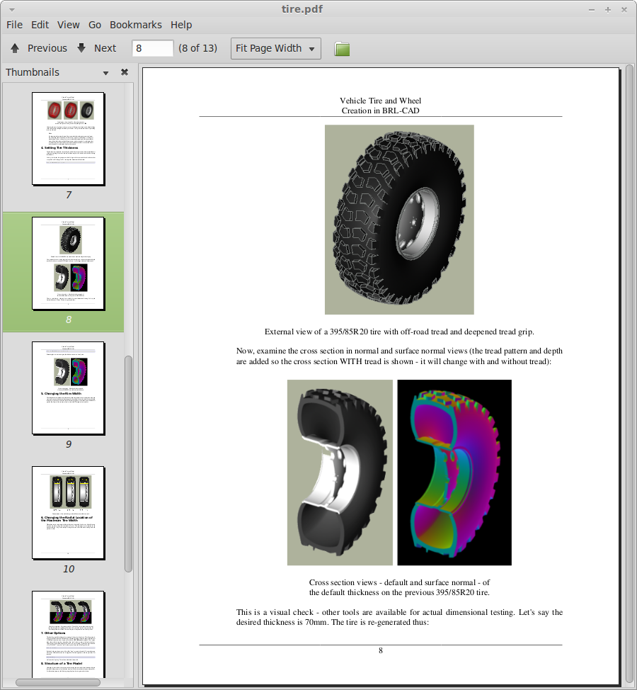

==== Books

Books are typically large documents that cover many aspects of BRL-CAD. In some cases, books can be collections of lessons, reports, articles, and/or other forms of documentation that are compiled between one set of covers.

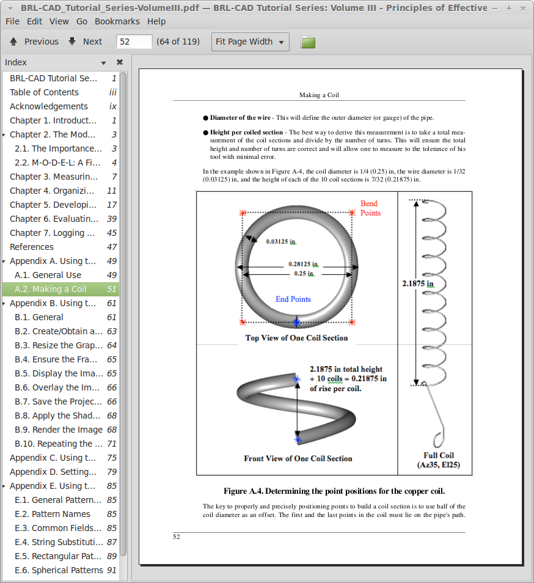

==== Specifications

Specifications are formal documents that define formats or protocols that others can independently implement. Currently, the only specification in the BRL-CAD documentation set is a draft specification of the .g file format.

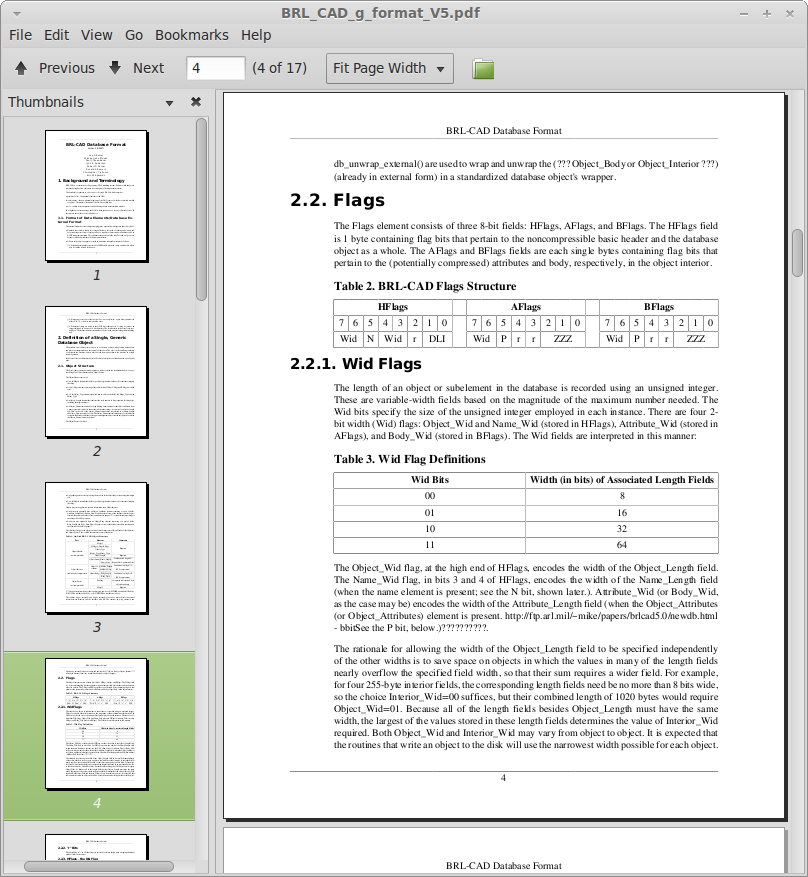

==== Presentations

Presentations can range from an overview of the entire BRL-CAD package to an in-depth review of a specific feature or technical algorithm. Presentations are often used when marketing or explaining some aspect of BRL-CAD to people who are not familiar with it.

=== What Documentation to Work On

If you would like to work on a major project, then this section is for you. Depending on how much you want to participate, we have documentation tasks that you can tackle and complete in a short or longer time. In any case, you are invited to work on the documentation for BRL-CAD forever.

Like our development tasks, the documentation tasks that we have available can take you anywhere from two hours to two days to two or more weeks to complete.

==== Two-Hour Tasks

If you want to get started working on the BRL-CAD documentation immediately, one great way to do that is by helping to clean up the existing documentation. Take a look at the documentation and check the spelling or copy edit it to make the documentation more concise or to correct problems with grammar or punctuation. Alternatively, check out our list of http://brlcad.org/wiki/Deuces#Documentation_and_Training[documentation tasks] (http://brlcad.org/wiki/Deuces#Documentation_and_Training) that you can complete in two hours or less.

==== Two-Day Tasks

If you have a little more time to devote to the documentation, we maintain a list of tasks that will take you anywhere from a few hours to a few days to complete. You can find that list on the http://brlcad.org/wiki/Contributor_Quickies[BRL-CAD website] (http://brlcad.org/wiki/Contributor_Quickies). These tasks have roughly the same complexity and require no prior experience with BRL-CAD.

We also have a list of bugs in our https://github.com/BRL-CAD/brlcad/blob/main/BUGS[BUGS file]. While most of the bugs in the list focus on the BRL-CAD code, there are a few related to the documentation. If you plan to tackle a documentation bug, remember to report it in our https://github.com/BRL-CAD/brlcad/issues[issue tracker] (https://github.com/BRL-CAD/brlcad/issues).

==== Two-Week Tasks

If you are familiar with CAD in general and BRL-CAD in particular, then you might want to try creating some tutorial and training material. Check out our list of http://brlcad.org/wiki/Contributor_Quickies#Training[training material that we need] (http://brlcad.org/wiki/Contributor_Quickies#Training).

=== Contributing Documentation

Writing and updating BRL-CAD's documentation becomes easier when you understand how to obtain and modify the source files for the documentation.

[NOTE]
====
For more information about creating and modifying documentation, refer to the chapter Working with Our Documentation earlier in this book.

====

==== Obtaining the Documentation

The documentation and the toolchain required to generate the documentation is part of the software's development code. You should download the source code from the Git version control system using the following command:

*git clone https://github.com/BRL-CAD/brlcad*

The `brlcad` directory should be kept separate from your build directory so that BRL-CAD's build outputs don't clutter the source tree.

BRL-CAD's AsciiDoc documentation is rendered by the bundled *asciiquack* processor, so no additional documentation software needs to be installed. You only need a compiler, CMake, and a build environment.

===== Configure

Next, you must set up the build directory and configure the compilation with documentation enabled. Run the following command from an empty build directory:

*cmake ../brlcad -DBRLCAD_EXTRADOCS=ON*

===== Generate the Documentation

Once you've configured the compilation, you can run the following build targets to generate the documentation:

* doc (to generate both the HTML documentation and the UNIX man pages)
* html (to generate the HTML version of the documentation)
* man (to generate the UNIX man pages)

==== Where to Find the Documentation

You can find the source files for the documentation in the following directories in the BRL-CAD source code repository:

`doc/`::
Project documentation

`doc/asciidoc/`::
User and developer documentation in AsciiDoc format
+
See the file `doc/asciidoc/README.adoc` for more details

You can find more information about editing the documentation in the chapter Working with Our Documentation earlier in this book.

Remember to:

* Get in touch with experienced contributors if you have any questions.
* Compile your changes before committing them.

==== Discussing the Documentation

Before undertaking a documentation task, you should join the BRL-CAD community on https://brlcad.zulipchat.com[Zulip chat] and, for longer discussions, our https://github.com/BRL-CAD/brlcad/discussions[GitHub Discussions]. A secondary, legacy IRC channel named #brlcad is also available on irc.libera.chat.

Joining the discussion helps introduce you to the BRL-CAD community and gives you the opportunity to regularly communicate with other experienced contributors. You can ask questions on Zulip, in GitHub Discussions, or on IRC.

BRL-CAD contributors have a set of rules that they try to respect and follow to enable collaboration and communication. We strongly encourage new contributors to be creative and to be specific when asking questions. We also strongly advise you to use interleaved posting when replying on any communication channel. And once again, _don't be afraid to ask questions_.

== Other Contributors

=== You Can Help Too

So you don't code or write documentation? That doesn't matter. You can still contribute to the BRL-CAD project. Other areas in which we need help with include:

* Bug Reporting and Feature Requests
* Outreach and Artwork
* Quality Assurance
* Research
* Translations
* User Experience

Most of the tasks in these areas don't require deep technical skills, but they are definitely important. They need your time, your commitment, and your passion. If find any of these areas interesting, then BRL-CAD has a place for you.

Let's take a look at a few other ways that you can contribute to the BRL-CAD project.

==== Bug Reporting and Feature Requests

Finding bugs in software is often a challenging task for developers. If you find a problem with the software, file a bug report on BRL-CAD's official https://github.com/BRL-CAD/brlcad/issues[issue tracker] (https://github.com/BRL-CAD/brlcad/issues). Please remember to provide enough detail so that we can reproduce the problem. You can also raise the issue on https://brlcad.zulipchat.com[Zulip chat] or in our https://github.com/BRL-CAD/brlcad/discussions[GitHub Discussions].

In addition, if you have a suggestion for a new feature, feel free to submit a request on the same https://github.com/BRL-CAD/brlcad/issues[issue tracker] (https://github.com/BRL-CAD/brlcad/issues). You can also share the idea on https://brlcad.zulipchat.com[Zulip chat] or in our https://github.com/BRL-CAD/brlcad/discussions[GitHub Discussions].

==== Outreach and Artwork

BRL-CAD has a large and passionate community of users and contributors. We need people to work with that community and to help with marketing and promoting the software.

As well, we need professional-quality artwork. Everything from logos to diagrams to icons. And just about anything in between. Your efforts will help give BRL-CAD a more polished look and will support our outreach and marketing efforts.

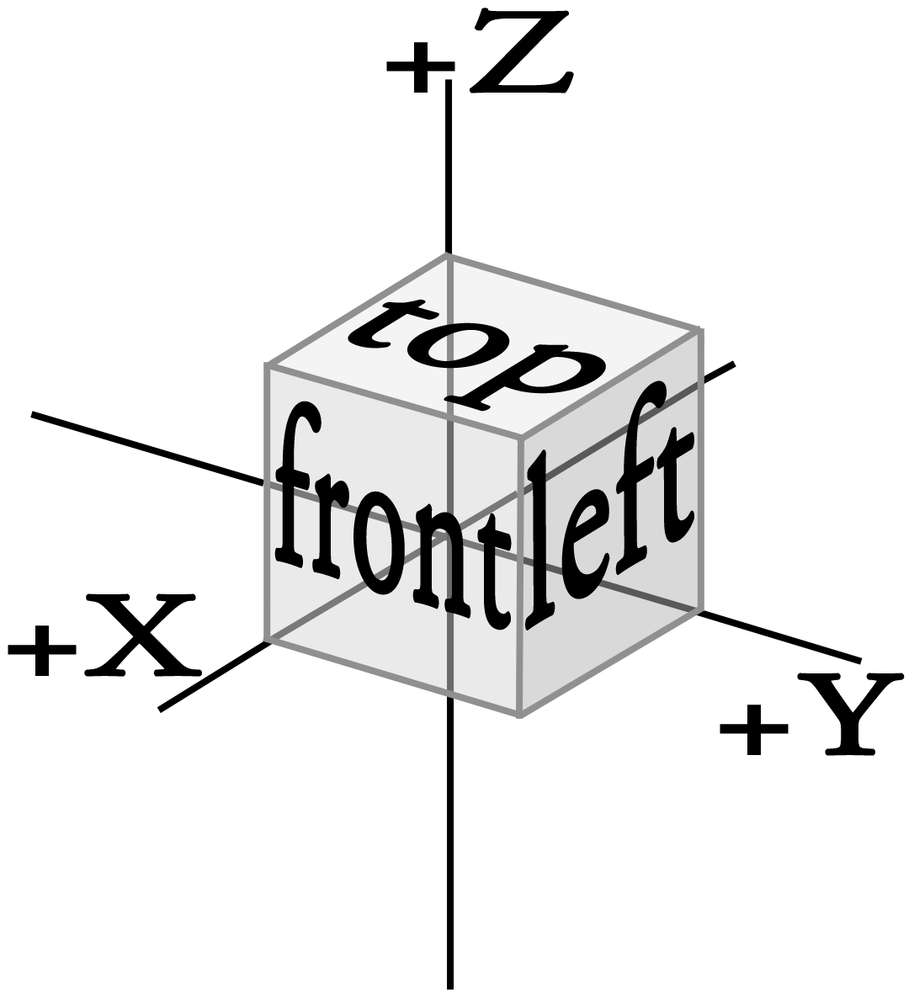

The preceding diagram was created to illustrate BRL-CAD's coordinate system.

You can find a list of outreach and artwork tasks that will get you started at the http://brlcad.org/wiki/Contributor_Quickies#Outreach[BRL-CAD website] (http://brlcad.org/wiki/Contributor_Quickies#Outreach).

==== Quality Assurance

Testing is a vital part of the software development process. As Eric Raymond said, "given enough eyeballs, all bugs are shallow." We need your eyeballs to help us ensure that the code for BRL-CAD is of the highest quality.

What can you do? Create testing frameworks and tests for specific portions of the code. Or go through BRL-CAD's graphical user interface and find and report any bugs. You can help make BRL-CAD better by reporting any problems you encounter.

You can find a list of quality assurance tasks that will get you started at the http://brlcad.org/wiki/Contributor_Quickies#Quality_Assurance[BRL-CAD website] (http://brlcad.org/wiki/Contributor_Quickies#Quality_Assurance).

==== Research

BRL-CAD improves not just through rigorous coding and quality assurance but also through research. We need contributors who can study problems with the software and recommend solutions based on their research. This is an area which typically requires a solid level of technical ability, but contributions here can have an enormous positive impact on the software.

You can find a list of research tasks that will get you started at the http://brlcad.org/wiki/Contributor_Quickies#Research[BRL-CAD website] (http://brlcad.org/wiki/Contributor_Quickies#Research).

==== Translations

We want to make BRL-CAD available to as many users as possible, regardless of what language they speak. To that end, we're steadily making the software available in a number of languages. But there's still work to do. If you have a knowledge or one or more languages other than English, we can use your skills.

You can find a list of translation tasks that will get you started at the http://brlcad.org/wiki/Contributor_Quickies#Translation[BRL-CAD website] (http://brlcad.org/wiki/Contributor_Quickies#Translation).

==== User Experience

BRL-CAD is a large, powerful, and complex piece of software. And as with any software package, it can always be made more consistent, usable, and user friendly. If you're willing to learn the user interface and to approach the package with a critical eye, then you can help make the BRL-CAD user interface friendlier and more consistent.

You can find a list of user experience tasks that will get you started at the http://brlcad.org/wiki/Contributor_Quickies#User_Interface[BRL-CAD website] (http://brlcad.org/wiki/Contributor_Quickies#User_Interface).

== Appendix: Resources and Examples

[appendix]
=== Further References and Resources

In addition to the resources provided previously in this book, the following resources are available to provide additional help and guidance to BRL-CAD contributors:

* Wiki: http://brlcad.org/wiki/Main_Page
* FAQs: http://brlcad.org/wiki/FAQ
* Online documentation resources: http://brlcad.org/wiki/Documentation
* Venerated developers' guide (HACKING File): https://github.com/BRL-CAD/brlcad/blob/main/HACKING
* BRL-CAD commands: http://brlcad.org/wiki/BRL-CAD_Commands
* MGED command reference: http://brlcad.org/wiki/MGED_Commands
* BRL-CAD primitives reference: http://brlcad.org/wiki/BRL-CAD_Primitives
* Git: http://brlcad.org/wiki/Git
* BRL-CAD patch submission: http://brlcad.org/wiki/Patches
* Image gallery: http://brlcad.org/gallery/
* BRL-CAD Github page: http://github.com/BRL-CAD/brlcad/
* Application requirements for Google Summer of Code (GSoC) participants: http://brlcad.org/wiki/Google_Summer_of_Code/Application_Guidelines
* Acceptance requirements for Google Summer of Code (GSoC) participants: http://brlcad.org/wiki/Google_Summer_of_Code/Acceptance
* Behavioral expectations for GSoC participants: http://brlcad.org/wiki/Google_Summer_of_Code/Expectations
* An exemplary development plan for potential GSoC student projects: http://brlcad.org/wiki/User:Phoenix/GSoc2012/Proposal#Development_schedule

[appendix]
=== Doc Template: New MGED Command

The following AsciiDoc template illustrates the general structure that is used when defining a man page for MGED commands, along with examples of how elements such as paragraphs, lists, and examples are included. Save the source as `commandname.adoc` in `doc/asciidoc/system/mann/` and register it in that directory's `CMakeLists.txt`. When rendered by asciiquack, the `:doctype: manpage` attribute produces a section-n manual page in addition to HTML. If you haven't worked with AsciiDoc before, refer to the section What is AsciiDoc? in the chapter Working with our Documentation.

....
= COMMANDNAME(nged)
:doctype: manpage
:mansource: BRL-CAD
:manmanual: BRL-CAD MGED Commands

== NAME
commandname - A one-line summary of what the command does.

== SYNOPSIS

[source]
----
commandname [options] arguments
----

[[description]]
== DESCRIPTION

A full description of the command goes here, in one or more paragraphs.

The following options are supported:

* *-a* - Description of the -a option.
* *-b* - Description of the -b option.

[[examples]]
== EXAMPLES

.A short caption describing the first example.
[example]
====
mged>**commandname arg**

An explanation of what this invocation does and what output to expect.
====

== AUTHOR

BRL-CAD Team

== BUG REPORTS

Reports of bugs or problems should be submitted via the issue tracker at
https://github.com/BRL-CAD/brlcad/issues, or raised on Zulip chat at
https://brlcad.zulipchat.com.
....

[appendix]
=== Code Example: Shooting Rays

Shooting rays at models is one of the more common operations performed with BRL-CAD models. The following example illustrates how to use librt's C API to shoot a ray at a model and how to work with the results.

----

#include "common.h"
#include <stdlib.h>
#include <math.h>
#include <string.h>
#include <stdio.h>
#include "vmath.h"              /* vector math macros */
#include "raytrace.h"           /* librt interface definitions */

/**
 * rt_shootray() was told to call this on a hit.
 *
 * This callback routine utilizes the application structure which
 * describes the current state of the raytrace.
 *
 * This callback routine is provided a circular linked list of
 * partitions, each one describing one in and out segment of one
 * region for each region encountered.
 *
 * The 'segs' segment list is unused in this example.
 */
HIDDEN int
hit(struct application *ap, struct partition *PartHeadp, struct seg *UNUSED(segs))
{
    /* iterating over partitions, this will keep track of the current
     * partition we're working on.
     */
    struct partition *pp;

    /* will serve as a pointer for the entry and exit hitpoints */
    struct hit *hitp;

    /* will serve as a pointer to the solid primitive we hit */
    struct soltab *stp;

    /* will contain surface curvature information at the entry */
    struct curvature cur = RT_CURVATURE_INIT_ZERO;

    /* will contain our hit point coordinate */
    point_t pt;

    /* will contain normal vector where ray enters geometry */
     vect_t inormal;

    /* will contain normal vector where ray exits geometry */
    vect_t onormal;

    /* iterate over each partition until we get back to the head.
     * each partition corresponds to a specific homogeneous region of
     * material.
     */
    for (pp=PartHeadp->pt_forw; pp != PartHeadp; pp = pp->pt_forw) {

        /* print the name of the region we hit as well as the name of
         * the primitives encountered on entry and exit.
         */
        bu_log("\n--- Hit region %s (in %s, out %s)\n",
               pp->pt_regionp->reg_name,
               pp->pt_inseg->seg_stp->st_name,
               pp->pt_outseg->seg_stp->st_name );

        /* entry hit point, so we type less */
        hitp = pp->pt_inhit;

        /* construct the actual (entry) hit-point from the ray and the
         * distance to the intersection point (i.e., the 't' value).
         */
        VJOIN1(pt, ap->a_ray.r_pt, hitp->hit_dist, ap->a_ray.r_dir);

        /* primitive we encountered on entry */
        stp = pp->pt_inseg->seg_stp;

        /* compute the normal vector at the entry point, flipping the
         * normal if necessary.
         */
        RT_HIT_NORMAL(inormal, hitp, stp, &(ap->a_ray), pp->pt_inflip);

        /* print the entry hit point info */
        rt_pr_hit("  In", hitp);
        VPRINT(   "  Ipoint", pt);
        VPRINT(   "  Inormal", inormal);

        /* This next macro fills in the curvature information which
         * consists on a principle direction vector, and the inverse
         * radii of curvature along that direction and perpendicular
         * to it.  Positive curvature bends toward the outward
         * pointing normal.
         */
        RT_CURVATURE(&cur, hitp, pp->pt_inflip, stp);

        /* print the entry curvature information */
        VPRINT("PDir", cur.crv_pdir);
        bu_log(" c1=%g\n", cur.crv_c1);
        bu_log(" c2=%g\n", cur.crv_c2);

        /* exit point, so we type less */
        hitp = pp->pt_outhit;

        /* construct the actual (exit) hit-point from the ray and the
         * distance to the intersection point (i.e., the 't' value).
         */
        VJOIN1(pt, ap->a_ray.r_pt, hitp->hit_dist, ap->a_ray.r_dir);

        /* primitive we exited from */
        stp = pp->pt_outseg->seg_stp;

        /* compute the normal vector at the exit point, flipping the
         * normal if necessary.
         */
        RT_HIT_NORMAL(onormal, hitp, stp, &(ap->a_ray), pp->pt_outflip);

        /* print the exit hit point info */
        rt_pr_hit("  Out", hitp);
        VPRINT(   "  Opoint", pt);
        VPRINT(   "  Onormal", onormal);
    }

    /* A more complicated application would probably fill in a new
     * local application structure and describe, for example, a
     * reflected or refracted ray, and then call rt_shootray() for
     * those rays.
     */

    /* Hit routine callbacks generally return 1 on hit or 0 on miss.
     * This value is returned by rt_shootray().
     */
    return 1;
}

/**
 * This is a callback routine that is invoked for every ray that
 * entirely misses hitting any geometry.  This function is invoked by
 * rt_shootray() if the ray encounters nothing.
 */
HIDDEN int
miss(struct application *UNUSED(ap))
{
    bu_log("missed\n");
    return 0;
}

int
main(int argc, char **argv)
{
    /* Every application needs one of these.  The "application"
     * structure carries information about how the ray-casting should
     * be performed.  Defined in the raytrace.h header.
     */
    struct application  ap;

    /* The "raytrace instance" structure contains definitions for
     * librt which are specific to the particular model being
     * processed.  One copy exists for each model.  Defined in
     * the raytrace.h header and is returned by rt_dirbuild().
     */
    static struct rt_i *rtip;

    /* optional parameter to rt_dirbuild() that can be used to capture
     * a title if the geometry database has one set.
     */
    char title[1024] = {0};

    /* Check for command-line arguments.  Make sure we have at least a
     * geometry file and one geometry object on the command line.
     */
    if (argc < 3) {
        bu_exit(1, "Usage: %s model.g objects...\n", argv[0]);
    }

    /* Load the specified geometry database (i.e., a ".g" file).
     * rt_dirbuild() returns an "instance" pointer which describes the
     * database to be raytraced.  It also gives you back the title
     * string if you provide a buffer.  This builds a directory of the
     * geometry (i.e., a table of contents) in the file.
     */
    rtip = rt_dirbuild(argv[1], title, sizeof(title));
    if (rtip == RTI_NULL) {
        bu_exit(2, "Building the db directory for [%s] FAILED\n", argv[1]);
    }

    /* Display the geometry database title obtained during
     * rt_dirbuild if a title is set.
     */
    if (title[0]) {
        bu_log("Title:\n%s\n", title);
    }

    /* Walk the geometry trees.  Here you identify any objects in the
     * database that you want included in the ray trace by iterating
     * of the object names that were specified on the command-line.
     */
    while (argc > 2)  {
        if (rt_gettree(rtip, argv[2]) < 0)
            bu_log("Loading the geometry for [%s] FAILED\n", argv[2]);
        argc--;
        argv++;
    }

    /* This next call gets the database ready for ray tracing.  This
     * causes some values to be precomputed, sets up space
     * partitioning, computes bounding volumes, etc.
     */
    rt_prep_parallel(rtip, 1);

    /* initialize all values in application structure to zero */
    RT_APPLICATION_INIT(&ap);

    /* your application uses the raytrace instance containing the
     * geometry we loaded.  this describes what we're shooting at.
     */
    ap.a_rt_i = rtip;

    /* stop at the first point of intersection or shoot all the way
     * through (defaults to 0 to shoot all the way through).
     */
    ap.a_onehit = 0;

    /* Set the ray start point and direction rt_shootray() uses these
     * two to determine what ray to fire.  In this case we simply
     * shoot down the z axis toward the origin from 10 meters away.
     *
     * It's worth nothing that librt assumes units of millimeters.
     * All geometry is stored as millimeters regardless of the units
     * set during editing.  There are libbu routines for performing
     * unit conversions if desired.
     */
    VSET(ap.a_ray.r_pt, 0.0, 0.0, 10000.0);
    VSET(ap.a_ray.r_dir, 0.0, 0.0, -1.0);

    /* Simple debug printing */
    VPRINT("Pnt", ap.a_ray.r_pt);
    VPRINT("Dir", ap.a_ray.r_dir);

    /* This is what callback to perform on a hit. */
    ap.a_hit = hit;

    /* This is what callback to perform on a miss. */
    ap.a_miss = miss;

    /* Shoot the ray. */
    (void)rt_shootray(&ap);

    /* A real application would probably set up another ray and fire
     * again or do something a lot more complex in the callbacks.
     */

    return 0;
}
----

[appendix]
=== Code Example: Walking Geometry

BRL-CAD's models are hierarchical. Primitive shapes are combined with boolean operations into more complex shapes, which are in turn built into even more complex shapes with additional operations. Navigating these hierarchies via tree walking is a standard operation in BRL-CAD.

----

#include "common.h"
#include "raytrace.h"

/* basically this callback function counts how many CSG nodes are underneath
 * a given combination tree hierarchy.
 */
int
incr_region(struct db_tree_state *tsp, struct db_full_path *pathp, const struct rt_comb_internal *combp, void *data)
{
  int *counter = (int*)data;
  bu_log("...incrementing...\n");
  (*counter)++;
  return 0;
}

int
main(int argc, char *argv[])
{
  struct db_i *dbip;
  int counter = 0;
  struct db_tree_state state = rt_initial_tree_state;

  if (argc < 2) {
    bu_exit(0, "need more, db.g obj\n");
  }

  /* open a .g file for reading */
  dbip = db_open(argv[1], "r");
  if (dbip == NULL) {
    bu_exit(1, "Unable to open %s\n", argv[1]);
  }

  /* build a directory of objects */
  if (db_dirbuild(dbip) < 0) {
    db_close(dbip);
    bu_exit(1, "Unable to load %s\n", argv[1]);
  }

  bu_log("Database title is:\n%s\n", dbip->dbi_title);
  bu_log("Units: %s\n", bu_units_string(dbip->dbi_local2base));

  /* load a particular combination object */
  if (db_lookup(dbip, argv[2], 1) == NULL) {
    db_close(dbip);
    bu_exit(1, "Unable to find %s\n", argv[2]);
  }

  state.ts_dbip = dbip;
  state.ts_resp = &rt_uniresource;
  rt_init_resource( &rt_uniresource, 0, NULL );

  /* walk that combination object's hierarchy,
   * calling our incr_region() callback function.
   * we pass a pointer to our counter variable.
   */
  db_walk_tree(dbip, 1, (const char **)argv+2, 1, &state, incr_region, NULL, NULL, &counter);

  bu_log("counter is %d\n", counter);

  return 0;
}
----

[appendix]
=== Code Example: Command Plugin

The Geometry Editing Library (libged) defines commands for working with BRL-CAD models. The following code illustrates how individual commands are defined within the library.

----

#include "common.h"
#include "bio.h"
#include "bu.h"
#include "ged.h"

HIDDEN int
zoom(struct ged *gedp, double sf)
{
    gedp->ged_gvp->gv_scale /= sf;
    if (gedp->ged_gvp->gv_scale < RT_MINVIEWSCALE)
        gedp->ged_gvp->gv_scale = RT_MINVIEWSCALE;
    gedp->ged_gvp->gv_size = 2.0 * gedp->ged_gvp->gv_scale;
    gedp->ged_gvp->gv_isize = 1.0 / gedp->ged_gvp->gv_size;
    ged_view_update(gedp->ged_gvp);

    return GED_OK;
}

int
ged_zoom(struct ged *gedp, int argc, const char *argv[])
{
    int ret;
    double sf = 1.0;

    GED_CHECK_VIEW(gedp, GED_ERROR);
    GED_CHECK_ARGC_GT_0(gedp, argc, GED_ERROR);

    /* must be wanting help */
    if (argc != 2) {
        bu_vls_printf(gedp->ged_result_str, "Usage: %s scale_factor", argv[0]);
        return (argc == 1) ? GED_HELP : GED_ERROR;
    }

    /* get the scale factor */
    ret = bu_sscanf(argv[1], "%lf", &sf);
    if (ret != 1 || sf < SMALL_FASTF || sf > INFINITY) {
        bu_vls_printf(gedp->ged_result_str, "ERROR: bad scale factor [%s]", argv[1]);
        return GED_ERROR;
    }

    return zoom(gedp, sf);
}
----

[appendix]
=== Example Code: Root Solving

Root solving is (among other things) a key step in the raytracing of many of BRL-CAD's primitives. The following examples illustrate how to solve various types of polynomial equations using BRL-CAD's root solver.

----

#include "common.h"
#include "bu.h"
#include "vmath.h"
#include "bn.h"
#include "raytrace.h"

int
main(int argc, char *argv[])
{
    bn_poly_t equation; /* holds our polynomial equation */
    bn_complex_t roots[BN_MAX_POLY_DEGREE]; /* stash up to six roots */
    int num_roots;

    if (argc > 1)
        bu_exit(1, "%s: unexpected argument(s)\n", argv[0]);

/*********************************************
     * Linear polynomial (1st degree equation):
     *  A*X + B = 0
     * [0]   [1]     <= coefficients
     */
    equation.dgr = 1;
    equation.cf[0] = 1;  /* A */
    equation.cf[1] = -2;  /* B */

    /* print the equation */
    bu_log("\n*** LINEAR ***\n");
    bn_pr_poly("Solving for Linear", &equation);
    /* solve for the roots */
    num_roots = rt_poly_roots(&equation, roots, "My Linear Polynomial");
    if (num_roots == 0) {
        bu_log("No roots found!\n");
        return 0;
    } else if (num_roots < 0) {
        bu_log("The root solver failed to converge on a solution\n");
        return 1;
    }

    /*  A*X + B = 0
     *  1*X + -2 = 0
     *    X -  2 = 0
     *    X      = 2
     */
    /* print the roots */
    bu_log("The root should be 2\n");
    bn_pr_roots("My Linear Polynomial", roots, num_roots);

 /*********************************************
     * Quadratic polynomial (2nd degree equation):
     *  A*X^2 + B*X + C = 0
     * [0]     [1]   [2]     <=coefficients
     */
    equation.dgr = 2;
    equation.cf[0] = 1;  /* A */
    equation.cf[1] = 0;  /* B */
    equation.cf[2] = -4; /* C */

    /* print the equation */
    bu_log("\n*** QUADRATIC ***\n");
    bn_pr_poly("Solving for Quadratic", &equation);

    /* solve for the roots */
    num_roots = rt_poly_roots(&equation, roots, "My Quadratic Polynomial");
    if (num_roots == 0) {
        bu_log("No roots found!\n");
        return 0;
    } else if (num_roots < 0) {
        bu_log("The root solver failed to converge on a solution\n");
        return 1;
    }

    /*  A*X^2 + B*X +  C = 0
     *  1*X^2 + 0*X + -4 = 0
     *    X^2       -  4 = 0
     * (X - 2) * (X + 2) = 0
     *  X - 2 = 0, X + 2 = 0
     *  X = 2, X = -2
     */
    /* print the roots */
    bu_log("The roots should be 2 and -2\n");
    bn_pr_roots("My Quadratic Polynomial", roots, num_roots);

 /*****************************************
     * Cubic polynomial (3rd degree equation):
     *  A*X^3 + B*X^2 + C*X + D = 0
     * [0]     [1]     [2]   [3]     <=coefficients
     */
    equation.dgr = 3;
    equation.cf[0] = 45;
    equation.cf[1] = 24;
    equation.cf[2] = -7;
    equation.cf[3] = -2;

    /* print the equation */
    bu_log("\n*** CUBIC ***\n");
    bn_pr_poly("Solving for Cubic", &equation);

    /* solve for the roots */
    num_roots = rt_poly_roots(&equation, roots, "My Cubic Polynomial");
    if (num_roots == 0) {
        bu_log("No roots found!\n");
        return 0;
    } else if (num_roots < 0) {
        bu_log("The root solver failed to converge on a solution\n");
        return 1;
    }

    /* print the roots */
    bu_log("The roots should be 1/3, -1/5, and -2/3\n");
    bn_pr_roots("My Cubic Polynomial", roots, num_roots);

 /*******************************************
     * Quartic polynomial (4th degree equation):
     *  A*X^4 + B*X^3 + C*X^2 + D*X + E = 0
     * [0]     [1]     [2]     [3]   [4]     <=coefficients
     */
    equation.dgr = 4;
    equation.cf[0] = 2;
    equation.cf[1] = 4;
    equation.cf[2] = -26;
    equation.cf[3] = -28;
    equation.cf[4] = 48;

    /* print the equation */
    bu_log("\n*** QUARTIC ***\n");
    bn_pr_poly("Solving for Quartic", &equation);

    /* solve for the roots */
    num_roots = rt_poly_roots(&equation, roots, "My Quartic Polynomial");
    if (num_roots == 0) {
        bu_log("No roots found!\n");
        return 0;
    } else if (num_roots < 0) {
        bu_log("The root solver failed to converge on a solution\n");
        return 1;
    }
    /* print the roots */
    bu_log("The roots should be 3, 1, -2, -4\n");
    bn_pr_roots("My Quartic Polynomial", roots, num_roots);

 /*******************************************
     * Sextic polynomial (6th degree equation):
     *  A*X^6 + B*X^5 + C*X^4 + D*X^3 + E*X^2 + F*X + G = 0
     * [0]     [1]     [2]     [3]     [4]     [5]   [6]  <=coefficients
     */

    equation.dgr = 6;
    equation.cf[0] = 1;
    equation.cf[1] = -8;
    equation.cf[2] = 32;
    equation.cf[3] = -78;
    equation.cf[4] = 121;
    equation.cf[5] = -110;
    equation.cf[6] = 50;

    /* print the equation */
    bu_log("\n*** SEXTIC ***\n");
    bn_pr_poly("Solving for Sextic", &equation);

    /* solve for the roots */
    num_roots = rt_poly_roots(&equation, roots, "My Sextic Polynomial");
    if (num_roots == 0) {
        bu_log("No roots found!\n");
        return 0;
    } else if (num_roots < 0) {
        bu_log("The root solver failed to converge on a solution\n");
        return 1;
    }

    /* print the roots */
    bu_log("The roots should be 1 - i, 1 + i, 2 - i,2 + i, 1 - 2*i, 1 + 2*i \n");
    bn_pr_roots("My Sextic Polynomial", roots, num_roots);

    return 0;
}
----
