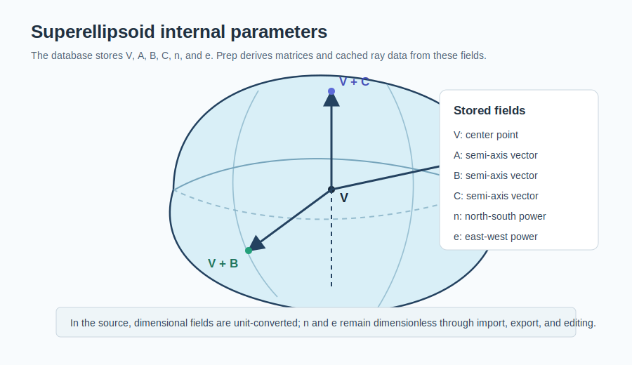
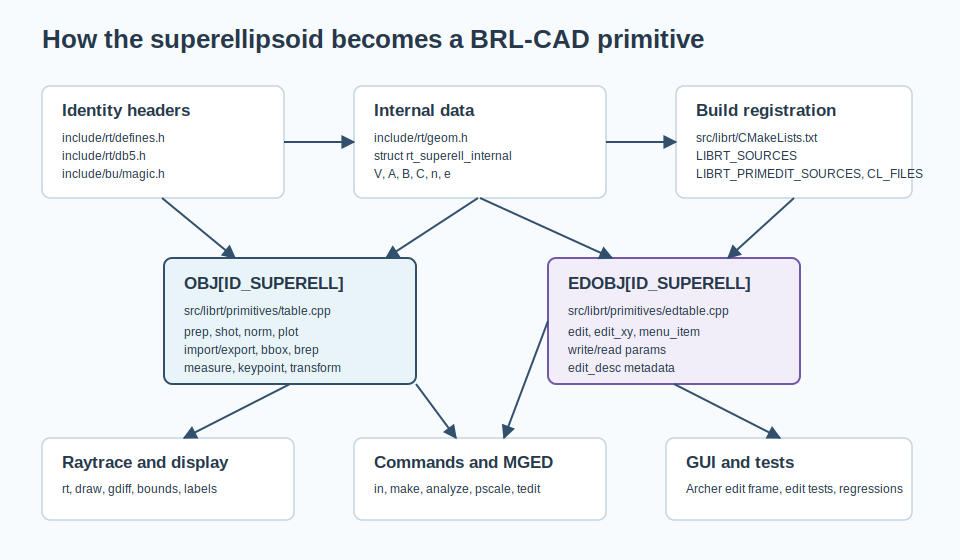
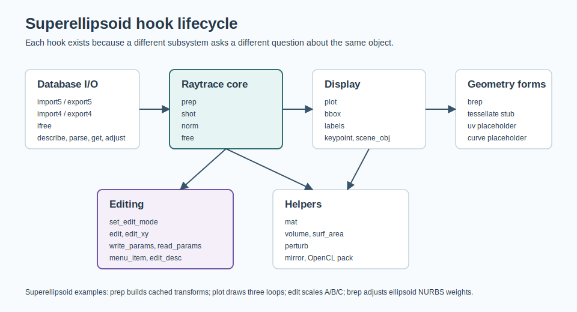

= Adding a New Primitive to BRL-CAD: Superellipsoid Walkthrough
BRL-CAD Development Team <devs@brlcad.org>
:doctype: article
:toc:
:toclevels: 3

This tutorial explains how a BRL-CAD primitive becomes a real database entity,
using the superellipsoid as the concrete example throughout.  The goal is not to
copy the superellipsoid blindly, but to use its actual source paths, data
layout, librt hooks, MGED hooks, libged helpers, OpenCL support, and tests as a
map for adding another primitive.

The superellipsoid is a good example because it touches most primitive
extension points without being artificially ideal.  It has CPU ray tracing,
wireframe drawing, import/export, BREP conversion, bounds, labels, keypoints,
measures, matrix transforms, perturbation, mirroring, OpenCL support, type-in
creation, `make` defaults, MGED and Archer editing, and regression tests.  It
also has explicit placeholders for unfinished hooks such as `rt_superell_tess`,
`rt_superell_curve`, and `rt_superell_uv`, which is useful when deciding whether
a new primitive should register a hook, leave a hook NULL, or document a stub.

[[superell_anatomy]]
== The example primitive

A superellipsoid is stored in BRL-CAD as `struct rt_superell_internal` in
`include/rt/geom.h`.  Its fields are:

* `v`: center point, labeled `V` in editors.
* `a`, `b`, `c`: semi-axis vectors, labeled by their endpoint keypoints
  `A`, `B`, and `C`.
* `n`: north-south curvature exponent.
* `e`: east-west curvature exponent.

.Superellipsoid parameter anatomy.

The exact internal structure is:

....
struct rt_superell_internal {
    uint32_t magic;
    point_t v;
    vect_t a;
    vect_t b;
    vect_t c;
    double n;
    double e;
};
....

When creating another primitive, start by writing the same kind of short
inventory before coding.  Decide what data is intrinsic, what is derived, what
must survive database import/export, what should scale with model units, and
what should remain dimensionless.  In the superellipsoid, `v`, `a`, `b`, and
`c` are length data and are unit-converted during I/O and editing; `n` and `e`
are dimensionless and are stored without unit conversion.

[[implementation_plan]]
== Implementation plan

Adding a primitive is a sequence of registrations.  The superellipsoid wiring
falls into these groups:

[cols="1,3"]
|===
|Area
|Superellipsoid example

|Identity and public data
|`include/rt/defines.h`, `include/rt/db5.h`, `include/bu/magic.h`,
`include/rt/geom.h`, and, for v4 compatibility, `include/rt/db4.h`.

|Core librt behavior
|`src/librt/primitives/superell/superell.c`,
`superell_brep.cpp`, `superell_mirror.c`, `superell_shot.cl`,
`edsuperell.c`, `src/librt/primitives/table.cpp`, and
`src/librt/primitives/edtable.cpp`.

|Build and data installation
|`src/librt/CMakeLists.txt`, including `LIBRT_SOURCES`,
`LIBRT_PRIMEDIT_SOURCES`, `CL_FILES`, and `librt_ignored_files`.

|Command creation and editing
|`src/libged/typein/typein.c`, `src/libged/make/make.c`,
`src/libged/edit/scale_superell.c`, `src/mged/menu.c`,
`src/mged/edsol.c`, `src/mged/tedit.c`, and Archer Tcl edit files.

|Analysis, utility, and testing
|`src/libged/analyze/superell.cpp`, `src/libged/get_solid_kp.c`,
`src/librt/tests/edit/superell.cpp`, `src/librt/tests/edit/edit_desc.cpp`,
`src/libged/tests/edit/test_edit.cpp`, and `regress/mged/prim_edit.mged`.
|===

.Registration and application flow for the superellipsoid.

[[headers_and_identity]]
== Add the entity to headers

Header registration makes the primitive recognizable to database I/O, public
APIs, runtime type checks, and tools that switch on `ID_*`.

[[type_id]]
=== Reserve the type ID

The superellipsoid type ID is in `include/rt/defines.h`:

....
/* superellipsoid should be 31, but is not v5 compatible */
#define ID_SUPERELL     35      /**< @brief Superquadratic ellipsoid */
....

The same numeric value is the v5 BRL-CAD minor type in `include/rt/db5.h`:

....
#define DB5_MINORTYPE_BRLCAD_SUPERELL 35
....

For a new primitive, add a new `ID_*` value only after checking the existing
range and comments in `defines.h`.  Do not renumber existing IDs.  If the new
value extends the range, update `ID_MAX_SOLID` and `ID_MAXIMUM` consistently.
Database minor type compatibility depends on these values remaining stable.

[[magic_and_internal]]
=== Add the magic number and internal struct

Every internal primitive structure starts with a magic value.  The
superellipsoid magic is in `include/bu/magic.h`:

....
#define RT_SUPERELL_INTERNAL_MAGIC 0xff93bb23
....

The structure and checker macro live in `include/rt/geom.h`:

....
struct rt_superell_internal {
    uint32_t magic;
    point_t v;
    vect_t a;
    vect_t b;
    vect_t c;
    double n;
    double e;
};
#define RT_SUPERELL_CK_MAGIC(_p) \
    BU_CKMAG(_p, RT_SUPERELL_INTERNAL_MAGIC, "rt_superell_internal")
....

Use the same pattern for a new primitive.  Put persistent fields in the
internal struct and derived acceleration data somewhere else.  The
superellipsoid keeps precomputed ray-tracing values in a private
`struct superell_specific` inside `superell.c`, not in
`rt_superell_internal`, because the database only needs `v`, `a`, `b`, `c`,
`n`, and `e`.

[[v4_support]]
=== Decide whether v4 compatibility applies

The superellipsoid has old database support in `include/rt/db4.h`:

....
#define SUPERELL 32
#define s_superell_V s_values[0]
#define s_superell_A s_values[3]
#define s_superell_B s_values[6]
#define s_superell_C s_values[9]
#define s_superell_n s_values[12]
#define s_superell_e s_values[13]
....

That mapping is why `rt_superell_import4` and `rt_superell_export4` exist.  A
new primitive that never existed in v4 can normally leave `ft_import4` and
`ft_export4` NULL in `OBJ[]`.  If it must read legacy data, add explicit v4
record constants and field aliases and test old-file round trips.

[[librt_core]]
== Add the primitive to librt

The core implementation lives under `src/librt/primitives/superell/`.
For another primitive, create a sibling directory named for the short primitive
label and keep the same file split when the features apply:

[cols="1,3"]
|===
|File
|Superellipsoid role

|`superell.c`
|Main internal parser, database I/O, ray prep, ray shot, normals, plotting,
bounds, description, transform, labels, keypoint, volume, surface area, and
perturbation.

|`edsuperell.c`
|Primitive-specific edit modes and structured edit metadata.

|`superell_brep.cpp`
|OpenNURBS BREP conversion used by BREP-aware tools.

|`superell_mirror.c`
|Legacy mirror support called from `src/librt/primitives/mirror.c`.

|`superell_shot.cl`
|OpenCL version of the ray shot and normal code.
|===

[[structparse]]
=== Define the struct parser

`rt_superell_parse` in `superell.c` maps user-facing attribute names to fields:

....
{ "%f", 3, "V", bu_offsetofarray(struct rt_superell_internal, v, fastf_t, X), ... },
{ "%f", 3, "A", bu_offsetofarray(struct rt_superell_internal, a, fastf_t, X), ... },
{ "%f", 3, "B", bu_offsetofarray(struct rt_superell_internal, b, fastf_t, X), ... },
{ "%f", 3, "C", bu_offsetofarray(struct rt_superell_internal, c, fastf_t, X), ... },
{ "%g", 1, "n", bu_offsetof(struct rt_superell_internal, n), ... },
{ "%g", 1, "e", bu_offsetof(struct rt_superell_internal, e), ... },
....

This enables generic `get`, `adjust`, and form handling through the
`rt_generic_get`, `rt_generic_adjust`, and `rt_generic_form` entries in
`OBJ[ID_SUPERELL]`.  For a new primitive, use a `bu_structparse` table when
simple named fields are enough.  Use a custom `ft_get` or `ft_adjust` only when
generic struct parsing cannot express the data model.

[[raytrace_hooks]]
=== Implement ray-tracing hooks

Superellipsoid CPU ray tracing uses three core hooks:

* `rt_superell_prep` validates the internal data and precomputes
  `struct superell_specific`.
* `rt_superell_shot` intersects a ray with the prepared primitive and appends
  one or more `struct seg` entries.
* `rt_superell_norm` computes the hit point and outward normal.

`rt_superell_prep` checks that `a`, `b`, and `c` have non-zero length and are
mutually perpendicular.  It stores unit axes, inverse squared magnitudes, the
center point, transformation matrices, a bounding sphere, and a bounding RPP.
Those values go in `stp->st_specific` and are released by
`rt_superell_free`.

For a new primitive, `ft_prep` should do all expensive invariant work once:
validate database parameters, compute transform matrices, build acceleration
data, set `stp->st_center`, `stp->st_aradius`, `stp->st_bradius`,
`stp->st_min`, and `stp->st_max`, and return non-zero for invalid geometry.
`ft_shot` should be as small as practical because it runs for every candidate
ray.  `ft_norm` should consume either the hit distance or cached per-hit data
and return a unit normal.

[[wireframe_and_display]]
=== Implement display hooks

The superellipsoid wireframe hook is `rt_superell_plot`.  It builds three
16-point loops from `V`, `A`, `B`, and `C` with `rt_superell_16pts` and appends
them to a `bv_vlist`.  This is why `draw superell.s` can show an editable
wireframe even though `rt_superell_tess` is currently a stub.

The superellipsoid also registers:

* `rt_superell_bbox`, used by drawing and database utilities needing an
  axis-aligned bounding box without full ray prep.
* `rt_superell_labels`, which emits `V`, `A`, `B`, and `C` point labels.
* `rt_superell_keypoint`, which returns `V` by default or endpoints for
  explicit `A`, `B`, and `C` key strings.
* `rt_generic_scene_obj`, which lets newer drawing code create scene objects
  through a generic wrapper.

For a new primitive, implement `ft_plot` early.  It gives MGED and other tools a
visible object while more expensive features are still under development.  Then
add `ft_bbox`, `ft_labels`, and `ft_keypoint` when selection, snapping, object
labels, and center-based operations need precise points.

[[database_io]]
=== Implement database import and export

The superellipsoid v5 external form is exactly fourteen network doubles:
`V`, `A`, `B`, `C`, `n`, and `e`.  `rt_superell_import5` decodes them with
`bu_cv_ntohd`, initializes an `rt_superell_internal`, and applies any modeling
matrix through `rt_superell_mat`.  `rt_superell_export5` scales the length fields
by `local2mm`, leaves `n` and `e` unscaled, and encodes the same fourteen
doubles with `bu_cv_htond`.

The v4 hooks, `rt_superell_import4` and `rt_superell_export4`, use
`union record`, set `s_type = SUPERELL`, and place fields in `s_values`.

For a new primitive, write the v5 format first and make it boring.  Keep a fixed
order, convert only dimensional fields, use network byte order helpers, and
make import initialize all `rt_db_internal` fields: `idb_major_type`,
`idb_type`, `idb_meth`, and `idb_ptr`.

[[transform_and_measure]]
=== Implement transforms and measurements

`rt_superell_mat` applies a matrix to `v`, `a`, `b`, and `c`, but intentionally
does not change `n` and `e`.  Tests in `src/librt/tests/edit/superell.cpp`
document that global scale and rotation preserve those exponents.

`rt_superell_volume` uses an analytic formula when `tgamma` is available and a
Cauchy-Crofton fallback otherwise.  `rt_superell_surf_area` uses a numerical
UV-space approximation and a special box-like case when both exponents are near
zero.  `rt_superell_perturb` creates a copied primitive and offsets the three
axis lengths outward by a requested value.

For a new primitive, add measurement hooks when `analyze`, mass-property tools,
or model validation need them.  If you cannot implement an analytic measure,
consider an existing fallback only when its assumptions fit the primitive.

[[brep_and_mirror]]
=== Add BREP and mirror support when useful

`rt_superell_brep` starts from an ellipsoid BREP, converts it to a NURBS
surface, adjusts control point weights using `n` and `e`, and uses either one
surface or eight surfaces depending on exponent values.  This hook is optional,
but without it BREP workflows and converters cannot represent the primitive
directly.

`rt_superell_mirror` is wired through the legacy dispatcher in
`src/librt/primitives/mirror.c`.  It mirrors `v`, `a`, `b`, and `c`.  The
current implementation resets `n` and `e` to `1.0`, which is an important
historical detail: when adding a new primitive, decide deliberately how every
field transforms.  If a field is invariant, preserve it explicitly.

[[obj_table]]
=== Register the OBJ table entry

All core primitive behavior is advertised through `OBJ[]` in
`src/librt/primitives/table.cpp`.  The superellipsoid entry is at
`ID_SUPERELL` and has the label `superell`:

....
RT_FUNCTAB_MAGIC, "ID_SUPERELL", "superell",
1,
rt_superell_prep,
rt_superell_shot,
rt_superell_print,
rt_superell_norm,
...
rt_superell_import5,
rt_superell_export5,
rt_superell_import4,
rt_superell_export4,
...
rt_superell_parse,
sizeof(struct rt_superell_internal),
RT_SUPERELL_INTERNAL_MAGIC,
...
rt_superell_bbox,
rt_superell_volume,
rt_superell_surf_area,
...
rt_superell_labels,
rt_superell_keypoint,
rt_superell_mat,
rt_superell_perturb,
rt_generic_scene_obj
....

Also add `RT_DECLARE_INTERFACE(superell)` near the top of `table.cpp`; this
declares the functions named by the table.

The table index must match the `ID_*` value.  If your new ID introduces a gap,
add placeholder entries so every later object keeps its existing index.

[[obj_hooks]]
=== Understand every OBJ hook

The superellipsoid demonstrates how most `rt_functab` slots are used.  NULL
means either the feature does not apply or the primitive has not implemented it.

[cols="1,1,3"]
|===
|`OBJ[]` slot
|Superellipsoid entry
|Why the hook exists

|`ft_use_rpp`
|`1`
|Allows bounding-box pruning before expensive intersection work.

|`ft_prep`
|`rt_superell_prep`
|Validates `A`, `B`, `C`, `n`, `e`; computes transforms and bounds for shots.

|`ft_shot`
|`rt_superell_shot`
|Intersects one ray with the prepared primitive and emits hit segments.

|`ft_print`
|`rt_superell_print`
|Debug print of prepared data.

|`ft_norm`
|`rt_superell_norm`
|Computes the surface normal at a ray hit.

|`ft_piece_shot`, `ft_piece_hitsegs`
|NULL
|Used by primitives with piecewise acceleration.  Superellipsoid has one simple
prepared object, so it does not use these.

|`ft_uv`
|`rt_superell_uv`
|Texture-space coordinates.  The superellipsoid hook is present but only logs a
placeholder today.

|`ft_curve`
|`rt_superell_curve`
|Surface curvature at a hit.  Present as a placeholder for future shading or
analysis.

|`ft_classify`
|NULL
|Optional volume classification against boxes; superellipsoid relies on other
paths.

|`ft_free`
|`rt_superell_free`
|Releases `struct superell_specific` allocated by prep.

|`ft_plot`
|`rt_superell_plot`
|Builds the three-loop wireframe used by MGED and display tools.

|`ft_adaptive_plot`
|NULL
|View-dependent plotting.  Superellipsoid currently uses fixed wireframe loops.

|`ft_vshot`
|NULL
|Vectorized multi-ray shot path.  Superellipsoid uses scalar shot plus optional
OpenCL support.

|`ft_tessellate`
|`rt_superell_tess`
|NMG tessellation.  Superellipsoid registers a stub that returns `-1`; tests
document this.

|`ft_tnurb`
|NULL
|Legacy NURB tessellation hook, not used by superellipsoid.

|`ft_brep`
|`rt_superell_brep`
|Converts the primitive to OpenNURBS BREP form.

|`ft_import5`, `ft_export5`
|`rt_superell_import5`, `rt_superell_export5`
|Reads and writes the v5 database body.

|`ft_import4`, `ft_export4`
|`rt_superell_import4`, `rt_superell_export4`
|Reads and writes old v4 records.

|`ft_ifree`
|`rt_superell_ifree`
|Frees the `rt_db_internal` form.

|`ft_describe`
|`rt_superell_describe`
|Human-readable `l`, `ls`, and diagnostic output.

|`ft_xform`
|`rt_generic_xform`
|Generic export/import transform wrapper.  In the superellipsoid v5 path,
`rt_superell_import5` applies the matrix with `rt_superell_mat`.

|`ft_parsetab`
|`rt_superell_parse`
|Named-field get/adjust support for `V`, `A`, `B`, `C`, `n`, and `e`.

|`ft_internal_size`
|`sizeof(struct rt_superell_internal)`
|Lets generic code allocate/copy internal primitive storage.

|`ft_internal_magic`
|`RT_SUPERELL_INTERNAL_MAGIC`
|Lets generic code check the internal type.

|`ft_get`, `ft_adjust`, `ft_form`
|generic hooks
|Superellipsoid fields are simple enough for the generic parser.

|`ft_make`
|NULL
|Generic make hook is not used; libged `make` hard-codes superell defaults.

|`ft_params`
|`rt_superell_params`
|Parameter-constraint hook.  Superellipsoid currently returns success without
populating constraints.

|`ft_bbox`
|`rt_superell_bbox`
|Computes an axis-aligned bounding box from `V`, `A`, `B`, and `C`.

|`ft_volume`
|`rt_superell_volume`
|Mass-property support.

|`ft_surf_area`
|`rt_superell_surf_area`
|Surface-area support.

|`ft_centroid`
|NULL
|A centroid hook could return `V`; superellipsoid does not currently provide
one.

|`ft_oriented_bbox`
|NULL
|Optional tighter oriented bounds.

|`ft_find_selections`, `ft_evaluate_selection`, `ft_process_selection`
|NULL
|Sub-primitive selection editing.  Superellipsoid exposes point keypoints, not
selectable faces or edges.

|`ft_prep_serialize`
|NULL
|Prepared-data cache serialization.  Superellipsoid recomputes prep data.

|`ft_labels`
|`rt_superell_labels`
|Returns `V`, `A`, `B`, and `C` label locations.

|`ft_keypoint`
|`rt_superell_keypoint`
|Returns default keypoint `V` or explicit `A`, `B`, `C`.

|`ft_mat`
|`rt_superell_mat`
|Applies matrices to geometric fields.

|`ft_perturb`
|`rt_superell_perturb`
|Produces an offset copy for tolerance and sampling workflows.

|`ft_scene_obj`
|`rt_generic_scene_obj`
|Creates modern scene objects through the generic display wrapper.
|===

.Where the major superellipsoid hooks participate.

[[opencl]]
== Add OpenCL support

The superellipsoid has a GPU ray path in addition to the CPU path:

* `src/librt/primitives/superell/superell.c` defines
  `struct clt_superell_specific` and `clt_superell_pack` under `USE_OPENCL`.
* `src/librt/primitives/superell/superell_shot.cl` implements
  `superell_shot` and `superell_norm`.
* `src/librt/primitives/common.cl` declares `RT_DECLARE_INTERFACE(superell)`.
* `src/librt/primitives/rt.cl` defines `ID_SUPERELL` and dispatches to
  `superell_shot` and `superell_norm`.
* `src/librt/primitives/primitive_util.c` adds `superell_shot.cl` to
  `main_files` and maps `ID_SUPERELL` to `clt_superell_pack`.
* `src/librt/CMakeLists.txt` lists `primitives/superell/superell_shot.cl` in
  `CL_FILES` so it is installed as OpenCL data.

For a new primitive, CPU ray tracing can land before OpenCL support.  If you do
add OpenCL, keep the packed GPU struct layout in lockstep with the data the
`.cl` code reads, and test both single-hit and multi-hit kernel builds.

[[edit_hooks]]
== Add librt edit hooks

Editing has a separate table, `EDOBJ[]`, in
`src/librt/primitives/edtable.cpp`.  Superellipsoid declares its edit interface
with `EDIT_DECLARE_INTERFACE(superell)`, adds a forward declaration for
`rt_edit_superell_edit_desc`, and registers this entry:

....
RT_FUNCTAB_MAGIC, "ID_SUPERELL", "superell",
NULL,                         /* label */
edit_keypoint,                /* keypoint */
NULL,                         /* e_axes_pos */
rt_edit_superell_write_params,
rt_edit_superell_read_params,
rt_edit_superell_edit,
rt_edit_superell_edit_xy,
NULL, NULL, NULL,             /* prim edit create/destroy/reset */
edit_menu_str,
rt_edit_superell_set_edit_mode,
rt_edit_superell_menu_item,
rt_edit_superell_edit_desc,
NULL                          /* edit_get_params */
....

`edsuperell.c` defines four primitive-specific edit commands:

* `ECMD_SUPERELL_SCALE_A`
* `ECMD_SUPERELL_SCALE_B`
* `ECMD_SUPERELL_SCALE_C`
* `ECMD_SUPERELL_SCALE_ABC`

`rt_edit_superell_set_edit_mode` maps those commands to
`RT_PARAMS_EDIT_SCALE`, and `rt_edit_superell_edit` dispatches the command to
the correct scale function.  The scale functions preserve the current axis
direction and change its magnitude.  `Set A,B,C` first scales `A`, then rescales
`B` and `C` so all three magnitudes match `A`.

`rt_edit_superell_edit_xy` translates mouse movement into the same edit model:
scale modes call `edit_sscale_xy`, translation calls `edit_stra_xy` and
`edit_abs_tra`, and other modes fall back to generic editing.

[[edobj_hooks]]
=== Understand every EDOBJ hook

`EDOBJ[]` is smaller than `OBJ[]`, but it is just as important for applications
that edit geometry interactively.  The superellipsoid entry shows which hooks
need primitive-specific behavior and which can remain generic or NULL.

[cols="1,1,3"]
|===
|`EDOBJ[]` slot
|Superellipsoid entry
|Why the hook exists

|`ft_labels`
|NULL
|Optional edit-time label override.  Superellipsoid uses core
`rt_superell_labels` and legacy MGED label cases instead.

|`ft_keypoint`
|`edit_keypoint`
|Generic edit keypoint helper.  It ultimately uses primitive keypoint behavior
for `V`, `A`, `B`, and `C`.

|`ft_e_axes_pos`
|NULL
|Optional primitive-specific edit-axis placement.  Superellipsoid uses generic
axis placement.

|`ft_write_params`
|`rt_edit_superell_write_params`
|Writes editable text for `Vertex`, `A`, `B`, `C`, and `<n, e>`.

|`ft_read_params`
|`rt_edit_superell_read_params`
|Reads the text form back, unit-converting only the point/vector fields.

|`ft_edit`
|`rt_edit_superell_edit`
|Executes the active edit command.  Superellipsoid handles A/B/C scaling and
falls back to generic edits for other modes.

|`ft_edit_xy`
|`rt_edit_superell_edit_xy`
|Maps mouse motion to scale and translate operations.

|`ft_prim_edit_create`, `ft_prim_edit_destroy`, `ft_prim_edit_reset`
|NULL
|Used when an edit mode needs private per-session state.  Superellipsoid scaling
does not.

|`ft_menu_str`
|`edit_menu_str`
|Generic text for edit menus.

|`ft_set_edit_mode`
|`rt_edit_superell_set_edit_mode`
|Switches between `Set A`, `Set B`, `Set C`, and `Set A,B,C`, and sets
`RT_PARAMS_EDIT_SCALE`.

|`ft_menu_item`
|`rt_edit_superell_menu_item`
|Returns the interactive edit menu items.

|`ft_edit_desc`
|`rt_edit_superell_edit_desc`
|Returns structured metadata for generated UI controls and JSON tests.

|`ft_edit_get_params`
|NULL
|Optional current-parameter query for a command.  Superellipsoid does not expose
a separate implementation.
|===

[[edit_desc]]
=== Provide structured edit metadata

The superellipsoid implements `ft_edit_desc` with a static
`rt_edit_prim_desc`.  It tells clients that `superell` has four interactive
geometry commands, each with one scalar length parameter.  For example, `Set A`
uses a parameter named `a`, labeled `Semi-Axis A`, with type
`RT_EDIT_PARAM_SCALAR`, minimum `1e-10`, and units `length`.

This descriptor matters because newer clients can generate edit controls from
metadata instead of hard-coding every primitive.  When adding a new primitive,
implement `ft_edit_desc` even if legacy MGED still needs hand-written menus.
Then add it to `src/librt/tests/edit/edit_desc.cpp`; the superellipsoid test
checks that JSON for `ID_SUPERELL` contains `"superell"` and command id
`35113`.

[[write_read_params]]
=== Support text editing

`rt_edit_superell_write_params` emits editable text:

....
Vertex: x y z
A: x y z
B: x y z
C: x y z
<n, e>: <n, e>
....

`rt_edit_superell_read_params` reads the same text, converts `v`, `a`, `b`, and
`c` from local units to base units, and leaves `n` and `e` dimensionless.  A new
primitive should keep the write/read pair symmetrical and should not require
users to preserve labels exactly when the numeric order is unambiguous.

[[mged_and_libged]]
== Add MGED and libged integration

Core librt registration makes the primitive loadable and traceable.  User
commands still need explicit wiring.

[[typein_and_make]]
=== Add type-in creation

`src/libged/typein/typein.c` handles `in superell.s superell ...`.  The
superellipsoid path includes:

* Prompt strings in `p_superell`.
* A `superell_in` function that expects `3*4 + 2` values.
* A dispatch case for primitive name `superell`.

`superell_in` allocates `struct rt_superell_internal`, sets the magic, copies
`V`, `A`, `B`, `C`, and stores `n` and `e`.  It multiplies only the first twelve
numeric inputs by `gedp->dbip->dbi_local2base`.

`src/libged/make/make.c` handles `make name superell`.  Its default
superellipsoid is centered at the current origin with:

....
A = (0.5 * scale, 0, 0)
B = (0, 0.25 * scale, 0)
C = (0, 0, 0.125 * scale)
n = 1.0
e = 1.0
....

For a new primitive, add both paths if users should be able to create it
interactively.  Use `in` for exact parameter entry and `make` for a reasonable
default object.

[[libwdb_note]]
=== Decide whether to add a libwdb constructor

There is no dedicated public `mk_superell` helper in this tree.  Superellipsoid
tests and examples create one by filling `rt_superell_internal` and calling
`wdb_export` or `wdb_put_internal`.  If a new primitive needs a public creation
helper, add it to libwdb and public headers deliberately; otherwise document the
internal-object creation pattern.

[[mged_legacy]]
=== Wire legacy MGED editing

MGED still has hard-coded primitive editing in addition to `EDOBJ[]`.
Superellipsoid appears in these places:

[cols="1,3"]
|===
|File
|Superellipsoid role

|`src/mged/menu.h`
|Declares `superell_menu`.

|`src/mged/menu.c`
|Defines menu items `Set A`, `Set B`, `Set C`, and `Set A,B,C`.

|`src/mged/edsol.c`
|Selects the superellipsoid menu, implements the legacy menu edit cases,
returns keypoints, and draws edit labels.

|`src/mged/tedit.c`
|Writes and reads the text-edit form for `V`, `A`, `B`, `C`, `n`, and `e`.
|===

This is duplicated with some of the newer librt edit behavior.  When adding a
new primitive, check both systems.  If MGED should edit the primitive today,
add the legacy cases.  If a newer GUI consumes `EDOBJ[]`, add the structured
edit descriptor and tests as well.

[[archer]]
=== Wire Archer or other GUI scripts

Archer has a superellipsoid edit frame:

* `src/tclscripts/archer/SuperellEditFrame.tcl` subclasses the ellipsoid edit
  workflow and adds `n` and `e` fields.
* `src/tclscripts/archer/Archer.tcl` builds, initializes, selects, and creates
  the `superellView`.
* `src/tclscripts/archer/CMakeLists.txt` installs `SuperellEditFrame.tcl`.
* `src/tclscripts/archer/images/primitive_superell.png` is listed by the image
  CMake file for UI asset installation.

For a new primitive, add GUI code only where the application cannot use the
structured edit descriptor.  If a custom frame is needed, follow the
superellipsoid pattern: parse existing object data, expose primitive-specific
fields, call `put` or edit commands to update the object, and list the Tcl file
and icon in CMake.

[[other_libraries]]
== Add helper-library support

The superellipsoid appears in several libged helpers:

* `src/libged/analyze/analyze.cpp` dispatches `ID_SUPERELL` to
  `analyze_superell`.
* `src/libged/analyze/superell.cpp` computes an ellipsoid-like analysis from
  `A`, `B`, and `C`.  This is useful for `n = e = 1`, but it is also a reminder
  to revisit analysis math when exponent fields change geometry.
* `src/libged/edit/pscale.c` dispatches
  `DB5_MINORTYPE_BRLCAD_SUPERELL` to `_ged_scale_superell`.
* `src/libged/edit/scale_superell.c` implements attribute scaling for `A`, `B`,
  `C`, and `ABC`.
* `src/libged/get_solid_kp.c` returns `V` as the default keypoint.

For another primitive, search for switch statements on `ID_*`,
`DB5_MINORTYPE_BRLCAD_*`, or primitive labels in libged and related tools.
Add cases only when the command can do something meaningful.  A wrong helper is
worse than no helper because users will trust command output.

[[testing]]
== Add tests and regressions

Superellipsoid coverage is spread across targeted and broad tests:

[cols="1,3"]
|===
|Test
|What it covers

|`src/librt/tests/edit/superell.cpp`
|Librt edit commands, mouse edit paths, generic scale/translate/rotate behavior,
and the fact that `n` and `e` are unchanged by `rt_superell_mat`.

|`src/librt/tests/edit/edit_desc.cpp`
|`rt_edit_type_to_json` coverage for the structured edit descriptor.

|`src/libged/tests/edit/test_edit.cpp`
|Generic edit command coverage with an in-memory superellipsoid made through
`wdb_put_internal`.

|`regress/mged/prim_edit.mged`
|MGED primitive-edit menu behavior for `Set A`, `Set B`, `Set C`, and mouse
scaling.

|`src/librt/tests/prim_tess.c`
|Documents that `rt_superell_tess` is a stub returning `-1`.
|===

At minimum, a new primitive should have tests for database round trip, `make`
or `in` creation, ray hits and misses, normals, bounding boxes, text
description, transforms, and every edit mode it advertises.  If a hook is a
documented stub, add a test or table entry that records the expected failure so
future developers do not mistake it for an accidental regression.

[[step_by_step]]
== Step-by-step checklist for a new primitive

Use this checklist after designing the primitive data model.

1. Pick the short label and persistent parameters.
   Superellipsoid uses label `superell` and stores `V`, `A`, `B`, `C`, `n`,
   and `e`.

2. Reserve identity constants.
   Add `ID_MYPRIM` in `include/rt/defines.h`, matching
   `DB5_MINORTYPE_BRLCAD_MYPRIM` in `include/rt/db5.h`.  Add a magic number in
   `include/bu/magic.h`.

3. Add the internal structure.
   Add `struct rt_myprim_internal` and `RT_MYPRIM_CK_MAGIC` in
   `include/rt/geom.h`.  Keep derived acceleration data private to librt.

4. Decide v4 support.
   Superellipsoid has `SUPERELL` and `s_superell_*` aliases in
   `include/rt/db4.h`; new v5-only primitives can leave v4 hooks NULL.

5. Create the primitive source directory.
   Follow `src/librt/primitives/superell/`: main `.c`, optional BREP,
   optional mirror, optional OpenCL shot file, and edit implementation.

6. Implement database I/O.
   Write `rt_myprim_import5`, `rt_myprim_export5`, and `rt_myprim_ifree`.
   Convert dimensional fields by unit scale and leave dimensionless fields
   unscaled, as superellipsoid does for `n` and `e`.

7. Implement prep, shot, normal, and free.
   Use prep to validate geometry and cache derived values in `stp->st_specific`.
   Use free to release that cache.

8. Implement display and bounds.
   Add `ft_plot` and `ft_bbox` early.  Add labels and keypoints for editor
   usability.

9. Implement transforms and optional measures.
   Add `ft_mat`, `ft_volume`, `ft_surf_area`, centroid if available, and
   perturb if offset copies are meaningful.

10. Register in `src/librt/primitives/table.cpp`.
    Add `RT_DECLARE_INTERFACE(myprim)` and an `OBJ[ID_MYPRIM]` entry at the
    exact ID index.  Use NULL for unsupported hooks.

11. Add librt edit support.
    Implement `edmyprim.c`, add it to `LIBRT_PRIMEDIT_SOURCES`, register
    `EDOBJ[ID_MYPRIM]`, expose menu items, edit processing, text read/write,
    and `ft_edit_desc`.

12. Update the build.
    Add source files to `src/librt/CMakeLists.txt`.  If there is OpenCL code,
    list the `.cl` file in both `CL_FILES` and the file lists used for
    distribution.

13. Add creation commands.
    Wire exact `in` creation in `src/libged/typein/typein.c` and default
    `make` creation in `src/libged/make/make.c`.

14. Add MGED legacy editing if users need it.
    Update `menu.h`, `menu.c`, `edsol.c`, and `tedit.c` the way
    superellipsoid does for `A`, `B`, `C`, and `A,B,C` scaling.

15. Add GUI-specific code only where needed.
    Superellipsoid has an Archer edit frame because it extends the ellipsoid
    editor with `n` and `e` fields.

16. Add helper commands and analysis deliberately.
    Search for relevant `ID_*` and minor-type switches.  Add analysis,
    pscale, keypoint, converter, or icon support only when the command can be
    correct for the primitive.

17. Add tests.
    Follow the superellipsoid edit tests, descriptor tests, libged edit tests,
    and MGED regression patterns.  Document expected stubs.

18. Run focused verification.
    Build the changed targets, create a sample object with `in` and `make`,
    draw it, raytrace it, edit every advertised edit mode, save and reload the
    database, and check old-format support if you implemented v4 I/O.

[[minimum_landing]]
== A practical landing strategy

For a useful first landing, avoid registering features that are not true yet.
A new primitive normally needs a stable ID, internal struct, v5 import/export,
`OBJ[]` registration, `prep`, `shot`, `norm`, `free`, `plot`, `bbox`,
`describe`, creation through `in` or `make`, and focused tests.  Add edit
support, BREP, OpenCL, measures, and GUI-specific integrations as soon as they
are needed and testable.

The superellipsoid shows that BRL-CAD can tolerate incremental feature depth:
it is a first-class primitive even though tessellation, UVs, and curvature are
not complete.  The important rule is to make every hook honest, every
registration intentional, and every user-visible path either working or
explicitly documented.
