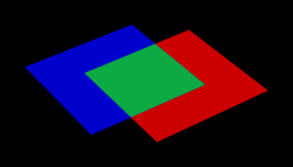

= NURBS Boolean Evaluation Development Guide
Nicholas Reed
:doctype: article
:toc:
:toclevels: 3

== Introduction

This document provides a technical overview of BRL-CAD's Non-Uniform Rational Basis Spline (NURBS) Boolean evaluation implementation. It includes details on user command line functionality, an overview of the algorithms and source code implementation, details on developer debugging facilities, and an overview of the debugging process (with a real example). This is intended to be a practical resource for software developers wanting improve BRL-CAD's NURBS Boolean evaluation implementation.

It is assumed that the reader has rudimentary familiarity with C/C++ software development and the BRL-CAD software package. This includes how to acquire, modify, and rebuild the BRL-CAD source code, and how to run and debug C/C++ applications. It is also assumed that the reader has a some understanding of concepts from 3D geometry such as surface normal vectors, parametric functions, boundary representation (B-Rep) geometry, and trimmed NURBS.

Section 2 of this document briefly describes NURBS Boolean evaluation in BRL-CAD from a user perspective.

Section 3 outlines the major algorithms being used and the files and functions in the BRL-CAD source code that implement them. It also explains important concepts helpful in understanding and modifying the source code.

Section 4 covers the current process for debugging evaluation issues. It describes available debugging tools, and provides step-by-step instructions for tracking down bugs based on debug information, including a complete example of debugging a real evaluation issue.

It should be noted that some of the information in this document may become outdated due to future changes to the BRL-CAD software suite. Any developer making significant changes to the implementation should update the copy of this document that is included with the BRL-CAD source code.

== NURBS Boolean Evaluation Using the brep Command

The *brep* command is available in BRL-CAD's MGED and Archer applications. If the command is run with a single argument naming a combination, the components of the combination are converted into NURBS objects which are combined into a single evaluated NURBS object according to the Boolean operations in the combination.

By default, the evaluated B-Rep-type object is written to the database with its original name plus the suffix `.brep` (e.g. running the *brep* command on `obj` produces `obj.brep`). If a specific name is desired for the output object, it can be provided as the second argument to the *brep* command.

There are a number of known limitations to the NURBS Boolean evaluator as currently implemented:

* May produce incorrect output due to unhandled intersection cases.
* Unoptimized performance resulting in potentially significant runtimes.
* Material properties of source objects are discarded.
* Some primitive conversions to NURBS are undefined (e.g., an infinite halfspace).
* Hollow objects are not built topologically continuous.

== Overview of the Implementation

.Evaluation of a Subtraction
image::../../devguides/images/evaluation_overview.png[]

=== Technical Approach

The technical approach used for evaluating Boolean operations on NURBS entities involves calculating geometric intersections, trimming surfaces accordingly, and stitching together a resulting object. Boundary representation NURBS objects are composed of faces, edges, and vertices; and these topologically describe how surfaces, curves, and points are joined together to represent geometry. The geometry is used to find intersections. The topology is used in the application of Boolean logic. This is oversimplified as there are also trimming curves, loops, orientations, and other details involved, but this is nonetheless a useful foundation for understanding the basic approach employed.

BRL-CAD heavily integrates and extends the OpenNURBS Toolkit by Robert McNeel & Associates, developers of the proprietary Rhinoceros freeform NURBS modeling software. BRL-CAD heavily uses OpenNURBS for trimmed NURBS geometry representation (both in-memory and on-disk) and implements functionality not included with OpenNURBS such as ray tracing and Boolean evaluation. footnote:[While their license is permissive, the OpenNURBS Toolkit is only intended for and McNeel only supports it being using for reading and writing 3DM files.] Additional functionality implemented for BRL-CAD is primarily contained within the boundary representation and ray trace libraries (LIBBREP and LIBRT). footnote:[Unless specified otherwise, file references are for LIBBREP source files. As published, LIBBREP implementation files reside in the `src/libbrep/` directory with public header files residing in the `include/` directory of a BRL-CAD source hierarchy.]

The overall NURBS Boolean evaluation algorithm is based on the paper _BOOLE: A System to Compute Boolean Combinations of Sculptured Solids._ (S. Krishnan et al., 1995). The main implementation file for the Boolean evaluation algorithm is `boolean.cpp`.

The NURBS surface-surface intersection algorithm is based on the "NURBS Intersection Curve Evaluation" section of the paper _Performing Efficient NURBS Modeling Operations on the GPU_ (A. Krishnamurthy et al., 2008). A detailed outline of the algorithm, as implemented, appears in the main implementation file for the NURBS Surface-Surface intersection algorithm, `intersect.cpp`.

=== The Boolean Evaluation Algorithm

.Evaluating a Boolean

.Summary
This is a high-level overview of the Boolean evaluation performed on two B-Rep objects.

.Prerequisites
Make sure you have two entities that are geometric, solid, and valid; that they are topologically connected, describe manifold surfaces, and enclose some non-infinite volume.

Make sure you have a valid Boolean operation (i.e., UNION, SUBTRACT, INTERSECT).

Make sure their bounding boxes overlap, otherwise evaluation is trivial.

.Evaluate Intersections
. Determine face intersections between the two input objects

For each face:

. Calculate surface intersection with all other surfaces to get intersection curves

For all surfaces whose bounding poxes intersect, calculate surface-surface intersections (SSI)

. Identify any coincident overlap surfaces

. Identify coincident overlap boundary curves

. If stitched boundary curves form a closed loop, record an overlap intersection event

. Identify any other intersection curves and points

. Split original surfaces into pieces

For each intersection curve and overlap intersection event:

. Divide original surface into separate surfaces according to the Boolean operation

. For each new surface, create new trimmed NURBS face

. Join trimmed NURBS faces based on intersections and the Boolean operation

. Combine resulting faces into a new evaluated B-Rep object

=== Descriptions of Major Functions

==== boolean.cpp

The `ON_Boolean()` function performs a single Boolean evaluation on two B-Rep objects. A single execution of the *brep* command in MGED or Archer may involve passing several successive pairs of B-Rep objects to this function.

----

	
int
ON_Boolean(
    ON_Brep *evaluated_brep,
    const ON_Brep *brep1,
    const ON_Brep *brep2,
    op_type operation);
	
	
----

In the nontrivial case where the bounding boxes of _brep1_ and _brep2_ intersect, `get_evaluated_faces()` is called to get the trimmed NURBS faces of the evaluated Boolean result. The faces are then combined into a single B-Rep object returned via the _evaluated_brep_ argument.

----

	
ON_ClassArray< ON_SimpleArray<Trimmed Face *> >
get_evaluated_faces(
    const ON_Brep *brep1,
    const ON_Brep *brep2,
    op_type operation);
	
	
----

The intersection curves between the faces of _brep1_ and _brep2_ are found by `get_face_intersection_curves()`. These curves are used to split the original surfaces into pieces, each becoming a new trimmed NURBS face. The `categorize_trimmed_faces()` function is used to identify which pieces, based on the Boolean operation, are part of the evaluated result. Each `TrimmedFace` whose `m_belong_to_final` member is marked `TrimmedFace::BELONG` is used by `ON_Boolean()` to create the final evaluated result.

----

	
ON_ClassArray< ON_SimpleArray<SSICurve> >
get_face_intersection_curves(
    ON_SimpleArray<Subsurface *> &surf_tree1,
    ON_SimpleArray<Subsurface *> &surf_tree2,
    const ON_Brep *brep1,
    const ON_Brep *brep2,
    op_type operation);
	
	
----

Each pair of _brep1_ and _brep2_ surfaces whose bounding boxes intersect are passed to the `ON_Intersect()` surface-surface intersection routine. The `get_subcurves_inside_faces()` routine is used to remove irrelevant parts of the surface-surface intersection curves based on the trimming curves of the associated faces.

==== intersect.cpp

----

	
int
ON_Intersect(const ON_Surface *surfA,
             const ON_Surface *surfB,
             ON_ClassArray<ON_SSX_EVENT> &x,
             double isect_tol,
             double overlap_tol,
             double fitting_tol,
             const ON_Interval *surfaceA_udomain,
             const ON_Interval *surfaceA_vdomain,
             const ON_Interval *surfaceB_udomain,
             const ON_Interval *surfaceB_vdomain,
             Subsurface *treeA,
             Subsurface *treeB);
	
	
----

The first stage of the surface-surface intersection algorithm attempts to identify overlap intersections (areas where the two surfaces are coincident). Our assumption is that the boundary curve of any overlap region must be formed from isocurves of the overlapping surfaces.

Subcurves of isocurves that intersect both surfaces, such that the surfaces are coincident on one side of the curve but not the other, potentially form part of overlap boundaries. These curves are identified using `find_overlap_boundary_curves()`. To avoid wasted computations, this function also returns intersection points and non-boundary intersection curves which were found during the search for boundary curves.

Then, the `split_overlaps_at_intersections()` function is run, and curve pieces that share endpoints are stitched together. The stitched boundary curves which close to form loops are recorded as overlap intersection events.

The second stage of the surface-surface intersection algorithm attempts to identify other intersection curves and points. The input surfaces _surfA_ and _surfB_ are subdivided into four subsurfaces, whose bounding boxes are tested in pairs to see which subsurfaces potentially intersect. This subdivision repeats to a fixed depth determined by the constant `MAX_SSI_DEPTH` (defined in `brep_defines.h`).

Subsurfaces that lie completely inside an overlap region identified in the first stage are discarded. Each remaining pair of subsurfaces with intersecting bounding boxes is tested for intersection. This is accomplished by approximating each subsurface with two triangles (i.e. a 'split' quad whose corners coincide with those of the actual subsurface patch, which has been split diagonally for a more accurate fit). The triangles are then intersected, and the average of all intersection points is used as the initial guess for a Newton iterative solver, implemented by `newton_ssi()`, which searches for a point close to the initial guess point which lies on both surfaces.

Solved points that reside inside an overlap region identified in the first stage are discarded. Of the remaining solved intersection points between _surfA_ and _surfB_, those which are near one another are stitched together into polyline curves. If a line or conic curve can be fit to the polyline curves in 2D, the fit curve replaces the original _surfA_ and/or _surfB_ polyline curve.

=== The OpenNURBS API

BRL-CAD leverages the OpenNURBS library primarily for its classes that represent general (i.e. NURBS) B-Rep surface, curve, and point geometry. The following sections describe the OpenNURBS library symbols most commonly used in the NURBS Boolean evaluation implementation, with relevant usage notes.

[WARNING]
====
When using an OpenNURBS utility that hasn't been used elsewhere in the implementation, always check the documentation _and the implementation_ to make sure it does what you expect.

Misleading methods have been misused in the past. For example, `bool ON_Line::InPlane(ON_Plane& plane)()` appears to test if a line lies in the given plane, but actually constructs a plane that contains the line.

Another example is `double ON_Line::MinimumDistanceTo(const ON_Line&)()`. While the function does indeed return the distance of the shortest path between one line and another, reading the implementation reveals an undocumented assumption that the `ON_Line` provided as an argument is not on the same infinite line as the instance the method is invoked on. That is, the `ON_Line` s can be parallel, but not coincident.

====

==== Arrays

OpenNURBS includes two general array classes, `ON_ClassArray` and `ON_SimpleArray`, which are similar to C++'s `std::vector`. Besides having slightly friendlier interfaces, they also feature some higher-level member functions like `Reverse()` and `Quicksort()`.

The primary difference between the two classes is that `ON_SimpleArray` doesn't bother constructing and destructing its items. This makes it more efficient than `ON_ClassArray`, but unsuitable for class objects (though pointers to objects are fine). `ON_ClassArray` requires items to have correctly implemented copy and assignment functions.

The NURBS Boolean evaluation implementation generally employs a combined array of known size to index elements from two input objects. For example, if _brepA_ has stem:[i] faces and _brepB_ has stem:[j] faces, a single array of stem:[i + j] elements is created.

[WARNING]
====
The OpenNURBS array classes do not check for out-of-bounds indexing. This isn't a problem in the simple case where items are added with `Append()` and elements stem:[[0,]`Count()`stem:[- 1]] are iterated over.

However, if the array will be a fixed size whose items are assigned in a non-sequential order, both the _capacity_ and _count_ should be set, or else the reported `Count()` will be incorrect, and copying arrays by assignment won't work.

----

	
	ON_ClassArray< ON_SimpleArray<SSICurve> > curves_array(face_count1 + face_count2);
	curves_array.SetCount(curves_array.Capacity());
	
	  
----

====

==== Memory

Curves and surfaces are nearly always allocated on the heap and referenced by pointers, both in the OpenNURBS library, and in the NURBS Boolean evaluation implementation.

Mostly these allocations are simply done with the `new` keyword as with any other class. However, a few classes, notably `ON_Brep` have a `New()` function that wraps the allocation, which is preferred over using `new` directly for technical reasons specified in the OpenNURBS `opennurbs_brep.h` header.

Pointers to objects, curves in particular, are generally "stolen" to avoid having to create a new copy of the object.

[WARNING]
====
Classes containing heap-allocated objects delete them in their destructors. Proper stealing of pointers requires the instance's members be set to NULL.

----

	      
ON_SimpleArray<ON_SSX_EVENT> x;
...
for (int i = 0; i < csx_events.Count(); ++i) {
    // copy event
    x.Append(csx_events[i]);

    // clear pointers from original so they aren't deleted by the
    // ON_SSX_EVENT destructor
    csx_events[i].m_curveA = NULL;
    csx_events[i].m_curveB = NULL;
    csx_events[i].m_curve3d = NULL;
}
	      
	    
----

====

==== Tolerance Tests

The OpenNURBS routines make extensive use of the symbol `ON_ZERO_TOLERANCE` in calculations to test if a result is to be considered equal to zero, or if two values are to be considered equal.

[NOTE]
====
The NURBS Boolean evaluation implementation generally uses the function `ON_NearZero(double x, double tolerance = ON_ZERO_TOLERANCE)()` to check if values are near zero, or to check if two values are identical (e.g `ON_NearZero(t - last_t)()`).

This function is also used to determine if objects are close enough to be considered intersecting: `ON_NearZero(pt.DistanceTo(other.pt), INTERSECTION_TOL)()`.

====

==== 2D and 3D Points

The `ON_2dPoint` and `ON_3dPoint` classes intuitively implement operators such as `+` and `*` to allow points to be easily summed and scaled.

The `operator` functions are notable because coordinates are not actually stored as arrays in these classes, but rather in the named members `x`, `y`, and `z`. So while accessing coordinates as `pt[0]`, `pt[1]` is possible, the more readable `pt.x`, `pt.y`, is more typically utilized.

The most frequently used member function is `DistanceTo(const ON_3dPoint &p)()`, used to check inter-point distances, either as part of an intersection test or to identify closeable gaps or duplicate points.

[NOTE]
====
`ON_2dPoint` objects can be, and are, safely passed to functions that take `ON_3dPoint` arguments. The `ON_3dPoint` arguments are constructed from the provided `ON_2dPoint` objects, with their `z` coordinates set to 0.

The NURBS Boolean evaluation implementation generally constructs 2D curves by populating an `ON_3dPointArray` with 2D points, rather than using an `ON_2dPointArray`, as the 3D version of the class (besides having additional useful member functions), can be used to initialize an `ON_PolylineCurve`.

====

==== Bounding Boxes

`ON_BoundingBox` is returned by the `BoundingBox()`, `GetTightBoundingBox()`, and `GetBBox()` functions, which are implemented by all geometry classes inheriting from `ON_Geometry`.

The most commonly used members of `ON_BoundingBox` are `Diagonal()` (usually in an expression such as `bbox.Diagonal().Length()` used as a scalar size estimate), and `IsPointIn()` and `MinimumDistanceTo()` (used in intersection tests).

==== Domain Intervals

`ON_Interval` is used to represent the domains of parametric curves and surfaces. The domain _starts_ at `m_t[0]` and _ends_ at `m_t[1]`. These members can be set directly or via `Set(double t0, double t1)()`.

[WARNING]
====
The start, end, and overall length of the domain are _arbitrary_, and `m_t[0]` need not be less than `m_t[1]`. If the numerically smaller or larger domain endpoint is needed, these should be accessed via the `Min()` and `Max()` member functions.

====

The `ParameterAt(double x)()` function translates a _normalized_ parameter (from a domain starting at 0.0 and ending at 1.0) into a _real_ parameter. Thus, the start of the domain is at `domain.ParameterAt(0.0)`, the midpoint is at `domain.ParameterAt(.5)`, etc.

==== Parametric Curves

The most frequently used geometry class is `ON_Curve`, a generic container for parametric curves. The curve is interrogated by using the `PointAt(double t)()` method to evaluate points at arbitrary values inside the curve's domain, which is specified by the `ON_Interval` returned by the `Domain()` method. The start and end points of the curve have dedicated access methods, `PointAtStart()` and `PointAtEnd()`.

[WARNING]
====
`PointAt()` takes a real parameter; parameters normalized to stem:[[0, 1]] must be converted. For example, the midpoint of the curve can be found as `curve->PointAt(curve->Domain().ParameterAt(.5))`. `PointAt()` _does not check_ if the _t_ value you give it is inside the curve's domain, so you have to get this right!

====

All the `PointAt()` methods return an `ON_3dPoint`, though in the common case where `ON_Curve` objects are representing 2D trim curves, the z coordinate will be 0.0.

It is sometimes necessary to reverse a curve's domain. This is done using the `Reverse()` method to facilitate stitching curves together. The function has a Boolean `int` return value that must be checked.

----

if (curveA->PointAtStart().DistanceTo(curveB->PointAtStart()) < dist_tol) {
  if (curveA->Reverse()) {
      curveA = link_curves(curveA, curveB);
  }
  /* curves that cannot be reversed are degenerate and discarded */
}

	  
----

[WARNING]
====
Comparing curve endpoints, or even just bounding boxes (retrieved via the `BoundingBox()` method), is often sufficient in the context of different intersection and stitching procedures. However, it's important to keep in mind that in the general case, the shape of the curve between its endpoints or within its bounding box could be anything. For example, two curves with identical start and end points could both be linear, creating a degenerate loop. A curve whose endpoints are equal within the OpenNURBS `ON_ZERO_TOLERANCE` (testable using the `IsClosed()` method), may be self-intersecting, or degenerate to a point.

====

A copy of a curve is easily made using the `Duplicate()` member function, which simply wraps a standard copy procedure:

----

ON_Curve* Duplicate()
{
  ON_Curve *p = new ON_Curve;
  if (p) *p = *this;
  return p;
}
	
----

This function is common to all OpenNURBS geometry classes, but curves are by far the most frequently duplicated objects. However, if curves are simply being retained from a working set of container objects, the curve pointers are generally "stolen" rather than copied, with curve members set to `NULL` so that the curves aren't destructed with the containers.

==== Lines

`ON_Line` is used to represent an infinite line, defined by two points, `from` and `to`.

`ON_Line` is not a subclass of `ON_Curve` and should not be confused with `ON_LineCurve` (which has an `ON_Line` member), though it does have some of the same methods as an `ON_Curve` class, including `PointAt(double t)()`. However, because the line has an infinite domain, it can be evaluated at any `t` value, though evaluating at 0.0 returns `from` and evaluating at 1.0 returns `to`, as if the line was a parametric curve with a domain between 0.0 and 1.0.

`ON_Line` has helpful line-specific methods such as `ClosestPointTo(const ON_3dPoint &point)()`. Again, because the line is treated as infinite, this function doesn't necessarily return a point in the segment between `from` and `to`.

==== Surfaces

An `ON_Surface` has a similar interface to an `ON_Curve`, but adapted to support the surface's two domains, _u_ and _v_ (sometimes called _s_ and _t_). These also correspond to as the 0 and 1 surface domains (as in the first example in following) or with an _x_ and _y_ parameterization (as shown in the second example).

.Projecting an arbitrary stem:[(u, v)] point into 3D.
[example]
====

----

ON_Interval udom = surface->Domain(0);
ON_Interval vdom = surface->Domain(1);
ON_3dPoint surf_midpt_3d = surface->PointAt(udom.ParameterAt(.5), vdom.ParameterAt(.5));

	  
----

====

.Projecting a trim-curve point into 3D.
[example]
====

----

ON_Interval tdom = trim_curve->Domain();
ON_3dPoint trim_midpt_uv = trim_curve->PointAt(tdom.ParameterAt(.5));
ON_3dPoint trim_midpt_3d = surface->PointAt(trim_midpt_uv.x, trim_midpt_uv.y);

	  
----

====

==== Boundary Representation Objects

`ON_Brep` is the top-level OpenNURBS class used to represent the two input objects and the evaluated result of the `ON_Boolean()` function. The geometry is encoded as a collection of faces, which for our purposes should be topologically connected to enclose solid volumes.

An object's faces are `ON_BrepFace` objects stored in the `ON_Brep` face array, `m_F[]`.

Each `ON_BrepFace` is defined as the subset of an `ON_Surface` lying inside the face's _outerloop_ (a.k.a. the _face boundary_) and outside all of its _innerloops_ (a.k.a. _trim loops_ or just _trims_).

The loops of an `ON_BrepFace` are listed in its loop array `m_li[]` as indexes into the associated `ON_Brep` object's `ON_BrepLoop` array, `m_L[]`. The first (and possibly only) loop listed in the face's loop index array is the outerloop, and all following loops are inner trim loops. The type of the loop is also recorded in the loop's `m_type` member.

----

brep->m_L[brep->m_F[0]->m_li[0]].m_type;      // ON_BrepLoop::outer
brep->m_L[brep->m_F[0]->m_li[1]].m_type;      // ON_BrepLoop::inner
...
brep->m_L[*brep->m_F[0]->m_li.Last()].m_type; // ON_BrepLoop::inner
	
----

==== Intersection Events

There are two OpenNURBS classes for representing intersections. `ON_X_EVENT` is used for curve-curve and curve-surface intersections. `ON_SSX_EVENT` is used for surface-surface intersections.

[NOTE]
====
An additional class, `ON_PX_EVENT` has been implemented as an extension to the OpenNURBS API to represent point-point, point-curve, and point-surface intersection events.

====

The intersection classes enumerate a number of intersection types. Over the course of an evaluation, the `m_type` of intersection events is repeatedly checked to determine how each event should be processed.

When two curves are coincident with one another over a portion of their domains, `m_type` will be `ON_X_EVENT::ccx_overlap`.

.Curve-Curve Overlap Intersection
image::../../devguides/images/ccx_overlap_event.png[]

When two surfaces are coincident over a portion of their domains, `m_type` will be `ON_SSX_EVENT::ssx_overlap`.

.Surface-Surface Overlap Intersection

There are two ways that two surfaces can intersect in a curve. If the normals of the surfaces are parallel over all points of the curve, the intersection `m_type` is `ON_SSX_EVENT::ssx_tangent`, and `ON_SSX_EVENT::ssx_transverse` otherwise.

.Surface-Surface Tangent Intersection
image::../../devguides/images/ssx_tangent_event.png[]

.Surface-Surface Transverse Intersection
image::../../devguides/images/ssx_transverse_event.png[]

Similarly, if two surfaces intersect at a point, the intersection `m_type` is `ON_SSX_EVENT::ssx_tangent_point` if the normals of the two surfaces are parallel at that point, and `ON_SSX_EVENT::ssx_transverse_point` otherwise.

The `m_type` of an intersection event determines how values in the `m_a[]`, `m_b[]`, `m_A[]`, and `m_B[]` array members of the event instance are to be interpreted (documented in the OpenNURBS `opennurbs_x.h` header).

[WARNING]
====
It's very easy to confuse the `m_a[]`, `m_b[]`, `m_A[]`, and `m_B[]` arrays, as well as `m_a[0]` vs. `m_a[1]`, etc. This is especially true when copying and pasting code.

====

For an `ON_X_EVENT` representing a curve-curve intersection whose `m_type` is `ON_X_EVENT::ccx_overlap`, (`m_a[0]`, `m_a[1]`) represents the portion of the first curve's domain that overlaps with the second curve, whereas in other cases `m_a[1]` is simply a duplicate of `m_a[0]`.

As a result, a pattern seen repeatedly in the NURBS Boolean evaluation implementation is a loop over intersection events that gathers intersection points for processing, including overlap endpoints if the event represents an overlap.

----

            
for (int i = 0; i < x_event.Count(); ++i) {
    x_points.Append(x_event[i].m_a[0]);
    if (x_event[i].m_type == ON_X_EVENT::ccx_overlap) {
        x_points.Append(x_event[i].m_a[1]);
    }
}
            
	
----

=== Code Conventions and Pitfalls

==== 2D vs 3D

Implicit in working with parametric geometry is that some operations are done in 2D while others are done in 3D and it's very important to know the dimension currently being worked in at all times.

As mentioned in the section above on 2D and 3D points, 3D classes are often used in the implementation to store 2D points, and thus are not a reliable indication that an operation is happening in 3D.

Being that operations in 2D tend to be a lot simpler, 2D is normally the dimension being worked in. However, because parametric curves and surfaces of different objects have different parameterizations, determining where two objects intersect can't be done by comparing 2D parameters; it must happen in 3D.

===== Naming Convention

Generally, when 2D and 3D operations are taking place near one another, you'll see a naming convention being used to disambiguate 2D and 3D data. 3D identifiers are unadorned, while 2D names will be suffixed with 1/2 or A/B.

Suppose for example we have three arrays of corresponding points that are samples along an intersection curve between two surfaces. The 3D array might simply be named `points`. The corresponding 2D points in the domains of the two surfaces involved are then very likely to be named `points1` and `points2` or `pointsA` and `pointsB`. Whether the 1/2 or A/B suffixes are used typically depends on whether the input surfaces have names like `surf1`/`surf2` or `surfA`/`surfB`. The latter is more likely to be used when processing intersection events, as members of the OpenNURBS intersection event classes are named `m_a` and `m_b`, etc.

===== Intersection Tolerances

The `ON_Intersect()` intersection routines (`intersect.cpp`) generally take an `isect_tol` argument, which is a 3D tolerance normally equal to the constant `ON_INTERSECTION_TOL`. 2D tolerances, following the convention described above, are generally named `isect_tolA` and `isect_tolB`.

2D tolerance values for curves and surfaces are derived from the 3D tolerance value using the `tolerance_2d_from_3d()` routines. The length of the diagonal of the 3D bounding box of the curve or surface is divided by the length of the 2D domain to get a rough estimate of what distance in the 2D domain corresponds to the 3D tolerance distance. In other words, the hope is that two points on a `curveA` or `surfA` that are `isect_tolA` units apart in 2D, will evaluate to two 3D points that are `isect_tol` units apart in 3D.

[WARNING]
====
The difference between `isect_tol` and `isect_tolA` and `isect_tolB` can be arbitrarily large, so it's import that the correct tolerance is used in all cases. However, it's sometimes tempting to use the wrong tolerance, for instance using the 2D `isect_tolA` in a 3D intersection test simply because the 3D points were evaluated from 2D points in the `surfA` domain.

====

===== Curve Traversal Directions

It's important to remember that because parameterizations are arbitrary, there is no correspondence whatsoever between a 2D curve in one surface's domain and another surface's domain, even when those 2D curves evaluate to the same 3D curve. In particular, you cannot assume that traversing different curves along their domain from `m_t[0]` to `m_t[1]` translates to a consistent traversal direction in 3D, or even that each 2D curve's `m_t[0]`/`m_t[1]` corresponds to the same 3D starting point on a closed curve.

.Different Traversals of the Same Curve
image::../../devguides/images/curve_traversal_directions.png[]

==== Accumulated Error

By the nature of the math involved in representing parametric geometry (e.g. converting between 2D and 3D, and solving intersections between objects with different parameterizations) values that are expected to be identical are generally only equal within a certain tolerance, or error.

Over the course of the evaluation, the same data is interrogated and processed a number of times. If ignored, the error introduced in one stage of the evaluation can grow over subsequent stages, causing an incorrect determination that leaves a curve unclosed, a surface unsplit, and ultimately an incorrect evaluated result.

As a consequence, it's generally a good idea to remove fuzziness when you find it, and avoid algorithms that introduce more error.

===== Clamping

Start and end points of closed curves are rarely identical. So if a curve is found to be closed within tolerance, it's a good idea to actually set the end point equal to the start point. Similarly, if an interval of a domain is calculated whose endpoints are within tolerance of the domain endpoints, the entire domain should be used.

[NOTE]
====
Producing subcurves of existing curves is a common operation in the NURBS Boolean evaluation implementation. This is a prime example of an operation that can introduce fuzziness into the evaluation. For example, we may be splitting a curve to remove a portion of it, and end up with two new curves with endpoints that used to align when part of the original curve, but no longer do.

The `Split()` method of `ON_Curve` can be used to produce subcurves, but in the implementation it's much preferred to use the `sub_curve()` function defined in `intersect.cpp` which wraps `Split()` and correctly handles clamping of curve parameters to domain endpoints.

====

===== Iterated Solutions

The iterative method used to solve points on parametric curves and surfaces is expected to produce better answers given better inputs and more iterations. However, our algorithms can't always produce sufficient inputs, and the value the solver converges on isn't always the correct one.

This fuzziness produced in the solver's results can be mitigated in the context of finding intersection curves for example, because we solve many points and fit a curve between them. So, one unsolved point on the curve isn't going to cause an evaluation failure.

[WARNING]
====
It's tempting to test curve characteristics or make inside/outside determinations, etc. by using the `ON_Intersect()` functions. However, there's a persistent risk that the error in the iteratively solved results will cause incorrect determinations that cascade into larger problems over the course of the evaluation. For this reason, the `ON_Intersect()` functions should be avoided whenever possible.

====

== Debugging NURBS Boolean Evaluations

The current ongoing development activity for NURBS Boolean evaluation is debugging specific evaluation cases in order to find bugs and unhandled geometry cases in the implementation to support the evaluation of more geometry.

=== Debug Plotting

There are two Archer commands that can be used to plot individual components of brep NURBS objects to facilitate debugging.

These commands work by creating temporary wireframe objects that are drawn in the view window. While drawn, these objects appear in the in-memory database, so the *ls* command will show these objects (with names like `_BC_S_<obj>_646464>` or `bool1_brep1_surface03838ff`), but they are not saved with the database, and are deleted when erased from the display.

[NOTE]
====
Debug wireframe objects are not drawn the same way as geometry, and do not trigger an automatic resize and refresh of the view. This means that after running a *plot* command, you may have to trigger a refresh manually (e.g. by running the *autoview* command or interactively rotating/resizing the view.

Also be aware that debug wireframes are drawn in a variety of hard-coded colors to help distinguish different subcomponents. These colors were designed to be best visible using a view whose background color is black (this should be the default, but can be easily changed in Archer via the view window's right-click menu).

====

==== The brep Command

The Archer *brep* command (also implemented in MGED) can be used to get structural information about B-Rep objects and visualize different subcomponents.

Most importantly, *brep <obj> info* will report summary information, including the number of NURBS surfaces and faces and *brep <obj> plot S <index>* can be used to plot individual surfaces in 3D.

This is the primary way you can conceptually link a surface or face index to the 3D geometry it represents. So if you notice an error in an object while viewing it in the editor, you can use the *brep* command to determine the index of the surface with the error, and then inspect the in-memory object in a debugger using that index into the final surface array, tracing that surface object to where it was created, etc.

[NOTE]
====
For evaluations involving more than two objects, the final brep NURBS object is made by converting two leaf objects into breps, performing a Boolean evaluation on them, converting the next relevant object to brep and combining it with the first intermediate evaluation to make a second intermediate evaluation, and so on up the tree.

In order to inspect the surfaces and indices for a particular stage of the overall evaluation using the *brep* command, it's necessary to manually create the intermediate combination (a subtree of the one being evaluated), and use the *brep* command to produce the intermediate NURBS result.

====

==== The dplot Command

The *dplot* command is used to visualize the results of different stages of the NURBS Boolean evaluation algorithm. This makes it easier to isolate the source of a problem in an evaluation.

Unlike the *brep* command, the *dplot* command is purely a development tool. Its implementation does not honor library boundaries and does not conform to the typical conventions for editor commands, and for this reason is only available as an Archer command in the NURBS Boolean evaluation development branch (https://sourceforge.net/p/brlcad/code/HEAD/tree/brlcad/branches/brep-debug/).

In the development branch, the NURBS Boolean evaluation source code contains additional calls to `DebugPlot` functions (implemented in `debug_plot.cpp`) that create wireframe visualizations of data produced during the evaluations.

For development convenience, these wireframes are not saved as database objects, but rather are written as files in the current directory, with names of the form `bool1_*.plot3`. An additional `bool1.dplot` is written which describes the `.plot3` files that were written in a format understood by the *dplot* command.

One set of files is written for each evaluation. Between evaluations, a static counter increments the numeric suffix that's used in the output filenames. So for a combination consisting of three objects, the `bool1*` files will hold results from the intermediate boolean evaluation between the first two objects in the combination, and the `bool2*` files will hold results from the final evaluation between the intermediate evaluated object and the remaining leaf of the original comb.

The `DebugPlot` functions always use the same file names and do not check if written files already exist. It is assumed that you will run an evaluation, inspect the generated files using the *dplot* command, and then manually remove (or just move) the generated `.dplot` and `.plot3` files before performing another evaluation with the *brep* command.

===== The ssx Subcommands

* **dplot bool1.dplot ssx** lets you interactively step through the pairs of surfaces whose axis-aligned bounding boxes were found to intersect. The wireframes of the B-Rep objects being intersected are drawn with the current surface pair highlighted. The `ssx_index` assigned to the pair, which can be used as an argument to other dplot commands, is displayed in the command window.
* **dplot bool1.dplot <ssx_index>** lets you interactively step through the specific surface-surface intersections found between the pair of surfaces identified by an `ssx_index`, excluding isocurve-surface intersections (shown by *dplot bool1.dplot isocsx*).
+
To make it easier to check that drawn intersection curves are of the correct type and are open or closed curves as appropriate, intersections are color-coded by type (e.g. transverse intersections are drawn in yellow) and the ends of lines are decorated with arrows to indicate open ends or perpendicular segments to indicate coincident endpoints.

+
.Curve Endpoint Decoration
image::../../devguides/images/compare_endpoint_style.png[]

The ssx pairs are recorded in the `find_overlap_boundary_curves()` function in `intersect.cpp`.

===== The isocsx Subcommands

* **dplot bool1.dplot isocsx <ssx_index>** lets you step through the isocurve-surface intersections from the pair of intersecting surfaces identified by the given `ssx_index`. Wireframe plots of the two surfaces are drawn, with one surface and an intersecting isocurve of the second surface highlighted. Each combination of isocurve and surface is assigned an `isocsx_index` (shown in the command window) that can be used as an argument in the second form of the *isocsx* subcommand.
* **dplot bool1.dplot isocsx <ssx_index> <isocsx_index>** shows the actual intersection curve found between the isocurve and surface pair identified by the given `ssx_index` and `isocsx_index`.
+
The plotted intersection curves are color-coded for easy type-checking, e.g. overlap intersections are drawn in green.

The isocsx curves are written in the `find_overlap_boundary_curves()` function in `intersect.cpp`.

===== Face-Evaluation Subcommands

* **dplot bool1.dplot fcurves <ssx_index>** lets you step through the surface-surface intersection curves identified by the given `ssx_index` after they've been clipped by face trimming curves.
+
The clipped 2D intersection curves for the first surface are drawn projected to 3D, followed by the matching curves for the second surface.

* **dplot bool1.dplot lcurves** steps through the final 3D intersection curves used to split faces, after contiguous face-clipped pieces have been linked together.
+
After each curve is drawn independently, all curves are drawn at the same time.

+
This subcommand doesn't draw any contextual geometry; only the linked curves. Manually drawing a transparent shaded view of the original geometry usually works well for context.

+
.Linked Curves in Context
image::../../devguides/images/lcurves_with_shaded_context.png[]

* **dplot bool1.dplot faces** lets you step through the new set of faces formed by splitting the original faces with the final linked intersection curves. Faces that are considered part of the final result are drawn highlighted, while faces that are discarded are drawn dim.
+
After each face is drawn independently, all faces are drawn at the same time.

+
This subcommand doesn't draw any contextual geometry; only the face curves. Manually drawing a transparent shaded view of the original geometry usually works well for context.

The clipped face curves are recorded in `get_face_intersection_curves()` in `boolean.cpp`.

The linked curves and the categorized split faces are recorded in `get_evaluated_faces()` in `boolean.cpp`.

==== Plotting Arbitrary Evaluation Curves

It's possible to write out custom curves from any part of the evaluation (i.e. those not covered by *dplot*) and view them in MGED/Archer.

You can pass a 3D `ON_Curve` to the `DebugPlot::Plot3DCurve()` function or a 2D `ON_Curve` and an associated `ON_Surface` to the `DebugPlot::Plot3DCurve()` function.

Both of these functions take an arbitrary filename for a plot3 file the function will write, as well as a color for the curve. The `DebugPlot::Plot3DCurve()` has an optional `vlist` parameter which you should omit (see the full definitions in `debug_plot.cpp`).

.Writing a 2D Curve as a plot3 File
[example]
====

----

            
// somewhere in boolean.cpp
if (face1_curves.Count() > 0 && face1_curves[0] != NULL) {
    static int calls = 0;
    unsigned char mycolor[] = {0, 0, 62};
    std::ostringstream plotname;

    // generate a unique filename
    plotname << "mycurve" << ++calls << ".plot3";

    // plot using method of global DebugPlot instance 'dplot'
    dplot->Plot3DCurveFrom2D(surf1, face1_curves[0],
        plotname.str().c_str(), mycolor);
}
            
	  
----

====

After running an evaluation that produces a custom plot3 file, you can draw it using the *overlay* editor command.

.Drawing a plot3 File
[example]
====

....

Archer> overlay mycurve1.plot3 1
          
....

====

=== Debugging with the dplot Command

==== Tracing Output to the Code That Created It

After you notice a problem in the output shown by the *dplot* command, you need to locate the source code that created the erroneous geometry so you can start debugging. The following sections provide example procedures you can perform in Archer and a debugger to start investigating some common issues.

[discrete]
=== If the ssx subcommand shows that a surface-surface intersection is missing...

. Use the *info* and *plot* subcommands of the *brep* command to find the indexes (`<i>` and `<j>`) of the two faces involved in the missing intersection.
+
For a multi-part evaluation, you'll need to manually create the appropriate intermediate evaluation, corresponding to the `bool<n>.dplot` showing the error, to run the *brep* command on.

. Set a breakpoint at the `ON_Intersect()` call in `get_face_intersection_curves()` with the condition `i == <i> && j == <j>`.
+
For a multi-part evaluation, you'll need to first skip to the correct invocation of `ON_Boolean()`, either manually, or by conditioning a breakpoint on the value of the static `calls` variable defined at the top of that function.

. Start stepping through the `ON_Intersect()` call.

[discrete]
=== If the *isocsx* subcommand shows that an isocurve-surface intersection is missing...

. Note the index `<n>` of the surface-surface intersection used as the argument to the *isocsx* subcommand.
. Use the *info* and *plot* subcommands of the *brep* command to find the indexes (`<i>` and `<j>`) of the two faces involved in the missing intersection.
+
For a multi-part evaluation, you'll need to manually create the appropriate intermediate evaluation, corresponding to the `bool<n>.dplot` showing the error, to run the *brep* command on.

. Set a breakpoint at the `ON_Intersect()` call in `get_face_intersection_curves()` with the condition `dplot->SurfacePairs() == <n - 1> && i == <i> && j == <j>`.
+
For a multi-part evaluation, you'll need to first skip to the correct invocation of `ON_Boolean()`, either manually, or by conditioning a breakpoint on the value of the static `calls` variable defined at the top of that function.

. When the break is reached, add a breakpoint at `find_overlap_boundary_curves()` and advance to that function.
. Step through the intersections, printing out the isocurve endpoints and visualize them in the context of the geometry in Archer (e.g. by centering the view at those points, or creating spheres centered on them, etc.) to find the isocurves of interest:

....

(gdb) print surf1_isocurve->PointAtStart()
(gdb) print surf1_isocurve->PointAtEnd()
              
....

. Investigate how the isocurves are processed.

[discrete]
=== If the *isocsx* subcommand shows that isocurve intersections are incorrect...

. Note the index `<n>` of the surface-surface intersection used as the argument to the *isocsx* subcommand.
. Set a break after the call to `find_overlap_boundary_curves()` in `intersect.cpp` with the condition `dplot->SurfacePairs() == <n>`.
+
For a multi-part evaluation, you'll need to first skip to the correct invocation of `ON_Boolean()`, either manually, or by conditioning a breakpoint on the value of the static `calls` variable defined at the top of that function.

. Inspect the `overlaps` array.

[discrete]
=== If the *ssx* subcommand shows an incorrect intersection curve...

. Note the index `<n>` of the surface-surface intersection used as the argument to the *ssx* subcommand, and the index `<k>` assigned to the incorrect intersection event.
. Set a breakpoint at the `ON_Intersect()` call in `get_face_intersection_curves()` with the condition `dplot->SurfacePairs() == <n - 1>`.
+
For a multi-part evaluation, you'll need to first skip to the correct invocation of `ON_Boolean()`, either manually, or by conditioning a breakpoint on the value of the static `calls` variable defined at the top of that function.

. Step into `ON_Intersect()` and wait for `x.Count() == <k - 1>`.
. Investigate the creation of the next intersection event.

[discrete]
=== If the ssx subcommand shows the correct intersections for a given surface pair, but the fcurves subcommand shows those curves are not being correctly clipped by faces...

. Note the index `<n>` of the surface-surface intersection used as the argument to the *ssx* and *fcurves* subcommands, and the index `<k>` assigned by *fcurves* to the incorrect clipped curves.
. Set a breakpoint at the `get_subcurves_inside_faces()` call inside `get_face_intersection_curves()` with the condition `dplot->SurfacePairs() == <n + 1> && k == <k>`.
+
For a multi-part evaluation, you'll need to first skip to the correct invocation of `ON_Boolean()`, either manually, or by conditioning a breakpoint on the value of the static `calls` variable defined at the top of that function.

. Start stepping through `get_face_intersection_curves()` to investigate how the event intersection curves are being clipped.

[discrete]
=== If the faces subcommand shows that an input face was not split correctly, but the lcurves subcommand shows the relevant intersection was accurate...

. Note the index `<n>` assigned by *lcurves* to the relevant linked curves.
. Set a breakpoint at the `split_trimmed_face()` call inside `get_evaluated_faces()` with the condition `dplot->LinkedCurves() >= <n + 1>`.
+
For a multi-part evaluation, you'll need to first skip to the correct invocation of `ON_Boolean()`, either manually, or by conditioning a breakpoint on the value of the static `calls` variable defined at the top of that function.

. Inside `split_trimmed_face()`, check the input face loops and ssx curves:
+

....

(gdb) print orig_face->m_outerloop.m_a[i]->PointAtStart()
(gdb) print orig_face->m_outerloop.m_a[i]->PointAtEnd()
(gdb) print orig_face->m_innerloop.m_a[i]->PointAtStart()              
(gdb) print orig_face->m_innerloop.m_a[i]->PointAtEnd()              
(gdb) print ssx_curves.m_a[i].m_ssi_curves.m_a[i].m_curve->PointAtStart()
(gdb) print ssx_curves.m_a[i].m_ssi_curves.m_a[i].m_curve->PointAtEnd()
            
....

==== A Historical Debugging Example

What follows is a step-by-step debugging of a real issue affecting the `X` combination from the BRL-CAD sample database `axis.g`.

This issue was fixed in revision 65179 in the NURBS Boolean evaluation development branch of the source repository (https://sourceforge.net/p/brlcad/code/HEAD/tree/brlcad/branches/brep-debug/).

If you want to follow along, you can reinstate the error in a checkout of the development branch:

....

$ svn merge -r 65179:65178 ^/brlcad/branches/brep-debug
          
....

. Open `axis.g` in Archer and convert the original combination to `brep`.

....

Archer> opendb axis.g
Archer> brep X
X.brep is made.
              
....

+
The file `bool1.dplot` is created in the current directory, as well as a few hundred `.plot3` files.

. The object `X` is the union of two intersecting arb8 boxes. The arb8s are perpendicularly intersecting plates that create a 3D shape that looks like a 2D letter "X" in the X-Y plane that has been extruded along the Z axis.
+
."X" from axis.g
image::../../devguides/images/axis_X.png[]

+
The *ssx* subcommand of *dplot* is used to check that all expected surface-surface intersections were attempted between the B-Rep NURBS versions of the two arb8s, hereafter referred to as _brep1_ and _brep2_.

+

....

Archer> dplot bool1.dplot ssx
Press [Enter] to show surface-surface intersection 0
...
Press [Enter] to show surface-surface intersection 13
              
....

+
All 14 expected intersection events are reported. Each of the two larger-area faces of _brep1_ transversely intersects the two similar faces of _brep2_ (`ssx_index` 0, 1, 4, 5). Two edges of each of these faces lie in the same plane (the X-Y plane and another plane parallel to it) as two of the four smaller-area faces of the other B-Rep (`ssx_index` 2, 3, 6, 7, 8, 9, 11, 12). These two pairs of smaller area faces also intersect each other in square overlap intersections (`ssx_index` 10, 13).

. The *ssx <ssx_index>* subcommand of *dplot* is used to check the individual intersection events.
+

....

Archer> dplot bool1.dplot ssx 0
...              
Archer> dplot bool1.dplot ssx 13
            
....

+
The surface-surface intersection with `ssx_index` 10 appears incorrect (compare to the other overlap intersection, `ssx_index` 13). It's been correctly identified as an overlap intersection, but it doesn't contain the full, square area of the overlap.

+
.Comparison of Surface-Surface Intersection Event 10 Versus 13
image::../../devguides/images/ssx_10_vs_13.png[]

. The overlap intersection should have been created by stitching together the four isocurve-surface intersections that make each edge of the square overlap.
+
The *isocsx <ssx_index>* subcommand of the *dplot* command is used to check that all isocurve-surface intersections were attempted.

+

....

Archer> dplot bool1.dplot ssx 10
            
....

+
All four expected isocurve-surface intersections are reported.

. The *isocsx <ssx_index> <isocsx_index>* subcommand of the *dplot* command is used to check each isocurve-surface intersection curve.
+

....

Archer> dplot bool1.dplot isocsx 10 0
Archer> dplot bool1.dplot isocsx 10 1
Archer> dplot bool1.dplot isocsx 10 2
Archer> dplot bool1.dplot isocsx 10 3
            
....

+
Each of the four overlap curves appears correct.

+
At this point, the problem doesn't seem to be with the intersection curves, but with how they were processed.

. The *fcurves* subcommand of the *dplot* command is used to check the overlap intersection curve that resulted from stitching together the four (correct) isocurve-surface intersection curves. The command shows the 3D projection of the 2D curve recorded in the _brep1_ and _brep2_ domains, after they were clipped to fit inside the containing face (though clipping was unnecessary in this case, as the outer loops of the faces coincide with the boundaries of the surfaces).
+

....

Archer> dplot bool1.dplot fcurves 10
            
....

+
The clipped curves are shown to be incorrect. This isolates the problem to a point between the time the isocurve-surface intersections were found and the time the clipped curves were created.

. The isocsx plots are written by the `DebugPlot::IsoCSX()` method inside the `find_overlap_boundary_curves()` routine in `intersect.cpp`. The `find_overlap_boundary_curves()` routine is called from the `ON_Intersect()` surface-surface intersection function, also defined in `intersect.cpp`. The next call after `find_overlap_boundary_curves()` returns is `split_overlaps_at_intersections()`.
+
To quickly check if the splitting function introduced a problem in the overlap curves, we insert code to write out the overlap curves as `.plot3` files just after the `split_overlaps_at_intersections()` call.

+
Since the `ssx_index` values reported by *dplot* are numbered from 0, the intersection we want to investigate, whose `ssx_index` is 10, will be the 11th intersection recorded during the evaluation.

+
`dplot->SurfacePairs()` reports the number of surface-surface intersections that have been recorded, so we write our curves on the condition that `dplot->SurfacePairs() == 10`. Then we'll only get the curves from the 11th surface-surface intersection.

+

----

 // intersect.cpp, inside
 // ON_Intersect(const ON_Surface *surfA, const ON_Surface *surfB, ...)

 split_overlaps_at_intersections(overlaps, surfA, surfB, treeA, treeB,
                                 isect_tol, isect_tolA, isect_tolB);
    
+if (dplot->SurfacePairs() == 10) {
+    for (int i = 0; i < overlaps.Count(); ++i) {
+        if (!overlaps[i]) {
+            continue;
+        }
+        unsigned char overlap_color[] = {0, 255, 0};
+        std::ostringstream plotname;
+
+        plotname << "split_overlap" << i << ".plot3";
+        dplot->Plot3DCurve(overlaps[i]->m_curve3d, plotname.str().c_str(),
+                overlap_color);
+    }
+}
+
 // add csx_events
 for (int i = 0; i &lt; csx_events.Count(); ++i) {
     x.Append(csx_events[i]);

            
----

. After rebuilding the code, the evaluation is run again in Archer to produce the custom plot files `split_overlap4.plot3`, `split_overlap5.plot3`, `split_overlap6.plot3`, and `split_overlap7.plot3`.
+
The *overlay* command is used to draw the contents of the `.plot3` files.

+

....

Archer> brep X
Archer> overlay split_overlap4.plot3 1 ol4
Archer> overlay split_overlap5.plot3 1 ol5
Archer> overlay split_overlap6.plot3 1 ol6
Archer> overlay split_overlap7.plot3 1 ol7
            
....

+
When the four curves are drawn, we see they are still correct after splitting, and enclose the square overlap region.

. The next step in processing the overlap curves is linking contiguous curve segments together. We'll once again modify the source code, this time to write out the intermediate linked overlap curves.
+
Curve endpoints are tested to see if they coincide, and contiguous curves are linked with the `link_curves()` routine, which returns a linked curve that replaces the original curves in the `overlaps[]` array. We'll write out each such curve returned by `link_curves()`.

+

----

 // intersect.cpp, inside
 // ON_Intersect(const ON_Surface *surfA, const ON_Surface *surfB, ...)
 // after the calls to link_curves
 
         overlaps[i]->m_curveB = link_curves(overlaps[i]->m_curveB, overlaps[j]->m_curveB);
     }
 }
+if (dplot->SurfacePairs() == 10) {
+    unsigned char linked_curve_color[] = {0, 0, 255};
+    std::ostringstream plotname;
+
+    plotname << "linked_" << i << "_" << j << ".plot3";
+    dplot->Plot3DCurve(overlaps[i]->m_curve3d, plotname.str().c_str(),
+                       linked_curve_color);
+}
 if (!is_valid_overlap(overlaps[j])) {
     delete overlaps[j];
     overlaps[j] = NULL;

            
----

. The code is re-compiled, `X.brep` is removed from the database, and the dplot-related files are once again cleared from the working directory before re-running the evaluation.
+
We draw our four new linked curve `.plot3` files.

+

....

Archer> overlay linked_4_5.plot3 1
Archer> overlay linked_4_6.plot3 1
Archer> overlay linked_4_7.plot3 1
Archer> overlay linked_5_4.plot3 1
            
....

+
The intermediate curve represented by `linked_4_7.plot3` (and the subsequent `linked_5_4.plot3`) is clearly incorrect, as it cuts diagonally through the square overlap region.

+
.Overlay Visualization of Intermediate Linked Curves
image::../../devguides/images/intermediate_linked_curves.png[]

. We'll perform the evaluation again via a debugger. `X.brep` is removed from the database, and the `*.dplot` and `*.plot3` files are removed from the working directory.
+
A breakpoint is set just before the calls to `link_curves()` in the `ON_Intersect()` surface-surface intersection function (line 3885 in `intersect.cpp` at the time of writing), with the condition that `dplot->SurfacePairs() == 10`, and that the overlap indices `i` and `j` match the linked curve of interest.

+

....

$ gdb mged
(gdb) set args axis.g brep X
(gdb) start
(gdb) break intersect.cpp:3885 if dplot->SurfacePairs() == 10 && i == 4 && j == 7
(gdb) continue

            
....

+
Stepping from the breakpoint (e.g. with gdb's *next* command) we see that the macro test `OVERLAPS_LINKED(Start, End)` evaluates as true, indicating that the start of the `overlaps[i]` curves coincide with the end of the `overlaps[j]` curves.

+
Looking at the implementation of `link_curves()` in `intersect.cpp`, we can see that the second curve argument is joined to the first curve argument using the OpenNURBS `ON_NurbsCurve::Append()` member function. So, the start point of the second curve is joined to the end point of the first curve.

+

----

HIDDEN ON_Curve *   
link_curves(ON_Curve *&c1, ON_Curve *&c2)
{
    extend_curve_end_to_pt(c1, c2->PointAtEnd(), ON_ZERO_TOLERANCE);

    ON_NurbsCurve *nc1 = c1->NurbsCurve();
    ON_NurbsCurve *nc2 = c2->NurbsCurve();
    if (nc1 && nc2) {
        nc1->Append(*nc2);
        delete c1;
        delete c2;
        c1 = NULL;
        c2 = NULL;
        delete nc2;
        return nc1;
    } else if (nc1) {
        delete nc1;
    } else if (nc2) {
        delete nc2;
    }
    return NULL;
}   

            
----

+
`link_curves()` is here being called with `overlaps[j]->m_curve3d` as its first argument and `overlaps[i]->m_curve3d` as its second argument. This matches our intention to link the end of the `overlaps[j]` curves to the start of the `overlaps[i]` curves.

+
However, going back to the `link_curves()` implementation, we also see a call to `extend_curve_end_to_point()` which may modify the first curve argument.

+
This intent of this call is to ensure the end point of the first curve meets the start point of the second curve as tightly as possible (tighter than the `isect_tol` value that was used to determine the points were coincident) before the curves are joined together.

+
However, we see the point argument passed to `extend_curve_end_to_point()` is `c2->PointAtEnd()`, when it should be `c2->PointAtStart()`.

. This error is corrected and the code is rebuilt. The evaluation is re-run, and we use the *dplot* command to verify that the overlap intersection associated with `ssx_index` 10 is now correct.
+

----

              
HIDDEN ON_Curve *   
link_curves(ON_Curve *&c1, ON_Curve *&c2)
{
-    extend_curve_end_to_pt(c1, c2->PointAtEnd(), ON_ZERO_TOLERANCE);
+    extend_curve_end_to_pt(c1, c2->PointAtStart(), ON_ZERO_TOLERANCE);

    ON_NurbsCurve *nc1 = c1->NurbsCurve();
    ON_NurbsCurve *nc2 = c2->NurbsCurve();
              
            
----
