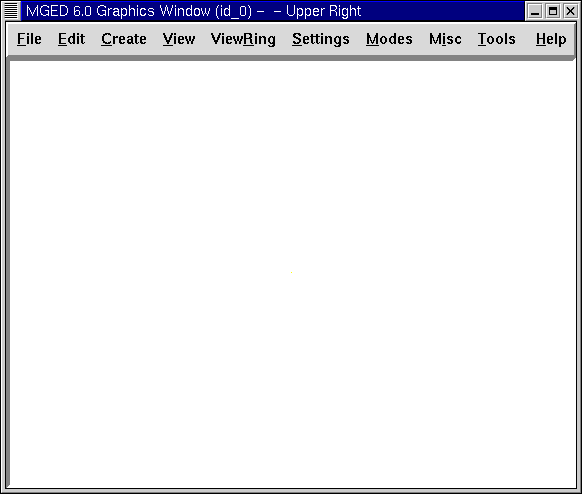

= Crear Figuras Primitivas with MGED
Lee A Butler; Eric W Edwards; Betty J Schueler; Robert G Parker; John R Anderson
:doctype: article
:toc:
:toclevels: 3

Este tutorial le ayudará a:

* Arrancar con el programa _MGED_.
* Ingresar los comandos en una terminal de _MGED_.
* Usar la interfaz gráfica de usuarios de _MGED_.
* Abrir o crear una nueva base de datos al poner en marcha _MGED_.
* Usar la interfaz gráfica para crear una nueva base de datos.
* Elegir un título para la base de datos.
* Seleccionar una unidad de medida para su diseño.
* Seleccionar una figura primitiva.
* Crear una forma primitiva utilizando el comando "make".
* Usar el comando Z para limpiar la ventana gráfica.
* Dibujar una figura predeterminada usando el comando "draw".
* Usar el comando "erase" para borrar un objeto de la ventana gráfica.
* Crear una esfera usando el menú gráfico.
* Usar el comando "l" para listar los parámetros o atributos de la figura.
* Usar el comando "ls" para listar el contenido de la base de datos.
* Eliminar una figura u objeto desde la base de datos usando el comando "kill" + comando.
* Editar un comando.
* Presionar "q" o usar el comando "exit" para salir del programa.

[[launching_mged]]
== Utilizar el programa MGED

Para abrir el programa _MGED_, tipee "mged" en una terminal (tty) y luego presione [ENTER]. Esto trae dos ventanas principales: la ventana de comandos de _MGED_ y la ventana gráfica de _MGED_. Ambas ventanas estarán inicialmente en blanco, esperando a que ingrese algo. Para abandonar el programa en cualquier momento, en la línea de comandos tipee la letra "q" o la palabra "quit" y presione luego [ENTER].

[[entering_commands]]
== Ingresar comandos en una ventana de comandos.

Puede tipear cualquier comando en la terminal de mged. Muchos usuarios experimentados de UNIX prefieren este método porque les permite crear rápidamente un modelo (a lo que preferimos llamar diseño) sin tener que buscar y cliquear sobre un montón de opciones. La lista completa de comandos de edición y lo que éstos hacen, se encuentran en al Apéndice A.

[CAUTION]
====
Chequee todo lo tipeado antes de presionar [ENTER]. Si advierte que ha cometido un error, simplemente presione el BACKSPACE hasta que haya borrado lo necesario y tipee nuevamente la información. Luego irá obteniendo mayor experiencia usando el editor de texto _vi_ y el comando de emulación de _emacs_.

====

[[using_gui]]
== Usar el entorno gráfico.

Los usuarios más acostumbrados a Microsoft Windows tal vez prefieran usar el entorno gráfico por medio de menús ubicados arriba de la ventana gráfica (que son las mismas en todas las ventanas). Los menús están divididos en grupos lógicos para ayudarle a navegarlos a través del programa _MGED_.

Antes de crear un modelo, necesita abrir una base de datos, así sea por comandos o iniciando el entorno gráfico de _MGED_, luego de iniciar el _MGED_.

[[open_new_database]]
== Abrir o crear una nueva base de datos con MGED

Usted puede abrir una base de datos o crear una nueva al mismo tiempo que abre _MGED_. En la línea de comando, tipee "mged" seguido por una nueva o por una ya existente base de datos sin olvidar ponerle la extensión .g, por ejemplo: *mged sphere.g [ENTER]*.

image::../../lessons/es/images/mged01_terminal.png[]

Si estuviera creando una nueva base de datos, un pequeño cuadro de diálogo le preguntará si desea crear la nueva base de datos llamada sphere.g. Seleccione Si, y entonces _MGED_ abrirá la nueva base de datos. En el caso de que sphere.g existiera, se abrirá la existente.

[[create_new_database]]
== Usar el entorno gráfico para crear una nueva base de datos

Al iniciar _MGED_ usted puede crear o abrir una base de datos desde el menú superior Archivo (File), seleccionando luego la opción Nuevo (New) o Abrir (Open). Ambas opciones abren el mismo cuadro de diálogo preguntando por el nombre de la base de datos a crear o el de una ya existente, según corresponda. Para finalizar la selección, presione OK.

Para esta prueba, cree una nueva base de datos llamada sphere.g. Para hacer eso tipee sphere.g al final de la ruta del nombre, tal como muestra la siguiente imagen. Presione OK para aceptar la selección.

image::../../lessons/es/images/mged01_commandwindow.png[]

Una de las ventajas de usar el entorno gráfico, sobre todo si usted no está familiarizado con el administrador de archivos de UNIX, es que le mostrará su nombre de ruta de acceso actual, indicándole exactamente dónde va a ser localizada su base de datos. Será especialmente útil si tiene muchos directorios y archivos para manejar.

[[assign_title]]
== Asignarle un título a una base de datos

Puede ponerle un título a su nueva base de datos para proporcionarle a usted y a otros usuarios una idea del contenido de la base de datos. En la ventana de la línea de comando, tipee "title" seguido de un espacio y un nombre que identifique la base de datos que va a crear. Cuando haya terminado, pulse la tecla [ENTER]. Por ejemplo: mged>title MySphere [ENTER]. Note que en las versiones de _BRL-CAD_ anteriores a la 6.0, el título está limitado a 72 caracteres.

[[set_units]]
== Seleccionar una unidad de medida

_MGED_ utiliza milímetros para todo proceso matemático interno. A pesar de eso, usted puede crear un diseño usando cualquier otra unidad, como por ejemplo, pies. Para el siguiente ejemplo usaremos pulgadas. Para seleccionar la medida de pulgadas, ingrese al menú Archivo (File) y luego la opción Preferencias (Preferences). Aparecerá un nuevo menú donde podrá seleccionar Unidades (Units) y luego Pulgadas (Inches). Si prefiere la línea de comandos, tipee en una la palabra "units" y luego presione [ENTER]. En la terminal de _MGED_ aparecerá una línea que dirá: mged>units in [ENTER].

[[select_primitive]]
== Seleccionar figuras primitivas

_MGED_ provee de una variedad de figuras primitivas que puede usar para construir modelos. Cada tipo de figura tiene parámetros que definen su posición, orientación y tamaño. La lista de las figuras y los parámetros están disponibles en el Apéndice C.

[NOTE]
====
La palabra "sólido" fue utilizada históricamente para referirse a las figuras primitivas. Esta terminología dificulta a veces el entendimiento de los nuevos usuarios. Cada vez que lea esta palabra en la documentación, comandos o programas de _BRL-CAD_ identifíquela con el término "figura primitiva".

====

[[create_sphere_cmd_line]]
== Crear una esfera desde la línea de comandos

Para este ejemplo, crearemos una esfera simple. Hay dos maneras de crear una figura primitiva: por comando o por entorno gráfico.

Puede fácilmente crear la esfera desde la terminal con sólo unos pocos comandos. En la terminal de _MGED_ tipee: *make sph1.s sph [ENTER] [Nota: Use el dígito 1, no la letra l].*

Este comando le dice al programa _MGED_:

[cols="3*"]
[%noheader]
|===
|make
|sph1.s
|sph
|Hace la figura primitiva
|y la llama sph1.s
|siendo la figura de una esfera
|===

Una esfera por defecto será creada y el marco de la figura primitiva aparecerá en la ventana gráfica. En el tutorial #4, usted le dará a la figura un cuerpo tridimensional.

Este comando creará la figura primitiva en la ventana gráfica.

[[clear_window]]
== Limpiar la ventana gráfica

Para construir otro objeto o trabajo sobre otra figura primitiva, puede fácilmente limpiar la ventana gráfica desde la línea de comandos tipeando la letra Z (de zap) en mayúsculas y luego presionando la tecla [ENTER].

[NOTE]
====
Antes de usar la opción zap, asegúrese de haber hecho foco en la ventana de comandos, o sea, de estar sobre la ventana de comandos. Si tipea la Z y aún esta en la ventana gráfica, iniciará la rotación de su diseño. Para detener la rotación, tipee cero (0).

====

[[draw_object]]
== Dibujar un objeto prediseñado

Para dibujar una esfera ya guardada, tipee en la linea de comandos lo siguiente: *draw sph1.s [ENTER].* Este comando le dice al programa _MGED_ que:

[cols="2*"]
[%noheader]
|===
|draw
|sph1.s
|Dibuje el objeto prediseñado
|llamado sph1.s
|===

[[erase_from_window]]
== Borrar un objeto de la ventana gráfica

Cuando desee borrar un objeto concreto de la pantalla de la ventana gráfica, usted puede utilizar el comando "erase" para eliminar el objeto de la ventana, pero no de la base de datos. Para eliminar el objeto sph1.s de la pantalla, en la línea de comandos tipee: *erase sph1.s [ENTER].*

[[create_sphere_gui]]
== Crear una esfera usando el entorno gráfico

Otra forma de crear una esfera es utilizar el sistema de menú gráfico que se encuentra duplicado en la parte superior de la ventana de comandos. Limpie su ventana gráfica utilizando el comando Z ya descrito anteriormente. Luego, en la ventana de gráficos, haga clic en Crear (Create), y un menú desplegable aparecerá con los diferentes tipos de forma primitiva disponibles. Seleccione SPH (por esfera en inglés) en la categoría Elipsoides (Ellipsoids). Con ello se abre un cuadro de diálogo. Haga clic en el cuadro de texto vacío y tipee sph2.s. Haga clic en Aplicar (Apply) o presione ENTRAR. Una nueva esfera será creada y dibujada en la ventana de gráficos. Cuando se crea una forma a través de la interfaz gráfica de usuario, la forma aparecerá automáticamente en modo de edición para que usted pueda cambiar los parámetros según sea necesario, definiendo su posición, orientación y tamaño a la vista.

[[view_params]]
== Ver los parámetros de la figura

A veces, cuando usted está creando un diseño, desea ver sus parámetros (tales como altura, radio, ancho) en la linea de comandos. Puede listar fácilmente estos atributos con el comando l (de lista). El siguiente es un ejemplo: *l shape_name [ENTER]. [Nota: El comando es la letra l minúscula, no el número 1]*

[NOTE]
====
Si intenta escribir en la ventana de comandos y no ve ninguna palabra allí, es probable que el foco no se ha establecido en esa ventana (es decir, la entrada de teclado sigue a otra ventana). Dependiendo de las configuraciones de su sistema, el foco puede establecerse en la ventana moviendo el cursor o bien haciendo clic sobre la misma.

====

Un ejemplo de diálogo que podría darse en la ventana de comandos para mostrar los parámetros o atributos de la primera esfera que ha creado es el siguiente:

....

mged> l sph1.s

sph1.s: ellipsoid (ELL)

     V (1, 1, 1)

     A (1, 0, 0) mag=1

     B (0, 1, 0) mag=1

     C (0, 0, 1) mag=1

     A direction cosines=(0, 90, 90)

     A rotation angle=0, fallback angle=0

     B direction cosines=(90, 0, 90)

     B rotation angle=90 fallback angle=0

     C direction cosines=(90, 90, 0)

     C rotation angle=0, fallback angle=90

	
....

No se preocupe si usted nota en el resultado anterior que _MGED_ determina su esfera como un elipsoide, ya que las esferas son un caso especial de elipsoides (ver Apéndice C). También tenga en cuenta que no es importante si los números de su salida no coinciden con los que se muestran en este ejemplo.

Use el comando l para listar sph1.s y sph2.s antes de continuar los ejemplos

[[list_db_contents]]
== Listar los contenidos de una base de datos

Además de ver los parámetros de una figura, también puede ser que desee ver la lista de los contenidos de la base de datos para ver qué artículos han sido creados. Para esto, escriba en la ventana de línea de comandos: *ls [ENTER].*

[[kill_object]]
== Eliminar un objeto de la base de datos

A veces, cuando crea un modelo, puede que tenga que eliminar una forma o un objeto de la base de datos. El comando kill se utiliza para hacer esto. Por ejemplo, si quiere eliminar la forma sph1.s, tendría que escribir en la línea de comandos: *kill sph1.s [ENTER]*. Haga otra esfera, ya sea a través de la ventana de comandos o la interfaz gráfica de usuario con el nombre sph3.s. Una vez hecha la esfera, utilice el comando kill para eliminarlo de la base de datos escribiendo en la ventana de comandos: *kill sph3.s [ENTER]*. Usted puede asegurarse de haber eliminado la figura mediante el comando ls, verificando que la misma no aparezca en la lista de la base de datos. En la ventana de comandos del sistema, escriba: *ls [ENTER]*. Debería ver listados únicamente: sph1.s y sph2.s.

[NOTE]
====
Todos los cambios se aplican inmediatamente a la base de datos, de modo que no existen los modos guardar o guardar como. Del mismo modo, no existe actualmente una forma de deshacer la supresión. Por lo tanto, asegúrese de que está seguro que quiere eliminar permanentemente los datos antes de utilizar el comando kill.

====

[[editing_commands]]
== Editar comandos en la ventana de comandos

Ocasionalmente, cuando usted ingresa comandos, puede equivocarse al tipear. _MGED_ puede emular el subrayado de sintaxis de _emacs_ y de _vi_ . Por defecto, se usa la sintaxis de _emacs_. Vea en el apéndice B la lista de atajos de teclado, efectos y formas de selección de ambos editores.

También puede utilizar las teclas de flechas para modificar los comandos. Las flechas izquierda y derecha mueven el cursor en la línea actual de comandos. Pulsando [ENTER] en cualquier ubicación en la línea de comandos se ejecuta el comando. Tenga en cuenta que tanto el BACKSPACE como el DELETE borrarán un carácter a la izquierda del cursor.

_MGED_ guarda un historial de los comandos que se han ingresado. Con las flechas arriba y abajo puede seleccionar los comandos previamente usados dando la posibilidad de reutilizarlos tal cual fueron ejecutados antes, o modificándolos, por ejemplo, en el nombre de la figura.

[[quitting]]
== Salir de MGED

Recuerde que para salir del programa en cualquier momento, debe tipear en la línea de comandos la letra q o el comando quit y luego presionar la tecla [ENTER]. También puede ir al menú gráfico File (Archivo) y seleccionar la opción Exit (Salir).

[[creating_primitive_shapes_review]]
== Repasemos

En este tutorial usted:

* Inició el programa _MGED_.
* Ingresó comandos en la línea de comandos.
* Utilizó el entorno gráfico de _MGED_.
* Creó o abrió una base de datos utilizando las convenciones de nombrado de _MGED_.
* Utilizó el entorno gráfico para crear una base de datos.
* Tituló una base de datos.
* Seleccionó una unidad de medida para el diseño.
* Seleccionó una figura primitiva.
* Creó una figura primitiva utilizando el comando make.
* Limpió la pantalla utilizando el comando Z.
* Dibujó una figura primitiva predefinida con el comando draw.
* Utilizó el comando erase para borrar una figura de la ventana gráfica.
* Utilizó el entorno gráfico para crear una figura primitiva.
* Utilizó el comando l para visualizar una lista de parámetros de la figura.
* Utilizó el comando ls para listar los contenidos de una base de datos.
* Utilizó el comando kill para eliminar una figura de la base de datos.
* Editó comandos en la ventana de comandos.
* Utilizó los comandos q o exit para salir del programa.
