= Reconocer las opciones de vistas en MGED
Lee A Butler; Eric W Edwards; Betty J Schueler; Robert G Parker; John R Anderson
:doctype: article
:toc:
:toclevels: 3

En este tutorial usted aprenderá a:

* Crear un modelo de un radio (walkie-talkie).
* Localizar la vista informativa en la ventana de comandos.
* Identificar elementos del sistema de visualización de _MGED_.
* Visualizar el radio desde distintos ángulos.
* Trabajar con atajos de teclado (Shift Grips).

Los diseños en _BRL-CAD_ están estructurados en el sistema simple de coordenadas x, z e y, al cual nos referiremos a veces como modelo espacial. La ventana gráfica de _MGED_ muestra una porción de este espacio representado. Este sistema se usará tanto para especificar las figuras como para representarlas en la ventana gráfica.

_MGED_ ofrece una vista por defecto, pero también ofrece una variedad de opciones para modificarla. Usted puede alternar estas vistas durante y luego de la creación del modelo.

[[creating_radio]]
== Creando el modelo de un radio

Para ganar práctica visualizando los modelos actuales vamos a construir el diseño simple de un radio tipo "walkie-talkie". Los comandos que usaremos para hacer esto no son explicados aquí porque no nos concierne en este tutorial. En el tutorial de creación de direcciones de modelos se explicarán en detalle. Ejecute _MGED_ y cree una nueva base de datos llamada radio.g. Recuerde que la única manera de hacer esto es tipeando en una terminal el siguiente comando: *$ mged radio.g [ENTER]*.

Tipee lo siguiente en la línea de comandos, chequeando cuidadosamente antes de presionar ENTER. Si se equivoca, use BACKSPACE o las fechas de izquierda/derecha para hacer las correcciones (en el apéndice B hay una lista de comandos de edición).

Nota: Tenga un cuidado especial en reconocer cuando se está usando el número uno [1] o la letra ele [l], por ejemplo en la tercera línea de la siguiente lista.

....

       in body.s rpp 0 16 0 32 0 48 [ENTER]

       in btn.s rec 8 30 36 0 3 0 4 0 0 0 0 2 [ENTER]

       in btn2.s ell1 8 33 36 4 0 0 2 [ENTER]

       in spkr.s tor 16 16 16 1 0 0 12 1 [ENTER]

       in ant.s rcc 2 2 46 0 0 48 1 [ENTER]

       in knob.s rcc 4 4 40 8 0 0 5 [ENTER]
      
....

Nota: La expresión btn es una abreviación de button (botón en inglés), ant de antenna (antena en inglés), y spkr es una abreviación de speaker (parlante). Los números pueden estar separados por espacios simples, aunque puede usarse espaciados extra para mejorar la legibilidad. En algunos casos (p.e., los comandos r y comb, que se mostrarán más adelante), el espaciado deberá ser exacto.

Una imagen similar a la siguiente debería aparecer en la ventana gráfica

image::../../lessons/es/images/mged02_defaultradio.png[]

[[locating_viewing_info_cmd_window]]
== Encontrar información sobre las vistas en la ventana de comandos

Tómese un minuto para observar la ventana de comandos. Inclusive si no hay nada a la vista, en la parte inferior encontrará información sobre la ventana gráfica. Por ejemplo, algo similar a lo siguiente: `cent=(8.000 16.000 24.000) sz=96.000 mm az=35.00 el=25.00 tw=-0.00 ang=(0.00 0.00 0.00)`

Como se detalla en la siguiente tabla, esta información contiene cuatro grupos de datos sobre la vista de la ventana gráfica.

.Vista de información en la parte inferior de la ventana de comandos
[cols="5*"]
|===
|Designación de pantalla
|Información de vistas
|Localización de variables
|Unidades por defecto
|Valores por defecto

|cent=
|vista centrada
|Primeros 3 números
|Milímetros
|0.000 0.000 0.000
|sz=
|Medida de la vista (Size)
|4to número
|Milímetros
|Dependiente del tamaño seleccionado
|az=
.2+|Ángulo de vista
.2+|5to-6to números
.2+|Grados
|35.00
|el=
|25.00
|tw=
|Giro (Twist)
.2+|7mo-10mo números
.2+|Grados
|0.00
|ang=
|Ángulo de visión (Angle)
|0.00 0.00 0.00
|===

[[viewing_system_elements]]
== Identificar elementos del sistema de visualización de MGED.

=== Vista centrada

El primer conjunto de la información le dirá el centro de lo que está viendo. Usted puede cambiar el centro de lo que está mirando, tanto por la GUI como por comandos.

Para modificar el centro de la vista de su radio usando la interfaz gráfica, presione la tecla SHIFT y cualquier botón del mouse mientras lo arrastra. También puede mover el centro posicionando el puntero del mouse donde quiere que esté ubicado el centro y luego presionar el botón del medio del mouse.

Para cambiar el centro utilizando la ventana de comandos, simplemente tipee en el prompt la palabra "center" seguido de tres valores que corresponderán a la x, la y y la z. *center 0 15 325.735 [Enter]* A medida que cambia su punto de vista de su modelo, observe que los números que están entre paréntesis luego del título cent= cambiarán para reflejar el nuevo centro de la vista.

=== Tamaño de la vista

El tamaño de la vista es la cantidad de espacio modelo que se muestra en la ventana gráfica. Por ejemplo, imagine que usa una cámara con una lente de zoom para fotografiar una rosa. Como se muestra en las siguientes imágenes, si hace zoom sobre la rosa, aparecerá grande en relación a su campo de visión. Si aleja la imagen, aparecerá más pequeña. El tamaño de vista de la rosa de la imagen de la izquierda podría representar sólo 15 mm de diámetro, mientras que el tamaño de la vista para la imagen de la derecha podría representar 100 mm de diámetro. En ambos casos, sin embargo, el tamaño real de la rosa es el mismo.

[cols="2*"]
[%noheader]
|===
|image:../../lessons/es/images/mged02_flower_zoomin.jpg[]
|image:../../lessons/es/images/mged02_flower_zoomout.jpg[]
|Zoom de acercamiento para ver detalles (vista a pequeña escala)
|Zoom distante para ver el objeto en relación con su entorno (vista a gran escala)
|===

Para modificar el tamaño de la vista de su radio por medio de la GUI cliquee el botón derecho del mouse para acercar la vista, y el botón izquierdo para alejarla. Cada vez que cliquee cualquiera de los dos botones, la vista del diseño incrementará o decrementará en tamaño en un factor igual a 2 (dos veces más grande o más pequeño que el tamaño previo).

También puede hacer zoom hacia dentro o hacia afuera de su modelo seleccionando del menú View (Vista) las opciones Zoom In o Zoom Out. Un inconveniente de este método es que sólo se puede acercar o alejar una medida cada vez, debido a que el menú desplegable se cierra una vez que se hace la selección.

Si se pierde en algún momento mientras crea su modelo, puede usar el comando zap para despejar el diseño de la ventana gráfica, y luego volver a llamar a la figura con el comado draw. Cuando aplica draw en una ventana gráfica vacía _MGED_ reacomoda la vista automáticamente para visualizar lo que acaba de dibujar de modo que utilice la ventana completa.

También puede controlar el tamaño de su diseño desde la ventana de comandos con el comando "size", seguido del porcentaje de crecimiento o decrecimiento. Por ejemplo: *size 100 [Enter]*

Desde la línea de comandos también se puede acercar o alejar la vista. Por ejemplo, para que su radio aparezca reducido a la mitad, usted debe tipear: *zoom 0.5 [Enter]*

Para que su radio se vea dos veces más grande, debería tipear: *zoom 2 [Enter]*

Nota: Recuerde que modificando el tamaño de la vista NO se modifica el tamaño del objeto. Sabrá como escalar el tamaño del objeto en el tutorial #6.

=== Ángulo de visualización

Acimut, elevación y giro (todos medidos en grados) determinan la vista que usted tiene en relación al objeto. Acimut (azimuth), determina su ubicación alrededor del objeto (enfrente, a la izquierda o derecha, detrás, o algún punto intermedio). La elevación (elevation) determina su visualización en forma vertical, por encima o por debajo. Y giro (twist) determina el ángulo de rotación que tiene respecto de la dirección de la figura.

Para comprender mejor el acimut, imagine que camina alrededor de un camión con una cámara en mano. Como se mostrará en las siguientes ilustraciones, se ubicará en el valor 0'0 del acimut si se posiciona exactamente frente al camión. El valor irá acrecentándo mientras lo rodee hacia la derecha. De esta manera, si está enfrentado a la puerta del conductor (siendo que el asiento del conductor es de la izquierda) se encontrará a una posición de 90'0 acimut, detrás del camión será de 180'0, y del lado de la puerta del acompañante será de 270'0.

Nota: Los términos azimuth, elevation y twist son similares a los términos yaw, pitch, and roll, respectivamente, los cuales son comúnmente utilizados en la industria aeroespacial.

[cols="2*"]
[%noheader]
|===
|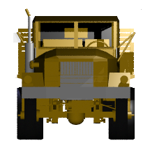
|image:../../lessons/es/images/mged02_truck_35_0.png[]
|Front (az=0, el=0)
|az=35, el=0
|===

[cols="2*"]
[%noheader]
|===
|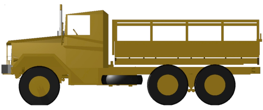
|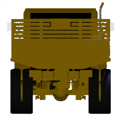
|Left (az=90, el=0)
|Rear (az=180, el=0)
|===

[cols="1*"]
[%noheader]
|===
|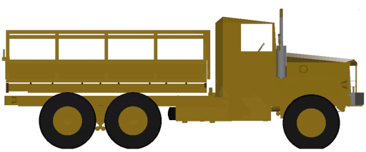
|Right (az=270, el=0)
|===

Por otro lado, la elevación determina la posición del espectador arriba o debajo del objeto. En el ejemplo anterior, usted se desplazó alrededor del camión sin modificar su altura relativa. Tenía una elevación de 0'0, lo que significa que se ubicada al mismo nivel. En la siguientes imágenes ilustrativas, imagine que detiene el camión en un acimut de 35'0 y luego sube a una escalera para fotografiarlo a una elevación de 25'0. Trepando aún más podrá fotografiarlo desde una elevación de 60'0. Si la cámara enfocara directamente hacia abajo, posicionandose exactamente sobre el camión, la elevación sería de 90'0. Si se agachara bajo el camión y mirara directamente hacia arriba, su elevación sería de -90'0.

[cols="2*"]
[%noheader]
|===
|image:../../lessons/es/images/mged02_truck_35_0.png[]
|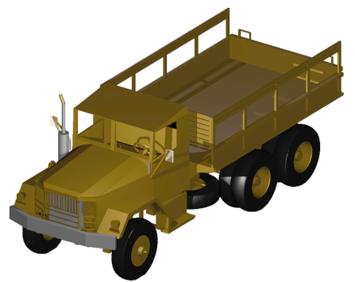
|az=35, el=0
|az=35, el=25
|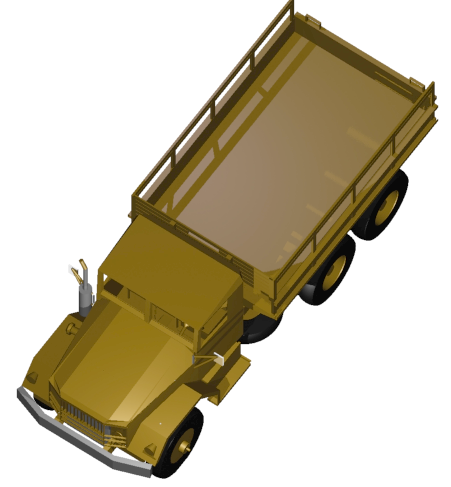
|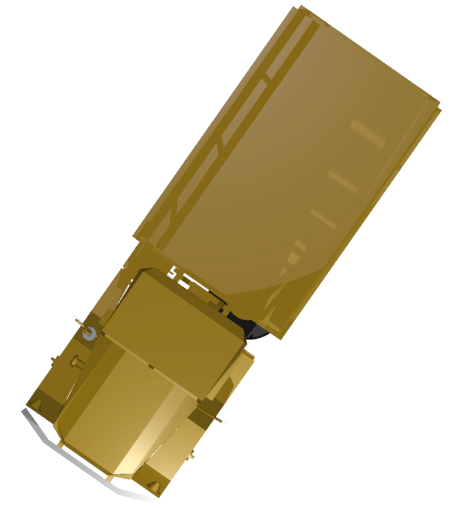
|az=35, el=60
|az=35, el=90
|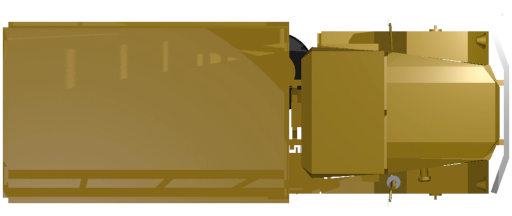
|image:../../lessons/es/images/mged02_truck_270_-90.png[]
|Top (az=270, el=90)
|Bottom (az=270, el=-90)
|===

Finalmente, el giro (que es una configuración opcional en _MGED_) especifica la rotación en relación a la direccion de la vista. La rotación se aplica a la vista antes de que el acimut o la elevación sean designados. Siguiendo con el ejemplo del camión, imagine que se posiciona exactamente delante del camión (az=0, el=0) y luego rota su cámara en sentido horario 14'0. Esto modificará el ángulo de giro de su visión en 14'0, como muestra la siguiente figura de la izquierda. Note nuevamente que no es el camión el que se mueve, sino sólo su vista sobre el mismo. Para saber más sobre giros, mire el comando *ae* en el apéndice A.

[cols="1*"]
[%noheader]
|===
|image:../../lessons/es/images/mged02_truck_0_0_14.png[]
|Front (az=0, el=0, tw=14)
|===

[[coord_sys_summary]]
== Relación del Acimut y la Elevación con el sistema de coordenadas xyz

Como mencionamos al principio de este tutorial, _MGED_ opera en un sistema de coordenadas tridimensional (determinado por los ejes x, y, and z). Acimut se mide por los ejes del plano xy, con el semieje positivo del eje x correspondiendo al acimut igual a 0'0. Los ángulos positivos del acimut son medidos desde el lado positivo del eje x, yendo hacia y pasando el lado positivo del eje y (sentido antihorario). Los valores negativos de acimut son medidos en la dirección opuesta.

image::../../lessons/es/images/mged02_coordsys.png[]

Si el ángulo de acimut es de 0'0, la elevación es medida en el plano con +90'0 correspondiendo al semieje positivo del eje z, y -90'0, si es al semieje negativo. Si el acimut no es 0'0, los ángulos de elevación están alineados con la dirección del acimut.

[[view_radio_angles]]
== Visualizando su radio desde distintos ángulos

Vamos ahora a experimentar con las distintas vistas de su radio. _MGED_ tiene algunas vistas estándard por defecto, las cuales pudieron apreciarse en el ejemplo del camión. Están incluídas las vistas desde arriba (Top)(az270, el90); desde abajo (Bottom)(az270, el-90); desde la derecha (Right)(az270, el0); desde la izquierda (Left)(az90, el0); de frente (Front)(az0, el0); y por detrás (Rear)(az180, el0); az35, el25; and az45, el45.

Despliegue el menú View (Vistas) e intente ver su radio desde distintos ángulos.

[cols="2*"]
[%noheader]
|===
|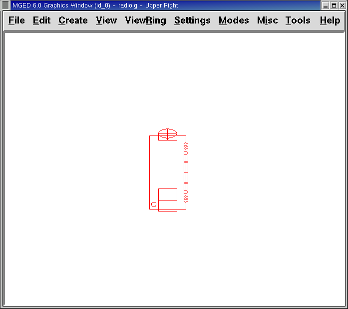
|image:../../lessons/es/images/mged02_radio_35_25.png[]
|Top
|az35,el25
|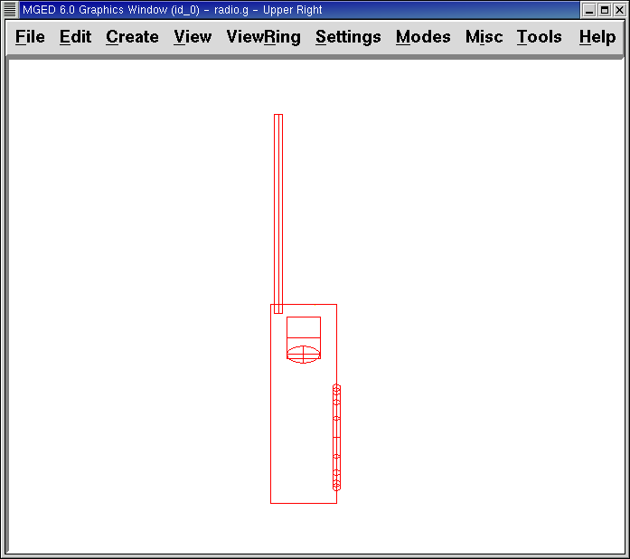
|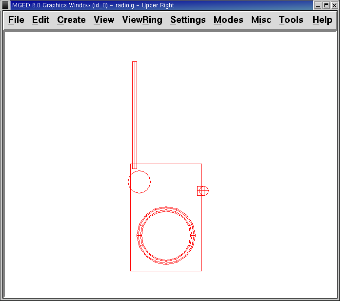
|Right
|Front
|===

También puede seleccionar alguna combinación de acimut, elevación y giro de su vista desde la línea de comandos. Por ejemplo, tipee en un prompt: *ae 128 17 [Enter]* Como muchas otras opciones de la línea de comandos, este método es mucho más preciso al ofrecer mayor control de las medidas en grados de lo que usted necesita modificar.

_MGED_ también puede mostrar varias vistas en simultáneo. Seleccione del menú Modes (Modos) la opción Multipane (Multipanel). Pequeños paneles con vistas distintas aparecerán una ventana gráfica, como se muestra en la ilustración:

image::../../lessons/es/images/mged02_multipane.png[]

[[shift_grips]]
== Trabajar con atajos de teclado (Shift Grips)

Las opciones de atajos de teclado (Shift Grip) de _MGED_ son una combinación de presiones de teclado y botones del mouse que pueden ser utilizados de distinta forma. Estos atajos de teclados podrán mover el espacio en torno al espectador, sin modificar el objeto en sí, ni sus coordenadas. Deberá familiarizarse con el modo en que operan porque en el modo edición usted podrá mover y modificar la geometría real de los objetos; y en ambos casos, el cambio parece ser el mismo.

En general, la tecla SHIFT translada (mueve), el CTRL rota, y el ALT limita las traslaciones o rotaciones a un eje particular (x, y, o z). Los ejes corresponden a los tres botones del mouse de la siguiente forma: el botón izquierdo para el eje x, el del medio para el eje y y el derecho para el eje z. Además, las teclas SHIFT y CTRL pueden combinarse con cualquier botón del mouse para escalar el objeto, en cuyo caso la tecla ALT no podrá limitar esta acción. La siguiente tabla muestra las distintas opciones y sus funciones.

.Los atajos de teclado y sus efectos
[cols="5*"]
|===
|Función
|Combinación de teclas
|Efecto en la vista normal
|Efecto en modo Edición

|Translación (Mueve)
|SHIFT + cualquier botón del mouse + moviento del mouse
|Mueve la vista en cualquier dirección
|Translada el objeto en cualquier dirección
|Rotación
|CTRL + cualquier botón del mouse + moviento del mouse
|Rota la vista en cualquier dirección
|Rota el objeto en cualquier dirección
.3+|Traslación limitada
|SHIFT + ALT + botón izquierdo + movimiento del mouse
|Mueve la vista en la dirección x
|Mueve el objeto en la dirección x
|SHIFT + ALT + botón medio + movimiento del mouse
|Mueve la vista en la dirección y
|Mueve el objeto en la dirección y
|SHIFT + ALT + botón derecho + movimiento del mouse
|Mueve la vista en la dirección z
|Mueve el objeto en la dirección z
.3+|Rotación limitada
|CTRL + ALT + botón izquierdo + movimiento del mouse
|Rota la vista según el eje x
|Rota el objeto según el eje x
|CTRL + ALT + botón medio + movimiento del mouse
|Rota la vista según el eje y
|Rota el objeto según el eje y
|CTRL + ALT + botón derecho + movimiento del mouse
|Rota la vista según el eje z
|Rota el objeto según el eje z
|Escalar
|SHIFT + CTRL + cualquier botón del mouse + movimiento del mouse
|Escala la vista en forma creciente o decreciente
|Escala el objeto en forma creciente o decreciente
|===

[CAUTION]
====
Dependiendo de su administrador de escritorio o de la configuración de su entorno gráfico, algunas combinaciones de teclas pueden estar reservadas para otras tareas (p.e.: modificar el tamaño de una ventana). De ser así, usted debe reconfigurarlo para poder habilitar las opciones de Shift Grip. Los zurdos, por ejemplo, podrían haber cambiado el comportamiento de los botones izquierdo y derecho en sus configuraciones de sistema. En tales casos, los términos botón izquierdo del ratón y el botón derecho del ratón debe ser cambiados en todo este documento.

====

Probablemente, la mejor forma de familiarizarse con las opciones de Shift Grip es probándolas sobre su radio. Utilizando el cuadro previo como guía, pruebe la traslación, rotación y limitación a los distintos ejes, modificando las vistas y escalando la imágen.

Nota: Recuerde que las opciones de Shift Grip manipula objetos. A menos que usted se encuentre en el modo Edit (Edición), se modificará únicamente la visión de los diseños.

[[learning_viewing_options_review]]
== Revisión

En este tutorial usted aprendió a:

* Crear el diseño de una radio.
* Localizar información sobre la vista en la ventana de comandos.
* Identificar elementos del sistema de visualización de _MGED_.
* Visualizar su radio desde distintos ángulos.
* Trabajar con atajos de teclado.
