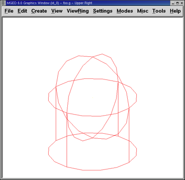

= Usar el comando Insert en MGED para dimensionar y ubicar figuras
Lee A Butler; Eric W Edwards; Betty J Schueler; Robert G Parker; John R Anderson
:doctype: article
:toc:
:toclevels: 3

En este tutorial usted aprenderá a:

* Crear una esfera y un cilindro circular recto (rcc por sus siglas en inglés: right circular cylinder)usando el comando make
* Crear ambas figuras usando el comando in (de insert).
* Combinar argumentos mediante línea de comandos para racionalizar la entrada de variables.
* Desarrollar un formato de comando combinado para ayudar a manejar las variables de línea de comandos.
* Considerar las convenciones para la elección de los nombres de sus objetos.
* Visualizar sus figuras desde distintas perspectivas utilizando las opciones del menú View (Vistas).
* Cerrar el programa _MGED_.

Esta lección se centra en la creación de formas a partir de la ventana de comandos utilizando los comandos in y make. Va a crear una esfera (SPH) y un cilindro circular recto (RCC), utilizando los comandos de modo que usted puede ver cómo trabaja cada comando. Luego, practicará las vistas de su modelo desde diferentes ángulos.

[[new_db_myShapes]]
== Crear una nueva base de datos desde la línea de comandos.

Crear una nueva base de datos y nombrarla shapes.g. Agréguele como título el nombre myShapes.

[[sphere_make]]
== Crear una esfera utilizando el comando make.

Comience por activar la ventana (por lo general, se logra haciendo clic en cualquier parte la ventana). Luego, en el prompt de _MGED_ tipee el siguiente comando: *make sph1.s sph [Enter]*

Como pudo apreciar en el tutorial #1, este comando le dice a _MGED_ que:

[cols="3*"]
[%noheader]
|===
|make
|sph1.s
|sph
|Cree una figura
|La nombre sph1.s
|Que sea una esfera
|===

image::../../lessons/mged/using_insert_command_images/wireframesphere.png[]

La figura de una esfera fue creada y en su ventana gráfica aparecerá un dibujo de la misma en forma de wireframe.

Para crear el rcc desde la ventana de comandos tipee en el prompt: *make rcc1.s rcc [Enter]*

Su ventana gráfica deberá mostrar un rcc grande, con la vista por defecto de az35, el25, viéndose como si entersectara con la esfera previamente creada.

image::../../lessons/es/images/mged03_wireframespherecylinder.png[]

Utilizar el comando make es la forma más fácil y rápida de crear una figura. De todas maneras, la mayoría de los modelos requieren figuras con parámetros específicos, como altura y radio. Por lo tanto, la manera más precisa de crear estas figuras es utilizando el comando in (insert).

[[using_in]]
== Utilizar el comando in para crear figuras

Una vez que la ventana de comandos esté activa al cliquear sobre ella, use el comando Z (zap) para despejar la ventana gráfica. Ya está listo para crear una esfera utilizando el comando in. En el prompt de _MGED_ tipee: *in sph2.s sph[Enter]*

_MGED_ responderá con: `Enter X, Y, Z of vertex:` `(Ingrese X, Y, Z del vértice:)`

Debe responderle a _MGED_ con la posición del vértice (centro) de la esfera en el espacio. Tipee entonces en el prompt de _MGED_: *4 4 4[Enter]*

NOTA: Al trabajar con _MGED_, recibirá algunas preguntas sobre el valor de vectores o vértices. En _MGED_, un vector representa la distancia y dirección desde un punto del espacio a otro, y el vértice es sólo un punto en el espacio. Los valores ingresados para un vector, generalmente son utilizados para crear objetos con dimensiones específicas. Los valores ingresador para el vértice ubican los objetos en el espacio.

Su esfera estará ahora ubicada en(x,y,z)=(4,4,4), medido en milímetros. Recuerde que los valores se ingresan separados por un espacio y se presiona la tecla ENTER luego. _MGED_ le preguntará entonces.

....

      Enter radius:
      (Ingrese radio:)
      Tipee.

      3[Enter]
      
....

El radio de la esfera será de 3 mm. El siguiente cuadro de diálogo aparecerá en la ventana de comandos (incluyendo las respuestas correspondientes): mged>in sph2.s sph `Enter X, Y, Z of vertex: 4 4 4` `Enter radius: 3` `51 vectors in 0.000543 sec` La última línea de este diálogo es simplemente un registro de la velocidad de la computadora en dibujar la forma. No tiene ninguna utilidad real para el usuario en este punto.

La esfera ha sido creada y su wireframe (marco de alambre), similar al de la esfera creada con el comando make aparecerá en su ventana gráfica.

Para crear el RCC correcto, tipee en el prompt de la línea de comandos: *in rcc2.s rcc[Enter]* _MGED_ le pedirá que ingrese los valores x, y, z de los vértices (donde quiere que el centro de un extremo de la RCC sea colocado en el espacio). Tipee. *4 4 0[Enter]* Asegúrese de dejar espacios entre cada valor.

_MGED_ le pedirá ahora que ingrese los valores x, y, z para la altura (H: de height) del vector (que determinará que tal alto desea que sea su rcc). Tipee: *0 0 4[Enter]* El último valor requerido será el radio del RCC. Tipee: *3[Enter]* El diálogo en la ventana de comandos para la creación de RCC debería verso como el siguiente:

....

      mged> in rcc2.s rcc

      Enter X, Y, Z of vertex: 4 4 0

      Enter X, Y, Z of height (H) vector: 0 0 4

      Enter radius: 3

      42 vectors in 0.000214 sec
      
....

Deberías tener ahora nuevas versiones de la esfera y del RCC. Compare las dimensiones de éstos con los creados anteriormente. El rcc está ahora en proporción con la esfera y posicionado en el espacio a la izquierda en la ventana gráfica. Al especificar las dimensiones de las formas y sus ubicaciones en el espacio, se ha podido crear el modelo de mayor precisión.

[cols="2*"]
[%noheader]
|===
|image:../../lessons/es/images/mged03_shapes_make_command.png[]
|
|Figuras creadas con el comando make
|Figuras creadas con el comando in
|===

[[args_on_one_line]]
== Combinar argumentos en una línea

Otra forma de usar el comando in es combinar toda la información requerida en una línea. Una vez que se familiariarice con el comando in, preferirá probablemente este método ya que permite mayor velocidad en el ingreso de parámetros.

Despejar la ventana gráfica con el comando Z. Ahora cree una nueva esfera tipeando en el prompt de _MGED_: *in sph3.s sph 4 4 4 3[Enter]*

Esta forma larga de ingresar el comando significa:

[cols="7*"]
[%noheader]
|===
|in
|sph3.s
|sph
|4
|4
|4
|3
|Insertar una figura primitiva
|Llamarla sph3.s
|Que la figura sea una esfera
|Dar a la x del vértice el valor 4
|Dar a la y del vértice el valor 4
|Dar a la z del vértice el valor 4
|Dar al radio el valor 3
|===

Para hacer un RCC correctamente usando este método, tipee en la línea de comandos: *in rcc3.s rcc 4 4 0 0 0 4 3[Enter]*

Este comando significa:

[cols="10*"]
[%noheader]
|===
|in
|rcc3.s
|rcc
|4
|4
|0
|0
|0
|4
|3
.2+|Insertar una figura primitiva
.2+|Llamarla rcc3.s
.2+|Hacer de la figura primitiva un cilindro circular recto (RCC)
.2+|Dar a la x del vértice el valor 4
.2+|Dar a la y del vértice el valor 4
.2+|Dar a la z del vértice el valor 0
|Dar a la x del vector de altura el valor 0
|Dar a la y del vector de altura el valor 0
|Dar a la z del vector de altura el valor 4
.2+|Dar al radio el valor de 3
3+|Hacer la forma de cuatro unidades de largo, apuntando directamente hacia z positivo
|===

[[command_combined_in]]
== Desarrollar un formato de comando combinado para el comando in

Cuando usted comienza a usar _MGED_ , si desea utilizar la ventana de comandos en lugar de la interfaz gráfica de usuario, probablemente querrá hacer algunos formularios en blanco de comandos combinados para cada tipo de forma primitiva que usted esté creando. Esto puede acelerar el proceso de diseño y ayudar a recordar que los valores deben ser presentados para cada forma. Una forma de la esfera podría ser:

[cols="10*"]
[%noheader]
|===
|in
|?
|sph
|?
|?
|?
|?
.2+|Insertar una figura
.2+|Nombre de la figura
.2+|La figura es una esfera
|Valor de x
|Valor de y
|Valor de z
.2+|radio de la esfera
3+|Centro
|===

Un ejemplo para el RCC puede ser:

[cols="10*"]
[%noheader]
|===
|in
|?
|rcc
3+|?
3+|?
|?
.2+|Insertar figura primitiva
.2+|Nombre de la figura
.2+|La figura es un cilindro circular recto
|Valor de x
|Valor de y
|Valor de z
|Valor de x
|Valor de y
|Valor de z
.2+|radio del rcc
3+|Vértice
3+|Vector de altura
|===

[[mged_naming_conventions]]
== Considerar los nombres convencionales para las figuras en MGED

Usted puede haber notado que cada vez que se crea una esfera o CCR, se han asignado nombres diferentes. A _MGED_ no le afecta en nada el nombre que le dé a una forma, pero puede ayudar el uso de convenciones sobre los nombres de las formas. Sólo tenga en cuenta también que cada nombre debe ser único en la base de datos, y para las versiones anteriores a _BRL-CAD_ 6.0, los nombres están limitados a 16 caracteres de longitud.

En esta lección le asignamos nombres a las formas en función de su tipo de figura y el orden en el que los creó. Lo hicimos porque las formas no tenía ninguna función real, salvo servir de ejemplos.

Al crear modelos reales, sin embargo, es probable que quiera asignar nombres como hemos hecho con los nombres de los componentes del radio, que se basan en sus funciones (por ejemplo, btn para el botón, ant para la antena, etc.)

Si usted trabaja con otros modeladores con experiencia, consulte con ellos para ver qué conjunto de convenciones utilizarán. Si trabaja solo, desarrolle su un conjunto de convenciones al nombrar sus figuras de forma que funcione para usted, y úselo de forma coherente.

[[view_shapes]]
== Visualización de las figuras

Practique ver sus nuevas formas mediante el menú View (Vistas). Manipule la vista con las diferentes combinaciones entre el mouse y las teclas identificadas en el tutorial anterior.

[[using_insert_command_quit]]
== Salir de MGED

Si desea salir de _MGED_ tipee la letra q o la palabra quit luego del prompt de la ventana de comandos y luego presione ENTER. También puede cerrar el programa seleccionando Exit (Salir) en el menú File (Archivo).

[[using_insert_command_review]]
== Repasemos

En este tutorial usted aprendió a:

* Crear una esfera y un cilindro circular recto usando el comando make.
* Crear ambas figuras usando el comando in (de insert).
* Combinar argumentos mediante línea de comandos para racionalizar la entrada de variables.
* Desarrollar un formato de comando combinado para ayudar a manejar las variables de línea de comandos.
* Considerar las convenciones para la elección de los nombres de sus objetos.
* Visualizar sus figuras desde distintas perspectivas utilizando las opciones del menú View (Vistas).
* Cerrar el programa _MGED_.
