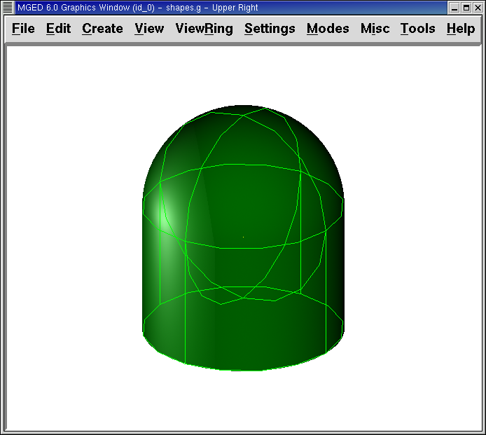

= Asignación de propiedades de los materiales y trazado de rayos (Raytracing) en MGED
Lee A Butler; Eric W Edwards; Betty J Schueler; Robert G Parker; John R Anderson
:doctype: article
:toc:
:toclevels: 3

En este tutorial usted aprenderá a:

* Llamar figuras primitivas creadas anteriormente.
* Crear una región de dos figuras primitivas.
* Asignar propiedades de los materiales a sus figuras primitivas desde la ventana de comandos.
* Limpiar su ventana gráfica y dibujar una nueva región.
* Generar el Raytrace de si diseño desde la interfaz gráfica.
* Utilizar la interfaz gráfica para cambiar capas de la ventana gráfica.
* Limpiar la ventana gráfica luego de hacer el trazado de rayos de su modelo.

[[assigning_material_properties_and_raytracing_opendb]]
== Abrir una base de datos

Para llamar a una figura primitiva creada en el tutorial anterior, inicie _MGED_ e ingrese al menú File (Archivo) seleccionando la opción Open (Abrir). Un panel de control aparecerá con una lista de carpetas y archivos. Selecciones shapes.g y luego Open (Abrir). Un nuevo cuadro se mostrará en pantalla, en el que deberá cliquear OK.

Dos ventanas se abrirán en su pantalla. En el prompt de _MGED_ de la ventana de comandos tipee: *draw sph2.s rcc2.s[Enter]*

[[create_region]]
== Crear una región

Antes de que pueda hacer el trazado de rayos de su diseño, usted tiene que hacer una región de las dos formas. Una región es un objeto que tiene propiedades de un material uniforme. La mayoría de las aplicaciones que utilizan los modelos de _BRL-CAD_ consideraran a las regiones como los componentes básicos del modelo. Las regiones se construyen utilizando las operaciones booleanas básicas de unión, intersección y substracción, que se mostrarán en el próximo capítulo.

En el promp de _MGED_ tipee: *r shRaytrace Control Panelapes2.r u sph2.s u rcc2.s[Enter]*

Nota: Asegúrese de haber ingresado correctamente el comando antes de presionar ENTER. Los espacios, o la falta de los mismos, son importantes.

Este comando le dice a _MGED_ que:

[cols="6*"]
[%noheader]
|===
|r
|shapes2.r
|u
|sph2.s
|u
|rcc2.s
|Cree una región
|La llame shapes2.r
|Añada el volumen de la forma
|sph2.s
|Añada el volumen de la forma
|rcc2.s
|===

[[assign_material_prop]]
== Asignar propiedad de la materia a una región

Ahora tipee: *mater shapes2.r[Enter]* _MGED_ responderá con:

....

   shader=

   Shader? ('del' to delete, CR to skip)

      
....

Que significa: Tipo de sombra ('del' para borrar, CR para saltear) Tipee entonces: *plastic[Enter]* _MGED_ le preguntará:

....

   Color = (no color specified)

   Color R G B (0..255)? ('del' to delete, CR to skip)
      
....

Tipee: *0 255 0[Enter]* Eso le asignará a la región el color gris claro. _MGED_ preguntará entonces:

....

   Inherit = 0 lower nodes (towards leaves) override

   Inheritance (0/1)? (CR to skip)
      
....

Tipee: *0[Enter]* Cuando complete esta seguidilla de comandos, en su ventana gráfica aparecerá algo como el siguiente ejemplo:

image::../../lessons/es/images/mged04_commandwindow.png[]

Una versión de una sola línea de estos comandos podría ser: *mater shapes2.r plastic 0 255 0 0[Enter]* Este comando dice que:

[cols="5*"]
[%noheader]
|===
|mater
|shapes2.r
|plastic
|0 255 0
|0
|Asigne propiedades de la materia a...
|la región llamada shapes2.r
|Crear una región de plástico
|Con el color gris claro
|No heredando los colores del tipo de material
|===

[[clear_window_new_region]]
== Limpiar la ventana gráfica y dibujar una nueva región

Una forma sencilla de limpiar su ventana gráfica y dibujar la nueva región al mismo tiempo es tipeando en el prompt de _MGED_ : *B shapes2.r[Enter]* Este comando le dice a _MGED_:

[cols="2*"]
[%noheader]
|===
|B
|shapes2.r
|La B es de Blast (ráfaga) y su función es despejar la ventana gráfica y redibujar el diseño.
|La región llamada shapes2.r
|===

El comando Blast es la forma corta de combinar los comandos Z y draw.

[[raytrace_model]]
== Crear el trazado de rayos (Raytrace) de su modelo

En el menú File (Archivo) seleccione la opción Raytrace. Aparecerá un cuadro de diálogo llamado Raytrace Control Panel (Panel de control de Raytrace). En la parte superior están los menús de Framebuffer y Objets (Objetos). Seleccione Framebuffer. Un menú desplegable le dará seis opciones: Active, All, Rectangle Area, Overlay, Interlay, y Underlay (en orden: Activo, Todo, Área rectangular, Traer al frente, Combinar capas, y Llevar al fondo). Con Overlay y Underlay, la capa que se envía hacia al frente o al fondo es la de framebuffer. Asegúrese de que las opciones Active (Activo), All (Todo) y Underlay (Llevar al fondo) estén activas (se evidencia con la presencia de un indicador rojo a la izquierda de cada elección). Seleccione OK.

Nota: Cuando selecciona Raytrace desde esta ventana de diálogo, se inicia una programa auxiliar (RT) de los paquetes de _BRL-CAD_ . El programa sólo crea el trazado de rayos de los objetos que se han dibujado en la ventana gráfica. Usted puede tener muchas formas, regiones, o combinaciones de ellas en una base de datos, pero si no están dibujados en ese momento en la ventana gráfica, el trazador de rayos las ignorará.

Cambie el color de fondo producido por el trazador de rayos mediante la opción Background Color (Color de fondo) en el Panel de Control de Raytrace. Un menú desplegable aparecerá con algunas opciones predefinidas de color, más una herramienta de color. Seleccione el color blanco. El botón de selección debería aparecer ahora en blanco, en concordancia con su selección.

Seleccione Raytrace. La ventana gráfica debe empezar a cambiar, y pronto verá su diseño en tonos verdes, con la malla superpuesta en el diseño, como se muestra en el ejemplo siguiente:

Como hemos visto, puede especificar el color de fondo con el que se hará el trazado de rayos.

También puede rellenar el framebuffer entero con el color de fondo. Para hacer esto, seleccione el color deseado y luego haga clic en el botón fbclear (despejar framebuffer) situado en la parte inferior del panel de control de Raytrace.

[[layers_graphics_window]]
== Cambiando capas de la ventana gráfica

La ventana gráfica de _MGED_ se utiliza para mostrar los diferentes tipos de información gráfica: mallas 3D y pixels en 2D (o imágenes). Conceptualmente, cada tipo de datos ocupa una capa diferente en la pantalla. Las mallas en 3D ocupan la capa de mallas (Raytrace), mientras que el 2D píxeles (imágenes) ocupan la capa de framebuffer. Estas capas pueden pensarse como transparencias, y el orden en que se apilan y se muestran puede ser modificado.

Como se mencionó anteriormente, hay un menú de Framebuffer en el panel de control de Raytrace. En la parte superior de este menú hay un botón de control etiquetado como activo. Éste modifica la pantalla con la capa de framebuffer a activada o desactivada. Cerca de la parte inferior del mismo menú hay tres botones de opción: Overlay, Interlay y Underlay. Cuando se selecciona el modo Underlay, se muestran los datos de píxeles debajo o detrás de los datos vectoriales. Por el contrario, cuando el modo Overlay está seleccionado, los datos de píxeles están en frente de los datos vectoriales. El modo interlay es similar al Overlay. La sutil diferencia es una tema avanzado que no se incluirá en este toturial.

[cols="2*"]
[%noheader]
|===
|
|image:../../lessons/es/images/mged04_fb_overlay_mode.png[]
|Framebuffer en modo Underlay
|Framebuffer en modo Overlay
|===

Para ver cómo funciona, vaya al menú de Framebuffer y seleccione la opción Overlay. Observe que la representación de malla desaparece. ¿A dónde va? Si contestara "detrás de la visualización de Framebuffer", sería una respuesta correcta. Para ver la geometría del modelo, usted tendría que inactivar el framebuffer o seleccionar el modo Underlay.

La malla tiene un punto amarillo en el centro que marca el centro de la vista (Ver tutorial 2). Esto le permite determinar si el uso de este dispositivo está en modo Overlay o Underlay. Si usted puede ver el punto de color amarillo, el uso de este dispositivo está en modo Underlay. Si le ha dicho a _MGED_ que extraiga algunas figuras, pero la ventana gráfica se ve en blanco, probablemente esté visualizando un framebuffer blanco que enmascara la capa de mallas.

Tenga en cuenta que puede cambiar la vista sobre la malla, pero la vista en el uso de framebuffer no se actualiza automáticamente para que coincidan. No es posible la manipulación directa de la vista en el framebuffer. Usted debe realizar nuevamente el trazado de rayos con el fin de actualizar la imagen de framebuffer.

[[clear_graphics_window]]
== Despejar la ventana gráfica

Para borrar por completo la ventana de gráficos, usted puede hacerlo tanto desde la capa de mallas, como en el framebuffer. Recuerde que usted puede limpiar la capa de malla con el comando Z. Para la capa de framebuffer, existe el botón fbclear en el panel de control de Raytrace.

En algunos casos, puede que prefiera para desactivar el framebuffer en lugar de borrarlo. Cuando el uso de este dispositivo está inactivo, _MGED_ se ejecuta más rápido porque que no tiene que volver a dibujar el framebuffer cada vez que se actualiza lo expuesto. Se puede activar y desactivar el framebuffer alternadamente con el ítem de activación de framebuffer del Panel de control de Raytrace.

Nota: Tenga en cuenta que en la versión de _BRL-CAD_ 5.1 y posteriores, al desactivar el framebuffer no se destruye la imagen que contiene, sino que al reactivar la opción, se recupera la misma imagen. Sin embargo, en las versiones anteriores del paquete, el contenido del framebuffer se pierde al desactivarlo.

[[assigning_material_properties_and_raytracing_review]]
== Revisión

En este tutorial usted aprendió a:

* Llamar figuras primitivas creadas anteriormente.
* Crear una región de dos figuras primitivas.
* Asignar propiedades de los materiales a sus figuras primitivas desde la ventana de comandos.
* Limpiar su ventana gráfica y dibujar una nueva región.
* Generar el Raytrace de si diseño desde la interfaz gráfica.
* Utilizar la interfaz gráfica para cambiar capas de la ventana gráfica.
* Limpiar la ventana gráfica luego de hacer el trazado de rayos de su modelo.
