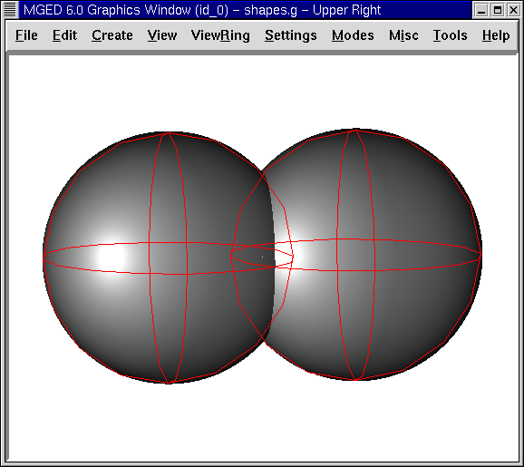
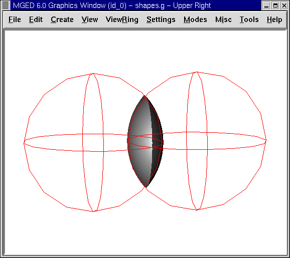
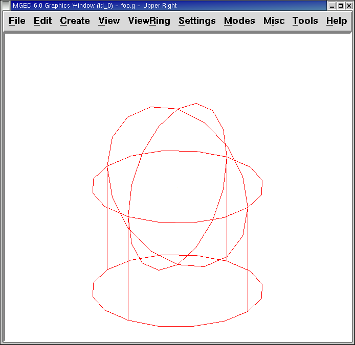
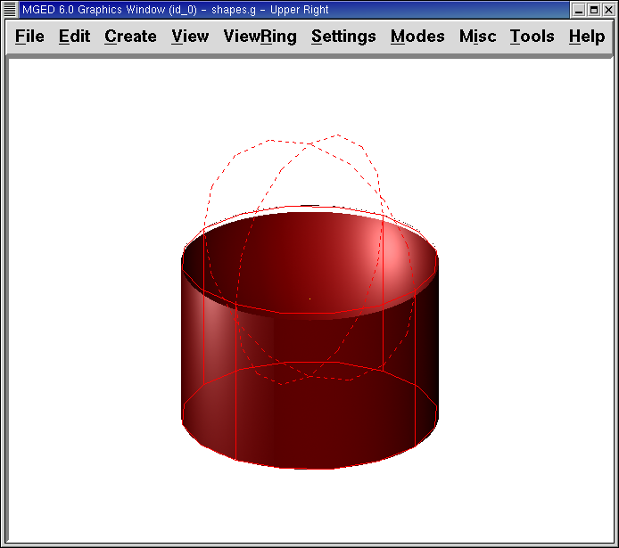

= Expresiones Booleanas
Lee A Butler; Eric W Edwards; Betty J Schueler; Robert G Parker; John R Anderson
:doctype: article
:toc:
:toclevels: 3

En este tutorial usted aprenderá a:

* Manejar combinaciones y regiones.
* Utilizar operaciones Booleanas.
* Crear regiones con operaciones Booleanas.

[CAUTION]
====
Este tutorial es importante porque las operaciones Booleanas son críticas para el modelado de procesos. El orden en que las formas son combinadas y los operadores son usados para combinar esas formas, determinará que el programa _MGED_ interprete su modelo.

El uso correcto de expresiones Booleanas para modificar formas geométricas es una técnica clave en el modelado de objetos. Es importante revisar estos conceptos tantas veces como sea necesario. Si resulta difícil absorber todo esto ahora, tómese un descanso y vuelva a intentar más tarde.

====

[[boolean_tools]]
== Combinación de Regiones: Herramientas Booleanas

Conceptualmente hay dos objetos en _MGED_ que soportan operaciones Booleanas. Uno se llama combinación, el otro, región.

Como se mencionó antes, una forma geométrica típica en _MGED_ se llama primitiva. Sin embargo, esas formas individuales resultan a menudo insuficentes para describir completamente un objeto complejo a modelar. Por eso, empleando operadores Booleanos para combinar dos o más formas primitivas en otras formas (combinación), le permitirá imitar ingeniosamente las formas y armar objetos más complejos.

En el capítulo anterior se vió que las propiedades del material están asociadas con las regiones. Al igual que las combinaciones, las regiones usan operaciones Booleanas para crear formas complejas. La diferencia es que las regiones son formas que tienen propiedades del material. Ocupan las tres dimensiones del espacio, en vez de definir una forma simple en el espacio.

Puede pensar a las primitivas y a las combinaciones como el boceto de un objeto. El objeto es creado al hacer una región. Por ejemplo, puede hacer un boceto de un objeto tal como una taza de café, pero luego crear esa taza con materiales de diferente tipo. (es decir, cerámica o vidrio). A pesar del material, el boceto es el mismo.

Cuando las operaciones Booleanas son usadas para construir formas complejas a partir de formas más simples, llamaremos al resultado una combinación de forma. Cuando son usadas para definir otra estructura lógica o jerárquica dentro de la base de datos, el resultado puede referirse a un grupo o a una combinación a ensamblar.

[[boolean_operations]]
== Operaciones Booleanas

Los tres operadores Booleanos empleados por el programa _MGED_ son: unión, substracción e intersección. Puede usar estas operaciones para combinar formas y producir otras más complejas.

* Union (Unión): Fusión de dos formas.
* Subtract (Substracción): Quitar el volumen de una forma superpuesta a otra.
* Intersect (Intersección): Usa solamente las partes de la intersección de dos formas que se superponen.

=== Union (Unión)

El operador unión, u, junta las formas, por lo que cualquier punto en al menos una de ellas, será parte del resultado. La unión es un operador potente usado frecuentemente.

=== Substracción

Cuando una forma primitiva tiene una segunda forma solapada substraída de él, el resultado es que la segunda forma desaparece, junto a cualquier volumen que tenga en común con la primera. El operador - (signo menos) significa substracción o diferencia. Esta operación es útil especialmente para ahuecar un cuerpo, remover una pieza formada previamente desde una primitiva, o cuando se tienen intersecciones entre paredes, placas, tuberías, u otras formas conectadas.

En el siguiente ejemplo, una línea roja punteada indica que el ámbito que debe restarse se extiende dentro de la esfera de la derecha. Este parte solapada está parcialmente fuera de la vista en la imagen del trazado de rayos.

image::../../lessons/es/images/mged05_subtractionspheres.png[]

=== Intersección

La operación Booleana de intersección, representada por el operador + (signo más), combina dos formas primitivas que se superponen entre sí, guardando solamente el volumen en común (las áreas no solapadas no serán representadas). Una manera sencilla de entender las intersecciones es pensar en las formas de las rutas. La intersección es el lugar donde dos rutas se cruzan y superponen.

Aunque muchas personas encuentran las operaciones de intersección más difíciles de entender que las uniones o substracciones, hay formas inusuales/complejas que pueden ser expresadas más facilmente utilizando el operador intersección. Por ejemplo, ud puede modelar una lente de aumento como la intersección de dos esferas.

La operación de intersección no es muy común, a menos que, como se muestra en la figura que sigue, dos formas se superpongan. La intersección de dos formas que no tienen puntos en común (no se superponen) es el conjunto nulo, por lo que no incluye ningún punto del espacio.

No hay restricciones importantes cuando se usan los operadores Booleanos de substracción e intersección. Debe haber una primera forma desde la cual una segunda forma puede ser subtraída o intersectada. Si ud tiene solamente una forma dentro de una región o combinación, el operador será ignorado, siendo reemplazado siempre por el de unión.

[[making_regions_bool_ops]]
== Crear Regiones con Operaciones Booleanas

Comience abriendo la base de datos shapes.g que creó en la Lección 3. En el prompt de la Ventana de Comando, tipee: *draw sph2.s rcc2.s[Enter]* Este comando dibujará las formas que usará para crear nuestras regiones. Las dos formas lucirán aproximadamente como la siguiente imagen:

Creará entonces formas diferentes para demostrar la función de las operaciones Booleanas. En la ventana de comando, tipee lo siguiente: *r part1.r u rcc2.s - sph2.s[Enter]* Este comando le dirá a _MGED_ que:

[cols="6*"]
[%noheader]
|===
|r
|part1.r
|u
|rcc2.s
|-
|sph2.s
|Cree una región
|La nombre part1.r
|Una...
|La forma nombrada rcc2.s
|Substraiga...
|La forma nombrada sph2.s
|===

Nota: El primer miembro siempre lleva u minúscula para un operador (por eso al llamar al comando con una sola imagen, por defecto el operador será la unión). El segundo y subsecuente miembro puede usar -, + ó u según lo necesario. La forma de determinar cuáles operadores usar y en qué orden, se desarrollará en un tutorial más avanzado.

En la lección previa, aplicamos las propiedades del material a los objetos desde la línea de comandos. Ahora usaremos la interfaz gráfica para realizar la misma tarea. Desde el menú Edit (Edición), elija Combination Editor (Editor de Combinación). Esto mostrará una ventana de diálogo emergente. Cliquee sobre el botón que se ubica a la derecha del cuadro de entrada del nombre y luego cliquee en Select from All (Seleccionar desde todas las regiones). Un menú desplegable aparecerá con las regiones que ha creado. Seleccionar part1.r. El resultado debería verse como el siguiente:

image::../../lessons/es/images/mged05_combinationeditor.png[]

Cliquee en el botón al lado de Color y seleccione el rojo.

Ahora cliquee en el botón OK en la esquina inferior izquierda de la ventana de diálogo. Esto aplicará los cambios y cerrará el panel.

Hasta el momento, sólo tenemos las formas primitivas visualizadas, no la región. Antes de hacer el trazado, debemos remover las formas primitivas de la visualización, y dibujar la región. De otra manera, no podremos ver la región con los colores que hayamos aplicado. Podemos hacer esto tipeando: *B part1.r*

Ahora está listo para trazar este objeto. Desde el menú File (Archivo), active el Raytrace Control Panel (Panel de Control del Trazado de Rayo) y cliquee el botón Raytrace (Trazado de Rayos). La imagen obtenida debería ser similar a la imagen de la izquierda que se muestra a continuación. Nótese que esto puede tomar varios minutos, dependiendo de la velocidad de cada sistema en particular.

[cols="2*"]
[%noheader]
|===
|
|image:../../lessons/es/images/mged05_raytracedpart2.png[]
|Raytrace de part1.r
|Raytrace de part2.r
|===

Debería ver que una porción esférica ha sido sacada de la parte superior del cilindro.

A continuación haremos una región azul usando el operador intersección, en vez del de substracción. Una vez más, comenzaremos creando una región: *r part2.r u rcc2.s + sph2.s[Enter]*

Para comparar la aproximación de la GUI (Interfaz Gráfica de Usuario) usada para hacer part1.r, usemos la línea de comandos para asignar el color a part2.r: *mater part2.r plastic 0 0 255 0[Enter]*

Finalmente, despeje la nueva región en la pantalla como sigue con el comando blast: *B part2.r[Enter]*

Al realizar el trazado de su objeto, debería verse similar a la imagen previa de la derecha.

Nota: Recuerde limpiar la Ventana Gráfica y dibujar la nueva región o combinación antes de intentar trazar el modelo. El trazado de rayos ignora una región o combinación que no esté dibujada en la Ventana Gráfica. El color de la malla es un indicador. Si no refleja los colores que ha asignado (por ej., un objeto está dibujado en rojo aún cuando le asignó otro colores), es porque no refrescó la pantalla de las formas primitivas, dibujando la nueva región o combinación desde el último cambio.

Cuando use el operador intersección, el orden en el cual especifica las formas no importa. Deberíamos haber tenido los mismos resultados si hubiéramos especificado la operación Booleana como: *r part2.r u sph2.s + rcc2.s*

Sin embargo, cuando se usa el operador substracción, el orden de las dos formas es muy importante. Hagamos una región con el orden de las formas contrario al usado para part1.r: *r part3.r u sph2.s - rcc2.s*

Esta vez no nos importará fijar un color. (Cuando ningún color es fijado para los objetos, el trazado de rayos (rt) usará el color blanco. Sin embargo, estos objetos pueden parecer grises por la cantidad de luz en la escena. Despeje este diseño de la pantalla y realice el Raytrace nuevamente:

image::../../lessons/es/images/mged05_raytracedpart3.png[]

Ahora realice el trazado de rayos de los tres objetos que creó. Para dibujar las tres regiones a la vez, tipee: *B part1.r part2.r part3.r*

Hacer esto una vez más no es problemático. Sin embargo, si éstas fueran las tres partes que construyen algún objeto complejo, nos gustaría ser capaces de dibujarlos de forma más conveniente. Para dibujar un conjunto de objetos más fácilmente, creamos una combinación de ensamble para juntarlos a todos. Crearemos una combinación llamada dome.c para nuestras tres regiones. Esto se logrra con el siguiente comando: *comb dome.c u part1.r u part2.r u part3.r*

Note la similitud entre este comando y el comando r que usamos para crear regiones.

Recuerde los conceptos al inicio de esta lección. La diferencia entre una región y una combinación es que las combinaciones no son necesariamente compuestas de una sola clase de material. Diversos objetos de diferentes materiales pueden producir una combinación de ensamble tal como la que acabamos de crear.

Nota: Ya que la creación de combinaciones de ensamble es una tarea muy frecuente, hay un comando de atajo - el comando g (por grupo)- para realizar la tarea de manera más sencilla. Al crear dome.c usando este comando quedaría algo como lo siguiente: *g dome.c part1.r part2.r part3.r* Note que ud no debe tipear el operador Booleano u. El comando g une todos los argumentos de ese operador.

Todo lo que se necesita para dibujar los tres objetos es el este sencillo comando: *B dome.c*

Ahora podremos realizar el trazado de la serie reunida y obtener la siguiente imagen:

image::../../lessons/es/images/mged05_raytraceddome.png[]

[[operator_precedence]]
== Precedencia de operadores

Las formas que hemos creado aquí son bastante simples. En cada caso, una única la forma primitiva es unida, y las operaciones de resta e intersección son realizadas en esa forma primitiva simple. Usted debe saber que es posible utilizar ecuaciones booleanas mucho más complejas para crear la forma de los objetos. Cuando quiera crear los objetos, tenga en cuenta la precedencia de las operaciones booleanas. En la notación de Boole que estamos utilizando, la la resta y la intersección, tienen prioridar por sobre el operador de unión. Entonces, por ejemplo: *comb demo.c u shape1 - shape2 u shape3 - shape4 + shape5*

Resultará en las siguientes expresiones Booleanas: `(shape1 - shape2) u ( (shape3 - shape4) + shape5)`

[[learning_boolean_operations_review]]
== Repasemos...

En este tutorial, usted aprendió a :

* Manejar combinaciones y regiones.
* Utilizar operaciones Booleanas.
* Crear regiones con operaciones Booleanas.

