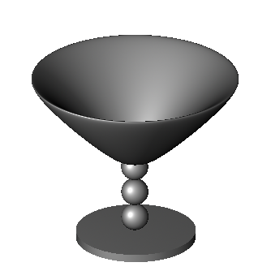
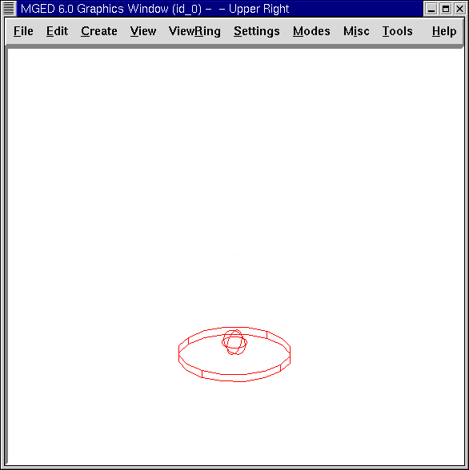
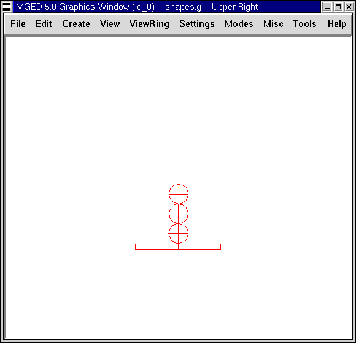
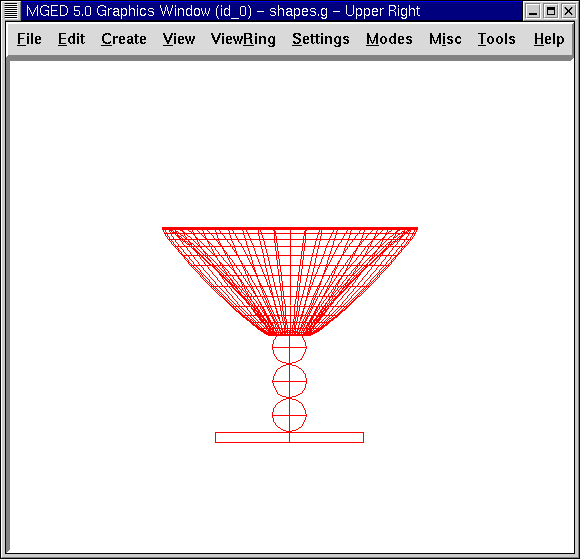

= Crear una copa
Lee A Butler; Eric W Edwards; Betty J Schueler; Robert G Parker; John R Anderson
:doctype: article
:toc:
:toclevels: 3

En esta lección podrás:

* Crear una nueva base de datos.
* Crear, editar, y copiar formas primitivas para hacer las partes de una copa.
* Hacer regiones por partes.
* Hacer una combinación de las regiones.
* Ver un árbol de datos.
* Hacer un trazado de rayos de la copa terminada.

En esta lección podrás crear una copa similar a la del siguiente ejemplo:

[[goblet_new_database]]
== Crear una nueva base de datos

Primero, inicie _MGED_ desde una consola de comandos. Seleccione File (Archivo) desde la barra de menú y luego New (Nuevo). Un cuadro de diálogo aparecerá, y preguntará el nombre de la nueva base de datos. Tipee en copa.g al final del nombre y presiona OK. El programa debería decirle que la base de datos fue creada exitosamente y que está usando milímetros como unidad de medida.

[[create_edit_copy_goblet]]
== Crear, editar, y copiar las partes de la copa

=== Crear la base de la copa

De la barra de menú, seleccione la categoría Cones and Cylinders (Conos y Cilindros), y luego seleccione rcc (por sus siglas en inglés: right circular cylinder) para un cilindro circular recto. Un cuadro de diálogo aparecerá preguntándole el nombre del rcc. Complételo tipeando base1.s y luego presione ENTER. Un delgado cilindro aparecerá en la ventana gráfica listo para ser editado.

=== Editar la base de la copa

De la barra de menú seleccione Edit (Editar) y luego Set H. Posicione el puntero del mouse en la mitad inferior de la ventana gráfica y cliquee con el botón medio del mouse varias veces. El cilindro se irá haciendo más pequeño a medida que vaya cliqueando. (Note que mientras mas cerca se encuentre el puntero del punto medio de la venta gráfica más pequeño será eñ cambio. Y mientras más lejos esté, será más notorio.) Continúe cliqueando hasta que el cilindro se parezca a un disco plano como el que se ve en la siguiente figura y cliquee en Accept (Aceptar).

image::../../lessons/es/images/mged06_gobletbase.png[]

=== Crear el pie de la copa

En la barra de menú seleccione Create (Crear), luego Ellipsoids (Elipsoides), y cliquee en sph para seleccionar una esfera (sph por sphere en inglés). Complete con el nombre de la esfera tipeando ball1.s en la casilla del nombre y cliquee en Aplicar. Una gran esfera aparecerá en su ventana gráfica.

Seleccione del menú Edit (Editar) y clickea en Escala. Situa el puntero del mouse en la mitad más baja de la Ventana de Gráficos y clickea el botón central del mouse hasta que tu esfera tenga aproximadamente un cuarto del diámetro de la base, como es mostrado en la ilustración siguiente.

Para mover la bola arriba de la base de la copa, presione la tecla SHIFT y el botón izquierdo del mouse para arrastrar la esfera en el lugar indicado. Puede verificar tu colocación yendo a la opción View (Vista) de la barra de menú, seleccionando una vista de Frente. En esta vista, puedes alinear el centro de la esfera con la línea central del rcc (cilindro circular recto). Repita este procedimiento en una vista desde Izquierda. Cuando crea que la esfera está correctamente alineada con el rcc, seleccione la opción Editar y cliquee en Aceptar.

=== Agregando bolas adicionales al pie de la copa

El próximo paso es agregar más esferas al pie de tu copa. Una manera sencilla para hacer esto es ir al menú Edit (Editar) y seleccionar Primitive Editor (Editor Primitivo). En la casilla de diálogo deberá ingresar el nombre de la primera esfera que creó: ball1.s. Luego cliquee Reset (Resetear) (para resetear los valores de la casilla de diálogo a los de ball1.s) o dele retorno en la casilla destinada para el nombre. Cambie el nombre ball1.s por ball2.s usando la tecla BACKSPACE y cliquee Apply (Aplicar).

Repita este procedimiento con una sph llamada bola3.s. Cuando lo haya hecho, cliquee OK. Ahora tiene tres bolas para el pie, pero no podrá verlas hasta que las edite, porque están en el mismo lugar, una sobre la otra.

Una manera aun más fácil de hacer las copias es desde la línea de comandos con el comando cp (copiar) como sigue: *cp ball1.s ball2.s[Enter]* *cp ball1.s ball3.s[Enter]*

=== Editar las bolas del pie de la copa

Para editar la nuevas bolas que ha creado, vaya al menú Edit (Editar) y cliquee en Primitive Selection (Selección Primitiva). Una casilla aparecerá con los nombres de la base y de las bolas. Haga un doble click en ball2.s para seleccionarlo. Verá la primera bola cambiar al color blanco. Use la tecla SHIFT y cualquier botón del mouse para arrastrar esta bola (que es realmente ball2.s) hasta que descanse apenas superpuesta en la parte superior de ball1.s. Verifique las vistas para alinear las bolas como hizo con la primer bola. (Note que este alineamiento es más fácil aun si se arrastra usando las teclas SHIFT y ALT y el botón derecho del mouse, con el cual se restringirá el movimiento de la bola a la dirección del eje Z.) Clickea en Accept (Aceptar) bajo la opción Edit (Editar) cuando finalice.

Si estuviera modelando una copa de verdad querría que las bolas del pie se solapen un poco. Si apenas se tocaran, el pie sería demasiado débil. Si no se tocan, el pie estaría hecho con piezas separadas del material suspendidas en el espacio.

Repita estos pasos para mover ball3.s a su posición. Cuando haya terminado, su copa se parecerá a la siguiente desde una vista frontal:

=== Haciendo la parte cóncava de la copa

El próximo paso es hacer la cuenca de la copa. En el menú Create (Crear) cliquee en eto (por las palabras inglesas "elliptical torus") para seleccionar un toro elíptico. Nombre al toro como basin1.s (basin es cuenca en inglés). Cliquee Apply (Aplicar). Un gran eto aparecerá en la ventana gráfica.

En el menú Edit (Editar) seleccione la opción Set C. Ubique la flecha del mouse en la mitad superior de la ventana gráfica y arrastre con el botón central del mouse presionado hasta que su eto tenga aproximadamente el tamaño del que aparece en la figura siguiente. Si lo cree más conveniente, use la función de escalar para hacer la cuenca más proporcional al resto del objeto utilizando los atajos de teclado y mouse combinado con las vistas múltiples para posicionar la cuenca.

[[making_goblet_regions]]
== Haciendo las regiones de la base, pie y cuenca de la copa

Para saber a cuáles de las formas primitivas hacerle el trazado de rayos con _MGED_, primero debe definir las áreas con operaciones booleanas. En este ejemplo, las operaciones booleanas a utilizar serán la unión (u) y la sustracción (-).

Para hacer una región que reúna las formas del pie, tipee en el prompt de la ventana de comandos: *r stem1.r u ball1.s u ball2.s u ball3.s [Enter]*

Para hacer de la base una región, tipee en el prompt: *r base1.r u base1.s - ball1.s[Enter]*

Para hacer de la cuenca una región, tipea en el prompt: *r basin1.r u basin1.s - stem1.r[Enter]*

Note que cuando se creó base1.r, substrajo una forma primitiva desde otra forma primitiva. Cuando creó basin1.r, substrajo una región entera desde una forma primitiva.

[[making_goblet_region_comb]]
== Hacer una combinación de las regiones

Para combinar todas las regiones dentro de un objeto, necesitará ejecutar una de las últimas operaciones Booleanas. En el prompt de la Ventana de Comandos, tipee: *comb globet1.c u basin1.r u stem1.r u base1.r[Enter]*

Esta operación le dice al programa _MGED_ que:

[cols="8*"]
[%noheader]
|===
|comb
|globet1.c
|u
|basin1.r
|u
|stem1.r
|u
|base1.r
|Haga una combinación
|La nombre globet1.c
|uniendo
|la región basin1.r
|y
|la región stem1.r
|y
|la región base1.r
|===

[[goblet_view_data_tree]]
== Ver un árbol de datos

_MGED_ requiere una cierta lógica para el árbol de datos, es decir, para saber como graficar varios elementos. La copa, la base y la cuenca consisten de regiones compuestas de solamente una forma primitiva cada una. El pie, en contraste, consiste de una región compuesta de la unión de tres esferas. Las tres regiones fueron combinadas para formar un objeto complejo.

Para ver el árbol de datos para esta combinación, tipee en el prompt de la ventana de comandos: *tree globet1.c[Enter]*

_MGED_ responderá con:

....

   goblet1.c/

   u basin1.r/R

   u basin1.s

   - stem1.r/R

   u ball1.s

   u ball2.s

   u ball3.s

   u stem1.r/R

   u ball1.s

   u ball2.s

   u ball3.s

   u base1.r/R

   u base1.s

   - ball1.s
	
....

El nombre de la combinación total de esta región es globet1.c. Está compuesta de las tres regiones: base1.r, stem1.r, y basin1.r. La región base1.r está compuesta de la forma primitiva llamada base1.s menos bola1.s. La región stem1.r está compuesta de tres formas primitivas llamadas ball1.s, ball2.s, y ball3.s. La región basin1.r está compuesta de la forma primitiva llamada basin1.s menos la región stem1.r.

Recuerde que las regiones definen volúmenes de material uniforme. En el mundo real (y en _BRL-CAD_), dos objetos no pueden ocupar el mismo espacio. Si dos regiones ocupan el mismo espacio, se dice que se superponen o solapan. Para permitirnos tener la base y el pie solapados, le susbtraemos ball1.s a base1.s cuando creamos base1.r. También substraemos de stem1.r a basin1.s cuando creamos basin1.r Esto remueve material de una región, que de otra manera crearía un solapamiento con la otra. La siguiente figura muestra el solapamiento entre ball1.s y base1.s en azul. Ese es el volumen que es removido de base1.r.

image::../../lessons/es/images/mged06_base_subtracted_vol.png[]

[[raytracing_goblet]]
== Hacer el trazado de rayos de la copa

Para graficar la copa usando las propiedades del material por defecto de plástico gris, ve al menú Archivo y clickea en Raytrace. Cuando el Panel de Control de Raytrace aparece, cambie el color del fondo clickeando en el botón a la derecha de la casilla de Background Color (Color de Fondo) y luego clickeando en la opción blanca en el menú desplegable. Luego cliquee Raytrace.

Cuando haya finalizado de ver la copa desde la vista frontal, seleccione del menú View (Vista) un acimut de 35 y una elevación de 25 de la forma: az35. el25 y luego grafica. Si quieres ver la copa sin la estructura de alambres, seleccione la opción Framebuffer del panel de control de Raytrace y cliquee en Overlay (Cubrir). La copa lucirá similar a la de la siguiente ilustración:

image::../../lessons/es/images/mged06_rtgobletaz_35el_25.png[]

[[creating_goblet_review]]
== Repaso

En este tutorial usted aprendió a:

* Crear un nueva base de datos.
* Crear, editar, y copiar formas primitivas para hacer las partes de una copa.
* Hacer regiones con las partes.
* Hacer una combinación de las regiones.
* Visualizar un árbol de datos.
* Graficar la copa terminada.
