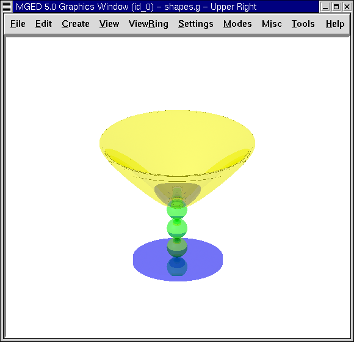

= Asignar propiedades de los materiales a una copa
Lee A Butler; Eric W Edwards; Betty J Schueler; Robert G Parker; John R Anderson
:doctype: article
:toc:
:toclevels: 3

En este tutorial usted aprenderá a:

* Repasar como abrir una base de datos existente.
* Asignar colores y sombreado de plástico a las regiones de la copa.
* Utilizar las opciones del sombreado con transparencia y reflexión espejada.
* Realizar el trazado de rayos de varios ejemplos de la copa.

En este tutorial, le agregará a la copa creada en el tutorial anterior, propiedades de los materiales. La copa terminará se verá de forma similar a la de la siguiente imagen.

image::../../lessons/es/images/mged07_goblet_mater_complete.png[]

[[goblet_review_opening_db]]
== Repaso: abrir una base de datos existente

Si salió del programa luego del último tutorial, abra la base de datos de la copa nuevamente (llamada goblet.g). La forma más sencilla de hacer esto es abriendo la base de datos desde la ventana de comandos al iniciarse _MGED_. Para hacer esto, tipee luego del prompt: *mged goblet.g[Enter]*

TambiÈn puede abrirlo desde el entorno gráfico seleccionando del menú File (Archivo) la opción Open (Abrir). Un cuadro de diálogo aparecerá y le pedirá que ingrese el nombre de una base de datos existente. Ingrese el nombre de goblet.g o cliquéelo entre las opciones de la lista de directorios. Luego presione Open (Abrir) y el programa le avisará que pudo acceder a la base de datos exitosamente, recordando que utiliza milímetros como unidad de medida. Cliquee entonces OK.

=== Dibujando la copa en la ventana gráfica

Para dibujar la copa que realizo en el tutorial anterior, diríjase a la ventana de comandos y tipee en el prompt lo siguiente: *draw goblet1.c[Enter]*

Una representacion en malla de la copa aparecerá en la ventana gráfica.

[[goblet_assign_colors]]
== Asignar colores y sombreado de plástico a las regiones de la copa

Ingrese al menú Edit (Edición) y selecciones Combination Editor (Editor de combinaciones). Para seleccionar las distintas regiones de la copa que realizó previamente, vuelva al cuadro de Nombre y cliquee en el botón ubicado a la derecha del cuadro de ingreso. Aparecerá un submenú. Haga doble click en Select From All Regions (Seleccionar desde todas las regiones). Le mostrará una lista de todas las regiones creadas en esta base de datos, incluyendo base1.r, basin1.r, y stem1.r. Haga doble click en base1.r para seleccionar esa región.

Cliquee en el botón de la derecha de la opción de color del editor de combinación y en el menú desplegable tendrá disponible una herramienta que le permitirá crear más colores. Cliquee en el azul. Luego cliquee en el botón a la derecha del cuadro de sombras. Aparecerá una lista con los sombreados disponibles. Cliquee en la opción Plastic (Plástico) Del nuevo conjunto de opciones que le brindará el programa, utilizará sólo dos en este tutorial. Cliquee en Apply (Aplicar) para asignarle el color azul y las propiedades del plástico al cuenco de su copa.

Repita estos pasos para asignarle el color verde y sombreado de plástico a la región stem1.r y el color amarillo y sombreado de plástico a la región basin1.r. Cuando finalice, cliquee OK para terminar con la ventana del Combination Editor (editor de combinación).

A pesar que los cambios fuerpon aplicados en la base de datos, la ventana gráfica no los reflejara. Para redibujarlos debe activar la ventana de comandos y tipear en el prompt: *B goblet1.c[Enter]*

El comando B (de Blast) despeja la pantalla y redibuja la copa con las selecciones de color aplicadas.

=== Realizando el trazado de rayos de la copa

Para volver a obtener la malla de la copa, del menú File (Archivo) seleccione la opción Raytrace (Trazado de rayos). Aparecerá la ventana de Raytrace Panel de control (Panel de control de Raytrace). Mueva el puntero al botón ubicado a la derecha de Background Color (Color de fondo) y haga clic en la opción de blanco. Para que el trazado de rayos se genere más rápidamente, puede cambiar el tamaño de la ventana de gráficos para hacerla menor antes de abrir el panel de trazado de rayos. Cuando decremente el tamaño de la ventana, haga clic en Raytrace para iniciar el proceso de trazado de rayos.

Nota: Como se mencionó anteriormente, no es conveniente que las regiones se superpongan. Aunque al haber solapamiento no siempre se afecta a el proceso de trazado de rayos, si el modelo va a ser estadísticamente analizado, esto podría crear problemas.

Mientras se genera el trazado de la copa, mueva el cursor al la opción Framebuffer de la barra de menú del Raytrace Control Panel (Panel de control de Raytrace) y cliquee Overlay (Traer al frente). Cuendo el trazado de rayos finalice, debería ver una copa similar a la de la siguiente imagen:

image::../../lessons/es/images/mged07_goblet_complete_window.png[]

[[goblet_transparency_mirror]]
== Utilizar las opciones del sombreado con transparencia y reflejo espejado

La copa trazada parece bastante real, pero podría mejorarse utilizando otras opciones del Editor de combinación. Cuando seleccione el sombreado de plástico, un nuevo conjunto de opciones aparecerá y le permitirán elegir diversas propiedades o atributos del sombreado. Una de ellas es Transparency (Transparencia). Puede ajustar esta propiedad en las distintas regiones mediente el ingreso de cualquier valor entre 0,0 (opaco) y 1,0 (transparentes).

Cuando aplique color y sombreado a cada una de las tres regiones de la copa, usted puede ajustar la transparencia de cada region con los siguientes pasos (1) seleccionar la región en el Combination Editor (Editor de combinación), (2) botón derecho en la caja de Transparency (Transparencia), y (3) ingresar un valor entre 0.0 y 1.0.

Para este tutorial, abra Combination Editor (Editor de combinación), haga clic en el botón a la derecho del cuadro Name (Nombre), presione Select From All Regions (Selección desde todas las regiones) en el menú desplegable y, a continuación, elija la región base1.r. Aplique el sombreado de plástico y tipee .5 para que su región sea semi-transparente. Cliquee en Apply (Aplicar) y repita este procedimiento para cada una de las otras dos regiones. Entonces rehaga el trazado de rayos de la copa, la cual deberá verse similar a la siguiente:

image::../../lessons/es/images/mged07_goblet_semitransparent.png[]

Los colores de la copa semi-transparente son más brillantes que los de las copas opaca porque es mayor la cantidad de luz que puede penetrar el material plástico. Usted puede hacer la copa más realista en apariencia volviendo al Combination Editor (Editor de combinación) y agregando una reflexión espejada. Para cada región, coloque el cursor en la casilla que aparece junto a esta opción, cliquee en el botón izquierdo del ratón, y tipee .45. Esto hará que la mitad de la luz disponible se refleje en la superficie de la copa.

[[goblet_newforms_raytrace]]
== Realizando el trazado de rayos de una nueva forma de la copa

Cliquee en aplicar y realice nuevamente el trazado de rayos de su diseño. Una nueva imagen similar a la siguiente aparecerá en su ventana gráfica:

La nueva imagen será bastante distinta a la imagen original. Continúe modificando los valores de los efectos de transparencia y reflexión para comprender como impactan enla imagen resultante.

Recuerde que al utilizar estas opciones, los valores ingresados deberán ser menores a 1.0. La siguiente tabla le muestra algunos ejemplos de combinaciones que puede usar:

[cols="2*"]
|===
|Valor de transparencia
|Valor de reflexión espejada

|.50
|.49
|.35
|.64
|.20
|.57
|.10
|.89
|.89
|.10
|===

[[goblet_material_properties_review]]
== Repasemos...

En este tutorial usted repasó la apertura de una base de datos y aprendió a:

* Asignar colores y sombreado de plástico a las regiones de la copa.
* Utilizar las opciones del sombreado con transparencia y reflexión espejada.
* Realizar el trazado de rayos de varios ejemplos de la copa.
