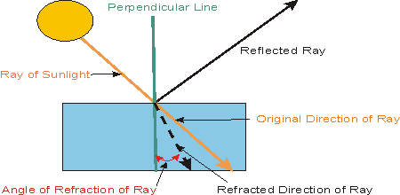
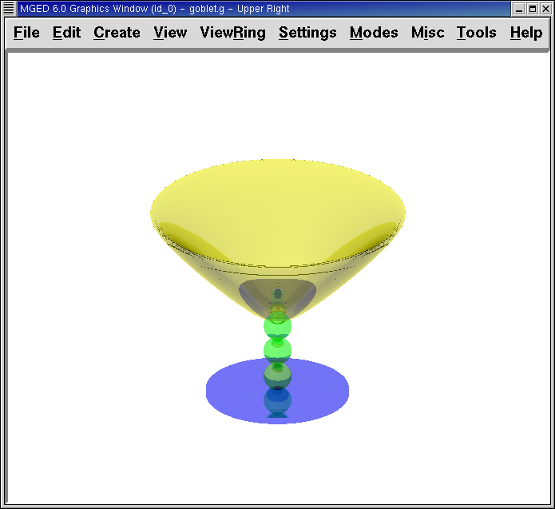
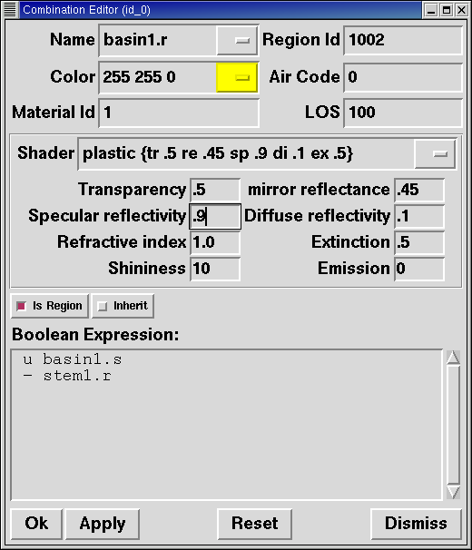

= Asignar más propiedades de los materiales a la copa
Lee A Butler; Eric W Edwards; Betty J Schueler; Robert G Parker; John R Anderson
:doctype: article
:toc:
:toclevels: 3

En este tutorial usted aprenderá a:

* Utilizar las opciones de reflexión especular y difusa del sombreado de plástico.
* Asignar valores a los índices de refracción del sombreado de plástico.
* Asignar valores a la opción de brillo del sombreado de plástico.
* Asignar valores a la opción de extinción del sombreado de plástico.
* Experimentar con varias combinaciones de opciones del sombreado de plástico.

Abra la base de datos goblet.g utilizando cualquiera de métodos aprendidos. Del menú Edit (Edición), seleccione la opción Combination Editor (Editor de combinación). Seleccione basin1.r.

En el último tutorial, hemos asignado los valores para los atributos de transparencia y de reflexión espejada. Ahora asignará valores de otras propiedades de sombreado. Cuando selecciona el sombreado de plástico para la región basin1.r, ocho casillas de entrada de atributo aparecen en el editor de combinación. Estas cajas contienen los valores que el usuario ha establecido previamente (por ejemplo, las que se ingresaron previamente para la transparencia y el reflejo espejado) o los valores por defecto que tiene el programa si no se especifican otros. Cuando alguno de estos valores es modificado, el cambio puede ser visto entre llaves en el cuadro Shader (Sombreado) que muestra los ingresos en una cadena de texto además de en los cuadros de entrada de los atributos apropiados, como se puede apreciar en la siguiente imagen:

image::../../lessons/es/images/mged08_goblet_combeditor.png[]

[NOTE]
====
Note que en versiones posteriores a _BRL-CAD_ 5.2, se aplican los valores por defecto, pero no son visualizados en las cajas de atributo de sombreados.

====

En este ejemplo, el cuadro de entrada de sombreado indica que la transparencia (tr) es de .5 y el reflejo espejado (re) es de .45. Los ocho abreviaturas que se utilizan actualmente en el cuadro de entrada de sombreado son las siguientes:

[cols="4*"]
[%noheader]
|===
|tr - transparency - transparencia
|sp - specular reflectivity - reflexión especular
|ri - refractive index - índice de refracción
|ex - extinction - extinción
|re - mirror reflectance - reflejo espejado
|di - diffuse reflectivity - reflesión difusa
|sh - shininess - brillo
|em - emission - emisión
|===

[[goblet_specular_diffuse]]
== Reflexión especular y difusa

Cuando la luz se refleja de una superficie brillante, produce dos tipos de reflexiones. Los puntos más notables son causados por reflexión especular. El resto de la superficie produce la reflectividad difusa. Mientras más brillante es la superficie, como en un vaso de cristal, mayor reflexión especular se produce. Mientras más opaca sea la superficie, como en una pared pintada con pintura mate, más reflexión disfusa es producida. En la ilustración siguiente, se muestra un modelo de la relación entre estas reflectividades:

image::../../lessons/es/images/mged08_spec_vs_diff_reflectivity.png[]

Como se observa en la ilustración, la reflexión difusa muestra el color de un objeto al reflejar la luz ambiental desde del objeto. La esfera de la parte superior izquierda muestra el valor máximo de reflexión difusa (1,0), y como resultado, el color de su superficie es uniforme.

La reflexión especular, por otra parte, refleja el color de una luz fuente. La esfera de la parte inferior derecha muestra el valor máximo de reflexión especular (1,0), por eso una fuente de luz blanca se refleja fuera de la superficie de la esfera.

El rango para la reflexión, tanto especular como difusa, es entre 0,0 y 1,0. Sin embargo, los valores combinados de estas suelen ser igual a 1,0. Recordar, si se van a establecer los valores de uno de estos atributos, es necesario asignar un valor correspondiente al atributo complementario, de manera que la combinación de los valores sea igual a 1,0.

[[goblet_refractive_index]]
== Índice de refracción

Cuando la luz pasa a través de un medio (por ejemplo, aire) a otro medio de (por ejemplo, agua), se dobla de su trayectoria original. El ángulo en que la luz se curva se denomina índice de refracción. Cuanto más disímiles son los medios, mayor es el grado de refracción que se producirá. Por ejemplo, luz solar que pasa a través de un diamante se dobla más que la misma luz solar a través del cristal óptico. El diamante tendría un mayor índice de refracción (aproximadamente 2,42) mientras que el vidrio óptico tendría un menor índice de refracción (aproximadamente 1,71).

El rango del índice de refracción de _MGED_ es de 1,0 (el índice de aire) en adelante. Este parámetro sólo es útil para los materiales que tienen un transparencia mayor que 0. El siguiente dibujo de la luz solar pasando a través del agua muestra cómo funciona la refracción.

[[goblet_shininess]]
== Brillo

El brillo de un objeto afecta el índice del componente especular del sombreado de plástico. Mientras mas brillante es la superficie de un objeto, menor será el reflejo de la fuente de luz en la superficie del objeto. El rango de de brillo suele ser un valor entero de 1 a 10.

[[goblet_extinction]]
== Extinción

El término extinción se aplica al componente transmisivo del sombreado del plástico, e indica la cantidad de luz absorbida por el material del objeto. El valor por defecto es 0.0, y el rango puede ser cualquier número negativo. Éste atributo puede afectar drásticamente otros atributos del sombreado, especialmente el índice de refracción.

[[goblet_emission]]
== Emisión

Emisión es una característica relativamente nueva que se ha añadido al paquete _BRL-CAD_. Se refiere a la cantidad de brillo artificial del objeto.

[[goblet_shader_attributes]]
== Aplicar atributos de material plático a la copa

Ahora que puede entender los diversos atributos del sombreado del plástico, es tiempo de experimentar con las formas en que afectan al producto final de la copa que ha creado en los últimos dos tutoriales. Habiendo probado los valores para la transparencia y la reflexión espejada, agregue los atributos de reflexión especular y difusa a basin1.r. Una vez que vea cómo estos dos atributos afectan a su diseño, añada el índice de refracción, y a continuación, el brillo y la extinción. Es posible que desee capturar algunos de estos cambios de manera que pueda referirse a ellos más tarde, cuando cree otro modelo que utiliza el mismo sombreado. Recuerde cliquear en Aplicar en el Editor de combinación para que incorpore los cambios.

Al cambiar los valores de los atributos del sombreado de plástico, se dará cuenta de que algunos cambios no alteran significativamente el diseño. Esto es porque hay una variedad de formas para producir una mirada particular sobre el objeto. Los siguientes son dos ejemplos de la copa con diversos valores de los atributos de plástico (que crean una diferencia notable) aplicado a basin1.r.

image::../../lessons/es/images/mged08_goblet_reflectivity_1.png[]

En el momento en que haya terminado de experimentar con el cambio de atributos del sombreado de plástico, la ventana del editor de combinación puede verse como la siguiente:

Tenga en cuenta que en el cuadro de entrada de cadena de Shader se reflejan los valores fijados por el usuario en los cuadros de entrada de cada atributo (por ejemplo, la transparencia de .5), pero no se reflejan los valores por defecto (por ejemplo, el brillo de 10).

[[goblet_material_properties2_review]]
== Repasemos...

En este tutorial usted aprendió a:

* Utilizar las opciones de reflexión especular y difusa del sombreado de plástico.
* Asignar valores a los índices de refracción del sombreado de plástico.
* Asignar valores a la opción de brillo del sombreado de plástico.
* Asignar valores a la opción de extinción del sombreado de plástico.
* Experimentar con varias combinaciones de opciones del sombreado de plástico.
