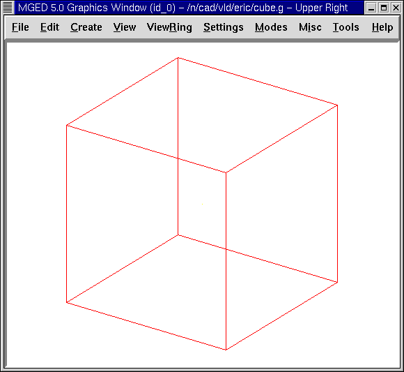
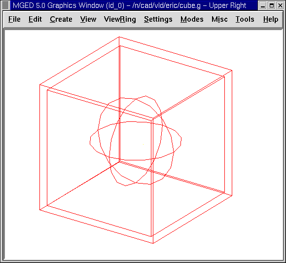
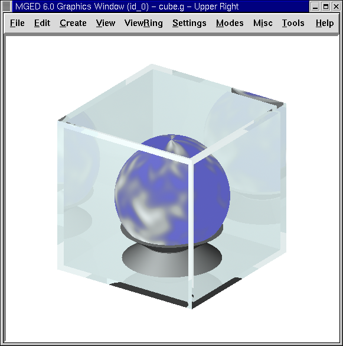

= Crear una esfera en una caja exhibidora transparente
Lee A Butler; Eric W Edwards; Betty J Schueler; Robert G Parker; John R Anderson
:doctype: article
:toc:
:toclevels: 3

En este tutorial aprenderá a:

* Utilizar la GUI para crear una caja exhibidora usando formas arb8.
* Crear una esfera dentro de la caja exhibidora.
* Asignar propiedades del material para hacer que los objetos parezcan más reales.
* Rotar un objeto 180'0 usando la opción Rotate (Rotación) del menú Edit (Editar)
* Utilizar la opción de color del Combination Editor para producir colores personalizados.

[[globe_in_display_newdb]]
== Crear una nueva base de datos

Comience creando una nueva base de datos llamada cube.g.

[[globe_create_display_box]]
== Creando la caja exhibidora

Vaya al menú Create (Crear), seleccione la categoría Arbs, y luego seleccione un arb8 (polihedro arbitrario convexo de ocho vértices). Cuando se le pregunte por un nombre para el arb8, nómbrelo cube1.s. Cliquee en Apply (Aplicar). Vaya al menú Edit (Editar) y cliquee en Accept (Aceptar). Ahora tiene un cubo para el exterior de la caja, como se muestra en la siguiente figura:

Repita la primera parte de este proceso para producir otro arb8, esta vez llame esta forma cube2.s. Vaya al menú Edit (Editar) y cliquee en Scale (Escala). Coloque el puntero del mouse en la mitad inferior de la ventana gráfica y cliquee el botón central del mouse hasta que el segundo cubo sea apenas menor que el primero, como el siguiente:

image::../../lessons/es/images/mged09_globe_inside_outside_box.png[]

En el menu View (Vista) y cambie la vista a Front (Frontal). Luego, en el menú Edit (Editar) cliquee en Translate (Traslación). Mantenga apretada la tecla SHIFT y arrastre el cubo interior hacia la posición en el centro del cubo exterior. Repita este proceso desde la vista superior e izquierda hasta que el cubo más pequeño este ubicado en el centro del cubo exterior viéndolo desde todas las perspectivas. Cuando haya terminado, regrese a Edit (Editar) y cliquee en Accept (Aceptar).

[[create_globe_in_box]]
== Crear una esfera dentro de la caja exhibidora

Vaya al menú Create (Crear) y seleccione sph de la lista Ellipsoid (Elipsoides). Nombre la forma como globe1.s y cliquee en Apply (Aplicar).

Una esfera debería aparecer dentro del cubo en la Graphics Window. Cambie a la vista frontal.

Vaya al menú Edit (Editar) y seleccione Scale (Escalar). Reduzca el tamaño de la esfera hasta que se ajuste dentro del cubo y luego arrástrela hacia el centro del cubo. Vaya a Edit y Acepte los cambios. La esfera y la caja deberían ser similares a la siguiente imagen, en una vista az35 y el25:

Para ver el contenido de la base de datos, tipee en el prompt de la línea de comandos: *ls[Enter]*

Debería ver listados a cube1.s, cube2.s y globe1.s, que son las formas que ha creado. Para hacer regiones con estas formas, tipee en el prompt: *r cube1.r u cube1.s - cube2.s[Enter]* *r globe1.r u globe1.s[Enter]*

[[globe_assign_mater_prop]]
== Utilizar el Combination Editor para asignar propiedades de los materiales que hacen a los objetos parecer más reales

En el menú Edit (Editar) seleccione Combination Editor (Editor de combinaciones). En la caja de diálogo, cliquee el botón al lado de la caja de ingreso del Nombre. Seleccione globe1.r desde Select From All o Select From All Regions (Seleccionar de todas las regiones). Haga un doble click sobre el nombre globe1.r. Asigne a esta región un sombreado de nube. Chequee la caja de entrada de expresiones booleanas para asegurarse que la región está hecha de u globe1.s. Cliquee en Apply para aceptar su elección. Cambie la vista en el menú View a az35, el25.

Regrese a Name (Nombre) y seleccione cube1.r desde el menú Select From All. Asigne a esta región un sombreado de vidrio. El sombreado de vidrio es un acceso directo para cambiar individualmente los atributos del sombreado plástico para que se parezca al del vidrio.

Vaya a la opción Color e ingrese lo valores 244 255 255. Esto le dará a su caja de vidrio un color de luz cian. Cliquee en Apply para aceptar los cambios.

Antes que pueda generar el Raytrace de su diseño, necesitará limpiar la ventana gráfica tipenado Z en el prompt de la ventana de comandos. Ambas formas y regiones son mostradas en este punto. Luego, tipee en la ventana de comandos: *draw cube1.r globe1.r[Enter]*

La caja y la esfera deberían reaparecer en la ventana gráfica. En el menú File (Archivo) seleccione Raytrace. Luego, seleccione la opción blanca para el Background Color (Color de fondo). Cliquee en Raytrace.

Su diseño debería mostrar un cubo de vidrio cian claro con una esfera azul dentro. Diríjase a Framebuffer (en el Raytrace Panel) y seleccione Overlay (Superposición), para quitar la vista en malla de alambre. La pantalla debería parecerse a la de la siguiente ilustración:

image::../../lessons/es/images/mged09_globe_raytraced.png[]

Para hacer este diseño más interesante, puede colocar la esfera sobre una base. Regrese a Framebuffer y cliquee en Active para desactivarlo. Luego, en el menú Create (Crear), en la categoría Cones and Cylinders (Conos y cilindros) seleccione el trc (cono truncado recto). Nombre la forma como base1.s. Trabajando desde una vista frontal, vaya al menú Edit (Editar) y seleccione Scale (Escala). Cliquee el botón central del mouse para reducir el trc a un tamaño apropiado, acorde a la base de la esfera. (Puede necesitar incrementar el tamaño de la ventana gráfica o disminuir la vista de la figura para ver la parte inferior del trc). A continuación reduzca la altura seleccionando Set H en el menú Edit (Editar) y cliquee con el botón central del mouse. Es probable que tenga que alternar entre estas dos opciones varias veces para obtener el tamaño adecuado. Cuando haya terminado no haga clic en Accept aún, ya que debemos hacer más cambios.

[[globe_move_rotate]]
== Mover y rotar un objeto

Así junto a otras características en _MGED_, mover y rotar objetos puede ser realizado de distintas maneras, de acuerdo a la precisión deseada. Como fue descripto previamente, las funciones Shift Grip (Arrastrar utilizando el mouse) pueden ser usadas como una manera rápida para cambiar un objeto cuando su ángulo exacto y localización no son importantes. Alternativamente, para alcanzar una mayor precisión, pueden aplicarse los comandos Translate (Traslación) y Rotate (Rotación) del menú Edit (Editar), ingresando los números de los parámetros específicos en la línea de comandos. En este tutorial, experimentaremos con ambos métodos.

Con su trc aún en modo de edición y con una vista frontal, use la tecla SHIFT y el botón izquierdo del mouse para arrastrar la forma hasta situarla en el piso del cubo, apenas tocando la caja interior. Note que podría haber seleccionado Translate (Trasladar) desde el menú Edit (Editar) ingresando los parámetros en la línea de comandos para mover el trc a un lugar exacto; sin embargo, en este caso es suficiente alinear la forma con el método de arrastrar-y-soltar. En este punto, ud puede notar que su trc necesita ser apenas redimensionado para ajustarse mejor a la esfera. Use Scale (Escalar) y Set H (Ajuste h) de ser necesario y luego acepte los cambios.

Ahora necesitamos hacer un segundo trc llamado base2.s, el cual usaremos para el techo de la base. En el prompt de la línea de comandos, tipee: *cp base1.s base2.s*

El segundo trc aparecerá directamente encima del primer trc. Utilizaremos el Primitive Selection (Selección de primitivos) desde el menú Edit (Editar) para nombrarlo base2.s, girarlo y posicionarlo sobre el trc previamente creado.

Para ello, podemos utilizar las teclas CTRL y ALT (para limitar la rotación) y el botón izquierdo del mouse moviéndolo hacia arriba y abajo hasta que el trc quede invertido. (Si utiliza este método, tenga en cuenta que puede soltar el botón del ratón y liberar el objeto, tomándolo nuevamente para posicionarlo como sea deseado). Sin embargo, como sabemos que queremos rotar la forma en un valor exacto de 180'0 sobre el eje x, utilizaremos un método más preciso para rotarla. Seleccione Rotate (Rotación) desde el menú Edit (Editar) y luego tipee los parámetros (abreviado con la p) en la línea de comandos, como se muestra a continuación: *p 180 0 0[Enter]*

Nuestra forma debería haberse dado vuelta y pasado a la parte inferior de la primera trc. (Los dos ceros que ingresó indican que no hay rotación a lo largo de los ejes Y y Z). Ahora presione la tecla SHIFT y el botón izquierdo del mouse para arrastrar base2.s y apoyarla en la parte superior de base1.s. Las dos formas deberían constituir una base para sostener su globo. Compruebe la alineación utilizando múltiples vistas y luego acepte los cambios.

En el menú Edit (Editar) y diríjase al Primitive Selection (Selección de primitivos) y cliquee en globe1.r/globe1.s. Como hizo con las formas trc, arrastre la esfera con el mouse y la tecla SHIFT hacia abajo hasta que esté en su lugar sobre la base. Regrese a Edit (Editar) y cliquee en Accept (Aceptar). Su diseño debería verse como el siguiente:

image::../../lessons/es/images/mged09_globe_base_box_wireframe.png[]

Para hacer la región de la base, tipee en el prompt de la línea de comandos: *r base1.r u base1.s u base2.s[Enter]*

[[globe_use_color_tool]]
== Utilizar el Color Tool (Herramientas de color) del Combination Editor (Editor de combinaciones) para producir colores personalizados.

En la ventana del editor de combinaciones, cliquee sobre la caja de texto a la derecha de Nombre y luego desde Select From All elija base1.r. Asigne a la base una textura de plástico. En la caja de color, ingrese los números: *217 217 217*

Aplique sus cambios. Antes que pueda generar el Raytrace de su diseño completo, deberá despejar primero la ventana gráfica y reconstruir su diseño tipeando en el prompt de la línea de comandos: *Z[Enter]* *draw cube1.r globe1.r base1.r[Enter]*

Cambie la vista a az35, el25 y luego genere el Raytrace, el cual deberá ser similar al siguiente:

[[globe_in_display_box_review]]
== Repasemos...

En este tutorial aprendió a:

* Utilizar la GUI para crear una caja usando las formas arb8.
* Crear una esfera dentro de la caja.
* Utilizar el Combination Editor para asignar propiedades de los materiales que hacen a los objetos parecer más reales.
* Rotar un objeto 180'0 usando la opción rotar del menú Edit.
* Utilizar la opción de color del Combination Editor para producir colores personalizados.
