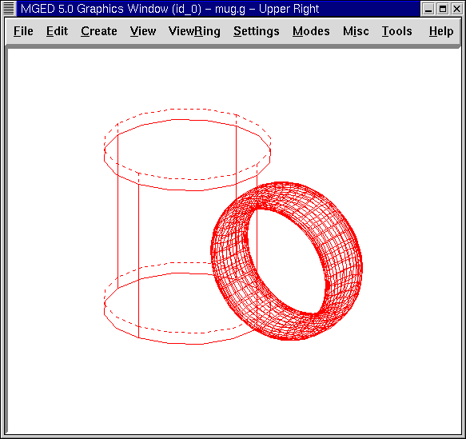

= Crear una taza
Lee A Butler; Eric W Edwards; Betty J Schueler; Robert G Parker; John R Anderson
:doctype: article
:toc:
:toclevels: 3

En este tutorial usted aprenderá a:

* Crear el cilindro externo utilizando el comando in.
* Crear el cilindro interno para generar el vacío en la figura cilíndrica más grande.
* Crear el asa de su taza.
* Crear una combinación para producir el cuerpo de su taza.
* Crear una combinación para unir el asa al cuerpo de la taza.
* Crear una región para combinar las figuras con igual material y color.

En este tutorial usted continuará su trabajo de creación de objetos de la vida real, en este caso, la forma básica del cuerpo de una taza de café. En los próximos tutoriales, perfeccionará el cuerpo para que sea más realista.

[[mug_new_db]]
== Crear una nueva base de datos

Cree una nueva base de datos y llamela mug.g. Vuelva al menú File (Archivo) y seleccione Preferences (Preferencias) a continuación, Units (Unidades) y finalmente Inches (Pulgadas). Esto creará su cuerpo usando pulgadas como unidad de medida. (Nota: También puede hacer esto escribiendo "units in" en la ventana de comandos del sistema.)

[[mug_outside_cyl]]
== Creando el cilindro externo utilizando el comando in

Para comenzar a hacer el cuerpo de la taza, usted necesitará crear el cilindro externo. Para esto tipee lo siguiente en el prompt de _MGED_: *in bodyout.s rcc*

El diagrama de este comando es:

[cols="3*"]
[%noheader]
|===
|in
|bodyout.s
|rcc
|Crear una figura
|Llamarla bodyout.s
|La figura es un cilindro circular
|===

_MGED_ le pedirá los siguientes datos sobre del cilindro que usted desea crear. Tipee los valores dados en negrita. Asegúrese de dejar espacios entre los valores de las variables. *Enter X, Y, Z of vertex: 0 0 0[Enter]* *Enter X, Y, Z of height (H) vector: 0 0 3.5[Enter]* *Enter radius: 1.75[Enter]*

Note que el formato de una sola línea para darle todos estos datos al programa sería: *in bodyout.s rcc 0 0 0 0 0 3.5 1.75[Enter]*

El diagrama de este comando es:

[cols="6*"]
[%noheader]
|===
|in
|bodyout.s
|rcc
|0 0 0
|0 0 3.5
|1.75
|Crear una figura
|Llamarla bodyout.s
|La figura es un cilindro circular
|La x, y, y z de los vértices es 0 0 0
|La x, y, y z del vector de altura es 0 0 3.5
|El radio es de 1.75
|===

La figura del cilindro, en forma de malla de alambre, aparecerá en la ventana gráfica.

[[mug_inside_cyl]]
== Creando el cilindro interno

Utilizando este mismo método, escriba la información del cilindro circular interno. Este cilindro se utiliza para vaciar el exterior cilindro. Siempre que vaya a crear un agujero en la superficie de un objeto, asegúrese de que la forma creada para hacer el agujero sobresalga de la superficie. De esta forma estará seguro de no dejar una capa delgada de material donde las dos superficies se unen. *in bodyin.s rcc 0 0 0.25 0 0 3.5 1.5[Enter]*

El diagrama de este comando es:

[cols="6*"]
[%noheader]
|===
|in
|bodyin.s
|rcc
|0 0 0.25
|0 0 3.5
|1.5
|Crear una figura
|Llamarla bodyin.s
|la figura es un cilindro circular
|La x, y, y z del vértice es 0, 0, y 0.25
|La x, y, y z del vector de altura 0, 0, y 3.5
|el radio es de 1.5
|===

El segundo cilindro, en el interior del primer cilindro, deberá aparecer ahora en la ventana gráfica.

[[mug_handle]]
== Creando el asa

Ahora tendrá que introducir algunos datos sobre el cuerpo del asa. El tipo de forma para el asa es un toro elíptico. En la ventana de comandos del sistema, escriba: *in handle.s eto 0 2.5 1.75 1 0 0[Enter]*

El diagrama de este comando es:

[cols="5*"]
[%noheader]
|===
|in
|handle.s
|eto
|0 2.5 1.75
|1 0 0
|Crear una figura
|Llamarla handle.s
|La figura es un toro elíptico
|La x, y, y z del vértice es 0, 2.5, y 1.75
|La x, y, y z del vector normal es 1, 0, y 0
|===

El programa le pedirá lo siguientes datos de la figura a crear. Tipee los valores mostrados en negrita. *Enter X, Y, Z, of vector C: .6 0 0[Enter]* *Enter radius of revolution, r: 1.45[Enter]* *Enter elliptical semi-minor axis, d: 0.2[Enter]*

La figura de una rosquilla debe aparecer en el lado derecho del cuerpo. Si usted mira atentamente, podrá ver que alrededor de un tercio del toro elíptico corta el cuerpo.

[[mug_comb1]]
== Creando la combinación Bodyout.s-Bodyin.s

El próximo paso será combinar los dos cilindros en el cuerpo de la taza. Para hacer esto tipee: *comb body.c u bodyout.s - bodyin.s[Enter]*

Le ha dicho al programa que cree la combinación body.c a partir de la unión de bodyout.s menos bodyin.s.

[cols="6*"]
[%noheader]
|===
|comb
|body.c
|u
|bodyout.s
|-
|bodyin.s
|Crear una combinación
|Llamarla body.c
|Crear la unión de...
|el cilindro bodyout.s...
|y substraerle...
|el cilindro bodyin.s
|===

[[mug_comb2]]
== Creando la combinación Handle.s - Bodyout.s

Para combinar el asa con la parte externa del cilindro tipee: *comb handle.c u handle.s - bodyout.s[Enter]*

[cols="6*"]
[%noheader]
|===
|comb
|handle.c
|u
|handle.s
|-
|bodyout.s
|Crear una combinación
|Llamarla handle.c
|Crear la unión de...
|el toro handle.s...
|y substraerle...
|el cilindro bodyout.s
|===

[[mug_region]]
== Creando la región Mug.r

El último paso en la creación de la taza es crear una región a partir de las combinaciones. Tipee: *r mug.r u body.c u handle.c[Enter]*

[cols="6*"]
[%noheader]
|===
|r
|mug.r
|u
|body.c
|u
|handle.c
|Crear una región de figuras del mismo material y color
|Llamarlo mug.r
|Crear la unión de...
|la combinación body.c...
|y unirla con...
|la combinación handle.c
|===

Si realizó estos pasos correctamente, el programa responderá algo similar a:

....

   Defaulting item number to 1002

   Creating region id=1001, air=0, GIFTmaterial=1, los=100
      
....

Ahora debe tener la región mug.r como una combinación de formas que contienen el mismo material y color. Usted puede asignar el color y el material en este momento, pero deberá trabajar más sobre el diseño para hacerlo más realista. Por ahora, revise lo que apredió en este tutorial. Cuando esté listo para trabajar de nuevo, puede seguir perfeccionando su diseño en el próximo tutorial.

[[mug_review]]
== Repasemos...

En este tutorial usted aprendió a:

* Crear el cilindro externo utilizando el comando in.
* Crear el cilindro interno para generar el vacío en la figura cilíndrica más grande.
* Crear el asa de su taza.
* Crear una combinación para producir el cuerpo de su taza.
* Crear una combinación para unir el asa al cuerpo de la taza.
* Crear una región para combinar las figuras con igual material y color.
