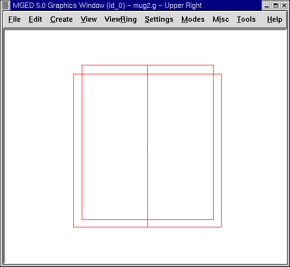
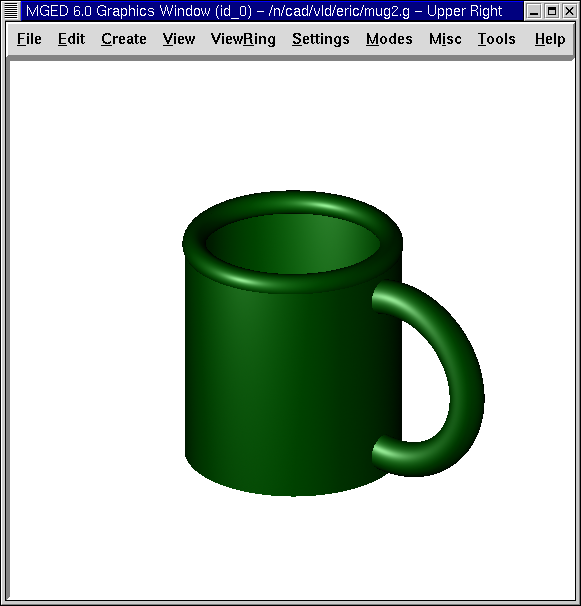

= Crear el modelo de una taza utilizando la interfaz de MGED
Lee A Butler; Eric W Edwards; Betty J Schueler; Robert G Parker; John R Anderson
:doctype: article
:toc:
:toclevels: 3

En este tutorial usted aprenderá a:

* Crear la figura de una taza desde el GUI.
* Usar nuevas figuras para crear el asa y el reborde suave de la taza.
* Combinar las figuras.
* Crear una región de las combinaciones.
* Controlar el árbol de datos y hacer correcciones.
* Asignar propiedades de los materiales usando el editor de combinaciones (Combination Editor).

En los anteriores dos tutoriales, usted creó una taza mediante es uso de comandos desde el prompt de la ventana de comandos. Ahora usted creará la misma figura desde el GUI.

Comience por abrir una nueva base de datos. Llámela mug2.g.

[[mug_gui_create_body]]
== Crear el cuerpo de la taza

Diríjase al menú Create (Crear) y seleccione rcc (right circular cylinder = cilindro circular recto) bajo la categoría Cones and Cylinders (Conos y cilindros). Ingrese el nombre del rcc. Llámelo outside.s.

Vaya al menú Edit (Edición), donde encontrará las siguientes opciones:

[cols="4*"]
[%noheader]
|===
|`Set H Set H (Move V) Set A Set B Set c Set d Set A,B Set C,D Set A,B,C,D Rotate H Rotate AxB Move End H(rt) Move End H`
|`Rotate Translate Scale None of the Above`
|`Reject Accept Apply Reset`
|`Primitive Editor Combination Editor`
|===

Nota: La primera columna incluye funciones específicas de figuras. Las otras columnas son opciones comunes a cualquier figura.

Seleccione Set H. Desde una vista frontal, mueva el cursor del ratón a la mitad inferior de la pantalla y haga clic en el botón central del ratón para reducir la escala de la altura del cilindro. A continuación, seleccione el conjunto A, B, C, D. Mueva el cursor del ratón a la mitad superior de la pantalla y haga clic en el botón central del ratón para aumentar el diámetro del cilindro. Aceptar los cambios cuando el objeto aparece similar al que se muestra en la siguiente figura.

Nota: Si en algún momento en que edite a través de la GUI no está satisfecho con los cambios, puede rechazar los cambios o restablecerlos desde las opciones del cuadro de diálogo para devolver las variables a su valor original. Sin embargo, si las rechaza, tendrá que volver a entrar en el estado primitivo de edición descrito anteriormente.

A continuación, cree una figura en el interior del cilindro circular recto con nombre inside.s. Edite el cilindro de la misma manera que editó el cilindro exterior. Antes de que usted acepte los cambios, cambie la opción View (Vista) a Up (arriba) y asegúrese de que los cilindros estén alineados. Si los cilindros están fuera de alineación, utilice la tecla SHIFT y el botón izquierdo del ratón para arrastrar el cilindro interior en su posición. Devuelva su vista al frente y acepte los cambios cuando los cilindros estén alineados. Su cilindros deben asemejarse a los del ejemplo siguiente:

Nota: Recuerde que cuando se cambia la escala de una forma, la posición del puntero del ratón en la ventana de gráficos determinará qué tan grande o pequeño será el cambio. Cuanto más se acerque el puntero del ratón al centro de la línea horizontal de la ventana, menor será el cambio, y viceversa.

[[mug_gui_create_handle]]
== Crear el asa de la taza

Anteriormente, hemos hecho el asa de la taza con un toro elíptico. En este tutorial, haremos la manija seleccionando un toro (que es una figura con forma de rosquilla) en el menú de formas. Nómbrelo handle.s. El menú Edición ahora ofrecerá un conjunto diferente de parámetros detallados en la siguiente lista:

[cols="4*"]
[%noheader]
|===
|`Set Radius 1 Set Radius 2`
|`Rotate Translate Scale None of the Above`
|`Reject Accept Apply Reset`
|`Primitive Editor Combination Editor`
|===

En este caso, Set Radio 1 cambia la distancia desde el centro del orificio del toro a la mitad del cuerpo del mismo. Set Radio 2 cambia el radio del toro, el cual define su grosor. Con la misma técnica utilizada en la edición de las formas rcc, modificar el tamaño del toro hasta que se vea similar los siguientes ejemplos:

[cols="2*"]
[%noheader]
|===
|image:../../lessons/es/images/mged12_mug_handle_frontview.png[]
|image:../../lessons/es/images/mged12_mug_handle_topview.png[]
|Taza y asa desde una vista frontal
|Taza y asa desde una vista superior
|===

Visualice su taza desde arriba para asegurarse de que esté alineada. Acepte los cambios cuando esté terminada.

[[mug_gui_create_rim]]
== Creando el borde de la boca de la taza

Para hacer el borde de la taza, seleccione del menú Create (Crear), la opción tor (toro) y cree un toro con el nombre rim.s. Seleccione el comando Rotate (Rotación) y tipee en la línea de comandos: *p 0 90 0[Enter]* para girar el toro sobre sí mismo (90'0 en torno al eje y). Luego, escale y edite los distintos parámetros del toro con las vistas frontal y superior hasta que la taza se vea similar a la del ejemplo siguiente. Asegúrese de aceptar sus cambios cuando haya terminado.

image::../../lessons/es/images/mged12_mug_rim_frontview.png[]

[[mug_gui_create_combinations]]
== Crear combinaciones de varias figuras

Para combinar las distintas figuras de su taza, tipee los siguientes comandos en el prompt de la ventana de comandos: *comb mug.c u outside.s - inside.s[Enter]* *comb handle.c u handle.s - outside.s[Enter]* *comb mug.c u rim.s[Enter]* Nota: Regrese a los dos tutoriales anteriores a éste para recordar cómo trabaja cada uno de estos comandos.

[[mug_gui_make_region]]
== Crear una region con las combinaciones

Para crear una región partiendo de las combinaciones que acaba de crear, tipee en la línea de comandos: *r mug.r u mug.c u handle.c[Enter]*

[[mug_gui_check_tree]]
== Controlando el árbol de datos (Data Tree)

Antes de continuar, sería recomendable controlar el árbol de datos. Asegúrese de que está de acuerdo con el siguiente árbol:

....

   mug.r/R

   u mug.c/

   u outside.s

   - inside.s

   u rim.s

   u handle.c/

   u handle.s

   - outside.s
	
....

Si su árbol de datos no se parece a este ejemplo, tendrá que volver y averiguar dónde ha ido mal. De ser necesario, puede eliminar una forma, una combinación, o una región escribiendo en el prompt de la ventana de comandos: *kill [name of shape, combination, or region][Enter]*

Por ejemplo, en este tutorial usted ha creado una figura extra llamada rim2.s, que ya no utilizará. Para eiminar esta figura deberá tipear: *kill rim2.s[Enter]*

[[mug_gui_comb_edit_props]]
== Asignar propiedades de los materiales utilizando el Combination Editor (Editor de combinaciones)

Vaya al menú Edit (Edición) y seleccione la combinación Editor (Editor). Escriba mug.r en la caja de entrada de Nombre. Pulse ENTER. Tipee 0 148 0 en el cuadro de entrada de color. Seleccione un sombreado de plástico. Marque la casilla Boolean Expression (Expresión booleana) para asegurarse de que diga:

....

   u mug.c

   u handle.c
	
....

Cuando esté terminado cliquee en Apply (Aplicar) y luego en Dismiss (Despedir). En la venana de comandos tipee en el prompt: *B mug.r[Enter]*

[[mug_gui_raytracing]]
== Haciendo el trazado de rayos (Raytracing) del diseño

Ir a la opción View (Vista) de la barra de menús y seleccione az35, el25. Ir a File (Archivo) y luego a Raytrace. Seleccione un color de fondo blanco y genere el trazado de su diseño. Haga clic en Overlay (Superposición). Cuando el trazado de rayos se termina, debe verse como el siguiente ejemplo:

[[mug_through_gui_review]]
== Repasemos...

En este tutorial usted aprenderá a:

* Crear la figura de una taza desde el GUI.
* Usar nuevas figuras para crear el asa y el reborde suabe de la taza.
* Combinar las figuras.
* Crear una región con las combinaciones.
* Controlar el árbol de datos y hacer correcciones.
* Asignar propiedades de los materiales usando el editor de combinaciones (Combination Editor).

