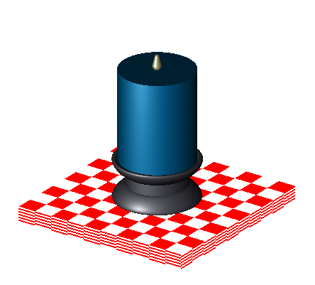
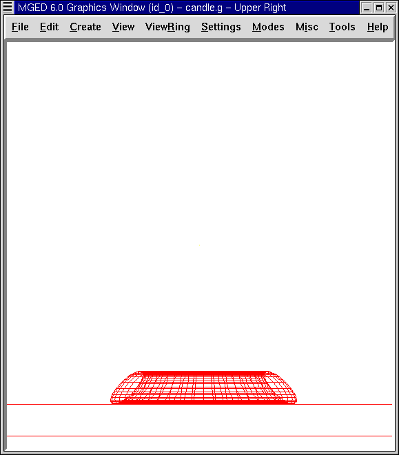
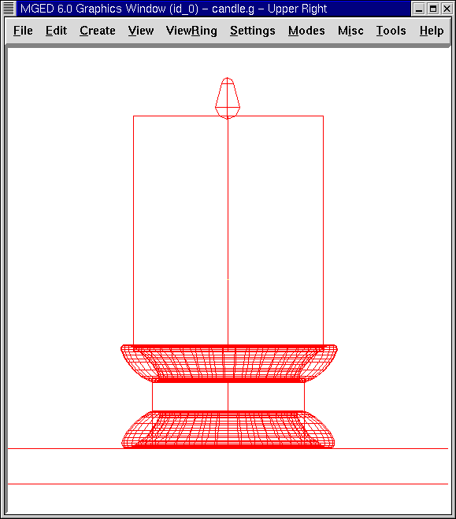

= Ubicar figuras en espacios 3-D
Lee A Butler; Eric W Edwards; Betty J Schueler; Robert G Parker; John R Anderson
:doctype: article
:toc:
:toclevels: 3

En este tutorial usted aprenderá a:

* Crear, editar y ubicar figuras en espacios 3-D.
* Crear customizaciones de color utilizando el editor de combinaciones (Combination Editor).
* Identificar los atributos del corrector de sombras.
* Comprender cómo se crean los colores RGB.

En los tutoriales anteriores ha creado y editado formas. También ha colocado objetos en el espacio tridimensional. En este tutorial se ofrece una práctica más avanzada en la creación y edición de formas y su colocación en el espacio 3-D.

El diseño que usted hará en este tutorial es una simple vela en un candelabro apoyado sobre una mesa (como se muestra en la figura siguiente). En los próximos tutoriales, agregará decoración e iluminación para hacer el diseño más realista.

Comience creando una nueva base de datos llamada candle.g. Titule su base de datos Candle Tutorial.

[[candle_create_tabletop]]
== Crear una mesa

Cree un arb8 desde el GUI. Nombre a la figura arb8.s. En el menú View (Vista) seleccione la opción Front (Frente).

Diríjase a la opción Editar de la barra de menús. El arb8 necesita ser más grande, para lo que deberá ir al menú Edit (Edición), y seleccionar Scale (Escala). Para hacer más grande arb8 coloque el puntero del mouse en la parte media superior de la pantalla y haga clic en el botón del medio hasta que los lados del arb8 toquen cada lado de la pantalla. Utilice la tecla SHIFT y el botón izquierdo del mouse para arrastrar el arb a su posición, de ser necesario.

En el menú Edit (Edición), seleccione Move Faces (Mover caras) y luego Move face 4378 (Mover Cara 4378). Coloque el puntero del mouse en la mitad inferior de la pantalla y haga clic con el botón del medio hasta que el arb8 sea aproximadamente del grosor de una mesa. Volver a Edit (Edición) para aceptar los cambios, y luego usar el SHIFT y cualquier botón del mouse para posicionar la mesa hasta que se vea similar a la siguiente imagen:

image::../../lessons/es/images/mged13_candle_tabletop_wireframe_front.png[]

Hacer una región de la mesa mediante la ventana de comandos *r table1.r u arb8.s[Enter]*

[[candle_create_base]]
== Crear la base del candelabro

Cree un eto y nómbrelo eto1.s. Para crear la parte superior de la base del candelabro, necesitará rotar el eto 180'0. Tipee en la ventana de comandos: *rot 0 180 0[Enter]* Esto le dice a _MGED_ que gire la forma 180'0 a lo largo del eje y. A continuación, seleccione Scale (Escala) y reduzca un poco el tamaño predeterminado de su eto. Coloque el eto sobre la mesa con el botón izquierdo del ratón y la tecla SHIFT.

Vea su diseño desde diferentes ángulos para asegurarse de que el eto se sitúa en el centro de la mesa. Haga clic en Aceptar cuando esté satisfecho con su tamaño y posición. Su base debe ser similar a la que se muestra en la siguiente imagen:

A continuación, cree la base del candelabro con un cilindro circular recto (rcc). Nombre a la figura rcc1.s.

En el menú Edit (Edición). Además de los comandos estándar, se le presentará un menú de trece formas específicas de edición de esta forma.

[cols="2*"]
[%noheader]
|===
|`Set H Set H (Move V) Set A Set B Set c Set d`
|`Set A,B Set C,D Set A,B,C,D Rotate H Rotate AxB Move End H(rt) Move End H`
|===

Escale la forma hasta que sea ligeramente más grande en diámetro que la parte superior de la eto1.s (se puede comprobar esto cambiando a una vista superior). Vuelva a Edit (Edición) y seleccione Set H. Reduzca la altura de la forma hasta que el ccr sea cerca de dos veces más alto que la eto1.s. Coloque el cilindro en la base del soporte del candelabro. Compruebe la colocación del rcc desde la parte superior, izquierda y frontal para asegurarse de que está centrado en el eto. Asegúrese de que la parte superior del rcc no toque totalmente la mesa. Acepte los cambios. Cuando esté terminado, su diseño debe tener el siguiente aspecto:

image::../../lessons/es/images/mged13_candle_tabletop_eto1_rcc_wireframe_front.png[]

Para finalizar la base de la vela cree otro eto y nómbrelo eto2.s. Edite esta forma como lo hizo con el eto anterior y colóquelo sobre el rcc, como se muestra en la siguiente imagen. Acepte los cambios cuando haya terminado. Su candelabro ya debería tener este aspecto:

image::../../lessons/es/images/mged13_candle_tabletop_base_front.png[]

Cree una región con las tres figuras de la base. Nómbrela base1.r. La expresión booleana debería ser: *r base1.r u eto1.s u rcc1.s u eto2.s* Note que podría haber sido escrita también de la siguiente forma: *r base1.r u eto1.s u eto2.s u rcc1.s* pero la primera expresión es preferible ya que es más coherente con el orden del ejemplo siguiente. En un momento querremos quitar parte de eto2.s. Si colocamos a eto2.s al final de la lista, podemos realizar esta eliminación sencillamente.

[[candle_create_candle]]
== Crear la vela

Cree un rcc y nómbrelo rcc2.s. Modifique la forma como lo hizo con el anterior rcc. Cuando haya terminado, debería verse similar a la siguiente ilustración. (Nota: Después de haber aceptado los cambios, usted puede llevar tanto la mesa como vela a la ventana gráfica, utilizando la tecla SHIFT y el botón izquierdo del mouse para mover la vista del diseño.)

image::../../lessons/es/images/mged13_candle_tabletop_base_candle_front.png[]

Cree una región del candelabro. La expresión booleana debería ser: *r candle1.r u rcc2.s* Ahora haremos un corte cilíndrico en la base del candelabro. Para esto utilice el cilindro del candelabro de la siguiente manera: *r base1.r - rcc2.s* Anteriormente habíamos dicho que íbamos a necesitar remover un poco de material del eto2.s. Ahora ya lo hemos hecho.

[[candle_create_flame]]
== Crear la llama de la vela

Cree una partícula (part) y nómbrela part1.s. Edite y posicione la figura hasta que su diseño se vea como el siguiente:

Haga de la llama una región tipeando en el prompt de la ventana de comandos: *r flame1.r u part1.s[Enter]*

[[candle_create_combination]]
== Hacer una combinación del candelabro, la vela y la llama

Para hacer una combinación con las partes del candelabro, tipee en el prompt de la ventana de comandos: *comb candle1.c u base1.r u candle1.r u flame1.r[Enter]*

[[candle_check_data_tree]]
== Controlar el árbol de datos

Ahora que usted ha hecho una serie de regiones y una combinación, sería un buen momento para revisar su árbol de datos y asegurarse de que está de acuerdo con el siguiente árbol. Si detecta algún error en cualquiera de las partes del árbol, puede solucionarlo desde la caja Boolean Expression (Expression booleana) del editor de combinaciones (ver tutorial 5). En la línea de comandos tipee: *tree candle1.c[Enter]* Su expresión booleana debería ser:

....

   candle1.c/

   u base1.r/R

   u eto1.s

   u rcc1.s

   u eto2.s

   - rcc2.s

   u candle1.r/R

   u rcc2.s

   u flame1.r/R

   u part1.s
	
....

[[candle_assign_mater_prop]]
== Asignar propiedades de los materiales a los elementos del diseño

Para asignar las propiedades del material a su diseño, vaya al menú Edit (Edición) y seleccione Combination Editor (Editor de Combinaciones). Asignar las siguientes propiedades de material a cada uno de los elementos:

[cols="4*"]
|===
|Element
|Shader
|Color(s)
|Other

|Tabletop
|Checker
|Red (255 0 0); White (255 255 255)
|Scale (10)
|Candle Base
|Plastic
|Medium Gray (128 130 144)
|
|Candle
|Plastic
|Light Blue (0 166 255)
|
|Flame
|Plastic
|Light Yellow (255 255 190)
|
|===

Observe que el corrector de sombreado de la mesa incluye dos valores de color y un valor de escala. Tipee los valores de rojo, blanco y de escala en las cajas de texto, de la siguiente manera:

image::../../lessons/es/images/mged13_candle_comb_ed_checker.png[]

Para el resto de los elementos del diseño, utilice el Color Tool (Herramienta de color) para hacer visibles los colores o simplemente escriba en el cuadro de texto de Color, recordando dejar un espacio entre cada conjunto de números.

Nota: Como se ha dicho, un color se compone de tres números, que van de 0 a 255. El primer número representa la cantidad de rojo, el segundo la cantidad de verde, y el tercero la cantidad de azul utilizado para hacer el color. El color 0 0 0 es el negro, y el 255 255 255 es el blanco. Este método de crear los colores es diferente de los colores utilizados en la mezcla de pigmentos de pintura, ya que en esos casos se tratabaja con la luz. Si bien puede parecer extraño al principio, la mayoría de los usuarios de las aplicaciones de _MGED_ usuarios se convierten rápidamente en expertos en la creación de colores RGB.

[[candle_raytrace]]
== Hacer el trazado de rayos de su diseño (Raytrace)

Antes de hacer el Raytrace, cambie la vista a az35, el25 para tener una visión mejor del diseño terminado y luego quite el diseño anterior con el comando Blast tipeando lo siguiente en el prompt de la ventana de comandos: *B table1.r candle1.c[Enter]* Este comando le dice al programa _MGED_ que:

[cols="3*"]
[%noheader]
|===
|B
|table1.r
|candle1.c
|Despeje la ventana gráfica
|Dibuje la región llamada table1.r
|Dibuje la combinación llamada candle1.c
|===

Para proporcionar más luz a su diseño, use un fondo de color blanco. La imagen de su vela debería ser similar a la siguiente:

image::../../lessons/es/images/mged13_candle_raytraced_overlay.png[]

[[placing_shapes_in_3d_review]]
== Repasemos...

En este tutorial usted aprendió a:

* Crear, editar y ubicar figuras en espacios 3-D.
* Crear customizaciones de color utilizando el editor de combinaciones (Combination Editor).
* Identificar los atributos del corrector de sombras.
* Comprender cómo se crean los colores RGB.

