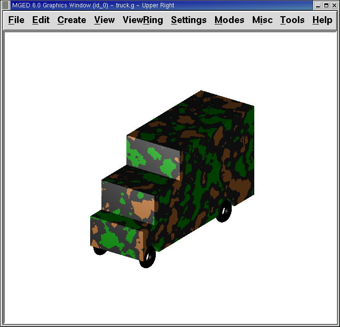

= Crear un camión de juguete
Lee A Butler; Eric W Edwards; Betty J Schueler; Robert G Parker; John R Anderson
:doctype: article
:toc:
:toclevels: 3

En este tutorial usted aprenderá a:

* Crear un camión de juguete a partir de tres figuras.
* Hacer copias de figuras utilizando el editor de primitivos.
* Hacer combinaciones y regiones de objetos más complejos.
* Controlar el árbol de datos y corregir de ser necesario.
* Listar los contenidos de la base de datos.
* Asignar propiedades de los materiales utilizando el Combination Editor.
* Comprender las diferencias entre OK, Accept, Apply, Reset, Cancel, y Dismiss. (OK, Aceptar, Aplicar, Restablecer, Cancelar y Salir)
* Identificar las opciones de ayuda en pantalla.
* Comprender la opción de Stacker (Apilador).
* Probar los atributos de sombreado de camuflaje (camo shader).

En los tutoriales anteriores, ha creado y editado figuras para producir objetos simples. Este tutorial se centra en la creación de un objeto algo más complejo, un camión de juguete, utilizando la ventana de comandos. Su camión terminado deberá ser similar al siguiente:

image::../../lessons/es/images/mged15_truck_design.pNG[]

Comience creando una nueva base de datos llamada truck.g.

[[truck_cab_in_cmd]]
== Crear una rpp para la cabina del camión utilizando el comando in

Para hacer la cabina del camión, cree un prisma recto paralelo (en inglés: right parallel piped > rpp) utilizando el comando in (de insert > insertar). En el prompt de la ventana de comandos tipee: *in cab1.s rpp[Enter]* _MGED_ le preguntará los valores de XMIN, XMAX, YMIN, YMAX, ZMIN, y ZMAX. Tipee entonces: *0 1 0 1 0 1[Enter]* Esto le dirá a _MGED_ que:

[cols="6*"]
[%noheader]
|===
|0
|1
|0
|1
|0
|1
|Dé el valor 0 al XMIN del rpp
|Dé el valor 1 al XMAX del rpp
|Dé el valor 0 al YMIN del rpp
|Dé el valor 1 al YMAX del rpp
|Dé el valor 0 al ZMIN del rpp
|Dé el valor 1 al ZMAX del rpp
|===

Puede también utilizar el comando con formato de una sola línea: *in cab1.s rpp 0 1 0 1 0 1[Enter]* Una figura cúbica debería aparecer en la ventana gráfica, como muestra la siguiente imagen:

image::../../lessons/es/images/mged15_truck_cab1s.pNG[]

[[truck_hood_in_cmd]]
== Utilizar el comando inside para crear un rpp como frente de la cabina

Para hacer el capó del coche, deberá crear otra forma rpp utilizando el comando inside. Este comando fue creado originalmente para ahuecar objetos como tanques de gasolina y cajas, sin embargo, puede ser utilizado para crear cualquier nueva forma que tiene alguna relación con otra forma pre-existente. En este tutorial, se utilizará para cortar materiales por encima del capó y delante de la cabina.

Si está utilizando la versión 6.0 de _BRL-CAD_ o una posterior, en la línea de comandos tipee: *inside cab1.s caboff1.s .5 -.1 .7 -.1 -.1 -.1[Enter]* Este comando le dice a _MGED_ que:

[cols="9*"]
[%noheader]
|===
|inside
|cab1.s
|caboff1.s
|.5
|-.1
|7
|-.1
|-.1
|-.1
|Dentro de la figura...
|llamada cab1.s...
|cree un rpp llamado caboff1.s
|Hacer la cara 1234 (inferior) de .5 unidades de espesor
|Hacer la cara 5678 (superior) de -.1 unidades de espesor
|Hacer la cara 1485 (trasera) de .7 unidades de espesor
|Hacer la cara 2376 (frontal) de -.1 unidades de espesor
|Hacer la cara 1265 (derecha) de -.1 unidades de espesor
|Hacer la cara 3478 (isquierda) de -.1 unidades de espesor
|===

En este ejemplo, cada espesor con valor negativo indica que caboff1.s va a sobresalir de la cara que corresponde a cab1.s.

Nota: Tenga en cuenta que en las versiones de _BRL-CAD_ 6.0 en adelante las caras de un rpp son numeradas en un orden diferente que en versiones anteriores. Así que, si va a usar una versión anterior a 6.0, el siguiente orden es el que regirá en el comando inside: *inside caboff1.s cab1.s un 0,7 -. -. -. 1 1 .5 -. 1 [Enter]* (El orden de las caras en este caso es frontal, posterior, derecha, izquierda, inferior y superior)

Cuando está en modo Multipane, el diseño debería verse como la siguiente ilustración:

image::../../lessons/es/images/mged15_truck_cab_cutoff.pNG[]

[[truck_cab_wheel_well]]
== Utilizar un rcc para crear la cavidad de la rueda en la cabina

Crear un cilindro (rcc) a utilizar para cortar un espacio para la primera rueda de la cabina. En la ventana de comandos del sistema, escriba: *make well1.s rcc [Enter]* En el menú Edit (Edición), diríjase a Primitive Selection (Selección de primitivos) y luego seleccione well1.s. Aplique la vista izquierda, vuelva a Edit (Editar) y seleccione Scale (Escala). Reduzca el tamaño del rcc, hasta que su diámetro sea el indicado para la rueda. Regrese a Edit (Edición) y seleccione Rotate (Rotación). Como se ha dicho, un método sencillo para rotar el CCR es mediante el uso de la tecla CTRL y el botón izquierdo del mouse. Sin embargo, como sabemos que queremos voltear el objeto exactamente 90'0 a lo largo del eje x, una mejor opción es usar la línea de comandos. Tipee entonces: *p 90 0 0 [Enter]* Después de esto, todavía puede tener que utilizar Set H (Ajuste h - de altura) además de las opciones de escala para redimensionar y la tecla SHIFT + botón izquierdo del mouse para posicionar su rueda. Cuando haya finalizado, seleccione Aceptar. Su diseño debe ser similar al siguiente en el modo Multipane:

image::../../lessons/es/images/mged15_truck_multipane_1stwheel.pNG[]

[[ok_accept_apply_reset_cancel_dismiss]]
== Comprender las diferencias entre OK, Accept, Apply, Reset, Cancel, y Dismiss. (OK, Aceptar, Aplicar, Restablecer, Cancelar y Salir)

El entorno gráfico de _MGED_ ofrece a los usuarios varias opciones: aplicar, aceptar o rechazar los cambios realizados a través de botones en la parte inferior de la ventanas de diálogo emergentes. Para usar cualquiera de estas opciones, basta con colocar el cursor sobre el botón deseado y cliquear con el botón izquierdo del ratón.

Al seleccionar el botón OK o Accept (Aceptar) le dirá a _MGED_ que registre los cambios que ha hecho a una forma, una región o una combinación. _MGED_ utiliza los botones OK y Accept (Aceptar) indistintamente. Al cliquear en cualquiera de estas dos opciones la ventana que está utilizando se cerrará automáticamente.

El botón Apply (Aplicar) le dice a _MGED_ que registre los cambios que ha hecho y luego espere más instrucciones. La ventana no se cierra automáticamente. Esta opción le permite realizar cambios en varios ítems sin tener que reabrir la ventana para cada cambio.

El botón Reset (Restablecer) le dice a _MGED_ que regrese los valores que han sido modificados, a aquellos valores existentes previamente a la apertura de la ventana de diálogo. El botón Reset no cerrará el cuadro de diálogo. Los botones Cancel (Cancelar) o Dismiss (Salir) hace que no se tome en cuenta ningun cambio realizado en el cuadro de diálogo, dejando activos los últimos valores aceptados. Estos dos botones cierran el cuadro de diálogo al ser seleccionados.

[[truck_wheel_well_prim_edit_cpy]]
== Uso del Primitive Editor (Editor de primitivos) para hacer una copia de la cavidad de la rueda

Para realizar una copia de la cavidad de la rueda, vaya al menú Edit (Edición) y seleccione Primitive Editor (Editor de primitivos), que contendrá la información de la última forma editada (o dirá myPrimitive si nada ha sido editado). Borre el nombre de la figura anterior en el cuadro de entrada Nombre. Escriba well1.s y oprima Reset (Restablecer) (o pulse Enter mientras el cursor se encuentra todavía en el cuadro de entrada Nombre). Los valores de los parámetros de la forma antigua se sustituirán por las de la nueva forma. El editor va a cambiar y se verá similar al siguiente ejemplo:

image::../../lessons/es/images/mged15_prim_ed_wheel_well.pNG[]

Vuelva al cuadro de texto Nombre y cambie el 1 por un 2 y haga clic en OK. Cambie la vista al frente en el menú View (Vista). Diríjase a Edit/Primitive Selection (Edición/Selección de primitivos) y cliquee en well2.s. Utilice el SHIFT y botón izquierdo del mouse para arrastrar la nueva cavidad de la rueda a su posición, como se muestra en la ilustración siguiente. Verifique su alineación en el modo Multipane y presione Accept (Aceptar) cuando haya terminado.

image::../../lessons/es/images/mged15_truck_2nd_wheel_wheel_place.pNG[]

[[truck_cab_shape_comb]]
== Hacer una combinación con las figuras de la cabina

Ahora es el momento de hacer una combinación de las ditintas figuras de la cabina. *comb cab1.c u cab1.s - caboff1.s - well1.s - well2.s[Enter]* Este comando le dice a _MGED_ que:

[cols="10*"]
[%noheader]
|===
|comb
|cab1.c
|u
|cab1.s
|-
|caboff1.s
|-
|well1.s
|-
|well2.s
|Cree una cobinación
|La nombre cab1.c
|Haga una unión
|de la figura cab1.s
|menos...
|la figura caboff1.s
|menos...
|la figura well1.s
|menos...
|la figura well2.s
|===

Antes de continuar, debería chequear su árbol de datos tipeando: tree cab1.c. El árbol debería ser:

....

   cab1.c/

   u cab1.s

   - caboff1.s

   - well1.s

   - well2.s
	
....

Si escribe ls (lista) en la ventana de comandos del sistema, encontrará que su base de datos se compone de la combinación cab1.c y las formas cab1.s, caboff1.s, well1.s y well2.s. A medida que cree objetos más complejos se acostumbrará a referirse a la lista de la base de datos para asegurarse de que esté compuesta por lo elementos que usted desea.

[[truck_body_in_cmd]]
== Crear un rpp para el cuerpo del camión utilizando el comando in

Para hacer el cuerpo del camión, tipee en el prompt de la línea de comandos: *in body1.s rpp 0 2 0 1 0 1.5[Enter]* A esta altura ya debería saber qué es lo que este comando le dice a _MGED_ que haga. Si lo ha olvidado, regrese al ejemplo de cuando creó la cabina del camión.

Edite el cuerpo de la camioneta para que su cara frontal se superponga ligeramente con la cara posterior de la cabina. Compruebe desde diferentes puntos de vista que el cuerpo esté correctamente alineado con la cabina. Acepte los cambios cuando haya terminado y, a continuación utilice el comando blast para dibujar su diseño. Su camión ahora debería tener el siguiente aspecto:

image::../../lessons/es/images/mged15_truck_cab_body.pNG[]

[[prim_ed_wheel_wells]]
== Utilizar el Primitive Editor para hacer las otras dos cavidades para las ruedas

Para hacer los dos huecos de las ruedas traseras en el cuerpo de la camioneta, repita los pasos utilizados en la creación de la segunda cavidad. Nombre a las nuevas figuras well3.s y well4.s. Utilice múltiples puntos de vista, y mueva las nuevas formas en la posición indicada hasta que su camión tenga una apariencia similar al siguiente:

image::../../lessons/es/images/mged15_truck_wheel_wells_wireframe.pNG[]

[[truck_body_wheel_wells_comb]]
== Hacer una combinación con el cuerpo del camión y las cavidades

Cree una combinación con el cuerpo y ambas cavidades, nómbrela body1.c. El árbol de body1.c debería decir:

....

   body1.c/

   u body1.s

   - well3.s

   - well4.s
	
....

[[truck_cab_body_region]]
== Hacer una región con la cabina y el cuerpo del camión

Antes de agregarle las ruedas al camión, debe crear una región con la cabina y el cuerpo. En el prompt de la línea de comandos tipee: *r truck1.r u cab1.c u body1.c[Enter]*

[[truck_wheels]]
== Crear ruedas para el camión

Tal vez la mejor forma para la fabricación de ruedas es el toro. Puede crear esta forma a través de la ventana de comandos para darles un tamaño y una ubicación precisos a su diseño sin su posterior edición. Sin embargo, este tutorial está pensado para darle práctica sobre la rotación y traslación de las formas.

Cree la primera rueda tipeando en el prompt de la línea de comandos: *in wheel1.s tor 0 0 0 .5774 .5774 .5774 .18 .08[Enter]* Este comando le dice a _MGED_ que:

[cols="7*"]
[%noheader]
|===
|in
|wheel1.s
|tor
|0 0 0
|.5774 .5774 .5774
|.18
|.08
|Cree una figura
|Nómbrela wheel1.s
|Que la figura sea un toro
|Asigne los valores 0 0 0 para el vértice
|Asigne los valores .5774 .5774 .5774 a x, y, y z del vector normal
|Asigne el valor .18 al radio externo
|Asigne el valor .08 al radio 2 (el espesor del neumático)
|===

Cambie a la vista izquierda y luego edite la posición de la rueda. Para una correcta alineación de la rueda con el camión, deberá girar el neumático con la tecla CTRL y cualquier botón del ratón. Escale y traslade la rueda a su posición y verifique la alineación desde varios puntos de vista distintos. Acepte los cambios cuando haya terminado.

Utilice el Primitive Editor (Editor de Primitivos) de la misma forma con el resto de las ruedas. Mueva cada una de las ruedas a su posición hasta que su camioneta sea similar a la siguiente:

image::../../lessons/es/images/mged15_truck_wheels.pNG[]

[[truck_wheels_region]]
== Hacer una región con las ruedas

Cree una región con las ruedas. Cuando haya terminado, chequee su árbol de datos de wheel1.r. Deberá decir:

....

   wheel1.r/R

   u wheel1.s

   u wheel2.s

   u wheel3.s

   u wheel4.s
	
....

[[truck_regions_mater_props]]
== Asignar propiedades de los materiales a las regiones del camión

Su camión se compone de dos regiones: truck1.r y wheel1.r. Utilice el Combinación Editor y seleccione truck1.r.

En el Combination Editor (Editor de combinaciones), el sombreado de camuflaje (camo shader) crea un patrón tricolor pseudo-aleatorio de camuflaje en el objeto utilizando un patrón de ruido fractal. El sombreado ofrece gran cantidad de atributos entre los que elegir. Por ahora, seleccione un color de fondo de negro (0 0 0) y complete el Color #1 con verde (0 134 0), y el Color #2 con marrón pardo (164 96 38). Para hacer el patrón proporcional al diseño de la camioneta, seleccione un tamaño de .25 de ruido y, a continuación acepte las selecciones. La ventana del editor de sombreado debería tener este aspecto:

image::../../lessons/es/images/mged15_cameo_shader.pNG[]

Aplique sombreado de plástico y color negro a las ruedas (wheel1.r) y cliquee OK. Luego genere el Raytrace de su diseño.

[[on_screen_help]]
== Utilizar las opciones de ayuda disponibles en pantalla

Probablemente habrá notado que muchos de los menús de aplicaciones de _MGED_ ofrecen una amplia variedad de opciones de donde escoger. Con tantas opciones disponibles, es fácil olvidar lo que una selección en particular hace. Para ayudar a los usuarios a acceder rápidamente a la información básica sobre las diferentes opciones de _MGED_ , el programa ofrece funciones de ayuda en pantalla sensible al contexto, es decir, cambia según sobre lo que se esté trabajando.

Se puede acceder a la ayuda en pantalla desde cualquier menú desplegable, colocando el cursor sobre el nombre de cualquier opción en el menú o en la ventana y haciendo clic en el botón derecho del mouse. En el único lugar en que esta función no se puede aplicar es en la parte de la ventana gráfica, donde se encuentra el diseño.

[[stacker_shading]]
== La opción de apilado de sombreados (Stacker Option)

En los tutoriales anteriores, se aplicó color y sombreado a un objeto para hacerlo ver más realista. Sin embargo, a veces tendrá que aplicar dos o tres sombreados a un objeto hasta obtener el resultado deseado.

_MGED_ ofrece tres categorías de sombreado: pintura, plástico, y luz. Cualquier combinación de estos tres tipos de sombreados se puede aplicar a un mismo objeto utilizanso la opción del menú Stacker Option (Apilado).

Hay tres sombreados de plástico: glass, mirror, y plastic (vidrio, espejo, y plástico). El sombreado de plástico se utiliza para dar una percepción del espacio. Para ello, toma la superficie del objeto y le da brillo para que pueda reflejar la luz. El sombreado plástico normalmente se aplica último en el proceso de apilación.

El sombreado de pintura se utiliza para aplicar pigmento y textura a la superficie de un objeto. El color es el pigmento y la textura es la calidad en tres dimensiones de la superficie del material (como la pintura de estuco).

Los sombreados de pigmento incluyen camo (camuflaje), textura (color), textura (negro/blanco), falsa estrella, nube, corrector, mapa de prueba y proyección. Los sombreados de textura incluyen bump map, fbm bump y tur bump. Los sombreados de pintura se aplican normalmente primeros en el proceso de apilado y se utilizan en combinación con el sombreado de plástico.

El sombreado de luz se utiliza para producir la iluminación en la escena. Esto ayuda a producir el realismo necesario en la imagen final. El sombreado de luz es técnicamente complejo y no se analiza en este tutorial.

El sombreado de camuflaje consiste en aplicar pigmentos, con un patrón aleatorio, a la superficie de un objeto. El sombreado de camuflaje no indica la naturaleza tridimensional de un objeto. Si desea que su diseño muestre profundidad, necesitará apilar el sombreado de camuflaje y el de plástico.

[[using_stacker_shading]]
== El uso del Stacker Option (Apilado de sombreados)

Para utilizar la opción Stacker, abra el editor de combinaciones y seleccione truck1.r. Cliquee en el botón a la derecha del cuadro de entrada Shader y seleccione Stack en el menú desplegable. Un botón con las palabras Add Shader (Agregar sombreado) aparecerá en el cuadro de texto. Cliquee ese botón y luego seleccione camouflage (camuflaje). Ajuste el color de fondo a negro (0 0 0), Color #1 a verde (0 134 0), y Color #2 a la marrón pardo (164 96 38). En Noise Size (Tamaño de ruido) complete con .25. Cliquee en Add Shader (Añadir sombreado) una vez más y seleccione Plastic (plástico).

En este punto, la ventana del editor de combinaciones puede haberse movido hacia la parte baja de la pantalla. Si esto sucede, reduzca el tamaño de la ventana lo más que pueda y luego arrástrela hasta la parte superior. Deberán aparecer unos botones en parte inferior del cuadro para que pueda aplicar sus selecciones.

[CAUTION]
====
Al utilizar la opción de apilación, necesita hacer un seguimiento del número de caracteres y espacios en el cuadro de texto sombreado. Las versiones de _MGED_ anteriores a la 6.0 sólo reconocen 64 caracteres (incluídos los espacios), por lo que debe tener cuidado con los sombreados demasiado complejos.

====

[[truck_combine_regions]]
== Hacer una combinación con las regiones del camión

Para hacer una combinación con las dos regiones del camión, tipee en el prompt de la línea de comandos: *comb truck1.c u truck1.r u wheel1.r[Enter]* *B truck1.c[Enter]* Su árbol de datos de truck1.c debería decir:

....

   truck1.c/

   u truck1.r/R

   u cab1.c/

   u cab1.s

   - caboff1.s

   - well1.s

   - well2.s

   u body1.c

   u body1.s

   - well3.s

   - well4.s

   u wheel1.r/R

   u wheel1.s

   u wheel2.s

   u wheel3.s

   u wheel4.s
	
....

[[truck_raytracing]]
== Generar el Raytrace del camión

El último paso en la creación de su camión es generar el Raytrace de su diseño. Cuando el trazador de rayos haya terminado, observe que la parte superior de uno de los laterales del camión queda muy oscuro. Esto es porque hay muy poca luz sobre ese lado. Al no haber especificado ninguna fuente de luz para la escena, _MGED_ le proporciona un conjunto de luces de forma predeterminada. Estos valores consisten en una luz tenue proveniente de la ubicación del espectador y un brillo situado a la izquierda y por debajo del mismo. Puesto que la luz principal no es realmente brillante, un lado de la camioneta queda oscuro.

Hay un ajuste especial que puede hacer para mejorar el brillo general de la escena, ajustando la cantidad de luz ambiente, que es la luz que no viene de una fuente de luz en particular, sino que es una medida de luz presente en toda la escena. Para ajustar la cantidad de la luz ambiental, haga clic en el botón Advanced Settings (Configuración avanzada) en el panel de control de Raytrace. Junto a la otras opciones preexistentes, tipee -A .9. Ahora cuando genere el Raytrace, obtendrá una imagen mucho más iluminada.

[cols="2*"]
[%noheader]
|===
|image:../../lessons/es/images/mged15_truck_default_lighting.png[]
|
|Camión con iluminación predeterminada
|Camión con luz ambiente agregada
|===

[[creating_toy_truck_review]]
== Repasemos...

En este tutorial usted aprendió a:

* Crear un camión de juguete a partir de tres figuras.
* Hacer copias de figuras utilizando el editor de primitivos.
* Hacer combinaciones y regiones de objetos más complejos.
* Controlar el árbol de datos y corregir de ser necesario.
* Listar los contenidos de la base de datos.
* Asignar propiedades de los materiales utilizando el Combination Editor.
* Comprender las diferencias entre OK, Accept, Apply, Reset, Cancel, y Dismiss. (OK, Aceptar, Aplicar, Restablecer, Cancelar y Salir)
* Identificar las opciones de ayuda en pantalla.
* Comprender la opción de Stacker (Apilador).
* Probar los atributos de sombreado de camuflaje (camo shader).
