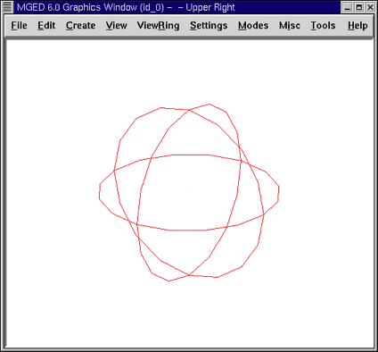
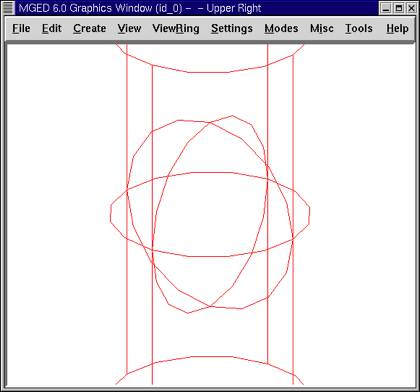
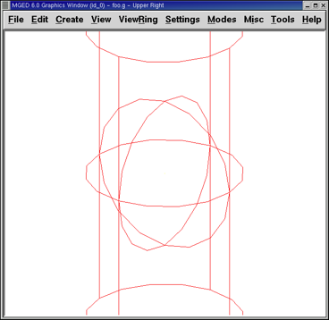

= Using the Insert Command in MGED to Size and Place Shapes
Lee A Butler; Eric W Edwards; Betty J Schueler; Robert G Parker; John R Anderson
:doctype: article
:toc:
:toclevels: 3

In this lesson, you will:

* Create a sphere and a right circular cylinder using the make command.
* Create the same two shapes using the in (insert) command.
* Combine arguments on the Command Line to streamline the entry of variables.
* Develop a combined-command form to help manage Command Line variables.
* Consider conventions for choosing names for your objects.
* View your shapes from different perspectives using options of the View menu.
* Quit the _MGED_ program.

This lesson focuses on creating shapes from the Command Window using the make and in commands. You will create a sphere (sph) and a right circular cylinder (rcc) using both commands so that you can see how each command works. Later in the lesson, you will practice viewing your model from different angles.

[[new_db_myShapes]]
== Creating a New Database from the Command Window

Create a new database and name it shapes.g. Title your database myShapes.

[[sphere_make]]
== Creating a Sphere Using the Make Command

Begin by making the Command Window active (usually by clicking anywhere in the window). Then, at the _MGED_ prompt, type in the command: *make sph1.s sph [Enter]*

As noted in Lesson 1, this command tells _MGED_ to:

[cols="3*"]
[%noheader]
|===
|make
|sph1.s
|sph
|Create a shape
|Name it sph1.s
|Make it a sphere
|===

A sphere shape has now been created, and a wireframe drawing should appear in your Graphics Window.

To make the rcc from the Command Window prompt, type: *make rcc1.s rcc[Enter]*

Your Graphics Window should now display a large rcc that, from the default view of az35, el25, looks as if it intersects the sphere you previously created.

Using the make command is a fast and easy way to create a shape; however, most models are going to require shapes that have specific parameters, such as height and radius. So, a more precise way to create these shapes is to use the in (insert) command.

[[using_in]]
== Using the In Command to Create Shapes

Begin by making the Command Window active (usually done by clicking anywhere in the window). Then, use the Z (zap) command to clear the Graphics Window. You are now ready to create a sphere using the in command. At the _MGED_ prompt type: *in sph2.s sph[Enter]*

_MGED_ will respond with: `Enter X, Y, Z of vertex:`

You must tell _MGED_ where to position the vertex (center) of your sphere in space. Type at the _MGED_ prompt: *4 4 4[Enter]*

[NOTE]
====
As you work in _MGED_, you will often be asked to enter a value for a vector or a vertex. In _MGED_, a vector represents the distance and direction from one point in space to another, and a vertex is one single point in space. The values entered for a vector are typically used to create an object with specific dimensions. The values entered for a vertex place the object in space.

====

Your sphere will now be placed at (x,y,z)=(4,4,4), as measured in millimeters. Notice that the numbers are separated by spaces followed by the ENTER key. _MGED_ will now ask you to:

....

      Enter radius:

      Type in:

      3[Enter]
      
....

The radius of your sphere will be 3 mm. The following is the dialog that should appear in your Command Window (including the appropriate responses). mged>in sph2.s sph `Enter X, Y, Z of vertex: 4 4 4` `Enter radius: 3` `51 vectors in 0.000543 sec` The last line of this dialog is simply a record of the computer's speed in drawing the shape. It has no real usefulness to the user at this point.

A sphere has now been created, and a wireframe drawing similar to the one created using the make command should appear in your Graphics Window.

To make the right circular cylinder, type at the Command Window prompt: *in rcc2.s rcc[Enter]* _MGED_ will ask you to enter values for x, y, and z of the vertex (where you want the center of one end of the rcc placed in space). Type: *4 4 0[Enter]* Be sure to leave spaces between each of these numbers.

_MGED_ will now ask you to enter the x, y, and z values of the height (H) vector (i.e., how long you want the rcc to be). Type: *0 0 4[Enter]* The last value you will need to enter is the radius of the rcc. Type: *3[Enter]* The dialog in the Command Window for the creation of the rcc should look like this:

....

      mged> in rcc2.s rcc

      Enter X, Y, Z of vertex: 4 4 0

      Enter X, Y, Z of height (H) vector: 0 0 4

      Enter radius: 3

      42 vectors in 0.000214 sec
      
....

You should now have new versions of the sphere and rcc shapes. Notice how these two shapes compare in size to the first two you created. The rcc is now in proportion to the sphere and is placed in space off to the left in your Graphics Window. By specifying the dimensions of the shapes and their locations in space, you were able to create the model more precisely.

[cols="2*"]
[%noheader]
|===
|
|image:../lessons/images/mged03_shapes_in_command.png[]
|Shapes Created with Make Command
|Shapes Created with In Command
|===

[[args_on_one_line]]
== Combining Arguments on One Line

Another way to use the in command is to combine all of the required information on one line. Once you become familiar with using the in command, you will probably prefer to use this method as it allows you to input all the parameter values more quickly.

Clear the Graphics Window by using the Z command. Now make another sphere by typing after the _MGED_ prompt: *in sph3.s sph 4 4 4 3[Enter]*

The meaning of this longer form of the command is:

[cols="7*"]
[%noheader]
|===
|in
|sph3.s
|sph
|4
|4
|4
|3
|Insert a primitive shape
|Name it sph3.s
|Make the primitive shape a sphere
|Make the x of the vertex a value of 4
|Make the y of the vertex a value of 4
|Make the z of the vertex a value of 4
|Make the radius a value of 3
|===

To make the right circular cylinder using this method, type after the _MGED_ prompt: *in rcc3.s rcc 4 4 0 0 0 4 3[Enter]*

The meaning of this command is:

[cols="10*"]
[%noheader]
|===
|in
|rcc3.s
|rcc
|4
|4
|0
|0
|0
|4
|3
.2+|Insert a primitive shape
.2+|Name it rcc3.s
.2+|Make the primitive shape a right circular cylinder
.2+|Make the x of the vertex a value of 4
.2+|Make the y of the vertex a value of 4
.2+|Make the z of the vertex a value of 0
|Make the x of the height vector a value of 0
|Make the y of the height vector a value of 0
|Make the z of the height vector a value of 4
.2+|Make the radius a value of 3
3+|Make the shape four units long, pointing straight toward positive z
|===

[[command_combined_in]]
== Making a Combined-Command Form for the In Command

When you are first starting to use _MGED_, if you want to use the Command Window rather than the GUI, you may want to make yourself some blank, combined-command forms for each type of primitive shape you will be creating. This can speed up the design process and help remind you of which values must be entered for each shape. A form for the sphere might be:

[cols="10*"]
[%noheader]
|===
|in
|?
|sph
|?
|?
|?
|?
.2+|Insert a shape
.2+|Name of primitive shape
.2+|Type of shape is a sphere
|Value of x
|Value of y
|Value of z
.2+|Radius of sph
3+|Center
|===

A Combined-Command Form for the rcc might be:

[cols="10*"]
[%noheader]
|===
|in
|?
|rcc
3+|?
3+|?
|?
.2+|Insert a primitive shape
.2+|Name of shape
.2+|Type of shape is a right circular cylinder
|Value of x
|Value of y
|Value of z
|Value of x
|Value of y
|Value of z
.2+|Radius of rcc
3+|Vertex
3+|Height vector
|===

[[mged_naming_conventions]]
== Considering MGED Naming Conventions

You may have noticed that each time you have created a sphere, or rcc, you have given it a different name. _MGED_ doesn't care what name you give a shape, but you will find as you develop models that it helps to have some formula, or conventions, when naming shapes. Note also that each name must be unique in the database, and for _BRL-CAD_ releases prior to 6.0, names are limited to 16 characters in length.

In this lesson, we sometimes assigned names to the shapes based on their shape type and the order in which we created them. We did this because the shapes had no real function, except to be examples.

When you create real-life models, however, you will probably want to assign names as we did for the radio component names, which were based on their functions (e.g., btn for button, ant for antenna, etc.).

If you work with more experienced modelers, check with them to see what set of conventions they use. If you work alone, develop a set of naming conventions that works for you and then use it consistently.

[[view_shapes]]
== Viewing the Shapes

Practice viewing your new shapes using the View menu. Manipulate your view using the various mouse-key combinations identified in the previous lesson.

[[using_insert_command_quit]]
== Quitting MGED

If you wish to quit _MGED_, at this point, type either the letter q or the word quit after the Command Window prompt and then press ENTER. You may also quit the program by selecting Exit from the File menu.

[[using_insert_command_review]]
== Review

In this lesson, you:

* Created a sphere and a right circular cylinder using the make command.
* Created the same two shapes using the in (insert) command.
* Combined commands to streamline the entry of variables.
* Developed a combined-command form to help manage Command-Line variables.
* Considered _MGED_ naming conventions.
* Viewed your shapes from different perspectives using options of the View menu.
* Quit the _MGED_ program.
