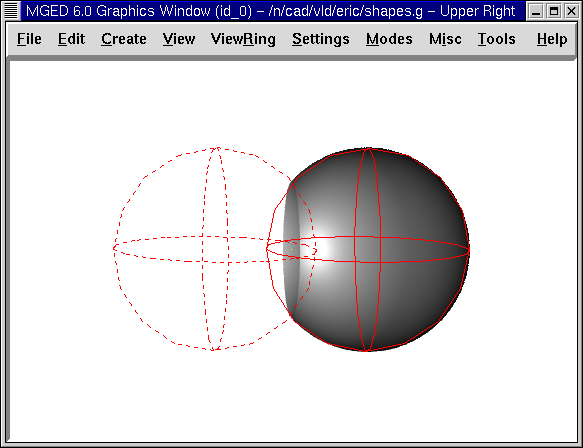
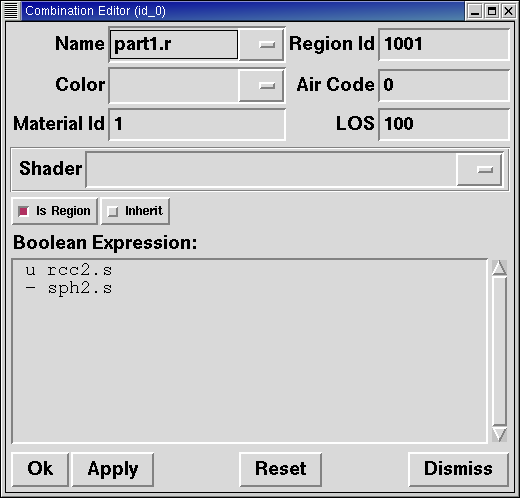
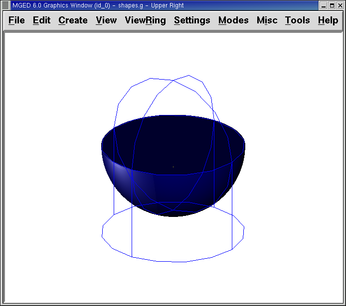
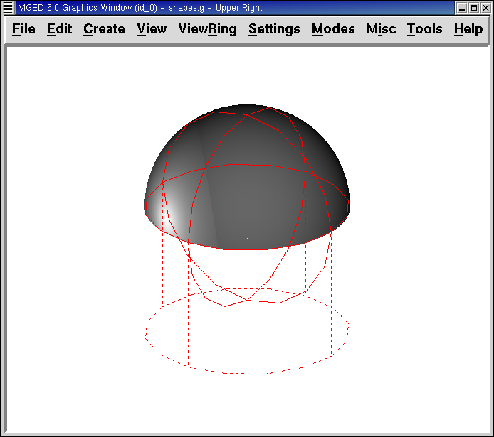
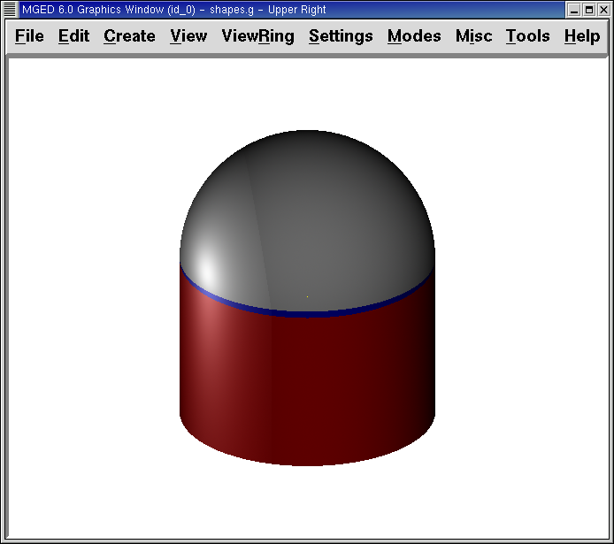

= Learning About Boolean Expressions
Lee A Butler; Eric W Edwards; Betty J Schueler; Robert G Parker; John R Anderson
:doctype: article
:toc:
:toclevels: 3

In this lesson, you will:

* Learn about combinations and regions.
* Learn about Boolean operations.
* Make regions with Boolean operations.

[CAUTION]
====
This is an important lesson because Boolean operations are critical to the modeling process. The order in which shapes are combined and the operators used to combine the shapes will determine how the _MGED_ program interprets your model.

The correct use of Boolean expressions to modify geometric shapes is a key skill in constructive solid modeling. It important to review these concepts as many times as necessary. If it is difficult to absorb them all now, come back to them later.

====

[[boolean_tools]]
== Combinations and Regions: Boolean Tools

There are conceptually two objects in _MGED_ that support Boolean operations. One is called a combination, the other is called a region.

As mentioned earlier, a typical geometric shape in _MGED_ is called a primitive. However, single primitives are often insufficient to fully describe the complex shape of the object being modeled. So, combining two or more primitive shapes into other shapes (called combinations) using Boolean operators allows you to artfully imitate the shape and form of most complicated objects.

The previous chapter noted that material properties are associated with regions. Like combinations, regions use Boolean operations to create complex shapes. The difference is that regions are shapes that have material properties. They occupy three-dimensional space, rather than simply defining a shape in space.

You can think of primitives and combinations as a blueprint for an object. The actual object is created when a region is made. For example, you might make a blueprint of an object such as a coffee mug, but then create that mug from different types of material (e.g., ceramic or glass). Regardless of the material, the blueprint is the same.

When Boolean operations are used to build up complex shapes from simpler shapes, we can call the result a shape combination. When they are used to define other logical or hierarchical structure within the database, the result may be referred to as a group or an assembly combination.

[[boolean_operations]]
== Boolean Operations

The three Boolean operators employed by the _MGED_ program are union, subtraction, and intersection. You can use Boolean operations to combine shapes to produce more complex shapes.

* Union Shapes: Merge two shapes.
* Subtract Shapes: Remove the volume of one shape from another.
* Intersect Shapes: Use only the parts of the two shapes that overlap.

[[Union]]
=== Union

The union operator, u, joins shapes so that any point in at least one of them will be part of the result. Union is a powerful and frequently used operator.

image::../lessons/images/mged05_unionspheres.png[]

[[Subtraction]]
=== Subtraction

When a primitive shape has a second, overlapping shape subtracted from it, the result is that the second shape disappears, together with any common volume it had with the first shape. The - (minus sign) operator signifies subtraction or difference. This operation is especially useful in hollowing a body, removing an oddly shaped piece of a primitive shape, or accounting for edge intersections of walls, plates, piping, or other connected shapes.

In the following example, a dotted red line indicates that the sphere being subtracted extends inside the sphere on the right. This overlapping portion is partially out of view in the raytraced image.

[[Intersection]]
=== Intersection

The Boolean intersection operation, signified by a + (plus sign) operator, combines two primitive shapes that overlap each other, saving only their common volume (the nonoverlapped areas will not be present). An easy way to understand intersections is to think of shapes as roads. The intersection is the place where two roads overlap.

Although many people find intersection operations harder to understand than unions and subtractions, unusual/complex shapes can be expressed using the intersection operator. For example, you can model a magnifying lens as the intersection of two spheres.

The intersection operation is rarely useful unless, as shown in the following figure, at least two shapes overlap. The intersection of two shapes having no common points (i.e., no overlap) is the null set, so it includes no points of space at all.

image::../lessons/images/mged05_intersectionspheres.png[]

There is one important restriction when using the Boolean subtraction and intersection operators. There must be a first shape from which a second shape can be subtracted or intersected. If you have only one shape within a region or combination, the operator will be ignored and the union operator will always be used.

[[making_regions_bool_ops]]
== Making Regions with Boolean Operations

Begin by opening the database shapes.g that you created in Lesson 3. At the Command Window prompt, type: *draw sph2.s rcc2.s[Enter]* This lets us see the shapes we will be using to create our regions. As seen earlier, the two shapes should look something like the following:

image::../lessons/images/mged05_twoprimitivespheres.png[]

In this lesson, we will create different shapes to demonstrate the function of Boolean operations. In the Command Window, type the following: *r part1.r u rcc2.s - sph2.s[Enter]* This command tells _MGED_ to:

[cols="6*"]
[%noheader]
|===
|r
|part1.r
|u
|rcc2.s
|-
|sph2.s
|Make a region
|Call it part1.r
|Merge...
|The shape named rcc2.s
|Subtract...
|The shape named sph2.s
|===

[NOTE]
====
Note: The first member always has a lowercase u for an operator. The second and subsequent members can use -, +, or u as needed. The process of determining which operators to use, and in what order, is discussed in a more advanced tutorial.

====

In the previous lesson, we applied material properties to objects from the Command Line. Now we are going to use the graphical interface to do the same thing. From the Edit menu, choose Combination Editor. This will pop up a dialog box. Select the button to the right of the Name entry box and then Select from All. A drop-down menu will appear with the regions you have created. Select part1.r. The result should look like the following:

Click on the button next to Color and select red from the pull-down menu.

Now click the OK button at the bottom left of the dialog window. This will apply your changes and close the panel.

At the moment, we have only the primitive shapes displayed, not the region. Before we can raytrace, we must remove the primitive shapes from the display, and draw the region. Otherwise, we will not be able to see the region with the color properties we applied. We can do this by typing: *B part1.r*

We are now ready to raytrace this object. From the File menu, bring up the Raytrace Control Panel and click the Raytrace button. The image you get should look similar to the left-hand image that follows. Note that it may take several minutes to raytrace the window, depending on the speed of your particular system.

[cols="2*"]
[%noheader]
|===
|image:../lessons/images/mged05_raytracedpart1.png[]
|
|Raytraced part1.r
|Raytraced part2.r
|===

You should see that a spherical "bite" has been taken out of the top of the cylinder.

Next we will make a blue region using the intersection operator instead of subtraction. Once again, we start by creating a region: *r part2.r u rcc2.s + sph2.s[Enter]*

For comparison to the GUI approach used to make part1.r, let's use the Command Line to assign the color to part2.r: *mater part2.r plastic 0 0 255 0[Enter]*

Finally, Blast this new region onto the display as follows: *B part2.r[Enter]*

Now raytrace the object. It should look similar to the preceding right-hand image.

[NOTE]
====
Note: Remember to clear the Graphics Window and draw your new region or combination before trying to raytrace the model. The raytracer ignores a region or combination that is not drawn in the Graphics Window. The color of the wireframe is your clue. If it doesn't reflect the colors you've assigned (e.g., everything is drawn in red even though you've assigned other colors), then you haven't cleared the screen of the primitive shapes and drawn the new region or combination since the time you made it.

====

When you use the intersection operator, the order in which you specify the shapes doesn't matter. We would have gotten the same results if we had specified the Boolean operation as *r part2.r u sph2.s + rcc2.s*

However, when using the subtraction operator, the order of the two shapes is very important. Let's make a region with the order of the shapes reversed from that used for part1.r: *r part3.r u sph2.s - rcc2.s*

This time we won't bother to set a color. (When no color is set for objects, the raytracer (rt) will use a color of white. However, these objects may appear gray because of the amount of light in the scene.) Blast this design to the display and raytrace it:

Now let's raytrace all three objects we have created together. To draw the three regions at once, we could type: *B part1.r part2.r part3.r*

Doing this once is no problem. However, if these were three parts that made up some complex object, we might like to be able to draw all of them more conveniently. To make drawing a collection of objects together easier, we create an assembly combination to gather them all together. We will create one called dome.c for our three regions. This is accomplished by the following command: *comb dome.c u part1.r u part2.r u part3.r*

Notice the similarity between this command and the r command we used to create the regions.

Remember from the discussion at the beginning of this lesson, the difference between a region and a combination is that combinations are not necessarily composed of only one kind of material. Several objects of different materials can make up an assembly combination such as the one we have just created.

[NOTE]
====
Because creating assembly combinations is a very common task, there is a shortcut command-the g (for group) command-to help make the task easier. Creating dome.c using this command would look as follows: *g dome.c part1.r part2.r part3.r* Notice that you don't have to type the u Boolean operators. The g command unions all of its arguments.

====

All that is necessary to draw all three objects is the much simpler command: *B dome.c*

Now we can raytrace the collected set and get the following image:

[[operator_precedence]]
== Operator Precedence

The shapes we have created here are fairly simple. In each case, a single primitive shape is unioned, and subtraction or intersection operations are performed on that single primitive shape. You should know that it is possible to use much more complex Boolean equations to create the shape of objects. When you want to make such objects, keep in mind the precedence of the Boolean operations. In the Boolean notation we are using, the subtraction and intersection operators both have higher precedence than the union operator has. So, for example: *comb demo.c u shape1 - shape2 u shape3 - shape4 + shape5*

This would result in the following Boolean expression: `(shape1 - shape2) u ( (shape3 - shape4) + shape5)`

[[learning_boolean_operations_review]]
== Review

In this lesson, you:

* Learned about combinations and regions.
* Learned about Boolean operations.
* Made regions with Boolean operations.

