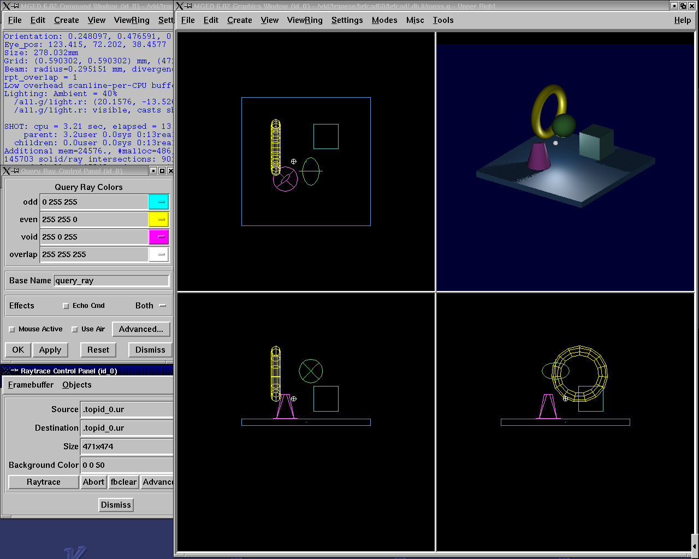
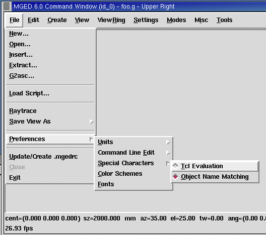
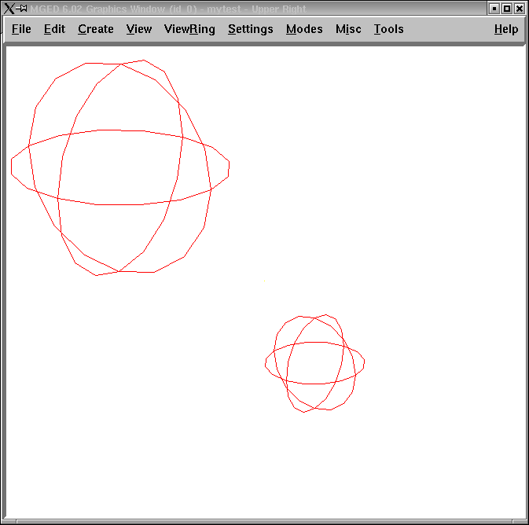
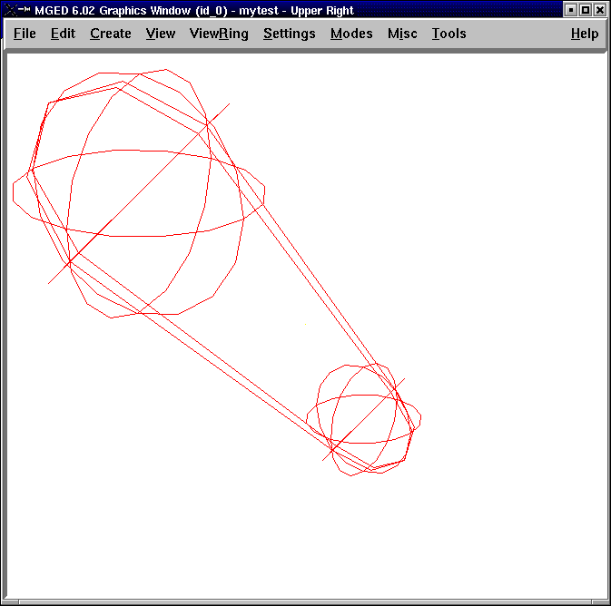
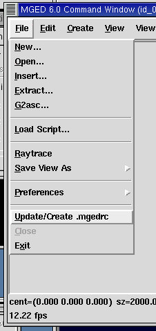

= Introduction to Tcl/Tk
TraNese Christy
:doctype: article
:toc:
:toclevels: 3

== What is Tcl/Tk?

* Tool Command Language/ToolKit.
* Tcl is an embeddable and extensible interpreted language.
* Tk is a toolkit for building user interfaces.
* Combined, they provide a programming system for development and use of GUI applications.

== Benefits of Tcl/Tk

* Ease of providing applications with a powerful scripting language
* An excellent "glue language"
* User convenience
* Portability

== Tcl/Tk-Based GUI for MGED

== Tcl Syntax

* A command is a list of words.
* First word on the command line is the command name, any additional words are arguments.

----

      -- command [arg1 ... argn
      mged> puts "Hello World"
      Hello World
    
----

* Words can be grouped with double quotes (" ") or curly braces ({}).
* Commands are terminated with a newline or semicolon.

== Variables

* Variable names are case-sensitive.
* Declarations are not necessary.
* set _varName [value]_
* Assigns _value_ to the variable _varName_.

----

      mged> set day Friday

      Friday
      mged> set day
      Friday

      mged> set day 25

      25
    
----

== Lists

* An ordered set of strings
* Specified with curly braces

----

      mged> set colors {red yellow green blue}
      red yellow green blue
    
----

* Sometimes created with "list" command

----

      mged> set colors [list red yellow green blue]
      red yellow green blue
    
----

* Can extract elements from the list using the "lindex" command (indices start at zero)

----

      mged> lindex {red yellow green blue} 2
     green
   
----

== Arrays

* Uses associative arrays

** -- Strings used to index the array elements

----

      mged> set profit(January) 1500
      1500
    
----

----

      mged> set profit(February) -200
      -200
    
----

----

    mged> set profit(January)
    1500
  
----

== Special Characters

* Dollar sign $
+
--Substitutes the value of the variable

* Square brackets [ ]
+
-- Replaces contents with the result of evaluating the command

* Backslash \
+
-- Allows special characters such as newlines, [, and $ to be inserted without being treated specially

* Double quotes " "
+
-- Allows special characters to be processed normally

* Curly braces {}
+
-- Disables special characters

* Parentheses ()
+
-- Delimits key values in arrays

* Hashmark #
+
-- At the beginning of a line, signifies a comment to follow

== Special Character Examples

----

      mged> set name Elvis
      Elvis
----

----

      mged> puts "Hello name"
      Hello name
    
----

----

     mged> puts "Hello $name"
     Hello Elvis
   
----

----

      mged> set len [string length $name]
      5
    
----

* -- string length $name returns 5
* -- len gets the value 5

== Special Character Examples (cont'd)

----

      mged> set price 1.41
      1.41
      mged> puts "Gasoline: \$ $price/gallon"
      Gasoline: $1.41/gallon
      mged> puts {Gasoline: \$ $price/gallon}
      Gasoline: \$ $price/gallon
      mged> set product 1; #This is a comment
      1
----

== Special Character Conflicts

* MGED traditional "name globbing" characters conflict with Tcl/Tk usage:

** -- MGED follows Unix shell filename patterns.
** -- Tcl/Tk has different interpretation of * and [].
* Users can select which interpretation of special characters:

** .mgedrc: set MGED variable
** glob_compat_mode
** set glob_compat_mode 0 (for Tcl evaluation)
** set glob_compat_mode 1 (for object name matching)
** Menu: File->Preferences->Special Characters

== Special Character Interpretation

* Special Character Interpretation

== Expressions

* The *expr* command is used to evaluate math expressions.

----

      mged> expr 2 + 2

      4

      mged> expr (3 + 2) * 4

      20

      mged> in ball.s sph 0 0 0 [expr 3 + 4]
----

-- A sphere is created with a vertex (0,0,0) and a radius of 7.

== Control Flow

----

      if {test} {body1} [else {body2}]

      mged> set temp 90

      90

      mged> if {$temp > 75} {

      puts "It's hot"

      } else {

      puts "It's moderate"

      }

      It's hot
    
----

== Control Flow (cont'd)

----

      while {test} {body}

      mged> set time 3

      3

      mged> while {$time > 0} {

      puts "Time is $time"

      set time [expr $time - 1]

      }
----

Time is 3

Time is 2

Time is 1

== Control Flow (cont'd)

----

      for{init} {test} {reinit} {body}
      for {set time 3} {$time > 0} {set time [expr $time - 1]} {puts "Time is $time"}
    
----

Time is 3

Time is 2

Time is 1

== Control Flow (cont'd)

----

      foreach
      varList list{body}
      mged>
      foreach fruit {apples pears peaches} {
      puts "I like $fruit"}
----

I like apples

I like pears

I like peaches

----

      mged>
      foreach {key val} {sky blue grass green snow white} {
      puts "The $key is $val"
      }
    
----

The sky is blue

The grass is green

The snow is white

== MGED Commands

----

     get
     obj[attr]
     Returns a list of the object's attributes. If attr is specified,
      only the value for that attribute is returned.
      mged>
      get foo.r
      comb region yes id 200 los 100 GIFTmater 2 rgb {100 100 100}
      mged>
      get foo.r rgb
      100 100 100
      mged>
      get foo.s
      ell V {0 0 0} A {4 0 0} B {0 4 0} C {0 0 4}
    
----

== MGED Commands (cont'd)

* adjust obj attr value[attr value]

** Modifies the object's attribute(s) by adjusting the value of the attribute(s) to the new value(s).
* ls[-c -r -s]

** Without any options, lists every object in the database.
** With the "c" option, lists all nonhidden combinations; "r" option lists all nonhidden regions; and "s" option lists all nonhidden primitives.

== MGED Examples

* Task: Change the color of all regions to blue.

----

      mged>
      foreach region [ls -r] {
      adjust $region rgb {0 0 255}
      }
    
----

* Task: Print all regions with nonzero air codes.

Task: Print all regions with nonzero air codes.

----

      mged>
      foreach reg [ls -r] {
      if {[get $reg air] != 0} {
      puts "$reg"
      }
      }
    
----

== MGED Examples (cont'd)

* Task: Print all objects with the inherit flag set.

----

      mged> foreach obj [ls -c] {
      if {[get $obj inherit] == "yes"} {
      puts "$obj"
      }
      }
    
----

== Procedures

* User-Defined commands
* proc

----

      procName{args} {body}
      mged>
      proc add {x y} {
      set answer [expr $x + $y]
      return $answer
      }
      mged>add 123 456
      579
----

* Create new MGED commands
* Save in .mgedrc

== Procedure Example

* Procedure that generates a PART that encompasses two specified SPHs

----

    proc sph-part {sph1 sph2 newname} {
    foreach {vx1 vy1 vz1} [lindex [get $sph1 V] 0] {}
    foreach {vx2 vy2 vz2} [lindex [get $sph2 V] 0] {}
    foreach {ax1 ay1 az1} [lindex [get $sph1 A] 0] {}
    foreach {ax2 ay2 az2} [lindex [get $sph2 A] 0] {}
    set radius1 [expr sqrt($ax1*$ax1 + $ay1*$ay1 + $az1*$az1)]
    set radius2 [expr sqrt($ax2*$ax2 + $ay2*$ay2 + $az2*$az2)]
    set hx [expr $vx2-$vx1]
    set hy [expr $vy2-$vy1]
    set hz [expr $vz2-$vz1]
    in $newname part $vx1 $vy1 $vz1 $hx $hy $hz $radius1 $radius2
    }
  
----

== Procedure Example (cont'd)

----

 mged>
sph-part s1.s s2.s part.s
----

== The "source" Command

* source _fileName_

** Reads and executes the file as a Tcl script.
* Create the file with a text editor.
* Reload the file with "source" changes are made.
* The proc or the source command can be placed in .mgedrc.

== MGED Defaults

* Create the default .mgedrc from inside MGED:

== MGED Customization

* Placed in the file

.mgedrc

In local directory or home

############### MGEDRC_HEADER ###############

# You can modify the values below. However, if you want

# to add new lines, add them above the MGEDRC_HEADER.

# Note - it's not a good idea to set the same variables

# above the MGEDRC_HEADER that are set below (i.e., the last

# value set wins).

# Determines the maximum number of lines of

# output displayed in the command window

set mged_default(max_text_lines) 1000

== [incr Tcl/Tk]

* Object-oriented extension to Tcl.
* Provides support to build large programs.
* New applications in BRL-CAD are being written in [incr Tcl/Tk].

== Useful References

* Raines, Paul. _Tcl/Tk Pocket Reference_. O'Reilly & Associates, Inc., Sebastopol, CA, 1998.
* Ousterhout, John K. _Tcl and the Tk Toolkit_. Addison-Wesley, Reading, MA, 1994.
* Welch, Brent B. _Practical Programming in Tcl and Tk, Second Edition_. Prentice Hall, Upper Saddle River, NJ, 1997.
